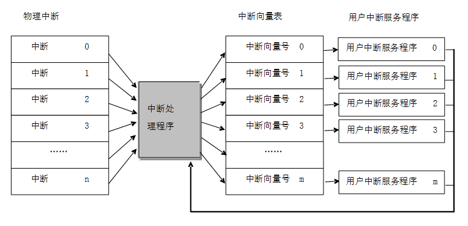

# 中断管理

什么是中断？简单的解释就是系统正在处理某一个正常事件，忽然被另一个需要马上处理的紧急事件打断，系统转而处理这个紧急事件，待处理完毕，再恢复运行刚才被打断的事件。生活中，我们经常会遇到这样的场景：

当你正在专心看书的时候，忽然来了一个电话，于是记下书的页码，去接电话，接完电话后接着刚才的页码继续看书，这是一个典型的中断的过程。

电话是老师打过来的，让你赶快交作业，你判断交作业的优先级比看书高，于是电话挂断后先做作业，等交完作业后再接着刚才的页码继续看书，这是一个典型的在中断中进行任务调度的过程。

这些场景在嵌入式系统中也很常见，当 CPU 正在处理内部数据时，外界发生了紧急情况，要求 CPU 暂停当前的工作转去处理这个 [异步事件](https://baike.baidu.com/item/%E7%B4%A7%E6%80%A5%E4%BA%8B%E4%BB%B6)。处理完毕后，再回到原来被中断的地址，继续原来的工作，这样的过程称为中断。实现这一功能的系统称为 [中断系统](https://baike.baidu.com/item/%E4%B8%AD%E6%96%AD%E7%B3%BB%E7%BB%9F)，申请 CPU 中断的请求源称为 [中断源](https://baike.baidu.com/item/%E4%B8%AD%E6%96%AD%E6%BA%90)。中断是一种异常，异常是导致处理器脱离正常运行转向执行特殊代码的任何事件，如果不及时进行处理，轻则系统出错，重则会导致系统毁灭性地瘫痪。所以正确地处理异常，避免错误的发生是提高软件鲁棒性（稳定性）非常重要的一环。如下图是一个简单的中断示意图。


中断处理与 CPU 架构密切相关，所以，本章会先介绍 ARM Cortex-M 的 CPU 架构，然后结合 Cortex-M CPU 架构来介绍 RT-Thread 的中断管理机制，读完本章，大家将深入了解 RT-Thread 的中断处理过程，如何添加中断服务程序（ISR）以及相关的注意事项。

## Cortex-M CPU 架构基础

不同于老的经典 ARM 处理器（例如：ARM7, ARM9），ARM Cortex-M 处理器有一个非常不同的架构，Cortex-M 是一个家族系列，其中包括 Cortex M0/M3/M4/M7 多个不同型号，每个型号之间会有些区别，例如 Cortex-M4 比 Cortex-M3 多了浮点计算功能等，但它们的编程模型基本是一致的，因此本书中介绍中断管理和移植的部分都不会对 Cortex M0/M3/M4/M7 做太精细的区分。本节主要介绍和 RT-Thread 中断管理相关的架构部分。

### 寄存器简介

Cortex-M 系列 CPU 的寄存器组里有 R0\~R15 共 16 个通用寄存器组和若干特殊功能寄存器，如下图所示。

通用寄存器组里的 R13 作为堆栈指针寄存器 (Stack Pointer，SP)；R14 作为连接寄存器 (Link Register，LR)，用于在调用子程序时，存储返回地址；R15 作为程序计数器 (Program Counter，PC)，其中堆栈指针寄存器可以是主堆栈指针（MSP），也可以是进程堆栈指针（PSP）。


特殊功能寄存器包括程序状态字寄存器组（PSRs）、中断屏蔽寄存器组（PRIMASK, FAULTMASK, BASEPRI）、控制寄存器（CONTROL），可以通过 MSR/MRS 指令来访问特殊功能寄存器，例如：

```
MRS R0, CONTROL ; 读取 CONTROL 到 R0 中
MSR CONTROL, R0 ; 写入 R0 到 CONTROL 寄存器中
```

程序状态字寄存器里保存算术与逻辑标志，例如负数标志，零结果标志，溢出标志等等。中断屏蔽寄存器组控制 Cortex-M 的中断除能。控制寄存器用来定义特权级别和当前使用哪个堆栈指针。

如果是具有浮点单元的 Cortex-M4 或者 Cortex-M7，控制寄存器也用来指示浮点单元当前是否在使用，浮点单元包含了 32 个浮点通用寄存器 S0\~S31 和特殊 FPSCR 寄存器（Floating point status and control register）。

### 操作模式和特权级别

Cortex-M 引入了操作模式和特权级别的概念，分别为线程模式和处理模式，如果进入异常或中断处理则进入处理模式，其他情况则为线程模式。


Cortex-M 有两个运行级别，分别为特权级和用户级，线程模式可以工作在特权级或者用户级，而处理模式总工作在特权级，可通过 CONTROL 特殊寄存器控制。工作模式状态切换情况如上图所示。

Cortex-M 的堆栈寄存器 SP 对应两个物理寄存器 MSP 和 PSP，MSP 为主堆栈，PSP 为进程堆栈，处理模式总是使用 MSP 作为堆栈，线程模式可以选择使用 MSP 或 PSP 作为堆栈，同样通过 CONTROL 特殊寄存器控制。复位后，Cortex-M 默认进入线程模式、特权级、使用 MSP 堆栈。

### 嵌套向量中断控制器

Cortex-M 中断控制器名为 NVIC（嵌套向量中断控制器），支持中断嵌套功能。当一个中断触发并且系统进行响应时，处理器硬件会将当前运行位置的上下文寄存器自动压入中断栈中，这部分的寄存器包括 PSR、PC、LR、R12、R3-R0 寄存器。


当系统正在服务一个中断时，如果有一个更高优先级的中断触发，那么处理器同样会打断当前运行的中断服务程序，然后把这个中断服务程序上下文的 PSR、PC、LR、R12、R3-R0 寄存器自动保存到中断栈中。

### PendSV 系统调用

PendSV 也称为可悬起的系统调用，它是一种异常，可以像普通的中断一样被挂起，它是专门用来辅助操作系统进行上下文切换的。PendSV 异常会被初始化为最低优先级的异常。每次需要进行上下文切换的时候，会手动触发 PendSV 异常，在 PendSV 异常处理函数中进行上下文切换。在下一章《内核移植》中会详细介绍利用 PendSV 机制进行操作系统上下文切换的详细流程。

## RT-Thread 中断工作机制

### 中断向量表

中断向量表是所有中断处理程序的入口，如下图所示是 Cortex-M 系列的中断处理过程：把一个函数（用户中断服务程序）同一个虚拟中断向量表中的中断向量联系在一起。当中断向量对应中断发生的时候，被挂接的用户中断服务程序就会被调用执行。



在 Cortex-M 内核上，所有中断都采用中断向量表的方式进行处理，即当一个中断触发时，处理器将直接判定是哪个中断源，然后直接跳转到相应的固定位置进行处理，每个中断服务程序必须排列在一起放在统一的地址上（这个地址必须要设置到 NVIC 的中断向量偏移寄存器中）。中断向量表一般由一个数组定义或在起始代码中给出，默认采用起始代码给出：

```c
  __Vectors     DCD     __initial_sp             ; Top of Stack
                DCD     Reset_Handler            ; Reset 处理函数
                DCD     NMI_Handler              ; NMI 处理函数
                DCD     HardFault_Handler        ; Hard Fault 处理函数
                DCD     MemManage_Handler        ; MPU Fault 处理函数
                DCD     BusFault_Handler         ; Bus Fault 处理函数
                DCD     UsageFault_Handler       ; Usage Fault 处理函数
                DCD     0                        ; 保留
                DCD     0                        ; 保留
                DCD     0                        ; 保留
                DCD     0                        ; 保留
                DCD     SVC_Handler              ; SVCall 处理函数
                DCD     DebugMon_Handler         ; Debug Monitor 处理函数
                DCD     0                        ; 保留
                DCD     PendSV_Handler           ; PendSV 处理函数
                DCD     SysTick_Handler          ; SysTick 处理函数

… …

NMI_Handler             PROC
                EXPORT NMI_Handler              [WEAK]
                B       .
                ENDP
HardFault_Handler       PROC
                EXPORT HardFault_Handler        [WEAK]
                B       .
                ENDP
… …
```

请注意代码后面的 [WEAK] 标识，它是符号弱化标识，在 [WEAK] 前面的符号(如 NMI_Handler、HardFault_Handler）将被执行弱化处理，如果整个代码在链接时遇到了名称相同的符号（例如与 NMI_Handler 相同名称的函数），那么代码将使用未被弱化定义的符号（与 NMI_Handler 相同名称的函数），而与弱化符号相关的代码将被自动丢弃。

以 SysTick 中断为例，在系统启动代码中，需要填上 SysTick_Handler 中断入口函数，然后实现该函数即可对 SysTick 中断进行响应，中断处理函数示例程序如下所示：

```c
void SysTick_Handler(void)
{
    /* enter interrupt */
    rt_interrupt_enter();

    rt_tick_increase();

    /* leave interrupt */
    rt_interrupt_leave();
}
```

### 中断处理过程

RT-Thread 中断管理中，将中断处理程序分为中断前导程序、用户中断服务程序、中断后续程序三部分，如下图：


#### 中断前导程序

中断前导程序主要工作如下：

1）保存 CPU 中断现场，这部分跟 CPU 架构相关，不同 CPU 架构的实现方式有差异。

对于 Cortex-M 来说，该工作由硬件自动完成。当一个中断触发并且系统进行响应时，处理器硬件会将当前运行部分的上下文寄存器自动压入中断栈中，这部分的寄存器包括 PSR、PC、LR、R12、R3-R0 寄存器。

2）通知内核进入中断状态，调用 rt_interrupt_enter() 函数，作用是把全局变量 rt_interrupt_nest 加 1，用它来记录中断嵌套的层数，代码如下所示。

```c
void rt_interrupt_enter(void)
{
    rt_base_t level;

    level = rt_hw_interrupt_disable();
    rt_interrupt_nest ++;
    rt_hw_interrupt_enable(level);
}
```

#### 用户中断服务程序

在用户中断服务程序（ISR）中，分为两种情况，第一种情况是不进行线程切换，这种情况下用户中断服务程序和中断后续程序运行完毕后退出中断模式，返回被中断的线程。

另一种情况是，在中断处理过程中需要进行线程切换，这种情况会调用 rt_hw_context_switch_interrupt() 函数进行上下文切换，该函数跟 CPU 架构相关，不同 CPU 架构的实现方式有差异。

在 Cortex-M 架构中，rt_hw_context_switch_interrupt() 的函数实现流程如下图所示，它将设置需要切换的线程 rt_interrupt_to_thread 变量，然后触发 PendSV 异常（PendSV 异常是专门用来辅助上下文切换的，且被初始化为最低优先级的异常）。PendSV 异常被触发后，不会立即进行 PendSV 异常中断处理程序，因为此时还在中断处理中，只有当中断后续程序运行完毕，真正退出中断处理后，才进入 PendSV 异常中断处理程序。


#### 中断后续程序

中断后续程序主要完成的工作是:

1 通知内核离开中断状态，通过调用 rt_interrupt_leave() 函数，将全局变量 rt_interrupt_nest 减 1，代码如下所示。

```c
void rt_interrupt_leave(void)
{
    rt_base_t level;

    level = rt_hw_interrupt_disable();
    rt_interrupt_nest --;
    rt_hw_interrupt_enable(level);
}
```

2 恢复中断前的 CPU 上下文，如果在中断处理过程中未进行线程切换，那么恢复 from 线程的 CPU 上下文，如果在中断中进行了线程切换，那么恢复 to 线程的 CPU 上下文。这部分实现跟 CPU 架构相关，不同 CPU 架构的实现方式有差异，在 Cortex-M 架构中实现流程如下图所示。


### 中断嵌套

在允许中断嵌套的情况下，在执行中断服务程序的过程中，如果出现高优先级的中断，当前中断服务程序的执行将被打断，以执行高优先级中断的中断服务程序，当高优先级中断的处理完成后，被打断的中断服务程序才又得到继续执行，如果需要进行线程调度，线程的上下文切换将在所有中断处理程序都运行结束时才发生，如下图所示。


### 中断栈

在中断处理过程中，在系统响应中断前，软件代码（或处理器）需要把当前线程的上下文保存下来（通常保存在当前线程的线程栈中），再调用中断服务程序进行中断响应、处理。在进行中断处理时（实质是调用用户的中断服务程序函数），中断处理函数中很可能会有自己的局部变量，这些都需要相应的栈空间来保存，所以中断响应依然需要一个栈空间来做为上下文，运行中断处理函数。中断栈可以保存在打断线程的栈中，当从中断中退出时，返回相应的线程继续执行。

中断栈也可以与线程栈完全分离开来，即每次进入中断时，在保存完打断线程上下文后，切换到新的中断栈中独立运行。在中断退出时，再做相应的上下文恢复。使用独立中断栈相对来说更容易实现，并且对于线程栈使用情况也比较容易了解和掌握（否则必须要为中断栈预留空间，如果系统支持中断嵌套，还需要考虑应该为嵌套中断预留多大的空间）。

RT-Thread 采用的方式是提供独立的中断栈，即中断发生时，中断的前期处理程序会将用户的栈指针更换到系统事先留出的中断栈空间中，等中断退出时再恢复用户的栈指针。这样中断就不会占用线程的栈空间，从而提高了内存空间的利用率，且随着线程的增加，这种减少内存占用的效果也越明显。

在 Cortex-M 处理器内核里有两个堆栈指针，一个是主堆栈指针（MSP），是默认的堆栈指针，在运行第一个线程之前和在中断和异常服务程序里使用；另一个是线程堆栈指针（PSP），在线程里使用。在中断和异常服务程序退出时，修改 LR 寄存器的第 2 位的值为 1，线程的 SP 就由 MSP 切换到 PSP。

### 中断的底半处理

RT-Thread 不对中断服务程序所需要的处理时间做任何假设、限制，但如同其他实时操作系统或非实时操作系统一样，用户需要保证所有的中断服务程序在尽可能短的时间内完成（中断服务程序在系统中相当于拥有最高的优先级，会抢占所有线程优先执行）。这样在发生中断嵌套，或屏蔽了相应中断源的过程中，不会耽误嵌套的其他中断处理过程，或自身中断源的下一次中断信号。

当一个中断发生时，中断服务程序需要取得相应的硬件状态或者数据。如果中断服务程序接下来要对状态或者数据进行简单处理，比如 CPU 时钟中断，中断服务程序只需对一个系统时钟变量进行加一操作，然后就结束中断服务程序。这类中断需要的运行时间往往都比较短。但对于另外一些中断，中断服务程序在取得硬件状态或数据以后，还需要进行一系列更耗时的处理过程，通常需要将该中断分割为两部分，即**上半部分**（Top Half）和**底半部分**（Bottom Half）。在上半部分中，取得硬件状态和数据后，打开被屏蔽的中断，给相关线程发送一条通知（可以是 RT-Thread 所提供的信号量、事件、邮箱或消息队列等方式），然后结束中断服务程序；而接下来，相关的线程在接收到通知后，接着对状态或数据进行进一步的处理，这一过程称之为**底半处理**。

为了详细描述底半处理在 RT-Thread 中的实现，我们以一个虚拟的网络设备接收网络数据包作为范例，如下代码，并假设接收到数据报文后，系统对报文的分析、处理是一个相对耗时的，比外部中断源信号重要性小许多的，而且在不屏蔽中断源信号情况下也能处理的过程。

这个例子的程序创建了一个 nwt 线程，这个线程在启动运行后，将阻塞在 nw_bh_sem 信号上，一旦这个信号量被释放，将执行接下来的 nw_packet_parser 过程，开始 Bottom Half 的事件处理。

```c
/*
 * 程序清单：中断底半处理例子
 */

/* 用于唤醒线程的信号量 */
rt_sem_t nw_bh_sem;

/* 数据读取、分析的线程 */
void demo_nw_thread(void *param)
{
    /* 首先对设备进行必要的初始化工作 */
    device_init_setting();

    /*.. 其他的一些操作..*/

    /* 创建一个 semaphore 来响应 Bottom Half 的事件 */
    nw_bh_sem = rt_sem_create("bh_sem", 0, RT_IPC_FLAG_PRIO);

    while(1)
    {
        /* 最后，让 demo_nw_thread 等待在 nw_bh_sem 上 */
        rt_sem_take(nw_bh_sem, RT_WAITING_FOREVER);

        /* 接收到 semaphore 信号后，开始真正的 Bottom Half 处理过程 */
        nw_packet_parser (packet_buffer);
        nw_packet_process(packet_buffer);
    }
}

int main(void)
{
    rt_thread_t thread;

    /* 创建处理线程 */
    thread = rt_thread_create("nwt",demo_nw_thread, RT_NULL, 1024, 20, 5);

    if (thread != RT_NULL)
        rt_thread_startup(thread);
}
```

接下来让我们来看一下 demo_nw_isr 中是如何处理 Top Half，并开启 Bottom Half 的，如下例。

```c
void demo_nw_isr(int vector, void *param)
{
    /* 当 network 设备接收到数据后，陷入中断异常，开始执行此 ISR */
    /* 开始 Top Half 部分的处理，如读取硬件设备的状态以判断发生了何种中断 */
    nw_device_status_read();

    /*.. 其他一些数据操作等..*/

    /* 释放 nw_bh_sem，发送信号给 demo_nw_thread，准备开始 Bottom Half */
    rt_sem_release(nw_bh_sem);

    /* 然后退出中断的 Top Half 部分，结束 device 的 ISR */
}
```

从上面例子的两个代码片段可以看出，中断服务程序通过对一个信号量对象的等待和释放，来完成中断 Bottom Half 的起始和终结。由于将中断处理划分为 Top 和 Bottom 两个部分后，使得中断处理过程变为异步过程。这部分系统开销需要用户在使用 RT-Thread 时，必须认真考虑中断服务的处理时间是否大于给 Bottom Half 发送通知并处理的时间。

RT-Thread 中断管理接口
---------------------

为了把操作系统和系统底层的异常、中断硬件隔离开来，RT-Thread 把中断和异常封装为一组抽象接口，如下图所示：


### 中断服务程序挂接

系统把用户的中断服务程序 (handler) 和指定的中断号关联起来，可调用如下的接口挂载一个新的中断服务程序：

```c
rt_isr_handler_t rt_hw_interrupt_install(int vector,
                                        rt_isr_handler_t  handler,
                                        void *param,
                                        char *name);
```

调用 rt_hw_interrupt_install() 后，当这个中断源产生中断时，系统将自动调用装载的中断服务程序。下表描述了此函数的输入参数和返回值：

  rt_hw_interrupt_install() 的输入参数和返回值

|**参数**|**描述**                                        |
|----------|--------------------------------------------------|
| vector   | vector 是挂载的中断号                             |
| handler  | 新挂载的中断服务程序                             |
| param    | param 会作为参数传递给中断服务程序                |
| name     | 中断的名称                                       |
|**返回**| ——                                               |
| return   | 挂载这个中断服务程序之前挂载的中断服务程序的句柄 |

> [!NOTE]
> 注：这个 API 并不会出现在每一个移植分支中，例如通常 Cortex-M0/M3/M4 的移植分支中就没有这个 API。

中断服务程序是一种需要特别注意的运行环境，它运行在非线程的执行环境下（一般为芯片的一种特殊运行模式（特权模式）），在这个运行环境中不能使用挂起当前线程的操作，因为当前线程并不存在，执行相关的操作会有类似打印提示信息，“Function [abc_func] shall not used in ISR”，含义是不应该在中断服务程序中调用的函数）。

### 中断源管理

通常在 ISR 准备处理某个中断信号之前，我们需要先屏蔽该中断源，在 ISR 处理完状态或数据以后，及时的打开之前被屏蔽的中断源。

屏蔽中断源可以保证在接下来的处理过程中硬件状态或者数据不会受到干扰，可调用下面这个函数接口：

```c
void rt_hw_interrupt_mask(int vector);
```

调用 rt_hw_interrupt_mask 函数接口后，相应的中断将会被屏蔽（通常当这个中断触发时，中断状态寄存器会有相应的变化，但并不送达到处理器进行处理）。下表描述了此函数的输入参数：

  rt_hw_interrupt_mask() 的输入参数

|**参数**|**描述**      |
|----------|----------------|
| vector   | 要屏蔽的中断号 |

> [!NOTE]
> 注：这个 API 并不会出现在每一个移植分支中，例如通常 Cortex-M0/M3/M4 的移植分支中就没有这个 API。

为了尽可能的不丢失硬件中断信号，可调用下面的函数接口打开被屏蔽的中断源：

```c
void rt_hw_interrupt_umask(int vector);
```

调用 rt_hw_interrupt_umask 函数接口后，如果中断（及对应外设）被配置正确时，中断触发后，将送到到处理器进行处理。下表描述了此函数的输入参数：

  rt_hw_interrupt_umask() 的输入参数

|**参数**|**描述**          |
|----------|--------------------|
| vector   | 要打开屏蔽的中断号 |

> [!NOTE]
> 注：这个 API 并不会出现在每一个移植分支中，例如通常 Cortex-M0/M3/M4 的移植分支中就没有这个 API。

### 全局中断开关

**全局中断开关也称为**中断锁，是禁止多线程访问临界区最简单的一种方式，即通过关闭中断的方式，来保证当前线程不会被其他事件打断（因为整个系统已经不再响应那些可以触发线程重新调度的外部事件），也就是当前线程不会被抢占，除非这个线程主动放弃了处理器控制权。当需要关闭整个系统的中断时，可调用下面的函数接口：

```c
rt_base_t rt_hw_interrupt_disable(void);
```

下表描述了此函数的返回值：

  rt_hw_interrupt_disable() 的返回值

|**返回**|**描述**                                   |
|----------|---------------------------------------------|
| 中断状态 | rt_hw_interrupt_disable 函数运行前的中断状态 |

恢复中断也称开中断。rt_hw_interrupt_enable()这个函数用于 “使能” 中断，它恢复了调用 rt_hw_interrupt_disable()函数前的中断状态。如果调用 rt_hw_interrupt_disable()函数前是关中断状态，那么调用此函数后依然是关中断状态。恢复中断往往是和关闭中断成对使用的，调用的函数接口如下：

```c
void rt_hw_interrupt_enable(rt_base_t level);
```

下表描述了此函数的输入参数：

  rt_hw_interrupt_enable() 的输入参数

|**参数**|**描述**                                   |
|----------|---------------------------------------------|
| level    | 前一次 rt_hw_interrupt_disable 返回的中断状态 |

1）使用中断锁来操作临界区的方法可以应用于任何场合，且其他几类同步方式都是依赖于中断锁而实现的，可以说中断锁是最强大的和最高效的同步方法。只是使用中断锁最主要的问题在于，在中断关闭期间系统将不再响应任何中断，也就不能响应外部的事件。所以中断锁对系统的实时性影响非常巨大，当使用不当的时候会导致系统完全无实时性可言（可能导致系统完全偏离要求的时间需求）；而使用得当，则会变成一种快速、高效的同步方式。

例如，为了保证一行代码（例如赋值）的互斥运行，最快速的方法是使用中断锁而不是信号量或互斥量：

```c
    /* 关闭中断 */
    level = rt_hw_interrupt_disable();
    a = a + value;
    /* 恢复中断 */
    rt_hw_interrupt_enable(level);
```

在使用中断锁时，需要确保关闭中断的时间非常短，例如上面代码中的 a = a + value; 也可换成另外一种方式，例如使用信号量：

```c
    /* 获得信号量锁 */
    rt_sem_take(sem_lock, RT_WAITING_FOREVER);
    a = a + value;
    /* 释放信号量锁 */
    rt_sem_release(sem_lock);
```

这段代码在 rt_sem_take 、rt_sem_release 的实现中，已经存在使用中断锁保护信号量内部变量的行为，所以对于简单如 a = a + value; 的操作，使用中断锁将更为简洁快速。

2）函数 rt_base_t rt_hw_interrupt_disable(void) 和函数 void rt_hw_interrupt_enable(rt_base_t level) 一般需要配对使用，从而保证正确的中断状态。

在 RT-Thread 中，开关全局中断的 API 支持多级嵌套使用，简单嵌套中断的代码如下代码所示：

  简单嵌套中断使用

```c
#include <rthw.h>

void global_interrupt_demo(void)
{
    rt_base_t level0;
    rt_base_t level1;

    /* 第一次关闭全局中断，关闭之前的全局中断状态可能是打开的，也可能是关闭的 */
    level0 = rt_hw_interrupt_disable();
    /* 第二次关闭全局中断，关闭之前的全局中断是关闭的，关闭之后全局中断还是关闭的 */
    level1 = rt_hw_interrupt_disable();

    do_something();

    /* 恢复全局中断到第二次关闭之前的状态，所以本次 enable 之后全局中断还是关闭的 */
    rt_hw_interrupt_enable(level1);
    /* 恢复全局中断到第一次关闭之前的状态，这时候的全局中断状态可能是打开的，也可能是关闭的 */
    rt_hw_interrupt_enable(level0);
}
```

这个特性可以给代码的开发带来很大的便利。例如在某个函数里关闭了中断，然后调用某些子函数，再打开中断。这些子函数里面也可能存在开关中断的代码。由于全局中断的 API 支持嵌套使用，用户无需为这些代码做特殊处理。

### 中断通知

当整个系统被中断打断，进入中断处理函数时，需要通知内核当前已经进入到中断状态。针对这种情况，可通过以下接口：

```c
void rt_interrupt_enter(void);
void rt_interrupt_leave(void);
```

这两个接口分别用在中断前导程序和中断后续程序中，均会对 rt_interrupt_nest（中断嵌套深度）的值进行修改：

每当进入中断时，可以调用 rt_interrupt_enter() 函数，用于通知内核，当前已经进入了中断状态，并增加中断嵌套深度（执行 rt_interrupt_nest++）；

每当退出中断时，可以调用 rt_interrupt_leave() 函数，用于通知内核，当前已经离开了中断状态，并减少中断嵌套深度（执行 rt_interrupt_nest
--）。注意不要在应用程序中调用这两个接口函数。

使用 rt_interrupt_enter/leave() 的作用是，在中断服务程序中，如果调用了内核相关的函数（如释放信号量等操作），则可以通过判断当前中断状态，让内核及时调整相应的行为。例如：在中断中释放了一个信号量，唤醒了某线程，但通过判断发现当前系统处于中断上下文环境中，那么在进行线程切换时应该采取中断中线程切换的策略，而不是立即进行切换。

但如果中断服务程序不会调用内核相关的函数（释放信号量等操作），这个时候，也可以不调用 rt_interrupt_enter/leave() 函数。

在上层应用中，在内核需要知道当前已经进入到中断状态或当前嵌套的中断深度时，可调用 rt_interrupt_get_nest() 接口，它会返回 rt_interrupt_nest。如下：

```c
rt_uint8_t rt_interrupt_get_nest(void);
```

下表描述了 rt_interrupt_get_nest() 的返回值

|**返回**|**描述**                      |
|----------|--------------------------------|
| 0        | 当前系统不处于中断上下文环境中 |
| 1        | 当前系统处于中断上下文环境中   |
| 大于 1    | 当前中断嵌套层次               |

中断与轮询
----------

当驱动外设工作时，其编程模式到底采用中断模式触发还是轮询模式触发往往是驱动开发人员首先要考虑的问题，并且这个问题在实时操作系统与分时操作系统中差异还非常大。因为轮询模式本身采用顺序执行的方式：查询到相应的事件然后进行对应的处理。所以轮询模式从实现上来说，相对简单清晰。例如往串口中写入数据，仅当串口控制器写完一个数据时，程序代码才写入下一个数据（否则这个数据丢弃掉）。相应的代码可以是这样的：

```c
/* 轮询模式向串口写入数据 */
    while (size)
    {
        /* 判断 UART 外设中数据是否发送完毕 */
        while (!(uart->uart_device->SR & USART_FLAG_TXE));
        /* 当所有数据发送完毕后，才发送下一个数据 */
        uart->uart_device->DR = (*ptr & 0x1FF);

        ++ptr; --size;
    }
```

在实时系统中轮询模式可能会出现非常大问题，因为在实时操作系统中，当一个程序持续地执行时（轮询时），它所在的线程会一直运行，比它优先级低的线程都不会得到运行。而分时系统中，这点恰恰相反，几乎没有优先级之分，可以在一个时间片运行这个程序，然后在另外一段时间片上运行另外一段程序。

所以通常情况下，实时系统中更多采用的是中断模式来驱动外设。当数据达到时，由中断唤醒相关的处理线程，再继续进行后续的动作。例如一些携带 FIFO（包含一定数据量的先进先出队列）的串口外设，其写入过程可以是这样的，如下图所示：


线程先向串口的 FIFO 中写入数据，当 FIFO 满时，线程主动挂起。串口控制器持续地从 FIFO 中取出数据并以配置的波特率（例如 115200bps）发送出去。当 FIFO 中所有数据都发送完成时，将向处理器触发一个中断；当中断服务程序得到执行时，可以唤醒这个线程。这里举例的是 FIFO 类型的设备，在现实中也有 DMA 类型的设备，原理类似。

对于低速设备来说，运用这种模式非常好，因为在串口外设把 FIFO 中的数据发送出去前，处理器可以运行其他的线程，这样就提高了系统的整体运行效率（甚至对于分时系统来说，这样的设计也是非常必要）。但是对于一些高速设备，例如传输速度达到 10Mbps 的时候，假设一次发送的数据量是 32 字节，我们可以计算出发送这样一段数据量需要的时间是：(32 X 8) X  1/10Mbps = 25us。当数据需要持续传输时，系统将在 25us 后触发一个中断以唤醒上层线程继续下次传递。假设系统的线程切换时间是 8us（通常实时操作系统的线程上下文切换时间只有几个 us），那么当整个系统运行时，对于数据带宽利用率将只有 25/(25+8) =75.8%。但是采用轮询模式，数据带宽的利用率则可能达到 100%。这个也是大家普遍认为实时系统中数据吞吐量不足的缘故，系统开销消耗在了线程切换上（有些实时系统甚至会如本章前面说的，采用底半处理，分级的中断处理方式，相当于又拉长中断到发送线程的时间开销，效率会更进一步下降）。

通过上述的计算过程，我们可以看出其中的一些关键因素：发送数据量越小，发送速度越快，对于数据吞吐量的影响也将越大。归根结底，取决于系统中产生中断的频度如何。当一个实时系统想要提升数据吞吐量时，可以考虑的几种方式：

1）增加每次数据量发送的长度，每次尽量让外设尽量多地发送数据；

2）必要情况下更改中断模式为轮询模式。同时为了解决轮询方式一直抢占处理机，其他低优先级线程得不到运行的情况，可以把轮询线程的优先级适当降低。

全局中断开关使用示例
--------------------

这是一个中断的应用例程：在多线程访问同一个变量时，使用开关全局中断对该变量进行保护，如下代码所示：

  使用开关中断进行全局变量的访问

```c
#include <rthw.h>
#include <rtthread.h>

#define THREAD_PRIORITY      20
#define THREAD_STACK_SIZE    512
#define THREAD_TIMESLICE     5

/* 同时访问的全局变量 */
static rt_uint32_t cnt;
void thread_entry(void *parameter)
{
    rt_uint32_t no;
    rt_uint32_t level;

    no = (rt_uint32_t) parameter;
    while (1)
    {
        /* 关闭全局中断 */
        level = rt_hw_interrupt_disable();
        cnt += no;
        /* 恢复全局中断 */
        rt_hw_interrupt_enable(level);

        rt_kprintf("protect thread[%d]'s counter is %d\n", no, cnt);
        rt_thread_mdelay(no * 10);
    }
}

/* 用户应用程序入口 */
int interrupt_sample(void)
{
    rt_thread_t thread;

    /* 创建 t1 线程 */
    thread = rt_thread_create("thread1", thread_entry, (void *)10,
                              THREAD_STACK_SIZE,
                              THREAD_PRIORITY, THREAD_TIMESLICE);
    if (thread != RT_NULL)
        rt_thread_startup(thread);


    /* 创建 t2 线程 */
    thread = rt_thread_create("thread2", thread_entry, (void *)20,
                              THREAD_STACK_SIZE,
                              THREAD_PRIORITY, THREAD_TIMESLICE);
    if (thread != RT_NULL)
        rt_thread_startup(thread);

    return 0;
}

/* 导出到 msh 命令列表中 */
MSH_CMD_EXPORT(interrupt_sample, interrupt sample);
```

仿真运行结果如下：

```
 \ | /
- RT -     Thread Operating System
 / | \     3.1.0 build Aug 27 2018
 2006 - 2018 Copyright by rt-thread team
msh >interrupt_sample
msh >protect thread[10]'s counter is 10
protect thread[20]'s counter is 30
protect thread[10]'s counter is 40
protect thread[20]'s counter is 60
protect thread[10]'s counter is 70
protect thread[10]'s counter is 80
protect thread[20]'s counter is 100
protect thread[10]'s counter is 110
protect thread[10]'s counter is 120
protect thread[20]'s counter is 140
…
```

> [!NOTE]
> 注：由于关闭全局中断会导致整个系统不能响应中断，所以在使用关闭全局中断做为互斥访问临界区的手段时，必须需要保证关闭全局中断的时间非常短，例如运行数条机器指令的时间。

