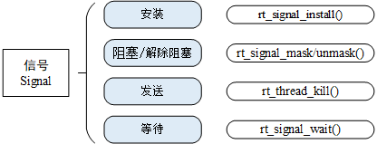

# 线程间通信

前面一章讲了线程间同步，提到了信号量、互斥量、事件集等概念；本章接着上一章的内容，讲解线程间通信。在裸机编程中，经常会使用全局变量进行功能间的通信，如某些功能可能由于一些操作而改变全局变量的值，另一个功能对此全局变量进行读取，根据读取到的全局变量值执行相应的动作，达到通信协作的目的。RT-Thread 中则提供了更多的工具帮助在不同的线程中间传递信息，本章会详细介绍这些工具。学习完本章，大家将学会如何将邮箱、消息队列、信号用于线程间的通信。

## 邮箱

邮箱服务是实时操作系统中一种典型的线程间通信方法。举一个简单的例子，有两个线程，线程 1 检测按键状态并发送，线程 2 读取按键状态并根据按键的状态相应地改变 LED 的亮灭。这里就可以使用邮箱的方式进行通信，线程 1 将按键的状态作为邮件发送到邮箱，线程 2 在邮箱中读取邮件获得按键状态并对 LED 执行亮灭操作。

这里的线程 1 也可以扩展为多个线程。例如，共有三个线程，线程 1 检测并发送按键状态，线程 2 检测并发送 ADC 采样信息，线程 3 则根据接收的信息类型不同，执行不同的操作。

### 邮箱的工作机制

RT-Thread 操作系统的邮箱用于线程间通信，特点是开销比较低，效率较高。邮箱中的每一封邮件只能容纳固定的 4 字节内容（针对 32 位处理系统，指针的大小即为 4 个字节，所以一封邮件恰好能够容纳一个指针）。典型的邮箱也称作交换消息，如下图所示，线程或中断服务例程把一封 4 字节长度的邮件发送到邮箱中，而一个或多个线程可以从邮箱中接收这些邮件并进行处理。


非阻塞方式的邮件发送过程能够安全的应用于中断服务中，是线程、中断服务、定时器向线程发送消息的有效手段。通常来说，邮件收取过程可能是阻塞的，这取决于邮箱中是否有邮件，以及收取邮件时设置的超时时间。当邮箱中不存在邮件且超时时间不为 0 时，邮件收取过程将变成阻塞方式。在这类情况下，只能由线程进行邮件的收取。

当一个线程向邮箱发送邮件时，如果邮箱没满，将把邮件复制到邮箱中。如果邮箱已经满了，发送线程可以设置超时时间，选择等待挂起或直接返回 - RT_EFULL。如果发送线程选择挂起等待，那么当邮箱中的邮件被收取而空出空间来时，等待挂起的发送线程将被唤醒继续发送。

当一个线程从邮箱中接收邮件时，如果邮箱是空的，接收线程可以选择是否等待挂起直到收到新的邮件而唤醒，或可以设置超时时间。当达到设置的超时时间，邮箱依然未收到邮件时，这个选择超时等待的线程将被唤醒并返回 - RT_ETIMEOUT。如果邮箱中存在邮件，那么接收线程将复制邮箱中的 4 个字节邮件到接收缓存中。

### 邮箱控制块

在 RT-Thread 中，邮箱控制块是操作系统用于管理邮箱的一个数据结构，由结构体 struct rt_mailbox 表示。另外一种 C 表达方式 rt_mailbox_t，表示的是邮箱的句柄，在 C 语言中的实现是邮箱控制块的指针。邮箱控制块结构的详细定义请见以下代码：

```c
struct rt_mailbox
{
    struct rt_ipc_object parent;

    rt_uint32_t* msg_pool;                /* 邮箱缓冲区的开始地址 */
    rt_uint16_t size;                     /* 邮箱缓冲区的大小     */

    rt_uint16_t entry;                    /* 邮箱中邮件的数目     */
    rt_uint16_t in_offset, out_offset;    /* 邮箱缓冲的进出指针   */
    rt_list_t suspend_sender_thread;      /* 发送线程的挂起等待队列 */
};
typedef struct rt_mailbox* rt_mailbox_t;
```

rt_mailbox 对象从 rt_ipc_object 中派生，由 IPC 容器所管理。

### 邮箱的管理方式

邮箱控制块是一个结构体，其中含有事件相关的重要参数，在邮箱的功能实现中起重要的作用。邮箱的相关接口如下图所示，对一个邮箱的操作包含：创建 / 初始化邮箱、发送邮件、接收邮件、删除 / 脱离邮箱。


#### 创建和删除邮箱

动态创建一个邮箱对象可以调用如下的函数接口：

```c
rt_mailbox_t rt_mb_create (const char* name, rt_size_t size, rt_uint8_t flag);
```

创建邮箱对象时会先从对象管理器中分配一个邮箱对象，然后给邮箱动态分配一块内存空间用来存放邮件，这块内存的大小等于邮件大小（4 字节）与邮箱容量的乘积，接着初始化接收邮件数目和发送邮件在邮箱中的偏移量。下表描述了该函数的输入参数与返回值：

|**参数**      |**描述**                                                        |
|----------------|------------------------------------------------------------------|
| name           | 邮箱名称                                                         |
| size           | 邮箱容量                                                         |
| flag           | 邮箱标志，它可以取如下数值： RT_IPC_FLAG_FIFO 或 RT_IPC_FLAG_PRIO |
|**返回**      | ——                                                               |
| RT_NULL        | 创建失败                                                         |
| 邮箱对象的句柄 | 创建成功                                                         |

> [!NOTE]
> 注：RT_IPC_FLAG_FIFO 属于非实时调度方式，除非应用程序非常在意先来后到，并且你清楚地明白所有涉及到该邮箱的线程都将会变为非实时线程，方可使用 RT_IPC_FLAG_FIFO，否则建议采用 RT_IPC_FLAG_PRIO，即确保线程的实时性。

当用 rt_mb_create() 创建的邮箱不再被使用时，应该删除它来释放相应的系统资源，一旦操作完成，邮箱将被永久性的删除。删除邮箱的函数接口如下：

```c
rt_err_t rt_mb_delete (rt_mailbox_t mb);
```

删除邮箱时，如果有线程被挂起在该邮箱对象上，内核先唤醒挂起在该邮箱上的所有线程（线程返回值是 -RT_ERROR），然后再释放邮箱使用的内存，最后删除邮箱对象。下表描述了该函数的输入参数与返回值：

|**参数**|**描述**      |
|----------|----------------|
| mb       | 邮箱对象的句柄 |
|**返回**| ——             |
| RT_EOK   | 成功           |

#### 初始化和脱离邮箱

初始化邮箱跟创建邮箱类似，只是初始化邮箱用于静态邮箱对象的初始化。与创建邮箱不同的是，静态邮箱对象的内存是在系统编译时由编译器分配的，一般放于读写数据段或未初始化数据段中，其余的初始化工作与创建邮箱时相同。函数接口如下：

```c
  rt_err_t rt_mb_init(rt_mailbox_t mb,
                    const char* name,
                    void* msgpool,
                    rt_size_t size,
                    rt_uint8_t flag)
```

初始化邮箱时，该函数接口需要获得用户已经申请获得的邮箱对象控制块，缓冲区的指针，以及邮箱名称和邮箱容量（能够存储的邮件数）。下表描述了该函数的输入参数与返回值：

|**参数**|**描述**                                                       |
|----------|-----------------------------------------------------------------|
| mb       | 邮箱对象的句柄                                                  |
| name     | 邮箱名称                                                        |
| msgpool  | 缓冲区指针                                                      |
| size     | 邮箱容量                                                        |
| flag     | 邮箱标志，它可以取如下数值： RT_IPC_FLAG_FIFO 或 RT_IPC_FLAG_PRIO |
|**返回**| ——                                                              |
| RT_EOK   | 成功                                                            |

这里的 size 参数指定的是邮箱的容量，即如果 msgpool 指向的缓冲区的字节数是 N，那么邮箱容量应该是 N/4。

脱离邮箱将把静态初始化的邮箱对象从内核对象管理器中脱离。脱离邮箱使用下面的接口：

```c
rt_err_t rt_mb_detach(rt_mailbox_t mb);
```

使用该函数接口后，内核先唤醒所有挂在该邮箱上的线程（线程获得返回值是 - RT_ERROR），然后将该邮箱对象从内核对象管理器中脱离。下表描述了该函数的输入参数与返回值：

|**参数**|**描述**      |
|----------|----------------|
| mb       | 邮箱对象的句柄 |
|**返回**| ——             |
| RT_EOK   | 成功           |

#### 发送邮件

线程或者中断服务程序可以通过邮箱给其他线程发送邮件，发送邮件函数接口如下：

```c
rt_err_t rt_mb_send (rt_mailbox_t mb, rt_uint32_t value);
```

发送的邮件可以是 32 位任意格式的数据，一个整型值或者一个指向缓冲区的指针。当邮箱中的邮件已经满时，发送邮件的线程或者中断程序会收到 -RT_EFULL 的返回值。下表描述了该函数的输入参数与返回值：

|**参数**  |**描述**      |
|------------|----------------|
| mb         | 邮箱对象的句柄 |
| value      | 邮件内容       |
|**返回**  | ——             |
| RT_EOK     | 发送成功       |
| \-RT_EFULL | 邮箱已经满了   |

#### 等待方式发送邮件

用户也可以通过如下的函数接口向指定邮箱发送邮件：

```c
rt_err_t rt_mb_send_wait (rt_mailbox_t mb,
                      rt_uint32_t value,
                      rt_int32_t timeout);
```

rt_mb_send_wait() 与 rt_mb_send() 的区别在于有等待时间，如果邮箱已经满了，那么发送线程将根据设定的 timeout 参数等待邮箱中因为收取邮件而空出空间。如果设置的超时时间到达依然没有空出空间，这时发送线程将被唤醒并返回错误码。下表描述了该函数的输入参数与返回值：

|**参数**     |**描述**      |
|---------------|----------------|
| mb            | 邮箱对象的句柄 |
| value         | 邮件内容       |
| timeout       | 超时时间       |
|**返回**     | ——             |
| RT_EOK        | 发送成功       |
| \-RT_ETIMEOUT | 超时           |
| \-RT_ERROR    | 失败，返回错误 |

#### 发送紧急邮件

发送紧急邮件的过程与发送邮件几乎一样，唯一的不同是，当发送紧急邮件时，邮件被直接插队放入了邮件队首，这样，接收者就能够优先接收到紧急邮件，从而及时进行处理。发送紧急邮件的函数接口如下：

```c
rt_err_t rt_mb_urgent (rt_mailbox_t mb, rt_ubase_t value);
```

下表描述了该函数的输入参数与返回值：

| **参数**   | **描述**       |
| ---------- | -------------- |
| mb         | 邮箱对象的句柄 |
| value      | 邮件内容       |
| **返回**   | ——             |
| RT_EOK     | 发送成功       |
| \-RT_EFULL | 邮箱已满       |

#### 接收邮件

只有当接收者接收的邮箱中有邮件时，接收者才能立即取到邮件并返回 RT_EOK 的返回值，否则接收线程会根据超时时间设置，或挂起在邮箱的等待线程队列上，或直接返回。接收邮件函数接口如下：

```c
rt_err_t rt_mb_recv (rt_mailbox_t mb, rt_uint32_t* value, rt_int32_t timeout);
```

接收邮件时，接收者需指定接收邮件的邮箱句柄，并指定接收到的邮件存放位置以及最多能够等待的超时时间。如果接收时设定了超时，当指定的时间内依然未收到邮件时，将返回 - RT_ETIMEOUT。下表描述了该函数的输入参数与返回值：

|**参数**     |**描述**      |
|---------------|----------------|
| mb            | 邮箱对象的句柄 |
| value         | 邮件内容       |
| timeout       | 超时时间       |
|**返回**     | ——             |
| RT_EOK        | 接收成功       |
| \-RT_ETIMEOUT | 超时           |
| \-RT_ERROR    | 失败，返回错误 |

### 邮箱使用示例

这是一个邮箱的应用例程，初始化 2 个静态线程，一个静态的邮箱对象，其中一个线程往邮箱中发送邮件，一个线程往邮箱中收取邮件。如下代码所示：

 **邮箱的使用例程**

```c
#include <rtthread.h>

#define THREAD_PRIORITY      10
#define THREAD_TIMESLICE     5

/* 邮箱控制块 */
static struct rt_mailbox mb;
/* 用于放邮件的内存池 */
static char mb_pool[128];

static char mb_str1[] = "I'm a mail!";
static char mb_str2[] = "this is another mail!";
static char mb_str3[] = "over";

ALIGN(RT_ALIGN_SIZE)
static char thread1_stack[1024];
static struct rt_thread thread1;

/* 线程 1 入口 */
static void thread1_entry(void *parameter)
{
    char *str;

    while (1)
    {
        rt_kprintf("thread1: try to recv a mail\n");

        /* 从邮箱中收取邮件 */
        if (rt_mb_recv(&mb, (rt_uint32_t *)&str, RT_WAITING_FOREVER) == RT_EOK)
        {
            rt_kprintf("thread1: get a mail from mailbox, the content:%s\n", str);
            if (str == mb_str3)
                break;

            /* 延时 100ms */
            rt_thread_mdelay(100);
        }
    }
    /* 执行邮箱对象脱离 */
    rt_mb_detach(&mb);
}

ALIGN(RT_ALIGN_SIZE)
static char thread2_stack[1024];
static struct rt_thread thread2;

/* 线程 2 入口 */
static void thread2_entry(void *parameter)
{
    rt_uint8_t count;

    count = 0;
    while (count < 10)
    {
        count ++;
        if (count & 0x1)
        {
            /* 发送 mb_str1 地址到邮箱中 */
            rt_mb_send(&mb, (rt_uint32_t)&mb_str1);
        }
        else
        {
            /* 发送 mb_str2 地址到邮箱中 */
            rt_mb_send(&mb, (rt_uint32_t)&mb_str2);
        }

        /* 延时 200ms */
        rt_thread_mdelay(200);
    }

    /* 发送邮件告诉线程 1，线程 2 已经运行结束 */
    rt_mb_send(&mb, (rt_uint32_t)&mb_str3);
}

int mailbox_sample(void)
{
    rt_err_t result;

    /* 初始化一个 mailbox */
    result = rt_mb_init(&mb,
                        "mbt",                      /* 名称是 mbt */
                        &mb_pool[0],                /* 邮箱用到的内存池是 mb_pool */
                        sizeof(mb_pool) / 4,        /* 邮箱中的邮件数目，因为一封邮件占 4 字节 */
                        RT_IPC_FLAG_FIFO);          /* 采用 FIFO 方式进行线程等待 */
    if (result != RT_EOK)
    {
        rt_kprintf("init mailbox failed.\n");
        return -1;
    }

    rt_thread_init(&thread1,
                   "thread1",
                   thread1_entry,
                   RT_NULL,
                   &thread1_stack[0],
                   sizeof(thread1_stack),
                   THREAD_PRIORITY, THREAD_TIMESLICE);
    rt_thread_startup(&thread1);

    rt_thread_init(&thread2,
                   "thread2",
                   thread2_entry,
                   RT_NULL,
                   &thread2_stack[0],
                   sizeof(thread2_stack),
                   THREAD_PRIORITY, THREAD_TIMESLICE);
    rt_thread_startup(&thread2);
    return 0;
}

/* 导出到 msh 命令列表中 */
MSH_CMD_EXPORT(mailbox_sample, mailbox sample);
```

仿真运行结果如下：

```
 \ | /
- RT -     Thread Operating System
 / | \     3.1.0 build Aug 27 2018
 2006 - 2018 Copyright by rt-thread team
msh >mailbox_sample
thread1: try to recv a mail
thread1: get a mail from mailbox, the content:I'm a mail!
msh >thread1: try to recv a mail
thread1: get a mail from mailbox, the content:this is another mail!
…
thread1: try to recv a mail
thread1: get a mail from mailbox, the content:this is another mail!
thread1: try to recv a mail
thread1: get a mail from mailbox, the content:over
```

例程演示了邮箱的使用方法。线程 2 发送邮件，共发送 11 次；线程 1 接收邮件，共接收到 11 封邮件，将邮件内容打印出来，并判断结束。

### 邮箱的使用场合

邮箱是一种简单的线程间消息传递方式，特点是开销比较低，效率较高。在 RT-Thread 操作系统的实现中能够一次传递一个 4 字节大小的邮件，并且邮箱具备一定的存储功能，能够缓存一定数量的邮件数 (邮件数由创建、初始化邮箱时指定的容量决定)。邮箱中一封邮件的最大长度是 4 字节，所以邮箱能够用于不超过 4 字节的消息传递。由于在 32 系统上 4 字节的内容恰好可以放置一个指针，因此当需要在线程间传递比较大的消息时，可以把指向一个缓冲区的指针作为邮件发送到邮箱中，即邮箱也可以传递指针，例如：

```c
struct msg
{
    rt_uint8_t *data_ptr;
    rt_uint32_t data_size;
};
```

对于这样一个消息结构体，其中包含了指向数据的指针 data_ptr 和数据块长度的变量 data_size。当一个线程需要把这个消息发送给另外一个线程时，可以采用如下的操作：

```c
struct msg* msg_ptr;

msg_ptr = (struct msg*)rt_malloc(sizeof(struct msg));
msg_ptr->data_ptr = ...; /* 指向相应的数据块地址 */
msg_ptr->data_size = len; /* 数据块的长度 */
/* 发送这个消息指针给 mb 邮箱 */
rt_mb_send(mb, (rt_uint32_t)msg_ptr);
```

而在接收线程中，因为收取过来的是指针，而 msg_ptr 是一个新分配出来的内存块，所以在接收线程处理完毕后，需要释放相应的内存块：

```c
struct msg* msg_ptr;
if (rt_mb_recv(mb, (rt_uint32_t*)&msg_ptr) == RT_EOK)
{
    /* 在接收线程处理完毕后，需要释放相应的内存块 */
    rt_free(msg_ptr);
}
```

消息队列
--------

消息队列是另一种常用的线程间通讯方式，是邮箱的扩展。可以应用在多种场合：线程间的消息交换、使用串口接收不定长数据等。

### 消息队列的工作机制

消息队列能够接收来自线程或中断服务例程中不固定长度的消息，并把消息缓存在自己的内存空间中。其他线程也能够从消息队列中读取相应的消息，而当消息队列是空的时候，可以挂起读取线程。当有新的消息到达时，挂起的线程将被唤醒以接收并处理消息。消息队列是一种异步的通信方式。

如下图所示，线程或中断服务例程可以将一条或多条消息放入消息队列中。同样，一个或多个线程也可以从消息队列中获得消息。当有多个消息发送到消息队列时，通常将先进入消息队列的消息先传给线程，也就是说，线程先得到的是最先进入消息队列的消息，即先进先出原则 (FIFO)。


RT-Thread 操作系统的消息队列对象由多个元素组成，当消息队列被创建时，它就被分配了消息队列控制块：消息队列名称、内存缓冲区、消息大小以及队列长度等。同时每个消息队列对象中包含着多个消息框，每个消息框可以存放一条消息；消息队列中的第一个和最后一个消息框被分别称为消息链表头和消息链表尾，对应于消息队列控制块中的 msg_queue_head 和 msg_queue_tail；有些消息框可能是空的，它们通过 msg_queue_free 形成一个空闲消息框链表。所有消息队列中的消息框总数即是消息队列的长度，这个长度可在消息队列创建时指定。

### 消息队列控制块

在 RT-Thread 中，消息队列控制块是操作系统用于管理消息队列的一个数据结构，由结构体 struct rt_messagequeue 表示。另外一种 C 表达方式 rt_mq_t，表示的是消息队列的句柄，在 C 语言中的实现是消息队列控制块的指针。消息队列控制块结构的详细定义请见以下代码：

```c
struct rt_messagequeue
{
    struct rt_ipc_object parent;

    void* msg_pool;                     /* 指向存放消息的缓冲区的指针 */

    rt_uint16_t msg_size;               /* 每个消息的长度 */
    rt_uint16_t max_msgs;               /* 最大能够容纳的消息数 */

    rt_uint16_t entry;                  /* 队列中已有的消息数 */

    void* msg_queue_head;               /* 消息链表头 */
    void* msg_queue_tail;               /* 消息链表尾 */
    void* msg_queue_free;               /* 空闲消息链表 */

    rt_list_t suspend_sender_thread;    /* 发送线程的挂起等待队列 */
};
typedef struct rt_messagequeue* rt_mq_t;
```

rt_messagequeue 对象从 rt_ipc_object 中派生，由 IPC 容器所管理。

### 消息队列的管理方式

消息队列控制块是一个结构体，其中含有消息队列相关的重要参数，在消息队列的功能实现中起重要的作用。消息队列的相关接口如下图所示，对一个消息队列的操作包含：创建消息队列 - 发送消息 - 接收消息 - 删除消息队列。


#### 创建和删除消息队列

消息队列在使用前，应该被创建出来，或对已有的静态消息队列对象进行初始化，创建消息队列的函数接口如下所示：

```c
rt_mq_t rt_mq_create(const char* name, rt_size_t msg_size,
            rt_size_t max_msgs, rt_uint8_t flag);
```

创建消息队列时先从对象管理器中分配一个消息队列对象，然后给消息队列对象分配一块内存空间，组织成空闲消息链表，这块内存的大小 =[消息大小 + 消息头（用于链表连接）的大小]X 消息队列最大个数，接着再初始化消息队列，此时消息队列为空。下表描述了该函数的输入参数与返回值：

|**参数**          |**描述**                                                                     |
|--------------------|-------------------------------------------------------------------------------|
| name               | 消息队列的名称                                                                |
| msg_size           | 消息队列中一条消息的最大长度，单位字节                                        |
| max_msgs           | 消息队列的最大个数                                                            |
| flag               | 消息队列采用的等待方式，它可以取如下数值： RT_IPC_FLAG_FIFO 或 RT_IPC_FLAG_PRIO |
|**返回**          | ——                                                                            |
| RT_EOK             | 发送成功                                                                      |
| 消息队列对象的句柄 | 成功                                                                          |
| RT_NULL            | 失败                                                                          |

> [!NOTE]
> 注：RT_IPC_FLAG_FIFO 属于非实时调度方式，除非应用程序非常在意先来后到，并且你清楚地明白所有涉及到该消息队列的线程都将会变为非实时线程，方可使用 RT_IPC_FLAG_FIFO，否则建议采用 RT_IPC_FLAG_PRIO，即确保线程的实时性。

当消息队列不再被使用时，应该删除它以释放系统资源，一旦操作完成，消息队列将被永久性地删除。删除消息队列的函数接口如下：

```c
rt_err_t rt_mq_delete(rt_mq_t mq);
```

删除消息队列时，如果有线程被挂起在该消息队列等待队列上，则内核先唤醒挂起在该消息等待队列上的所有线程（线程返回值是 - RT_ERROR），然后再释放消息队列使用的内存，最后删除消息队列对象。下表描述了该函数的输入参数与返回值：

|**参数**|**描述**          |
|----------|--------------------|
| mq       | 消息队列对象的句柄 |
|**返回**| ——                 |
| RT_EOK   | 成功               |

#### 初始化和脱离消息队列

初始化静态消息队列对象跟创建消息队列对象类似，只是静态消息队列对象的内存是在系统编译时由编译器分配的，一般放于读数据段或未初始化数据段中。在使用这类静态消息队列对象前，需要进行初始化。初始化消息队列对象的函数接口如下：

```c
rt_err_t rt_mq_init(rt_mq_t mq, const char* name,
                        void *msgpool, rt_size_t msg_size,
                        rt_size_t pool_size, rt_uint8_t flag);
```

初始化消息队列时，该接口需要用户已经申请获得的消息队列对象的句柄（即指向消息队列对象控制块的指针）、消息队列名、消息缓冲区指针、消息大小以及消息队列缓冲区大小。消息队列初始化后所有消息都挂在空闲消息链表上，消息队列为空。下表描述了该函数的输入参数与返回值：

|**参数** |**描述**                                                                     |
|-----------|-------------------------------------------------------------------------------|
| mq        | 消息队列对象的句柄                                                            |
| name      | 消息队列的名称                                                                |
| msgpool   | 指向存放消息的缓冲区的指针                                                    |
| msg_size  | 消息队列中一条消息的最大长度，单位字节                                        |
| pool_size | 存放消息的缓冲区大小                                                          |
| flag      | 消息队列采用的等待方式，它可以取如下数值： RT_IPC_FLAG_FIFO 或 RT_IPC_FLAG_PRIO |
|**返回** | ——                                                                            |
| RT_EOK    | 成功                                                                          |

脱离消息队列将使消息队列对象被从内核对象管理器中脱离。脱离消息队列使用下面的接口：

```c
rt_err_t rt_mq_detach(rt_mq_t mq);
```

使用该函数接口后，内核先唤醒所有挂在该消息等待队列对象上的线程（线程返回值是 -RT_ERROR），然后将该消息队列对象从内核对象管理器中脱离。下表描述了该函数的输入参数与返回值：

|**参数**|**描述**          |
|----------|--------------------|
| mq       | 消息队列对象的句柄 |
|**返回**| ——                 |
| RT_EOK   | 成功               |

#### 发送消息

线程或者中断服务程序都可以给消息队列发送消息。当发送消息时，消息队列对象先从空闲消息链表上取下一个空闲消息块，把线程或者中断服务程序发送的消息内容复制到消息块上，然后把该消息块挂到消息队列的尾部。当且仅当空闲消息链表上有可用的空闲消息块时，发送者才能成功发送消息；当空闲消息链表上无可用消息块，说明消息队列已满，此时，发送消息的的线程或者中断程序会收到一个错误码（-RT_EFULL）。发送消息的函数接口如下：

```c
rt_err_t rt_mq_send (rt_mq_t mq, void* buffer, rt_size_t size);
```

发送消息时，发送者需指定发送的消息队列的对象句柄（即指向消息队列控制块的指针），并且指定发送的消息内容以及消息大小。在发送一个普通消息之后，空闲消息链表上的队首消息被转移到了消息队列尾。下表描述了该函数的输入参数与返回值：

|**参数**  |**描述**                                            |
|------------|------------------------------------------------------|
| mq         | 消息队列对象的句柄                                   |
| buffer     | 消息内容                                             |
| size       | 消息大小                                             |
|**返回**  | ——                                                   |
| RT_EOK     | 成功                                                 |
| \-RT_EFULL | 消息队列已满                                         |
| \-RT_ERROR | 失败，表示发送的消息长度大于消息队列中消息的最大长度 |

#### 等待方式发送消息

用户也可以通过如下的函数接口向指定的消息队列中发送消息：

```c
rt_err_t rt_mq_send_wait(rt_mq_t     mq,
                         const void *buffer,
                         rt_size_t   size,
                         rt_int32_t  timeout);
```

rt_mq_send_wait() 与 rt_mq_send() 的区别在于有等待时间，如果消息队列已经满了，那么发送线程将根据设定的 timeout 参数进行等待。如果设置的超时时间到达依然没有空出空间，这时发送线程将被唤醒并返回错误码。下表描述了该函数的输入参数与返回值：

|**参数**  |**描述**                                            |
|------------|------------------------------------------------------|
| mq         | 消息队列对象的句柄                                   |
| buffer     | 消息内容                                             |
| size       | 消息大小                                             |
| timeout    | 超时时间                                             |
|**返回**  | ——                                                   |
| RT_EOK     | 成功                                                 |
| \-RT_EFULL | 消息队列已满                                         |
| \-RT_ERROR | 失败，表示发送的消息长度大于消息队列中消息的最大长度 |

#### 发送紧急消息

发送紧急消息的过程与发送消息几乎一样，唯一的不同是，当发送紧急消息时，从空闲消息链表上取下来的消息块不是挂到消息队列的队尾，而是挂到队首，这样，接收者就能够优先接收到紧急消息，从而及时进行消息处理。发送紧急消息的函数接口如下：

```c
rt_err_t rt_mq_urgent(rt_mq_t mq, void* buffer, rt_size_t size);
```

下表描述了该函数的输入参数与返回值：

|**参数**  |**描述**          |
|------------|--------------------|
| mq         | 消息队列对象的句柄 |
| buffer     | 消息内容           |
| size       | 消息大小           |
|**返回**  | ——                 |
| RT_EOK     | 成功               |
| \-RT_EFULL | 消息队列已满       |
| \-RT_ERROR | 失败               |

#### 接收消息

当消息队列中有消息时，接收者才能接收消息，否则接收者会根据超时时间设置，或挂起在消息队列的等待线程队列上，或直接返回。接收消息函数接口如下：

```c
rt_err_t rt_mq_recv (rt_mq_t mq, void* buffer,
                    rt_size_t size, rt_int32_t timeout);
```

接收消息时，接收者需指定存储消息的消息队列对象句柄，并且指定一个内存缓冲区，接收到的消息内容将被复制到该缓冲区里。此外，还需指定未能及时取到消息时的超时时间。如下图所示，接收一个消息后消息队列上的队首消息被转移到了空闲消息链表的尾部。下表描述了该函数的输入参数与返回值：

|**参数**     |**描述**          |
|---------------|--------------------|
| mq            | 消息队列对象的句柄 |
| buffer        | 消息内容           |
| size          | 消息大小           |
| timeout       | 指定的超时时间     |
|**返回**     | ——                 |
| RT_EOK        | 成功收到           |
| \-RT_ETIMEOUT | 超时               |
| \-RT_ERROR    | 失败，返回错误     |

### 消息队列应用示例

这是一个消息队列的应用例程，例程中初始化了 2 个静态线程，一个线程会从消息队列中收取消息；另一个线程会定时给消息队列发送普通消息和紧急消息，如下代码所示：

 **消息队列的使用例程**

```c
#include <rtthread.h>

/* 消息队列控制块 */
static struct rt_messagequeue mq;
/* 消息队列中用到的放置消息的内存池 */
static rt_uint8_t msg_pool[2048];

ALIGN(RT_ALIGN_SIZE)
static char thread1_stack[1024];
static struct rt_thread thread1;
/* 线程 1 入口函数 */
static void thread1_entry(void *parameter)
{
    char buf = 0;
    rt_uint8_t cnt = 0;

    while (1)
    {
        /* 从消息队列中接收消息 */
        if (rt_mq_recv(&mq, &buf, sizeof(buf), RT_WAITING_FOREVER) == RT_EOK)
        {
            rt_kprintf("thread1: recv msg from msg queue, the content:%c\n", buf);
            if (cnt == 19)
            {
                break;
            }
        }
        /* 延时 50ms */
        cnt++;
        rt_thread_mdelay(50);
    }
    rt_kprintf("thread1: detach mq \n");
    rt_mq_detach(&mq);
}

ALIGN(RT_ALIGN_SIZE)
static char thread2_stack[1024];
static struct rt_thread thread2;
/* 线程 2 入口 */
static void thread2_entry(void *parameter)
{
    int result;
    char buf = 'A';
    rt_uint8_t cnt = 0;

    while (1)
    {
        if (cnt == 8)
        {
            /* 发送紧急消息到消息队列中 */
            result = rt_mq_urgent(&mq, &buf, 1);
            if (result != RT_EOK)
            {
                rt_kprintf("rt_mq_urgent ERR\n");
            }
            else
            {
                rt_kprintf("thread2: send urgent message - %c\n", buf);
            }
        }
        else if (cnt>= 20)/* 发送 20 次消息之后退出 */
        {
            rt_kprintf("message queue stop send, thread2 quit\n");
            break;
        }
        else
        {
            /* 发送消息到消息队列中 */
            result = rt_mq_send(&mq, &buf, 1);
            if (result != RT_EOK)
            {
                rt_kprintf("rt_mq_send ERR\n");
            }

            rt_kprintf("thread2: send message - %c\n", buf);
        }
        buf++;
        cnt++;
        /* 延时 5ms */
        rt_thread_mdelay(5);
    }
}

/* 消息队列示例的初始化 */
int msgq_sample(void)
{
    rt_err_t result;

    /* 初始化消息队列 */
    result = rt_mq_init(&mq,
                        "mqt",
                        &msg_pool[0],             /* 内存池指向 msg_pool */
                        1,                          /* 每个消息的大小是 1 字节 */
                        sizeof(msg_pool),        /* 内存池的大小是 msg_pool 的大小 */
                        RT_IPC_FLAG_PRIO);       /* 如果有多个线程等待，优先级大小的方法分配消息 */

    if (result != RT_EOK)
    {
        rt_kprintf("init message queue failed.\n");
        return -1;
    }

    rt_thread_init(&thread1,
                   "thread1",
                   thread1_entry,
                   RT_NULL,
                   &thread1_stack[0],
                   sizeof(thread1_stack), 25, 5);
    rt_thread_startup(&thread1);

    rt_thread_init(&thread2,
                   "thread2",
                   thread2_entry,
                   RT_NULL,
                   &thread2_stack[0],
                   sizeof(thread2_stack), 25, 5);
    rt_thread_startup(&thread2);

    return 0;
}

/* 导出到 msh 命令列表中 */
MSH_CMD_EXPORT(msgq_sample, msgq sample);
```

仿真运行结果如下：

```
\ | /
- RT -     Thread Operating System
 / | \     3.1.0 build Aug 24 2018
 2006 - 2018 Copyright by rt-thread team
msh > msgq_sample
msh >thread2: send message - A
thread1: recv msg from msg queue, the content:A
thread2: send message - B
thread2: send message - C
thread2: send message - D
thread2: send message - E
thread1: recv msg from msg queue, the content:B
thread2: send message - F
thread2: send message - G
thread2: send message - H
thread2: send urgent message - I
thread2: send message - J
thread1: recv msg from msg queue, the content:I
thread2: send message - K
thread2: send message - L
thread2: send message - M
thread2: send message - N
thread2: send message - O
thread1: recv msg from msg queue, the content:C
thread2: send message - P
thread2: send message - Q
thread2: send message - R
thread2: send message - S
thread2: send message - T
thread1: recv msg from msg queue, the content:D
message queue stop send, thread2 quit
thread1: recv msg from msg queue, the content:E
thread1: recv msg from msg queue, the content:F
thread1: recv msg from msg queue, the content:G
…
thread1: recv msg from msg queue, the content:T
thread1: detach mq
```

例程演示了消息队列的使用方法。线程 1 会从消息队列中收取消息；线程 2 定时给消息队列发送普通消息和紧急消息。由于线程 2 发送消息 “I” 是紧急消息，会直接插入消息队列的队首，所以线程 1 在接收到消息 “B” 后，接收的是该紧急消息，之后才接收消息“C”。

### 消息队列的使用场合

消息队列可以应用于发送不定长消息的场合，包括线程与线程间的消息交换，以及中断服务例程中给线程发送消息（中断服务例程不能接收消息）。下面分发送消息和同步消息两部分来介绍消息队列的使用。

#### 发送消息

消息队列和邮箱的明显不同是消息的长度并不限定在 4 个字节以内；另外，消息队列也包括了一个发送紧急消息的函数接口。但是当创建的是一个所有消息的最大长度是 4 字节的消息队列时，消息队列对象将蜕化成邮箱。这个不限定长度的消息，也及时的反应到了代码编写的场合上，同样是类似邮箱的代码：

```c
struct msg
{
    rt_uint8_t *data_ptr;    /* 数据块首地址 */
    rt_uint32_t data_size;   /* 数据块大小   */
};
```

和邮箱例子相同的消息结构定义，假设依然需要发送这样一个消息给接收线程。在邮箱例子中，这个结构只能够发送指向这个结构的指针（在函数指针被发送过去后，接收线程能够正确的访问指向这个地址的内容，通常这块数据需要留给接收线程来释放）。而使用消息队列的方式则大不相同：

```c
void send_op(void *data, rt_size_t length)
{
    struct msg msg_ptr;

    msg_ptr.data_ptr = data;  /* 指向相应的数据块地址 */
    msg_ptr.data_size = length; /* 数据块的长度 */

    /* 发送这个消息指针给 mq 消息队列 */
    rt_mq_send(mq, (void*)&msg_ptr, sizeof(struct msg));
}
```

注意，上面的代码中，是把一个局部变量的数据内容发送到了消息队列中。在接收线程中，同样也采用局部变量进行消息接收的结构体：

```c
void message_handler()
{
    struct msg msg_ptr; /* 用于放置消息的局部变量 */

    /* 从消息队列中接收消息到 msg_ptr 中 */
    if (rt_mq_recv(mq, (void*)&msg_ptr, sizeof(struct msg), RT_WAITING_FOREVER) == RT_EOK)
    {
        /* 成功接收到消息，进行相应的数据处理 */
    }
}
```

因为消息队列是直接的数据内容复制，所以在上面的例子中，都采用了局部变量的方式保存消息结构体，这样也就免去动态内存分配的烦恼了（也就不用担心，接收线程在接收到消息时，消息内存空间已经被释放）。

#### 同步消息

在一般的系统设计中会经常遇到要发送同步消息的问题，这个时候就可以根据当时状态的不同选择相应的实现：两个线程间可以采用 **[消息队列 + 信号量或邮箱]** 的形式实现。发送线程通过消息发送的形式发送相应的消息给消息队列，发送完毕后希望获得接收线程的收到确认，工作示意图如下图所示：


根据消息确认的不同，可以把消息结构体定义成：

```c
struct msg
{
    /* 消息结构其他成员 */
    struct rt_mailbox ack;
};
/* 或者 */
struct msg
{
    /* 消息结构其他成员 */
    struct rt_semaphore ack;
};
```

第一种类型的消息使用了邮箱来作为确认标志，而第二种类型的消息采用了信号量来作为确认标志。邮箱作为确认标志，代表着接收线程能够通知一些状态值给发送线程；而信号量作为确认标志只能够单一的通知发送线程，消息已经确认接收。

信号
----

信号（又称为软中断信号），在软件层次上是对中断机制的一种模拟，在原理上，一个线程收到一个信号与处理器收到一个中断请求可以说是类似的。

### 信号的工作机制

信号在 RT-Thread 中用作异步通信，POSIX 标准定义了 sigset_t 类型来定义一个信号集，然而 sigset_t 类型在不同的系统可能有不同的定义方式，在 RT-Thread 中，将 sigset_t 定义成了 unsigned long 型，并命名为 rt_sigset_t，应用程序能够使用的信号为 SIGUSR1（10）和 SIGUSR2（12）。

信号本质是软中断，用来通知线程发生了异步事件，用做线程之间的异常通知、应急处理。一个线程不必通过任何操作来等待信号的到达，事实上，线程也不知道信号到底什么时候到达，线程之间可以互相通过调用 rt_thread_kill() 发送软中断信号。

收到信号的线程对各种信号有不同的处理方法，处理方法可以分为三类：

第一种是类似中断的处理程序，对于需要处理的信号，线程可以指定处理函数，由该函数来处理。

第二种方法是，忽略某个信号，对该信号不做任何处理，就像未发生过一样。

第三种方法是，对该信号的处理保留系统的默认值。

如下图所示，假设线程 1 需要对信号进行处理，首先线程 1 安装一个信号并解除阻塞，并在安装的同时设定了对信号的异常处理方式；然后其他线程可以给线程 1 发送信号，触发线程 1 对该信号的处理。


当信号被传递给线程 1 时，如果它正处于挂起状态，那会把状态改为就绪状态去处理对应的信号。如果它正处于运行状态，那么会在它当前的线程栈基础上建立新栈帧空间去处理对应的信号，需要注意的是使用的线程栈大小也会相应增加。

### 信号的管理方式

对于信号的操作，有以下几种：安装信号、阻塞信号、阻塞解除、信号发送、信号等待。信号的接口详见下图：



#### 安装信号

如果线程要处理某一信号，那么就要在线程中安装该信号。安装信号主要用来确定信号值及线程针对该信号值的动作之间的映射关系，即线程将要处理哪个信号，该信号被传递给线程时，将执行何种操作。详细定义请见以下代码：

```c
rt_sighandler_t rt_signal_install(int signo, rt_sighandler_t[] handler);
```

其中 rt_sighandler_t 是定义信号处理函数的函数指针类型。下表描述了该函数的输入参数与返回值：

|**参数**             |**描述**                                              |
|-----------------------|--------------------------------------------------------|
| signo                 | 信号值（只有 SIGUSR1 和 SIGUSR2 是开放给用户使用的，下同） |
| handler               | 设置对信号值的处理方式                                 |
|**返回**             | ——                                                     |
| SIG_ERR               | 错误的信号                                             |
| 安装信号前的 handler 值 | 成功                                                   |

在信号安装时设定 handler 参数，决定了该信号的不同的处理方法。处理方法可以分为三种：

1）类似中断的处理方式，参数指向当信号发生时用户自定义的处理函数，由该函数来处理。

2）参数设为 SIG_IGN，忽略某个信号，对该信号不做任何处理，就像未发生过一样。

3）参数设为 SIG_DFL，系统会调用默认的处理函数_signal_default_handler()。

#### 阻塞信号

信号阻塞，也可以理解为屏蔽信号。如果该信号被阻塞，则该信号将不会递达给安装此信号的线程，也不会引发软中断处理。调 rt_signal_mask() 可以使信号阻塞：

```c
void rt_signal_mask(int signo);
```

下表描述了该函数的输入参数：

|**参数**|**描述**|
|----------|----------|
| signo    | 信号值   |

#### 解除信号阻塞

线程中可以安装好几个信号，使用此函数可以对其中一些信号给予 “关注”，那么发送这些信号都会引发该线程的软中断。调用 rt_signal_unmask() 可以用来解除信号阻塞：

```c
void rt_signal_unmask(int signo);
```

下表描述了该函数的输入参数：

 rt_signal_unmask() 函数参数

|**参数**|**描述**|
|----------|----------|
| signo    | 信号值   |

#### 发送信号

当需要进行异常处理时，可以给设定了处理异常的线程发送信号，调用 rt_thread_kill() 可以用来向任何线程发送信号：

```c
int rt_thread_kill(rt_thread_t tid, int sig);
```

下表描述了该函数的输入参数与返回值：

|**参数**   |**描述**      |
|-------------|----------------|
| tid         | 接收信号的线程 |
| sig         | 信号值         |
|**返回**   | ——             |
| RT_EOK      | 发送成功       |
| \-RT_EINVAL | 参数错误       |

#### 等待信号

等待 set 信号的到来，如果没有等到这个信号，则将线程挂起，直到等到这个信号或者等待时间超过指定的超时时间 timeout。如果等到了该信号，则将指向该信号体的指针存入 si，如下是等待信号的函数。

```c
int rt_signal_wait(const rt_sigset_t *set,
                        rt_siginfo_t[] *si, rt_int32_t timeout);
```

其中 rt_siginfo_t 是定义信号信息的数据类型，下表描述了该函数的输入参数与返回值：

|**参数**     |**描述**                  |
|---------------|----------------------------|
| set           | 指定等待的信号             |
| si            | 指向存储等到信号信息的指针 |
| timeout       | 指定的等待时间             |
|**返回**     | ——                         |
| RT_EOK        | 等到信号                   |
| \-RT_ETIMEOUT | 超时                       |
| \-RT_EINVAL   | 参数错误                   |

### 信号应用示例

这是一个信号的应用例程，如下代码所示。此例程创建了 1 个线程，在安装信号时，信号处理方式设为自定义处理，定义的信号的处理函数为 thread1_signal_handler()。待此线程运行起来安装好信号之后，给此线程发送信号。此线程将接收到信号，并打印信息。

 **信号使用例程**

```c
#include <rtthread.h>

#define THREAD_PRIORITY         25
#define THREAD_STACK_SIZE       512
#define THREAD_TIMESLICE        5

static rt_thread_t tid1 = RT_NULL;

/* 线程 1 的信号处理函数 */
void thread1_signal_handler(int sig)
{
    rt_kprintf("thread1 received signal %d\n", sig);
}

/* 线程 1 的入口函数 */
static void thread1_entry(void *parameter)
{
    int cnt = 0;

    /* 安装信号 */
    rt_signal_install(SIGUSR1, thread1_signal_handler);
    rt_signal_unmask(SIGUSR1);

    /* 运行 10 次 */
    while (cnt < 10)
    {
        /* 线程 1 采用低优先级运行，一直打印计数值 */
        rt_kprintf("thread1 count : %d\n", cnt);

        cnt++;
        rt_thread_mdelay(100);
    }
}

/* 信号示例的初始化 */
int signal_sample(void)
{
    /* 创建线程 1 */
    tid1 = rt_thread_create("thread1",
                            thread1_entry, RT_NULL,
                            THREAD_STACK_SIZE,
                            THREAD_PRIORITY, THREAD_TIMESLICE);

    if (tid1 != RT_NULL)
        rt_thread_startup(tid1);

    rt_thread_mdelay(300);

    /* 发送信号 SIGUSR1 给线程 1 */
    rt_thread_kill(tid1, SIGUSR1);

    return 0;
}

/* 导出到 msh 命令列表中 */
MSH_CMD_EXPORT(signal_sample, signal sample);
```

仿真运行结果如下：

```
 \ | /
- RT -     Thread Operating System
 / | \     3.1.0 build Aug 24 2018
 2006 - 2018 Copyright by rt-thread team
msh >signal_sample
thread1 count : 0
thread1 count : 1
thread1 count : 2
msh >thread1 received signal 10
thread1 count : 3
thread1 count : 4
thread1 count : 5
thread1 count : 6
thread1 count : 7
thread1 count : 8
thread1 count : 9
```

例程中，首先线程安装信号并解除阻塞，然后发送信号给线程。线程接收到信号并打印出了接收到的信号：SIGUSR1（10）。

