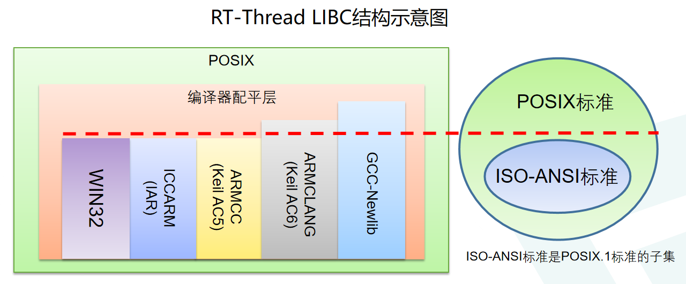

# LIBC 简介

RT-Thread 提供的 LIBC (C library, C库)，包含编译器内置LIBC、编译器配平层和 POSIX 层三部分。布局如下图所示：

## ISO/ANSI C
ANSI C、ISO C、Standard C是指美国国家标准协会（ANSI）和国际标准化组织（ISO）对C语言发布的标准。历史上，这个名字专门用于指代此标准的原始版本，也是支持最好的版本（称为C89或C90）。使用C的软件开发者被鼓励遵循标准的要求，因为它鼓励使用跨平台的代码。C的第一个标准是由ANSI发布的。虽然这份文档后来被国际标准化组织（ISO）采纳并且ISO发布的修订版亦被ANSI采纳，但名称ANSI C（而不是ISO C）仍被广泛使用。一些软件开发者使用名称ISO C，还有一些使用中立的名称Standard C。例如常说的C89 (ANSI X3.159-1989)、C99 (ISO/IEC 9899:1999)、C11 (ISO/IEC 9899:2011) 实际都是指该标准的不同版本。

该标准通常被编译器/工具链内置 LIBC 所支持，例如 Keil-MDK、IAR 等所提供的的内置 LIBC 都是满足该标准的。

## POSIX 接口
可移植操作系统接口（英语：Portable Operating System Interface，缩写为POSIX）是IEEE为要在各种UNIX操作系统上运行软件，而定义API的一系列互相关联的标准的总称，其正式称呼为IEEE Std 1003，而国际标准名称为ISO/IEC 9945。ISO/ANSI C 是 POSIX 的子集。

### IEEE Std 1003.1
针对LIBC，目前广泛使用的 POSIX 标准是 1003.1 标准，全称为IEEE Std 1003.1（缩写写法为 POSIX.1）。IEEE Std 1003.1-2001、IEEE Std 1003.1-2008 等为 POSIX.1 在不同时期更新发布的版本。

### IEEE Std. 1003.13
该标准是 POSIX 针对实时规范 (reatime profiles)。该标准是由 IEEE Std 1003.1 筛选而来，因此是其子集。IEEE Std. 1003.13 定义了四个子集：
- Minimal：最小嵌入式子集规范 —— PSE51
- Controller：工业控制器子集规范 —— PSE52
- Dedicated：较大规模的嵌入式系统子集规范 —— PSE53
- Multi-Purpose：具有实时性要求的大规模通用系统子集规范 —— PSE54

目前 RT-Thread 已经实现 PSE51 规范以及部分 PSE52 规范的内容。

### 注意事项

##### 不同编译平台的兼容

* 为保证跨不同编译器、不同工具链的兼容性，建议用户应用层代码：
  * 使用 <sys/time.h> 代替 <time.h>
  * 使用 <sys/errno.h> 代替 <errno.h>
  * 使用 <sys/signal.h> 代替 <signal.h>

有使用 <time.h> 的引用逻辑的，修改为 <sys/time.h> 的方式来避免编译错误；其他两个也是类似的处理逻辑，拟合不同编译工具链的处理逻辑。

##### Net 接口

启用网络功能后，并不是所有的 BSD Socket 接口都支持，在 RT-Thread 中只实现了一部分函数。因此如果对应函数缺失，需要按照代码逻辑替换为基础的 Socket 接口来兼容原逻辑。完整的 BSD Socket 功能将持续进行来解决这个问题。
