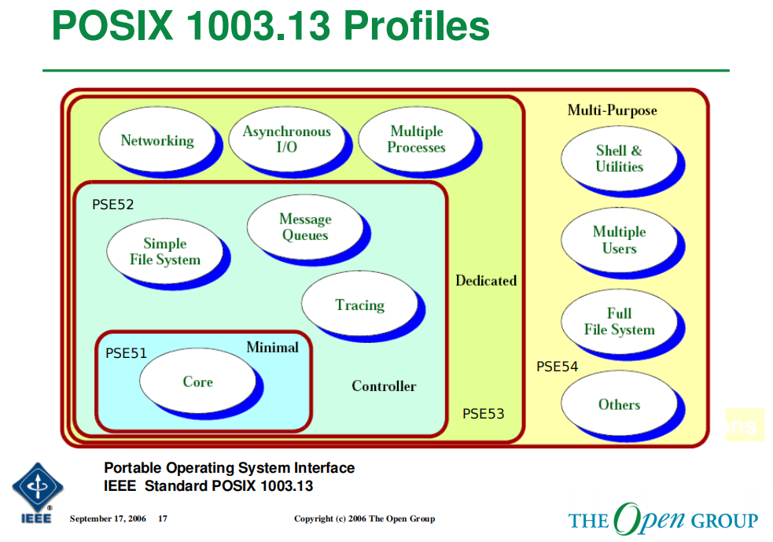
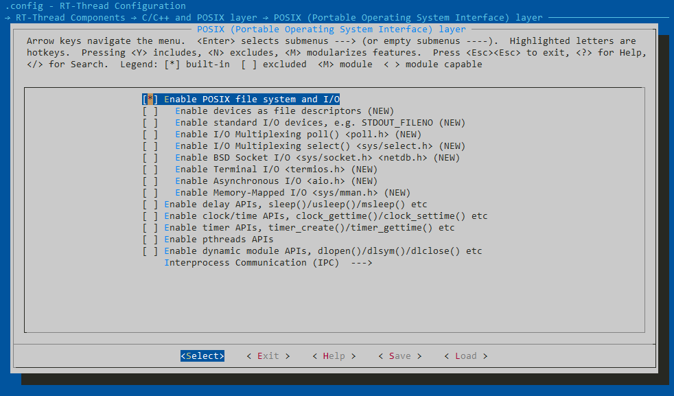

# POSIX 简介

可移植操作系统接口，POSIX 标准定义了操作系统（很多时候针对的是类 Unix 操作系统）应该为应用程序提供的接口标准，从而保证了应用程序在源码层次的可移植性，如今主流的 Linux 系统都做到了兼容 POSIX 标准。由此可见，可移植性是 POSIX 的一大特性，如果一个操作系统拟合了POSIX系统，就将可以将自己的 POSIX 应用轻松迁移到其他同样符合POSIX标准的系统平台，并且可以获得大量的 POSIX 应用，丰富自己系统的应用生态。

POSIX 为了提供不同层级的RTOS能力，划定了 PSE51, PSE52, PSE53, PSE54 共四个级别；分别对应了四种操作系统。

1. Minimal Real-time System Profile IEEE Std 1003.13 PSE51，基础 RTOS
2. Real-time Controller Profile IEEE Std 1003.13 PSE52，带有简单的文件系统...等
3. Dedicated Real-time Profile IEEE Std 1003.13 PSE53，拥有网络功能...等
4. Multi-Purpose Real-time Profile IEEE Std 1003.13 PSE54，完整的文件系统，带有 Shell 组件...等



由于标准的制定是随着时间发展而不断更新的，PSE51, 52, 53, 54 的标准也随着 MCU，MPU 芯片产业的发展，不断增强的芯片功能和性能使得这些标准所对应的四种操作系统的界限而越显模糊。在 RT-Thread 中也依靠自身的组件内容，提供了多种标准的部分内容，为不同的 POSIX 应用提供可供在 RTOS 系统上使用的软件。

## POSIX 在 RT-Thread 中支持情况

RT-Thread 针对 PSE51 的标准规定的头文件及对应接口，提供了大部分接口，其 PSE51 接口数目占比如下饼状图所示。除此之外，我们还提供了更加完整的文件系统的接口，以及基于我们 SAL 组件的网络接口。这为 POSIX 的应用迁移打下了基础，可以使得较复杂的 POSIX 应用也可以在 RT-Thread 的平台上经过小部分修改就可以在 RT-Thread 上应用。



* POSIX FILE 相关接口，包含了文件系统的内容，接口比较丰富；标准 I/O 接口，Poll / Select 等较复杂的功能也已经支持
* Delay 相关接口
* Clock 相关接口，对拥有 RTC 硬件，或者没有使用 RTC 硬件的设备都有对应的功能实现
* Timer 相关接口，已经对接到 RT-Thread 的定时器接口，实现对应的函数
* Pthread 相关接口，在多任务编程中使用很广泛
* Dynamic 动态模块
* POSIX 的 标准 IPC 接口 ：pipe ，message，semaphore 等函数

通过上面灵活的配置项，开发者可以启用对应的功能来添加该类函数的支持；这对与同样使用功能宏来标识一些函数功能的 POSIX 接口来说十分类似，在该界面可以配置对应的 POSIX 函数支持。

## Net 接口

1. 在 menuconfig 中打开 ```Enable BSD Socket I/O <sys/socket.h> <netdb.h>``` 就可以使用标准 Socket 进行编程

更加详细的 Socket 编程内容，可以到**网络组件**下查看。

[函数介绍](../../sal/sal.md)
[简单例程](../../../tutorial/qemu-network/tcpclient/tcpclient)

## Filesystem 接口

1. 在 menuconfig 中打开```Enable POSIX file system and I/O``` 配置具体的 POSIX 函数接口
2. 按照需求打开需要的功能，例如 设备I/O，AIO，MMAN 之类的功能
