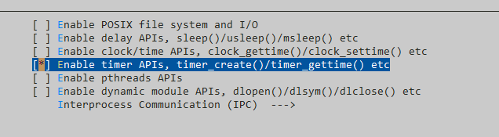

## timer 函数



1. 在 menuconfig 中打开 timer 即可
2. 在用户代码中，即可使用 ```<sys/time.h> ``` 这些 timer 提供的头文件来编程

```c
#include <sys/time.h>
#include <stdio.h>

int main(void)
{
    time_t sec;
    time_t ret;
    time_t timestamp = 1609459200;
    ret = time(&sec);

    if(ret != sec)
    {
        return -1;
    }
    if(ret != timestamp)
    {
        return -1;
    }
    return 0;
}
```