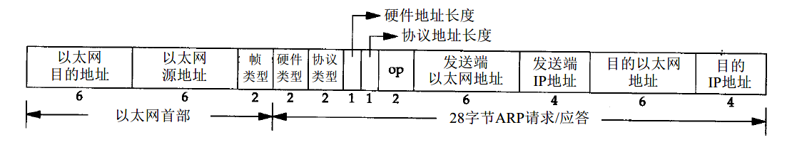
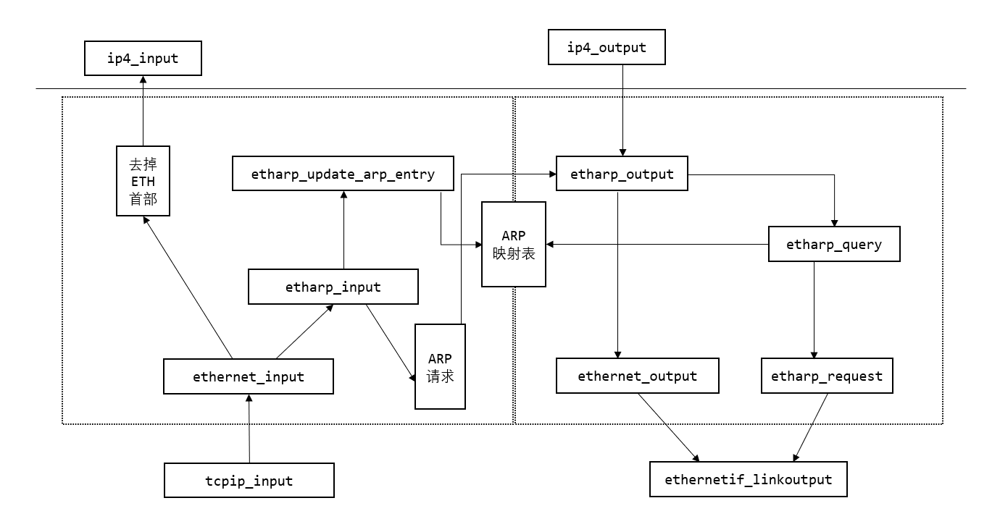
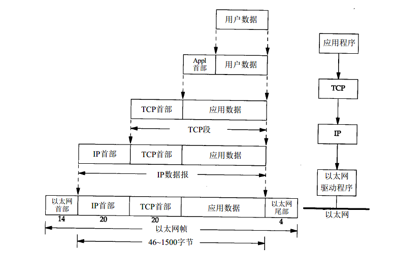
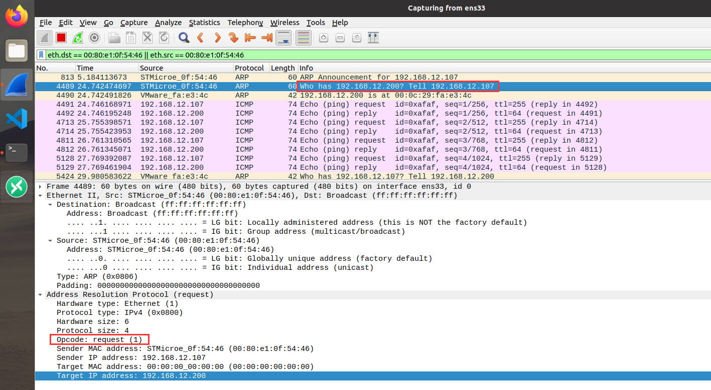
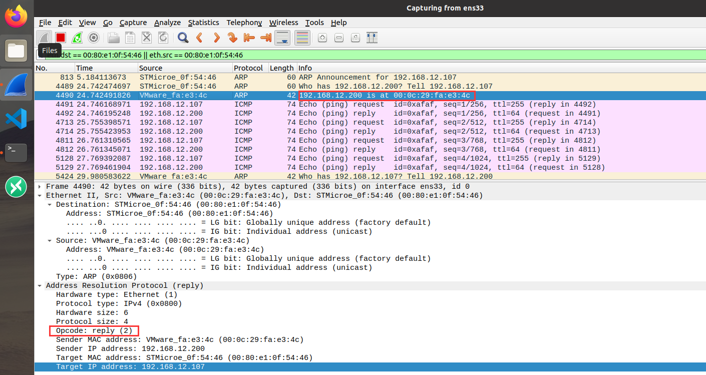
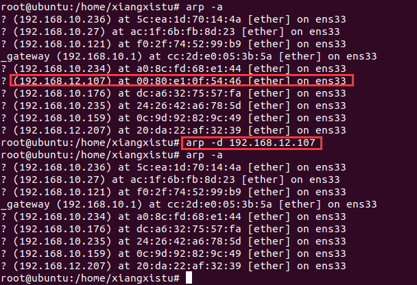
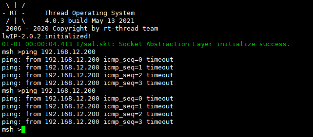
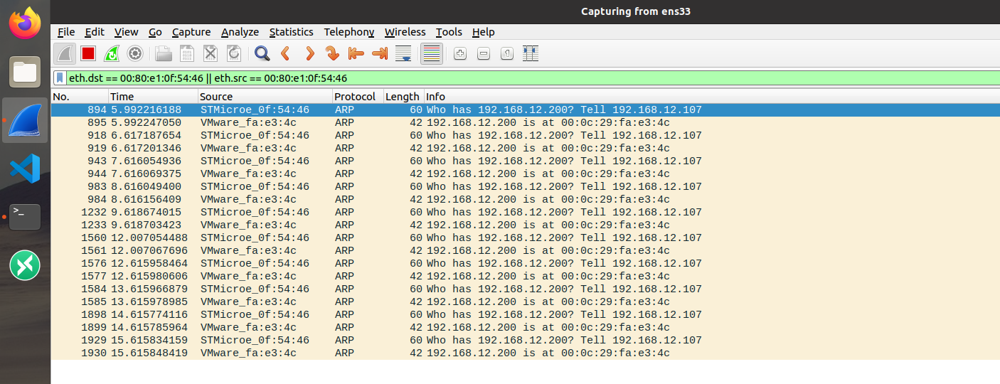
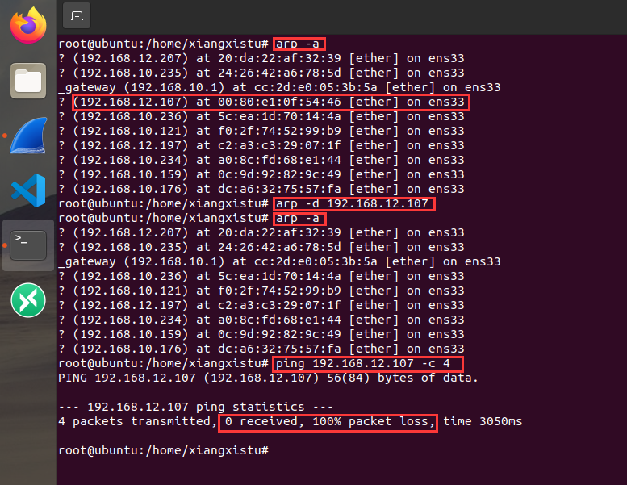
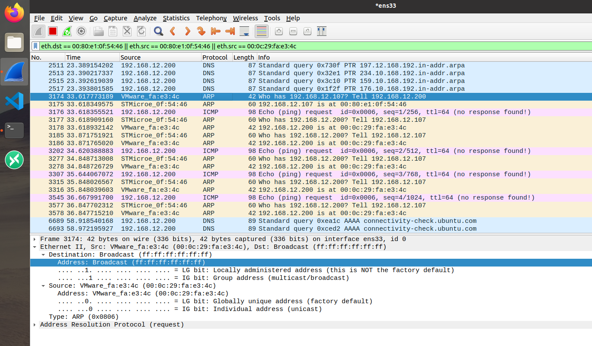

## 1. ARP 的背景

对于网络世界来说，有 IP 地址就代表了身份。不过在我们常用的网络拓扑类型中，IP 地址并不能准确表达我们的身份。在 ipv4 中牵扯到私有网络地址与子网划分，加上交换机，路由器设备的存在，这些极大扩展了可用的 IP 地址数量，在设备的 MAC 地址与 IP 地址的共同作用下使得更多的设备能连接到网络中。ipv6 拥有极大数量的 IP 地址，同时就没有 ARP 报文，但是会有一个其他类似的功能。

在实际使用中，**ARP （Address Resolution Protocol）地址解析协议** 就起到了沟通 IP 地址与 MAC 地址的作用。

ARP 的报文比较简单，就是两个功能：ARP request，ARP response；即一个 ARP 查询报文，一个 ARP 回复报文。

---

**学习目标：**

1. 掌握 ARP 报文的作用。
2. 掌握 lwip 中 ARP 的实现原理。
3. 掌握 lwip 的 ARP 策略，能简单修改原生逻辑。

## 2. ARP 报文格式

ARP 报文与 IP 报文都是附着在 ETH 帧之上，可以看到 ARP 报文长度共有 28 字节；包含的内容包括【发送端】与【接收端】的【以太网地址】与【IP 地址】。



* 以太网目的地址，要发送到的地址，对于不知道的地址，可以全部置为 1；
* 以太网源地址，也就是发送端的地址；
* 帧类型 0x0806，表示为 ARP 报文；0x0800 表示 IP 报文；对于 ARP 报文，"帧类型"的实际上与"协议类型"字段是同一个数据；
* 硬件类型，两个字节， 1 表示硬件地址；当然实际上，“ 0, 2, 3 “都没有太大意义；
* 协议类型，与帧类型是一致的；在数据填充时，可以把 “协议类型” 拷贝到 “帧类型” 字段；
* 硬件地址长度，6 个字节，再长也是 6 个字节；
* 协议地址长度，4个字节，别多想 ipv4 就是 4 个字节，ipv6 也不用这一套；
* **op，2 个字节； 1 表示 ARP_REQUEST，2 表示 ARP_REPLY；**
* 发送端以太网地址，意义如名称；
* 发送端 IP 地址，意义如名称；
* 目的以太网地址，意义如名称，不知道就置空；
* 目的 IP 地址，意义如名称；

---

1. ARP 只有两个报文类型：request 与 response ( reply ) 。
2. 是在知道 IP 地址的基础上，使用 request 查询该 IP 地址可以使用的 MAC 地址，而不是反过来。
3. 一旦收到 ARP 请求，发现该 IP 与本机 IP 地址相符就回复 response ，如果不是就忽略。
4. 为了能维护一个 MAC 与 IP 的映射表，会有一个 ARP 缓存表的存储结构；ETH 帧的收发都会尝试更新这个 ARP 缓存表。
5. ARP 报文的收发解析的主要功能就是维护这个 ARP 缓存表，以便在发送 IP 报文时可以直接填充 【以太网目的地址】与【以太网源地址】。

## 3. lwip 对 ARP 功能的实现

根据上述的 ARP 报文，就该意识到有两个比较重要的结构体需要实现：ETH 报文的结构体，以及 ARP 报文的结构体。

```c
/** struct eth_addr and ip4_addr2 */
#define ETH_HWADDR_LEN    6

#define PACK_STRUCT_FIELD(x) x
#define PACK_STRUCT_FLD_8(x) PACK_STRUCT_FIELD(x)
#define PACK_STRUCT_FLD_S(x) PACK_STRUCT_FIELD(x)

struct eth_addr {
  PACK_STRUCT_FLD_8(u8_t addr[ETH_HWADDR_LEN]);
} PACK_STRUCT_STRUCT;
struct ip4_addr2 {
  PACK_STRUCT_FIELD(u16_t addrw[2]);
} PACK_STRUCT_STRUCT;
```

```c
/** Ethernet header */
struct eth_hdr {
#if ETH_PAD_SIZE
  PACK_STRUCT_FLD_8(u8_t padding[ETH_PAD_SIZE]);
#endif
  PACK_STRUCT_FLD_S(struct eth_addr dest);
  PACK_STRUCT_FLD_S(struct eth_addr src);
  PACK_STRUCT_FIELD(u16_t type);
} PACK_STRUCT_STRUCT;
```

```c
/** the ARP message, see RFC 826 ("Packet format") */
struct etharp_hdr {
  PACK_STRUCT_FIELD(u16_t hwtype);
  PACK_STRUCT_FIELD(u16_t proto);
  PACK_STRUCT_FLD_8(u8_t  hwlen);
  PACK_STRUCT_FLD_8(u8_t  protolen);
  PACK_STRUCT_FIELD(u16_t opcode);
  PACK_STRUCT_FLD_S(struct eth_addr shwaddr);
  PACK_STRUCT_FLD_S(struct ip4_addr2 sipaddr);
  PACK_STRUCT_FLD_S(struct eth_addr dhwaddr);
  PACK_STRUCT_FLD_S(struct ip4_addr2 dipaddr);
} PACK_STRUCT_STRUCT;
```

以上的结构是为了能方便得按照报文格式来填充数据，还需要一个用来管理 ARP 映射表的结构；

```c
/** struct for queueing outgoing packets for unknown address
  * defined here to be accessed by memp.h
  */
struct etharp_q_entry {
  struct etharp_q_entry *next;
  struct pbuf *p;
};

struct etharp_entry {
#if ARP_QUEUEING
  /** Pointer to queue of pending outgoing packets on this ARP entry. */
  struct etharp_q_entry *q;
#else /* ARP_QUEUEING */
  /** Pointer to a single pending outgoing packet on this ARP entry. */
  struct pbuf *q;
#endif /* ARP_QUEUEING */
  ip4_addr_t ipaddr;
  struct netif *netif;
  struct eth_addr ethaddr;
  u16_t ctime;
  u8_t state;
};

static struct etharp_entry arp_table[ARP_TABLE_SIZE];
```

OK，描述到这里，lwip 对 ARP 报文的支持所需要的基础数据结构已经完备了；但是除了数据结构，也应当有对应的算法才能实现 TCP/IP 所要求的规范，即实现 ARP 程序。我们先不看具体实现，先通过我们上面对 ARP 功能的描述，先猜测一下应该需要什么功能：

> 1. 发送数据时，根据 ARP 表填充 ETH 帧的地址。
> 2. 如果 ARP 表没有对应的 IP 与 MAC 地址的条目，应当发送 ARP request 来查询。
> 3. 在收到 ARP response 时，应当把报文中的 IP 与 MAC 地址添加到 ARP表中。
> 4. 应当提供一个查询 ARP 表的功能，并能更新 ARP 映射关系。

#### 3.1 lwip 的 ARP 缓存表维护

上面的函数已经能完成对 ARP 数据包的发送，解析，查找功能；因为一个网络中，设备不可能是一直都不会变的。比如 DHCP 给你分配了一个 IP ，在你不使用后会收回这些资源，也许会分配给其他人；也就是说，IP 与 MAC 的对应关系，是会随着时间改变而改变的。因此，lwip 维护的 ARP 表是需要频繁更新的。

而为了表示 ARP 缓存表中，IP 与 ARP 的对应关系（后面称为一个表项），每个表项都会有个 state 来表示状态，也就是上面的 ```u8 state``` 字段。lwip 定义的表项状态共有 6 种，当然是在你支持静态 ARP 映射表的情况下。

```c
/** ARP states */
enum etharp_state {
  ETHARP_STATE_EMPTY = 0,                 /* 空表 */
  ETHARP_STATE_PENDING,                   /* 只记录了 IP ，而没有记录 MAC，一般是发送了 arp_request 的短暂状态 */
  ETHARP_STATE_STABLE,                    /* 记录了 IP 和 MAC */
  ETHARP_STATE_STABLE_REREQUESTING_1,     /* stable 状态下，ctime 继续增大引发广播或者单播一个 arp_request ，并置为 REREQUESTING_1 */
  ETHARP_STATE_STABLE_REREQUESTING_2      /* 已经发送了 arp_request 但是没有回复，会从 REREQUESTING_1 置为 REREQUESTING_2 */
#if ETHARP_SUPPORT_STATIC_ENTRIES
  ,ETHARP_STATE_STATIC                    /* 静态表，不会别 ARP 管理修改的条目 */
#endif /* ETHARP_SUPPORT_STATIC_ENTRIES */
};
```

这些表项的状态，都会影响 ARP 缓存表的更新；而更新策略与上面的一些函数的执行逻辑有关，比较重要的逻辑是：

> * pending 状态下，对应的 pbuf 不会被发出，只有 >= stable 才会被发出。
> * pending 状态下，ctime 超时会直接导致条目被删除，置为 empty。
> * stable 状态下， ctime 超时会被字节置为 pending 。
> * stable 状态下，会定时检查 ctime ，在达到一定阀值时会通过广播或者单播发送一个 arp_request，并被置为 rerequesting_1 状态。
> * 在 arp_tmr 触发时，如果已经为 rerequesting_1 状态，会被置为 rerequesting_2。
> * rerequesting_1 与 rerequesting_2 到底什么意义：避免连续（指在多次）发送 arp_request 而设计的，也许是怕网络环境干扰。

#### 3.2 lwip 提供的 ARP 功能函数

我们通过分析已经获悉，ARP 程序肯定要具备上述 4 种功能；不过，在 Lwip 的实际实现中，肯定不止这 4 种基础功能，肯定要有更多的函数来实现这个目的。关于 lwip 的 ARP 内容的代码，是存放在 ```lwip/src/core/ipv4/etharp.c``` 中。

为了梳理 ARP 的功能，我们选择其中的 5 个函数来学习 lwip 的 ARP 功能实现：

```c
/* 查找 ARP 映射表中 ipaddr 条目，并返回相对位置 */
static s8_t etharp_find_entry(const ip4_addr_t *ipaddr, u8_t flags, struct netif* netif);
/* 尝试发送 IP 数据包， 单播，多播或者广播数据 */
err_t etharp_output(struct netif *netif, struct pbuf *q, const ip4_addr_t *ipaddr);
/* 查询 ARP 表，不存在则调用 etharp_request 获取，存在则发送数据 */
err_t etharp_query(struct netif *netif, const ip4_addr_t *ipaddr, struct pbuf *q);
/* 尝试发送 ARP 请求数据包 */
err_t etharp_request(struct netif *netif, const ip4_addr_t *ipaddr);
/* 解析 ARP 数据包 */
void etharp_input(struct pbuf *p, struct netif *netif);
```
其中，最难以理解得是 etharp_find_entry 与 etharp_query 函数，对于这两个函数我们主要分析其意义；剩下的 3 个函数，我们则具体看看代码的实现。通过这 5 个比较有代表性的函数，我们来理解一个表项中的 state ，ctime，p 这些值究竟怎样影响整个 ARP 报文的发送与解析策略。

##### 3.2.1 函数 etharp_find_entry 

该函数位于 ```lwip/src/core/ipv4/etharp.c``` 中，这个函数的作用可以通过注释来描述：

```c
/**
 * Search the ARP table for a matching or new entry.
 *
 * If an IP address is given, return a pending or stable ARP entry that matches
 * the address. If no match is found, create a new entry with this address set,
 * but in state ETHARP_EMPTY. The caller must check and possibly change the
 * state of the returned entry.
 *
 * If ipaddr is NULL, return a initialized new entry in state ETHARP_EMPTY.
 *
 * In all cases, attempt to create new entries from an empty entry. If no
 * empty entries are available and ETHARP_FLAG_TRY_HARD flag is set, recycle
 * old entries. Heuristic choose the least important entry for recycling.
 *
 * @param ipaddr IP address to find in ARP cache, or to add if not found.
 * @param flags See @ref etharp_state
 * @param netif netif related to this address (used for NETIF_HWADDRHINT)
 *
 * @return The ARP entry index that matched or is created, ERR_MEM if no
 * entry is found or could be recycled.
 */
```

通过上面的描述，我们能知道 ```etharp_find_entry``` 的策略如下：

> 1. 如果参数中 IP 地址被给定，则返回一个 stable 或者 pending 状态的表项；
> 2. 如果 IP 地址被给定，但是没有处于 stable 或者 pending 状态的表项，则会找一个 empty 的表项并返回；
> 3. 如果 IP 地址为空，则会创建一个 empty 的表项并返回；
> 4. 如果很不巧，ARP 表中没有处于 empty 的表项；在 flag 为 ETHARP_FLAG_TRY_HARD 的情况下，找一个最不重要的表项置空并返回；
> 5. ETHARP_FLAG_FIND_ONLY 与 ETHARP_FLAG_TRY_HARD 的区别，就是前者尽量找到一个表项；后者必须找到一个表项（哪怕是清空之前已经存在的）；

上面的函数描述中有一个黑洞，ETHARP_FLAG_TRY_HARD 必须找到一个表项，哪怕是通过回收一个最不重要的表项的方式；那最不重要的表项是什么表项呢，我们可以一起看看代码

```c
  /* b) choose the least destructive entry to recycle:    // 1 -> 4, 优先级就是这样
   * 1) empty entry
   * 2) oldest stable entry
   * 3) oldest pending entry without queued packets
   * 4) oldest pending entry with queued packets
   *
   * { ETHARP_FLAG_TRY_HARD is set at this point }
   */

  /* 1) empty entry available? */
  if (empty < ARP_TABLE_SIZE) {
    i = empty;
    LWIP_DEBUGF(ETHARP_DEBUG | LWIP_DBG_TRACE, ("etharp_find_entry: selecting empty entry %"U16_F"\n", (u16_t)i));
  } else {
    /* 2) found recyclable stable entry? */
    if (old_stable < ARP_TABLE_SIZE) {
      /* recycle oldest stable*/
      i = old_stable;
      LWIP_DEBUGF(ETHARP_DEBUG | LWIP_DBG_TRACE, ("etharp_find_entry: selecting oldest stable entry %"U16_F"\n", (u16_t)i));
      /* no queued packets should exist on stable entries */
      LWIP_ASSERT("arp_table[i].q == NULL", arp_table[i].q == NULL);
    /* 3) found recyclable pending entry without queued packets? */
    } else if (old_pending < ARP_TABLE_SIZE) {
      /* recycle oldest pending */
      i = old_pending;
      LWIP_DEBUGF(ETHARP_DEBUG | LWIP_DBG_TRACE, ("etharp_find_entry: selecting oldest pending entry %"U16_F" (without queue)\n", (u16_t)i));
    /* 4) found recyclable pending entry with queued packets? */
    } else if (old_queue < ARP_TABLE_SIZE) {
      /* recycle oldest pending (queued packets are free in etharp_free_entry) */
      i = old_queue;
      LWIP_DEBUGF(ETHARP_DEBUG | LWIP_DBG_TRACE, ("etharp_find_entry: selecting oldest pending entry %"U16_F", freeing packet queue %p\n", (u16_t)i, (void *)(arp_table[i].q)));
      /* no empty or recyclable entries found */
    } else {
      LWIP_DEBUGF(ETHARP_DEBUG | LWIP_DBG_TRACE, ("etharp_find_entry: no empty or recyclable entries found\n"));
      return (s8_t)ERR_MEM;
    }

    /* { empty or recyclable entry found } */
    LWIP_ASSERT("i < ARP_TABLE_SIZE", i < ARP_TABLE_SIZE);
    etharp_free_entry(i);
  }
```

我在这里解释一下，为什么会是 ```1->4``` 这个顺序：

1. 空表项与最老的 state 最先被使用的原因，就是因为 ARP 表是需要随时更新的，太老的表项可能本身就是错误的或者过时的，因此先删除是没有问题的。
2. 处于 pending 状态且没有待发送数据的表项与处于 pending 状态但是有待发送数据的表项相比；有待发送数据的表项上挂载了一些数据，有可能是 PING 命令之类或者其他的数据，删除这些是比较危险的；而没有待发送数据的表项就没有这个顾虑。

##### 3.2.2 函数 etharp_query 

该函数位于 ```lwip/src/core/ipv4/etharp.c``` 中，这个函数其实是一些策略的合集：

```c
/**
 * Send an ARP request for the given IP address and/or queue a packet.
 *
 * If the IP address was not yet in the cache, a pending ARP cache entry
 * is added and an ARP request is sent for the given address. The packet
 * is queued on this entry.
 *
 * If the IP address was already pending in the cache, a new ARP request
 * is sent for the given address. The packet is queued on this entry.
 *
 * If the IP address was already stable in the cache, and a packet is
 * given, it is directly sent and no ARP request is sent out.
 *
 * If the IP address was already stable in the cache, and no packet is
 * given, an ARP request is sent out.
 *
 * @param netif The lwIP network interface on which ipaddr
 * must be queried for.
 * @param ipaddr The IP address to be resolved.
 * @param q If non-NULL, a pbuf that must be delivered to the IP address.
 * q is not freed by this function.
 *
 * @note q must only be ONE packet, not a packet queue!
 *
 * @return
 * - ERR_BUF Could not make room for Ethernet header.
 * - ERR_MEM Hardware address unknown, and no more ARP entries available
 *   to query for address or queue the packet.
 * - ERR_MEM Could not queue packet due to memory shortage.
 * - ERR_RTE No route to destination (no gateway to external networks).
 * - ERR_ARG Non-unicast address given, those will not appear in ARP cache.
 *
 */
```

其实，顺着代码看下来，策略也很清晰：

> 1. 如果不能找到表项，那没有办法，只能一个新的 empty 表项，发送一个 arp_request 并置为 pending；如果 pbuf 中有数据继续执行，没有直接返回。
> 2. 如果找到表项，那最好，直接发送数据就行了（这里指真实的 IP 数据，而不是 ARP 数据），然后返回。
> 3. 如果处于 pending 状态（其实走到这一步，empty 也已经是 pending 了），而且 pbuf 中有数据，那就挂载了对应的 pbuf 链表上，等待发送；这里有一些拷贝的动作，只要 pbuf 链表中有不是 PBUF_ROM 的的节点，整个 pbuf 数据都需要拷贝到新的数据链中，谨防被意外修改。

##### 3.2.3 函数 etharp_request

```c
const struct eth_addr ethbroadcast = {{0xff,0xff,0xff,0xff,0xff,0xff}};
const struct eth_addr ethzero = {{0,0,0,0,0,0}};

/**
 * Send a raw ARP packet (opcode and all addresses can be modified)
 *
 * @param netif the lwip network interface on which to send the ARP packet
 * @param ethsrc_addr the source MAC address for the ethernet header
 * @param ethdst_addr the destination MAC address for the ethernet header
 * @param hwsrc_addr the source MAC address for the ARP protocol header
 * @param ipsrc_addr the source IP address for the ARP protocol header
 * @param hwdst_addr the destination MAC address for the ARP protocol header
 * @param ipdst_addr the destination IP address for the ARP protocol header
 * @param opcode the type of the ARP packet
 * @return ERR_OK if the ARP packet has been sent
 *         ERR_MEM if the ARP packet couldn't be allocated
 *         any other err_t on failure
 */
static err_t
etharp_raw(struct netif *netif, const struct eth_addr *ethsrc_addr,
           const struct eth_addr *ethdst_addr,
           const struct eth_addr *hwsrc_addr, const ip4_addr_t *ipsrc_addr,
           const struct eth_addr *hwdst_addr, const ip4_addr_t *ipdst_addr,
           const u16_t opcode);

/**
 * Send an ARP request packet asking for ipaddr to a specific eth address.
 * Used to send unicast request to refresh the ARP table just before an entry
 * times out
 *
 * @param netif the lwip network interface on which to send the request
 * @param ipaddr the IP address for which to ask
 * @param hw_dst_addr the ethernet address to send this packet to
 * @return ERR_OK if the request has been sent
 *         ERR_MEM if the ARP packet couldn't be allocated
 *         any other err_t on failure
 */
static err_t
etharp_request_dst(struct netif *netif, const ip4_addr_t *ipaddr, const struct eth_addr* hw_dst_addr)
{
  return etharp_raw(netif, (struct eth_addr *)netif->hwaddr, hw_dst_addr,
                    (struct eth_addr *)netif->hwaddr, netif_ip4_addr(netif), &ethzero,
                    ipaddr, ARP_REQUEST);
}

/**
 * Send an ARP request packet asking for ipaddr.
 *
 * @param netif the lwip network interface on which to send the request
 * @param ipaddr the IP address for which to ask
 * @return ERR_OK if the request has been sent
 *         ERR_MEM if the ARP packet couldn't be allocated
 *         any other err_t on failure
 */
err_t
etharp_request(struct netif *netif, const ip4_addr_t *ipaddr)
{
  LWIP_DEBUGF(ETHARP_DEBUG | LWIP_DBG_TRACE, ("etharp_request: sending ARP request.\n"));
  return etharp_request_dst(netif, ipaddr, &ethbroadcast);
}
```

```etharp_request``` 已经是一个功能函数了，功能函数就表明很容易看懂。OK，我们看看到底干了什么。

> 首先 eth 帧的广播地址是全 1 的，再使用 etharp_raw 函数发送时，arp 协议中的 hw 字段，全部设置为 0；这里是协议要求，无可厚非。
>
> 可以看到 lwip 这里确实是发送了一个 arp_request 的数据包出去。

##### 3.2.4 函数 etharp_input

```C
/**
 * Responds to ARP requests to us. Upon ARP replies to us, add entry to cache
 * send out queued IP packets. Updates cache with snooped address pairs.
 *
 * Should be called for incoming ARP packets. The pbuf in the argument
 * is freed by this function.
 *
 * @param p The ARP packet that arrived on netif. Is freed by this function.
 * @param netif The lwIP network interface on which the ARP packet pbuf arrived.
 *
 * @see pbuf_free()
 */
void
etharp_input(struct pbuf *p, struct netif *netif)
{
  struct etharp_hdr *hdr;
  /* these are aligned properly, whereas the ARP header fields might not be */
  ip4_addr_t sipaddr, dipaddr;
  u8_t for_us;

  LWIP_ERROR("netif != NULL", (netif != NULL), return;);

  hdr = (struct etharp_hdr *)p->payload;

  /* RFC 826 "Packet Reception": */
  if ((hdr->hwtype != PP_HTONS(HWTYPE_ETHERNET)) ||
      (hdr->hwlen != ETH_HWADDR_LEN) ||
      (hdr->protolen != sizeof(ip4_addr_t)) ||
      (hdr->proto != PP_HTONS(ETHTYPE_IP)))  {
    LWIP_DEBUGF(ETHARP_DEBUG | LWIP_DBG_TRACE | LWIP_DBG_LEVEL_WARNING,
      ("etharp_input: packet dropped, wrong hw type, hwlen, proto, protolen or ethernet type (%"U16_F"/%"U16_F"/%"U16_F"/%"U16_F")\n",
      hdr->hwtype, (u16_t)hdr->hwlen, hdr->proto, (u16_t)hdr->protolen));
    ETHARP_STATS_INC(etharp.proterr);
    ETHARP_STATS_INC(etharp.drop);
    pbuf_free(p);
    return;
  }
  ETHARP_STATS_INC(etharp.recv);

#if LWIP_AUTOIP
  /* We have to check if a host already has configured our random
   * created link local address and continuously check if there is
   * a host with this IP-address so we can detect collisions */
  autoip_arp_reply(netif, hdr);
#endif /* LWIP_AUTOIP */

  /* Copy struct ip4_addr2 to aligned ip4_addr, to support compilers without
   * structure packing (not using structure copy which breaks strict-aliasing rules). */
  IPADDR2_COPY(&sipaddr, &hdr->sipaddr);
  IPADDR2_COPY(&dipaddr, &hdr->dipaddr);

  /* this interface is not configured? */
  if (ip4_addr_isany_val(*netif_ip4_addr(netif))) {
    for_us = 0;
  } else {
    /* ARP packet directed to us? */
    for_us = (u8_t)ip4_addr_cmp(&dipaddr, netif_ip4_addr(netif));
  }

  /* ARP message directed to us?
      -> add IP address in ARP cache; assume requester wants to talk to us,
         can result in directly sending the queued packets for this host.
     ARP message not directed to us?
      ->  update the source IP address in the cache, if present */
  etharp_update_arp_entry(netif, &sipaddr, &(hdr->shwaddr),
                   for_us ? ETHARP_FLAG_TRY_HARD : ETHARP_FLAG_FIND_ONLY);

  /* now act on the message itself */
  switch (hdr->opcode) {
  /* ARP request? */
  case PP_HTONS(ARP_REQUEST):
    /* ARP request. If it asked for our address, we send out a
     * reply. In any case, we time-stamp any existing ARP entry,
     * and possibly send out an IP packet that was queued on it. */

    LWIP_DEBUGF (ETHARP_DEBUG | LWIP_DBG_TRACE, ("etharp_input: incoming ARP request\n"));
    /* ARP request for our address? */
    if (for_us) {
      /* send ARP response */
      etharp_raw(netif,
                 (struct eth_addr *)netif->hwaddr, &hdr->shwaddr,
                 (struct eth_addr *)netif->hwaddr, netif_ip4_addr(netif),
                 &hdr->shwaddr, &sipaddr,
                 ARP_REPLY);
    /* we are not configured? */
    } else if (ip4_addr_isany_val(*netif_ip4_addr(netif))) {
      /* { for_us == 0 and netif->ip_addr.addr == 0 } */
      LWIP_DEBUGF(ETHARP_DEBUG | LWIP_DBG_TRACE, ("etharp_input: we are unconfigured, ARP request ignored.\n"));
    /* request was not directed to us */
    } else {
      /* { for_us == 0 and netif->ip_addr.addr != 0 } */
      LWIP_DEBUGF(ETHARP_DEBUG | LWIP_DBG_TRACE, ("etharp_input: ARP request was not for us.\n"));
    }
    break;
  case PP_HTONS(ARP_REPLY):
    /* ARP reply. We already updated the ARP cache earlier. */
    LWIP_DEBUGF(ETHARP_DEBUG | LWIP_DBG_TRACE, ("etharp_input: incoming ARP reply\n"));
#if (LWIP_DHCP && DHCP_DOES_ARP_CHECK)
    /* DHCP wants to know about ARP replies from any host with an
     * IP address also offered to us by the DHCP server. We do not
     * want to take a duplicate IP address on a single network.
     * @todo How should we handle redundant (fail-over) interfaces? */
    dhcp_arp_reply(netif, &sipaddr);
#endif /* (LWIP_DHCP && DHCP_DOES_ARP_CHECK) */
    break;
  default:
    LWIP_DEBUGF(ETHARP_DEBUG | LWIP_DBG_TRACE, ("etharp_input: ARP unknown opcode type %"S16_F"\n", lwip_htons(hdr->opcode)));
    ETHARP_STATS_INC(etharp.err);
    break;
  }
  /* free ARP packet */
  pbuf_free(p);
}
```

> 可以看到，一旦 ARP 报文到达，都会被这个函数所判断执行；逻辑是这样的：
>
> 1. 如果收到的是给自己的 ARP request ，就回复一个 ARP reply 报文；如果不是给自己的，记录一些有用 ARP 的信息后，就忽略掉。
> 2. 如果是给自己的 ARP reply 报文，会有一些逻辑与 DHCP 过程有关，可以在 DHCP 章节查看。

##### 3.2.5 函数 etharp_output

```c
/**
 * Resolve and fill-in Ethernet address header for outgoing IP packet.
 *
 * For IP multicast and broadcast, corresponding Ethernet addresses
 * are selected and the packet is transmitted on the link.
 *
 * For unicast addresses, the packet is submitted to etharp_query(). In
 * case the IP address is outside the local network, the IP address of
 * the gateway is used.
 *
 * @param netif The lwIP network interface which the IP packet will be sent on.
 * @param q The pbuf(s) containing the IP packet to be sent.
 * @param ipaddr The IP address of the packet destination.
 *
 * @return
 * - ERR_RTE No route to destination (no gateway to external networks),
 * or the return type of either etharp_query() or ethernet_output().
 */
err_t
etharp_output(struct netif *netif, struct pbuf *q, const ip4_addr_t *ipaddr)
{
  const struct eth_addr *dest;
  struct eth_addr mcastaddr;
  const ip4_addr_t *dst_addr = ipaddr;

  LWIP_ASSERT("netif != NULL", netif != NULL);
  LWIP_ASSERT("q != NULL", q != NULL);
  LWIP_ASSERT("ipaddr != NULL", ipaddr != NULL);

  /* Determine on destination hardware address. Broadcasts and multicasts
   * are special, other IP addresses are looked up in the ARP table. */

  /* broadcast destination IP address? */
  if (ip4_addr_isbroadcast(ipaddr, netif)) {
    /* broadcast on Ethernet also */
    dest = (const struct eth_addr *)&ethbroadcast;
  /* multicast destination IP address? */
  } else if (ip4_addr_ismulticast(ipaddr)) {
    /* Hash IP multicast address to MAC address.*/
    mcastaddr.addr[0] = LL_IP4_MULTICAST_ADDR_0;
    mcastaddr.addr[1] = LL_IP4_MULTICAST_ADDR_1;
    mcastaddr.addr[2] = LL_IP4_MULTICAST_ADDR_2;
    mcastaddr.addr[3] = ip4_addr2(ipaddr) & 0x7f;
    mcastaddr.addr[4] = ip4_addr3(ipaddr);
    mcastaddr.addr[5] = ip4_addr4(ipaddr);
    /* destination Ethernet address is multicast */
    dest = &mcastaddr;
  /* unicast destination IP address? */
  } else {
    s8_t i;
    /* outside local network? if so, this can neither be a global broadcast nor
       a subnet broadcast. */
    if (!ip4_addr_netcmp(ipaddr, netif_ip4_addr(netif), netif_ip4_netmask(netif)) &&
        !ip4_addr_islinklocal(ipaddr)) {
#if LWIP_AUTOIP
      struct ip_hdr *iphdr = LWIP_ALIGNMENT_CAST(struct ip_hdr*, q->payload);
      /* According to RFC 3297, chapter 2.6.2 (Forwarding Rules), a packet with
         a link-local source address must always be "directly to its destination
         on the same physical link. The host MUST NOT send the packet to any
         router for forwarding". */
      if (!ip4_addr_islinklocal(&iphdr->src))
#endif /* LWIP_AUTOIP */
      {
#ifdef LWIP_HOOK_ETHARP_GET_GW
        /* For advanced routing, a single default gateway might not be enough, so get
           the IP address of the gateway to handle the current destination address. */
        dst_addr = LWIP_HOOK_ETHARP_GET_GW(netif, ipaddr);
        if (dst_addr == NULL)
#endif /* LWIP_HOOK_ETHARP_GET_GW */
        {
          /* interface has default gateway? */
          if (!ip4_addr_isany_val(*netif_ip4_gw(netif))) {
            /* send to hardware address of default gateway IP address */
            dst_addr = netif_ip4_gw(netif);
          /* no default gateway available */
          } else {
            /* no route to destination error (default gateway missing) */
            return ERR_RTE;
          }
        }
      }
    }
#if LWIP_NETIF_HWADDRHINT
    if (netif->addr_hint != NULL) {
      /* per-pcb cached entry was given */
      u8_t etharp_cached_entry = *(netif->addr_hint);
      if (etharp_cached_entry < ARP_TABLE_SIZE) {
#endif /* LWIP_NETIF_HWADDRHINT */
        if ((arp_table[etharp_cached_entry].state >= ETHARP_STATE_STABLE) &&
#if ETHARP_TABLE_MATCH_NETIF
            (arp_table[etharp_cached_entry].netif == netif) &&
#endif
            (ip4_addr_cmp(dst_addr, &arp_table[etharp_cached_entry].ipaddr))) {
          /* the per-pcb-cached entry is stable and the right one! */
          ETHARP_STATS_INC(etharp.cachehit);
          return etharp_output_to_arp_index(netif, q, etharp_cached_entry);
        }
#if LWIP_NETIF_HWADDRHINT
      }
    }
#endif /* LWIP_NETIF_HWADDRHINT */

    /* find stable entry: do this here since this is a critical path for
       throughput and etharp_find_entry() is kind of slow */
    for (i = 0; i < ARP_TABLE_SIZE; i++) {
      if ((arp_table[i].state >= ETHARP_STATE_STABLE) &&
#if ETHARP_TABLE_MATCH_NETIF
          (arp_table[i].netif == netif) &&
#endif
          (ip4_addr_cmp(dst_addr, &arp_table[i].ipaddr))) {
        /* found an existing, stable entry */
        ETHARP_SET_HINT(netif, i);
        return etharp_output_to_arp_index(netif, q, i);
      }
    }
    /* no stable entry found, use the (slower) query function:
       queue on destination Ethernet address belonging to ipaddr */
    return etharp_query(netif, dst_addr, q);
  }

  /* continuation for multicast/broadcast destinations */
  /* obtain source Ethernet address of the given interface */
  /* send packet directly on the link */
  return ethernet_output(netif, q, (struct eth_addr*)(netif->hwaddr), dest, ETHTYPE_IP);
}
```

> 这个函数会被 IP 层的输出函数直接调用以发送数据；IP 层的数据会有广播，多播，单播的数据，所以在该函数中，处理方式也是不一样的。
>
> 1. 对于 IP 地址是广播地址的，eth 的地址也要设置为广播；
> 2. 对于 IP 地址是多播地址的，eth 的地址也要设置为多播；
> 3. 对于 IP 地址是单播地址且本网段内的，那直接继续下一步的操作；
> 4. **对于 IP 地址是单播地址但不是本网段的，也就是需要路由器的转发，eth 的地址要设置为网关的地址；**
> 5. etharp_cached_entry 的作用应该是加快处理速度，如果连续的数据发送，每次发送都要检索一边 arp 表会比较浪费；cached 的参与可以明显提供速度。
> 6. 如果是 ARP 缓存表中找不到表项，那啥也别说了，调用 etharp_query 挂载起来吧，等待后面有机会再发送吧。


#### 3.3 ARP / IP 报文在 lwip 中的流向

通过上面的函数，我们能大概了解具体的 ARP 功能的实现；对于 IP 数据包在整个 lwip 的流向，可以通过下面这个图来了解。在看图之前，还需要理解在 lwip 提供的三个接口：

> IP 报文输入接口：tcpip_input
>
> IP 报文的输出接口：netif->output = etharp_output
>
> ETH 帧的输出接口：netif->linkoutput   = ethernetif_linkoutput;




## 4. 拓展

#### 4.1 ARP 攻击的原理

名字听起来很厉害，实际上就是通过 ARP 报文来达到干扰服务的目的。ARP 的报文可以使得设备不能正常发送 IP 数据。

> 1. 欺骗，劫持，基本是属于一类；如果你把该发往别人的 IP 地址的 ETH 帧拿走，就要在别人的机器里将对应的 ARP 缓存换为你的。这样的话，别人的设备可能就会有断网，丢包的现象；毕竟，你这都没有提供服务，别人不掉线才怪。
> 2. DOS 攻击，也是一类；这基本是属于纯属的瘫痪手段，让设备只能处理 ARP 报文而忽略其他的报文来达到这个目的。
> 3. 当然还有些更新型，更加巧妙的攻击方式；但是攻击的原理，都是依赖于 ARP 的 request 与 reply 功能。

#### 4.2 IPv6 如何处置 IPv4 的 APR 功能

ipv6 没有 ARP 协议，但是为了实现类似的效果；ipv6 拥有 NDP (Neighbor Discovery Protocol) 协议，这是 ARP 与 ICMP 的集合。

#### 4.3 ARP，IP，ICMP，IGMP，UDP，TCP，User Data 在 ETH 帧上的关系

ETH 是最底层的层级；

ARP 和 IP 是同一个层级的；

ICMP，IGMP，UDP，TCP 是同一个层级的；

User Data 是最上层的层级，MQTT，HTTP 这些都属于这一层；



从图片上可以看出来，每一层的具体范围；以太网帧指得就是 ETH 帧。

#### 4.4 Wireshark 抓取标准 ARP 报文

开发板使用 ETH 的方式接入交换机，选用 lwip 2.0.2 的协议栈，可以使用 RT-Thread 的自动配置功能；在虚拟机上搭一个 ubuntu 的平台，安装上 wireshark ，把网卡的驱动都安装好，就可以开始抓取 ARP 报文了。

> 开发板 ：    IP： 192.168.12.107       MAC：00 80 e1 0f 54 46
>
> Ubuntu：   IP： 192.168.12.200       MAC：00 0c 29 fa e3 4c

ARP 的报文，在一个比较大的网络中，比如公司网络中可能会比较多；可以取个巧办法，不以 arp 的条件筛选报文，而使用 eth 的条件筛选。这样的话，无论是 ARP，DHCP 还是其他的什么报文，都可以抓上。如图所示：

这是一个 request 报文，比如，在启动开发板使用 ping 命令来 ping 我们的 ubuntu 平台，抓出的信息被圈起来了。



可以看到 ETH 帧的 dst 地址是广播地址全为1；而内部的 ARP 报文的 Target mac ( dst ) 的地址则全为0；这个抓包同我们上面的分析是一致的。

----

这是一个 reply 报文，开发板向 ubuntu 平台发送 ARP request 后的 ARP reply报文。



reply 报文的 ARP 报文部分，就是已经确定的 MAC 与 IP 地址了；而 ARP 的攻击的方式，一般都是从这里入手。毕竟一个广播帧任何设备都可以收到，在正常情况下，只有对应的才会回复；倘若是个 ARP 攻击设备，不管收到啥，都回复 reply 报文，并改为自己的 MAC 地址，其他设备上的 ARP 缓存表不一会儿就乱了。

#### 4.5 在 Ubuntu 上查看 ARP 缓存表的信息



在 root 的权限下，可以使用 ```arp -d xxxx``` 命令删除指定的表项，搭配 ping 与 wireshark 可以看到一个设备在没有 ARP 缓存表项时设备的策略。

1. 没有对应的表项，就先发送 ARP 报文以获取对应的 IP 与 MAC 关系，然后再发送 ping 命令。
2. 如果有对应的表项，就直接发送 ping 命令，wireshark 就不能抓到 arp 的报文了。

**Attention：**我这里能看到 10 与 12 的原因是，我们这边的子网掩码是 16 位，也就是说，是属于同一个网段的，并不是分属 10 与 12 网段。一般不是本网段的 IP 包在数据发送时，直接把 ETH 的 dst 设置为网关地址了。 

#### 4.6 VLAN 功能

在学习交换机的功能时，vlan 是一个可以划分不同组的一项功能；一旦在交换机中设置了 vlan 功能，只有相同的 vlan 的设备才能直接通信。而 vlan 标识的功能实现，就是在 ETH 帧上附着了 VLAN 字段，通过该字段来划分对应的网络。

既然是实现在 ETH 帧上，ARP ，IP 等报文也是符合这个标准的。

#### 4.7 lwip 的 ARP 缓存表策略探究

lwip 的 ARP 缓存表的更新，基本是放在 ```etharp_input``` 函数中，这也可以理解；毕竟收到 arp_reply 数据包后更新 ARP 缓存表就行了。

那我们如果在收到 arp_reply 的情况下，并不更新 ARP 缓存表，还会有数据发出吗？我们注释掉这个函数来试一下：

```c
void etharp_input(struct pbuf *p, struct netif *netif)
{
    ···
  /* ARP message directed to us?
      -> add IP address in ARP cache; assume requester wants to talk to us,
         can result in directly sending the queued packets for this host.
     ARP message not directed to us?
      ->  update the source IP address in the cache, if present */
//  etharp_update_arp_entry(netif, &sipaddr, &(hdr->shwaddr),
//                   for_us ? ETHARP_FLAG_TRY_HARD : ETHARP_FLAG_FIND_ONLY);
    ···
}
```

开发板上发送 ping 命令：



Ubuntu 上抓包：



由于开发板上屏蔽了 arp 缓存表的更新，即使收到了 ARP reply 也不会更新 ARP 表，则永远也不会有 PING 包从开发板发出，取而代之的是 ARP request 数据包。

----

再上面代码的基础上，选择从 Ubuntu 上 PING 我们的开发板，在此之前先清空对应 ARP 的表项。

Ubuntu 删除表项并发送 ping 命令：




Ubuntu 上抓包：



可以看到 Ubuntu 发出了 ping 包，而发出的原因就是 Ubuntu 上已经由了 ARP 缓存，可以看到第 3174 帧就是 arp reply 。如果我们再注释掉，或者修改了 lwip 中的 arp reply 的代码，就可以实现比较初级的 ARP 攻击手段；怕挨打，就不做了，将来各位在实践时，哪怕是做出来也建议不要公开。

后面收到的 arp request 基本都是开发板发出的，因为开发板上没有对应的 ARP 表项，PING 的回复包一包也发不回来，导致Ubuntu 这边是 ping lost 状态。