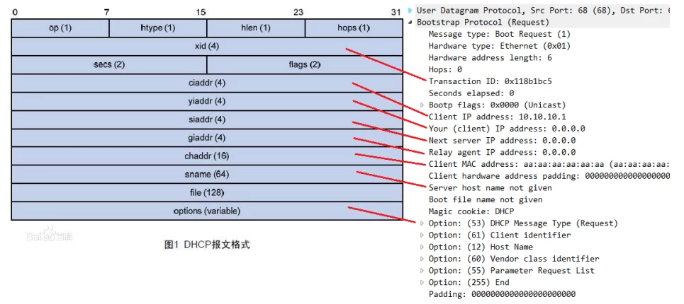
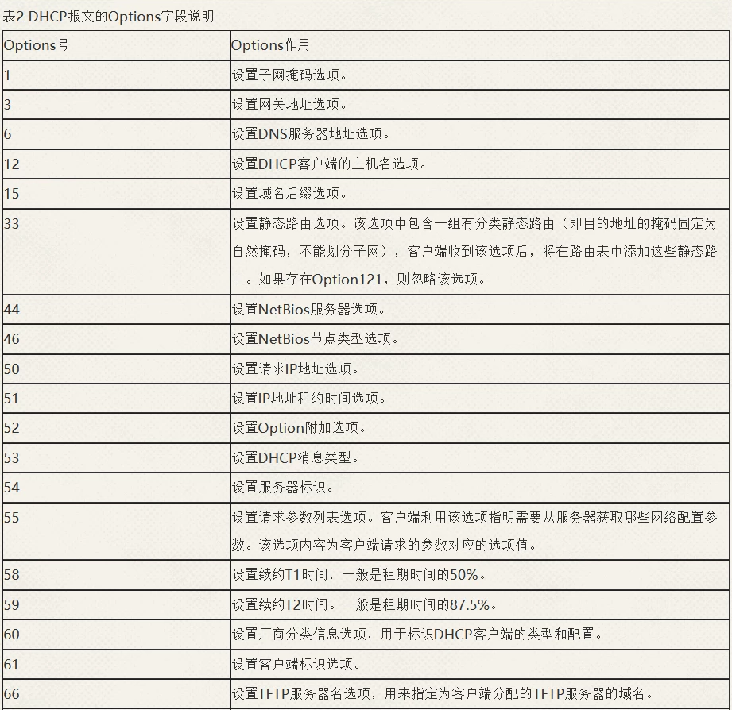
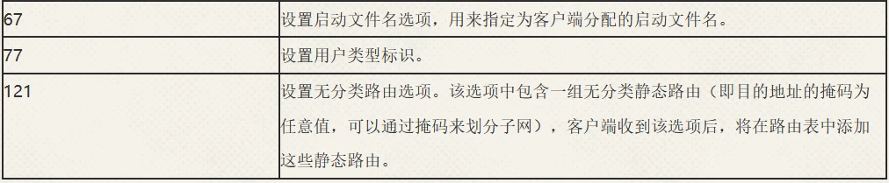
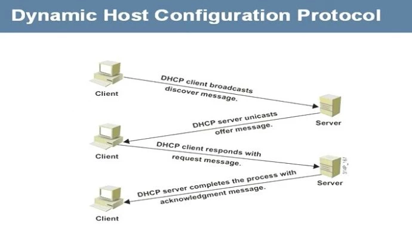
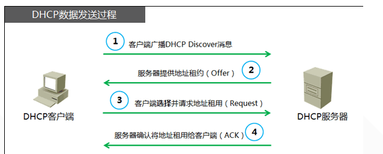
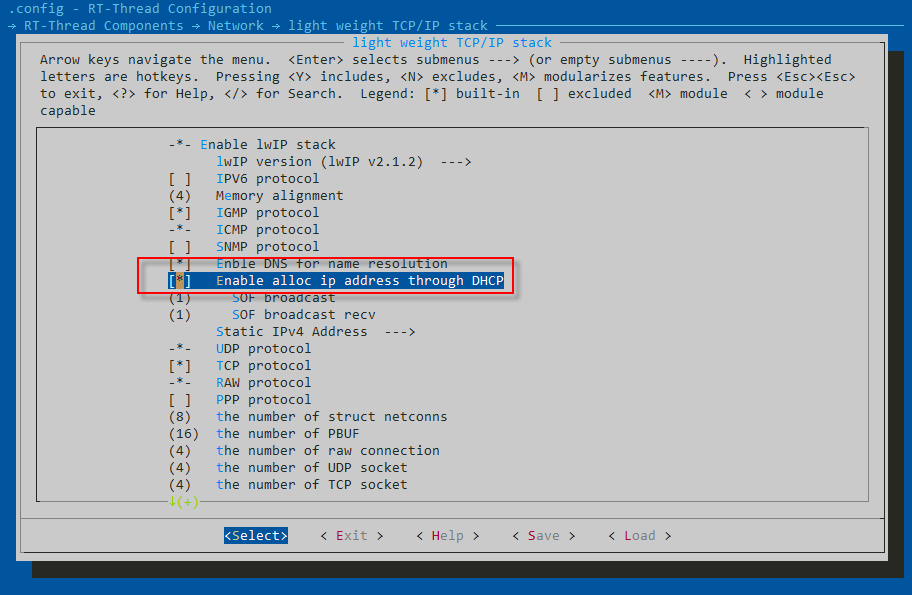
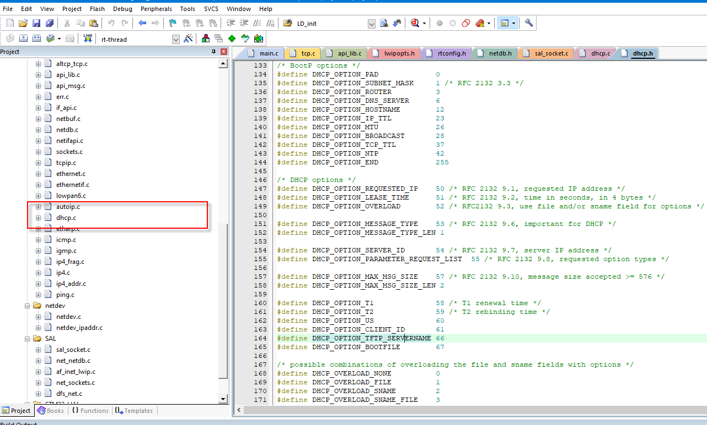
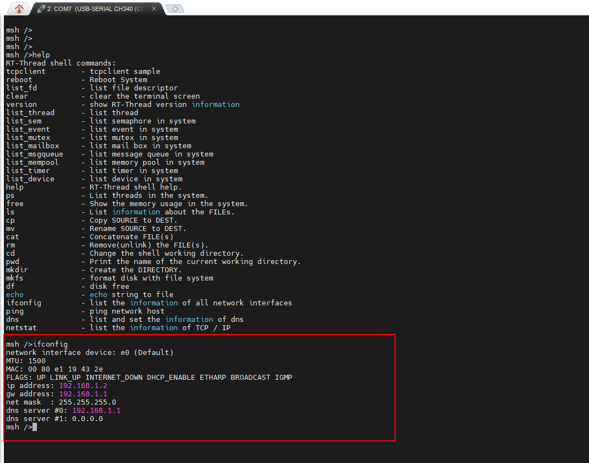
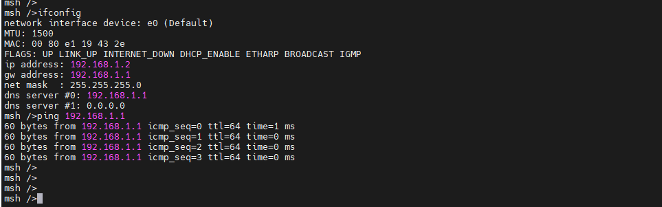
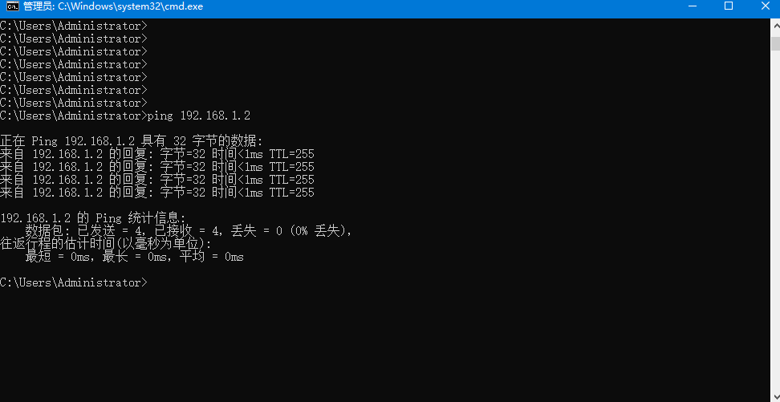

# 什么是 DHCP

动态主机配置协议 DHCP（Dynamic Host Configuration Protocol）是一种对基于 TCP/IP 协议主机的网络参数进行动态配置和集中管理的协议，可以实现：

* 为网络主机分配 IP 地址

DHCP 可以提供两种地址分配机制，网络管理员可以根据网络需求为不同的主机选择不同的分配策略。

**动态分配机制：**

通过 DHCP 为主机分配一个有使用期限（这个使用期限通常叫做租期）的 IP 地址。这种分配机制适用于主机需要临时接入网络或者空闲地址数小于网络主机总数且主机不需要永久连接网络的场景。例如，企业出差员工的便携机、咖啡厅的移动终端为了临时接入网络需要获取IP地址。

**静态分配机制：**

网络管理员通过 DHCP 为指定的主机分配固定的 IP 地址。这种分配机制适用于对 IP 地址有特殊要求的主机，例如企业的文件服务器由于需要对外网用户提供服务，需要使用固定的 IP 地址。相比手工静态配置 IP 地址，通过 DHCP 方式静态分配机制避免人工配置发生错误，方便管理员统一维护管理。

* 为网络主机提供除IP地址以外的网络参数

例如 DNS 服务器的 IP 地址、路由信息、网关地址等。

DHCP 也是一种基于客户端/服务器模型的协议。DHCP 服务器上不需要手工记录网络中所有主机 MAC 地址和 IP 地址的对应关系，而是通过地址池管理可供某网段主机使用的 IP 地址。

当主机成功向 DHCP 服务器申请到 IP 地址后，DHCP 服务器才会记录主机 MAC 地址和 IP 地址的对应关系，且此过程不需要人工参与。同时，DHCP 服务器还可以为某个网段内主机动态分配相同的网络参数，例如，缺省网关、DNS 服务器的 IP 地址等。

DHCP 可以把同一个地址在不同时间分配给不同的主机，当主机不需要使用地址时，可以释放此地址，供其他主机使用，从而实现了 IP 地址的重复利用。

* DHCP 的优点
  1. 降低网络接入成本
  2. 降低主机配置成本
  3. 提高 IP 地址利用率
  4. 方便统一管理

# DHCP报文格式及实现原理

## 报文格式

括号里的数字表示字段的长度，单位是字节

| 报文名称      |      说明    |
| :----------- | :------------------: |
| DHCP DISCOVER | DHCP客户端首次登录网络时进行DHCP交互过程发送的第一个报文，用来寻找DHCP服务器。 |
| DHCP OFFER    | DHCP服务器用来响应DHCP DISCOVER报文，此报文携带了各种配置信息。 |
| DHCP REQUEST  | 此报文用于以下三种用途。1、客户端初始化后，发送广播的DHCP REQUEST报文来回应服务器的DHCP OFFER报文。2、客户端重启后，发送广播的DHCP REQUEST报文来确认先前被分配的IP地址等配置信息。3、当客户端已经和某个IP地址绑定后，发送DHCP REQUEST单播或广播报文来更新IP地址的租约。 |
| DHCP ACK      | 服务器对客户端的DHCP REQUEST报文的确认响应报文，客户端收到此报文后，才真正获得了IP地址和相关的配置信息。 |
| DHCP NAK      | 服务器对客户端的DHCP REQUEST报文的拒绝响应报文，例如DHCP服务器收到DHCP REQUEST报文后，没有找到相应的租约记录，则发送DHCP NAK报文作为应答，告知DHCP客户端无法分配合适IP地址。 |
| DHCP DECLINE  | 当客户端发现服务器分配给它的IP地址发生冲突时会通过发送此报文来通知服务器，并且会重新向服务器申请地址。 |
| DHCP RELEASE  | 客户端可通过发送此报文主动释放服务器分配给它的IP地址，当服务器收到此报文后，可将这个IP地址分配给其它的客户端。 |
| DHCP INFORM   | DHCP客户端获取IP地址后，如果需要向DHCP服务器获取更为详细的配置信息（网关地址、DNS服务器地址），则向DHCP服务器发送DHCP INFORM请求报文。 |

* DHCP 报文中的 Options 字段

  DHCP 报文中的 Options 字段可以用来存放普通协议中没有定义的控制信息和参数。如果用户在 DHCP 服务器端配置了 Options 字段，DHCP 客户端在申请IP 地址的时候，会通过服务器端回应的 DHCP 报文获得 Options 字段中的配置信息。

  Options 字段的格式如下图1所示。

Options 字段由 Type、Length 和 Value 三部分组成。这三部分的表示含义如下所示：

| 字段   |      长度      |        含义 |
| :----- | :------------: | ---------------: |
| Type   |          1字节           |           该字段表示信息类型。 |
| Length |          1字节           | 该字段表示后面信息内容的长度。 |
| Value  | 其长度为 Length 字段所指定 |           该字段表示信息内容。 |

DHCP Options 选项的取值范围为 1～255，如下表 2 所示，介绍 DHCP Options 的部分知名选项

dhcp_work_01.png

## 实现原理

* 发现阶段

DHCP 客户端在网络中广播发送 DHCP DISCOVER 请求报文，发现 DHCP 服务器，请求 IP 地址租约

* 提供阶段

DHCP 服务器通过 DHCP OFFER 报文向 DHCP 客户端提供 IP 地址预分配

* 选择阶段

DHCP 客户端通过 DHCP REQUEST 报文确认选择第一个 DHCP 服务器为它提供 IP 地址自动分配服务

* 确认阶段

被选择的 DHCP 服务器通过 DHCP ACK 报文把在 DHCP OFFER 报文中准备的 IP 地址租约给对应 DHCP 客户端

# RT-Thread 中使用 DHCP 功能

本次基于 env 环境搭建工程，基于 STM32F407 开发板，LAN8720 网口

light weight tcp/ip stack 这个里面内容比较多，根据自己的需要选择相应的功能即可，本次我们测试 DHCP 功能，选择 DHCP 功能

退出保存即可

需要注意的是，需要经过路由器连接，电脑连接路由器，开发板网口也连接路由器，输入 ifconfig，发现已经自动获取到 IP 地址啦

接下来 ping 一下我们的主机

礼尚往来，主机 ping 一下我们的开发板

