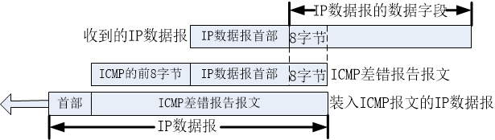

ICMP
----

### ICMP 功能简介

IP是一种不可靠、无连接的协议，只在各个主机间交付数据，但是**对于数据的到达与否，IP 并不关心**。为了提高数据交付的准确性，ICMP ( Internet
Control Message Protocol ，因特网控制报文协议 ) 随之出现。在交付数据时，如果由于网络状况不佳、链路不通等情况导致数据报无法到达目标主机，ICMP 就会返回一个差错报文，让源主机知道数据没能正常到达目标主机，接着进行重发或者放弃发送都可以。

ICMP 通常被认为是 IP 层协议的一部分，但从体系结构上讲它是位于 IP 层之上的，因为 ICMP 报文是承载在 IP 数据报中的。这就是说：**ICMP 报文是作为 IP 数据报数据区域的，就像 TCP 与 UDP 报文作为 IP 数据报区域那样。**类似的，**当一台主机收到一个指明上层协议为 ICMP 的 IP 数据报时**，它将分解出该数据报的内容给 ICMP，就像分解出一个数据报的内容给 TCP 或 UDP 一样，但与 TCP 或 UDP 又有所不同，**ICMP 不是为上层应用程序提供服务，而只是在 IP 层传递差错信息的报文，依赖于 IP 进行传输。**

### ICMP 报文结构

ICMP 报文是使用 IP 数据报来封装发送的，所以 ICMP 报文也没有额外的可靠性与优先级，它一样会被别的路由器丢弃。与此同时，ICMP 报文封装在 IP 数据报中，IP 数据报封装在以太网中，因此 ICMP 报文经过了两次封装，具体如下述所示：

ICMP 报文与 IP 报文一样，都由首部与数据区域组成，ICMP 首部是 8 个字节，对于不同类型的 ICMP 报文，ICMP 报文首部的格式也会略有不同，但首部的前四个字节是通用的。

**第一个字节：**占据 8 bit 空间，是类型 (type) 字段，表示产生这种类型 ICMP 报文的原因。
**第二个字节：**占据 8 bit 空间，是代码 (code) 字段，进一步描述了产生这种类型 ICMP 报文的具体原因。每种类型的报文都可能有多个，比如目的不可达报文，产生这种报文的原因可能有主机不可达、协议不可达、端口不可达等。
**第三个字节：**占据 16 bit 空间，是校验和字段，用于记录包括 ICMP 报文数据部分在内的整个 ICMP 数据报的校验和，以检验报文在传输过程中是否出现了差错，其计算方法与 IP 数据报中首部校验和的计算方法是一样的。

ICMP 首部剩下的四个字节会因为不同类型的报文而有不一样的定义，并且数据部分的长度也存在差异。ICMP 报文格式如下图所示：

### ICMP 报文类型

 ICMP 报文可以划分为 **差错报告** 和 **报文查询** 报文两类。

- **差错报告报文**主要用来向 IP 数据报源主机返回一个差错报告信息，而产生这个差错报告信息的原因是路由器或者主机不能对当前数据进行正常的处理，简单来说，就是源主机发送的数据报无法到达目标主机，或者到达了目标主机而无法递交给上层协议。

- **查询报文**适用于一台主机向另一台主机发送一个请求情况，如果目标主机收到这个查询的请求后，就会按照查询报文的格式向源主机做出应答，比如我们使用的 ping 命令，它的本质就是一个 ICMP 查询报文。

 差错报告报文与查询报文的具体类型如下表所示：

虽然 ICMP 报文有很多，但是它并不能纠正错误，只是借助IP简单报告差错，然后将差错报文返回源主机。因为如果出现差错，那么数据报中可用的就只有目标 IP地址和源 IP 地址，源主机收到 ICMP 差错报文后，传递给上层协议，至于要如何处理差错就不在 ICMP 的作用范围内。

#### ICMP 差错报告报文

- **目的不可达：**当路由器或主机不能交付数据报时就向源主机发送终点(目的)不可达的报文。

- **超时：**IP 数据报首部有一个 TTL 字段，当 IP 数据报每经过一个路由器转发，TTL 的值就会减 1，如果 TTL 的值被减到 0，那么路由或者主机就会丢弃该数据报，并返回一个 ICMP 超时报文到源主机中。此外，在数据报分片重装的时候也使用了 ICMP 报文，当所有的 IP 分片数据报无法在规定的时间内完成重装时，主机也会认为它超时了，那么这些数据报就会被删除，同时返回一个 ICMP 超时报文到源主机中。

- **参数问题：**IP 数据报在网络中传输时，都是根据其首部进行识别的，如果首部出现错误，那么就会产生严重的问题，因此**如果 IP 数据报首部出现错误就会丢弃数据报，并且向源主机返回一个 ICMP 参数错误表。**不过，**对于携带 ICMP 差错报文的数据报、非第一个分片的分片数据报、具有特殊目的地的数据报 ( 如环回、多播、广播 ) 等，即使出现了差错，也不会返回对应的差错报文。**

- **重定向：**一般来说，某个主机在启动的时候只有一个路由表 ( 即：默认路由 )，所以它发送的数据都发给了默认路由，让其帮忙转发，而路由器发现数据应该是发送给另一个路由的，那么它会返回一个 ICMP 重定向报文给源主机，告诉源主机应该直接发给另一个路由器。**重定向一般用来让刚启动的主机逐渐建立更完善的路由表**，**重定向报文只能有路由器生成而不能有主机生成，但是使用重定向报文的只能是主机而非路由器**。在主机刚开始工作时，一般都在路由表中设置一个默认路由器的 IP 地址，不管数据报要发送到哪个目的地，都一律先把数据报传送给这个默认路由器，而这个默认路由器知道到每一个目的网络的最佳路由 ( 通过和其他路由器交换路由信息 )。如果路由器发现主机发往某个目的地址的数据报的最佳路由应该经过网络上的另一个路由器 R 时，就会发送重定向的 ICMP 报文将此情况告诉主机。于是主机就会在其路由表中增加一个项目：到某某目的地址应该经过路由器 R ( 而不是默认路由器 )。

**所有 ICMP 差错报文中的数据字段都具有同样的格式：把收到的需要进行差错报告的 IP 数据报的首部和数据字段的前 8 个字节提取出来，作为 ICMP 报文的数据字段，再加上相应的 ICMP 差错报文的前 8 个字节，就构成了 ICMP 差错报告报文。**如下图所示：

提取收到的数据报的数据字段前 8 个字节是为了得到运输层的端口号 ( 对于 TCP 和 UDP ) 以及运输层报文的发送序号 ( 对于 TCP )，这些信息对源主机通知高层协议是有用的，然后整个 ICMP 报文作为 IP 数据报的数据字段发送给源主机。

#### ICMP 查询报文

ICMP 的查询报文常见的只有两种：

- **回送请求和回答：**ICMP 回送请求报文是由主机或路由器向一个特定的目的主机发出的询问。收到此报文的主机必须给源主机或路由器发送 ICMP 回送回答报文。这种询问报文用来测试目的站是否可达以及了解其有关状态。

- **时间戳请求和应答：**ICMP 时间戳请求报文是请某台主机或路由器回答当前的日期和时间。在 ICMP 时间戳回答报文中有一个 32 位的字段，其中写入的整数代表从 1900 年 1 月 1 日起到当前时刻一共多少秒。**时间戳请求和回答可用于时钟同步和时间测量。**

ICMP 查询报文最通用的一个事例是 **ping 命令**，用来测试两台主机之间的连通性。ping 是应用层直接使用**网络层ICMP**的一个例子，**它没有通过传输层的 TCP 或 UDP**。Windows 操作系统的用户可以在接入互联网后，在 CMD 中输入 **ping hostname ( hostname 是要测试连通性的主机名或它的 IP 地址 ) **，按回车键后就可看到结果。
