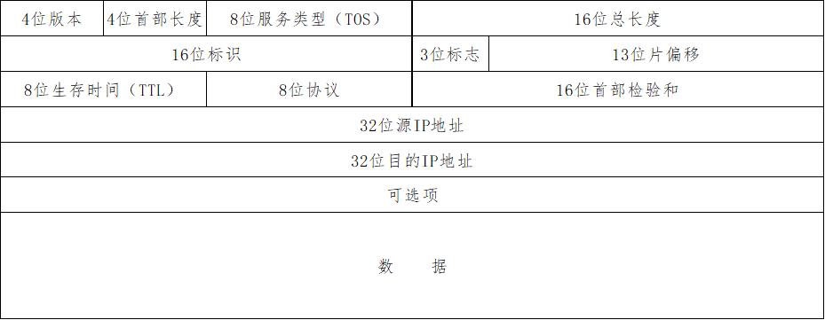

# IP报文基础及其在Lwip的实现

## 1\. IP的背景

  IP 协议是 TCP/IP 协议中最为核心的协议，所有的 TCP、UDP、ICMP 及 IGMP 数据都已 IP 数据报格式传输。IP协议在 TCP/IP 协议族的分层中属于网络层，不难理解，IP 的主要作用有两个：其一是对上层协议[^1^]( ## 4 参考资料)的数据进行封装（ 增加 IP 首部 ），然后交给链路层协议进行发送；其二是对链路层接收到的数据进行解析，并根据解析结果将数据交给对应的上层协议进行处理。

  本文主要介绍 IP 数据报的格式，以及 IP 相关功能在 Lwip 中的实现方式，希望能对同样在学习 Lwip 的小伙伴们有所帮助。

## 2\. IP基础知识介绍

### 2.1 IP数据报的格式

  IP数据报的格式主要包含 IP 首部和数据，通常情况下，IP 首部的长度为 20 字节（含有选项字段的除外），具体如下图所示：



#### 2.1.1 版本

  协议版本号，当前普遍应用的 IP 协议版本号是 4，因此也常称为 IPv4。

#### 2.1.2 首部长度

  首部长度即 IP 首部所占用的 32 bit 字的数目。因为首部长度是一个 4 bit 段，其最大值是 15，也就意味着 IP 首部的最大长度是 60 字节。

#### 2.1.3 服务类型（TOS）

  服务类型字段长 8 位，最初的 TOS 字段中最高 3 位表示优先权，随后的 4 位表示服务类型，最后一位保留，恒设置为 0。

  当前的服务类型字段已经作为区分服务（Diffserv）架构的一部分被重新定义了，重定义的服务类型字段中前6位构成了区分代码点（DiffServ Code Point, DSCP），后 2 位用于显示拥塞通知（Explicit Congestion Notification, ECN）。这两个概念不是很易懂，在 Lwip 中，该字段由上层协议设定，经过在 windows系统下的随机抓包发现，该字段通常设置位 0x00，因此对该字段不再深究。

#### 2.1.4 总长度

  总长度即整个 IP 数据报的长度，单位是字节。因为总长度是一个 16 位字段，其最大值是 65535，所以 IP 数据报的最大长度位 65535 字节。利用总长度和首部长度两个字段就可以知道 IP 数据报中数据的起始位置和长度。

>     注意总长度和首部长度的单位不同，总长度的单位是字节，而首部长度的单位是 32 位字。

#### 2.1.5 标识

  标识字段唯一的标识发送的每一份数据报，通常每发送一份报文它的值就会加 1。在 Lwip 的源文件 "ip4.c" 中，定义了一个变量 `static u16_t ip_id`用于记录 IP 数据报的唯一标识，其初始值为 0，每次发送 IP 数据报时都将该变量的值填入 IP 首部的标识字段中，然后将该变量 +1。

#### 2.1.6 标志

  标志字段共有 3 位，其中第 1 位没有使用。第 2 位是不分段（DF）位，置 1 表示路由器不能对数据进行分段处理，如果数据包由于不能被分段而未能被转发，则路由器会丢弃该数据包并向源点发送错误消息。第三位是还有更多分段（MF）位，即表示数据还有其他的分段，当路由器对数据包进行分段时，除最后一个分段外，其他所有的分段 MF 位都应置 1，以便接收端直到接收到 MF 位为 0 的分段为止。

#### 2.1.7 生存时间（TTL）

  生存时间反应了从源 IP 到目的 IP 经过的路由器数量即跳数。在最初创建 IP 数据报时，TTL 被设置为一个特定的值，通常是 32 或者 64，数据报每经过一个路由器，该路由器就将 TTL 减 1，因此可以通过 TTL 的值推算 IP 数据报经过的跳数。

#### 2.1.8 协议

  协议字段给出了 IP 协议上层协议的协议号，当前已分配的协议号有 100 多个，下表列出了一些常见的协议号，更多的协议号可以自百度。

| 协议号 | 协议                         |
| ------ | ---------------------------- |
| 1      | Internet消息控制协议（ICMP） |
| 2      | Internet组管理协议（IGMP）   |
| 4      | 被IP协议封装的IP             |
| 6      | 传输控制协议（TCP）          |
| 17     | 用户数据报协议（UDP）        |

#### 2.1.9 首部检验和

  首部检验和是针对 IP 首部的纠错字段，检验和不计算被封装的数据。检验和的计算方法和验证方法将在后文的代码分析部分进行介绍。

#### 2.1.10 源地址和目的地址

  顾名思义，指 IP 数据报的来源和目的 IP 地址，我们平时常见的 IP 地址如 “192.168.0.1” 是 IP 地址的点分十进制表示方法，是方便人读写和记忆的，IP 地址对于电子设备来说是一个 32 位的二进制数。

#### 2.1.11 可选项

  首先，可选项不是所有 IP 数据报都有的，可选项可以包含源点产生的信息和路由器产生的信息；其次，可选项的长度必须是 32 位的整数倍，最长长度是 40 个字节，这一点从首部长度的定义也可以看得出来，如果长度不是 32 位的整数倍，可以在结尾补 0 以满足要求。

  常用的可选项有安全和处理限制（常用于军事领域）、记录路径、时间戳、宽松的源站选路、严格的源站选路。因为使用频率很低而且并非所有的主机和路由器都支持这些可选项，此处不再详细叙述，感兴趣的小伙伴可以自行查阅资料进行了解。

### 2.2 IP地址基础知识

  前面的已经提到，IP 地址的是一个 32 位的二进制数，为了方便记忆和读写，常用点分十进制的方法来表示 IP 地址。IP 地址中包含了网络号和主机号，可能还包含有子网号，为了能正确的从 IP 地址中获取网络号、主机号、子网号，还需要有子网掩码的辅助。本小结简要介绍IP的点分十进制表示方法，网络号、主机号、子网号和子网掩码的含义。

#### 2.2.1 IP地址的点分十进制表示方法

  为了方便记忆和表述，将 32 位的 IP 地址分为 4 个字节，将每个字节都以十进制表示，在四个字节转换得到的十进制数中间分别加一个点用以区分，这就是我们常见的 IP 地址的形式。

  比如面这个 IP 地址 \(11000000101010000000000100000001\) 2，直接用二进制表示显得很长，也很难记忆，直接写成 10 进制数是（3,232,235,777）10，写成 16 进制数是（0xC0A8 0101），都比较难以记忆，而用点分十进制表示方法则可以写成 “192.160.1.1”，显然是一个我们经常会接触到的一个 IP 地址。由此可见，点分十进制表示方法，在日常使用中是非常方便的。

#### 2.2.2 网络号、主机号和子网号

  简单的讲，互联网是把一个个小的网络链接起来组成一个庞大的网络，因此要找到一个 IP 地址，首先要找到这个 IP 地址处于哪个小的网络中，然后再找到这个IP对应于这个网络中的哪一台主机。因此 IP 地址就分成了网络号和主机号两个部分。实际上，根据网络号找到一个网络后，这个网络可能会划分成几个更小的网络组成的，也就是说我们还需要再找到该 IP 属于这个网络的哪一个子网，然后才能找到这台主机。而要找到 IP 属于哪一个子网，自然也就需要一个子网号。因为不是所有的网络都会划分子网，因此并不是所有的IP地址都包含子网号的。

#### 2.2.3 IP地址的分类

  前文提到了 IP 地址包含了网络号、主机号，可能还有子网号，那么如果我们已知一个 IP 地址，如何确定这个 IP 是否含有子网号，它的网络号、子网号（如果有）、主机号分别是什么呢？

  要解决这个问题，首先要了解IP地址的分类：A 类地址、B 类地址和 C 类地址。A类地址的前 8 位表示网络号，并且其最高位恒位 0，因此其高 8 位转换成十进制的范围是 1 \~ 126[^2^](## 4  参考资料)，如果用点分十进制的方式表示 IP 地址，那么 A 类 IP 地址的第一段应该在 1 到 126 中间；B 类地址的前 16 位表示网络号，其最高两位恒为 \(10\)~2~，其高8位转换成 10 进制的范围是 128\~191；C类地址的前 24 位表示网络号，其最高三位恒为（110）~2~，高8位转换位10进制的范围是192\~223。

  根据上述规则，就可以确定一个给定IP地址的网络号。

#### 2.2.4 子网掩码

  确定一个 IP 地址的网络号后，还需要确定其子网号和主机号。前文叙述中，有时会把子网号放在主机号之后，这是因为子网号并不总是存在，但在IP地址中的顺序实际上是网络号、子网号（如果有）、主机号。确定网络号后，必须先确定该IP是否含有子网号，子网号是多少（如果有），然后才能获取主机号。

  要确定 IP 中的子网号，就需要子网掩码的辅助了。子网掩码也是一个 32 位的二进制数，并且通常也以点分十进制的方式表示，这一点与 IP 地址类似。其作用是告诉主机 IP 地址中有多少位是用来表示子网号的（实际上是告诉主机IP地址中网络号和子网号加起来有多少位），子网掩码中值位 1 的比特留给网络号和子网号，值为 0 的比特留给主机号。由于已知网络号的位数，通过子网掩码可以知道网络号和子网号的总位数，自然也就能区分出 IP 地址中的网络号、子网号和主机号了。

  以上文提到的 IP 地址 “192.168.1.1” 为例，假设其子网掩码为 “255.255.255.0”。首先根据第一段的值 “192” 可以确定该 IP 地址属于 C 类 IP，有 24 位表示网络号，其网络号位 “192.168.1”。子网掩码的高 24 位为 1，低 8 位为 0，说明网络号和子网号加起来共计 24 位，也就是说这里没有进行子网划分，那么其主机号就是 “1”。

  因为 IP 地址总是按网络号、子网号、主机号排列的，不难理解子网掩码的一个特征：高位是连续的 1，低位是连续的 0。在 Lwip 的实现中，“ip4\_aaddr.c” 中有一个检验子网掩码合法性的函数 `ip4_addr_netmask_valid`，就是利用这个特征，对于一个待检验的数，从最高位起，找到第一个 0，然后再检查第一个 0 后面还有没有 1，如果没有，说明待检验数是一个合法的子网掩码。

## 3\. IP相关功能在 Lwip 中的实现

### 3.1 ip\_hdr 结构体简介

  ip\_hdr 结构体就是 IP 首部的结构体，其定义如下：

```c
struct ip_hdr {
  PACK_STRUCT_FLD_8(u8_t _v_hl);
  PACK_STRUCT_FLD_8(u8_t _tos);
  PACK_STRUCT_FIELD(u16_t _len);
  PACK_STRUCT_FIELD(u16_t _id);
  PACK_STRUCT_FIELD(u16_t _offset);
  PACK_STRUCT_FLD_8(u8_t _ttl);
  PACK_STRUCT_FLD_8(u8_t _proto);
  PACK_STRUCT_FIELD(u16_t _chksum);
  PACK_STRUCT_FLD_S(ip4_addr_p_t src);
  PACK_STRUCT_FLD_S(ip4_addr_p_t dest);
} PACK_STRUCT_STRUCT;
```

  在源代码中包含了对每个元素的注释，结合注释和 IP 首部的格式，不难理解各元素所代表的的意义。需要注意的一点是，IP 首部并不都是按字节定义数据的含义的，但是在 `ip_hdr` 结构体中，对部分字段进行了合并，方便了结构体定义。IP 首部的版本和首部长度两个字段，其长度都是 4 位，并且位置相邻，因此在 `ip_hdr `结构体总将这两个字段合并在一起，定义了一个 8 位的变量 `_v_hl`，其中的 "v" 便是 version，"hl" 即 head lenth。IP 首部的 3 位标志字段和 13 位的片偏移字段则合并成一个 16 位的变量 `_offset`。剩余变量则都与 IP 首部的字段一一对应，小伙伴们可自行翻阅源码，并对照 IP 数据报格式自行理解。

  从结构体定义来看，结构体中并没有可选项相关的元素，但这并不意味着 Lwip 没有支持可选项的能力。

### 3.2 Lwip 中 IP 层数据发送流程简介

  Lwip中，IP层对发送数据的处理依次经过了 `ip4_output`、`ip4_output_if`、`ip4_output_if_opt`、`ip4_output_if_opt_src `四个函数。`ip4_output `函数中，根据目的 IP 地址确定了该 IP 数据报的发送路径（即通过哪个网卡发送该数据报），并将传入的数据和网卡信息传递给函数 `ip4_output_if`。在当前定义中，函数 `ip4_output_if` 没有做任何操作，直接将数据传送给函数 `ip4_output_if_opt`，`ip4_output_if_opt` 比 `ip4_output_if` 多出的两个形参 `void *ip_options` 和 `u16_t optlen` 分别传入了实参空指针和 0。函数 `ip4_output_if_opt` 中根据选定的网卡确定了源地址，然后再次将所有数据传递给函数 `ip4_output_if_opt_src` 。函数 `ip4_output_if_opt_src` 根据传入的信息，完成 IP 报文首部的填充，然后调用网卡的发送函数，将 IP 数据报交由链路层处理。每个函数的具体实现，请小伙伴们自行阅读源码。

  接下来讨论下 Lwip 对 IP 首部可选项的处理。首先可以确定的是，Lwip 是有处理可选项的能力的，前面提到 `ip4_output_if_opt` 比 `ip4_output_if` 多出两个形参，这连个形参实际上就是指可选项的内容和长度，在传入实参时直接传入了空指针和 0，也就是说所有以函数 `ip4_output` 为处理起点的 IP 数据报，都是没有可选项的。如果想要发送一个首部含有可选项的 IP 数据报，则上层协议需要调用函数 `ip4_output_if_opt`，而以该函数位处理起点的 IP 数据报，就跳过了查找发送路径这一功能。在源码 "ip4.h" 中，有一句注释 “Currently, the function ip\_output\_if\_opt\(\) is only used with IGMP ”，据此推测，只有 IGMP 协议在发送IP数据报时调用的是函数 `ip4_output_if_opt`，而其他协议则调用 `ip4_output` 函数，至于该推测是否准确，需要分析上层协议的源码，本文不再进一步扩展。

  首部检验和的计算方法。关于首部检验和的计算方法，不同的参考资料中描述有所不同。也许是因为协议发展过程中有所改变，也许是有些书籍中出现了谬误，也许是这些不同的描述本质上是一样的（这设计到比较深奥的数学知识，已经超出了我的能力范畴），因此吧检验的介绍放到源码分析的部分来讲解，结合代码中的实际操作，确保给小伙伴们呈现除一个正确的计算方法。首部检验和的计算，属于 IP 首部填充的一部分，其源码实现包含在 `ip4_output_if_opt_src` 中。计算的方法是，定义一个 32 位的变量 `chk_sum` 并初始化为 0，然后将 IP 首部的内容按 16 位字相加，注意此处 IP 首部的检验和字段本身无需参与运算，然后将得到的结果进行如下处理：

```c
chk_sum = (chk_sum >> 16) + (chk_sum & 0xFFFF);
chk_sum = (chk_sum >> 16) + chk_sum;
chk_sum = ~chk_sum;
```

最终得到的结果即为检验和，将其填入检验和字段即可。

### 3.3 Lwip 中接收数据处理简介

  Lwip 中 IP 层处理接收数据的函数是 `ip4_input`。该函数首先对 IP 数据报的合法性进行检查，包括 IP 版本、检验和、长度等信息的检查，然后判断 IP 数据报是否确实是却要本机接收的，如果满足以上条件，则根据 IP 首部中的协议字段，将 IP 数据报转发给对应的上层协议进行处理。

## 4 参考资料

1.  RT-THREAD Lwip 组件 v2.0.2源码；
2.  《TCP-IP详解卷一：协议》；
3.  《TCP/IP路由技术（第一卷）（第二版）》。

* * *

1. ICMP 和 IGMP 与IP同样属于网络层，但是因为其数据也需要以IP数据报的格式传输，所以也可以看做是IP的上层协议。

2. 网络号不能为全0或全1。

