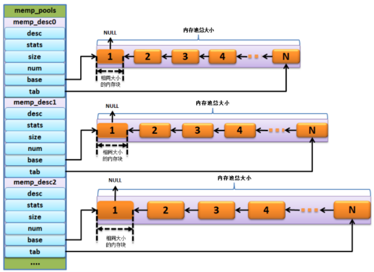

# Lwip 内存池内数据的初始化分配 

## 1.简述

​	Lwip内存管理方式有三种：C库自带的内存分配策略，动态内存堆（HEAP）分配策略，动态内存池（POOL）分配策略。

​	本篇文章只对内存池（POOL）数据的初始化分配做详细展开，内存池是一块连续的大内存，可看作数组。

​	优点：内存的分配、释放效率高，可以有效防止内存碎片的产生。

​	缺点：浪费部分内存。	

​	动态内存池（pool）,pool有很多种，pool的个数由用户配置，根据协议栈实际使用状况进行规划。协议栈中所有pool是一片连续的内存区域。为什么LWIP需要有pool？因为协议栈里面有大量的协议首部，这些协议首部长度都是固定不变的，所以可以首先分配固定内存，给这些固定长度的协议首部，以后每次需要处理协议首部时，都直接使用这些已经分配的内存，不需要重新分配内存区域，这样子就达到一个地方分配，多个地方使用的方便与效率。 


## 2.数据结构

- `memp_t `：枚举类型，为每种pool定义编号。

  ```c
  typedef enum {
  #define LWIP_MEMPOOL(name,num,size,desc)  MEMP_##name,
  #include "lwip/memp_std.h"
  MEMP_MAX
  } memp_t;
  ```

  简单看下这个枚举类型定义，##表示连接符，头文件做数组元素，表示在预处理阶段把头文件内容复制到此结构中。展开后，`memp_t`如下。

  ```c
  typedef enum {
  MEMP_RAW_PCB,
  MEMP_UDP_PCB,
  MEMP_TCP_PCB,
  MEMP_TCP_PCB_LISTEN,
  MEMP_TCP_SEG,
  ...
  MEMP_MAX
  } memp_t;
  ```

- `memp_tab[] `：指针数组，分别指向每类pool的第一个元素。

- `memp_sizes[] `：数组，每种pool中的独立元素所占字节数。
  ```c
  static const u16_t memp_sizes[MEMP_MAX] = {
  #define LWIP_MEMPOOL(name,num,size,desc)  LWIP_MEM_ALIGN_SIZE(size),
  #include "lwip/memp_std.h"
  };
  
  //展开如下
  static const u16_t memp_sizes[MEMP_MAX] = {
  LWIP_MEM_ALIGN_SIZE(sizeof(struct raw_pcb)),
  LWIP_MEM_ALIGN_SIZE(sizeof(struct udp_pcb)),
  LWIP_MEM_ALIGN_SIZE(sizeof(struct tcp_pcb)),
  LWIP_MEM_ALIGN_SIZE(sizeof(struct tcp_pcb_listen)),
  LWIP_MEM_ALIGN_SIZE(sizeof(struct tcp_seg)),
  ...
  };
  ```
- `memp_num[] `：数组，每种pool中所有元素的个数。
  ```c
  static const u16_t memp_num[MEMP_MAX] = {
  #define LWIP_MEMPOOL(name,num,size,desc)  (num),
  #include "lwip/memp_std.h"
  };
  
  //展开如下
  
  static const u16_t memp_num[MEMP_MAX] = {
  MEMP_NUM_RAW_PCB,
  MEMP_NUM_UDP_PCB,
  MEMP_NUM_TCP_PCB,
  MEMP_NUM_TCP_PCB_LISTEN,
  MEMP_NUM_TCP_SEG,
  ...
  };
  ```
- `memp_desc[] `：指针数组，指向每个pool的描述字符串。
  ```c
  static const char *memp_desc[MEMP_MAX] = {
  #define LWIP_MEMPOOL(name,num,size,desc)  (desc),
  #include "lwip/memp_std.h"
  };
  
  //展开如下
  
  static const char *memp_desc[MEMP_MAX] = {
  ("RAW_PCB"),
  ("UDP_PCB"),
  ("TCP_PCB"),
  ("TCP_PCB_LISTEN"),
  ...
  };
  ```
- `memp_memory[] `：数组，所有pool所占内存总和。
  ```c
  static u8_t memp_memory[MEM_ALIGNMENT - 1 
  #define LWIP_MEMPOOL(name,num,size,desc) + ( (num) * (MEMP_SIZE + MEMP_ALIGN_SIZE(size) ) )
  #include "lwip/memp_std.h"
  ];
  
  //展开如下
  
  static u8_t memp_memory[MEM_ALIGNMENT - 1 
  + ( (MEMP_NUM_RAW_PCB) * (MEMP_SIZE + MEMP_ALIGN_SIZE(sizeof(struct raw_pcb)) ) )
  + ( (MEMP_NUM_UDP_PCB) * (MEMP_SIZE + MEMP_ALIGN_SIZE(sizeof(struct udp_pcb)) ) )
  + ...];
  ```
## 3.函数接口

- `memp_init`：对`memp_pools`数组进行初始化，包括对齐内存池首地址、清空内存池空间、构建内存池链表、初始化内存统计结构体。
- `memp_malloc`：根据传入的内存池类型进行实际内存分配。
- `memp_free`：内存释放。

## 4.内存池初始化分配

```c
    void
    memp_init(void)
    {
        u16_t i;

        /* 对每个类型的内存池进行初始化 */
        for (i = 0; i < LWIP_ARRAYSIZE(memp_pools); i++) {
            memp_init_pool(memp_pools[i]);

        #if LWIP_STATS && MEMP_STATS
            lwip_stats.memp[i] = memp_pools[i]->stats;
        #endif
        }

        #if MEMP_OVERFLOW_CHECK >= 2
        /* 第一次检查一切，看看它是否有效 */
        memp_overflow_check_all();
        #endif /* MEMP_OVERFLOW_CHECK >= 2 */
    }
```

```c
    void
    memp_init_pool(const struct memp_desc *desc)
    {
        #if MEMP_MEM_MALLOC
        LWIP_UNUSED_ARG(desc);
        #else
        int i;
        struct memp *memp;

        *desc->tab = NULL;
        /* 内存池起始空间对齐 */
        memp = (struct memp*)LWIP_MEM_ALIGN(desc->base);
        /* create a linked list of memp elements */
        for (i = 0; i < desc->num; ++i) {
            /* 将当前种类所有pool以链表方式链接 */
            memp->next = *desc->tab;
            *desc->tab = memp;
            #if MEMP_OVERFLOW_CHECK
            memp_overflow_init_element(memp, desc);
            #endif /* MEMP_OVERFLOW_CHECK */
            /* 地址偏移 */
            memp = (struct memp *)(void *)((u8_t *)memp + MEMP_SIZE + desc->size
                #if MEMP_OVERFLOW_CHECK
                + MEMP_SANITY_REGION_AFTER_ALIGNED
                #endif
            );
        }
        #if MEMP_STATS
        desc->stats->avail = desc->num;
        #endif /* MEMP_STATS */
        #endif /* !MEMP_MEM_MALLOC */

        #if MEMP_STATS && (defined(LWIP_DEBUG) || LWIP_STATS_DISPLAY)
        desc->stats->name  = desc->desc;
        #endif /* MEMP_STATS && (defined(LWIP_DEBUG) || LWIP_STATS_DISPLAY) */
    }
```



## 5.内存分配
```c
    #define memp_malloc(t) memp_malloc_fn((t), __FILE__, __LINE__)

    void * 
    memp_malloc_fn(memp_t type, const char* file, const int line)
    {
        void *memp;
        LWIP_ERROR("memp_malloc: type < MEMP_MAX", (type < MEMP_MAX), return NULL;);
    
        memp = do_memp_malloc_pool_fn(memp_pools[type], file, line);
    
        return memp;
    }

    static void*    
    do_memp_malloc_pool_fn(const struct memp_desc *desc, const char* file, const int line)
    {
      struct memp *memp;
      SYS_ARCH_DECL_PROTECT(old_level);
   
      SYS_ARCH_PROTECT(old_level);

      memp = *desc->tab;

      if (memp != NULL) {
    #if !MEMP_MEM_MALLOC
    #if MEMP_OVERFLOW_CHECK == 1
        memp_overflow_check_element_overflow(memp, desc);
        memp_overflow_check_element_underflow(memp, desc);
    #endif /* MEMP_OVERFLOW_CHECK */

        *desc->tab = memp->next;
    #if MEMP_OVERFLOW_CHECK
        memp->next = NULL;
    #endif /* MEMP_OVERFLOW_CHECK */
    #endif /* !MEMP_MEM_MALLOC */
    #if MEMP_OVERFLOW_CHECK
        memp->file = file;
        memp->line = line;
    #endif /* MEMP_OVERFLOW_CHECK */
        LWIP_ASSERT("memp_malloc: memp properly aligned",
                    ((mem_ptr_t)memp % MEM_ALIGNMENT) == 0);
    
        SYS_ARCH_UNPROTECT(old_level);
        /* cast through u8_t* to get rid of alignment warnings */
        return ((u8_t*)memp + MEMP_SIZE);
      } else {
        LWIP_DEBUGF(MEMP_DEBUG | LWIP_DBG_LEVEL_SERIOUS, \
                    ("memp_malloc: out of memory in pool %s\n", desc->desc));
      }

      SYS_ARCH_UNPROTECT(old_level);
      return NULL;
    }
```
​    内存池申请函数的核心代码`memp = *desc->tab;`执行后，能直接得到对应内存块中的第一个空闲内存块，如果该内存块不是NULL，则将其取出，并且移动 `*desc->tab`指针，指向下一个空闲内存块，然后将`((u8_t *)memp + MEMP_SIZE)`返回。
## 6.内存释放
```c
    void
    memp_free(memp_t type, void *mem)
    {
        LWIP_ERROR("memp_free: type < MEMP_MAX", (type < MEMP_MAX), return;);

        if (mem == NULL) {
            return;
        }
        do_memp_free_pool(memp_pools[type], mem);
    }
```

```c
    static void
    do_memp_free_pool(const struct memp_desc* desc, void *mem)
    {
      struct memp *memp;
      SYS_ARCH_DECL_PROTECT(old_level);

      LWIP_ASSERT("memp_free: mem properly aligned",
                    ((mem_ptr_t)mem % MEM_ALIGNMENT) == 0);

      /* cast through void* to get rid of alignment warnings */
      memp = (struct memp *)(void *)((u8_t*)mem - MEMP_SIZE);

      SYS_ARCH_PROTECT(old_level);

    #if MEMP_OVERFLOW_CHECK == 1
      memp_overflow_check_element_overflow(memp, desc);
      memp_overflow_check_element_underflow(memp, desc);
    #endif /* MEMP_OVERFLOW_CHECK */

      memp->next = *desc->tab;
      *desc->tab = memp;

      SYS_ARCH_UNPROTECT(old_level);
    }
```

​    内存释放函数需要把使用完毕的内存添加到对应内存池中的空闲内存块链表，释放内存有两个参数，一POOL的类型，二内存块的起始地址。