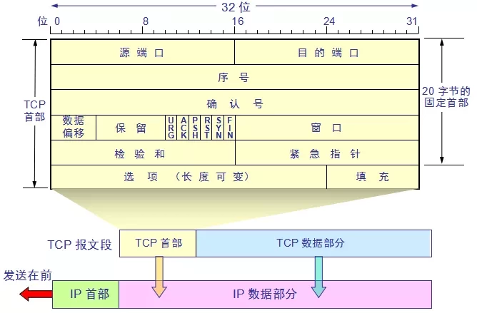

# LWIP TCP 报文基础

TCP协议（Transmission Control Protocol）传输控制协议在LWIP协议栈中占据了大半的代码，它是最常见的传输层协议，也是最稳定的传输层协议，很多上层应用都是依赖 TCP 协议进程传输数据，如 SMTP，FTP 等等。

## TCP 协议简介

TCP 与 UDP 一样，都是传输层的协议，但是提供的服务却不相同，UDP 为上层应用提供的是一种不可靠的，无连接的服务，而 TCP 提供一种面向连接，可靠的字节传输服务，TCP 让两个主机建立连接的关系，应用数据以数据流的形式进行传输，先后发出的数据在网络中虽然也是互不干扰的传输，但是这些数据本身携带的信息确实紧密联系的，TCP 协议会给每个传输的字号进行编号，当然了，两个主机方向上的数据编号是彼此独立的，在传输的过程中，发送方把数据的起始编号与长度放在 TCP 报文中，接收方将所有数据按照编号组装起来，然后返回一个确认，当所有的数据接收完成后才将数据递交到应用层。

## TCP 报文段结构

TCP 报文段依赖 IP 协议进行发送，因此 TCP 报文段与 ICMP 报文 一样，都是封装在 IP 数据报文中，IP 数据报封装在以太网帧中，因此 TCP 报文段也是经过 了两次的封装，然后发送出去,报文结构如下：



1. 源端口（Source Port），16 位。

2. 目的端口（Destination Port），16 位。

3. 序列号 \(Sequence Numbe\) 发送数据包中的第一个字节的，32 位。TCP 协议是基于流发送数据的，所有使用序号给发送的所有数据字节都编上号，并按照序号进行顺序发送。

4. 确认序列号 \(Acknowledgment Number\)，32 位。TCP 的通信是全双工的（两端同时发送和接受），当连接建立成功后，每一方都能同时发送和接收数据。每一个方向的序号代表这个报文段携带的第一个字节数据的编号。每一方还需要使用确认号对它已经收到的字节进行确认。即：本端把收到的最后一个字节的编号加一，这个值就是确认号，然后发送给对端。

5. 数据偏移 \(Data Offset\)，4 位，该字段的值是 TCP 首部（包括选项）长度除以 4。

6. 标志位：6 位，URG 表示紧急指针（Urgent Pointer）字段有意义，ACK 表示确认序（Acknowledgment Number）字段有意义；TCP 规定，只有 ACK=1 时有效，也规定连接建立后所有发送的报文的 ACK 必须为1 。PSH 表示 Push 功能，推送数据。RST 表示复位 TCP 连接 SYN 表示 SYN 报文，在建立 TCP 连接的时候使用，用来同步序号。当 SYN=1 而 ACK=0 时，表明这是一个连接请求报文。对方若同意建立连接，则应在响应报文中使 SYN=1 和 ACK=1。因此,   SYN 置 1 就表示这是一个连接请求或连接接受报文。FIN 表示没有数据需要发送了，终止连接。在关闭 TCP 连接的时候使用，用来释放一个连接。当 FIN = 1 时，表明此报文段的发送方的数据已经发送完毕，并要求释放连接。

7. 窗口（Window）表示接收缓冲区的空闲空间，16 位，用来告诉 TCP 连接对端自己能够接收的最大数据长度。

8. 校验和（Checksum），16 位。每一个报文段都包括有校验和字段，若报文有损伤，则由终点 TCP 将其丢弃，并被认为是丢失。TCP 的校验和是强制的。

9. 紧急指针（Urgent Pointers），16 位，只有 URG 标志位被设值时该字段才有意义，表示紧急数据相对序列号（Sequence Number字段的值）的偏移。用URG 值 + 序号得到最后一个紧急字节。

# LWIP 中 TCP 协议的实现

## TCP 控制块

TCP 报文段如 APR 报文、IP 数据报一样，也是由首部 + 数据区域组成，TCP 报文段的首部我们称之为 TCP 首部，其首部内容很丰富，各个字段都有不一样的含义，如果不计算 选项字段，一般来说 TCP 首部只有 20 个字节，具体见上图。在 LwIP 中，报文段首部采用一个名字叫 tcp\_hdr 的结构体进行描述。

```c
PACK_STRUCT_BEGIN
struct tcp_hdr {
  PACK_STRUCT_FIELD(u16_t src);                 // 源端口
  PACK_STRUCT_FIELD(u16_t dest);                // 目标端口
  PACK_STRUCT_FIELD(u32_t seqno);               // 序号
  PACK_STRUCT_FIELD(u32_t ackno);               // 确认序号
  PACK_STRUCT_FIELD(u16_t _hdrlen_rsvd_flags);  // 首部长度+保留位+标志位
  PACK_STRUCT_FIELD(u16_t wnd);                 // 窗口大小
  PACK_STRUCT_FIELD(u16_t chksum);              // 校验和
  PACK_STRUCT_FIELD(u16_t urgp);                // 紧急指针
} PACK_STRUCT_STRUCT;
PACK_STRUCT_END
```

每个 TCP 报文段都包含源主机和目标主机的端口号，用于寻找发送端和接收端应用线程，这两个值加上 IP 首部中的源 IP 地址和目标 IP 地址就能确定唯一一个 TCP 连接。

序号字段用来标识从 TCP 发送端向 TCP 接收端发送的数据字节流，它的值表示在这 个报文段中的第一个数据字节所处位置吗，根据接收到的数据区域长度，就能计算出报文 最后一个数据所处的序号，因为 TCP 协议会对发送或者接收的数据进行编号（按字节的形式），那么使用序号对每个字节进行计数，就能很轻易管理这些数据。序号是 32 bit 的无 符号整数。

当建立一个新的连接时，TCP 报文段首部的 SYN 标志变 1，序号字段包含由这个主机随机选择的初始序号 ISN（Initial Sequence Number）。该主机要发送数据的第一个字节序 号为 ISN+1，因为 SYN 标志会占用一个序号。

既然 TCP 协议给每个传输的字节都了编号，那么确认序号就包含接收端所期望收到的 下一个序号，因此，确认序号应当是上次已成功收到数据的最后一个字节序号加 1。当然， 只有 ACK 标志为 1 时确认序号字段才有效，TCP 为应用层提供全双工服务，这意味数据能 在两个方向上独立地进行传输，因此确认序号通常会与反向数据（即接收端传输给发送端 的数据）封装在同一个报文中（即捎带），所以连接的每一端都必须保持每个方向上的传输数据序号准确性。

首部长度字段占据 4 bit 空间，它指出了 TCP 报文段首部长度，以字节为单位，最大能记录 15\*4=60 字节的首部长度，因此，TCP 报文段首部最大长度为 60 字节。在字段后接下 来有 6 bit 空间是保留未用的。

此外还有 6 bit 空间，是 TCP 报文段首部的标志字段，用于标志一些信息：

- URG：首部中的紧急指针字段标志，如果是 1 表示紧急指针字段有效。

- ACK：首部中的确认序列字段标志，如果是 1 表示确认序列字段有效。

- PSH：该字段置一表示接收方应该尽快将这个报文段交给应用层。

- RST：重新建立 TCP 连接。

- SYN：用同步序列发起连接。

- FIN：终止连接。

TCP 的流量控制由连接的每一端通过声明的窗口大小来提供，窗口大小为字节数，起始于确认序号字段指明的值，这个值是接收端正期望接收的数据序号，发送发根据窗口的大小调整发送数据，以实现流量控制。窗口大小是一个占据 16 bit 空间的字段，因而窗口最大为 65535 字节，当接收方告诉发送发一个大小为 0 的窗口时，将完全阻止发送方的数据发送。

检验和覆盖了整个 TCP 报文段：TCP 首部和 TCP 数据区域，由发送端计算填写，并由接收端进行验证。

## TCP 连接

####  TCP 建立连接

每个 TCP 连接都需要一个 TCP 控制块结构体 tcp\_pcb (宏展开后)， 结构体内包含了 TCP 连接所需的各种信息， 如  ip 地址和端口号， 连接状态和标志， 报文参数和数据指针等:

```c
/** the TCP protocol control block */
struct tcp_pcb {
/** common PCB members */
  /* ip addresses in network byte order *
  ip_addr_t local_ip; 
  ip_addr_t remote_ip; 
  /* Socket options */  
  u8_t so_options;      
  /* Type Of Service */ 
  u8_t tos;              
  /* Time To Live */     
  u8_t ttl               
  /* link layer address resolution hint */ \
  IP_PCB_ADDRHINT
  
/** protocol specific PCB members */
  type *next; /* for the linked list */ 
  void *callback_arg; 
  enum tcp_state state; /* TCP state */     //记录TCP连接所处的状态
  u8_t prio; 
  /* ports are in host byte order */ 
  u16_t local_port

  /* ports are in host byte order */
  u16_t remote_port;

  tcpflags_t flags;

  /* the rest of the fields are in host byte order
     as we have to do some math with them */

  /* Timers */
  u8_t polltmr, pollinterval;
  u8_t last_timer;
  u32_t tmr;

  /* receiver variables */
  u32_t rcv_nxt;   /* next seqno expected */
  tcpwnd_size_t rcv_wnd;   /* receiver window available */
  tcpwnd_size_t rcv_ann_wnd; /* receiver window to announce */
  u32_t rcv_ann_right_edge; /* announced right edge of window */

  /* Retransmission timer. */
  s16_t rtime;

  u16_t mss;   /* maximum segment size */

  /* RTT (round trip time) estimation variables */
  u32_t rttest; /* RTT estimate in 500ms ticks */
  u32_t rtseq;  /* sequence number being timed */
  s16_t sa, sv; /* @todo document this */

  s16_t rto;    /* retransmission time-out */
  u8_t nrtx;    /* number of retransmissions */

  /* fast retransmit/recovery */
  u8_t dupacks;
  u32_t lastack; /* Highest acknowledged seqno. */

  /* congestion avoidance/control variables */
  tcpwnd_size_t cwnd;
  tcpwnd_size_t ssthresh;

  /* sender variables */
  u32_t snd_nxt;   /* next new seqno to be sent */
  u32_t snd_wl1, snd_wl2; /* Sequence and acknowledgement numbers of last
                             window update. */
  u32_t snd_lbb;       /* Sequence number of next byte to be buffered. */
  tcpwnd_size_t snd_wnd;   /* sender window */
  tcpwnd_size_t snd_wnd_max; /* the maximum sender window announced by the remote host */

  tcpwnd_size_t snd_buf;   /* Available buffer space for sending (in bytes). */
#define TCP_SNDQUEUELEN_OVERFLOW (0xffffU-3)
  u16_t snd_queuelen; /* Number of pbufs currently in the send buffer. */

#if TCP_OVERSIZE
  /* Extra bytes available at the end of the last pbuf in unsent. */
  u16_t unsent_oversize;
#endif /* TCP_OVERSIZE */

  /* These are ordered by sequence number: */
  struct tcp_seg *unsent;   /* Unsent (queued) segments. */
  struct tcp_seg *unacked;  /* Sent but unacknowledged segments. */
#if TCP_QUEUE_OOSEQ
  struct tcp_seg *ooseq;    /* Received out of sequence segments. */
#endif /* TCP_QUEUE_OOSEQ */

  struct pbuf *refused_data; /* Data previously received but not yet taken by upper layer */

#if LWIP_CALLBACK_API || TCP_LISTEN_BACKLOG
  struct tcp_pcb_listen* listener;
#endif /* LWIP_CALLBACK_API || TCP_LISTEN_BACKLOG */

#if LWIP_CALLBACK_API
  /* Function to be called when more send buffer space is available. */
  tcp_sent_fn sent;
  /* Function to be called when (in-sequence) data has arrived. */
  tcp_recv_fn recv;
  /* Function to be called when a connection has been set up. */
  tcp_connected_fn connected;
  /* Function which is called periodically. */
  tcp_poll_fn poll;
  /* Function to be called whenever a fatal error occurs. */
  tcp_err_fn errf;
#endif /* LWIP_CALLBACK_API */

#if LWIP_TCP_TIMESTAMPS
  u32_t ts_lastacksent;
  u32_t ts_recent;
#endif /* LWIP_TCP_TIMESTAMPS */

  /* idle time before KEEPALIVE is sent */
  u32_t keep_idle;
#if LWIP_TCP_KEEPALIVE
  u32_t keep_intvl;
  u32_t keep_cnt;
#endif /* LWIP_TCP_KEEPALIVE */

  /* Persist timer counter */
  u8_t persist_cnt;
  /* Persist timer back-off */
  u8_t persist_backoff;

  /* KEEPALIVE counter */
  u8_t keep_cnt_sent;

#if LWIP_WND_SCALE
  u8_t snd_scale;
  u8_t rcv_scale;
#endif
};
```

state 是一个 tcp\_state 型枚举变量， 它表示 TCP 所处的状态， 具体状态有:

```c
enum tcp_state {
  CLOSED      = 0,    //关闭状态
  LISTEN      = 1,    //监听状态, server端状态
  SYN_SENT    = 2,    //建立TCP连接时, client发送SYN后的状态
  SYN_RCVD    = 3,    //server端收到client的SYN报文后, 由listen状态转移过来
  ESTABLISHED = 4,    //创建TCP成功, 可以是client, 也可以时server
  FIN_WAIT_1  = 5,    //主动断开者发送完FIN后的状态
  FIN_WAIT_2  = 6,    //主动断开者收到ACK后的状态
  CLOSE_WAIT  = 7,    //被动断开者收到FIN之后, 自己发送FIN之前的状态
  CLOSING     = 8,    //应该是主动断开者FIN_WAIT_1状态时,收到ACK前,先收到了对方FIN报文后的状态
  LAST_ACK    = 9,    //被断开者发送FIN报文后的状态
  TIME_WAIT   = 10    //主动断开者收到被动断开者的FIN报文并回复ACK后的状态
};
```

TCP 建立连接时需要完成 3 个步骤，常称作三次握手：

1. 客户端发送含 SYN 标志的报文，表示要建立一个连接， 初始化连接的同步序号 seq；
2. 服务器端接收到含 SYN 的报文后， 也将一条含 SYN 标志报文， 作为 ACK 回复给客户端， 一则表示收到客户端创建连接的请求，二则表示服务端也同时创建与客户端的连接；
3. 客户端收到回复后再发送一条 ACK 报文， 表示收到服务端的创建连接请求。

不论是客户端还是服务端， 创建连接发送数据的时候数据包中都包含一个初始化序列号 seq， 对方收到数据并回复时会将收到的 seq 加 1 作为 ACK 的数据。 这样发送端就可以判断是不是对本次数据的回复。 以后每次发数据都会在前一次 seq 的基础上 +1 作为本次的 seq (注意， 建立连接和断开连接时 seq 是加 1， 传输应用数据时 seq 加的是上次发送的数据长度 )。


下图为三次握手抓包数据:


客户端要建立网络连接时， 首先要发一个SYN标志的数据包。就是tcp\_connect实现的，大概流程如下：


服务端连接流程：


####  TCP断开连接

TCP断开连接时需要 4 个步骤来完成断开， 俗称四次挥手：

1.  已经建立连接的其中一段想要断开连接，称为主动关闭方。其发送一个含 FIN 标志、seq 值（假设为 Q）和 ACK 值（假设为 K， 来自上次收到的 seq）的报文到连接对方，称为被关闭方；
2.  被关闭方收到含 FIN 标志的报文后，将 K 作为 seq 值，Q 加 1 后作为 ACK 值回复给主动关闭方。
3.  被关闭方同时检查自身是否还有处理完的数据包，若没有则开始启动关闭操作，身份转变为主动关闭方，同样发送一个含 FIN、seq（值仍为 K）和 ACK 值（值仍为 Q+1）初始化的报文到连接对方。
4.  原主动关闭方转变为被关闭方，收到报文后，回复一条 seq 为 Q+1，ACK 为 K+1 的报文。至此，完成 TCP 连接的断开。


下图为四次挥手抓包数据:


正常的TCP断开连接一般是从ESTABLISHED状态开始, 就是说两个网络端已经建立了连接, 断开流程如下:

以下是主动关闭方流程:


以下是被动关闭方流程：


## TCP 超时重传

TCP 在发起一次传输时会开启一个定时器，如果在定时器超时时未收到应答就会进行重传。一个 TCP 连接的往返时间为 RTT（Round-Trip Time），然后根据 RTT 来设置重传时间就是 RTO（Retransmission TimeOut）。 如果 RTO 较大，由于等待时间过长会影响 TCP 的效率；较小则可能使系统来不及响应而认为数据传输失败而重传。所以 RTO 是随着网络的状态动态调整的，而网络状态可以通过**测量报文段**的**往返时间**来反应。 

jacobson 的 RTO 估计算法：

```
Err = M-A 
A = A+g*Err
D = D+h*(|Err|-D)
RTO = A+4*D
M:某次测量的RTT值  A:RTT平均值 D：RTT方差 g：常数，一般取1/8 h：常数，一般取1/4
```

从 jacobson 的 RTT 平滑算法可以知道，RTO 估计是基于 RTT 的**均值**和**方差**来计算的，是一种可以平滑较大变化的计算方法。

#### lwip 中 的 RTO 估计

```c
/*  RTT估计计算。这是通过传入的确认报文段来得到的报文段的往返时间。*/
if (pcb->rttest && TCP_SEQ_LT(pcb->rtseq, ackno)) {
  /* diff between this shouldn't exceed 32K since this are tcp timer ticks
     and a round-trip shouldn't be that long... */
  m = (s16_t)(tcp_ticks - pcb->rttest);

  LWIP_DEBUGF(TCP_RTO_DEBUG, ("tcp_receive: experienced rtt %"U16_F" ticks (%"U16_F" msec).\n",
                              m, (u16_t)(m * TCP_SLOW_INTERVAL)));

  /* This is taken directly from VJs original code in his paper */
  m = (s16_t)(m - (pcb->sa >> 3));
  pcb->sa = (s16_t)(pcb->sa + m);
  if (m < 0) {
    m = (s16_t) - m;
  }
  m = (s16_t)(m - (pcb->sv >> 2));
  pcb->sv = (s16_t)(pcb->sv + m);
  pcb->rto = (s16_t)((pcb->sa >> 3) + pcb->sv);

  LWIP_DEBUGF(TCP_RTO_DEBUG, ("tcp_receive: RTO %"U16_F" (%"U16_F" milliseconds)\n",
                              pcb->rto, (u16_t)(pcb->rto * TCP_SLOW_INTERVAL)));

  pcb->rttest = 0;
}
```

在输出一个报文段使，将全局变量时钟滴答 tcp\_ticks 赋值给 tcp 控制块的 rttest 字段表示 RTT 测量开始的时间，如下图中选自 tcp\_out.c 的 tcp\_output\_segment 的源码，源码在估算 RTO 时首先用当前的 tcp\_ticks \- pcb->rttest 表示 RTT 的测量值 m，然后基于 jacobson 算法计算 rto 的值。 


#### 超时重传

超时重传是在 tcp\_slowtmr\(\) 函数里完成的，内核会每 500ms 执行一次该函数，在函数中判断 pcb->rtime 是否大于 pcb->rto 来判断是否超时，如果超时则执行tcp\_rexmit\_rto\_commit\(\) 函数来重传报文段。

```c
if (pcb->rtime >= pcb->rto) {
  /* Time for a retransmission. */
  LWIP_DEBUGF(TCP_RTO_DEBUG, ("tcp_slowtmr: rtime %"S16_F
                              " pcb->rto %"S16_F"\n",
                              pcb->rtime, pcb->rto));
  /* If prepare phase fails but we have unsent data but no unacked data,
     still execute the backoff calculations below, as this means we somehow
     failed to send segment. */
  if ((tcp_rexmit_rto_prepare(pcb) == ERR_OK) || ((pcb->unacked == NULL) && (pcb->unsent != NULL))) {
    /* Double retransmission time-out unless we are trying to
     * connect to somebody (i.e., we are in SYN_SENT). */
    if (pcb->state != SYN_SENT) {
      u8_t backoff_idx = LWIP_MIN(pcb->nrtx, sizeof(tcp_backoff) - 1);
      int calc_rto = ((pcb->sa >> 3) + pcb->sv) << tcp_backoff[backoff_idx];
      pcb->rto = (s16_t)LWIP_MIN(calc_rto, 0x7FFF);
    }

    /* Reset the retransmission timer. */
    pcb->rtime = 0;

    /* Reduce congestion window and ssthresh. */
    eff_wnd = LWIP_MIN(pcb->cwnd, pcb->snd_wnd);
    pcb->ssthresh = eff_wnd >> 1;
    if (pcb->ssthresh < (tcpwnd_size_t)(pcb->mss << 1)) {
      pcb->ssthresh = (tcpwnd_size_t)(pcb->mss << 1);
    }
    pcb->cwnd = pcb->mss;
    LWIP_DEBUGF(TCP_CWND_DEBUG, ("tcp_slowtmr: cwnd %"TCPWNDSIZE_F
                                 " ssthresh %"TCPWNDSIZE_F"\n",
                                 pcb->cwnd, pcb->ssthresh));
    pcb->bytes_acked = 0;

    /* The following needs to be called AFTER cwnd is set to one
       mss - STJ */
    tcp_rexmit_rto_commit(pcb);
  }
}
```

