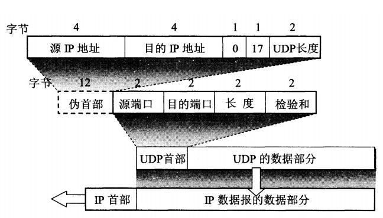

# 1\. UDP说明

## 1.1 协议简介

UDP (User Datagram Protocol)：用户数据报协议，是一种简单、无连接、不可靠的传输协议。

无需建立连接、没有提供任何流量控制、拥塞控制机制，收到的报文也没有确认，因此 UDP 的传输速度快，但不能保证数据到达目的地。

与我们熟知的 TCP 协议一样，都属于 OSI 模型中的传输层协议。

## 1.2 UDP 特点

1.  无连接性 
    UDP 可以提供无连接的数据传输服务，无需在通讯前建立连接，也无需在通讯结束后断开连接，节省了维护连接的开销。
2.  不可靠性 
    受自身协议的限制，UDP 的传输是一种不靠传输方式，无法保证数据一定能完整有效的传输到目标。
3.  以报文为边界 
    因为没有 TCP 协议的数据编号和接收确认机制，UDP 对于应用层交付的数据直接进行封装传输，不会对报文进行拆分合并，在多包数据传输时可能出现乱序的现象。
4.  无流量和拥塞控制功能 
    UDP 协议没有流量控制和拥塞控制的机制，因此更适用于对数据连续性比完整性要求更高、对轻微的数据差错不敏感的场景，如语音、视频通话等。
5.  支持广播、组播 
    不同于 TCP 协议只能实现一对一的单播通讯，UDP 协议支持单播、广播、组播通讯，实现一对一、一对多、多对多的数据传输。因此所有以广播、组播方式通信的协议都是在 UDP 协议上实现的，如我们常见的 DHCP、SNMP 协议。

# 1.3 报文格式



本篇文章重点是 UDP 在 LwIP 中的实现，报文格式就不再展开介绍了，但还是可以直观地看出 UDP 首部只有 8 字节的长度 ( 伪首部只参与校验和的计算，不实际发送 )，贯彻了 UDP 的简洁易用的特点。

# 2\. UDP 在 LWIP 上的实现

## 2.1. 数据结构

### 2.1.1 UDP 控制块

```c
struct udp_pcb {
  IP_PCB; //通用IP控制块

  struct udp_pcb *next; //下一节点的指针，用于构成控制块链表

  u8_t flags; //控制块状态

  u16_t local_port, remote_port;  //本地端口号、远程端口号

  udp_recv_fn recv; //处理网络接收数据的回调

  void *recv_arg;   //用户自定义参数，接收回调入参
};
```

同时，lwip 在 udp.c 中创建了全局的 udp 控制块指针，作为管理所有 UDP 控制块的链表头。

```c
struct udp_pcb *udp_pcbs;
```

### 2.1.2 UDP 首部

```c
PACK_STRUCT_BEGIN
struct udp_hdr {
  PACK_STRUCT_FIELD(u16_t src);   //源端口
  PACK_STRUCT_FIELD(u16_t dest);  //目的端口
  PACK_STRUCT_FIELD(u16_t len);   //此次发送的数据报的长度
  PACK_STRUCT_FIELD(u16_t chksum);//校验和
} PACK_STRUCT_STRUCT;
PACK_STRUCT_END
```

报文格式中提到了 UDP 伪首部，但数据结构中没有出现，那计算伪首部的功能是在哪里实现的呢？

找到计算 UDP 首部中的校验和计算函数：

```c
/**
 * 计算首部校验和
 * @param p 待计算数据的pbuf指针
 * @param proto 协议类型
 * @param proto_len ip数据部分的长度
 * @param src 源ip地址  (这里的IP是网络字节序)
 * @param dst 目标ip地址
 * @return 创建的UDP控制块结构体指针，创建失败返回NULL
 */
u16_t ip_chksum_pseudo(struct pbuf *p, u8_t proto, u16_t proto_len,const ip_addr_t *src, const ip_addr_t *dest)
```

例如在 udp\_sendto\_if\_src\(\) 中，数据发送之前需要计算出首部校验和，可以看到源 IP、目的 IP 等参数是现算现传的，没有再使用额外的数据结构来维护伪首部。

```c
if (IP_IS_V6(dst_ip) || (pcb->flags & UDP_FLAGS_NOCHKSUM) == 0) {
  u16_t udpchksum = ip_chksum_pseudo(q, IP_PROTO_UDP, q->tot_len,src_ip, dst_ip);

  /*0表示“无校验和，因此计算为0时需要改为0xffff*/
  if (udpchksum == 0x0000) {
    udpchksum = 0xffff;
  }
  udphdr->chksum = udpchksum;
}
```

## 2.2 接口函数

### 2.2.1. 创建/删除 UDP 控制块

```c
/**
 * 创建UDP控制块
 * @return 创建的UDP控制块结构体指针，创建失败返回NULL
 */
struct udp_pcb* udp_new(void);
```

udp\_new\(\) 为创建的 UDP 控制块申请内存空间、初始化控制块，返回创建的控制块指针供后续操作。

  

```c
/**
 * 创建UDP控制块
 * @param type 控制块的IP类型
 * @return 创建的UDP控制块结构体指针
 */
struct udp_pcb * udp_new_ip_type(u8_t type);
```

与 udp\_new\(\) 相似，都是创建 UDP 控制块，区别是 udp\_new\_ip\_type\(\) 可以指定创建的 UDP 控制块为 IPV4 / IPV6 / IPV4+IPV6 类型，而 udp\_new\(\) 默认创建 IPV4 的 UDP 控制块。

以上两个函数都很简单，就不把函数体展开讨论了，这里需要注意的是两个创建函数都只创建了控制块的内存空间，进行了简单的初始化，并未将控制块挂载到udp\_pcbs 链表中。

```c
/**
 * 删除UDP控制块
 * @param pcb UDP控制块指针
 */
void udp_remove(struct udp_pcb *pcb);
{
  struct udp_pcb *pcb2;

  LWIP_ASSERT_CORE_LOCKED();

  LWIP_ERROR("udp_remove: invalid pcb", pcb != NULL, return);

  mib2_udp_unbind(pcb);
  /* 判断待删除的控制块在链表开头 */
  if (udp_pcbs == pcb) {
    /* 从将第二个控制块作为链表头 */
    udp_pcbs = udp_pcbs->next;
    
  } else {
      /* 遍历udp 控制块链表 */
    for (pcb2 = udp_pcbs; pcb2 != NULL; pcb2 = pcb2->next) {
      /* 在链表中找到了该控制块 */
      if (pcb2->next != NULL && pcb2->next == pcb) {
        /* 将该控制块在链表中删除 */
        pcb2->next = pcb->next;
        break;
      }
    }
  }
  /* 释放该控制块的内存空间 */
  memp_free(MEMP_UDP_PCB, pcb);
}
```

删除 UDP 控制块，并将该控制块从 UDP 控制块链表中删除，最后释放控制块的内存空间。

通过 udp\_remove\(\) 以及后面的 udp\_connect\(\) 可以看到 lwip 对 udp 控制块链表的管理方式：单向链表，每次添加新节点插到链表开头，尾节点的 next 为 NULL。简单方便，但个人认为控制块链表头作为全局变量存放，使用时也没有加锁或者关中断保护，在 RT-Thread 这类抢占式的操作系统中，是存在临界区问题的，应用开发时应避免频繁的对控制块链表有操作。

### 2.2.2. 绑定

```c
/**
 * 将UDP控制块绑定到一个本地IP和端口号上
 * @param pcb UDP控制块指针
 * @param ipaddr 要绑定的本地IP
 * @param port 要绑定的本地端口号，输入0时会绑定一个随机端口
 * @return 错误码
 */
err_t udp_bind(struct udp_pcb *pcb, const ip_addr_t *ipaddr, u16_t port);
```

udp\_bind\(\) 除了将控制块与指定的 IP 和端口号绑定，还会检查 UDP 控制块是否挂载到了上文提到的全局 UDP 控制块链表中、待绑定的 IP - 端口号是否与链表中的其他控制块重复，未挂载、未重复的话会执行挂载：

```c
{
  /* code... */

  rebind = 0;
  /* 遍历udp控制块链表 */
  for (ipcb = udp_pcbs; ipcb != NULL; ipcb = ipcb->next) {
    /* 如果当前控制块已在控制块链表中 */
    if (pcb == ipcb) {
     /* 已挂载标志位置位 */
      rebind = 1;
      break;
    }
  }

  /* code... */

  /* 未挂载? */
  if (rebind == 0) {
    /* 将当前控制块插入到链表头 */
    pcb->next = udp_pcbs;
    udp_pcbs = pcb;
  }
  /* code... */
}
```

绑定本地端口不是 UDP 通讯的必要步骤，因为如果没有绑定本地端口，调用 sendto\(\) 时会分配一个随机端口。 
该接口一般是设备作 UDPS 时使用，在此场景下，存在 UDPC 先向 UDPS 发送数据的情况，因此需要预先知道 UDPS 的端口号，即 UDPS 需要绑定某个端口而不能是随机端口。

### 2.2.3. 连接/断连

```c
/**
 * 将UDP与指定IP、端口“建立连接”
 * @param pcb UDP控制块指针
 * @param ipaddr 要连接的目的IP
 * @param port 要连接的目的端口
 * @return 错误码
 */
err_t udp_connect(struct udp_pcb *pcb, const ip_addr_t *ipaddr, u16_t port);
```

1.  UDP 是无连接的，因此 udp\_connect\(\) 并不会真的像 TCP 的 connect() 一样去执行建立连接的网络交互，而只是在内部把目标 IP 和端口号与 UDP 控制块绑定。ip 和端口号绑定成功后，函数内部会将该 PCB 的 flag 置位为已连接：

```c
 pcb->flags |= UDP_FLAGS_CONNECTED;
```

1.  udp\_connect\(\) 会检查控制块是否绑定了本地 ip 端口，如果未绑定，会执行一次 udp\_bind\(\)，绑定到随机端口。
2.  udp\_connect\(\) 还会检查该控制块是否挂载到了 udp 控制块链表中，未挂载的话执行挂载。
3.  udp\_connect\(\) 同样也不是 UDP 通讯的必要步骤，绑定的优点在于绑定后可以直接调用 udp\_send\(\)，直接向绑定的目标IP和端口发送数据，无需像调用udp\_sendto\(\) 接口一样每次指定目标 IP 和端口，同时提高了执行效率，recv\(\) 时防止受到其他 IP 数据。
4.  该接口一般是设备作 UDPC 时使用，绑定了目标 IP 后直接调用 udp\_send\(\) 发送，UDPS 这类需要频繁向不同目标 IP、端口发送数据的应用显然不适合使用该接口。

```c
/**
 * “断开”UDP控制块已经建立的连接
 * @param pcb UDP控制块指针
 */
void udp_disconnect(struct udp_pcb *pcb);
```

与 udp\_connect\(\) 同理，udp\_disconnect\(\) 也不会真的执行断开连接的交互，只是将控制块中绑定的远程 IP、端口号清零，并将 flag 的连接标志复位。也没有将控制块从链表中删除的操作。

```c
  pcb->remote_port = 0;
  pcb->netif_idx = NETIF_NO_INDEX;
  udp_clear_flags(pcb, UDP_FLAGS_CONNECTED);
```

### 2.2.4. 发送

```c
err_t udp_send(struct udp_pcb *pcb, struct pbuf *p);

err_t udp_sendto(struct udp_pcb *pcb, struct pbuf *p,
                const ip_addr_t *dst_ip, u16_t dst_port);

err_t udp_sendto_if(struct udp_pcb *pcb, struct pbuf *p,
                    const ip_addr_t *dst_ip, u16_t dst_port,
                    struct netif *netif);

err_t udp_sendto_if_src(struct udp_pcb *pcb, struct pbuf *p,
                        const ip_addr_t *dst_ip, u16_t dst_port,
                        struct netif *netif, const ip_addr_t *src_ip);
```

1.  四个函数是一层一层调用的，udp\_send\(\) -> udp\_sendto\(\) -> udp\_sendto\_if\(\) -> udp\_sendto\_if\_src\(\)，从 udp\_send\(\) 函数开始，只需要传入 UDP 控制块和pbuf 指针，在每层的调用过程中根据控制块中的信息将目的 ip、端口号、netif、源 IP 信息逐步补全，最后通过 ip\_output\_if\_src\(\) 函数将数据传输到 IP 层继续处理。
2.  实际开发中常用的两个接口是 send\(\) 和 sendto\(\)，如上文介绍，执行过 connect\(\) 的 UDP 可以直接调用send\(\)发送到固定 IP 端口，代码设计上更加简洁高效。而调用 sendto\(\) 可以每次向不同目标 IP 端口发送，使用上更加灵活。

### 2.2.5. 接收

```c
/**
 * 为控制块注册接收回调
 * @param pcb UDP控制块指针
 * @param recv 处理网络数据的接收回调
 * @param recv_arg 触发时传入回调的用户自定义参数
 */
void udp_recv(struct udp_pcb *pcb, udp_recv_fn recv,void *recv_arg);
```

udp 层提供的方法是通过注册接收回调的方式实现接收网络数据。
回调类型：

```c
/**
 * udp接收回调
 * @param arg 回调注册时设置的用户自定义参数
 * @param pcb UDP控制块
 * @param p pbuf指针(payload在这里)
 * @param addr 数据来源IP
 * @param port 数据来源端口号
 */
typedef void (*udp_recv_fn)(void *arg, struct udp_pcb *pcb, struct pbuf *p, const ip_addr_t *addr, u16_t port);
```

注册的回调在 udp\_input\(\) 中被执行，而 udp\_input\(\) 由 IP 层的 ip4\_input\(\) / ip6\_input\(\) 触发。网络端收到数据后，IP 层会判断数据协议是否为 UDP 协议，若是则将数据、发送方的信息、用户自定义数据传入 udp\_input\(\)，最终到达用户设置的回调中供使用。

# 3\. 参考文献：

1.  LwIP-2.1.0源码
2.  《深入理解计算机网络》