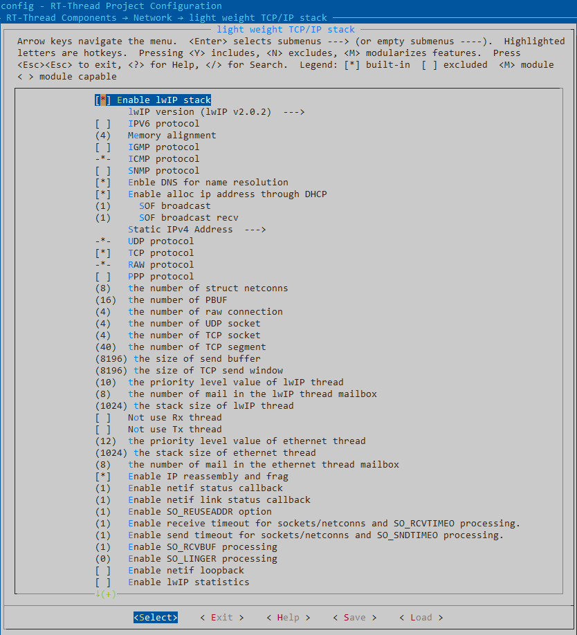
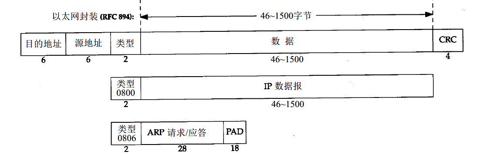
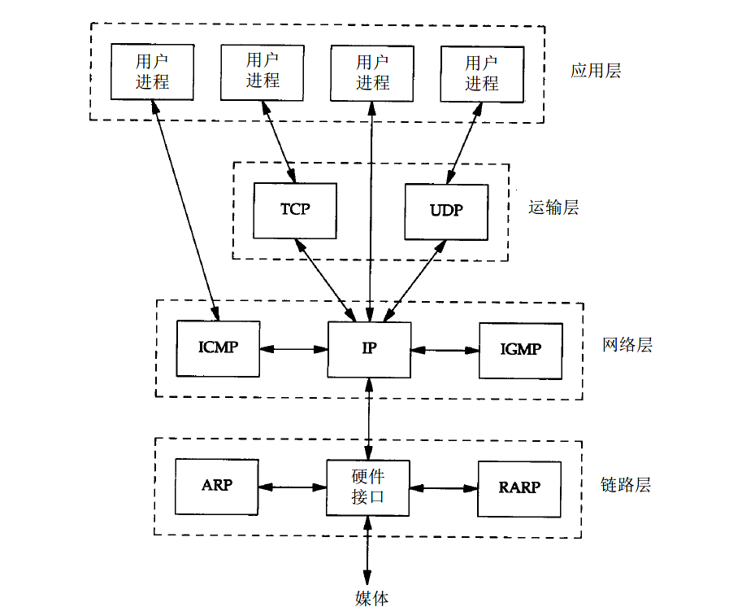
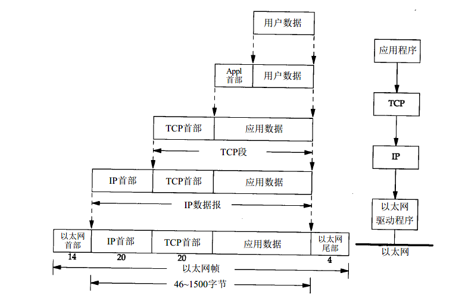

# RT-Thread 的 lwip 协议栈

lwip 是一个轻量级的 TCP/IP 协议栈，在 RT-Thread 中提供三个版本供开发者使用：lwip1.4.1，lwip2.0.2，lwip2.1.2 。而且配置界面相当复杂，有很多参数需要我们配置。```menuconfig```配置界面如下：



这内容太多了，想要一口气全部了解，简直是不可思议的事情。所以，还是在文章的一开始阐明这篇文章的目的：

1. IP 报文的基本知识，IP，ICMP，IGMP，ARP 报文的概念
2. TCP 报文与 UDP 报文概念
3. RT-Thread 中 lwip 的内存分配策略
4. 解决常见配置项的作用讲解，及配置方式

一点一点的，一小步一小步得帮助大家理解 lwip 在 RT-Thread 的 net 组件中的地位，以及，问题如何定位(至少发问题贴的时候，让大佬能看懂想问啥)，和一些配置项的意义，希望大家在阅读完本篇文章后，能树立起对 lwip 的兴趣和信心，继续在网络世界中遨游。

### 1. TCP / IP 的网络分层模型

讲解之前，需要再次申明 lwip 的地位： [**A Lightweight TCP/IP stack**](http://savannah.nongnu.org/projects/lwip/)，一个轻量级的 TCP/IP 协议栈。lwip 所实现的，是 TCP/IP 协议栈的一部分内容。不过已经实现的内容已经满足嵌入式系统的的需求，甚至在性能方面完全超出使用需求，而且是较完整的。


本篇文章的主要内容：IP，ICMP，ARP，TCP，UDP 都集中在网络层与传输层中。按照分层协议的习惯，层与层之间的数据按照习惯应该是不可见的，也就是说TCP在填充数据时是不知道 IP 层是怎么处理 TCP 的数据的。但是在 lwip 中，这个限制并不是那么严格，因为 pbuf 结构的存在；IP 报文，乃至 ETH 链路上的数据实际上相同的一块或者多块区域；一旦发送的数据确定，pbuf 中的数据通常是不会频繁得在网络接口层 / 网络层 / 传输层 这三个的解析过程中拷贝数据。具体的内容在**lwip 的内存管理办法**中说明。

IP，ICMP，ARP，TCP，UDP 的报文格式，想必大家就算没有听说过，也该了解他们都是有自己的格式的；对于这些报文格式的单个解析，网络上已经有大量大佬有相当充实的介绍了，在这里就不单个拿出来继续描述，大家可以使用该[链接](https://www.baidu.com/)，使用  ```xxx报文格式```  的关键词进行搜索，或者能找到《TCP/IP详解 卷1:协议》，有兴趣情况下进行研读也是蛮好的。

在下面贴两张比较重要的图，通过这两张图，相信大家会有 IP 报文的问题，ETH 报文都是什么样子，他们的内容都大概有什么有点了解。



**注：图片来源于《TCP/IP详解 卷1:协议》，链路层，以太网与IEEEE 802封装 小节**

* ARP 请求可以看到，它是和 IP 报文平行的，ARP 报文并不从属于 IP 报文；ARP 也是在路由器，交换机，在局域网络中经常会看到 ARP 的报文。Wireshark 能清晰得捕捉到网络中的 ARP 报文。如果 ARP 过程不顺利，那么任何数据都不能从 ETH 中发出。ARP 沟通了 IP 地址与 MAC 地址；如果在局域网中有一台网络设备使用 ARP 报文使坏，很有可能该局域网络瘫痪。



**注：图片来源于《TCP/IP详解 卷1:协议》，TCP/IP的分成 小节**



**注：图片来源于《TCP/IP详解 卷1:协议》，概述，封装 小节**

* 通过上面两张图片可以认识到 IP 报文的主要内容有 TCP、UDP、ICMP 的内容。
* IP 报文的首部有段空间是协议域；1 表示为 ICMP 协议，6 表示为 TCP 协议，17 表示为 UDP 协议。
* 可以看到 MTU = 1500 的意义是 IP 报文的总长为 1500 字节，对于 ETH 帧来说应该是 1518 字节，此时 MSS 的大小为 1460，也就是 “应用数据” 的长度；所以在 RT-Thread 的底层驱动中，底层的长度一般是大于 1518  字节的。
* PING 命令发送的内容，实际上是 ICMP 报文；既不是 TCP 也不是 UDP，在 Socket 申请时属于 ```NETCONN_RAW```。在 AT 设备中，通常是没有这个选项的；AT 设备中 PING 功能是对外封装的具体 AT 功能，而不能由 socket 申请对应的 ICMP 结构报文。


### 2. lwip 的基础内存情况

在 RT-Thread 的 lwip 协议栈中，对内存堆的分配方法做了调整；在 lwip 原生的内存堆算法 ```src/core/mem.c```并没有参与工程的编译，取而代之的是，在```src/arch/sys_arch.c```重新定义的内存堆的相关申请函数。pbuf ，内存堆，内存池这三个概念，在 lwip 中很常见；在 menuconfig 的 lwip 配置界面，对一些资源的配置，很多都是一些内存空间的大小配置。在带大家浏览一些配置前，先描述一下 pbuf ，内存堆，内存池的概念。

* pbuf ，pbuf 的结构是 lwip 特殊的结构；首先，pbuf 是一个特殊的数据存储结构；

```c
/** Main packet buffer struct */
struct pbuf {
  /** next pbuf in singly linked pbuf chain */
  struct pbuf *next;

  /** pointer to the actual data in the buffer */
  void *payload;

  /**
   * total length of this buffer and all next buffers in chain
   * belonging to the same packet.
   *
   * For non-queue packet chains this is the invariant:
   * p->tot_len == p->len + (p->next? p->next->tot_len: 0)
   */
  u16_t tot_len;

  /** length of this buffer */
  u16_t len;

  /** pbuf_type as u8_t instead of enum to save space */
  u8_t /*pbuf_type*/ type;

  /** misc flags */
  u8_t flags;

  /**
   * the reference count always equals the number of pointers
   * that refer to this pbuf. This can be pointers from an application,
   * the stack itself, or pbuf->next pointers from a chain.
   */
  u16_t ref;
};
```

pbuf 有一个 *next 指针，这代表 pbuf 可以使用该指针实现类似数据链条的效果；在 pbuf 存储的数据，有可能是一个整块的空间，也有可能是多个空间片链接在一起。除此以外，pbuf 在网络层 / 传输层 这两个层级之间都是可见的；这意味着 pbuf 在申请后不需要因为层与层的数据解析方式不同而频繁拷贝数据，可以节省系统资源。各个层级在进行内存申请时，都可以调用 pbuf_alloc 函数实现内存申请。

**通过上一段描述，我们至少会有两个疑问？**一，各个层级不同申请 pbuf 时候，需要开辟多少空间呢？比如 ICMP 报文的申请，总和 UDP 报文的申请不同吧，为什么 pbuf 可以保证不需要频繁拷贝数据。二，pbuf 是从哪里申请的，内存池和内存堆，从那个地方来申请呢？如果对于 pbuf 有更多的疑问，可以阅读 ```src/core/pbuf.c```中的源码来进行了解；或者该[链接](https://www.baidu.com/)，使用  ```lwip协议栈pbuf分析```  的关键词进行搜索；也可以通过《嵌入式网络哪些事》来学习 lwip 的基础知识。

1. 对于第一个疑问，不同层级申请 pbuf 时，需要开辟的空间大小是不同的；正如上图的[以太网帧的模型](###1. TCP / IP 的网络分层模型)所描述的，不同层级在申请 pbuf 时，会预留的空间是不一致的。

```c
typedef enum {
  PBUF_TRANSPORT,
  PBUF_IP,
  PBUF_LINK,
  PBUF_RAW_TX,
  PBUF_RAW
} pbuf_layer;

/* determine header offset */
  switch (layer) {
  case PBUF_TRANSPORT:
    /* add room for transport (often TCP) layer header */
    offset = PBUF_LINK_ENCAPSULATION_HLEN + PBUF_LINK_HLEN + PBUF_IP_HLEN + PBUF_TRANSPORT_HLEN;
    break;
  case PBUF_IP:
    /* add room for IP layer header */
    offset = PBUF_LINK_ENCAPSULATION_HLEN + PBUF_LINK_HLEN + PBUF_IP_HLEN;
    break;
  case PBUF_LINK:
    /* add room for link layer header */
    offset = PBUF_LINK_ENCAPSULATION_HLEN + PBUF_LINK_HLEN;
    break;
  case PBUF_RAW_TX:
    /* add room for encapsulating link layer headers (e.g. 802.11) */
    offset = PBUF_LINK_ENCAPSULATION_HLEN;
    break;
  case PBUF_RAW:
    /* no offset (e.g. RX buffers or chain successors) */
    offset = 0;
    break;
  default:
    LWIP_ASSERT("pbuf_alloc: bad pbuf layer", 0);
    return NULL;
  }
```

不同层级在申请 pbuf 时，因为入参 layer 的不同，会给 pbuf 设置一个 offset 。这个 offset 可以在其他层级进行处理时直接向对应的空间区域填充数据，而不需要进行拷贝操作。所以，pbuf 结构才被称为可以在不同层级之间可见的结构，因为自始至终都是同一个 pbuf 区域。

2. 对于第二个提问，pbuf 的空间是由谁提供。实际上，pbuf 的空间的提供，既有内存堆，也有内存池。这个申请的空间的不同，是由申请 pbuf 的入参决定的。

```c
typedef enum {
  /** pbuf data is stored in RAM, used for TX mostly, struct pbuf and its payload
      are allocated in one piece of contiguous memory (so the first payload byte
      can be calculated from struct pbuf).
      pbuf_alloc() allocates PBUF_RAM pbufs as unchained pbufs (although that might
      change in future versions).
      This should be used for all OUTGOING packets (TX).*/
  PBUF_RAM,
  /** pbuf data is stored in ROM, i.e. struct pbuf and its payload are located in
      totally different memory areas. Since it points to ROM, payload does not
      have to be copied when queued for transmission. */
  PBUF_ROM,
  /** pbuf comes from the pbuf pool. Much like PBUF_ROM but payload might change
      so it has to be duplicated when queued before transmitting, depending on
      who has a 'ref' to it. */
  PBUF_REF,
  /** pbuf payload refers to RAM. This one comes from a pool and should be used
      for RX. Payload can be chained (scatter-gather RX) but like PBUF_RAM, struct
      pbuf and its payload are allocated in one piece of contiguous memory (so
      the first payload byte can be calculated from struct pbuf).
      Don't use this for TX, if the pool becomes empty e.g. because of TCP queuing,
      you are unable to receive TCP acks! */
  PBUF_POOL
} pbuf_type;
```

如果在查看 RT-Thread 的源码，比如 drv_eth.c 会发现，是 ```p = pbuf_alloc(PBUF_RAW, len, PBUF_RAM)```，即```PBUF_RAM```；而在另一些驱动中，例如 ```componets/drivers/wlan/wlan_lwip.c```的驱动中,是优先 ```pbuf_alloc(PBUF_RAW, len, PBUF_POOL)```方式。这里面没有类似于 PBUF_POOL 比 PBUF_RAW 更快，更好的说法；使用情况会根据系统资源的情况来自行调整。

----

**lwip 的内存堆与内存池都是为 pbuf 服务的吗？**这肯定不止，那内存堆与内存池的空间还用在什么部分呢？这就牵扯到接下来要描述的 menuconfig 配置的。诸如netconns, raw connect, udp socket, tcp socket, tcp segment 的这些参数的数量的意义：

| 配置选项     | 配置大小 |  意义      |
| ------------- | -------- | ------- |
| the number of struct netconns                        | 8        | lwip 中可以同时申请的 socket 数量，由 MEMP_NETCONN 限制      |
| the number of raw connection                         | 4        | IP 层面的连接结构体数量，例如 ICMP/ IGMP                     |
| the number of UDP socket                             | 4        | UDP 的可以连接数量                                           |
| the number of TCP socket                             | 4        | TCP 可用的数量，在创建一个 TCP 连接时创建，一但转为 Listen 状态则删除 |
| the number of TCP segment                            | 40       | TCP 数据段，牵扯到分片，或者TCP缓存的数据维护，尽量发送大块数据等作用的维护 |
| the number of listening TCP connections[defaults，8] | 8        | 用作服务器时，设置为处于 Listen 状态的 TCP 控制块，不与 tcp socket 共享，是独立的 |

对于上面的参数，基本都是由 MEMP_POOL ，也就是内存池实现的；而且，讲道理也应该由内存池来实现。内存池的优势就是分配迅速，没有碎片化问题，而且大小固定；对于这些长度固定的 PCB 控制块来说，是很完美的配合。

对于内存池的空间分配的代码，在```src/include/lwip/memp_std.h```与```src/core/memp.c```中实现；相信第一次在看这个文件时候，都是懵逼的。对于 ```##```拼接符，以及```.h```文件的作用空间都会是一个很好的学习平台。在这两个文件中，可以看到 PBUF_POOL 到底是有多少空间，以便于我们在使用 socket 编程时，能顺心得按照自己工程的需求来裁剪 lwip 的内存大小。

---

在 lwip 的配置项界面有这个配置项

| 配置选项     | 配置大小 |  意义      |
| ------------- | -------- | ------- |
| the number of pbuf | 16       | 一个pubf 的大小为 (1460[MSS] + 40[TCP HEAD] + 18[ETH])，16 个就是 20 KB |

在驱动编写时，一直使用```pbuf_alloc(PBUF_RAW, len, PBUF_RAM)```的方式，很明显不会使用到这个空间。

----

* 不能傻傻分不清 PBUF_RAW，PBUF_RAM；两个虽然很像，但是前者表示空间的作用（TCP，UDP，IP报文）；后者表示空间归属（来自内存堆[RAM]还是内存池[POOL]）。

### 3. RT-Thread 的中 lwip 一般配置项

在上面的内容中，讲述了一些 lwip 内部的内存分配问题；下面要描述得是一些比较简单的配置项，这些配置项基本和概念有关。

| 配置选项     | 配置大小 |  意义      |
| ------------- | -------- | ------- |
| the size of send buffer | 8196    | TCP 发送缓存空间 |
| the size of TCP send window | 8196    | TCP 窗口大小 |
| the priority level value of ethernet thread | 10   | tcpip 线程优先级 |
| the number of mail in the lwIP thread mailbox | 8    | tcpip 邮箱大小，用于各种 tcpip 邮件的响应 |
| the stack size of lwIP thread | 1024 | tcpip 线程栈大小，如果启用 PPP ，需要调大的就是这个线程栈 |
| the priority level value of ethernet thread | 12 | RT-Thread 实现的底层的发送和接收线程优先级                   |
| the stack size of ethernet thread | 1024 | RT-Thread 实现的底层的发送和接收线程的线程栈大小 |
| Enable IP reassembly and frag | 0    | 是否允许 IP 报文分片和重组 |
| Enable netif status callback | 1    | 启用或者禁用网卡的回调 |
| Enable netif link status callback | 1 | 链路连接或者断开的回调 |
| SO_REUSEADDR / SO_RCVTIMEO / SO_SNDTIMEO/SO_RCVBUF / SO_LINGER | 0 /1 | 一些特殊的 TCP/IP 协议处理方法 |
| Enable netif loopback | 0 | 使能 netif 的回环功能；可以自发自收，不需要硬件支持 |
| Enable lwIP statistics | 0 | 启用信息统计功能 |
| Enable hardware checksum | 0 | 启用硬件校验，是校验和算法 |
| Enable lwIP Debugging Options | 0 | 启用 lwip 的 debug 功能，功能丰富，建议出问题时开打需要的选项 |

从名称看不出来功能的一些配置项，在这里做出一些情况的解释；并且可以追溯到 lwip 协议栈的功能选项。对于 RT-Thread 而言，lwip 的配置项最终会在 ```src/include/lwip/opt.h```文件中反应出来，是由 ```src/include/lwip/opt.h```，```src/lwipopts.h```，```rtconfig.h``` 三个文件共同作用的结果。对于上面的大小配置，实际上如果乱改的话，连编译都是过不去的。因为 ```src/core/init.c``` 中会在编译时就检查相关宏配置是否合法，在调整时还是应该了解一些基本的 TCP/IP 知识，再次推荐《TCP/IP详解 卷1:协议》，不需要完全看完，而且还有电子版的书。

### 4. 写在最后

lwip 协议栈是实现了 TCP/IP 协议栈一部分功能的，可以用在嵌入式中的网络协议栈；有些函数并不能完全兼容，比如 SO_REUSEADDR 参数，在大型的网络协议栈中，很有可能是 ```setsockopt```的一个入参，而对于 lwip 来说，是一个一旦编译好就固定的策略，不是一个灵活的配置项。在进行对应的 APP 功能移植时，应当慎重处理编译产生的异常。通过 sal 的方式使用 lwip，at socket，wiznet 来进行编程，一定要注意编译产生一些异常事件和函数异常事件。lwip 是一个可以运行在嵌入式中的网络协议栈，它的高效，精简的编程方式和策略都很值得我们学习；希望在 lwip 的学习道路上，能和 RT-Thread 一起分享自己的经验和心得，贡献自己的理解和感悟，共同成长进步。


