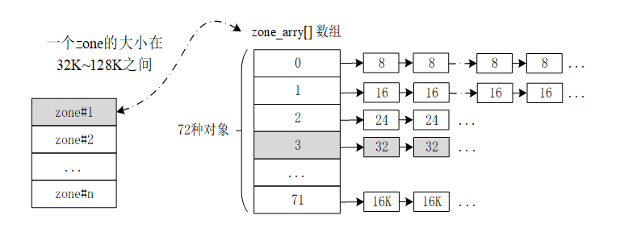
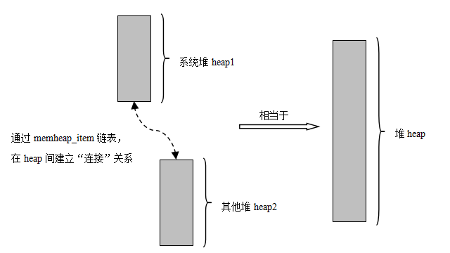
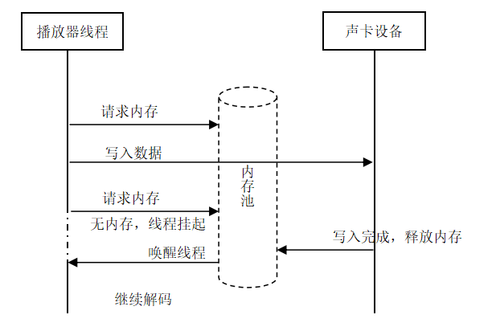
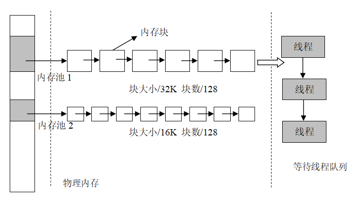

# 内存管理

在计算系统中，通常存储空间可以分为两种：内部存储空间和外部存储空间。内部存储空间通常访问速度比较快，能够按照变量地址随机地访问，也就是我们通常所说的 RAM（随机存储器），可以把它理解为电脑的内存；而外部存储空间内所保存的内容相对来说比较固定，即使掉电后数据也不会丢失，这就是通常所讲的 ROM（只读存储器），可以把它理解为电脑的硬盘。

计算机系统中，变量、中间数据一般存放在 RAM 中，只有在实际使用时才将它们从 RAM 调入到 CPU 中进行运算。一些数据需要的内存大小需要在程序运行过程中根据实际情况确定，这就要求系统具有对内存空间进行动态管理的能力，在用户需要一段内存空间时，向系统申请，系统选择一段合适的内存空间分配给用户，用户使用完毕后，再释放回系统，以便系统将该段内存空间回收再利用。

这章主要介绍 RT-Thread 中的两种内存管理方式，分别是动态内存堆管理和静态内存池管理，学完本章，读者会了解 RT-Thread 的内存管理原理及使用方式。

## 内存管理的功能特点

由于实时系统中对时间的要求非常严格，内存管理往往要比通用操作系统要求苛刻得多：

1）分配内存的时间必须是确定的。一般内存管理算法是根据需要存储的数据的长度在内存中去寻找一个与这段数据相适应的空闲内存块，然后将数据存储在里面。而寻找这样一个空闲内存块所耗费的时间是不确定的，因此对于实时系统来说，这就是不可接受的，实时系统必须要保证内存块的分配过程在可预测的确定时间内完成，否则实时任务对外部事件的响应也将变得不可确定。

2）随着内存不断被分配和释放，整个内存区域会产生越来越多的碎片（因为在使用过程中，申请了一些内存，其中一些释放了，导致内存空间中存在一些小的内存块，它们地址不连续，不能够作为一整块的大内存分配出去），系统中还有足够的空闲内存，但因为它们地址并非连续，不能组成一块连续的完整内存块，会使得程序不能申请到大的内存。对于通用系统而言，这种不恰当的内存分配算法可以通过重新启动系统来解决
(每个月或者数个月进行一次)，但是对于那些需要常年不间断地工作于野外的嵌入式系统来说，就变得让人无法接受了。

3）嵌入式系统的资源环境也是不尽相同，有些系统的资源比较紧张，只有数十 KB 的内存可供分配，而有些系统则存在数 MB 的内存，如何为这些不同的系统，选择适合它们的高效率的内存分配算法，就将变得复杂化。

RT-Thread 操作系统在内存管理上，根据上层应用及系统资源的不同，有针对性地提供了不同的内存分配管理算法。总体上可分为两类：内存堆管理与内存池管理，而内存堆管理又根据具体内存设备划分为三种情况：

第一种是针对小内存块的分配管理（小内存管理算法）；

第二种是针对大内存块的分配管理（slab 管理算法）；

第三种是针对多内存堆的分配情况（memheap 管理算法）

## 内存堆管理

内存堆管理用于管理一段连续的内存空间，在前面的 [《内核基础》](../basic/basic.md) 章节有介绍过 RT-Thread 的内存分布情况，如下图所示，RT-Thread 将 “ZI 段结尾处” 到内存尾部的空间用作内存堆。


内存堆可以在当前资源满足的情况下，根据用户的需求分配任意大小的内存块。而当用户不需要再使用这些内存块时，又可以释放回堆中供其他应用分配使用。RT-Thread
系统为了满足不同的需求，提供了不同的内存管理算法，分别是小内存管理算法、slab 管理算法和 memheap 管理算法。

小内存管理算法主要针对系统资源比较少，一般用于小于 2MB 内存空间的系统；而 slab 内存管理算法则主要是在系统资源比较丰富时，提供了一种近似多内存池管理算法的快速算法。除上述之外，RT-Thread 还有一种针对多内存堆的管理算法，即 memheap 管理算法。memheap 方法适用于系统存在多个内存堆的情况，它可以将多个内存 “粘贴” 在一起，形成一个大的内存堆，用户使用起来会非常方便。

这几类内存堆管理算法在系统运行时只能选择其中之一或者完全不使用内存堆管理器，他们提供给应用程序的 API 接口完全相同。

> [!NOTE]
> 注：因为内存堆管理器要满足多线程情况下的安全分配，会考虑多线程间的互斥问题，所以请不要在中断服务例程中分配或释放动态内存块。因为它可能会引起当前上下文被挂起等待。

### 小内存管理算法

小内存管理算法是一个简单的内存分配算法。初始时，它是一块大的内存。当需要分配内存块时，将从这个大的内存块上分割出相匹配的内存块，然后把分割出来的空闲内存块还回给堆管理系统中。每个内存块都包含一个管理用的数据头，通过这个头把使用块与空闲块用双向链表的方式链接起来，如下图所示：


每个内存块（不管是已分配的内存块还是空闲的内存块）都包含一个数据头，其中包括：

**1）magic**：变数（或称为幻数），它会被初始化成
0x1ea0（即英文单词 heap），用于标记这个内存块是一个内存管理用的内存数据块；变数不仅仅用于标识这个数据块是一个内存管理用的内存数据块，实质也是一个内存保护字：如果这个区域被改写，那么也就意味着这块内存块被非法改写（正常情况下只有内存管理器才会去碰这块内存）。

**2）used**：指示出当前内存块是否已经分配。

内存管理的表现主要体现在内存的分配与释放上，小型内存管理算法可以用以下例子体现出来。

如下图所示的内存分配情况，空闲链表指针 lfree 初始指向 32 字节的内存块。当用户线程要再分配一个 64 字节的内存块时，但此 lfree 指针指向的内存块只有 32 字节并不能满足要求，内存管理器会继续寻找下一内存块，当找到再下一块内存块，128 字节时，它满足分配的要求。因为这个内存块比较大，分配器将把此内存块进行拆分，余下的内存块（52 字节）继续留在 lfree 链表中，如下图分配 64 字节后的链表结构所示。


另外，在每次分配内存块前，都会留出 12 字节数据头用于 magic、used 信息及链表节点使用。返回给应用的地址实际上是这块内存块 12 字节以后的地址，前面的 12 字节数据头是用户永远不应该碰的部分（注：12 字节数据头长度会与系统对齐差异而有所不同）。

释放时则是相反的过程，但分配器会查看前后相邻的内存块是否空闲，如果空闲则合并成一个大的空闲内存块。

### slab 管理算法

RT-Thread 的 slab 分配器是在 DragonFly BSD 创始人 Matthew Dillon 实现的 slab 分配器基础上，针对嵌入式系统优化的内存分配算法。最原始的 slab 算法是 Jeff Bonwick 为 Solaris 操作系统而引入的一种高效内核内存分配算法。

RT-Thread 的 slab 分配器实现主要是去掉了其中的对象构造及析构过程，只保留了纯粹的缓冲型的内存池算法。slab 分配器会根据对象的大小分成多个区（zone），也可以看成每类对象有一个内存池，如下图所示：



一个 zone 的大小在 32K 到 128K 字节之间，分配器会在堆初始化时根据堆的大小自动调整。系统中的 zone 最多包括 72 种对象，一次最大能够分配 16K 的内存空间，如果超出了 16K 那么直接从页分配器中分配。每个 zone 上分配的内存块大小是固定的，能够分配相同大小内存块的 zone 会链接在一个链表中，而 72 种对象的 zone 链表则放在一个数组（zone_array[]）中统一管理。

下面是内存分配器主要的两种操作：

**（1）内存分配**

假设分配一个 32 字节的内存，slab 内存分配器会先按照 32 字节的值，从 zone array 链表表头数组中找到相应的 zone 链表。如果这个链表是空的，则向页分配器分配一个新的 zone，然后从 zone 中返回第一个空闲内存块。如果链表非空，则这个 zone 链表中的第一个 zone 节点必然有空闲块存在（否则它就不应该放在这个链表中），那么就取相应的空闲块。如果分配完成后，zone 中所有空闲内存块都使用完毕，那么分配器需要把这个 zone 节点从链表中删除。

**（2）内存释放**

分配器需要找到内存块所在的 zone 节点，然后把内存块链接到 zone 的空闲内存块链表中。如果此时 zone 的空闲链表指示出 zone 的所有内存块都已经释放，即 zone 是完全空闲的，那么当 zone 链表中全空闲 zone 达到一定数目后，系统就会把这个全空闲的 zone 释放到页面分配器中去。

### memheap 管理算法

memheap 管理算法适用于系统含有多个地址可不连续的内存堆。使用 memheap 内存管理可以简化系统存在多个内存堆时的使用：当系统中存在多个内存堆的时候，用户只需要在系统初始化时将多个所需的 memheap 初始化，并开启 memheap 功能就可以很方便地把多个 memheap（地址可不连续）粘合起来用于系统的 heap 分配。

> [!NOTE]
> 注：在开启 memheap 之后原来的 heap 功能将被关闭，两者只可以通过打开或关闭 RT_USING_MEMHEAP_AS_HEAP 来选择其一

memheap 工作机制如下图所示，首先将多块内存加入 memheap_item 链表进行粘合。当分配内存块时，会先从默认内存堆去分配内存，当分配不到时会查找 memheap_item 链表，尝试从其他的内存堆上分配内存块。应用程序不用关心当前分配的内存块位于哪个内存堆上，就像是在操作一个内存堆。



### 内存堆配置和初始化

在使用内存堆时，必须要在系统初始化的时候进行堆的初始化，可以通过下面的函数接口完成：

```c
void rt_system_heap_init(void* begin_addr, void* end_addr);
```

这个函数会把参数 begin_addr，end_addr 区域的内存空间作为内存堆来使用。下表描述了该函数的输入参数：

  rt_system_heap_init() 的输入参数

|**参数**  |**描述**          |
|------------|--------------------|
| begin_addr | 堆内存区域起始地址 |
| end_addr   | 堆内存区域结束地址 |

在使用 memheap 堆内存时，必须要在系统初始化的时候进行堆内存的初始化，可以通过下面的函数接口完成：

```c
rt_err_t rt_memheap_init(struct rt_memheap  *memheap,
                        const char  *name,
                        void        *start_addr,
                        rt_uint32_t size)
```

如果有多个不连续的 memheap 可以多次调用该函数将其初始化并加入 memheap_item 链表。下表描述了该函数的输入参数与返回值：

  rt_memheap_init() 的输入参数与返回值

|**参数**  |**描述**          |
|------------|--------------------|
| memheap    | memheap 控制块      |
| name       | 内存堆的名称       |
| start_addr | 堆内存区域起始地址 |
| size       | 堆内存大小         |
|**返回**  | ——                 |
| RT_EOK     | 成功               |

### 内存堆的管理方式

对内存堆的操作如下图所示，包含：初始化、申请内存块、释放内存，所有使用完成后的动态内存都应该被释放，以供其他程序的申请使用。


#### 分配和释放内存块

从内存堆上分配用户指定大小的内存块，函数接口如下：

```c
void *rt_malloc(rt_size_t nbytes);
```

rt_malloc 函数会从系统堆空间中找到合适大小的内存块，然后把内存块可用地址返回给用户。下表描述了该函数的输入参数与返回值：

  rt_malloc() 的输入参数和返回值

|**参数**        |**描述**                          |
|------------------|------------------------------------|
| nbytes           | 需要分配的内存块的大小，单位为字节 |
|**返回**        | ——                                 |
| 分配的内存块地址 | 成功                               |
| RT_NULL          | 失败                               |

对 rt_malloc 的返回值进行判空是非常有必要的。应用程序使用完从内存分配器中申请的内存后，必须及时释放，否则会造成内存泄漏。

使用动态分配内存示例：

```c
int *pi;
pi = rt_malloc(100);
if(pi == NULL) 
{
    rt_printf("malloc failed\r\n");
}
```

释放内存块的函数接口如下：

```c
void rt_free (void *ptr);
```

rt_free 函数会把待释放的内存还回给堆管理器中。在调用这个函数时用户需传递待释放的内存块指针，如果是空指针直接返回。下表描述了该函数的输入参数：

  rt_free() 的输入参数

|**参数**|**描述**          |
|----------|--------------------|
| ptr      | 待释放的内存块指针 |

rt_free 的参数必须是以下其一：
- 是 NULL 。
- 是一个先前从 rt_malloc、 rt_calloc 或 rt_realloc 返回的值。

#### 重分配内存块

在已分配内存块的基础上重新分配内存块的大小（增加或缩小），可以通过下面的函数接口完成：

```c
void *rt_realloc(void *rmem, rt_size_t newsize);
```

在进行重新分配内存块时，原来的内存块数据保持不变（缩小的情况下，后面的数据被自动截断）。下表描述了该函数的输入参数和返回值：

  rt_realloc() 的输入参数和返回值

|**参数**            |**描述**          |
|----------------------|--------------------|
| rmem                 | 指向已分配的内存块 |
| newsize              | 重新分配的内存大小 |
|**返回**            | ——                 |
| 重新分配的内存块地址 | 成功               |

- rt_realloc 函数用于修改一个原先已经分配的内存块的大小。使用这个函数，你可以使一块内存扩大或者缩小。如果它用于扩大一个内存块，那么这块内存原先的内容依然保留，新增加的内存添加到原先内存块的后面，新内存并未以任何方式进行初始化。如果它用于缩小一个内存块，该内存尾部的部分内存便被拿掉，剩余部分内存的原先内容依然保留。
- 如果原先的内存块无法改变大小，rt_realloc 将分配另一块正确大小的内存，并把原先那块内存的内容复制到新的块上。因此，在使用 rt_realloc 之后，你就不能再使用指向旧内存块的指针，而是应该改用 rt_realloc 所返回的新指针。
- 如果 rt_realloc 的第一个参数为 NULL, 那么它的行为就和 rt_malloc 一样。

#### 分配多内存块

从内存堆中分配连续内存地址的多个内存块，可以通过下面的函数接口完成：

```c
  void *rt_calloc(rt_size_t count, rt_size_t size);
```

下表描述了该函数的输入参数与返回值：

  rt_calloc() 的输入参数和返回值

|**参数**                  |**描述**                                   |
|----------------------------|---------------------------------------------|
| count                      | 内存块数量                                  |
| size                       | 内存块容量                                  |
|**返回**                  | ——                                          |
| 指向第一个内存块地址的指针 | 成功 ，并且所有分配的内存块都被初始化成零。 |
| RT_NULL                    | 分配失败                                    |

#### 设置内存钩子函数

在分配内存块过程中，用户可设置一个钩子函数，调用的函数接口如下：

```c
void rt_malloc_sethook(void (*hook)(void *ptr, rt_size_t size));
```

设置的钩子函数会在内存分配完成后进行回调。回调时，会把分配到的内存块地址和大小做为入口参数传递进去。下表描述了该函数的输入参数：

  rt_malloc_sethook() 的输入参数

|**参数**|**描述**    |
|----------|--------------|
| hook     | 钩子函数指针 |

其中 hook 函数接口如下：

```c
void hook(void *ptr, rt_size_t size)；
```

下表描述了 hook 函数的输入参数：

  分配钩子 hook 函数接口参数

|**参数**|**描述**            |
|----------|----------------------|
| ptr      | 分配到的内存块指针   |
| size     | 分配到的内存块的大小 |

在释放内存时，用户可设置一个钩子函数，调用的函数接口如下：

```c
void rt_free_sethook(void (*hook)(void *ptr));
```

设置的钩子函数会在调用内存释放完成前进行回调。回调时，释放的内存块地址会做为入口参数传递进去（此时内存块并没有被释放）。下表描述了该函数的输入参数：

  rt_free_sethook() 的输入参数

|**参数**|**描述**    |
|----------|--------------|
| hook     | 钩子函数指针 |

其中 hook 函数接口如下：

```c
void hook(void *ptr);
```

下表描述了 hook 函数的输入参数：

  钩子函数 hook 的输入参数

|**参数**|**描述**          |
|----------|--------------------|
| ptr      | 待释放的内存块指针 |

### 总结

动态内存使用总结：

- 检查从 rt_malloc 函数返回的指针是否为 NULL
- 不要访问动态分配内存之外的内存
- 不要向 rt_free 传递一个并非由 rt_malloc 函数返回的指针
- 在释放动态内存之后不要再访问它
- 使用 sizeof 计算数据类型的长度，提高程序的可移植性

常见的动态内存错误：

- 对 NULL 指针进行解引用
- 对分配的内存进行操作时越过边界
- 释放并非动态分配的内存
- 释放一块动态分配的内存的一部分 (rt_free(ptr + 4))
- 动态内存被释放后继续使用

内存碎片：频繁的调用内存分配和释放接口会导致内存碎片，一个避免内存碎片的策略是使用 `内存池 + 内存堆` 混用的方法。

### 内存堆管理应用示例

这是一个内存堆的应用示例，这个程序会创建一个动态的线程，这个线程会动态申请内存并释放，每次申请更大的内存，当申请不到的时候就结束，如下代码所示：

  内存堆管理

```c
#include <rtthread.h>

#define THREAD_PRIORITY      25
#define THREAD_STACK_SIZE    512
#define THREAD_TIMESLICE     5

/* 线程入口 */
void thread1_entry(void *parameter)
{
    int i;
    char *ptr = RT_NULL; /* 内存块的指针 */

    for (i = 0; ; i++)
    {
        /* 每次分配 (1 << i) 大小字节数的内存空间 */
        ptr = rt_malloc(1 << i);

        /* 如果分配成功 */
        if (ptr != RT_NULL)
        {
            rt_kprintf("get memory :%d byte\n", (1 << i));
            /* 释放内存块 */
            rt_free(ptr);
            rt_kprintf("free memory :%d byte\n", (1 << i));
            ptr = RT_NULL;
        }
        else
        {
            rt_kprintf("try to get %d byte memory failed!\n", (1 << i));
            return;
        }
    }
}

int dynmem_sample(void)
{
    rt_thread_t tid = RT_NULL;

    /* 创建线程 1 */
    tid = rt_thread_create("thread1",
                           thread1_entry, RT_NULL,
                           THREAD_STACK_SIZE,
                           THREAD_PRIORITY,
                           THREAD_TIMESLICE);
    if (tid != RT_NULL)
        rt_thread_startup(tid);

    return 0;
}
/* 导出到 msh 命令列表中 */
MSH_CMD_EXPORT(dynmem_sample, dynmem sample);
```

仿真运行结果如下：

```
\ | /
- RT -     Thread Operating System
 / | \     3.1.0 build Aug 24 2018
 2006 - 2018 Copyright by rt-thread team
msh >dynmem_sample
msh >get memory :1 byte
free memory :1 byte
get memory :2 byte
free memory :2 byte
…
get memory :16384 byte
free memory :16384 byte
get memory :32768 byte
free memory :32768 byte
try to get 65536 byte memory failed!
```

例程中分配内存成功并打印信息；当试图申请 65536 byte 即 64KB 内存时，由于 RAM 总大小只有 64K，而可用 RAM 小于 64K，所以分配失败。

内存池
------

内存堆管理器可以分配任意大小的内存块，非常灵活和方便。但其也存在明显的缺点：一是分配效率不高，在每次分配时，都要空闲内存块查找；二是容易产生内存碎片。为了提高内存分配的效率，并且避免内存碎片，RT-Thread 提供了另外一种内存管理方法：内存池（Memory Pool）。

内存池是一种内存分配方式，用于分配大量大小相同的小内存块，它可以极大地加快内存分配与释放的速度，且能尽量避免内存碎片化。此外，RT-Thread 的内存池支持线程挂起功能，当内存池中无空闲内存块时，申请线程会被挂起，直到内存池中有新的可用内存块，再将挂起的申请线程唤醒。

内存池的线程挂起功能非常适合需要通过内存资源进行同步的场景，例如播放音乐时，播放器线程会对音乐文件进行解码，然后发送到声卡驱动，从而驱动硬件播放音乐。



如上图所示，当播放器线程需要解码数据时，就会向内存池请求内存块，如果内存块已经用完，线程将被挂起，否则它将获得内存块以放置解码的数据；

而后播放器线程把包含解码数据的内存块写入到声卡抽象设备中 (线程会立刻返回，继续解码出更多的数据)；

当声卡设备写入完成后，将调用播放器线程设置的回调函数，释放写入的内存块，如果在此之前，播放器线程因为把内存池里的内存块都用完而被挂起的话，那么这时它将被将唤醒，并继续进行解码。

### 内存池工作机制

#### 内存池控制块

内存池控制块是操作系统用于管理内存池的一个数据结构，它会存放内存池的一些信息，例如内存池数据区域开始地址，内存块大小和内存块列表等，也包含内存块与内存块之间连接用的链表结构，因内存块不可用而挂起的线程等待事件集合等。

在 RT-Thread 实时操作系统中，内存池控制块由结构体 struct rt_mempool 表示。另外一种 C 表达方式 rt_mp_t，表示的是内存块句柄，在 C 语言中的实现是指向内存池控制块的指针，详细定义情况见以下代码：

```c
struct rt_mempool
{
    struct rt_object parent;

    void        *start_address;  /* 内存池数据区域开始地址 */
    rt_size_t     size;           /* 内存池数据区域大小 */

    rt_size_t     block_size;    /* 内存块大小  */
    rt_uint8_t    *block_list;   /* 内存块列表  */

    /* 内存池数据区域中能够容纳的最大内存块数  */
    rt_size_t     block_total_count;
    /* 内存池中空闲的内存块数  */
    rt_size_t     block_free_count;
    /* 因为内存块不可用而挂起的线程列表 */
    rt_list_t     suspend_thread;
    /* 因为内存块不可用而挂起的线程数 */
    rt_size_t     suspend_thread_count;
};
typedef struct rt_mempool* rt_mp_t;
```

#### 内存块分配机制

内存池在创建时先向系统申请一大块内存，然后分成同样大小的多个小内存块，小内存块直接通过链表连接起来（此链表也称为空闲链表）。每次分配的时候，从空闲链表中取出链头上第一个内存块，提供给申请者。从下图中可以看到，物理内存中允许存在多个大小不同的内存池，每一个内存池又由多个空闲内存块组成，内核用它们来进行内存管理。当一个内存池对象被创建时，内存池对象就被分配给了一个内存池控制块，内存控制块的参数包括内存池名，内存缓冲区，内存块大小，块数以及一个等待线程队列。



内核负责给内存池分配内存池控制块，它同时也接收用户线程的分配内存块申请，当获得这些信息后，内核就可以从内存池中为内存池分配内存。内存池一旦初始化完成，内部的内存块大小将不能再做调整。

每一个内存池对象由上述结构组成，其中 suspend_thread 形成了一个申请线程等待列表，即当内存池中无可用内存块，并且申请线程允许等待时，申请线程将挂起在 suspend_thread 链表上。

### 内存池的管理方式

内存池控制块是一个结构体，其中含有内存池相关的重要参数，在内存池各种状态间起到纽带的作用。内存池的相关接口如下图所示，对内存池的操作包含：创建 / 初始化内存池、申请内存块、释放内存块、删除 / 脱离内存池，但不是所有的内存池都会被删除，这与设计者的需求相关，但是使用完的内存块都应该被释放。


#### 创建和删除内存池

创建内存池操作将会创建一个内存池对象并从堆上分配一个内存池。创建内存池是从对应内存池中分配和释放内存块的先决条件，创建内存池后，线程便可以从内存池中执行申请、释放等操作。创建内存池使用下面的函数接口，该函数返回一个已创建的内存池对象。

```c
rt_mp_t rt_mp_create(const char* name,
                         rt_size_t block_count,
                         rt_size_t block_size);
```

使用该函数接口可以创建一个与需求的内存块大小、数目相匹配的内存池，前提当然是在系统资源允许的情况下（最主要的是内存堆内存资源）才能创建成功。创建内存池时，需要给内存池指定一个名称。然后内核从系统中申请一个内存池对象，然后从内存堆中分配一块由块数目和块大小计算得来的内存缓冲区，接着初始化内存池对象，并将申请成功的内存缓冲区组织成可用于分配的空闲块链表。下表描述了该函数的输入参数与返回值：

  rt_mp_create() 的输入参数和返回值

|**参数**    |**描述**          |
|--------------|--------------------|
| name         | 内存池名           |
| block_count  | 内存块数量         |
| block_size   | 内存块容量         |
|**返回**    | ——                 |
| 内存池的句柄 | 创建内存池对象成功 |
| RT_NULL      | 创建失败           |

删除内存池将删除内存池对象并释放申请的内存。使用下面的函数接口：

```c
rt_err_t rt_mp_delete(rt_mp_t mp);
```

删除内存池时，会首先唤醒等待在该内存池对象上的所有线程（返回 -RT_ERROR），然后再释放已从内存堆上分配的内存池数据存放区域，然后删除内存池对象。下表描述了该函数的输入参数与返回值：

  rt_mp_delete() 的输入参数和返回值

|**参数**|**描述**                         |
|----------|-----------------------------------|
| mp       | rt_mp_create 返回的内存池对象句柄 |
|**返回**| ——                                |
| RT_EOK   | 删除成功                          |

#### 初始化和脱离内存池

初始化内存池跟创建内存池类似，只是初始化内存池用于静态内存管理模式，内存池控制块来源于用户在系统中申请的静态对象。另外与创建内存池不同的是，此处内存池对象所使用的内存空间是由用户指定的一个缓冲区空间，用户把缓冲区的指针传递给内存池控制块，其余的初始化工作与创建内存池相同。函数接口如下：

```c
rt_err_t rt_mp_init(rt_mp_t mp,
                        const char* name,
                        void *start, rt_size_t size,
                        rt_size_t block_size);
```

初始化内存池时，把需要进行初始化的内存池对象传递给内核，同时需要传递的还有内存池用到的内存空间，以及内存池管理的内存块数目和块大小，并且给内存池指定一个名称。这样，内核就可以对该内存池进行初始化，将内存池用到的内存空间组织成可用于分配的空闲块链表。下表描述了该函数的输入参数与返回值：

  rt_mp_init() 的输入参数和返回值

|**参数**   |**描述**          |
|-------------|--------------------|
| mp          | 内存池对象         |
| name        | 内存池名           |
| start       | 内存池的起始位置   |
| size        | 内存池数据区域大小 |
| block_size  | 内存块容量         |
|**返回**   | ——                 |
| RT_EOK      | 初始化成功         |
| \- RT_ERROR | 失败               |

内存池块个数 = size / (block_size + 4 链表指针大小)，计算结果取整数。

例如：内存池数据区总大小 size 设为 4096 字节，内存块大小 block_size 设为 80 字节；则申请的内存块个数为 4096/ (80+4)= 48 个。

脱离内存池将把内存池对象从内核对象管理器中脱离。脱离内存池使用下面的函数接口：

```c
rt_err_t rt_mp_detach(rt_mp_t mp);
```

使用该函数接口后，内核先唤醒所有等待在该内存池对象上的线程，然后将内存池对象从内核对象管理器中脱离。下表描述了该函数的输入参数与返回值：

  rt_mp_detach() 的输入参数和返回值

|**参数**|**描述**  |
|----------|------------|
| mp       | 内存池对象 |
|**返回**| ——         |
| RT_EOK   | 成功       |

#### 分配和释放内存块

从指定的内存池中分配一个内存块，使用如下接口：

```c
void *rt_mp_alloc (rt_mp_t mp, rt_int32_t time);
```

其中 time 参数的含义是申请分配内存块的超时时间。如果内存池中有可用的内存块，则从内存池的空闲块链表上取下一个内存块，减少空闲块数目并返回这个内存块；如果内存池中已经没有空闲内存块，则判断超时时间设置：若超时时间设置为零，则立刻返回空内存块；若等待时间大于零，则把当前线程挂起在该内存池对象上，直到内存池中有可用的自由内存块，或等待时间到达。下表描述了该函数的输入参数与返回值：

  rt_mp_alloc() 的输入参数和返回值

|**参数**        |**描述**  |
|------------------|------------|
| mp               | 内存池对象 |
| time             | 超时时间   |
|**返回**        | ——         |
| 分配的内存块地址 | 成功       |
| RT_NULL          | 失败       |

任何内存块使用完后都必须被释放，否则会造成内存泄露，释放内存块使用如下接口：

```c
void rt_mp_free (void *block);
```

使用该函数接口时，首先通过需要被释放的内存块指针计算出该内存块所在的（或所属于的）内存池对象，然后增加内存池对象的可用内存块数目，并把该被释放的内存块加入空闲内存块链表上。接着判断该内存池对象上是否有挂起的线程，如果有，则唤醒挂起线程链表上的首线程。下表描述了该函数的输入参数：

  rt_mp_free() 的输入参数

|**参数**|**描述**  |
|----------|------------|
| block    | 内存块指针 |

### 内存池应用示例

这是一个静态内内存池的应用例程，这个例程会创建一个静态的内存池对象，2 个动态线程。一个线程会试图从内存池中获得内存块，另一个线程释放内存块内存块，如下代码所示：

  内存池使用示例

```c
#include <rtthread.h>

static rt_uint8_t *ptr[50];
static rt_uint8_t mempool[4096];
static struct rt_mempool mp;

#define THREAD_PRIORITY      25
#define THREAD_STACK_SIZE    512
#define THREAD_TIMESLICE     5

/* 指向线程控制块的指针 */
static rt_thread_t tid1 = RT_NULL;
static rt_thread_t tid2 = RT_NULL;

/* 线程 1 入口 */
static void thread1_mp_alloc(void *parameter)
{
    int i;
    for (i = 0 ; i < 50 ; i++)
    {
        if (ptr[i] == RT_NULL)
        {
            /* 试图申请内存块 50 次，当申请不到内存块时，
               线程 1 挂起，转至线程 2 运行 */
            ptr[i] = rt_mp_alloc(&mp, RT_WAITING_FOREVER);
            if (ptr[i] != RT_NULL)
                rt_kprintf("allocate No.%d\n", i);
        }
    }
}

/* 线程 2 入口，线程 2 的优先级比线程 1 低，应该线程 1 先获得执行。*/
static void thread2_mp_release(void *parameter)
{
    int i;

    rt_kprintf("thread2 try to release block\n");
    for (i = 0; i < 50 ; i++)
    {
        /* 释放所有分配成功的内存块 */
        if (ptr[i] != RT_NULL)
        {
            rt_kprintf("release block %d\n", i);
            rt_mp_free(ptr[i]);
            ptr[i] = RT_NULL;
        }
    }
}

int mempool_sample(void)
{
    int i;
    for (i = 0; i < 50; i ++) ptr[i] = RT_NULL;

    /* 初始化内存池对象 */
    rt_mp_init(&mp, "mp1", &mempool[0], sizeof(mempool), 80);

    /* 创建线程 1：申请内存池 */
    tid1 = rt_thread_create("thread1", thread1_mp_alloc, RT_NULL,
                            THREAD_STACK_SIZE,
                            THREAD_PRIORITY, THREAD_TIMESLICE);
    if (tid1 != RT_NULL)
        rt_thread_startup(tid1);


    /* 创建线程 2：释放内存池 */
    tid2 = rt_thread_create("thread2", thread2_mp_release, RT_NULL,
                            THREAD_STACK_SIZE,
                            THREAD_PRIORITY + 1, THREAD_TIMESLICE);
    if (tid2 != RT_NULL)
        rt_thread_startup(tid2);

    return 0;
}

/* 导出到 msh 命令列表中 */
MSH_CMD_EXPORT(mempool_sample, mempool sample);
```

仿真运行结果如下：

```
 \ | /
- RT -     Thread Operating System
 / | \     3.1.0 build Aug 24 2018
 2006 - 2018 Copyright by rt-thread team
msh >mempool_sample
msh >allocate No.0
allocate No.1
allocate No.2
allocate No.3
allocate No.4
…
allocate No.46
allocate No.47
thread2 try to release block
release block 0
allocate No.48
release block 1
allocate No.49
release block 2
release block 3
release block 4
release block 5
…
release block 47
release block 48
release block 49
```

本例程在初始化内存池对象时，初始化了 4096 /(80+4) = 48 个内存块。

①线程 1 申请了 48 个内存块之后，此时内存块已经被用完，需要其他地方释放才能再次申请；但此时，线程 1 以一直等待的方式又申请了 1 个，由于无法分配，所以线程 1 挂起；

②线程 2 开始执行释放内存的操作；当线程 2 释放一个内存块的时候，就有一个内存块空闲出来，唤醒线程 1 申请内存，申请成功后再申请，线程 1 又挂起，再循环一次②；

③线程 2 继续释放剩余的内存块，释放完毕。

