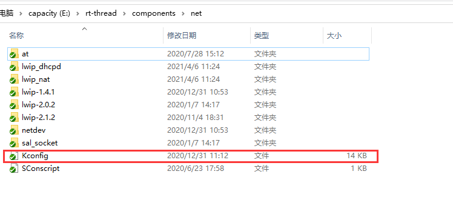
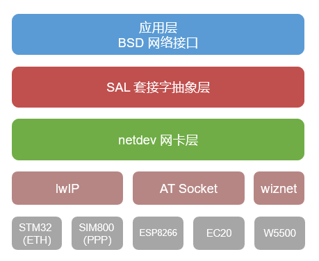
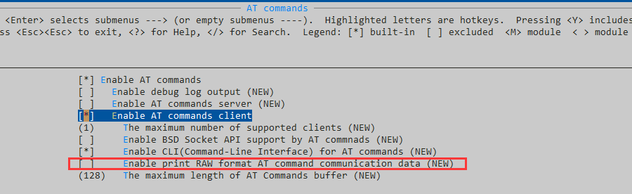
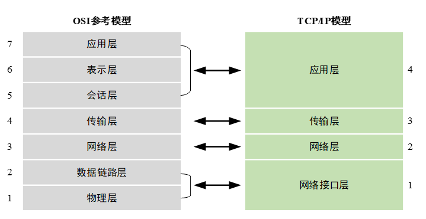
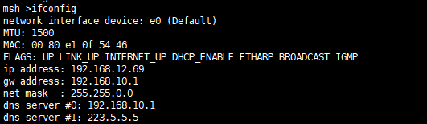

# RT-Thread 提供的网络世界入口 - net 组件

作为一款在 RTOS 领域对网络支持很丰富的 RT-Thread，对设备联网功能的支持的工具就是接下来要讨论的 net 组件。它位于 ```./rt-thread/components/net``` 路径下；作为一款基础组件， env 与 Studio 的工程配置界面的配置项都依赖该目录下的 Kconfig 文件。我们对网络功能的选择，或者其配置都属于该 Kconfig 的管理范畴。



从图片中的信息也可以了解到，AT，Lwip，Netdev，Sal 这些我们相对熟悉的功能也位于该目录中。这四个基础组件，可以驱动的网络设备的种类多到各个方面。从有线网络的各种 ETH 的方式，带 PHY 的 enc28j60，纯接口的 RJ45，还有自带网络协议栈的 W5500都可以直接经过配置，通过我们的 net 组件实现设备联网的需求；除了有线网络的接入方式，无线网络的接入方式则更多，2G模块，3G模块，4G模块，Cat-1模块，Cat-4模块，NB-IOT模块，乃至 5G 模块这些依赖基站运营商的入网方式，例如 SIM800，EC20，AIR720，L610，N58，M5311 等，这些不同厂家，不同工作频率的模组均可以通过 NET 组件入网；WIFI 这种无需运营商直接提供的网络的入网方式，例如 ESP8266，W60x，rw007 等。

通过上面的简单介绍，大家应该可以基本了解 Net 组件的作用，即为使用 RT-Thread 的设备提供上网能力。上面的联网设备，品类繁多，方式各异，但其实追踪到依赖的基础 net 能力其实也没有多复杂。实际上大部分的功能依赖的基础能力，只有两组而已，即 AT ，Lwip；而到用户，也就开发者层面，大部分就只用到 Sal 这一个概念。



相信大家看过这份[文档](https://www.rt-thread.org/document/site/programming-manual/sal/sal/ )，主要描述了 Sal 提供的编程接口，也就是大家常用的 socket 接口；通过 Sal 接口大家已经可以实现 MQTT，NTP，TFTP，TCP Client，TCP Server，webclient，UDP Client，UDP Server，webnet 等这些大家经常会使用的工具。像浏览器一样访问网站，webclient；模拟一个网站，webnet；连接各种云平台，Mqtt；获取准确授时，NTP ；通过网络传输文件 ，TFTP ；诸如此类功能， Sal 提供了轻松访问网络的一把钥匙。你可以理解这把钥匙是向上的，但是这篇文章现在要讲的，是向下的，看看 Sal 这样组件，又是谁在支撑着它。

Net 组件的主要内容有 4 个方面，分别是 sal ，AT，lwip 与 netdev，我们先从 AT 和 Lwip 讲起，在不同的方式中介绍 sal 的用途；然后讲 netdev 的作用。


### 1. 总概

对于一个给定的模组，他的联网方式有时并不是单一的；以常见的 Cat-4 (4G) 模块为例，一方面它可以使用 AT 命令这种经典的方式来实现网络连接；另一方面又可以通过 PPP 拨号，使用 lwip 的方式来实现网络连接。或者在以 W60x 为例，一方面可以使用 AT 的方式来实现联网功能；另一方面又可以使用裸 IP 包的方式来实现网络连接。**在选取上网模块时，应当考虑片上资源的情况，以及网络质量的问题，选择比较适合的联网方式。**条条大路通罗马，短途长途，步行开车还是有些小区别的。

### 2. AT


> AT 命令一开始并没有那么丰富，一开始是用作拨号的功能，也就是电话业务方面的内容。后来随着时间发展，AT 命令的范围也一步步进行了扩展，而逐渐支持了网络的一些功能，例如 TCP ，UDP 的功能；而到现在，有些模块厂商甚至直接使用 AT 命令扩展的方式，实现了诸如 MQTT，HTTP，HTTPS 之类的功能。这些使用扩展 AT 命令方式实现的上层应用对模块依赖度高，在 RT Thread 的 IOT Package 的栏目中，可以留意到这样的软件包，例如：[bc28_mqtt](https://github.com/luhuadong/rtt-bc28-mqtt)。RT-Thread 的 AT socket 功能，则是更接近底层，实现 TCP UDP 这样的接口，通过 SAL 来实现 MQTT 这种上层应用。

RT-Thread 的 AT 组件的设计目的就是使设备能发送和解析 AT 命令。为了到达这个目的，契合 AT 命令的常见逻辑，提供了AT client 功能和 AT Server 功能。

* 对于 AT Client 来说，是由 MCU 去向 Modem 发送 AT 命令，由 Modem 响应命令，并给出回复。这种方式我们常用的，也是我们通过支持 AT 的模组上网的常用方式。
* 对于 AT Server 来说，是由 MCU 作为类似 Modem 的功能，由其他 MCU 向这个 MCU 发送 AT 命令，由这个 MCU 响应 AT 命令并做出回复。

具体的 AT 的使用，可以参考 [AT 文档](https://www.rt-thread.org/document/site/programming-manual/at/at/)；更加详细，底层的实操的内容在专门的文档中有描述；在查阅文档时，可以同时浏览代码，通过文章的说明，我们应该能了解到 AT 组件的使用方法。AT 组件的适用范围也进而清晰起来：

* AT 命令用作模块控制
* AT 命令用作数据的解析

对 AT Client 功能做大规模应用的软件包为 [at_device ](https://github.com/RT-Thread-packages/at_device)，作为一款使用频次很高的软件包，可以看到他充分利用了 AT 组件的能力，一方面针对模块控制的能力设置了 at_device_xxx.c 来提供模块的基础控制操作；一方面也提供了 at_socket_xxx.c 来提供数据解析能力。对于整体的 net 组件而言，at_socket_xxx.c 实际上沟通了 AT 组件与 Sal，使得上层应用能依赖 at_socket_xxx.c 的函数，实现对应的网络功能 MQTT，HTTP....

```c
static const struct sal_socket_ops at_socket_ops =
{
    at_socket,
    at_closesocket,
    at_bind,
    NULL,
    at_connect,
    NULL,
    at_sendto,
    at_recvfrom,
    at_getsockopt,
    at_setsockopt,
    at_shutdown,
    NULL,
    NULL,
    NULL,
#ifdef SAL_USING_POSIX
    at_poll,
#endif /* SAL_USING_POSIX */
};

static const struct sal_netdb_ops at_netdb_ops =
{
    at_gethostbyname,
    NULL,
    at_getaddrinfo,
    at_freeaddrinfo,
};
```

从 AT 组件的 ```at/at_socket/at_socket.h``` 中可以看到 AT 组件实现的  sal 的**一部分函数**，从这些函数命令也能看出来 at_socket 是不支持 server 模式的。

对于 at_device 软件包来说，at_socket_xxx.c 的内容，也主要是对 at_socket.h 内容的实现，例如：

```c
/* AT socket operations function */
struct at_socket_ops
{
    int (*at_connect)(struct at_socket *socket, char *ip, int32_t port, enum at_socket_type type, rt_bool_t is_client);
    int (*at_closesocket)(struct at_socket *socket);
    int (*at_send)(struct at_socket *socket, const char *buff, size_t bfsz, enum at_socket_type type);
    int (*at_domain_resolve)(const char *name, char ip[16]);
    void (*at_set_event_cb)(at_socket_evt_t event, at_evt_cb_t cb);
    int (*at_socket)(struct at_device *device, enum at_socket_type type);
};
```

如果你能浏览对应的 at_device 中 at_socket_xxx.c 的代码，你可以发现几乎都是上述函数的实现，都是根据不同的模块的特性来处理对应逻辑。

-----

在论坛中也能看到 at_device 的[影响](https://club.rt-thread.org/ask/search.html?q=AT)：

> 1. [at_device使用bc28报错](https://club.rt-thread.org/ask/question/430690.html)
> 2. [4.0.3版本串口接收buff设置大于128时，使用at_device有问题](https://club.rt-thread.org/ask/question/429740.html)
> 3. [air720 at-device回复命令冲突](https://club.rt-thread.org/ask/question/429519.html)
> 4. [AT组件接收不到数据](https://club.rt-thread.org/ask/question/430679.html)
> 5. .....

除了这些使用 at_device 能搜索到的问题，还有一些因为使用了 at_device 而产生的问题；这些问题的出现，对于在使用 AT 组件时的使用体验影响是很大的。

在遇到问题时，希望能小心得验证问题，尝试解决问题；在问题难以解决时，详细描述问题复现的场景，按照格式在论坛中提问。问题描述清晰，复现手段准确，更能吸引小伙伴们的参与，共同解决问题。



* AT RAW 能准确显示 AT 交互中的 modem 返回的数据，再数据异常需要调试时，建议打开。

市面上的各种模块，at_device 已经囊括了最常使用的一些部分，不过还有更多的模块等待着小伙伴们一起帮忙完善。也许是因为在小伙伴提交代码时并没有那么多的业务量或者功能，在一次次的功能增加迭代中，导致了 at_device 有时不能做到随取随用而产生了一些问题，也希望使用的小伙伴能发现问题，做出修改并给予 at_device 软件包自己的 PR，一起推动 at_device 更加易用。

### 3. Lwip



大家基本都是看过这个 TCP/IP 模型的，在嵌入式的网络协议栈入口中，lwip 就是很重要的一个入口； lwip 是开源的一个协议栈，已经经过很多厂家和开发者使用后，得到验证和肯定的嵌入式 TCP/IP 网络协议栈，lwip 的全称为 [**A Lightweight TCP/IP stack**](http://savannah.nongnu.org/projects/lwip/)，一个轻量级的 TCP/IP 协议栈。

所以可以知道：lwip 并不是嵌入式上唯一的 TCP/IP 协议栈，但 lwip 是经过验证的，能胜任工作的 TCP/IP 协议栈。在 RT-Thread 中，提供了三个 lwip 的版本供用户使用： lwip1.4.1，lwip2.0.2，lwip2.1.2 ；通常大家在使用有线连接的方式使用网络时，一部分是使用的 lwip 协议栈，而另一部分则是使用了 w5500 这种方式来实现。

难道 lwip 只有在有线网络中才能使用吗？其实，也不尽然。对于使用裸 IP 包方式实现的网络数据的交互，而不是简单使用 AT 命令的话；rw007 这种 WIFI 设备，Air720 这种 Cat-4 设备，都是可以使用 Lwip 来使用网络功能的。

|        |                           AT 方式                            |                          lwip 方式                           |
| :----: | :----------------------------------------------------------: | :----------------------------------------------------------: |
| rw007  | [AT 命令实现数据交互](https://github.com/RT-Thread-packages/at_device)(与模块版本有关) | [裸 IP 包形式实现数据交互](https://github.com/RT-Thread-packages/rw007) |
| Air720 | [AT 命令实现数据交互](https://github.com/RT-Thread-packages/at_device) | [PPP 包形式实现数据交互](https://github.com/RT-Thread-packages/ppp_device) |

通过表格可以发现 net 组件的意图：即通过数据交互的方式来实现网络数据传输。对于 AT 方式来说，网络数据在 AT 命令中，需要从 AT 数据中解析出想要使用的网络数据；这种方式不需要 Lwip 庞大的协议栈，但很明显需要比较强大的解析能力，而且频繁转换解析对网络效率也是有影响的。对于 lwip 方式来说，网络数据直接以 IP/PPP 包的方式传输，这是网络世界通用的格式；无论是我们的交换机，路由器，它们都能识别 IP 报文，更加轻便而且无需进行复杂的相互转换，但这种方法需要有 lwip 协议栈的参与，需要根据项目对 lwip 做一些细微得调整。

在 RT-Thread 中，我们对 lwip 做了一些小修改，也使用 Kconfig 的方式提供了一些简单的优化配置项供用户进行简单的配置。在上面提到，我们对 lwip 有一些修改，主要的修改内容包括 netif 与 mem 方面；在 netif 中，我们在上层抽象了 netdev 的结构，对于 lwip 而言是对 netif 的继承和常用的一些接口函数的函数，而对于不是使用 lwip 实现的网络通信功能来说，netdev 可以使开发者更轻松的使用；在 mem 方面，我们使用 RT-Thread 自身的内存分配算法取代了 lwip 的内存堆分配算法，**不包括内存池部分**。查看 lwipx.x.x 下的j脚本文件 ```Sconscript ```文件，可以留意到```.\src\core\mem.c```文件是没有参与编译的；也就是说在使用 ```pbuf_alloc(PBUF_RAW, len, PBUF_RAM)```语句来申请 pbuf 空间时，我们实际上使用得是 RT-Thread 通用的内存堆算法。**当然无论是 lwip 还是 RT-Thread ，内存堆与内存池的申请确实是各有优劣的，还是需要针对使用场景才能确定孰优孰劣。**在本篇文章中，主要讲解 lwip 在 net 中的作用，具体的 lwip 配置方法和内容讲解会在另一篇文章中仔细描述。

### 4. W5500

我们经常使用的 net 组件中的两项已经介绍了基本情况；除了这两种方式，w5500 作为一个拥有 TCP/IP 协议栈的一个独立模块，也是一种通用的方式。在 RT-Thread 中使用 w5500 的方式也很简单。只需在工程中使用 [wiznet 软件包](https://github.com/RT-Thread-packages/wiznet)就可以使用标准的 BSD socket 接口来实现网络编程了。


通过网络框架图可以看到：wiznet 是独立与 AT socket 与 lwip 的，但还是需要 netdev 与 SAL 的参与才能轻松的使用。

从sal，netdev，w5500 的对接过程来看，在 BSD socket 的接口方面，只是实现了常用的一些接口；这些接口已经囊括了 IOT 设备中会使用的常用能力。

```c
static const struct sal_socket_ops wiz_socket_ops =
{
    wiz_socket,
    wiz_closesocket,
    wiz_bind,
    wiz_listen,
    wiz_connect,
    wiz_accept,
    wiz_sendto,
    wiz_recvfrom,
    wiz_getsockopt,
    wiz_setsockopt,
    wiz_shutdown,
    NULL,
    NULL,
    NULL,
#ifdef SAL_USING_POSIX
    wiz_poll,
#endif /* SAL_USING_POSIX */
};

static const struct sal_netdb_ops wiz_netdb_ops =
{
    wiz_gethostbyname,
    NULL,
    wiz_getaddrinfo,
    wiz_freeaddrinfo,
};
```

在 w5500 的使用中，也有一部分小伙伴会遇到问题。比如，一些 liunx 上的网络应用在迁移到 w5500 的平台上时会出现一些参数的不兼容问题。比如设置某些 socket 的属性，设置一个 TCP 的属性等等；有些设置在 linux 平台上可能是可以使用的，有些则可能会产生编译或者执行过程的逻辑异常，不符合函数预期。

为了在嵌入式平台上实现网络功能，AT命令，lwip 协议栈，wiznet 这些方法都是实现了 TCP/IP 协议中的一大部分功能；并没有完全实现整个协议栈的内容。可能有些函数特性在嵌入式的平台上是不太符合预期的。这时候就需要发现问题的小伙伴及时在论坛中提出问题，更多的小伙伴参与讨论，才能使我们的 net 组件功能更丰富。

### 5. Netdev

在 lwip 的介绍中，我们提到 netdev 是对 lwip 中 netif 的继承。因为 netdev 从 netif 中取出了一些字节用于关键信息的填充。我们在 cmd 控制台上，经常会用到 ```ifconfig```命令，然后得到下面的回复：



在控制台中可以显示每个注册为 netdev 的信息，IP地址，网关地址，子网掩码，以及 DNS 服务器地址；还有 MTU 长度，MAC 地址，以及该 netdev 的属性（是否启用，链路是否正常，网络是否正常，DHCP 是否打开，ARP 功能是否开启，广播是否支持，IGMP组播能力是否支持）。这些内容中经常使用到的一般有三个属性：

| 重要属性                    | 意义         |
| --------------------------- | ------------ |
| UP / DOWN                   | 网卡是否启用 |
| LINK_UP / LINK_DOWN         | 链路是否正常 |
| INTERNET_UP / INTERNET_DOWN | 网络是否正常 |

* LINK_UP 的意义为链路是否正常，在 netdev 启用后，LINK_UP 是作为 PING 命令是否可用的关键。如果 为 LINK_DOWN ，PING 命令将禁用。毕竟，网线都没有连接，PING 命令不可以用也是合情合理的喽。**LINK_DOWN 状态下禁用 PING 命令很合理，但是如果 netdev 的状态被异常置为 LINK_DOWN 就很苦恼了。如果被代码错误执行到设置为 LINK_DOWN，PING 命令将不可用。**netdev 的使用，可以参考[文档介绍](https://www.rt-thread.org/document/site/programming-manual/netdev/netdev/)。
* INTERNET_UP 的意义为网络是否正常。实际上，RT-Thread 的代码逻辑中，把这个位作为标志位，但很少利用这个标志位做逻辑判断。这样做的原因，是因为判断 INTERNET_UP 的方式为访问 ```link.rt-thread.org```，如果能有回复，就把标志位置为 INTERNET_UP，否则置为 INTERNET_DOWN。这个逻辑在一般情况下算是正常，但是在一些网络拓扑中，很有可能被网络标记位不可达（被墙了，PS ：也有可能是 RT-Thread 的网络主机重启了），所以哪怕实际上是可以连接网络的，却显示为 INTERNET_DOWN。

除此以外，netdev 还有 PING 功能的抽象，就是上面提到的 LINK_DOWN 状态不可用的那个。说它是抽象，是因为 netdev 中并没有直接实现全部的 ping 逻辑，而是依赖底层的提供提供的 PING 能力。


也许会有小伙伴想问，netdev 没有提供 ping 功能是以为代码不够高大上，能力不足吗？都是连接到一个 IP 地址上面，使用 socket 的接口不可以吗？为什么一定要抽象出一个 ping 接口，让底层去实现这个接口，而不是 netdev 层直接实现呢？其实这并不是这个原因，因为 ping 功能发送的数据，和通过 socket 发出的数据，格式并不是完全相同的。虽然统称为 IP 数据报文，但实际上 netdev 这个层级是感受不到这个数据的。具体的内容可以在下一篇 lwip 的讲解中来一起解释。


