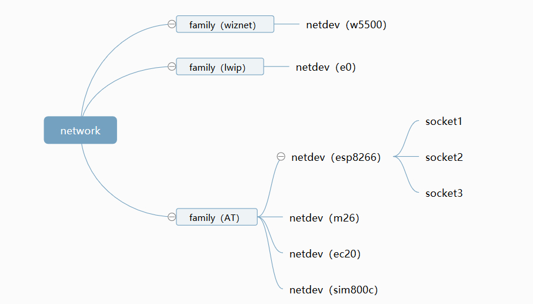

# netdev 网卡

## 介绍

netdev（network interface device），即网络接口设备，又称网卡。每一个用于网络连接的设备都可以注册成网卡，为了适配更多的种类的网卡，避免系统中对单一网卡的依赖，RT-Thread 系统提供了 netdev 组件用于网卡管理和控制。

netdev 组件主要作用是**解决设备多网卡连接时网络连接问题，用于统一管理各个网卡信息与网络连接状态，并且提供统一的网卡调试命令接口**。 其主要功能特点如下所示：

- 抽象网卡概念，每个网络连接设备可注册唯一网卡。
- 提供多种网络连接信息查询，方便用户实时获取当前网卡网络状态；
- 建立网卡列表和默认网卡，可用于网络连接的切换；
- 提供多种网卡操作接口（设置 IP、DNS 服务器地址，设置网卡状态等）；
- 统一管理网卡调试命令（ping、ifconfig、netstat、dns 等命令）；

## 工作原理

### 网卡概念

网卡概念介绍之前先了解协议栈相关概念，协议栈是指网络中各层协议的总和，每种协议栈反映了不同的网络数据交互方式，RT-Thread 系统中目前支持三种协议栈类型： lwIP 协议栈、AT Socket 协议栈、WIZnet TCP/IP硬件协议栈。每种协议栈对应一种协议簇类型（family），上述协议栈分别对应的协议簇类型为：AF_INET、AF_AT、AF_WIZ。

网卡的初始化和注册建立在协议簇类型上，所以每种网卡对应唯一的协议簇类型。 Socket 套接字描述符的创建建立在 netdev 网卡基础上，所以每个创建的 Socket 对应唯一的网卡。协议簇、网卡和 socket 之间关系如下图所示：



每个网卡对应唯一的网卡结构体对象，其中包含该网卡的主要信息和实时状态，用于后面网卡信息的获取和设置，如下为网卡结构体对象参数介绍：

```c
/* 网卡结构体对象 */
struct netdev
{
    rt_slist_t list;                                   /* 网卡列表 */

    char name[RT_NAME_MAX];                            /* 网卡名称 */
    ip_addr_t ip_addr;                                 /* IP 地址 */
    ip_addr_t netmask;                                 /* 子网掩码地址 */
    ip_addr_t gw;                                      /* 网关地址 */
    ip_addr_t dns_servers[NETDEV_DNS_SERVERS_NUM];     /* DNS 服务器地址 */
    uint8_t hwaddr_len;                                /* 硬件地址长度 */
    uint8_t hwaddr[NETDEV_HWADDR_MAX_LEN];             /* 硬件地址 */

    uint16_t flags;                                    /* 网卡状态位 */
    uint16_t mtu;                                      /* 网卡最大传输单元 */
    const struct netdev_ops *ops;                      /* 网卡操作回调函数 */

    netdev_callback_fn status_callback;                /* 网卡状态改变回调 */
    netdev_callback_fn addr_callback;                  /* 网卡地址改变回调 */

#ifdef RT_USING_SAL
    void *sal_user_data;                               /* 网卡中协议簇相关参数数据 */
#endif /* RT_USING_SAL */
    void *user_data;                                   /* 预留用户数据 */
};

```

### 网卡状态

netdev 组件提供对网卡网络状态的管理和控制，其类型主要包括下面四种：up/down、link_up/link_down、internet_up/internet_down、dhcp_enable/dhcp_disable。

- **up/down：** 底层网卡初始化完成之后置为 up 状态，用于判断网卡开启还是禁用。
- **link_up/link_down：** 用于判断网卡设备是否具有有效的链路连接，连接后可以与其他网络设备进行通信。该状态一般由网卡底层驱动设置。
- **internet_up/internet_down：** 用于判断设备是否连接到因特网，接入后可以与外网设备进行通信。
- **dhcp_enable/dhcp_disable：** 用于判断当前网卡设备是否开启 DHCP 功能支持。

其中`up/down` 状态以及 `dhcp_enable/dhcp_disable` 状态可以通过 netdev 组件提供的接口设置，可以在应用层控制。其他状态是由网卡底层驱动或者 netdev 组件根据当前网卡网络连接情况自动设置。

### 默认网卡和网卡列表

为了方便网卡的管理和控制，netdev 组件中提供网卡列表用于统一管理各个网卡设备，系统中每个网卡在初始化时会创建和注册网卡对象到 netdev 组件网卡列表中。

网卡列表中有且只有一个**默认网卡**，一般为系统中第一个注册的网卡，可以通过 `netdev_set_default()` 函数设置默认网卡，默认网卡的主要作用是确定优先使用的进行网络通讯的网卡类型，方便网卡的切换和网卡信息的获取。

## 配置选项

netdev 相关的宏定义如下所示，使用时需要将对应宏定义添加到 `rtconfig.h`：

| **宏定义**                | **描述**                     |
| ------------------------- | ---------------------------- |
| RT_USING_NETDEV           | 开启 netdev 功能             |
| NETDEV_USING_IFCONFIG     | 开启 ifconfig 命令支持       |
| NETDEV_USING_PING         | 开启 ping 命令支持           |
| NETDEV_USING_NETSTAT      | 开启 netstat 命令支持        |
| NETDEV_USING_AUTO_DEFAULT | 开启默认网卡自动切换功能支持 |

上面配置选项可以直接在 `rtconfig.h` 文件中添加使用，也可以通过组件包管理工具 ENV 配置选项加入，ENV 工具中具体配置路径如下：

```c
RT-Thread Components  --->
    Network  --->
        Network interface device  --->
        [*] Enable network interface device
        [*]   Enable ifconfig features
        [*]   Enable ping features
        [*]   Enable netstat features
        [*]   Enable default netdev automatic change features
```

配置完成可以通过 scons 命令重新生成功能，完成 netdev 组件的添加。

## 使用方式

### 头文件定义

使用下面 netdev 网卡功能相关操作函数，需要包含如下头文件：

```c
#include <arpa/inet.h>         /* 包含 ip_addr_t 等地址相关的头文件 */
#include <netdev.h>            /* 包含全部的 netdev 相关操作接口函数 */
```

### 网卡注册和获取

**注册网卡**

每一个网卡在初始化完成之后，需要调用网卡注册函数注册网卡到网卡列表中，注册网卡的接口如下所示：

```c
int netdev_register(struct netdev *netdev, const char *name, void *user_data);
```

| **参数**  | **描述**     |
| --------- | ------------ |
| netdev    | 网卡对象     |
| name      | 网卡名称     |
| user_data | 用户使用数据 |
| **返回**  | **——**       |
| 0         | 网卡注册成功 |
| -1        | 网卡注册失败 |

该函数不需要在用户层调用，一般为网卡驱动初始化完成之后自动调用，如 esp8266 网卡的注册在 esp8266 设备网络初始化之后自动完成。

**注销网卡**

该函数可以在网卡使用时，注销网卡的注册，即从网卡列表中删除对应网卡，注销网卡的接口如下所示：

```c
int netdev_unregister(struct netdev *netdev);
```

| **参数** | **描述**     |
| -------- | ------------ |
| netdev   | 网卡对象     |
| **返回** | **——**       |
| 0        | 网卡注销成功 |
| -1       | 网卡注销失败 |

**通过状态获取第一个匹配的网卡对象**

如果想要通过指定传入状态匹配默认的网卡，可以调用如下函数：

```c
struct netdev *netdev_get_first_by_flags(uint16_t flags);
```

| **参数** | **描述**         |
| -------- | ---------------- |
| flags | 指定匹配的状态 |
| **返回** | **——**           |
| != NULL        | 获取网卡对象成功 |
| NULL   | 获取网卡对象失败 |

可以用于匹配网卡的状态如下所示：

| 状态                    | 描述                   |
| ----------------------- | ---------------------- |
| NETDEV_FLAG_UP          | 网卡 up 状态           |
| NETDEV_FLAG_LINK_UP     | 网卡 link_up 状态      |
| NETDEV_FLAG_INTERNET_UP | 网卡外网连接状态       |
| NETDEV_FLAG_DHCP        | 网卡 DHCP 功能开启状态 |

**获取第一个指定协议簇类型的网卡对象**

每个网卡对应唯一的协议簇类型（family），如下函数可以通过指定的协议簇类型获取网卡列表中第一个网卡对象：

```c
struct netdev *netdev_get_by_family(int family);
```

| **参数** | **描述**         |
| -------- | ---------------- |
| family   | 协议簇类型       |
| **返回** | **——**           |
| != NULL  | 获取网卡对象成功 |
| NULL     | 获取网卡对象失败 |

目前 RT-Thread 系统中支持的协议簇类型有如下几种：

| 协议簇类型 | 介绍                                    |
| ---------- | --------------------------------------- |
| AF_INET    | 用于使用 lwIP 协议栈的网卡              |
| AF_AT      | 用于使用 AT Socket 协议栈的网卡         |
| AF_WIZ     | 用于使用 WIZnet TCP/IP 硬件协议栈的网卡 |

该函数主要用于指定协议簇网卡操作，以及多网卡环境下，同协议簇网卡之间的切换的情况。

**通过 IP 地址获取网卡对象**

每个网卡中都包含该网卡的基本信息如 ：IP 地址，网关和子网掩码等，下面函数可以通过 IP 地址获取网卡对象：

```c
struct netdev *netdev_get_by_ipaddr(ip_addr_t *ip_addr);
```

| **参数** | **描述**         |
| -------- | ---------------- |
| ip_addr  | IP 地址对象      |
| **返回** | **——**           |
| != NULL  | 获取网卡对象成功 |
| NULL     | 获取网卡对象失败 |

该函数主要用于 bind 函数绑定指定 IP 地址时获取网卡状态信息的情况。

> 可以通过 inet_aton () 函数将 IP 地址从字符串格式转化为 ip_addr_t 类型。

**通过名称获取网卡对象**

每个网卡中有唯一的网卡名称，可以通过网卡名称获取网卡对象：

```c
struct netdev *netdev_get_by_name(const char *name);
```

| **参数** | **描述**         |
| -------- | ---------------- |
| name     | 网卡名称         |
| **返回** | **——**           |
| != NULL  | 获取网卡对象成功 |
| NULL     | 获取网卡对象失败 |

该函数为应用层常用获取网卡对象接口，当前网卡列表中名称可通过 `ifconfig` 命令查看。

### 设置网卡信息

**设置默认网卡**

系统中注册的网卡通过统一网卡列表管理，并且提供唯一的默认网卡，下面函数可以用于切换默认网卡：

```c
void netdev_set_default(struct netdev *netdev);
```

**设置网卡 up/down 状态**

网卡 up/down 状态用于控制网卡状态是否能使用。

如下函数用于启用网卡：

```c
int netdev_set_up(struct netdev *netdev);
```

 如下函数用于禁用网卡：

```c
int netdev_set_down(struct netdev *netdev);
```

禁用网卡之后，该网卡上对应的 Socket 套接字将无法进行数据通讯，并且将无法在该网卡上创建和绑定 Socket 套接字，直到网卡状态设置为 up 状态。

**设置网卡 DHCP 功能状态**

DHCP 即动态主机配置协议，如果开启该网卡 DHCP 功能将无法设置该网卡 IP 、网关和子网掩码地址等信息，如果关闭该功能则可以设置上述信息。下面函数可以用于控制开启或关闭网卡 DHCP 功能：

```c
int netdev_dhcp_enabled(struct netdev *netdev, rt_bool_t is_enabled);
```

| **参数**   | **描述**                           |
| ---------- | ---------------------------------- |
| netdev     | 网卡对象                           |
| is_enabled | 是否开启功能（RT_TRUE / RT_FALSE） |
| **返回**   | **——**                             |
| 0          | 设置 DHCP 功能状态成功             |
| < 0        | 设置 DHCP 功能状态失败             |

部分网卡不支持设置 DHCP 状态功能，如 M26、EC20 等 GRPS 模块，在调用该函数时会报错提示。

**设置网卡地址信息**

下面函数可以用于设置指定网卡地址 IP 、网关和子网掩码地址，需要在网卡关闭 DHCP 功能状态使用。

```c
/* 设置网卡 IP 地址 */
int netdev_set_ipaddr(struct netdev *netdev, const ip_addr_t *ipaddr);
```

```c
/* 设置网卡网关地址 */
int netdev_set_gw(struct netdev *netdev, const ip_addr_t *gw);
```

```c
/* 设置网卡子网掩码地址 */
int netdev_set_netmask(struct netdev *netdev, const ip_addr_t *netmask);
```

| **参数**          | **描述**                        |
| ----------------- | ------------------------------- |
| netdev            | 网卡对象                        |
| ipaddr/gw/netmask | 需要设置的 IP/网关/子网掩码地址 |
| **返回**          | **——**                          |
| 0                 | 设置地址信息成功                |
| < 0               | 设置地址信息失败                |

下面函数可以用于设置网卡 DNS 服务器地址，主要用于网卡域名解析功能。

```c
int netdev_set_dns_server(struct netdev *netdev, uint8_t dns_num, const ip_addr_t *dns_server);
```
| **参数**   | **描述**                  |
| ---------- | ------------------------- |
| netdev     | 网卡对象                  |
| dns_num    | 需要设置的 DNS 服务器     |
| dns_server | 需要设置的 DNS 服务器地址 |
| **返回**   | **——**                    |
| 0          | 设置地址信息成功          |
| < 0        | 设置地址信息失败          |

**设置网卡回调函数**

下面函数可以用于设备网卡状态改变时调用的回调函数，状态的改变包括：`up/down`、 `link_up/link_down`、`internet_up/internet_down`、`dhcp_enable/dhcp_disable` 等。

```c
typedef void (*netdev_callback_fn )(struct netdev *netdev, enum netdev_cb_type type);
void netdev_set_status_callback(struct netdev *netdev, netdev_callback_fn status_callback);
```

| **参数**        | **描述**             |
| --------------- | -------------------- |
| netdev          | 网卡对象             |
| status_callback | 状态改变回调函数指针 |
| **返回**        | **——**               |
| 无              | 无                   |

下面函数可以用于设置网卡地址信息改变时调用的回调函数，地址的改变包括：IP、子网掩码、网关、DNS 服务器等地址。

```c
void netdev_set_addr_callback(struct netdev *netdev, netdev_callback_fn addr_callback)
```

| **参数**      | **描述**             |
| ------------- | -------------------- |
| netdev        | 网卡对象             |
| addr_callback | 地址改变回调函数指针 |
| **返回**      | **——**               |
| 无            | 无                   |

### 获取网卡信息

**判断网卡是否为 up 状态**

```c
#define netdev_is_up(netdev)
```

**判断网卡是否为 link_up 状态**

```c
#define netdev_is_link_up(netdev)
```

**判断网卡是否为 internet_up 状态**

```c
#define netdev_is_internet_up(netdev)
```

**判断网卡 DHCP 功能是否开启**

```c
#define netdev_is_dhcp_enable(netdev)
```

### 默认网卡自动切换

menuconfig 中配置开启如下选项，可使能默认网卡自动切换功能：

```c
[*]   Enable default netdev automatic change features
```

 单网卡模式下，开启和关闭默认网卡自动切换功能无明显效果。

多网卡模式下，如果开启默认网卡自动切换功能，当前默认网卡状态改变为 down 或 link_down 时，默认网卡会切换到网卡列表中第一个状态为 up 和 link_up 的网卡。这样可以使一个网卡断开后快速切换到另一个可用网卡，简化用户应用层网卡切换操作。如果未开启该功能，则不会自动切换默认网卡。

## 应用示例

### FinSH 命令

为了方便用户多网卡环境下网卡的管理和控制，netdev 组件提供多种网络调试命令，常用的 FinSH 命令如下表所示：

| FinSH 命令 | 描述                                                   |
| ---------- | ------------------------------------------------------ |
| ping       | 用于检查网络是否连通                                   |
| ifconfig   | 用于显示和配置网卡信息，如设置 IP 、网关和子网掩码地址 |
| dns        | 用于显示和配置网卡 DNS 服务器地址                      |
| netstat    | 用于查看各网卡网络连接信息和端口使用情况               |

使用 `ping` 命令测试网络连接情况，运行结果如下所示：

```c
msh />ping rt-thread.org
60 bytes from 118.31.15.152 icmp_seq=0 ttl=52 time=13 ms
60 bytes from 118.31.15.152 icmp_seq=1 ttl=52 time=13 ms
60 bytes from 118.31.15.152 icmp_seq=2 ttl=52 time=14 ms
60 bytes from 118.31.15.152 icmp_seq=3 ttl=52 time=14 ms
```

- 该命令默认使用网卡列表中默认网卡发送 ping 协议数据，如果默认网卡状态为 down 或者 link_down，则使用网卡列表中第一个 up 和 link_up 状态的网卡发送 ping 协议请求数据。

使用 `ifconfig ` 命令查询和设置网卡信息，运行结果如下所示：

```c
msh />ifconfig                                             /* 显示全部网卡信息 */
network interface device: w0 (Default)
MTU: 1500
MAC: 98 3b 16 55 9a 87
FLAGS: UP LINK_UP INTERNET_UP DHCP_DISABLE ETHARP BROADCAST IGMP
ip address: 192.168.12.92
gw address: 192.168.10.1
net mask  : 255.255.0.0
dns server #0: 192.168.10.1
dns server #1: 223.5.5.5
msh />
msh />ifconfig w0 192.168.12.93 192.168.10.1 255.255.0.0   /* 设置指定网卡 IP 地址*/
config : w0
IP addr: 192.168.12.93
Gateway: 192.168.10.1
netmask: 255.255.0.0
```

- `ifconfig` 命令会顺序显示网卡列表中全部网卡的信息；
- 网卡列表中默认网卡命令后会添加 `default` 标识；
- `ifconfig` 命令设置网卡信息功能，只能在网卡 DHCP 功能关闭时调用，否则会报错。

使用 `dns` 命令查询和设置网卡 DNS 服务器地址，运行结果如下所示：

```c
msh />dns                                         /* 显示全部网卡 DNS 服务器地址 */
network interface device: w0 (Default)
dns server #0: 192.168.10.1
dns server #1: 223.5.5.5
msh />
msh />dns w0 192.168.12.1                          /* 设置指定网卡 DNS 服务器地址 */
set network interface device(w0) dns server #0: 192.168.12.1
```

- `dns` 命令会顺序显示网卡列表中全部网卡的 DNS 服务器地址信息。
- 目前每个网卡只同时支持 2 个 DNS 服务器地址。

使用 `netstat` 命令可以网卡下网络连接状态和端口使用，运行效果如下所示：

```c
msh />netstat
Active PCB states:
#0 192.168.12.93:49153 <==> 183.230.40.39:6002
Listen PCB states:
TIME-WAIT PCB states:
Active UDP PCB states:
#0 4 0.0.0.0:68 <==> 0.0.0.0:67
```

- 该命令可以查看当前网卡上使用的 TCP/UDP 连接的地址和端口信息。

### 切换默认网卡示例

在多网卡连接的情况下，可以通过设置默认网卡切换网卡。创建 Socket 连接时，使用 gethostbyname 等域名解析相关的函数时，以及在完成 ping 网络功能时，都会优先选择默认网卡。

如下示例，导出命令用于切换默认网卡：

```c
#include <arpa/inet.h>
#include <netdev.h>       /* 当需要网卡操作是，需要包含这两个头文件 */

static int netdev_set_default_test(int argc, char **argv)
{
    struct netdev *netdev = RT_NULL;

    if (argc != 2)
    {
        rt_kprintf("netdev_set_default [netdev_name]   --set default network interface device.\n");
        return -1;
    }

    /* 通过网卡名称获取网卡对象，名称可以通过 ifconfig 命令查看 */
    netdev = netdev_get_by_name(argv[1]);
    if (netdev == RT_NULL)
    {
        rt_kprintf("not find network interface device name(%s).\n", argv[1]);
        return -1;
    }

    /* 设置默认网卡对象 */
    netdev_set_default(netdev);

    rt_kprintf("set default network interface device(%s) success.\n", argv[1]);
    return 0;
}
#ifdef FINSH_USING_MSH
#include <finsh.h>
/* 导出命令到 FinSH 控制台 */
MSH_CMD_EXPORT_ALIAS(netdev_set_default_test, netdev_set_default, set default network interface device);
#endif /* FINSH_USING_MSH */
```

### 设置网卡 up/down 状态示例

网卡 up/down 状态用于设置网卡是否被禁用，下面提供导出设置网卡状态命令：

```c
#include <arpa/inet.h>
#include <netdev.h>         /* 当需要网卡操作是，需要包含这两个头文件 */

int netdev_set_status_test(int argc, char **argv)
{
    struct netdev *netdev = RT_NULL;

    if (argc != 3)
    {
        rt_kprintf("netdev_set_status [netdev_name] [up/down]   --set network interface device status.\n");
        return -1;
    }

    /* 通过名称获取网卡对象 */
    netdev = netdev_get_by_name(argv[1]);
    if (netdev == RT_NULL)
    {
        rt_kprintf("input network interface name(%s) error.\n", argv[1]);
        return -1;
    }

    /*  设置网卡状态为 up 或 down */
    if (strcmp(argv[2], "up") == 0)
    {
        netdev_set_up(netdev);
        rt_kprintf("set network interface device(%s) up status.\n", argv[1]);
    }
    else if (strcmp(argv[2], "down") == 0)
    {
        netdev_set_down(netdev);
        rt_kprintf("set network interface device(%s) down status.\n", argv[1]);
    }
    else
    {
        rt_kprintf("netdev_set_status [netdev_name] [up/down].\n");
        return -1;
    }

    return 0;
}
#ifdef FINSH_USING_MSH
#include <finsh.h>
/* 导出命令到 FinSH 控制台 */
MSH_CMD_EXPORT_ALIAS(netdev_set_status_test, netdev_set_status, set network interface device status);
#endif /* FINSH_USING_MSH */
```

### 设置网卡 IP 地址示例

每个网卡对应唯一的 IP 地址，可以通过 netdev 提供接口设置网卡 IP 地址，如下所示：

```c
#include <arpa/inet.h>
#include <netdev.h>         /* 当需要网卡操作是，需要包含这两个头文件 */

int netdev_set_ipaddr_test(int argc, char **argv)
{
    struct netdev *netdev = RT_NULL;
    ip_addr_t addr;

    if (argc != 3)
    {
        rt_kprintf("netdev_set_status [netdev_name] [ip_addr]   --set network interface device IP address.\n");
        return -1;
    }

    /* 通过名称获取网卡对象 */
    netdev = netdev_get_by_name(argv[1]);
    if (netdev == RT_NULL)
    {
        rt_kprintf("input network interface name(%s) error.\n", argv[1]);
        return -1;
    }

    /*  设置网卡 IP 地址*/
    inet_aton(argv[2], &addr);
    netdev_set_ipaddr(netdev, &addr);

    return 0;
}
#ifdef FINSH_USING_MSH
#include <finsh.h>
/* 导出命令到 FinSH 控制台 */
MSH_CMD_EXPORT_ALIAS(netdev_set_ipaddr_test, netdev_set_ipaddr, set network interface device IP
 address);
#endif /* FINSH_USING_MSH */
```

## 常见问题

### Q: 设置 IP地址、网关和子网掩码时报错无法设置？

 **A:**  设置 IP地址、网关和子网掩码时，需要确定当前网卡 DHCP 状态，只有当网卡 DHCP 状态关闭时才可以设置，可以调用 `netdev_dhcp_enabled ()` 函数设置网卡 DHCP 状态。

### Q: 多网卡情况下，ping 功能或者创建 socket 时调用的网卡不是想要使用的网卡怎么办？

 **A:**  首先使用 `ifconfig` 命令查看当前网卡列表中网卡，确实想要使用的网卡名称，可是使用 `netdev_set_default()` 设置默认网卡为该网卡，然后确定该网卡状态为 UP 和 LINK_UP 状态。
