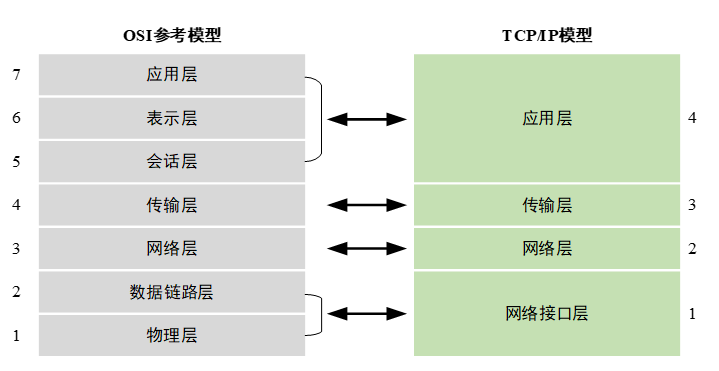
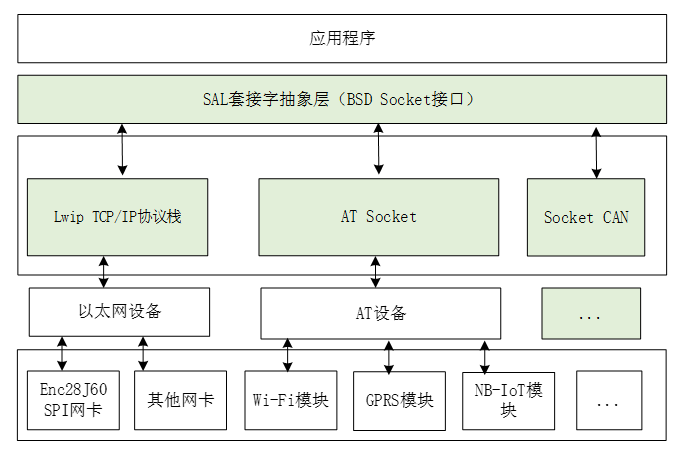
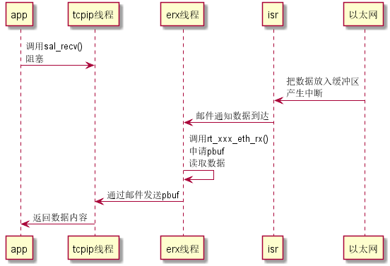
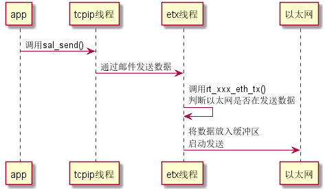
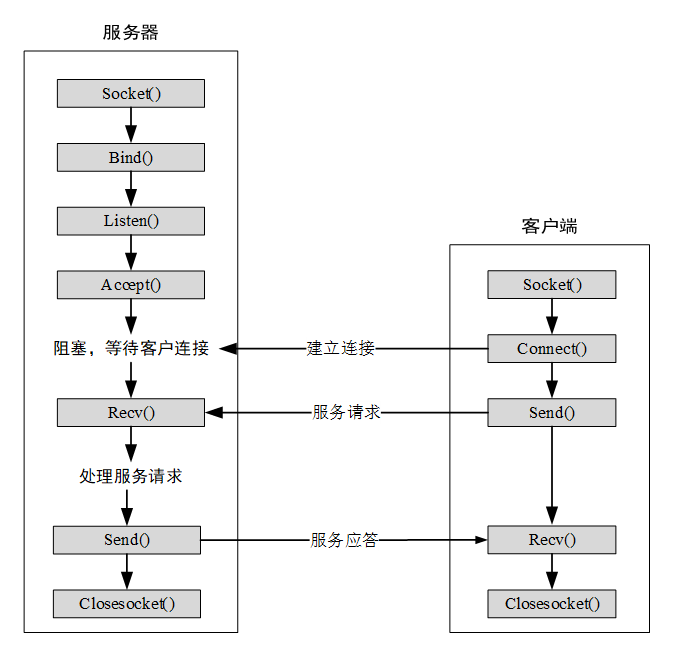
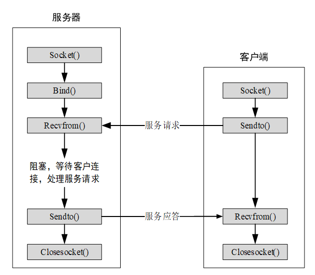
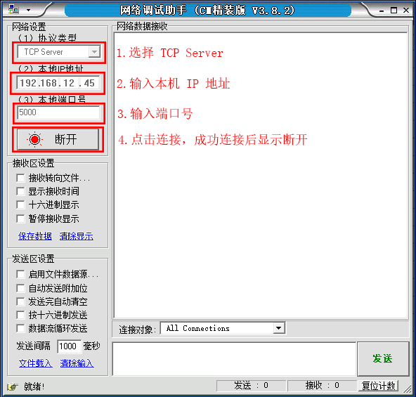
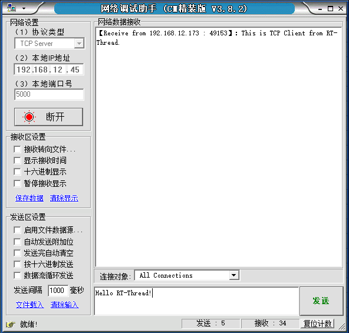
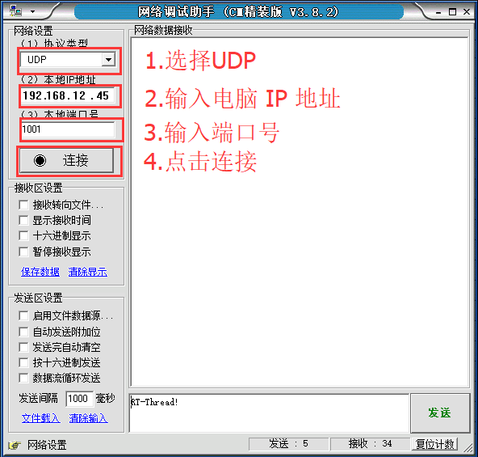
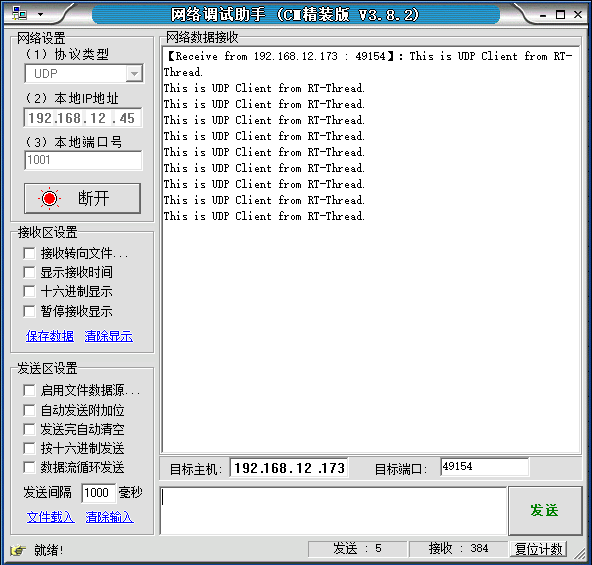

# RT-Thread 网络框架

随着网络的普及，人们的生活越来越依赖于网络的应用，越来越多的产品需要连接互联网，设备联网已经成为一种趋势。要实现设备和网络的连接，需要遵循 TCP/IP 协议，可以在设备运行网络协议栈来联网，也可以使用设备配合自带硬件网络协议栈的接口芯片来联网。

当设备连接上网络，就犹如插上了翅膀，可以利用网络实时的上传数据，用户在十万八千里之外就可以看到设备现在的运行状态和采集到的数据，并远程控制设备完成特定的任务。也可以通过设备播放网络音乐、拨打网络电话、充当局域网存储服务器等。

本章将讲解 RT-Thread 网络框架的相关内容，带你了解网络框架的概念、功能特点和使用方法，读完本章，大家将熟悉 RT-Thread 网络框架的概念和实现原理、熟悉使用 Socket API 进行网络编程。

## TCP/IP 网络协议简介

TCP/IP（Transmission Control Protocol/Internet Protocol）是传输控制协议和网络协议的简称，它不是单个协议，而是一个协议族的统称，里面包括了 IP 协议、ICMP 协议、TCP 协议、以及 http、ftp、pop3、https 协议等，它定义了电子设备如何连入因特网，以及数据在它们之间传输的标准。

### OSI 参考模型

OSI（Open System Interconnect），即开放式系统互联。一般都称为 OSI 参考模型，是 ISO（国际标准化组织）组织在 1985 年研究的网络互联模型。该体系结构标准定义了网络互连的七层框架（物理层、数据链路层、网络层、传输层、会话层、表示层和应用层），即 ISO 开放系统互连参考模型。第一层到第三层属于 [OSI 参考模型](http://baike.baidu.com/view/38361.htm) 的低三层，负责创建网络通信连接的链路；第四层到第七层为 OSI 参考模型的高四层，具体负责端到端的数据通信。在这一框架下进一步详细规定了每一层的功能，以实现开放系统环境中的互连性、互操作性和应用的可移植性。

### TCP/IP 参考模型

TCP/IP 通讯协议采用了 4 层的层级结构，每一层都呼叫它的下一层所提供的网络来完成自己的需求。这 4 层分别为：

* 应用层：不同类型的网络应用有不同的通信规则，因此应用层的协议是多种多样的，如简单电子邮件传输（SMTP）、文件传输协议（FTP）、网络远程访问协议（Telnet）等。

* 传输层：在此层中，它提供了节点间的数据传送服务，如传输控制协议（TCP）、用户数据报协议（UDP）等，TCP 和 UDP 给数据包加入传输数据并把它传输到下一层中，这一层负责传送数据，并且确定数据已被送达并接收。

* 网络层：负责提供基本的数据封包传送功能，让每一块数据包都能够到达目的主机（但不检查是否被正确接收），如网际协议（IP）。

* 网络接口层：对实际的网络媒体的管理，定义如何使用实际网络（如 Ethernet、Serial Line 等）来传送数据。

### TCP/IP 参考模型和 OSI 参考模型的区别

下图为 TCP/IP 参考模型与 OSI 参考模型图：



OSI 参考模型与 TCP/IP 参考模型都采用了分层结构，都是基于独立的协议栈的概念。OSI 参考模型有 7 层，而 TCP/IP 参考模型只有 4 层，即 TCP/IP 参考模型没有了表示层和会话层，并且把数据链路层和物理层合并为网络接口层。不过，二者的分层之间有一定的对应关系。OSI 由于体系比较复杂，而且设计先于实现，有许多设计过于理想，不太方便软件实现，因而完全实现 OSI 参考模型的系统并不多，应用的范围有限。而 TCP/IP 参考模型最早在计算机系统中实现，在 UNIX、Windows 平台中都有稳定的实现，并且提供了简单方便的编程接口（API），可以在其上开发出丰富的应用程序，因此得到了广泛的应用。TCP/IP 参考模型已成为现在网际互联的国际标准和工业标准。

### IP 地址

IP 地址是指互联网协议地址（Internet Protocol Address，又译为网际协议地址），是 [IP 协议](https://baike.baidu.com/item/IP%E5%8D%8F%E8%AE%AE) 提供的一种统一的地址格式，它为互联网上的每一个网络和每一台主机分配一个逻辑地址，以此来屏蔽物理地址的差异。常见的局域网 IP 地址为 192.168.X.X。

### 子网掩码

子网掩码 (subnet mask) 又叫网络掩码、地址掩码、子网络遮罩，它是一种用来指明一个 IP 地址的哪些位标识的是主机所在的子网，以及哪些位标识的是主机的位掩码。子网掩码不能单独存在，它必须结合 IP 地址一起使用。子网掩码只有一个作用，就是将某个 IP 地址划分成网络地址和主机地址两部分。子网掩码为 1 的位，对应的 IP 地址为网络地址，子网掩码为 0 的位，对应的 IP 地址为主机地址。以 IP 地址 192.168.1.10 和子网掩码 255.255.255.0 为例，子网掩码前 24 位（将 10 进制转换成 2 进制）为 1，所以 IP 地址的前 24 位 192.168.1 表示网络地址，剩下的 0 为主机地址。

### MAC 地址

MAC（figures Access Control 或者 Medium Access Control）地址，意译为媒体访问控制，或称为物理地址、硬件地址，用来定义 [网络设备](https://baike.baidu.com/item/%E7%BD%91%E7%BB%9C%E8%AE%BE%E5%A4%87/7667828) 的位置。在 [OSI 模型](https://baike.baidu.com/item/OSI%E6%A8%A1%E5%9E%8B) 中，第三层 [网络层](https://baike.baidu.com/item/%E7%BD%91%E7%BB%9C%E5%B1%82/4329439) 负责[IP 地址](https://baike.baidu.com/item/IP%E5%9C%B0%E5%9D%80)，第二层数据链路层则负责 MAC 地址。一个主机至少会有一个 MAC 地址。

## RT-Thread 网络框架简介

RT-Thread 为了能够支持各种网络协议栈，开发了 SAL 组件，全称 Socket abstraction layer，即套接字抽象层，RT-Thread 通过它可以无缝接入各类协议栈，包括几种常用的 TCP/IP 协议栈，例如嵌入式开发中常用的 LwIP 协议栈以及 RT-Thread 开发的 AT Socket 协议栈组件等，这些协议栈完成数据从网络层到传输层的转化。

RT-Thread 网络框架主要功能特点如下所示：

* 支持标准网络套接字 BSD Socket API，支持使用 poll/select

* 抽象、统一多种网络协议栈接口

* 支持各类物理网卡、网络通讯模块硬件

* 资源占用小，SAL 套接字抽象层组件资源占用为 ROM 2.8K 和 RAM 0.6K

RT-Thread 的网络框架采用了分层设计，共四层，每层都有不同的职责，下图为 RT-Thread 网络框架结构图：



网络框架向用户应用程序提供标准 BSD Socket 接口，开发者使用 BSD Socket 接口进行操作，无需关心网络底层如何实现，也无需关心网络数据是通过哪个网络协议栈，套接字抽象层为上层应用层提供的接口有：accept、connect、send、recv 等。

SAL 层之下是协议栈层，当前网络框架中支持的几个主要协议栈如下：

* LwIP 是一个开源的 TCP/IP 协议栈实现，它在保持 TCP/IP 协议主要功能的基础上减少了对 RAM 的占用，这使得 LwIP 协议栈很适合在嵌入式系统中使用。

* AT Socket 是给支持 AT 指令的模块使用的组件。AT 命令采用标准串口进行数据收发，将复杂的设备通讯方式转换成简单的串口编程，大大简化了产品的硬件设计和软件开发成本，这使得几乎所有的网络模组如 GPRS、3G/4G、NB-IoT、蓝牙、WiFi、GPS 等模组都很方便的接入 RT-Thread 网络框架，通过标准的 BSD Socket 方式开发网络应用，极大程度地简化上层应用的开发难度。

* Socket CAN 是 CAN 编程的一种方式，它简单易用，编程顺手。通过接入 SAL 层，开发者就可以在 RT-Thread 上实现 Socket CAN 编程了。

协议栈层下面是抽象设备层，通过将硬件设备抽象成以太网设备或者 AT 设备，从而将硬件设备接入到各类网络协议栈中。

最底层是各式各样的网络芯片或模块（例如：W5500/CH395 这类自带协议栈的以太网芯片，带 AT 指令的 WiFi 模块、GPRS 模块、NB-IoT 模块等等），这些硬件模块是真正进行网络通信功能的承载者，负责跟各类物理网络进行通信。

总体来说，RT-Thread 网络框架使开发者只需要关心和使用标准 BSD Socket 网络接口进行网络应用开发，而无需关心底层具体网络协议栈类型和实现，极大的提高了系统的兼容性，方便开发者完成网络相关应用的开发，也极大地提升了 RT-Thread 在物联网领域对于不同网络硬件的兼容性。

此外，基于网络框架，RT-Thread 提供了数量丰富的网络软件包，他们是基于 SAL 层的各种网络应用，例如 Paho MQTT、WebClient、cJSON、netutils 等等，可以从在线软件包管理中心获得。这些软件包都是网络应用利器，使用它们可以大大简化网络应用的开发难度，缩短网络应用开发周期。目前网络软件包数量达十几个，下表列出了目前 RT-Thread 支持的部分网络软件包，软件包的数量还在不断的增加中。

|**软件包名称**|**描述**                             |
|----------------|------------------------|
| Paho MQTT      | 基于 Eclipse 开源的 Paho MQTT，做了很多功能及性能优化，比如：增加了断线自动重连功能，采用 pipe 模型，支持非阻塞 API，支持 TLS 加密传输等等 |
| WebClient      | 简单易用的 HTTP 客户端，支持 HTTP GET/POST 等常见请求功能，支持 HTTPS，断点续传等功能    |
| mongoose       | 嵌入式 Web 服务器网络库，类似嵌入式世界里的 Nginx。授权许可不够友好，商业需要收费   |
| WebTerminal    | 可以在浏览器或手机端访问 Finsh/MSHShell 的软件包     |
| cJSON          | 超轻量级的 JSON 解析库    |
| ljson          | json 到 struct 的解析，输出库               |
| ezXML          | XML 文件解析库，目前还不支持解析 XML 数据             |
| nanopb         | Protocol Buffers 格式数据解析库，Protocol Buffers 格式比 JSON、XML 格式资源占用更少 |
| GAgent         | 接入机智云的软件包             |
| Marvell WiFi   | Marvell WiFi 驱动            |
| Wiced WiFi     | Wiced 接口的 WiFi 驱动    |
| CoAP           | 移植 libcoap 的 CoAP 通信软件包                     |
| nopoll         | 移植的开源 WebSocket 通信软件包                    |
| netutils       | 实用的网络调试小工具集合，包括：ping、TFTP、iperf、NetIO、NTP、Telnet 等            |
| OneNet         | 与中国移动 OneNet 云对接的软件包        |

## 网络框架工作流程

使用 RT-Thread 网络框架，首先需要初始化 SAL，然后注册各类网络协议簇，确保应用程序能够使用 socket 网络套接字接口进行通信，本节主要以 LwIP 作为示例进行讲解。

### 网络协议簇注册

首先使用 `sal_init()` 接口对组件中使用的互斥锁等资源进行初始化，接口如下所示：

```c
int sal_init(void);
```

SAL 初始化后，通过 `sal_proto_family_register()` 接口来注册网络协议簇，将 LwIP 网络协议簇注册到 SAL 中，示例代码如下：

```c
static const struct proto_family LwIP_inet_family_ops = {
    "LwIP",
    AF_INET,
    AF_INET,
    inet_create,
    LwIP_gethostbyname,
    LwIP_gethostbyname_r,
    LwIP_freeaddrinfo,
    LwIP_getaddrinfo,
};

int LwIP_inet_init(void)
{
    sal_proto_family_register(&LwIP_inet_family_ops);

    return 0;
}
```

AF_INET 表示 IPv4 地址，例如 127.0.0.1；AF 是 “Address Family” 的简写，INET 是 “Internet” 的简写。

其中 `sal_proto_family_register()` 接口定义如下所示:

```
int sal_proto_family_register(const struct proto_family *pf)；
```

|**参数**|**描述**       |
|----------|------------------|
| pf       | 协议簇结构体指针 |
|**返回**|**——**         |
| 0        | 注册成功         |
| -1      | 注册失败         |

### 网络数据接收流程

LwIP 注册到 SAL 之后，应用程序可通过网络套接字接口进行网络数据收发。在 LwIP 中，创建了几个主要线程，分布是 tcpip 线程、erx 接收线程和 etx 发送线程，网络数据接收流程如下面图片所示，应用程序通过调用标准套接字接口 recv() 接收数据，以阻塞方式进行。当以太网硬件设备收到网络数据报文，将报文存放到接收缓冲区，然后通过以太网中断程序，发送邮件通知 erx 线程有数据到达，erx 线程会按照接收到的数据长度来申请 pbuf 内存块，并将数据放入 pbuf 的 payload 数据中，然后将 pbuf 内存块通过邮件发送给 tcpip 线程，tcpip 线程将数据返回给正在阻塞接收数据的应用程序。



### 网络数据发送流程

网络数据发送流程如下图所示。当有数据需要发送时，应用程序调用标准网络套接字接口 send() 将数据交给 tcpip 线程，tcpip 线程会发送一个邮件来唤醒 etx 线程，etx 线程先判断以太网是否正在发送数据，如果没有，那么将待发送的数据放入发送缓冲区，然后通过以太网设备将数据发送出去。如果正在发送数据，etx 线程会将自己挂起，直到以太网设备空闲后再发送数据出去。



## 网络套接字编程

应用程序使用 Socket(网络套接字) 接口编程来实现网络通信功能，Socket 是一组应用程序接口（API），屏蔽了各个协议的通信细节，使得应用程序无需关注协议本身，直接使用 socket 提供的接口来进行互联的不同主机间的通信。

### TCP socket 通信流程

TCP 是 Tranfer Control Protocol 的简称，是一种面向连接的保证数据可靠传输的协议。通过 TCP 协议传输，得到的是一个顺序的无差错的数据流。基于 TCP 的 socket 编程流程图见下图，发送方和接收方的两个 socket 之间必须建立连接，以便在 TCP 协议的基础上进行通信，当一个 socket（通常都是 server socket）等待建立连接时，另一个 socket 可以要求进行连接，一旦这两个 socket 连接起来，它们就可以进行双向数据传输，双方都可以进行发送或接收操作。TCP 连接是可靠的连接，它能保证数据包按顺序到达，如果出现丢包，则会自动重发数据包。

举个例子，TCP 相当于生活中打电话，当你打电话给对方时，必须要等待对方接听，只有对方接听了你的电话，和你建立了连接，双方才可以通话，互相传递信息。当然，这时候传递的信息是可靠地，因为对方听不清你说的内容可以要求你重新将内容复述一遍。当打电话的双方中的任何一方要结束本次通话时，会主动和对方告别，等到对方也和自己告别后，才会挂断电话，结束本次通讯。



### UDP socket 通信流程

UDP 是 User Datagram Protocol 的简称，是一种无连接的协议，每个数据报都是一个独立的信息，包括完整的源地址和目的地址，它在网络上以任何可能的路径传往目的地，因此能否到达目的地，到达目的地的时间以及内容的正确性都是不能被保证的，基于 UDP 的 socket 编程流程如下图所示。



举个例子，UDP 就相当于生活中的对讲机通讯，你设定好频道后就可以直接说你要表达的信息了，数据被对讲机发送了出去，但是你不知道你的消息有没有被别人接收到，除非别人也用对讲机回复你，因此这种方式是不可靠的。

### 创建套接字

在进行通信前，通信双方首先使用 `socket()` 接口创建套接字，根据指定的地址族、数据类型和协议来分配一个套接字描述符及其所用的资源。接口如下所示:

```c
int socket(int domain, int type, int protocol);
```

|**参数**|**描述**                                       |
|----------|--------------------------------------------------|
| domain   | 协议族                                           |
| type     | 指定通信类型，取值包括 SOCK_STREAM 和 SOCK_DGRAM。 |
| protocol | protocol 允许为套接字指定一种协议，默认设为 0      |
|**返回**|**——**                                         |
| >=0     | 成功，返回一个代表套接字描述符的整数             |
| -1      | 失败                                             |

**通信类型包括**SOCK_STREAM 和 SOCK_DGRAM 两种方式，**SOCK_STREAM**表示面向连接的 TCP 数据传输方式。数据可以准确无误地到达另一台计算机，如果损坏或丢失，可以重新发送，但效率相对较慢。

**SOCK_DGRAM**表示无连接的 UDP 数据传输方式。计算机只管传输数据，不作数据校验，如果数据在传输中损坏，或者没有到达另一台计算机，是没有办法补救的。也就是说，数据错了就错了，无法重传。因为 SOCK_DGRAM 所做的校验工作少，所以效率比 SOCK_STREAM 高。

创建一个 TCP 类型的套接字的示例代码如下：

```c
 /* 创建一个 socket，类型是 SOCKET_STREAM，TCP 类型 */
    if ((sock = socket(AF_INET, SOCK_STREAM, 0)) == -1)
    {
        /* 创建 socket 失败 */
        rt_kprintf("Socket error\n");

        return;
    }
```

### 绑定套接字

绑定套接字用于将端口号和 IP 地址绑定到指定套接字上。当使用 socket() 创造一个套接字时, 只是给定了协议族，并没有分配地址，在套接字接收来自其他主机的连接前，必须用 bind() 给它绑定一个地址和端口号。接口如下所示:

```c
int bind(int s, const struct sockaddr *name, socklen_t namelen);
```

|**参数**|**描述**                                 |
|----------|--------------------------------------------|
| S        | 套接字描述符                               |
| name     | 指向 sockaddr 结构体的指针，代表要绑定的地址 |
| namelen  | sockaddr 结构体的长度                       |
|**返回**|**——**                                   |
| 0        | 成功                                       |
| -1      | 失败                                       |

### 建立 TCP 连接

对于服务器端程序，使用 `bind()` 绑定套接字后，还需要使用 `listen()` 函数让套接字进入被动监听状态，再调用 `accept()` 函数，就可以随时响应客户端的请求了。

#### 监听套接字

监听套接字用于 TCP 服务器监听指定套接字连接。接口如下所示:

```c
int listen(int s, int backlog);
```

|**参数**|**描述**                     |
|----------|--------------------------------|
| s        | 套接字描述符                   |
| backlog  | 表示一次能够等待的最大连接数目 |
|**返回**|**——**                       |
| 0        | 成功                           |
| -1      | 失败                           |

#### 接受连接

当应用程序监听来自其他客户端的连接时，要使用 `accept()` 函数初始化连接，它为每个连接创立新的套接字并从监听队列中移除这个连接。接口如下所示:

```c
int accept(int s, struct sockaddr *addr, socklen_t *addrlen);
```

|**参数**|**描述**                     |
|----------|--------------------------------|
| s        | 套接字描述符                   |
| addr     | 客户端设备地址信息             |
| addrlen  | 客户端设备地址结构体的长度     |
|**返回**|**——**                       |
| >=0     | 成功，返回新创建的套接字描述符 |
| -1      | 失败                           |

#### 建立连接

用于客户端与指定服务器建立连接。接口如下所示:

```
int connect(int s, const struct sockaddr *name, socklen_t namelen);
```

|**参数**|**描述**             |
|----------|------------------------|
| s        | 套接字描述符           |
| name     | 服务器地址信息         |
| namelen  | 服务器地址结构体的长度 |
|**返回**|**描述**             |
| 0        | 成功                   |
| -1      | 失败                   |

客户端与服务端连接时，首先设置服务端地址，然后使用 `connect()` 函数进行连接，示例代码如下所示：

```c
struct sockaddr_in server_addr;
/* 初始化预连接的服务端地址 */
server_addr.sin_family = AF_INET;
server_addr.sin_port = htons(port);
server_addr.sin_addr = *((struct in_addr *)host->h_addr);
rt_memset(&(server_addr.sin_zero), 0, sizeof(server_addr.sin_zero));

/* 连接到服务端 */
if (connect(sock, (struct sockaddr *)&server_addr, sizeof(struct sockaddr)) == -1)
{
    /* 连接失败 */
    closesocket(sock);

    return;
}
```

### 数据传输

TCP 和 UDP 的数据传输方式不同，TCP 需要建立连接后才能进行数据传输，使用 `send()` 函数进行数据发送，使用 `recv()` 函数进行数据接收，而 UDP 则不需要建立连接，使用 `sendto()` 函数进行数据发送，使用 `recvfrom()` 函数接收数据。

#### TCP 数据发送

TCP 连接建立以后，使用 `send()` 函数进行数据发送，接口如下所示:

```c
int send(int s, const void *dataptr, size_t size, int flags);
```

|**参数**|**描述**                 |
|----------|----------------------------|
| s        | 套接字描述符               |
| dataptr  | 要发送的数据指针           |
| size     | 发送的数据长度             |
| flags    | 标志，一般为 0              |
|**返回**|**——**                   |
| >0      | 成功，返回发送的数据的长度 |
| <=0     | 失败                       |

#### TCP 数据接收

TCP 连接建立以后，使用 `recv()` 接收数据，接口如下所示:

```c
int recv(int s, void *mem, size_t len, int flags);
```

|**参数**|**描述**                 |
|----------|----------------------------|
| s        | 套接字描述符               |
| mem      | 接收的数据指针             |
| len      | 接收的数据长度             |
| flags    | 标志，一般为 0              |
|**返回**|**描述**                 |
| >0      | 成功，返回接收的数据的长度 |
| =0       | 目标地址已传输完并关闭连接 |
| <0      | 失败                       |

#### UDP 数据发送

在未建立连接的情况下，可以使用 `sendto()` 函数向指定的目标地址发送 UDP 数据，接口如下所示:

```c
int sendto(int s, const void *dataptr, size_t size, int flags,
           const struct sockaddr *to, socklen_t tolen);
```

|**参数**|**描述**                 |
|----------|----------------------------|
| s        | 套接字描述符               |
| dataptr  | 发送的数据指针             |
| size     | 发送的数据长度             |
| flags    | 标志，一般为 0              |
| to       | 目标地址结构体指针         |
| tolen    | 目标地址结构体长度         |
|**返回**|**——**                   |
| >0      | 成功，返回发送的数据的长度 |
| <=0     | 失败                       |

#### UDP 数据接收

接收 UDP 数据则使用 `recvfrom()` 函数，接口如下所示:

```c
int recvfrom(int s, void *mem, size_t len, int flags,
             struct sockaddr *from, socklen_t *fromlen);
```

|**参数**|**描述**                 |
|----------|----------------------------|
| s        | 套接字描述符               |
| mem      | 接收的数据指针             |
| len      | 接收的数据长度             |
| flags    | 标志，一般为 0              |
| from     | 接收地址结构体指针         |
| fromlen  | 接收地址结构体长度         |
|**返回**|**——**                   |
| >0      | 成功，返回接收的数据的长度 |
| 0        | 接收地址已传输完并关闭连接 |
| <0      | 失败                       |

### 关闭网络连接

网络通信结束后，需要关闭网络连接，有两种方式，分别是使用 `closesocket()` 和 `shutdown()`。

`closesocket()` 接口用来关闭已经存在的 socket 连接，释放 socket 资源，将套接字描述符从内存清除，之后再也不能使用该套接字，与该套接字相关的连接和缓存也失去了意义，TCP 协议会自动关闭连接。接口如下所示:

```c
int closesocket(int s);
```

|**参数**|**描述**   |
|----------|--------------|
| s        | 套接字描述符 |
|**返回**|**——**     |
| 0        | 成功         |
| -1      | 失败         |

使用 `shutdown()` 函数也可以关闭网络连接。TCP 连接是全双工的，使用 `shutdown()` 函数可以实现半关闭，它可以关闭连接的读或者写操作，也可以两端都关闭，但它不释放 socket 资源，接口如下所示:

```c
int shutdown(int s, int how);
```

|**参数**|**描述**            |
|----------|-----------------------------|
| s        | 套接字描述符                         |
| how      | SHUT_RD 关闭连接的接收端，不再接收数据 SHUT_WR 关闭连接的发送端，不再发送数据 SHUT_RDWR 两端都关闭 |
|**返回**|**——**                    |
| 0        | 成功                     |
| -1      | 失败                        |

## 网络功能配置

网络框架的主要功能配置选项如下表所示，可以根据不同的功能需求进行配置：

SAL 组件配置选项：

|**宏定义**           |**取值类型**|**描述**         |
|------------------------|--------------|--------------------|
| RT_USING_SAL           | 布尔         | 开启 SAL            |
| SAL_USING_LWIP         | 布尔         | 开启 LwIP 组件       |
| SAL_USING_AT           | 布尔         | 开启 AT 组件         |
| SAL_USING_POSIX        | 布尔         | 开启 POSIX 接口支持  |
| SAL_PROTO_FAMILIES_NUM | 整数         | 支持最大协议族数量 |

LwIP 配置选项：

|**宏定义**                |**取值类型**|**描述**           |
|-----------------------------|--------------|----------------------|
| RT_USING_LWIP               | 布尔         | 开启 LwIP 组件         |
| RT_USING_LWIP_IPV6          | 布尔         | 开启 IPV6 功能         |
| RT_LWIP_IGMP                | 布尔         | 开启 IGMP 协议         |
| RT_LWIP_ICMP                | 布尔         | 开启 ICMP 协议         |
| RT_LWIP_SNMP                | 布尔         | 开启 SNMP 协议         |
| RT_LWIP_DNS                 | 布尔         | 开启 DNS 功能          |
| RT_LWIP_DHCP                | 布尔         | 开启 DHCP 功能         |
| IP_SOF_BROADCAST            | 整数         | IP 发送广播包过滤    |
| IP_SOF_BROADCAST_RECV       | 整数         | IP 接收广播包过滤    |
| RT_LWIP_IPADDR              | 字符串       | IP 地址               |
| RT_LWIP_GWADDR              | 字符串       | 网关地址             |
| RT_LWIP_MSKADDR             | 字符串       | 子网掩码             |
| RT_LWIP_UDP                 | 布尔         | 启用 UDP 协议          |
| RT_LWIP_TCP                 | 布尔         | 启用 TCP 协议          |
| RT_LWIP_RAW                 | 布尔         | 启用 RAW API          |
| RT_MEMP_NUM_NETCONN         | 整数         | 支持网络连接数       |
| RT_LWIP_PBUF_NUM            | 整数         | pbuf 内存块数量       |
| RT_LWIP_RAW_PCB_NUM         | 整数         | RAW 最大连接数量      |
| RT_LWIP_UDP_PCB_NUM         | 整数         | UDP 最大连接数量      |
| RT_LWIP_TCP_PCB_NUM         | 整数         | TCP 最大连接数量      |
| RT_LWIP_TCP_SND_BUF         | 整数         | TCP 发送缓冲区大小    |
| RT_LWIP_TCP_WND             | 整数         | TCP 滑动窗口大小      |
| RT_LWIP_TCPTHREAD_PRIORITY  | 整数         | TCP 线程的优先级      |
| RT_LWIP_TCPTHREAD_MBOX_SIZE | 整数         | TCP 线程邮箱大小      |
| RT_LWIP_TCPTHREAD_STACKSIZE | 整数         | TCP 线程栈大小        |
| RT_LWIP_ETHTHREAD_PRIORITY  | 整数         | 接收发送线程的优先级 |
| RT_LWIP_ETHTHREAD_STACKSIZE | 整数         | 接收发送线程栈大小   |
| RT_LwIP_ETHTHREAD_MBOX_SIZE | 整数         | 接收发送线程邮箱大小 |

## 网络应用示例

### 查看 IP 地址

在控制台可使用 ifconfig 命令查看网络情况，可知 IP 地址 192.168.12.26，并且 FLAGS 状态是 LINK_UP，表示网络已经配置好：

```c
msh >ifconfig
network interface: e0 (Default)
MTU: 1500
MAC: 00 04 a3 12 34 56
FLAGS: UP LINK_UP ETHARP BROADCAST IGMP
ip address: 192.168.12.26
gw address: 192.168.10.1
net mask  : 255.255.0.0·
dns server #0: 192.168.10.1
dns server #1: 223.5.5.5
```

### Ping 网络测试

使用 ping 命令进行网络测试：

```c
msh />ping rt-thread.org
60 bytes from 116.62.244.242 icmp_seq=0 ttl=49 time=11 ticks
60 bytes from 116.62.244.242 icmp_seq=1 ttl=49 time=10 ticks
60 bytes from 116.62.244.242 icmp_seq=2 ttl=49 time=12 ticks
60 bytes from 116.62.244.242 icmp_seq=3 ttl=49 time=10 ticks
msh />ping 192.168.10.12
60 bytes from 192.168.10.12 icmp_seq=0 ttl=64 time=5 ticks
60 bytes from 192.168.10.12 icmp_seq=1 ttl=64 time=1 ticks
60 bytes from 192.168.10.12 icmp_seq=2 ttl=64 time=2 ticks
60 bytes from 192.168.10.12 icmp_seq=3 ttl=64 time=3 ticks
msh />
```

得到以上的输出结果，表示连接网络成功！

### TCP 客户端示例

网络连接成功后就可以运行网络示例，先运行 TCP 客户端的示例。本示例将在 PC 上开启一个 TCP 服务器，在 IoT Board 板上开启一个 TCP 客户端，双方进行网络通信。

在示例工程中已经有 TCP 客户端程序 tcpclient_sample.c，功能是实现一个 TCP 客户端，能够接收并显示从服务端发送过来的信息，如果接收到开头是'q' 或'Q'的信息，那么直接退出程序，关闭 TCP 客户端。该程序导出了 tcpclient 命令到 FinSH 控制台，命令调用格式是 tcpclient URL PORT，其中 URL 是服务器地址，PORT 是端口号。示例代码如下所示：

```c

/*
 * 程序清单：tcp 客户端
 *
 * 这是一个 tcp 客户端的例程
 * 导出 tcpclient 命令到控制终端
 * 命令调用格式：tcpclient URL PORT
 * URL：服务器地址 PORT:：端口号
 * 程序功能：接收并显示从服务端发送过来的信息，接收到开头是 'q' 或 'Q' 的信息退出程序
*/
#include <rtthread.h>
#include <sys/socket.h> /* 使用BSD socket，需要包含socket.h头文件 */
#include <netdb.h>
#include <string.h>
#include <finsh.h>

#define BUFSZ   1024

static const char send_data[] = "This is TCP Client from RT-Thread."; /* 发送用到的数据 */
void tcpclient(int argc, char**argv)
{
    int ret;
    char *recv_data;
    struct hostent *host;
    int sock, bytes_received;
    struct sockaddr_in server_addr;
    const char *url;
    int port;

    /* 接收到的参数小于 3 个 */
    if (argc < 3)
    {
        rt_kprintf("Usage: tcpclient URL PORT\n");
        rt_kprintf("Like: tcpclient 192.168.12.44 5000\n");
        return ;
    }

    url = argv[1];
    port = strtoul(argv[2], 0, 10);

    /* 通过函数入口参数 url 获得 host 地址（如果是域名，会做域名解析） */
    host = gethostbyname(url);

    /* 分配用于存放接收数据的缓冲 */
    recv_data = rt_malloc(BUFSZ);
    if (recv_data == RT_NULL)
    {
        rt_kprintf("No memory\n");
        return;
    }

    /* 创建一个 socket，类型是 SOCKET_STREAM，TCP 类型 */
    if ((sock = socket(AF_INET, SOCK_STREAM, 0)) == -1)
    {
        /* 创建 socket 失败 */
        rt_kprintf("Socket error\n");

        /* 释放接收缓冲 */
        rt_free(recv_data);
        return;
    }

    /* 初始化预连接的服务端地址 */
    server_addr.sin_family = AF_INET;
    server_addr.sin_port = htons(port);
    server_addr.sin_addr = *((struct in_addr *)host->h_addr);
    rt_memset(&(server_addr.sin_zero), 0, sizeof(server_addr.sin_zero));

    /* 连接到服务端 */
    if (connect(sock, (struct sockaddr *)&server_addr, sizeof(struct sockaddr)) == -1)
    {
        /* 连接失败 */
        rt_kprintf("Connect fail!\n");
        closesocket(sock);

        /* 释放接收缓冲 */
        rt_free(recv_data);
        return;
    }

    while (1)
    {
        /* 从 sock 连接中接收最大 BUFSZ - 1 字节数据 */
        bytes_received = recv(sock, recv_data, BUFSZ - 1, 0);
        if (bytes_received < 0)
        {
            /* 接收失败，关闭这个连接 */
            closesocket(sock);
            rt_kprintf("\nreceived error,close the socket.\r\n");

            /* 释放接收缓冲 */
            rt_free(recv_data);
            break;
        }
        else if (bytes_received == 0)
        {
            /* 打印 recv 函数返回值为 0 的警告信息 */
            rt_kprintf("\nReceived warning,recv function return 0.\r\n");

            continue;
        }

        /* 有接收到数据，把末端清零 */
        recv_data[bytes_received] = '\0';

        if (strncmp(recv_data, "q", 1) == 0 || strncmp(recv_data, "Q", 1) == 0)
        {
            /* 如果是首字母是 q 或 Q，关闭这个连接 */
            closesocket(sock);
            rt_kprintf("\n got a'q'or'Q',close the socket.\r\n");

            /* 释放接收缓冲 */
            rt_free(recv_data);
            break;
        }
        else
        {
            /* 在控制终端显示收到的数据 */
            rt_kprintf("\nReceived data = %s", recv_data);
        }

        /* 发送数据到 sock 连接 */
        ret = send(sock, send_data, strlen(send_data), 0);
        if (ret < 0)
        {
            /* 接收失败，关闭这个连接 */
            closesocket(sock);
            rt_kprintf("\nsend error,close the socket.\r\n");

            rt_free(recv_data);
            break;
        }
        else if (ret == 0)
        {
            /* 打印 send 函数返回值为 0 的警告信息 */
            rt_kprintf("\n Send warning,send function return 0.\r\n");
        }
    }
    return;
}
MSH_CMD_EXPORT(tcpclient, a tcp client sample);
```

运行该示例时，首先，在电脑上打开网络调试助手，开启一个 TCP 服务器。选择协议类型为 TCP
Server, 填入本机 IP 地址和端口 5000，如下图所示。



然后就在 FinSH 控制台输入以下命令启动 TCP 客户端来连接 TCP 服务器：

```c
msh />tcpclient 192.168.12.45 5000  // 按照实际情况输入
Connect successful
```

当控制台输出 “Connect successful” 的日志信息，表示 TCP 连接被成功建立。接下来就可以进行数据通信了，在网络调试工具窗口，发送 Hello RT-Thread!，表示从 TCP 服务器发送一条数据给 TCP 客户端，如下图所示：



FinSH 控制台上接收到数据后会输出相应的日志信息，可以看到：

```c
msh >tcpclient 192.168.12.130 5000
Connect successful
Received data = hello world
Received data = hello world
Received data = hello world
Received data = hello world
Received data = hello world
 got a 'q' or 'Q',close the socket.
msh >
```

上面的信息表示 TCP 客户端接收到了从服务器发送的 5 条 “hello world” 数据，最后，从 TCP 服务器接收到退出指令’q’，TCP 客户端程序退出运行, 返回到 FinSH 控制台。

### UDP 客户端示例

这是一个 UDP 客户端的示例，本示例将在 PC 上开启一个 UDP 服务器，在 IoT Board 板上开启一个 UDP 客户端，双方进行网络通信。在示例工程中已经实现了一个 UDP 客户端程序，功能是发送数据到服务器端，示例代码如下所示：

```c
/*
 * 程序清单：udp 客户端
 *
 * 这是一个 udp 客户端的例程
 * 导出 udpclient 命令到控制终端
 * 命令调用格式：udpclient URL PORT [COUNT = 10]
 * URL：服务器地址  PORT：端口号  COUNT：可选参数 默认为 10
 * 程序功能：发送 COUNT 条数据到服务远端
*/
#include <rtthread.h>
#include <sys/socket.h> /* 使用BSD socket，需要包含sockets.h头文件 */
#include <netdb.h>
#include <string.h>
#include <finsh.h>

const char send_data[] = "This is UDP Client from RT-Thread.\n"; /* 发送用到的数据 */

void udpclient(int argc, char**argv)
{
    int sock, port, count;
    struct hostent *host;
    struct sockaddr_in server_addr;
    const char *url;

    /* 接收到的参数小于 3 个 */
    if (argc < 3)
    {
        rt_kprintf("Usage: udpclient URL PORT [COUNT = 10]\n");
        rt_kprintf("Like: tcpclient 192.168.12.44 5000\n");
        return ;
    }

    url = argv[1];
    port = strtoul(argv[2], 0, 10);

    if (argc> 3)
        count = strtoul(argv[3], 0, 10);
    else
        count = 10;

    /* 通过函数入口参数 url 获得 host 地址（如果是域名，会做域名解析） */
    host = (struct hostent *) gethostbyname(url);

    /* 创建一个 socket，类型是 SOCK_DGRAM，UDP 类型 */
    if ((sock = socket(AF_INET, SOCK_DGRAM, 0)) == -1)
    {
        rt_kprintf("Socket error\n");
        return;
    }

    /* 初始化预连接的服务端地址 */
    server_addr.sin_family = AF_INET;
    server_addr.sin_port = htons(port);
    server_addr.sin_addr = *((struct in_addr *)host->h_addr);
    rt_memset(&(server_addr.sin_zero), 0, sizeof(server_addr.sin_zero));

    /* 总计发送 count 次数据 */
    while (count)
    {
        /* 发送数据到服务远端 */
        sendto(sock, send_data, strlen(send_data), 0,
               (struct sockaddr *)&server_addr, sizeof(struct sockaddr));

        /* 线程休眠一段时间 */
        rt_thread_delay(50);

        /* 计数值减一 */
        count --;
    }

    /* 关闭这个 socket */
    closesocket(sock);
}
```

运行该示例时，首先，在电脑上打开网络调试助手，开启一个 UDP 服务器。选择协议类型为 UDP，填入本机 IP 地址和端口 5000，如下图所示。



然后就可以在 FinSH 控制台输入以下命令来给 UDP 服务器发送数据，

`msh />udpclient 192.168.12.45 1001      // 需按照真实情况输入 `

服务器会收到 10 条 This is UDP Client from RT-Thread. 的消息，如下图所示：


