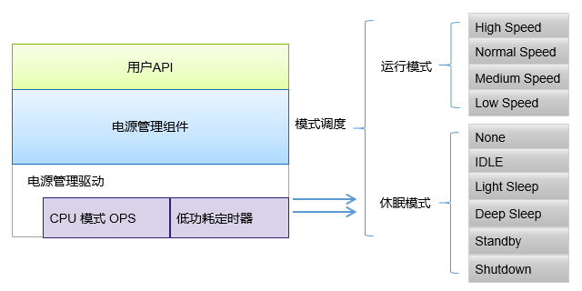
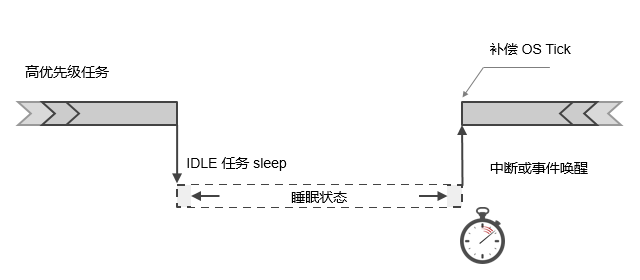
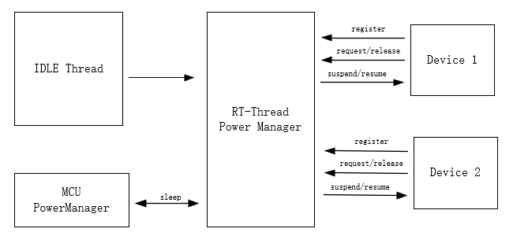
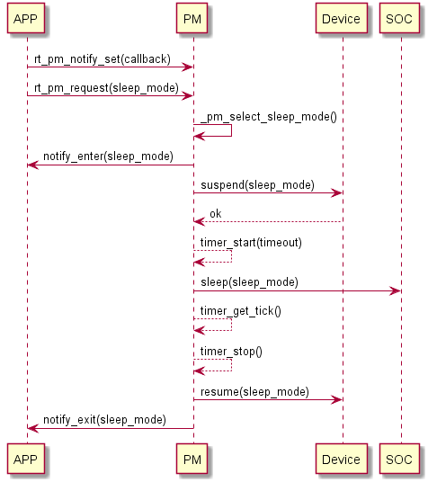

# 电源管理组件

嵌入式系统低功耗管理的目的在于满足用户对性能需求的前提下，尽可能降低系统能耗以延长设备待机时间。高性能与有限的电池能量在嵌入式系统中矛盾最为突出，硬件低功耗设计与软件低功耗管理的联合应用成为解决矛盾的有效手段。现在的各种 MCU 都或多或少的在低功耗方面提供了管理接口。比如对主控时钟频率的调整、工作电压的改变、总线频率的调整甚至关闭、外围设备工作时钟的关闭等。有了硬件上的支持，合理的软件设计就成为节能的关键，一般可以把低功耗管理分为三个类别：

- 处理器电源管理
主要实现方式：对 CPU 频率的动态管理，以及系统空闲时对工作模式的调整。

- 设备电源管理
主要实现方式：关闭个别闲置设备

- 系统平台电源管理
主要实现方式：针对特定系统平台的非常见设备具体定制。

随着物联网 (IoT) 的兴起，产品对功耗的需求越来越强烈。作为数据采集的传感器节点通常需要在电池供电时长期工作，而作为联网的 SOC 也需要有快速的响应功能和较低的功耗。

在产品开发的起始阶段，首先考虑是尽快完成产品的功能开发。在产品功能逐步完善之后，就需要加入电源管理 (Power Management，以下简称 PM) 功能。为了适应 IoT 的这种需求，RT-Thread 提供了电源管理组件。电源管理组件的理念是尽量透明，使得产品加入低功耗功能更加轻松。

## PM 组件介绍

RT-Thread 的 PM 组件采用分层设计思想，分离架构和芯片相关的部分，提取公共部分作为核心。在对上层提供通用的接口同时，也让底层驱动对组件的适配变得更加简单。



### 主要特点

RT-Thread PM 组件主要特点如下所示:

- 基于模式来管理功耗，空闲时动态调整工作模式，支持多个等级的休眠。
- 对应用透明，组件在底层自动完成电源管理。
- 支持运行模式下动态变频，根据模式自动更新设备的频率配置，确保在不同的运行模式都可以正常工作。
- 支持设备电源管理，根据模式自动管理设备的挂起和恢复，确保在不同的休眠模式下可以正确的挂起和恢复。
- 支持可选的休眠时间补偿，让依赖 OS Tick 的应用可以透明使用。
- 向上层提供设备接口，如果打开了 devfs 组件，那么也可以通过文件系统接口访问。

### 工作原理

低功耗的本质是系统空闲时 CPU 停止工作，中断或事件唤醒后继续工作。在 RTOS 中，通常包含一个 IDLE 任务，该任务的优先级最低且一直保持就绪状态，当高优先级任务未就绪时，OS 执行 IDLE 任务。一般地，未进行低功耗处理时，CPU 在 IDLE 任务中循环执行空指令。RT-Thread 的电源管理组件在 IDLE 任务中，通过对 CPU 、时钟和设备等进行管理，从而有效降低系统的功耗。



在上图所示，当高优先级任务运行结束或被挂起时，系统将进入 IDLE 任务中。在 IDLE 任务执行后，它将判断系统是否可以进入到休眠状态（以节省功耗）。如果可以进入休眠，
将根据芯片情况关闭部分硬件模块，OS Tick 也非常有可能进入暂停状态。此时电源管理框架会根据系统定时器情况，计算出下一个超时时间点，并设置低功耗定时器，让设备能够在这个时刻点唤醒，并进行后续的工作。当系统被（低功耗定时器中断或其他唤醒中断源）唤醒后，系统也需要知道睡眠时间长度是多少，并对OS Tick 进行补偿，让系统的OS tick值调整为一个正确的值。

## 设计架构

在 RT-Thread PM 组件中，外设或应用通过投票机制对所需的功耗模式进行投票，当系统空闲时，根据投票数决策出合适的功耗模式，调用抽象接口，控制芯片进入低功耗状态，从而降低系统功耗。当未进行任何投票时，会以默认模式进入(通常为空闲模式)。与应用不同，某些外设可能在进入低功耗状态时执行特定操作，退出低功耗时采取措施恢复，此时可以通过注册PM设备来实现。通过注册 PM 设备，在进入低功耗状态之前，会触发注册设备的 suspend 回调，开发者可在回调里执行自己的操作；类似地，从低功耗状态退出时，也会触发 resume 回调。



## 低功耗状态和模式

RT-Thread PM 组件将系统划分为两种状态:运行状态(RUN)和休眠状态(Sleep)。
运行状态控制 CPU 的频率，适用于变频场景；休眠状态根据 SOC 特性实现休眠 CPU，以降低功耗。两种状态分别使用不同的 API 接口，独立控制。

- 休眠状态

休眠状态也就是通常意义上的低功耗状态，通过关闭外设、执行 SOC 电源管理接口，降低系统功耗。
休眠状态又分为六个模式，呈现为金字塔的形式。随着模式增加，功耗逐级递减的特点。下面是休眠状态下模式的定义，开发者可根据具体的 SOC 实现相应的模式，但需要遵循功耗逐级降低的特点。

| 模式 | 级别 | 描述 |
| -- | -- | -- |
| PM_SLEEP_MODE_NONE | 0 | 系统处于活跃状态，未采取任何的降低功耗状态 |
| PM_SLEEP_MODE_IDLE | 1 | 空闲模式，该模式在系统空闲时停止 CPU 和部分时钟，任意事件或中断均可以唤醒 |
| PM_SLEEP_MODE_LIGHT | 2 | 轻度睡眠模式，CPU 停止，多数时钟和外设停止，唤醒后需要进行时间补偿 |
| PM_SLEEP_MODE_DEEP | 3 | 深度睡眠模式，CPU 停止，仅少数低功耗外设工作，可被特殊中断唤醒 |
| PM_SLEEP_MODE_STANDBY | 4 | 待机模式，CPU 停止，设备上下文丢失(可保存至特殊外设)，唤醒后通常复位 |
| PM_SLEEP_MODE_SHUTDOWN | 5 | 关断模式，比 Standby 模式功耗更低， 上下文通常不可恢复， 唤醒后复位 |

**注意:** 因各家芯片差异，功耗管理的实现也不尽相同，上述的描述仅给出一些推荐的场景，并非一定需要实现所有。开发者可根据自身情况选择其中的几种进行实现，但是需要遵循级别越高，功耗越低的原则！

- 运行状态

运行状态通常用于改变 CPU 的运行频率，独立于休眠模式。当前运行状态划分了四个等级：高速、正常、中速、低速，如下：

| 模式 | 描述 |
| -- | -- |
| PM_RUN_MODE_HIGH_SPEED | 高速模式，适用于一些超频的场景 |
| PM_RUN_MODE_NORMAL_SPEED | 正常模式，该模式作为默认的运行状态 |
| PM_RUN_MODE_MEDIUM_SPEED | 中速模式，降低 CPU 运行速度，从而降低运行功耗 |
| PM_RUN_MODE_LOW_SPEED | 低速模式，CPU 频率进一步降低 |

### 模式的请求和释放

在 PM 组件里，上层应用可以通过请求和释放休眠模式主动参与功耗管理。应用可以根据场景请求不同的休眠模式，并在处理完毕后释放，只要有任意一个应用或设备请求高等级的功耗模式，就不会切换到比它更低的模式。因此，休眠模式的请求和释放的操作通常成对出现，可用于对某个阶段进行保护，如外设的 DMA 传输过程。

### 对模式变化敏感的设备

在 PM 组件里，切换到新的运行模式可能会导致 CPU 频率发生变化，如果外设和 CPU 共用一部分时钟，那外设的时钟就会受到影响；在进入新的休眠模式，大部分时钟源会被停止，如果外设不支持休眠的冻结功能，那么从休眠唤醒的时候，外设的时钟就需要重新配置外设。所以 PM 组件里支持了 PM 模式敏感的 PM 设备。使得设备在切换到新的运行模式或者新的休眠模式都能正常的工作。该功能需要底层驱动实现相关的接口并注册为对模式变化敏感的设备。

## 调用流程



首先应用设置进出休眠状态的回调函数，然后调用 rt_pm_request 请求休眠模式，触发休眠操作；PM 组件在系统空闲时检查休眠模式计数，根据投票数给出推荐的模式；接着 PM 组件调用 notfiy 通知应用，告知即将进入休眠模式；然后对注册的 PM 设备执行挂起操作，返回 OK 后执行 SOC 实现的的休眠模式，系统进入休眠状态（如果使能时间补偿，休眠之前会先启动低功耗定时器）。此时 CPU 停止工作，等待事件或者中断唤醒。当系统被唤醒后，由于全局中断为关闭状态，系统继续从该处执行，获取睡眠时间补偿系统的心跳，依次唤醒设备，通知应用从休眠模式退出。如此一个周期执行完毕，退出，等待系统下次空闲。

## API 介绍

- 请求休眠模式
```c
void rt_pm_request(uint8_t sleep_mode);
```
| 参数 | 模式 |
| -- | -- |
| sleep_mode | 请求的休眠模式等级 |

sleep_mode 取以下枚举值：
```c
enum
{
    /* sleep modes */
    PM_SLEEP_MODE_NONE = 0,    /* 活跃状态 */
    PM_SLEEP_MODE_IDLE,        /* 空闲模式（默认） */
    PM_SLEEP_MODE_LIGHT,       /* 轻度睡眠模式 */
    PM_SLEEP_MODE_DEEP,        /* 深度睡眠模式 */
    PM_SLEEP_MODE_STANDBY,     /* 待机模式 */
    PM_SLEEP_MODE_SHUTDOWN,    /* 关断模式 */
    PM_SLEEP_MODE_MAX,
};
```
调用该函数会将对应的模式计数加1，并锁住该模式。此时如果请求更低级别的功耗模式，将无法进入，只有释放（解锁）先前请求的模式后，系统才能进入更低的模式；向更高的功耗模式请求则不受此影响。该函数需要和 rt_pm_release 配合使用，用于对某一阶段或过程进行保护。

- 释放休眠模式
```c
void rt_pm_release(uint8_t sleep_mode);
```
| 参数 | 模式 |
| -- | -- |
| sleep_mode | 释放的休眠模式等级 |

调用该函数会将对应的模式计数减1，配合 rt_pm_request 使用，释放先前请求的模式。

- 设置运行模式
```c
int rt_pm_run_enter(uint8_t run_mode);
```
| 参数 | 模式 |
| -- | -- |
| run_mode | 设置的运行模式等级 |

run_mode 可以取以下枚举值：
```c
enum
{
    /* run modes*/
    PM_RUN_MODE_HIGH_SPEED = 0,    /* 高速 */
    PM_RUN_MODE_NORMAL_SPEED,      /* 正常（默认） */
    PM_RUN_MODE_MEDIUM_SPEED,      /* 中速 */
    PM_RUN_MODE_LOW_SPEED,         /* 低速 */
    PM_RUN_MODE_MAX,
};
```
调用该函数改变 CPU 的运行频率，从而降低运行时的功耗。此函数只提供级别，具体的 CPU 频率应在移植阶段视实际情况而定。

- 设置进入/退出休眠模式的回调通知
```c
void rt_pm_notify_set(void (*notify)(uint8_t event, uint8_t mode, void *data), void *data);
```
| 参数 | 模式 |
| -- | -- |
| notify | 应用的回调函数 |
| data | 私有数据 |

event 为以下两个枚举值，分别标识进入/退出休眠模式。
```c
enum
{
    RT_PM_ENTER_SLEEP = 0,    /* 进入休眠模式 */
    RT_PM_EXIT_SLEEP,         /* 退出休眠模式 */
};

```

## 使用说明

- 设置低功耗等级

如果系统需要进入指定指定等级的低功耗，可通过调用 rt_pm_request 实现。如进入深度睡眠模式:
```c
/* 请求进入深度睡眠模式 */
rt_pm_request(PM_SLEEP_MODE_DEEP);
```
**注意:** 如果程序的其他地方请求了更高的功耗模式，如 Light Mode 或者 Idle Mode，则需要释放相应的模式后，深度睡眠模式才能被进入。

- 保护某个阶段或者过程

特殊情况下，比如某个阶段并不允许系统进入更低的功耗模式，此时可以通过 rt_pm_request 和 rt_pm_release 对该过程进行保护。如 I2C 读取数据期间，不允许进入深度睡眠模式(可能会导致外设停止工作)，因此可以做如下处理:
```c
/* 请求轻度睡眠模式(I2C外设该模式下正常工作) */
rt_pm_request(PM_SLEEP_MODE_LIGHT);

/* 读取数据过程 */

/* 释放该模式 */
rt_pm_release(PM_SLEEP_MODE_LIGHT);

```

- 改变 CPU 运行频率

降低运行频率能有效减少系统的功耗，通过 rt_pm_run_enter 接口改变 CPU 的运行频率。一般地，降频率意味着 CPU 性能降低、处理速度减慢，可能会导致任务的执行时间增长，需要合理进行权衡。

```c
/* 进入中等速度运行模式 */
rt_pm_run_enter(PM_RUN_MODE_MEDIUM_SPEED);
```

## 移植说明

低功耗管理是一项十分细致的任务，开发者在移植时，不仅需要充分了解芯片本身的功耗管理，还需熟悉板卡的外围电路，进入低功耗状态时逐一处理，避免出现外围电路漏电拉升整体功耗的情况。RT-Thread PM 组件对各部分进行抽象，提供不同的 ops 接口供开发者适配。移植时需要关注的部分如下:

```c
/**
 * low power mode operations
 */
struct rt_pm_ops
{
    /* sleep 接口用于适配芯片相关的低功耗特性 */
    void (*sleep)(struct rt_pm *pm, uint8_t mode);
    /* run 接口用于运行模式的变频和变电压 */
    void (*run)(struct rt_pm *pm, uint8_t mode);
    /* 以下三个接口用于心跳停止后启动低功耗定时器以补偿心跳 */
    void (*timer_start)(struct rt_pm *pm, rt_uint32_t timeout);
    void (*timer_stop)(struct rt_pm *pm);
    rt_tick_t (*timer_get_tick)(struct rt_pm *pm);
};

/* 该 ops 用于管理外设的功耗 */
struct rt_device_pm_ops
{
    /* 进入休眠模式之前挂起外设，返回非 0 表示外设未就绪，不能进入 */
    int (*suspend)(const struct rt_device *device, uint8_t mode);
    /* 从休眠模式退出后恢复外设 */
    void (*resume)(const struct rt_device *device, uint8_t mode);
    /* 运行状态下模式改变通知外设处理 */
    int (*frequency_change)(const struct rt_device *device, uint8_t mode);
};

/* 注册一个 PM 设备 */
void rt_pm_device_register(struct rt_device *device, const struct rt_device_pm_ops *ops);
```

- 芯片自身的功耗特性
```c
void (*sleep)(struct rt_pm *pm, uint8_t mode);
```
各个芯片对低功耗模式的定义和管理不同，PM 组件将芯片相关的特性抽象为 sleep 接口。该接口适配芯片相关的低功耗管理，当要进入不同的休眠模式时，一些硬件相关的配置，保存等相关处理。

- 休眠的时间补偿

```c
void (*timer_start)(struct rt_pm *pm, rt_uint32_t timeout);
void (*timer_stop)(struct rt_pm *pm);
rt_tick_t (*timer_get_tick)(struct rt_pm *pm);
```

在某些休眠模式下(Light Sleep 或 Deep Sleep)，内核心跳定时器可能会被停止，此时需要对启动一个定时器对休眠的时间进行计量，唤醒后对心跳补偿。时间补偿的定时器必须在该模式下仍能够正常工作，并唤醒系统，否则没有意义！

`timer_start` ：启动低功耗定时器，入参为最近的下次任务就绪时间；
`timer_get_tick` ：获取系统被唤醒的睡眠时间；
`timer_stop` ：用于系统唤醒后停止低功耗定时器。

**注意**：休眠模式的时间补偿需要在初始化阶段通过设置 timer_mask 的对应模式的 bit 控制开启。例如需要开启 Deep Sleep 模式下的时间补偿，在实现 timer 相关的 ops 接口后，初始化时设置相应的bit：

```c
rt_uint8_t timer_mask = 0;

/* 设置 Deep Sleep 模式对应的 bit，使能休眠时间补偿 */
timer_mask = 1UL << PM_SLEEP_MODE_DEEP;

/* initialize system pm module */
rt_system_pm_init(&_ops, timer_mask, RT_NULL);
```

- 运行模式变频

```
void (*run)(struct rt_pm *pm, uint8_t mode);
```
运行模式的变频通过适配 rt_pm_ops 中的 run 接口实现，根据使用场景选择合适的频率。

- 外设的功耗管理

外设的功耗处理是低功耗管理系统的一个重要部分，在进入某些级别的休眠模式时，通常需要对一些外设进行处理，如清空 DMA，关闭时钟或是设置 IO 为复位状态；并在退出休眠后进行恢复。
此类情况可以通过 `rt_pm_device_register` 接口注册 PM 设备，在进入/退出休眠模式时，会执行注册设备的 `suspend` 和 `resume` 回调；运行模式下的频率改变同样会触发设备的 `frequency_change` 回调。

更详细的移植案例可以参考 RT-Thread 仓库中的 stm32l476-nucleo bsp。

## MSH 命令

### 请求休眠模式

可以使用 `pm_request` 命令请求模式，使用示例如下所示：

```c
msh />pm_request 0
msh />
```

参数取值为 0-5，分别对应以下枚举值：

```c
enum
{
    /* sleep modes */
    PM_SLEEP_MODE_NONE = 0,    /* 活跃状态 */
    PM_SLEEP_MODE_IDLE,        /* 空闲模式（默认） */
    PM_SLEEP_MODE_LIGHT,       /* 轻度睡眠模式 */
    PM_SLEEP_MODE_DEEP,        /* 深度睡眠模式 */
    PM_SLEEP_MODE_STANDBY,     /* 待机模式 */
    PM_SLEEP_MODE_SHUTDOWN,    /* 关断模式 */
    PM_SLEEP_MODE_MAX,
};
```

### 释放休眠模式

可以使用 `pm_release` 命令释放模式，参数取值为 0-5，使用示例如下所示：

```c
msh />pm_release 0
msh />
```

### 设置运行模式

可以使用 `pm_run` 命令切换运行模式，参数取值 0-3，使用示例如下所示
```c
msh />pm_run 2
msh />
```
参数取值 0-3
```
enum
{
    /* run modes*/
    PM_RUN_MODE_HIGH_SPEED = 0,
    PM_RUN_MODE_NORMAL_SPEED,
    PM_RUN_MODE_MEDIUM_SPEED,
    PM_RUN_MODE_LOW_SPEED,
    PM_RUN_MODE_MAX,
};
```
### 查看模式状态

可以使用 `pm_dump` 命令查看 PM 组件的模式状态，使用示例如下所示：

```c
msh >
msh >pm_dump
| Power Management Mode | Counter | Timer |
+-----------------------+---------+-------+
|             None Mode |       0 |     0 |
|             Idle Mode |       0 |     0 |
|       LightSleep Mode |       1 |     0 |
|        DeepSleep Mode |       0 |     1 |
|          Standby Mode |       0 |     0 |
|         Shutdown Mode |       0 |     0 |
+-----------------------+---------+-------+
pm current sleep mode: LightSleep Mode
pm current run mode:   Normal Speed
msh >
```

在 `pm_dump` 的模式列表里，休眠模式的优先级是从高到低排列，`Counter` 一栏标识请求的计数值，图中表明 LightSleep 模式被请求一次，因此当前工作在轻度休眠状态；`Timer`
 一栏标识是否开启睡眠时间补偿，图中仅深度睡眠(DeepSleep)模式进行时间补偿。
最下面分别标识当前所处的休眠模式及运行模式等级。

## 常见问题及调试方法

- 系统进入低功耗模式后功耗偏高

根据外围电路，检查设备是否处于合理状态，避免出现外设漏电的情况；
根据产品自身情况，关闭相应休眠模式期间不使用的外设和时钟。

- 无法进入更低等级的功耗

检查是否未释放高等级的功耗模式，RT-Thread 的 PM 组件使用 `rt_pm_request` 请求休眠模式，当请求高功耗模式后，未进行释放，系统将无法切换至更低等级的功耗。例如，在请求 Light Sleep 模式后，接着请求 Deep Sleep 模式，此时系统仍然处于  Light Sleep 模式。通过调用接口 `rt_pm_release` 释放 Light Sleep 模式，系统会自动切换到 Deep Sleep 模式。
