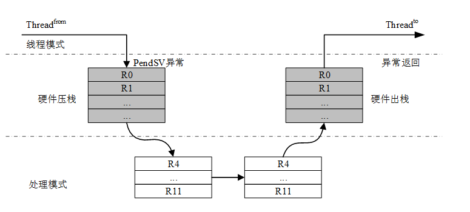
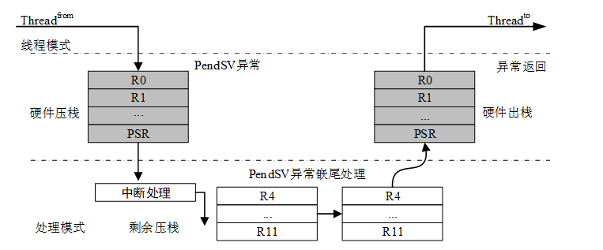
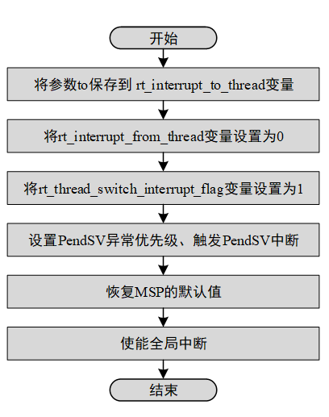
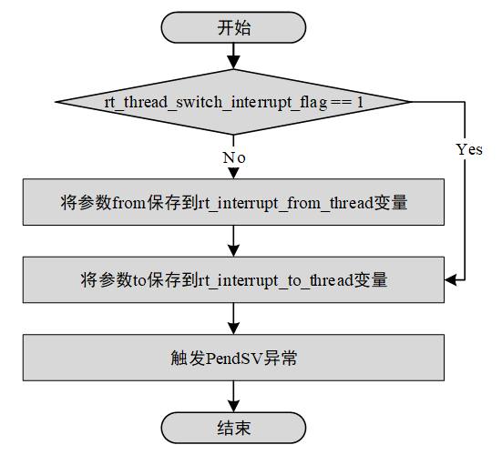
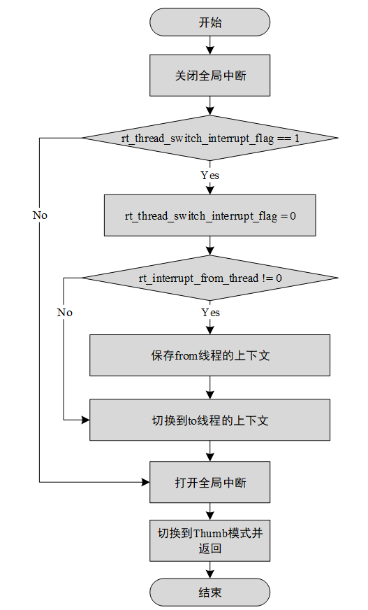

# 内核移植

经过前面内核章节的学习，大家对 RT-Thread 也有了不少的了解，但是如何将 RT-Thread 内核移植到不同的硬件平台上，很多人还不一定熟悉。内核移植就是指将 RT-Thread 内核在不同的芯片架构、不同的板卡上运行起来，能够具备线程管理和调度，内存管理，线程间同步和通信、定时器管理等功能。移植可分为 CPU 架构移植和 BSP（Board support package，板级支持包）移植两部分。

本章将展开介绍 CPU 架构移植和 BSP 移植，CPU 架构移植部分会结合 Cortex-M CPU 架构进行介绍，因此有必要回顾下上一章[《中断管理》](../interrupt/interrupt.md)介绍的 “Cortex-M CPU 架构基础” 的内容，本章最后以实际移植到一个开发板的示例展示 RT-Thread 内核移植的完整过程，读完本章，我们将了解如何完成 RT-Thread 的内核移植。

## CPU 架构移植

在嵌入式领域有多种不同 CPU 架构，例如 Cortex-M、ARM920T、MIPS32、RISC-V 等等。为了使 RT-Thread 能够在不同 CPU 架构的芯片上运行，RT-Thread 提供了一个 libcpu 抽象层来适配不同的 CPU 架构。libcpu 层向上对内核提供统一的接口，包括全局中断的开关，线程栈的初始化，上下文切换等。

RT-Thread 的 libcpu 抽象层向下提供了一套统一的 CPU 架构移植接口，这部分接口包含了全局中断开关函数、线程上下文切换函数、时钟节拍的配置和中断函数、Cache 等等内容。下表是 CPU 架构移植需要实现的接口和变量。

 libcpu 移植相关 API

|**函数和变量**                                                                                        |**描述**                                                                          |
|--------------------------------------------------------------------------------------------------------|------------------------------------------------------------------------------------|
| rt_base_t rt_hw_interrupt_disable(void);                                                               | 关闭全局中断                                                                       |
| void rt_hw_interrupt_enable(rt_base_t level);                                                          | 打开全局中断                                                                       |
| rt_uint8_t \*rt_hw_stack_init(void \*tentry, void \*parameter, rt_uint8_t \*stack_addr, void \*texit); | 线程栈的初始化，内核在线程创建和线程初始化里面会调用这个函数                       |
| void rt_hw_context_switch_to(rt_uint32_t to);                                                            | 没有来源线程的上下文切换，在调度器启动第一个线程的时候调用，以及在 signal 里面会调用 |
| void rt_hw_context_switch(rt_uint32_t from, rt_uint32_t to);                                               | 从 from 线程切换到 to 线程，用于线程和线程之间的切换                                   |
| void rt_hw_context_switch_interrupt(rt_uint32_t from, rt_uint32_t to);                                     | 从 from 线程切换到 to 线程，用于中断里面进行切换的时候使用                             |
| rt_uint32_t rt_thread_switch_interrupt_flag;                                                           | 表示需要在中断里进行切换的标志                                                     |
| rt_uint32_t rt_interrupt_from_thread, rt_interrupt_to_thread;                                          | 在线程进行上下文切换时候，用来保存 from 和 to 线程                                     |

### 实现全局中断开关

无论内核代码还是用户的代码，都可能存在一些变量，需要在多个线程或者中断里面使用，如果没有相应的保护机制，那就可能导致临界区问题。RT-Thread 里为了解决这个问题，提供了一系列的线程间同步和通信机制来解决。但是这些机制都需要用到 libcpu 里提供的全局中断开关函数。它们分别是：

```c
/* 关闭全局中断 */
rt_base_t rt_hw_interrupt_disable(void);

/* 打开全局中断 */
void rt_hw_interrupt_enable(rt_base_t level);
```

下面介绍在 Cortex-M 架构上如何实现这两个函数，前文中曾提到过，Cortex-M 为了快速开关中断，实现了 CPS 指令，可以用在此处。

```c
CPSID I ;PRIMASK=1， ; 关中断
CPSIE I ;PRIMASK=0， ; 开中断
```

#### 关闭全局中断

在 rt_hw_interrupt_disable() 函数里面需要依序完成的功能是：

1）.  保存当前的全局中断状态，并把状态作为函数的返回值。

2）.  关闭全局中断。

基于 MDK，在 Cortex-M 内核上实现关闭全局中断，如下代码所示：

 关闭全局中断

```c
;/*
; * rt_base_t rt_hw_interrupt_disable(void);
; */
rt_hw_interrupt_disable    PROC      ;PROC 伪指令定义函数
    EXPORT  rt_hw_interrupt_disable  ;EXPORT 输出定义的函数，类似于 C 语言 extern
    MRS     r0, PRIMASK              ; 读取 PRIMASK 寄存器的值到 r0 寄存器
    CPSID   I                        ; 关闭全局中断
    BX      LR                       ; 函数返回
    ENDP                             ;ENDP 函数结束
```

上面的代码首先是使用 MRS 指令将 PRIMASK 寄存器的值保存到 r0 寄存器里，然后使用 “CPSID I” 指令关闭全局中断，最后使用 BX 指令返回。r0 存储的数据就是函数的返回值。中断可以发生在 “MRS r0, PRIMASK” 指令和 “CPSID I” 之间，这并不会导致全局中断状态的错乱。

关于寄存器在函数调用的时候和在中断处理程序里是如何管理的，不同的 CPU 架构有不同的约定。在 ARM 官方手册《Procedure Call Standard for the ARM ® Architecture》里可以找到关于 Cortex-M 的更详细的介绍寄存器使用的约定。

#### 打开全局中断

在 rt_hw_interrupt_enable(rt_base_t level) 里，将变量 level 作为需要恢复的状态，覆盖芯片的全局中断状态。

基于 MDK，在 Cortex-M 内核上的实现打开全局中断，如下代码所示：

 打开全局中断

```c
;/*
; * void rt_hw_interrupt_enable(rt_base_t level);
; */
rt_hw_interrupt_enable    PROC      ; PROC 伪指令定义函数
    EXPORT  rt_hw_interrupt_enable  ; EXPORT 输出定义的函数，类似于 C 语言 extern
    MSR     PRIMASK, r0             ; 将 r0 寄存器的值写入到 PRIMASK 寄存器
    BX      LR                      ; 函数返回
    ENDP                            ; ENDP 函数结束
```

上面的代码首先是使用 MSR 指令将 r0 的值寄存器写入到 PRIMASK 寄存器，从而恢复之前的中断状态。

### 实现线程栈初始化

在动态创建线程和初始化线程的时候，会使用到内部的线程初始化函数_rt_thread_init()，_rt_thread_init() 函数会调用栈初始化函数 rt_hw_stack_init()，在栈初始化函数里会手动构造一个上下文内容，这个上下文内容将被作为每个线程第一次执行的初始值。上下文在栈里的排布如下图所示：


下代码是栈初始化的代码：

 在栈里构建上下文

```c
rt_uint8_t *rt_hw_stack_init(void       *tentry,
                             void       *parameter,
                             rt_uint8_t *stack_addr,
                             void       *texit)
{
    struct stack_frame *stack_frame;
    rt_uint8_t         *stk;
    unsigned long       i;

    /* 对传入的栈指针做对齐处理 */
    stk  = stack_addr + sizeof(rt_uint32_t);
    stk  = (rt_uint8_t *)RT_ALIGN_DOWN((rt_uint32_t)stk, 8);
    stk -= sizeof(struct stack_frame);

    /* 得到上下文的栈帧的指针 */
    stack_frame = (struct stack_frame *)stk;

    /* 把所有寄存器的默认值设置为 0xdeadbeef */
    for (i = 0; i < sizeof(struct stack_frame) / sizeof(rt_uint32_t); i ++)
    {
        ((rt_uint32_t *)stack_frame)[i] = 0xdeadbeef;
    }

    /* 根据 ARM  APCS 调用标准，将第一个参数保存在 r0 寄存器 */
    stack_frame->exception_stack_frame.r0  = (unsigned long)parameter;
    /* 将剩下的参数寄存器都设置为 0 */
    stack_frame->exception_stack_frame.r1  = 0;                 /* r1 寄存器 */
    stack_frame->exception_stack_frame.r2  = 0;                 /* r2 寄存器 */
    stack_frame->exception_stack_frame.r3  = 0;                 /* r3 寄存器 */
    /* 将 IP(Intra-Procedure-call scratch register.) 设置为 0 */
    stack_frame->exception_stack_frame.r12 = 0;                 /* r12 寄存器 */
    /* 将线程退出函数的地址保存在 lr 寄存器 */
    stack_frame->exception_stack_frame.lr  = (unsigned long)texit;
    /* 将线程入口函数的地址保存在 pc 寄存器 */
    stack_frame->exception_stack_frame.pc  = (unsigned long)tentry;
    /* 设置 psr 的值为 0x01000000L，表示默认切换过去是 Thumb 模式 */
    stack_frame->exception_stack_frame.psr = 0x01000000L;

    /* 返回当前线程的栈地址       */
    return stk;
}
```

### 实现上下文切换

在不同的 CPU 架构里，线程之间的上下文切换和中断到线程的上下文切换，上下文的寄存器部分可能是有差异的，也可能是一样的。在 Cortex-M 里面上下文切换都是统一使用 PendSV 异常来完成，切换部分并没有差异。但是为了能适应不同的 CPU 架构，RT-Thread 的 libcpu 抽象层还是需要实现三个线程切换相关的函数：

1）  rt_hw_context_switch_to()：没有来源线程，切换到目标线程，在调度器启动第一个线程的时候被调用。

2）  rt_hw_context_switch()：在线程环境下，从当前线程切换到目标线程。

3）  rt_hw_context_switch_interrupt ()：在中断环境下，从当前线程切换到目标线程。

在线程环境下进行切换和在中断环境进行切换是存在差异的。线程环境下，如果调用 rt_hw_context_switch() 函数，那么可以马上进行上下文切换；而在中断环境下，需要等待中断处理函数完成之后才能进行切换。

由于这种差异，在 ARM9 等平台，rt_hw_context_switch() 和 rt_hw_context_switch_interrupt() 的实现并不一样。在中断处理程序里如果触发了线程的调度，调度函数里会调用 rt_hw_context_switch_interrupt() 触发上下文切换。中断处理程序里处理完中断事务之后，中断退出之前，检查 rt_thread_switch_interrupt_flag 变量，如果该变量的值为 1，就根据 rt_interrupt_from_thread 变量和 rt_interrupt_to_thread 变量，完成线程的上下文切换。

在 Cortex-M 处理器架构里，基于自动部分压栈和 PendSV 的特性，上下文切换可以实现地更加简洁。

线程之间的上下文切换，如下图表示：



硬件在进入 PendSV 中断之前自动保存了 from 线程的 PSR、PC、LR、R12、R3-R0 寄存器，然后 PendSV 里保存 from 线程的 R11\~R4 寄存器，以及恢复 to 线程的 R4\~R11 寄存器，最后硬件在退出 PendSV 中断之后，自动恢复 to 线程的 R0\~R3、R12、LR、PC、PSR 寄存器。

中断到线程的上下文切换可以用下图表示：



硬件在进入中断之前自动保存了 from 线程的 PSR、PC、LR、R12、R3-R0 寄存器，然后触发了 PendSV 异常。在 PendSV 异常处理函数里保存 from 线程的 R11\~R4 寄存器，以及恢复 to 线程的 R4\~R11 寄存器，最后硬件在退出 PendSV 中断之后，自动恢复 to 线程的 R0\~R3、R12、PSR、PC、LR 寄存器。

显然，在 Cortex-M 内核里 rt_hw_context_switch() 和 rt_hw_context_switch_interrupt() 功能一致，都是在 PendSV 里完成剩余上下文的保存和回复。所以我们仅仅需要实现一份代码，简化移植的工作。

#### 实现 rt_hw_context_switch_to()

rt_hw_context_switch_to() 只有目标线程，没有来源线程。这个函数里实现切换到指定线程的功能，下图是流程图：



在 Cortex-M3 内核上的 rt_hw_context_switch_to() 实现（基于 MDK），如下代码所示：

 MDK 版 rt_hw_context_switch_to() 实现

```c
;/*
; * void rt_hw_context_switch_to(rt_uint32_t to);
; * r0 --> to
; * this fucntion is used to perform the first thread switch
; */
rt_hw_context_switch_to    PROC
    EXPORT rt_hw_context_switch_to
    ; r0 的值是一个指针，该指针指向 to 线程的线程控制块的 SP 成员
    ; 将 r0 寄存器的值保存到 rt_interrupt_to_thread 变量里
    LDR     r1, =rt_interrupt_to_thread
    STR     r0, [r1]

    ; 设置 from 线程为空，表示不需要从保存 from 的上下文
    LDR     r1, =rt_interrupt_from_thread
    MOV     r0, #0x0
    STR     r0, [r1]

    ; 设置标志为 1，表示需要切换，这个变量将在 PendSV 异常处理函数里切换的时被清零
    LDR     r1, =rt_thread_switch_interrupt_flag
    MOV     r0, #1
    STR     r0, [r1]

    ; 设置 PendSV 异常优先级为最低优先级
    LDR     r0, =NVIC_SYSPRI2
    LDR     r1, =NVIC_PENDSV_PRI
    LDR.W   r2, [r0,#0x00]       ; read
    ORR     r1,r1,r2             ; modify
    STR     r1, [r0]             ; write-back

    ; 触发 PendSV 异常 (将执行 PendSV 异常处理程序)
    LDR     r0, =NVIC_INT_CTRL
    LDR     r1, =NVIC_PENDSVSET
    STR     r1, [r0]

    ; 放弃芯片启动到第一次上下文切换之前的栈内容，将 MSP 设置启动时的值
    LDR     r0, =SCB_VTOR
    LDR     r0, [r0]
    LDR     r0, [r0]
    MSR     msp, r0

    ; 使能全局中断和全局异常，使能之后将进入 PendSV 异常处理函数
    CPSIE   F
    CPSIE   I

    ; 不会执行到这里
    ENDP
```

#### 实现 rt_hw_context_switch()/ rt_hw_context_switch_interrupt()

函数 rt_hw_context_switch() 和函数 rt_hw_context_switch_interrupt() 都有两个参数，分别是 from 线程和 to 线程。它们实现从 from 线程切换到 to 线程的功能。下图是具体的流程图：



在 Cortex-M3 内核上的 rt_hw_context_switch() 和 rt_hw_context_switch_interrupt() 实现（基于 MDK），如下代码的所示：

 rt_hw_context_switch()/rt_hw_context_switch_interrupt() 实现

```c
;/*
; * void rt_hw_context_switch(rt_uint32_t from, rt_uint32_t to);
; * r0 --> from
; * r1 --> to
; */
rt_hw_context_switch_interrupt
    EXPORT rt_hw_context_switch_interrupt
rt_hw_context_switch    PROC
    EXPORT rt_hw_context_switch

    ; 检查 rt_thread_switch_interrupt_flag 变量是否为 1
    ; 如果变量为 1 就跳过更新 from 线程的内容
    LDR     r2, =rt_thread_switch_interrupt_flag
    LDR     r3, [r2]
    CMP     r3, #1
    BEQ     _reswitch
    ; 设置 rt_thread_switch_interrupt_flag 变量为 1
    MOV     r3, #1
    STR     r3, [r2]

    ; 从参数 r0 里更新 rt_interrupt_from_thread 变量
    LDR     r2, =rt_interrupt_from_thread
    STR     r0, [r2]

_reswitch
    ; 从参数 r1 里更新 rt_interrupt_to_thread 变量
    LDR     r2, =rt_interrupt_to_thread
    STR     r1, [r2]

    ; 触发 PendSV 异常，将进入 PendSV 异常处理函数里完成上下文切换
    LDR     r0, =NVIC_INT_CTRL
    LDR     r1, =NVIC_PENDSVSET
    STR     r1, [r0]
    BX      LR
```

#### 实现 PendSV 中断

在 Cortex-M3 里，PendSV 中断处理函数是 PendSV_Handler()。在 PendSV_Handler() 里完成线程切换的实际工作，下图是具体的流程图：



如下代码是 PendSV_Handler 实现：

```c
; r0 --> switch from thread stack
; r1 --> switch to thread stack
; psr, pc, lr, r12, r3, r2, r1, r0 are pushed into [from] stack
PendSV_Handler   PROC
    EXPORT PendSV_Handler

    ; 关闭全局中断
    MRS     r2, PRIMASK
    CPSID   I

    ; 检查 rt_thread_switch_interrupt_flag 变量是否为 0
    ; 如果为零就跳转到 pendsv_exit
    LDR     r0, =rt_thread_switch_interrupt_flag
    LDR     r1, [r0]
    CBZ     r1, pendsv_exit         ; pendsv already handled

    ; 清零 rt_thread_switch_interrupt_flag 变量
    MOV     r1, #0x00
    STR     r1, [r0]

    ; 检查 rt_thread_switch_interrupt_flag 变量
    ; 如果为 0，就不进行 from 线程的上下文保存
    LDR     r0, =rt_interrupt_from_thread
    LDR     r1, [r0]
    CBZ     r1, switch_to_thread

    ; 保存 from 线程的上下文
    MRS     r1, psp                 ; 获取 from 线程的栈指针
    STMFD   r1!, {r4 - r11}       ; 将 r4~r11 保存到线程的栈里
    LDR     r0, [r0]
    STR     r1, [r0]                ; 更新线程的控制块的 SP 指针

switch_to_thread
    LDR     r1, =rt_interrupt_to_thread
    LDR     r1, [r1]
    LDR     r1, [r1]                ; 获取 to 线程的栈指针

    LDMFD   r1!, {r4 - r11}       ; 从 to 线程的栈里恢复 to 线程的寄存器值
    MSR     psp, r1                 ; 更新 r1 的值到 psp

pendsv_exit
    ; 恢复全局中断状态
    MSR     PRIMASK, r2

    ; 修改 lr 寄存器的 bit2，确保进程使用 PSP 堆栈指针
    ORR     lr, lr, #0x04
    ; 退出中断函数
    BX      lr
    ENDP
```

### 实现时钟节拍

有了开关全局中断和上下文切换功能的基础，RTOS 就可以进行线程的创建、运行、调度等功能了。有了时钟节拍支持，RT-Thread 可以实现对相同优先级的线程采用时间片轮转的方式来调度，实现定时器功能，实现 rt_thread_delay() 延时函数等等。

libcpu 的移植需要完成的工作，就是确保 rt_tick_increase() 函数会在时钟节拍的中断里被周期性的调用，调用周期取决于 rtconfig.h 的宏 RT_TICK_PER_SECOND 的值。

在 Cortex M 中，实现 SysTick 的中断处理函数即可实现时钟节拍功能。

```c
void SysTick_Handler(void)
{
    /* enter interrupt */
    rt_interrupt_enter();

    rt_tick_increase();

    /* leave interrupt */
    rt_interrupt_leave();
}
```

BSP 移植
-------

相同的 CPU 架构在实际项目中，不同的板卡上可能使用相同的 CPU 架构，搭载不同的外设资源，完成不同的产品，所以我们也需要针对板卡做适配工作。RT-Thread 提供了 BSP 抽象层来适配常见的板卡。如果希望在一个板卡上使用 RT-Thread 内核，除了需要有相应的芯片架构的移植，还需要有针对板卡的移植，也就是实现一个基本的 BSP。主要任务是建立让操作系统运行的基本环境，需要完成的主要工作是：

1）初始化 CPU 内部寄存器，设定 RAM 工作时序。

2）实现时钟驱动及中断控制器驱动，完善中断管理。

3）实现串口和 GPIO 驱动。

4）初始化动态内存堆，实现动态堆内存管理。


