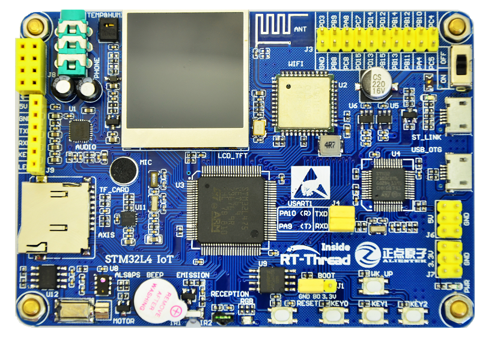
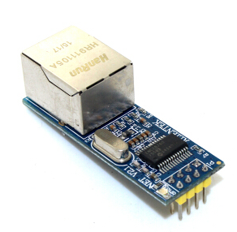
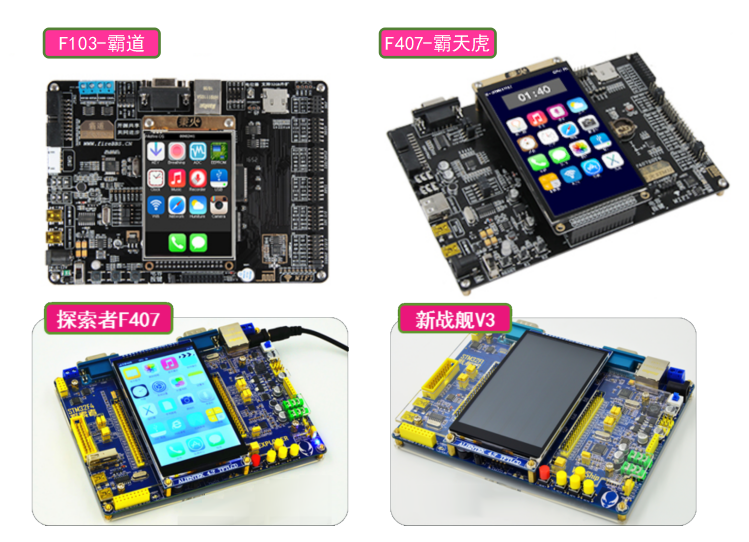

前 言
=====

为什么要写这本书
----------------

自2006年发布V0.01版起，到今年正式发布V4.0版，RT-Thread历经12年的累积发展，凭借良好的口碑和开源免费的策略，已经拥有了一个国内最大的嵌入式开源社区，积聚了数十万的软件爱好者。RT-Thread被广泛应用于能源、车载、医疗、消费电子等众多行业，成为国人自主开发、最成熟稳定和装机量最大的开源嵌入式操作系统。

深处于行业中，我们深刻地感受到近年来国内芯片产业和物联网产业快速崛起的趋势，行业发展迫切需要更多人才，尤其是需要掌握嵌入式操作系统等底层技术人才，我们希望通过本书让RT-Thread触达更多人群，让更多人了解集聚国人智慧的RT-Thread这一小而美的操作系统，从而让RT-Thread赋能更多行业，真正做到“积识成睿，慧泽百川”。

另外，高校大学生是RT-Thread非常重视的群体，从2018年起，RT-Thread启动一系列大学生计划，包括送书计划、培训计划、合作开课、赞助竞赛等，帮助学生了解、学习RT-Thread，在编写本书过程中，尽可能做到简单、易懂，能够让大学生轻松上手RT-Thread，希望通过本书能够加速RT-Thread在高校普及。

总之，本书初衷在于降低RT-Thread的学习门槛，让更多人能轻松学习RT-Thread，掌握RT-Thread，从而能够一起参与开发RT-Thread，共同打造开源开放、小而美物联网操作系统。

读者对象
--------

-   所有使用C/C++进行编程的开发人员

-   高校计算机/电子/自动化/通信类专业学生、老师

-   嵌入式软硬件工程师、电子工程师、物联网开发工程师

-   其他对嵌入式操作系统感兴趣人员

如何阅读本书
------------

为了能够阅读本书，建议先学习C语言和STM32编程知识，如果有数据结构和面向对象编程基础则更佳。学习本书时，大多数章节都有配套示例代码，这些代码都可以实际运行，建议按照边阅读边实战的方式进行学习，读完一章的同时完成该章示例实验。

本书分为两大部分，共16章，第1-10章为内核篇；第11-16章为组件篇。

第1-9章介绍RT-Thread内核，首先对RT-Thread进行总体介绍，在随后各个章节中分别介绍RT-Thread的线程管理、时钟管理、线程间同步、线程间通信、内存管理、中断管理，每章都有配套的示例代码，这部分示例可运行在Keil MDK模拟器环境下，不需要任何硬件。

第10章介绍RT-Thread内核移植，读完本章，可以将RT-Thread移植到实际的硬件板上运行。

第11-16章介绍RT-Thread组件部分，分别介绍Env开发环境、FinSH控制台、设备管理、文件系统和网络框架，这部分配套示例可以运行在硬件板上，分别完成外设访问，文件系统读写，网络通信功能。

本书配套资料包括实验源码及相关工具软件，硬件资料，可以通过关注微信公众号“RTThread物联网操作系统”获得。

配套硬件
--------

本书配套硬件为RT-Thread与正点原子联合开发的IoT
Board开发板，基于STM32L475主芯片，本书组件篇配套的示例代码都基于IoT Board。

本书第16章需要使用到如下图所示的ENC28J60模块实现网络示例功能。

如果已经购买其他开发板，如下图所示的野火和正点原子开发板，也可以配合本书籍进行学习，前提是根据第10章介绍完成RT-Thread内核在开发板上的移植，然后实现相关的外设驱动。

勘误和支持
----------

由于作者水平有限，编写时间仓促，书中难免会出现一些错误或者不准确的地方，恳请读者到论坛发帖指正，RT-Thread官方论坛地址：https://www.rt-thread.org/qa/。在学习过程中遇到任何问题，也可以发帖交流，期待能够得到你们的真挚反馈，在技术之路上互勉共进。

