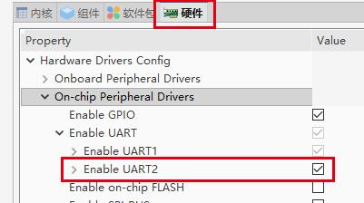

# RT-Link 介绍

RT-Link 是一套开放的链路层传输协议，设计的初衷是为了稳定、安全、高效率的完成设备间 点对点 的数据传输，并且接口简单、使用便捷。

**目录结构:**

```shell
rtthread
└───components
    └───utilities
        └───rt-link
            ├───inc        // 头文件
            ├───src        // rtlink源码文件
            ├───Kconfig
            └───SConscript
```

**功能特点:**

- **稳定**：RT-Link 具有 数据重传、帧序号检查、状态同步等一系列能力，保证传输的稳定；
- **安全**：支持 CRC 校验，采用以太网检验协议；
- **高效**：协议头十分精简，只有 4 Byte，并且每一个 bit 位都有实际意义；
- **开放**：对下具有统一的操作API，可支持多种底层硬件接口，如UART、SPI、USB；
- **使用便捷**：API 简洁，可以很方便的将 RT-Link 接入现有的应用中，具有很好的可移植性和兼容性。

# 工作原理

## 整体框架:


- 最上层是 **service 服务层**，支持多种服务同时运行在一个设备，且底层使用的是同一个数据通信端口；
- 第二层是 **rt-link 传输层**，是 rt-link 核心功能的实现，用来保证数据传输功能的可靠稳定；
- 第三层是 **rt-link_hw 端口对接层**，是用来对接底层的数据传输端口；
- 最下层是设备的**传输端口层**，是实际传输数据的通信端口，例如 UART、SPI、Network 等。

## service 概念介绍

在 rt-link 中可以有多种 service(服务) 同时存在，对于上层应用来说每种 service 代表了一个传输通道，service 之间可以没有任何关联。每个 service 都有一个独立的结构体对象，为了便于理解这里仅仅列出 service 结构体对象及相关的参数定义，其他内容可在 `rt-link.h` 头文件中查看。相关属性如下：

```c
/* service 结构体对象 */
struct rt_link_service
{
    /* 发送超时时间 */
    rt_int32_t timeout_tx;	
    /* 发送结果回调 */
    void (*send_cb)(struct rt_link_service *service, void *buffer);	 
    /* 数据接收回调 */
    void (*recv_cb)(struct rt_link_service *service, void *data, rt_size_t size); 
    void *user_data;

    rt_uint8_t flag;             /* 传输质量标志：是否使用 CRC 和 ACK */ 
    rt_link_service_e service;	 /* service 类型标识 */ 
    rt_link_linkstate_e state;   /* 通道链接状态 */ 
    rt_link_err_e err;	         /* 错误码 */
};
```

**timeout_tx 阻塞/非阻塞发送**

rt-link 提供**阻塞发送**和**非阻塞发送**两种数据发送方式，timeout_tx 可在初始化时使用 `RT_WAITING_FOREVER` （阻塞）或 `RT_WAITING_NO` （非阻塞）进行配置。

在阻塞模式下，如果需要配置一个确定的超时时间，也可以对 timeout_tx 配置具体的超时时长，此数值的单位是 tick（系统时钟）。为了防止某一个 service 长时间的占用数据发送通道，在 rt-link 中会有最大的超时时长，所以在阻塞发送模式下，会以时长较小的那个做为最终的发送超时时间。

**send_cb 数据发送回调**

在非阻塞模式下，发送完成后会由 send_cb 发送回调通知，不论发送结果是“成功”还是“失败”。具体的发送结果可查看结构体对象中的 **err** 错误码。

需要注意一点，在**非阻塞模式**下调用了发送接口后，发送的**数据地址空间**会暂时由 rt-link 使用，service 应用**不应该释放或修改**此空间的数据，直到收到 send_cb 的通知后再操作数据地址空间。

**recv_cb 数据接收回调**

service 的数据接收使用注册接收回调的方式，接收数据的数据空间由 rt-link 动态申请， service 应用在回调接口中会拿到数据空间地址和空间大小，**此空间后续的使用和释放需要由 service 应用管理**。

**flag 传输质量标志**

在 rt-link 中可以配置 service 通道的数据传输质量，主要有两个可配置项 `RT_LINK_FLAG_ACK` 和 `RT_LINK_FLAG_CRC`。

开启 ACK 功能，service 通道发送的数据会有 **ACK 应答**确认对端接收成功，同时也会开启**重传**功能。

关闭 ACK 功能，ACK 应答和超时重传功能也会关闭。开启和关闭都只影响这一个 service 通道。

开启 CRC 功能，发送端在数据发送前会进行 CRC 计算，并填充到一个数据帧的尾部。接收端收到数据后会对除 CRC 外的其他部分进行计算校验。

关闭 ACK 和 CRC 功能可以在一定程度上提高传输的效率，但是相应的数据传输质量就需要依靠实际的数据传输通道来保证。

**service 类型标志**

每个 service 对象都有一个独立的服务通道标识，service 类型定义在 `rt_link_service_e` 中。初始化时需要从 `rt_link_service_e` 中选择一个类型配置到 service 结构体对象。

**state 连接状态**

state 标记了 service 通道的连接状态，分为以下三种连接状态：

| 类型            | 意义     | 说明                                        |
| --------------- | -------- | ------------------------------------------- |
| RT_LINK_INIT    | 初始化   | service 初始化时的状态                      |
| RT_LINK_DISCONN | 连接断开 | 对端 detach 后的状态，代表对端 service 下线 |
| RT_LINK_CONNECT | 连接成功 | 对端 attach 后的状态，代表对端 service 上线 |

**err 错误码**

在 service 结构体对象中，err 标记的是最后一个操作的错误类型，目前的版本中主要是数据发送过程中出现的错误。已用到的错误码意义如下：

| 类型             | 说明                                 |
| ---------------- | ------------------------------------ |
| RT_LINK_EOK      | 成功                                 |
| RT_LINK_ERR      | 通用错误，一般为接口参数问题         |
| RT_LINK_ETIMEOUT | 数据发送超时                         |
| RT_LINK_ENOMEM   | 内存不足，发送数据超长或内存空间不足 |
| RT_LINK_EIO      | 底层 IO 错误，底层端口发送失败       |


# 使用指南

## 如何添加、使用 RT-Link：

这里以 studio 为例，在配置页找到 组件 —>工具 —>RT-Link，选择开启并进行配置。如下图所示。


- 配置 CRC 计算方式，软件 CRC 功能已包含在 RT-Link 中，硬件 CRC 需要根据不同平台自行对接相关接口；
- 保存设置就可以将 RT-Link 添加到现在的工程中了，DEBUG 选项可根据调试需求选择开启，默认关闭；
- 在软件包中找到 [rt-link_hw](http://packages.rt-thread.org/detail.html?package=rt-link_hw) 软件包，软件包 —> iot —> rt-link_hw，软件包详细介绍可查看 README；


- 这里选择了 UART，需要配置设备名称及所使用的硬件接口，如果需要添加其他端口可查看[底层链路对接接口介绍](#底层链路对接接口介绍)；
- 还有一件事，别忘了打开要使用的硬件接口，这里使用了 UART2；



- 这里选择了两块潘多拉开发板来测试运行效果，在文档尾部有[示例代码](#示例代码)。运行效果如下：


## 上层应用接口介绍

```c
/* rtlink init and deinit */
int rt_link_init(void);
rt_err_t rt_link_deinit(void);
/* rtlink send data interface */
rt_size_t rt_link_send(struct rt_link_service *service, const void *data, rt_size_t size);
/* rtlink service attach and detach */
rt_err_t rt_link_service_attach(struct rt_link_service *service);
rt_err_t rt_link_service_detach(struct rt_link_service *service);
```

### 初始化

```c
int rt_link_init(void);
```
默认为自动初始化，可根据具体应用决定是否开启自动初始化，如需关闭自动初始化可在 `rtlink.h` 中注释掉宏定义 `RT_LINK_AUTO_INIT`

| 返回值 | 描述       |
| ------ | ---------- |
| RT_EOK    | 初始化成功 |
| -RT_ENOMEM  | 内存不足，空间申请失败 |
| -RT_ERROR | 初始化失败 |

### 去初始化

```c
rt_err_t rt_link_deinit(void);
```
当不需要使用 RT-Link 时，可执行 `rt_link_deinit()` 释放系统资源。

| 返回值 | 描述       |
| ------ | ---------- |
| RT_EOK    | 去初始化成功 |

### 注册服务接收回调

```c
rt_err_t rt_link_service_attach(struct rt_link_service *service);
```

| 参数 | 描述       |
| ------ | ---------- |
| service | 要注册的 service 对象, 参数类型 `struct rt_link_service*` |
| **返回值** | -- |
| RT_EOK | 注册成功 |
| -RT_EINVAL | 参数错误 |

在 [service 概念介绍](#service 概念介绍)部分已经对`struct rt_link_service` 结构体中的每个成员变量的意义做了说明。

**示例：**

```c
static void send_cb(struct rt_link_service *service, void *buffer)
{
    LOG_I("send_cb: service (%d) buffer (0x%p) err(%d)", service->service, buffer, service->err);
}

static void recv_cb(struct rt_link_service *service, void *data, rt_size_t size)
{
    LOG_I("service (%d) size (%d) data(0x%p)", service->service, size, data);

    if (size)
    {
        LOG_HEX("example",8,data,size);
        rt_free(data);
    }
}

static struct rt_link_service serv_socket;
int rtlink_exinit(void)
{
    serv_socket.service = RT_LINK_SERVICE_SOCKET;
    serv_socket.timeout_tx = RT_WAITING_FOREVER;
    serv_socket.flag = RT_LINK_FLAG_ACK | RT_LINK_FLAG_CRC;
    serv_socket.recv_cb = recv_cb;
    serv_socket.send_cb = send_cb;
    rt_link_service_attach(&serv_socket);
}
```

### 解除服务接收通道

```c
rt_err_t rt_link_service_detach(struct rt_link_service *service);
```

| 参数 | 描述       |
| ------ | ---------- |
| service | 要移除的 service 对象，参数类型 `struct rt_link_service*` |
| **返回值** | --       |
| RT_EOK | 移除成功 |
| -RT_EINVAL | 参数错误 |


### 发送数据

```c
rt_size_t rt_link_send(struct rt_link_service *service, const void *data, rt_size_t size);
```

| 参数 | 描述       |
| ------ | ---------- |
| service | service 结构体对象 |
| data    | 发送的数据 |
| size    | 数据的长度 |
| **返回值** | --       |
| 0    | 发送失败 |
| size    | 发送的数据长度 |


## 底层链路对接接口介绍

底层链路对接接口定义在 `rtlink_port.h` 中，需要在对接底层传输端口时实现。

```c
/* 需要在传输端口中实现的功能 */
rt_err_t rt_link_port_init(void);
rt_err_t rt_link_port_deinit(void);
rt_err_t rt_link_port_reconnect(void);
rt_size_t rt_link_port_send(void *data, rt_size_t length);
/* 当接收到数据并将数据传输到RTLink时调用 */
rt_size_t rt_link_hw_write_cb(void *data, rt_size_t length);
```

### 初始化与去初始化

```c
int rt_link_port_init(void);
int rt_link_port_deinit(void);
```

主要用于初始化底层端口的资源，在 RT-Link 初始化和去初始化时会调用，这部分是需要在移植对接时自行实现。对于 UART、SPI 等在 RT-Thread 中可使用 device 框架提供的相关接口。

### 数据发送

```c
rt_size_t rt_link_port_send(void *data, rt_size_t length);
```

此函数将会由 RT-Link 的核心逻辑调用，用于通过实际的底层端口发送数据。对于 UART 这类比较 **简单的** 接口，可以直接发送，不会影响系统的运行。对于比较 **复杂的** 通信接口，例如 **SPI, USB** 等可以通过事件、邮箱等机制来实现发送逻辑。

| 参数 | 描述       |
| ------ | ---------- |
| data    | 发送的数据 |
| length    | 数据的长度 |
| **返回值** | --       |
| 0    | 发送失败 |
| length    | 发送的数据长度 |

### 重连

```c
rt_err_t rt_link_port_reconnect(void);
```
重连接口的作用是当 rt_link_port_send() 发送失败后，在 rt-link 中会调用此接口尝试底层链路重连，并再次调用 rt_link_port_send() 尝试发送数据。
例如底层数据链路使用的是 TCP 网络，如果出现 TCP 连接异常断开，可以在此接口中进行 TCP 重连。

### 数据写入

```c
rt_size_t rt_link_hw_write_cb(void *data, rt_size_t length);
```

在底层接口接收到数据时，可以直接调用该函数来向 RT-Link 发送数据，向上层服务提供接收的数据。 **该函数可在中断内直接调用。**

| 参数 | 描述       |
| ------ | ---------- |
| data    | 写入的数据 |
| length  | 数据的长度 |
| **返回值** | --       |
| 0    | 写入失败 |
| > 0    | 实际写入的数据长度 |

# 示例代码

```c
#include <rtthread.h>
#include <rtlink.h>

#define DBG_ENABLE
#define DBG_TAG "rtlink_exam"
#define DBG_LVL DBG_LOG
#include <rtdbg.h>

#define TEST_CONTEXT    "This message is sent by RT-Link"

static struct rt_link_service serv_socket;

static void send_cb(struct rt_link_service *service, void *buffer)
{
    LOG_I("send_cb: service (%d) buffer (0x%p) err(%d)", service->service, buffer, service->err);
}

static void recv_cb(struct rt_link_service *service, void *data, rt_size_t size)
{
    LOG_I("service (%d) size (%d) data(0x%p)", service->service, size, data);

    if (size)
    {
        LOG_HEX("example",8,data,size); /* 使用此接口打印 16 进制数据需要开启 ulog 组件*/
        rt_free(data);/* data 指向的空间由 rtlink 动态申请，应用层使用完毕后自行释放 */
    }
}

static int rtlink_exsend(int argc, char **argv)
{
    char *data = RT_NULL;
    rt_size_t length = 0;

    if (argc == 1)
    {
        data = rt_malloc(sizeof(TEST_CONTEXT));
        rt_memcpy(data, TEST_CONTEXT, sizeof(TEST_CONTEXT) - 1);
        length = rt_link_send(&serv_socket, data, sizeof(TEST_CONTEXT) - 1);
        LOG_I("send data length: %d.", length);
        rt_free(data);
    }
    return 0;
}
MSH_CMD_EXPORT(rtlink_exsend, rt link layer send test);

int rtlink_exinit(void)
{
    /* service 结构体对象初始化 */
    serv_socket.service = RT_LINK_SERVICE_SOCKET;
    serv_socket.timeout_tx = RT_WAITING_FOREVER;
    serv_socket.flag = RT_LINK_FLAG_ACK | RT_LINK_FLAG_CRC;
    serv_socket.recv_cb = recv_cb;
    serv_socket.send_cb = send_cb;
    rt_link_service_attach(&serv_socket);
    return RT_EOK;
}
MSH_CMD_EXPORT(rtlink_exinit, rt link example init);
```