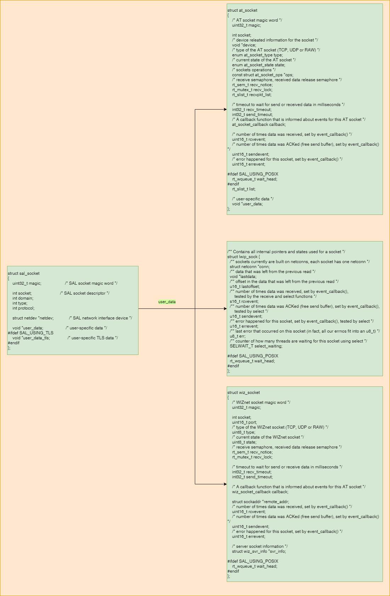
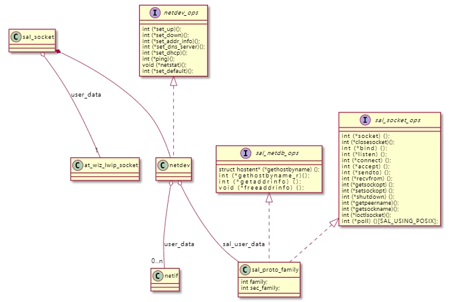
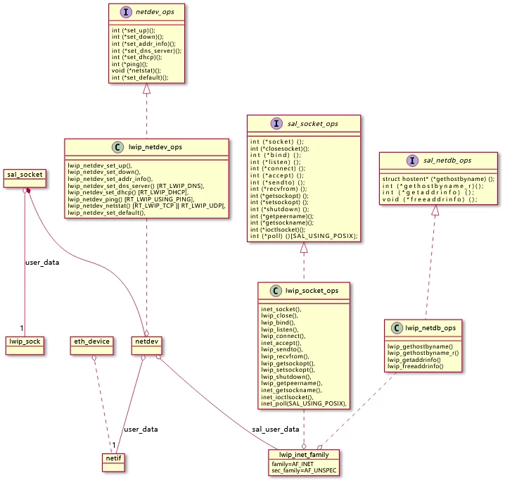
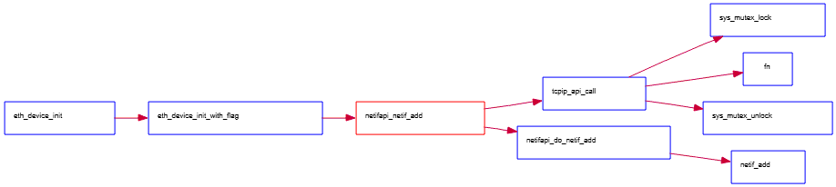
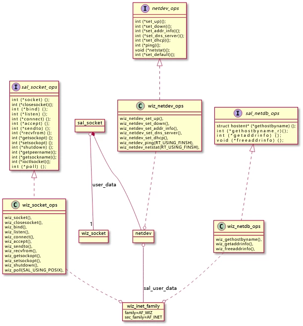
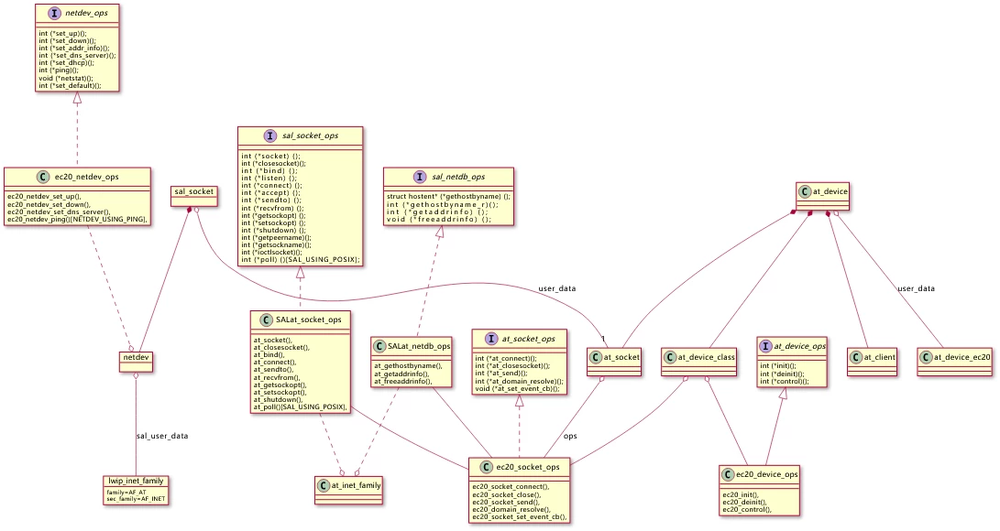
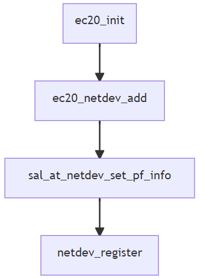

# lwip socket, at socket, sal socket 接口对比

# sal scoket

## sal socket 与 其他socket 关系



结合上面结构体之间的引用关系图，与下图结合看；



从 uml 对象关系图中可以得到下面信息：

1.  从 sal\_scoket 中的 user\_data， 获取对应的 socket；
2.  从 sal\_socket 中的 netdev， 获取对应的协议操作接口；

## sal\_socket 接口

```c
// rt-thread\components\net\sal_socket\include\sal.h
struct sal_socket
{
    uint32_t magic;                    /* SAL socket magic word */

    int socket;                        /* SAL socket descriptor */
    int domain;
    int type;
    int protocol;
    
    struct netdev *netdev;             /* SAL network interface device */
    
    void *user_data;                   /* user-specific data */
#ifdef SAL_USING_TLS
    void *user_data_tls;               /* user-specific TLS data */
#endif
};

/* network interface socket opreations */
struct sal_socket_ops
{
    int (*socket)     (int domain, int type, int protocol);
    int (*closesocket)(int s);
    int (*bind)       (int s, const struct sockaddr *name, socklen_t namelen);
    int (*listen)     (int s, int backlog);
    int (*connect)    (int s, const struct sockaddr *name, socklen_t namelen);
    int (*accept)     (int s, struct sockaddr *addr, socklen_t *addrlen);
    int (*sendto)     (int s, const void *data, size_t size, int flags, const struct sockaddr *to, socklen_t tolen);
    int (*recvfrom)   (int s, void *mem, size_t len, int flags, struct sockaddr *from, socklen_t *fromlen);
    int (*getsockopt) (int s, int level, int optname, void *optval, socklen_t *optlen);
    int (*setsockopt) (int s, int level, int optname, const void *optval, socklen_t optlen);
    int (*shutdown)   (int s, int how);
    int (*getpeername)(int s, struct sockaddr *name, socklen_t *namelen);
    int (*getsockname)(int s, struct sockaddr *name, socklen_t *namelen);
    int (*ioctlsocket)(int s, long cmd, void *arg);
#ifdef SAL_USING_POSIX
    int (*poll)       (struct dfs_fd *file, struct rt_pollreq *req);
#endif
};

/* sal network database name resolving */
struct sal_netdb_ops
{
    struct hostent* (*gethostbyname)  (const char *name);
    int             (*gethostbyname_r)(const char *name, struct hostent *ret, char *buf, size_t buflen, struct hostent **result, int *h_errnop);
    int             (*getaddrinfo)    (const char *nodename, const char *servname, const struct addrinfo *hints, struct addrinfo **res);
    void            (*freeaddrinfo)   (struct addrinfo *ai);
};

struct sal_proto_family
{
    int family;                                  /* primary protocol families type */
    int sec_family;                              /* secondary protocol families type */
    const struct sal_socket_ops *skt_ops;        /* socket opreations */
    const struct sal_netdb_ops *netdb_ops;       /* network database opreations */
};
```

`rt-thread\components\net\sal_socket\include\socket\sys_socket\sys\socket.h`

```c

#ifdef SAL_USING_POSIX
int accept(int s, struct sockaddr *addr, socklen_t *addrlen);
int bind(int s, const struct sockaddr *name, socklen_t namelen);
int shutdown(int s, int how);
int getpeername(int s, struct sockaddr *name, socklen_t *namelen);
int getsockname(int s, struct sockaddr *name, socklen_t *namelen);
int getsockopt(int s, int level, int optname, void *optval, socklen_t *optlen);
int setsockopt(int s, int level, int optname, const void *optval, socklen_t optlen);
int connect(int s, const struct sockaddr *name, socklen_t namelen);
int listen(int s, int backlog);
int recv(int s, void *mem, size_t len, int flags);
int recvfrom(int s, void *mem, size_t len, int flags,
      struct sockaddr *from, socklen_t *fromlen);
int send(int s, const void *dataptr, size_t size, int flags);
int sendto(int s, const void *dataptr, size_t size, int flags,
    const struct sockaddr *to, socklen_t tolen);
int socket(int domain, int type, int protocol);
int closesocket(int s);
int ioctlsocket(int s, long cmd, void *arg);
#else
#define accept(s, addr, addrlen)                           sal_accept(s, addr, addrlen)
#define bind(s, name, namelen)                             sal_bind(s, name, namelen)
#define shutdown(s, how)                                   sal_shutdown(s, how)
#define getpeername(s, name, namelen)                      sal_getpeername(s, name, namelen)
#define getsockname(s, name, namelen)                      sal_getsockname(s, name, namelen)
#define getsockopt(s, level, optname, optval, optlen)      sal_getsockopt(s, level, optname, optval, optlen)
#define setsockopt(s, level, optname, optval, optlen)      sal_setsockopt(s, level, optname, optval, optlen)
#define connect(s, name, namelen)                          sal_connect(s, name, namelen)
#define listen(s, backlog)                                 sal_listen(s, backlog)
#define recv(s, mem, len, flags)                           sal_recvfrom(s, mem, len, flags, NULL, NULL)
#define recvfrom(s, mem, len, flags, from, fromlen)        sal_recvfrom(s, mem, len, flags, from, fromlen)
#define send(s, dataptr, size, flags)                      sal_sendto(s, dataptr, size, flags, NULL, NULL)
#define sendto(s, dataptr, size, flags, to, tolen)         sal_sendto(s, dataptr, size, flags, to, tolen)
#define socket(domain, type, protocol)                     sal_socket(domain, type, protocol)
#define closesocket(s)                                     sal_closesocket(s)
#define ioctlsocket(s, cmd, arg)                           sal_ioctlsocket(s, cmd, arg)
#endif /* SAL_USING_POSIX */
```

`rt-thread\components\net\sal_socket\include\sal_socket.h`

```c
int sal_accept(int socket, struct sockaddr *addr, socklen_t *addrlen);
int sal_bind(int socket, const struct sockaddr *name, socklen_t namelen);
int sal_shutdown(int socket, int how);
int sal_getpeername (int socket, struct sockaddr *name, socklen_t *namelen);
int sal_getsockname (int socket, struct sockaddr *name, socklen_t *namelen);
int sal_getsockopt (int socket, int level, int optname, void *optval, socklen_t *optlen);
int sal_setsockopt (int socket, int level, int optname, const void *optval, socklen_t optlen);
int sal_connect(int socket, const struct sockaddr *name, socklen_t namelen);
int sal_listen(int socket, int backlog);
int sal_recvfrom(int socket, void *mem, size_t len, int flags,
      struct sockaddr *from, socklen_t *fromlen);
int sal_sendto(int socket, const void *dataptr, size_t size, int flags,
    const struct sockaddr *to, socklen_t tolen);
int sal_socket(int domain, int type, int protocol);
int sal_closesocket(int socket);
int sal_ioctlsocket(int socket, long cmd, void *arg);
```

## sal\_init sal初始化

```c
// rt-thread\components\net\sal_socket\src\sal_socket.c
/* the socket table used to dynamic allocate sockets */
struct sal_socket_table
{
    uint32_t max_socket;
    struct sal_socket **sockets;
};
```

系统中最多有可以创建多少个 socket, step形式增减 ；

```c
/**
 * SAL (Socket Abstraction Layer) initialize.
 *
 * @return result  0: initialize success
 *                -1: initialize failed
 */
int sal_init(void)
{
    int cn;

    if (init_ok)
    {
        LOG_D("Socket Abstraction Layer is already initialized.");
        return 0;
    }

    /* init sal socket table */
    cn = SOCKET_TABLE_STEP_LEN < SAL_SOCKETS_NUM ? SOCKET_TABLE_STEP_LEN : SAL_SOCKETS_NUM;
    socket_table.max_socket = cn;
    socket_table.sockets = rt_calloc(1, cn * sizeof(struct sal_socket *));
    if (socket_table.sockets == RT_NULL)
    {
        LOG_E("No memory for socket table.\n");
        return -1;
    }

    /* create sal socket lock */
    rt_mutex_init(&sal_core_lock, "sal_lock", RT_IPC_FLAG_FIFO);

    LOG_I("Socket Abstraction Layer initialize success.");
    init_ok = RT_TRUE;

    return 0;
}
INIT_COMPONENT_EXPORT(sal_init);
```

## sal\_socket 与协议栈具体的socket 关联

`rt-thread\components\net\sal_socket\src\sal_socket.c`

```c
/**
 * This function will initialize sal socket object and set socket options
 *
 * @param family    protocol family
 * @param type      socket type
 * @param protocol  transfer Protocol
 * @param res       sal socket object address
 *
 * @return  0 : socket initialize success
 *         -1 : input the wrong family
 *         -2 : input the wrong socket type
 *         -3 : get network interface failed
 */
static int socket_init(int family, int type, int protocol, struct sal_socket **res)
{

    struct sal_socket *sock;
    struct sal_proto_family *pf;
    struct netdev *netdv_def = netdev_default;
    struct netdev *netdev = RT_NULL;
    rt_bool_t flag = RT_FALSE;

    if (family < 0 || family > AF_MAX)
    {
        return -1;
    }

    if (type < 0 || type > SOCK_MAX)
    {
        return -2;
    }

    sock = *res;
    sock->domain = family;
    sock->type = type;
    sock->protocol = protocol;

    if (netdv_def && netdev_is_up(netdv_def))
    {
        /* check default network interface device protocol family */
        pf = (struct sal_proto_family *) netdv_def->sal_user_data;
        if (pf != RT_NULL && pf->skt_ops && (pf->family == family || pf->sec_family == family))
        {
            sock->netdev = netdv_def;
            flag = RT_TRUE;
        }
    }

    if (flag == RT_FALSE)
    {
        /* get network interface device by protocol family */
        netdev = netdev_get_by_family(family);
        if (netdev == RT_NULL)
        {
            LOG_E("not find network interface device by protocol family(%d).", family);
            return -3;
        }

        sock->netdev = netdev;
    }

    return 0;
}
```

`rt-thread\components\net\sal_socket\src\sal_socket.c`

1.  **sal\_socket 调用 socket\_init 初始化一个 sal\_socket 结构体，在 socket\_init 中 socket 使用了默认的网络设备 `struct netdev *netdv_def = netdev_default;`; 当默认 netdev 没有 linkup 时，才会在查找同 family 下的其他 netdev；**
2.  `struct sal_socket *sock;` 中的 user\_data 在 sal\_socket 函数中 `sock->user_data = (void *) proto_socket;`，与具体的 protocol socket 进行关联了；

```c
int sal_socket(int domain, int type, int protocol)
{
    int retval;
    int socket, proto_socket;
    struct sal_socket *sock;
    struct sal_proto_family *pf;

    /* allocate a new socket and registered socket options */
    socket = socket_new();
    if (socket < 0)
    {
        return -1;
    }

    /* get sal socket object by socket descriptor */
    sock = sal_get_socket(socket);
    if (sock == RT_NULL)
    {
        socket_delete(socket);
        return -1;
    }

    /* Initialize sal socket object */
    retval = socket_init(domain, type, protocol, &sock);
    if (retval < 0)
    {
        LOG_E("SAL socket protocol family input failed, return error %d.", retval);
        socket_delete(socket);
        return -1;
    }

    /* valid the network interface socket opreation */
    SAL_NETDEV_SOCKETOPS_VALID(sock->netdev, pf, socket);

    proto_socket = pf->skt_ops->socket(domain, type, protocol);
    if (proto_socket >= 0)
    {
#ifdef SAL_USING_TLS
        if (SAL_SOCKOPS_PROTO_TLS_VALID(sock, socket))
        {
            sock->user_data_tls = proto_tls->ops->socket(socket);
            if (sock->user_data_tls == RT_NULL)
            {
                socket_delete(socket);
                return -1;
            }
        }
#endif
        sock->user_data = (void *) proto_socket;
        return sock->socket;
    }
    socket_delete(socket);
    return -1;
}
```

`rt-thread\components\net\sal_socket\socket\net_sockets.c (line 147)`

```c
int connect(int s, const struct sockaddr *name, socklen_t namelen)
{
    int socket = dfs_net_getsocket(s);

    return sal_connect(socket, name, namelen);
}
RTM_EXPORT(connect);
```

`rt-thread\components\net\sal_socket\src\sal_socket.c (line 801)`

```c
int sal_connect(int socket, const struct sockaddr *name, socklen_t namelen)
{
    struct sal_socket *sock;
    struct sal_proto_family *pf;
    int ret;

    /* get the socket object by socket descriptor */
    SAL_SOCKET_OBJ_GET(sock, socket);

    /* check the network interface is up status */
    SAL_NETDEV_IS_UP(sock->netdev);
    /* check the network interface socket opreation */
    SAL_NETDEV_SOCKETOPS_VALID(sock->netdev, pf, connect);

    ret = pf->skt_ops->connect((int) sock->user_data, name, namelen);
#ifdef SAL_USING_TLS
    if (ret >= 0 && SAL_SOCKOPS_PROTO_TLS_VALID(sock, connect))
    {
        if (proto_tls->ops->connect(sock->user_data_tls) < 0)
        {
            return -1;
        }

        return ret;
    }
#endif

    return ret;
}
```

# lwip socket

## 创建 LwIP socket



`rt-thread\components\net\lwip-2.0.2\src\include\lwip\sockets.h`

```c
int lwip_accept(int s, struct sockaddr *addr, socklen_t *addrlen);
int lwip_bind(int s, const struct sockaddr *name, socklen_t namelen);
int lwip_shutdown(int s, int how);
int lwip_getpeername (int s, struct sockaddr *name, socklen_t *namelen);
int lwip_getsockname (int s, struct sockaddr *name, socklen_t *namelen);
int lwip_getsockopt (int s, int level, int optname, void *optval, socklen_t *optlen);
int lwip_setsockopt (int s, int level, int optname, const void *optval, socklen_t optlen);
int lwip_close(int s);
int lwip_connect(int s, const struct sockaddr *name, socklen_t namelen);
int lwip_listen(int s, int backlog);
int lwip_recv(int s, void *mem, size_t len, int flags);
int lwip_read(int s, void *mem, size_t len);
int lwip_recvfrom(int s, void *mem, size_t len, int flags,
      struct sockaddr *from, socklen_t *fromlen);
int lwip_send(int s, const void *dataptr, size_t size, int flags);
int lwip_sendmsg(int s, const struct msghdr *message, int flags);
int lwip_sendto(int s, const void *dataptr, size_t size, int flags,
    const struct sockaddr *to, socklen_t tolen);
int lwip_socket(int domain, int type, int protocol);
int lwip_write(int s, const void *dataptr, size_t size);
int lwip_writev(int s, const struct iovec *iov, int iovcnt);
int lwip_select(int maxfdp1, fd_set *readset, fd_set *writeset, fd_set *exceptset,
                struct timeval *timeout);
int lwip_ioctl(int s, long cmd, void *argp);
int lwip_fcntl(int s, int cmd, int val);
```

## LWiP socket 接口

`rt-thread\components\net\sal_socket\impl\af_inet_lwip.c (line 286)`

```c
static const struct sal_socket_ops lwip_socket_ops =
{
    inet_socket,
    lwip_close,
    lwip_bind,
    lwip_listen,
    lwip_connect,
    inet_accept,
    (int (*)(int, const void *, size_t, int, const struct sockaddr *, socklen_t))lwip_sendto,
    (int (*)(int, void *, size_t, int, struct sockaddr *, socklen_t *))lwip_recvfrom,
    lwip_getsockopt,
    //TODO fix on 1.4.1
    lwip_setsockopt,
    lwip_shutdown,
    lwip_getpeername,
    inet_getsockname,
    inet_ioctlsocket,
#ifdef SAL_USING_POSIX
    inet_poll,
#endif
};

static const struct sal_netdb_ops lwip_netdb_ops =
{
    lwip_gethostbyname,
    lwip_gethostbyname_r,
    lwip_getaddrinfo,
    lwip_freeaddrinfo,
};

static const struct sal_proto_family lwip_inet_family =
{
    AF_INET,
#if LWIP_VERSION > 0x2000000
    AF_INET6,
#else
    AF_INET,
#endif 
    &lwip_socket_ops,
    &lwip_netdb_ops,
};

/* Set lwIP network interface device protocol family information */
int sal_lwip_netdev_set_pf_info(struct netdev *netdev)
{
    RT_ASSERT(netdev);
    
    netdev->sal_user_data = (void *) &lwip_inet_family;
    return 0;
}
```

LWiP 中的socket  
`rt-thread\components\net\sal_socket\impl\af_inet_lwip.c`

```c
static int inet_socket(int domain, int type, int protocol)
{
#ifdef SAL_USING_POSIX
    int socket;

    socket = lwip_socket(domain, type, protocol);
    if (socket >= 0)
    {
        struct lwip_sock *lwsock;

        lwsock = lwip_tryget_socket(socket);
        lwsock->conn->callback = event_callback;

        rt_wqueue_init(&lwsock->wait_head);
    }

    return socket;
#else
    return lwip_socket(domain, type, protocol);
#endif /* SAL_USING_POSIX */
}
```

`rt-thread\components\net\lwip-2.0.2\src\api\sockets.c`

```c
/** Contains all internal pointers and states used for a socket */
struct lwip_sock {
  /** sockets currently are built on netconns, each socket has one netconn */
  struct netconn *conn;
  /** data that was left from the previous read */
  void *lastdata;
  /** offset in the data that was left from the previous read */
  u16_t lastoffset;
  /** number of times data was received, set by event_callback(),
      tested by the receive and select functions */
  s16_t rcvevent;
  /** number of times data was ACKed (free send buffer), set by event_callback(),
      tested by select */
  u16_t sendevent;
  /** error happened for this socket, set by event_callback(), tested by select */
  u16_t errevent;
  /** last error that occurred on this socket (in fact, all our errnos fit into an u8_t) */
  u8_t err;
  /** counter of how many threads are waiting for this socket using select */
  SELWAIT_T select_waiting;

#ifdef SAL_USING_POSIX
  rt_wqueue_t wait_head;
#endif
};
```

## LWIP 创建 socket 过程

net\_socket.c 中，返回文件描述符索引；

```c
int socket(int domain, int type, int protocol)
{
    /* create a BSD socket */
    int fd;
    int socket;
    struct dfs_fd *d;

    /* allocate a fd */
    fd = fd_new();
    if (fd < 0)
    {
        rt_set_errno(-ENOMEM);

        return -1;
    }
    d = fd_get(fd);

    /* create socket  and then put it to the dfs_fd */
    socket = sal_socket(domain, type, protocol);
    if (socket >= 0)
    {
        /* this is a socket fd */
        d->type = FT_SOCKET;
        d->path = NULL;

        d->fops = dfs_net_get_fops();

        d->flags = O_RDWR; /* set flags as read and write */
        d->size = 0;
        d->pos = 0;

        /* set socket to the data of dfs_fd */
        d->data = (void *) socket;
    }
    else
    {
        /* release fd */
        fd_put(d);
        fd_put(d);

        rt_set_errno(-ENOMEM);

        return -1;
    }

    /* release the ref-count of fd */
    fd_put(d);

    return fd;
}
```

socket 是通过 dfs 管理的， socket 创建的过程分为以下几步:

1.  allocate a file descriptor, **返回文件描述符的索引**；
2.  通过文件描述符索引，获取文件描述符；
3.  创建一个 sal\_socket； 成功后，修改文件描述符；

    * 修改文件描述符 type；
    * 修改文件描述符中的文件操作函数；
    * 将创建成功的 socket 作为文件操作符的私有数据；

4.  通过fd\_put将文件描述符引用归0，表示当前文件描述符未使用；

创建sal\_socket，返回 **socket descriptor 索引**；

```c
int sal_socket(int domain, int type, int protocol)
{
    int retval;
    int socket, proto_socket;
    struct sal_socket *sock;
    struct sal_proto_family *pf;

    /* allocate a new socket and registered socket options */
    socket = socket_new();
    if (socket < 0)
    {
        return -1;
    }

    /* get sal socket object by socket descriptor */
    sock = sal_get_socket(socket);
    if (sock == RT_NULL)
    {
        return -1;
    }

    /* Initialize sal socket object */
    retval = socket_init(domain, type, protocol, &sock);
    if (retval < 0)
    {
        LOG_E("SAL socket protocol family input failed, return error %d.", retval);
        socket_delete(socket);
        return -1;
    }

    /* valid the network interface socket opreation */
    SAL_NETDEV_SOCKETOPS_VALID(sock->netdev, pf, socket);

    proto_socket = pf->skt_ops->socket(domain, type, protocol);
    if (proto_socket >= 0)
    {
#ifdef SAL_USING_TLS
        if (SAL_SOCKOPS_PROTO_TLS_VALID(sock, socket))
        {
            sock->user_data_tls = proto_tls->ops->socket(socket);
            if (sock->user_data_tls == RT_NULL)
            {
                socket_delete(socket);
                return -1;
            }
        }
#endif
        sock->user_data = (void *) proto_socket;
        return sock->socket;
    }

    return -1;
}
```

1.  allocate a scoket, **返回scoket的索引**；
2.  通过 scoket的索引获取 socket object；
3.  初始化 socket object；
4.  通过 SAL\_NETDEV\_SOCKETOPS\_VALID 获取 pf（sal\_proto\_family）；
5.  通过 pf->skt\_ops->socket 引用到 const struct sal\_socket\_ops lwip\_socket\_ops 中的 lwip\_socket 创建 socket；（lwip\_socket 返回 （/\*The global array of available sockets\*/ （static struct lwip\_sock sockets\[NUM\_SOCKETS\];））的索引）
6.  将创建的 socket 挂在 sal\_socket 上；

## 从 lwip\_connect 到 BSD connect

### 从 lwip\_connect 到 sal\_connect

sal\_lwip\_netdev\_set\_pf\_info 在进行 netdev\_add 时挂在 sal 框架上；


然后在 sal\_socket.c 中，通过 SAL\_NETDEV\_SOCKETOPS\_VALID 将 `sal_user_data` 转换为需要的协议族, sal\_connect 就可以利用对应的协议族进行工作了；

```c
#define SAL_NETDEV_SOCKETOPS_VALID(netdev, pf, ops)                               \
do {                                                                              \
    (pf) = (struct sal_proto_family *) netdev->sal_user_data;                     \
    if ((pf)->skt_ops->ops == RT_NULL){                                           \
        return -1;                                                                \
    }                                                                             \
}while(0)   
```

```c
int sal_connect(int socket, const struct sockaddr *name, socklen_t namelen)
{
    struct sal_socket *sock;
    struct sal_proto_family *pf;
    int ret;

    /* get the socket object by socket descriptor */
    SAL_SOCKET_OBJ_GET(sock, socket);

    /* check the network interface is up status */
    SAL_NETDEV_IS_UP(sock->netdev);
    /* check the network interface socket opreation */
    SAL_NETDEV_SOCKETOPS_VALID(sock->netdev, pf, connect);

    ret = pf->skt_ops->connect((int) sock->user_data, name, namelen);
#ifdef SAL_USING_TLS
    if (ret >= 0 && SAL_SOCKOPS_PROTO_TLS_VALID(sock, connect))
    {
        if (proto_tls->ops->connect(sock->user_data_tls) < 0)
        {
            return -1;
        }

        return ret;
    }
#endif

    return ret;
}
```

### 从 sal\_connect 到 connect

net socket.c 中，通过 `connect` 对 `sal_connect` 进行封装；与 The BSD sockets application programming interface \(API\) 函数名称进行统一；

```c
int connect(int s, const struct sockaddr *name, socklen_t namelen)
{
    int socket = dfs_net_getsocket(s);

    return sal_connect(socket, name, namelen);
}
```

# wiznet socket

## 创建 wiz socket



## wiznet socket 接口

packageswiznet-latestsrcwiz\_af\_inet.c

```c
static const struct sal_socket_ops wiz_socket_ops =
{
    wiz_socket,
    wiz_closesocket,
    wiz_bind,
    wiz_listen,
    wiz_connect,
    wiz_accept,
    wiz_sendto,
    wiz_recvfrom,
    wiz_getsockopt,
    wiz_setsockopt,
    wiz_shutdown,
    NULL,
    NULL,
    NULL,
#ifdef SAL_USING_POSIX
    wiz_poll,
#endif /* SAL_USING_POSIX */
};

static const struct sal_netdb_ops wiz_netdb_ops =
{
    wiz_gethostbyname,
    NULL,
    wiz_getaddrinfo,
    wiz_freeaddrinfo,
};


static const struct sal_proto_family wiz_inet_family =
{
    AF_WIZ,
    AF_INET,
    &wiz_socket_ops,
    &wiz_netdb_ops,
};
```

# at socket

## 创建 at socket



`rt-thread\components\net\at\at_socket\at_socket.h`

```c
int at_socket(int domain, int type, int protocol);
int at_closesocket(int socket);
int at_shutdown(int socket, int how);
int at_bind(int socket, const struct sockaddr *name, socklen_t namelen);
int at_connect(int socket, const struct sockaddr *name, socklen_t namelen);
int at_sendto(int socket, const void *data, size_t size, int flags, const struct sockaddr *to, socklen_t tolen);
int at_send(int socket, const void *data, size_t size, int flags);
int at_recvfrom(int socket, void *mem, size_t len, int flags, struct sockaddr *from, socklen_t *fromlen);
int at_recv(int socket, void *mem, size_t len, int flags);
int at_getsockopt(int socket, int level, int optname, void *optval, socklen_t *optlen);
int at_setsockopt(int socket, int level, int optname, const void *optval, socklen_t optlen);
struct hostent *at_gethostbyname(const char *name);
int at_getaddrinfo(const char *nodename, const char *servname, const struct addrinfo *hints, struct addrinfo **res);
void at_freeaddrinfo(struct addrinfo *ai);

struct at_socket *at_get_socket(int socket);
```

## at socket 接口

`rt-thread\components\net\sal_socket\impl\af_inet_at.c （line 67)`

```c
static const struct sal_socket_ops at_socket_ops =
{
    at_socket,
    at_closesocket,
    at_bind,
    NULL,
    at_connect,
    NULL,
    at_sendto,
    at_recvfrom,
    at_getsockopt,
    at_setsockopt,
    at_shutdown,
    NULL,
    NULL,
    NULL,
#ifdef SAL_USING_POSIX
    at_poll,
#endif /* SAL_USING_POSIX */
};

static const struct sal_netdb_ops at_netdb_ops = 
{
    at_gethostbyname,
    NULL,
    at_getaddrinfo,
    at_freeaddrinfo,
};

static const struct sal_proto_family at_inet_family =
{
    AF_AT,
    AF_INET,
    &at_socket_ops,
    &at_netdb_ops,
};


/* Set AT network interface device protocol family information */
int sal_at_netdev_set_pf_info(struct netdev *netdev)
{
    RT_ASSERT(netdev);

    netdev->sal_user_data = (void *) &at_inet_family;
    return 0;
}
```

`rt-thread\components\net\at\at_socket\at_socket.h`

```c
/* AT socket operations function */
struct at_socket_ops
{
    int (*at_connect)(struct at_socket *socket, char *ip, int32_t port, enum at_socket_type type, rt_bool_t is_client);
    int (*at_closesocket)(struct at_socket *socket);
    int (*at_send)(struct at_socket *socket, const char *buff, size_t bfsz, enum at_socket_type type);
    int (*at_domain_resolve)(const char *name, char ip[16]);
    void (*at_set_event_cb)(at_socket_evt_t event, at_evt_cb_t cb);
};


/* AT receive package list structure */
struct at_recv_pkt
{
    rt_slist_t list;
    size_t bfsz_totle;
    size_t bfsz_index;
    char *buff;
};
typedef struct at_recv_pkt *at_recv_pkt_t;

struct at_socket
{
    /* AT socket magic word */
    uint32_t magic;

    int socket;
    /* device releated information for the socket */
    void *device;
    /* type of the AT socket (TCP, UDP or RAW) */
    enum at_socket_type type;
    /* current state of the AT socket */
    enum at_socket_state state;
    /* sockets operations */
    const struct at_socket_ops *ops;
    /* receive semaphore, received data release semaphore */
    rt_sem_t recv_notice;
    rt_mutex_t recv_lock;
    rt_slist_t recvpkt_list;

    /* timeout to wait for send or received data in milliseconds */
    int32_t recv_timeout;
    int32_t send_timeout;
    /* A callback function that is informed about events for this AT socket */
    at_socket_callback callback;

    /* number of times data was received, set by event_callback() */
    uint16_t rcvevent;
    /* number of times data was ACKed (free send buffer), set by event_callback() */
    uint16_t sendevent;
    /* error happened for this socket, set by event_callback() */
    uint16_t errevent;

#ifdef SAL_USING_POSIX
    rt_wqueue_t wait_head;
#endif
    rt_slist_t list;

    /* user-specific data */
    void *user_data;
};

int at_socket(int domain, int type, int protocol);
int at_closesocket(int socket);
int at_shutdown(int socket, int how);
int at_bind(int socket, const struct sockaddr *name, socklen_t namelen);
int at_connect(int socket, const struct sockaddr *name, socklen_t namelen);
int at_sendto(int socket, const void *data, size_t size, int flags, const struct sockaddr *to, socklen_t tolen);
int at_send(int socket, const void *data, size_t size, int flags);
int at_recvfrom(int socket, void *mem, size_t len, int flags, struct sockaddr *from, socklen_t *fromlen);
int at_recv(int socket, void *mem, size_t len, int flags);
int at_getsockopt(int socket, int level, int optname, void *optval, socklen_t *optlen);
int at_setsockopt(int socket, int level, int optname, const void *optval, socklen_t optlen);
struct hostent *at_gethostbyname(const char *name);
int at_getaddrinfo(const char *nodename, const char *servname, const struct addrinfo *hints, struct addrinfo **res);
void at_freeaddrinfo(struct addrinfo *ai);

struct at_socket *at_get_socket(int socket);

#ifndef RT_USING_SAL

#define socket(domain, type, protocol)                      at_socket(domain, type, protocol)
#define closesocket(socket)                                 at_closesocket(socket)
#define shutdown(socket, how)                               at_shutdown(socket, how)
#define bind(socket, name, namelen)                         at_bind(socket, name, namelen)
#define connect(socket, name, namelen)                      at_connect(socket, name, namelen)
#define sendto(socket, data, size, flags, to, tolen)        at_sendto(socket, data, size, flags, to, tolen)
#define send(socket, data, size, flags)                     at_send(socket, data, size, flags)
#define recvfrom(socket, mem, len, flags, from, fromlen)    at_recvfrom(socket, mem, len, flags, from, fromlen)
#define getsockopt(socket, level, optname, optval, optlen)  at_getsockopt(socket, level, optname, optval, optlen)
#define setsockopt(socket, level, optname, optval, optlen)  at_setsockopt(socket, level, optname, optval, optlen)

#define gethostbyname(name)                                 at_gethostbyname(name)
#define getaddrinfo(nodename, servname, hints, res)         at_getaddrinfo(nodename, servname, hints, res)
#define freeaddrinfo(ai)                                    at_freeaddrinfo(ai)

#endif /* RT_USING_SAL */
```

```c
int ec20_socket_class_register(struct at_device_class *class)
{
    RT_ASSERT(class);

    class->socket_num = AT_DEVICE_EC20_SOCKETS_NUM;
    class->socket_ops = &ec20_socket_ops;

    return RT_EOK;
}
```

创建的socket 为 at\_socket 结构体；通过内部的 int socket 与 `struct at_socket *at_get_socket(int socket)` 中的参数做比对；

```txt
ec20_device_class_register --> ec20_socket_class_register --> class->socket_ops = &ec20_socket_ops
```

## at device class ec20 与 at socket 关联

`packages\at_device-v2.0.3\class\ec20\at_device_ec20.c`

```c
static const struct at_socket_ops ec20_socket_ops =
{
    ec20_socket_connect,
    ec20_socket_close,
    ec20_socket_send,
    ec20_domain_resolve,
    ec20_socket_set_event_cb,
};
```

`rt-thread\components\net\sal_socket\impl\af_inet_at.c (line67)`  
通过下面 socket\_ops 将操作函数挂接到 sal\_socket 上；内部的操作函数如 `at_socket` 调用 通过 `socket_ops` 调用底层的驱动；

```c
static const struct sal_socket_ops at_socket_ops =
{
    at_socket,
    at_closesocket,
    at_bind,
    NULL,
    at_connect,
    NULL,
    at_sendto,
    at_recvfrom,
    at_getsockopt,
    at_setsockopt,
    at_shutdown,
    NULL,
    NULL,
    NULL,
#ifdef SAL_USING_POSIX
    at_poll,
#endif /* SAL_USING_POSIX */
};

static const struct sal_netdb_ops at_netdb_ops = 
{
    at_gethostbyname,
    NULL,
    at_getaddrinfo,
    at_freeaddrinfo,
};

static const struct sal_proto_family at_inet_family =
{
    AF_AT,
    AF_INET,
    &at_socket_ops,
    &at_netdb_ops,
};

/* Set AT network interface device protocol family information */
int sal_at_netdev_set_pf_info(struct netdev *netdev)
{
    RT_ASSERT(netdev);

    netdev->sal_user_data = (void *) &at_inet_family;
    return 0;
}
```

这里将 at\_inet\_family 的相关操作给了 netdev->sal\_user\_data; 



此后，便可通过 netdev->sal\_user\_data 获取该 at 设备的相关操作了；

## 从 BSD API connect 到 at\_connect

```c
// rt-thread\components\net\sal_socket\include\socket\sys_socket\sys\socket.h
#define connect(s, name, namelen)                          sal_connect(s, name, namelen)
```

```c
// rt-thread\components\net\sal_socket\src\sal_socket.c
int sal_connect(int socket, const struct sockaddr *name, socklen_t namelen)
{
    struct sal_socket *sock;
    struct sal_proto_family *pf;
    int ret;

    /* get the socket object by socket descriptor */
    SAL_SOCKET_OBJ_GET(sock, socket);

    /* check the network interface is up status */
    SAL_NETDEV_IS_UP(sock->netdev);
    /* check the network interface socket opreation */
    SAL_NETDEV_SOCKETOPS_VALID(sock->netdev, pf, connect);

    ret = pf->skt_ops->connect((int) sock->user_data, name, namelen);
#ifdef SAL_USING_TLS
    if (ret >= 0 && SAL_SOCKOPS_PROTO_TLS_VALID(sock, connect))
    {
        if (proto_tls->ops->connect(sock->user_data_tls) < 0)
        {
            return -1;
        }

        return ret;
    }
#endif

    return ret;
}
```

sal\_connect 首先获取 sal\_socket 结构体所在内存，通过 sock->netdev 获取到 netdev, 通过 SAL\_NETDEV\_SOCKETOPS\_VALID 获取通过 sal\_at\_netdev\_set\_pf\_info 函数注册到`netdev->sal_user_data`上的借口及数据，将其值赋给 pf，然后通过 pf->skt\_ops 调用相关接口；

```c
// rt-thread\components\net\sal_socket\src\sal_socket.c
#define SAL_SOCKET_OBJ_GET(sock, socket)                                          \
do {                                                                              \
    (sock) = sal_get_socket(socket);                                              \
    if ((sock) == RT_NULL) {                                                      \
        return -1;                                                                \
    }                                                                             \
}while(0)  
```

```c
#define SAL_NETDEV_SOCKETOPS_VALID(netdev, pf, ops)                               \
do {                                                                              \
    (pf) = (struct sal_proto_family *) netdev->sal_user_data;                     \
    if ((pf)->skt_ops->ops == RT_NULL){                                           \
        return -1;                                                                \
    }                                                                             \
}while(0)                                                                         \
```

```c
struct at_device_class
{
    uint16_t class_id;                           /* AT device class ID */
    const struct at_device_ops *device_ops;      /* AT device operaiotns */
#ifdef AT_USING_SOCKET
    uint32_t socket_num;                         /* The maximum number of sockets support */
    const struct at_socket_ops *socket_ops;      /* AT device socket operations */
#endif
    rt_slist_t list;                             /* AT device class list */
};
```

```c
// rt-thread\components\net\sal_socket\src\sal_socket.c
/**
 * This function will get sal socket object by sal socket descriptor.
 *
 * @param socket sal socket index
 *
 * @return sal socket object of the current sal socket index
 */
struct sal_socket *sal_get_socket(int socket)
{
    struct sal_socket_table *st = &socket_table;

    socket = socket - SAL_SOCKET_OFFSET;

    if (socket < 0 || socket >= (int) st->max_socket)
    {
        return RT_NULL;
    }

    /* check socket structure valid or not */
    RT_ASSERT(st->sockets[socket]->magic == SAL_SOCKET_MAGIC);

    return st->sockets[socket];
}
```

## at device 与 at socket

at\_device 通过内部的 user\_data 与具体的 at\_device，如 at\_device\_ec20 关联;  
at\_device\_ec20 通过内部的 user\_data 与 at\_socket 关联; ec20\_socket\_send 中 `ec20->user_data = (void *) device_socket;`， 将对应at socket 的事件发送出去；

## at socket 数据接收

`ec20_socket_event_send(device, SET_EVENT(device_socket, EC20_EVENT_SEND_OK));`，这样在socket 中就知道此时用哪个 device 中的 socket进行网络通信了；**事件的发送使用的是 ec20->user\_data 中存储的socket id**；

```c
static void urc_send_func(struct at_client *client, const char *data, rt_size_t size)
{
    int device_socket = 0;
    struct at_device *device = RT_NULL;
    struct at_device_ec20 *ec20 = RT_NULL;
    char *client_name = client->device->parent.name;

    RT_ASSERT(data && size);

    device = at_device_get_by_name(AT_DEVICE_NAMETYPE_CLIENT, client_name);
    if (device == RT_NULL)
    {
        LOG_E("get device(%s) failed.", client_name);
        return;
    }
    ec20 = (struct at_device_ec20 *) device->user_data;
    device_socket = (int) ec20->user_data;

    if (rt_strstr(data, "SEND OK"))
    {
        ec20_socket_event_send(device, SET_EVENT(device_socket, EC20_EVENT_SEND_OK));
    }
    else if (rt_strstr(data, "SEND FAIL"))
    {
        ec20_socket_event_send(device, SET_EVENT(device_socket, EC20_EVENT_SEND_FAIL));
    }
}
```

**事件的接收使用的是 at\_socket socket->user\_data 中存储的socket id；**

```c
/**
 * send data to server or client by AT commands.
 *
 * @param socket current socket
 * @param buff send buffer
 * @param bfsz send buffer size
 * @param type connect socket type(tcp, udp)
 *
 * @return >=0: the size of send success
 *          -1: send AT commands error or send data error
 *          -2: waited socket event timeout
 *          -5: no memory
 */
static int ec20_socket_send(struct at_socket *socket, const char *buff, size_t bfsz, enum at_socket_type type)
{
    uint32_t event = 0;
    int result = 0, event_result = 0;
    size_t cur_pkt_size = 0, sent_size = 0;
    at_response_t resp = RT_NULL;
    int device_socket = (int) socket->user_data;
    struct at_device *device = (struct at_device *) socket->device;
    struct at_device_ec20 *ec20 = (struct at_device_ec20 *) device->user_data;
    rt_mutex_t lock = device->client->lock;

    RT_ASSERT(buff);

    resp = at_create_resp(128, 2, 5 * RT_TICK_PER_SECOND);
    if (resp == RT_NULL)
    {
        LOG_E("no memory for resp create.");
        return -RT_ENOMEM;
    }

    rt_mutex_take(lock, RT_WAITING_FOREVER);

    /* set current socket for send URC event */
    ec20->user_data = (void *) device_socket;

    /* clear socket send event */
    event = SET_EVENT(device_socket, EC20_EVENT_SEND_OK | EC20_EVENT_SEND_FAIL);
    ec20_socket_event_recv(device, event, 0, RT_EVENT_FLAG_OR);

    /* set AT client end sign to deal with '>' sign.*/
    at_obj_set_end_sign(device->client, '>');

    while (sent_size < bfsz)
    {
        if (bfsz - sent_size < EC20_MODULE_SEND_MAX_SIZE)
        {
            cur_pkt_size = bfsz - sent_size;
        }
        else
        {
            cur_pkt_size = EC20_MODULE_SEND_MAX_SIZE;
        }

        /* send the "AT+QISEND" commands to AT server than receive the '>' response on the first line. */
        if (at_obj_exec_cmd(device->client, resp, "AT+QISEND=%d,%d", device_socket, cur_pkt_size) < 0)
        {
            result = -RT_ERROR;
            goto __exit;
        }

        /* send the real data to server or client */
        result = (int) at_client_send(buff + sent_size, cur_pkt_size);
        if (result == 0)
        {
            result = -RT_ERROR;
            goto __exit;
        }

        /* waiting result event from AT URC */
        if (ec20_socket_event_recv(device, SET_EVENT(device_socket, 0), 10 * RT_TICK_PER_SECOND, RT_EVENT_FLAG_OR) < 0)
        {
            result = -RT_ETIMEOUT;
            goto __exit;
        }
        /* waiting OK or failed result */
        event_result = ec20_socket_event_recv(device,
            EC20_EVENT_SEND_OK | EC20_EVENT_SEND_FAIL, 1 * RT_TICK_PER_SECOND, RT_EVENT_FLAG_OR);
        if (event_result < 0)
        {
            LOG_E("%s device socket(%d) wait sned OK|FAIL timeout.", device->name, device_socket);
            result = -RT_ETIMEOUT;
            goto __exit;
        }
        /* check result */
        if (event_result & EC20_EVENT_SEND_FAIL)
        {
            LOG_E("%s device socket(%d) send failed.", device->name, device_socket);
            result = -RT_ERROR;
            goto __exit;
        }

        if (type == AT_SOCKET_TCP)
        {
            // at_wait_send_finish(socket, cur_pkt_size);
            rt_thread_mdelay(10);
        }

        sent_size += cur_pkt_size;
    }

__exit:
    /* reset the end sign for data conflict */
    at_obj_set_end_sign(device->client, 0);

    rt_mutex_release(lock);

    if (resp)
    {
        at_delete_resp(resp);
    }

    return result > 0 ? sent_size : result;
}
```

### at 命令解析的线程

`rt-thread\components\net\at\src\at_client.c`中 850 有一个执行 at 命令解析的线程  
at\_client\_para\_init，执行相关的 urc 解析注册函数，或将数据存储在 resp->buf ；

```c
    client->parser = rt_thread_create(name,
                                     (void (*)(void *parameter))client_parser,
                                     client,
                                     1024 + 512,
                                     RT_THREAD_PRIORITY_MAX / 3 - 1,
                                     5);
```

```c
static void client_parser(at_client_t client)
{
    const struct at_urc *urc;

    while(1)
    {
        if (at_recv_readline(client) > 0)
        {
                                // 判断是哪个 urc 命令
            if ((urc = get_urc_obj(client)) != RT_NULL)
            {
                /* current receive is request, try to execute related operations */
                if (urc->func != RT_NULL)
                {
                    urc->func(client, client->recv_line_buf, client->recv_line_len);
                }
            }
            else if (client->resp != RT_NULL)
            {
                at_response_t resp = client->resp;

                /* current receive is response */
                client->recv_line_buf[client->recv_line_len - 1] = '\0';
                if (resp->buf_len + client->recv_line_len < resp->buf_size)
                {
                    /* copy response lines, separated by '\0' */
                    rt_memcpy(resp->buf + resp->buf_len, client->recv_line_buf, client->recv_line_len);

                    /* update the current response information */
                    resp->buf_len += client->recv_line_len;
                    resp->line_counts++;
                }
                else
                {
                    client->resp_status = AT_RESP_BUFF_FULL;
                    LOG_E("Read response buffer failed. The Response buffer size is out of buffer size(%d)!", resp->buf_size);
                }
                /* check response result */
                if (rt_memcmp(client->recv_line_buf, AT_RESP_END_OK, rt_strlen(AT_RESP_END_OK)) == 0
                        && resp->line_num == 0)
                {
                    /* get the end data by response result, return response state END_OK. */
                    client->resp_status = AT_RESP_OK;
                }
                else if (rt_strstr(client->recv_line_buf, AT_RESP_END_ERROR)
                        || (rt_memcmp(client->recv_line_buf, AT_RESP_END_FAIL, rt_strlen(AT_RESP_END_FAIL)) == 0))
                {
                    client->resp_status = AT_RESP_ERROR;
                }
                else if (resp->line_counts == resp->line_num && resp->line_num)
                {
                    /* get the end data by response line, return response state END_OK.*/
                    client->resp_status = AT_RESP_OK;
                }
                else
                {
                    continue;
                }

                client->resp = RT_NULL;
                rt_sem_release(client->resp_notice);
            }
            else
            {
//                log_d("unrecognized line: %.*s", client->recv_line_len, client->recv_line_buf);
            }
        }
    }
}
```

client\_parser 中通过 `urc->func(client, client->recv_line_buf, client->recv_line_len);` 发送事件 `ec20_socket_event_send(device, SET_EVENT(device_socket, EC20_EVENT_SEND_OK));`；这样 ec20\_socket\_send 中通过`ec20_socket_event_recv(device, event, 0, RT_EVENT_FLAG_OR);` 被挂起的线程就会到达就绪态；

### at\_socket 注册回调函数

创建 at\_socket 时，会注册两个回调函数

```c
    /* set AT socket receive data callback function */
    sock->ops->at_set_event_cb(AT_SOCKET_EVT_RECV, at_recv_notice_cb);
    sock->ops->at_set_event_cb(AT_SOCKET_EVT_CLOSED, at_closed_notice_cb);
```

```c
// rt-thread\components\net\at\at_socket\at_socket.c
int at_socket(int domain, int type, int protocol)
{
    struct at_socket *sock = RT_NULL;
    enum at_socket_type socket_type;

    /* check socket family protocol */
    RT_ASSERT(domain == AF_AT || domain == AF_INET);

    //TODO check protocol

    switch(type)
    {
    case SOCK_STREAM:
        socket_type = AT_SOCKET_TCP;
        break;

    case SOCK_DGRAM:
        socket_type = AT_SOCKET_UDP;
        break;

    default :
        LOG_E("Don't support socket type (%d)!", type);
        return -1;
    }

    /* allocate and initialize a new AT socket */
    sock = alloc_socket();
    if (sock == RT_NULL)
    {
        return -1;
    }
    sock->type = socket_type;
    sock->state = AT_SOCKET_OPEN;

    /* set AT socket receive data callback function */
    sock->ops->at_set_event_cb(AT_SOCKET_EVT_RECV, at_recv_notice_cb);
    sock->ops->at_set_event_cb(AT_SOCKET_EVT_CLOSED, at_closed_notice_cb);

    return sock->socket;
}
```

at\_recv\_notice\_cb 接收到的数据，并将接收到的数据块加入到recvpkt\_list链表；修改 at socket 接收到数据的事件统计；

```c
static void at_recv_notice_cb(struct at_socket *sock, at_socket_evt_t event, const char *buff, size_t bfsz)
{
    RT_ASSERT(buff);
    RT_ASSERT(event == AT_SOCKET_EVT_RECV);
    
    /* check the socket object status */
    if (sock->magic != AT_SOCKET_MAGIC)
    {
        return;
    }

    /* put receive buffer to receiver packet list */
    rt_mutex_take(sock->recv_lock, RT_WAITING_FOREVER);
    at_recvpkt_put(&(sock->recvpkt_list), buff, bfsz);
    rt_mutex_release(sock->recv_lock);

    rt_sem_release(sock->recv_notice);

    at_do_event_changes(sock, AT_EVENT_RECV, RT_TRUE);
}
```

device 实例中借用创建 at\_socket 时注册的回调函数，`at_evt_cb_set[AT_SOCKET_EVT_RECV](socket, AT_SOCKET_EVT_RECV, recv_buf, bfsz);` 执行数据接收，并递交给 socket 应用；  
urc\_recv\_func 为注册的 at\_urc 接收命令；

```c
// packages\at_device-v2.0.3\class\ec20\at_socket_ec20.c
static void urc_recv_func(struct at_client *client, const char *data, rt_size_t size)
{
    int device_socket = 0;
    rt_int32_t timeout;
    rt_size_t bfsz = 0, temp_size = 0;
    char *recv_buf = RT_NULL, temp[8] = {0};
    struct at_socket *socket = RT_NULL;
    struct at_device *device = RT_NULL;
    char *client_name = client->device->parent.name;

    RT_ASSERT(data && size);

    device = at_device_get_by_name(AT_DEVICE_NAMETYPE_CLIENT, client_name);
    if (device == RT_NULL)
    {
        LOG_E("get device(%s) failed.", client_name);
        return;
    }

    /* get the current socket and receive buffer size by receive data */
    sscanf(data, "+QIURC: \"recv\",%d,%d", &device_socket, (int *) &bfsz);
    /* set receive timeout by receive buffer length, not less than 10 ms */
    timeout = bfsz > 10 ? bfsz : 10;

    if (device_socket < 0 || bfsz == 0)
    {
        return;
    }

    recv_buf = (char *) rt_calloc(1, bfsz);
    if (recv_buf == RT_NULL)
    {
        LOG_E("no memory for URC receive buffer(%d).", bfsz);
        /* read and clean the coming data */
        while (temp_size < bfsz)
        {
            if (bfsz - temp_size > sizeof(temp))
            {
                at_client_obj_recv(client, temp, sizeof(temp), timeout);
            }
            else
            {
                at_client_obj_recv(client, temp, bfsz - temp_size, timeout);
            }
            temp_size += sizeof(temp);
        }
        return;
    }

    /* sync receive data */
    if (at_client_obj_recv(client, recv_buf, bfsz, timeout) != bfsz)
    {
        LOG_E("%s device receive size(%d) data failed.", device->name, bfsz);
        rt_free(recv_buf);
        return;
    }

    /* get at socket object by device socket descriptor */
    socket = &(device->sockets[device_socket]);

    /* notice the receive buffer and buffer size */
    if (at_evt_cb_set[AT_SOCKET_EVT_RECV])
    {
        at_evt_cb_set[AT_SOCKET_EVT_RECV](socket, AT_SOCKET_EVT_RECV, recv_buf, bfsz);
    }
}
```

