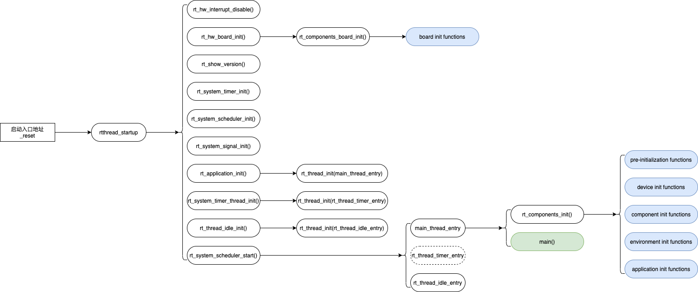
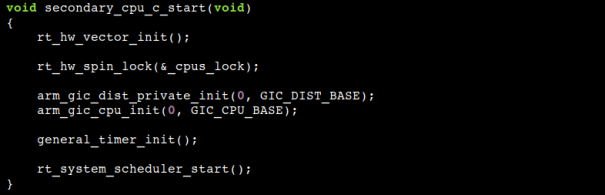
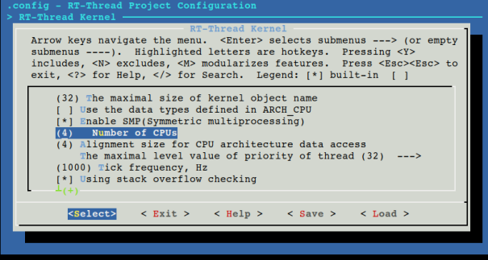
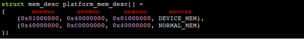
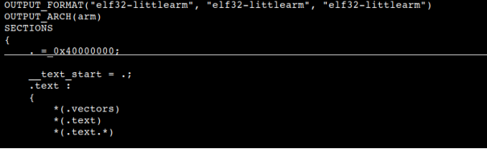
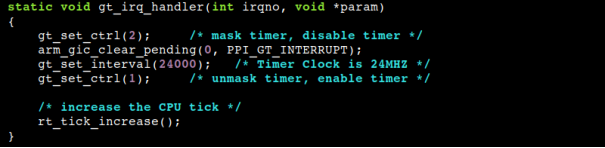

# RT-Thread SMP 介绍与移植

SMP: 对称多处理（Symmetrical Multi-Processing）简称 SMP，是指在一个计算机上汇集了一组处理器 (多 CPU), 各 CPU 之间共享内存子系统以及总线结构。

RT-Thread 自 v4.0.0 版本开始支持 SMP，在对称多核上可以通过使能 RT_USING_SMP 来开启。该文档主要对 SMP 进行介绍，以及讲解如何移植 RT-Thread SMP 。
## 多核启动

### 概述

系统上电后，每个 CPU 都会在 ROM 中的代码控制下独自运行，但是只有主处理器（以下简称 CPU0 ）跳转到 RT-Thread 的初始化入口处，而其他的处理器（以下简称次级 CPU ）则会暂停在某个状态下，等待 CPU0 将它们唤醒。

CPU0 完成 RT-Thread 的全局初始化过程，包括外设初始化、中断控制器的中断分发部分初始化、全局变量的初始化、全局内核对象的创建等等。它还完成 CPU0 自身硬件初始化，包括 MMU 、中断控制器的 CPU 接口部分，以及中断向量表等。

最终，CPU0 在执行 main 线程之前，唤醒其它的次级 CPU，引导它们执行次级 CPU 的初始化代码，这段代码会让各个次级 CPU 去完成自身相关的硬件初始化，并开启任务调度。

此后，系统进入正常运行阶段。系统启动阶段各个 CPU 的动作如下图所示：


值得注意的是，每个次级 CPU 自身硬件部分的初始化不能由 CPU0 完成，因为其自身硬件不能由其它 CPU 访问。

### CPU0 启动流程

在 SMP 平台上，启动核心 CPU0 的启动流程和单核 CPU 上的启动过程相同，主要流程如下图所示：



由于硬件平台和编译器的不同，系统上电后执行的初始化代码和启动流程并不相同，但是系统最终统一调用入口函数 `rtthread_startup()` 来启动  RT-Thread 。该函数设置硬件平台、初始化操作系统各组件、创建用户 main 线程，并最终开启当前 CPU 的任务调度机制，开始正常工作。

当开启了 CPU0 的任务调度器之后，CPU0 上通常存在两个线程：main 线程和 idle 线程，用户可以通过修改配置选项或者通过 RT-Thread 提供的接口创建新的线程，调度器依据优先级和线程状态从中选择就绪线程执行。

### 次级 CPU 启动流程

如果定义了配置选项 RT_USING_SMP ，CPU0 的 main 线程在运行过程中会执行函数 `rt_hw_secondary_cpu_up()` 以启动其它 CPU 核心。该函数由移植内核的开发人员提供，完成以下两个操作：

1. 设置次级 CPU 的启动入口地址；
2. 加电启动次级 CPU 。

在 ARMv7-A 中，次级 CPU 的启动入口地址固定设置为 `secondary_cpu_start` ，该标号定义在文件 libcpu/arm/cortex-a/start_gcc.S 中，主要步骤包括设置当前 CPU 的内核栈，建立 MMU 内存映射表，然后跳转到函数 `secondary_cpu_c_start()` 执行。
函数 `secondary_cpu_c_start()` 是所有次级 CPU 的初始化函数，它同样与硬件平台密切相关，由移植系统的开发者提供，需要完成以下步骤：

1. 初始化当前 CPU 的中断控制器，设置中断向量表；
2. 设置定时器为当前 CPU 产生 tick 中断；
3. 获取内核自旋锁 `_cpus_lock` 以保护全局任务表，调用函数 `rt_system_scheduler_start()` 开启当前 CPU 的任务调度器。

全志 T3 芯片采用 GIC 中断控制器，系统通过 Generic Timer 定时器提供 tick 中断计数，函数 `secondary_cpu_c_start()` 代码如下：



每个次级 CPU 启动之后，从全局任务表和当前 CPU 的局部任务表中选取优先级最高的任务执行，在优先级相同的情况下，优先选择当前 CPU 的局部任务表中的任务执行。

在不存在其它任务的情况下，每个 CPU 调度自己的 idle 任务执行。其中，CPU0 的 idle 任务循环执行函数 `rt_thread_idle_execute()` ，而次级 CPU 的 idle 任务循环执行函数 `rt_hw_secondary_cpu_idle_exec()` 。后者同样需要移植系统的开发者提供，实例代码如下：


## 多核调度

### 任务特性

RT-Thread 中的任务分为以下状态：

- 运行态：任务正在某个 CPU 上执行；
- 就绪态：任务随时可以被执行，但尚未分配到 CPU ，因此等待在某个就绪态任务表中；
- 挂起态：任务因为条件不满足（等待超时或者数据到来等），而不能够被执行；
- 关闭态：任务已经被删除，正在等待被回收。

在进入正常运行阶段后，每个 CPU 都独自地运行中断处理、调度器以及任务的代码。RT-Thread 在多核系统上运行时存在以下特性：

1. 同一时刻，一个任务（线程）只会运行在一个 CPU 上；
2. 每个 CPU 互斥地访问全局调度器数据，以确定将要在当前 CPU 上运行的任务；
3. 支持将任务绑定在某一个 CPU 上运行。

### 调度策略

为了实现上述目标，RT-Thread 调度器实现了两种就绪任务队列：

1. 全局就绪任务表 rt_thread_ready_table[] ，包含没有绑定 CPU 的就绪任务；
2. CPU 局部就绪任务表 ready_table[] ，每个 CPU 对应一个，包含绑定到对应 CPU 的就绪任务。典型的 CPU 绑定任务是每个 CPU 自己的 idle 任务。

当 CPU 需要切换任务执行时，任务调度器查找系统中优先级最高的就绪任务执行，即全局就绪任务表和当前 CPU 的局部就绪任务表中优先级最高的任务。在优先级相同的情况下，优先选取局部任务表中的任务。

相对应的是，如果一个任务由其它状态变为就绪态，则进行如下处理：

1. 如果它不是 CPU 绑定任务，则把它挂入全局就绪表，并向其它的所有 CPU 发送 IPI 中断，通知它们检查是否需要切换任务，因为其它 CPU 的当前任务的优先级可能低于此就绪态任务，因而会发生优先级抢占；
2. 如果它是一个 CPU 绑定任务，检查它是否比对应 CPU 的当前任务优先级高，如果是则发生优先级抢占，否则把它挂入对应 CPU 的局部就绪任务表。整个过程不通知其它 CPU 。

## SMP 内核接口

为支持 SMP 平台，RT-Thread 提供以下内核接口，以方便内核开发人员使用多核的功能。

### 处理器间中断 IPI

当单个 CPU 上运行的任务改变了系统状态，或者触发了某个事件，需要通过处理器间中断（Inter-Processor Interrupt）通知其它 CPU ，其它 CPU 在收到该信号后，调用注册的相应例程进行处理。

RT-Thread 提供如下 IPI 接口：

```c
void rt_hw_ipi_send(int ipi_vector, unsigned int cpu_mask)
```

该函数用来向 CPU 位图中表示的 CPU 集合发送指定编号的 IPI 信号。

```c
void rt_hw_ipi_handler_install(int ipi_vector, rt_isr_handler_t ipi_isr_handler)
```

该函数为当前 CPU 设置指定编号 IPI 信号的处理函数。

### OS Tick

在 SMP 系统中，每个 CPU 维护自己独立的 tick 值，用作任务运行计时以及时间片统计。除此之外，CPU0 还通过 tick 计数来更新系统时间，并提供系统定时器的功能，次级 CPU 不需要提供这些功能。

在初始化次级 CPU 的过程中，每个 CPU 需要使能各自的 tick 定时器，并注册相应的 tick 中断处理函数。使能 tick 定时器的操作与具体的硬件平台相关，需要移植内核的开发者提供；而 tick 中断处理函数主要完成两个动作：

1. 设置 tick 定时器的状态。
2. 增加当前 CPU 的 tick 计数。

### 自旋锁 spinlock

在 SMP 系统中，通过关中断的方式不能阻止多个 CPU 对共享资源的并发访问，需要通过自旋锁机制进行保护。和互斥锁类似，在任何时刻，自旋锁最多只能有一个保持者，也就说，在任何时刻最多只能有一个执行单元获得锁。不同的是，对于互斥锁，如果资源已经被占用，资源申请者只能进入睡眠状态。而自旋锁不会引起调用者睡眠，而是循环查询直到该自旋锁的保持者已经释放了锁。

RT-Thread 提供自旋锁接口：

1、如下函数初始化已分配的 spinlock 变量:

```c
void rt_spin_lock_init(struct rt_spinlock *lock)
```

2、如下函数获取 spinlock，忙等待直到获取成功：

```c
void rt_spin_lock(struct rt_spinlock *lock)
```

3、如下函数释放 spinlock ：

```c
void rt_spin_unlock(struct rt_spinlock *lock)
```

4、如下函数禁止当前 CPU 中断后获取 spinlock，忙等待直到获取成功，返回之前的中断状态：

```c
rt_base_t rt_spin_lock_irqsave(struct rt_spinlock *lock)
```

5、如下函数释放 spinlock ，并恢复之前的中断状态：

```c
void rt_spin_unlock_irqrestore(struct rt_spinlock *lock, rt_base_t level)
```


### 任务绑定

通常系统中的就绪任务位于全局就绪任务表中，每个任务在哪个 CPU 上调度运行是随机的。通过将就绪任务放入到某个 CPU 局部就绪任务列表中，RT-Thread 允许将任务与 CPU 绑定，即该任务只能够在指定的 CPU 上。

RT-Thread 提供的任务绑定接口如下：

```c
rt_err_t rt_thread_control (rt_thread_t thread, int cmd, void *arg)
```

当参数 cmd 的值为 `RT_THREAD_CTRL_BIND_CPU` 时，函数将线程 thread 绑定到参数 arg 指定的 CPU 上。

## 移植说明

为了将 RT-Thread 系统移植到其它 SMP 平台上，需要创建相应的 BSP ，编写底层代码。这里我们以全志 T3 芯片（四核 Cortex-A7 ）为模版，说明 RT-Thread 在多核 Cortex-A 平台上的移植步骤。内核开发者可参考这些步骤将 RT-Thread 移植到其它多核 Cortex-A 芯片上运行。

### 编译环境准备

RT-Thread 使用 scons 工具进行编译和配置，以操作系统 Ubuntu 18.04 为例说明编译环境，需要安装以下软件包：

- lib32ncurses5
- lib32z1
- python
- scons
- python-pip
- make
- zlib1g-dev
- binutils-arm-none-eabi

### 创建 BSP 目录及文件模版

当向其它 SMP 平台移植时，可使用全志 T3 BSP 做为模版，复制文件夹 bsp/allwinner_t3/ ，名字更改为目标平台，例如 bsp/some_cortexa_smp ，保留以下文件：

- Kconfig：BSP 配置说明文件，用来组织 BSP 的配置选项
- link.lds：生成 BSP 可执行文件所使用的链接文件
- .config：BSP 配置结果文件，提供默认的配置选项
- SConscript：scons 配置文件，和子目录的 SConscript 文件一起记录待编译的源文件
- SConstruct：scons 配置文件，用来设置 BSP 编译环境
- applications/main.c：提供用户代码入口 main 函数
- drivers/：
  - board.c 和 board.h：包含 PCB 板上的初始化代码
  - drv_clock.c 和 drv_clock.h：包含时钟树设置代码
  - platsmp.c 和 platsmp.h：包含 SMP 启动代码

### 配置 SMP 核心数量

进入 BSP 目录 bsp/allwinner_t3 运行命令 `scons --menuconfig` 配置 BSP 的核心数量，修改配置选项 `RT_CPUS_NR` ，将该值修改为实际的 SMP 核心数量，如下图所示：



### 配置 MMU 映射的地址范围

RT-Thead 采用直接映射的方式，内核和所有任务共享同一个地址空间，物理内存地址和设备寄存器地址空间采用不同的映射属性，但是映射的虚拟地址和物理地址相一致。

系统在初始化过程中，参照数组 `platform_mem_desc[]` 的设置建立系统唯一的 MMU 映射表。数组中每一项对应一个地址映射范围的描述，其中的元素依次为起始物理地址、结束物理地址、起始虚拟地址和映射属性。

该 MMU 映射配置数组定义在文件 drivers/board.c 中。以全志 T3 为例，其 DDR 内存起始地址为 0x40000000 ，结束地址为 0xC0000000；而设备地址范围从 0x01000000 到 0x40000000 ，因此数组 `platform_mem_desc[]` 的内容如下：



### 设置内核加载地址

编译生成的内核镜像通常加载到内存的起始地址执行，内核链接时所使用的起始地址要和该值保持一致，该地址由链接脚本 link.lds 决定。以全志 T3 为例，DDR 内存起始地址为 0x40000000 ，因此内核镜像的加载地址也设置为 0x40000000 ，内容如下：



移植时，将该值修改为内核镜像的实际加载地址，通常为物理内存的起始地址。

### 实现次级 CPU 的启动代码

按照上面次级 CPU 启动过程的描述，在将 RT-Thread 移植到其它 ARMv7-A SMP 芯片的过程中，内核开发者需要提供以下三个函数：

1. `rt_hw_secondary_cpu_up()`,
该函数设置次级 CPU 的启动入口地址为 `secondary_cpu_start` ，加电启动其它 CPU 核心；

2. `secondary_cpu_c_start()`,
该函数用来初始化单个次级 CPU ，主要包括初始化中断控制器接口，设置中断向量表，以及当前 CPU 的 tick 中断。最后获取内核自旋锁 _cpus_lock ，并调用函数 `rt_system_scheduler_start()` 开启当前 CPU 的任务调度器；

3. `rt_hw_secondary_cpu_idle_exec()`,
该函数被次级 CPU 的 idle 线程循环调用，可用来做功耗相关的处理。

上述三个函数定义在文件 drivers/platsmp.c 中。其中，只有函数 `rt_hw_secondary_cpu_up()` 的功能实现与芯片密切相关，需要移植者根据芯片特性提供。如果芯片使用的不是 GIC 中断控制器和 Generic Timer 定时器，那么同样需要重新实现函数 `secondary_cpu_c_start()` 。

需要注意的是，在全志 T3 平台上，Generic Timer 的工作频率为 24 MHZ ，tick 的频率为 1000 ，所以中断间隔寄存器 `CNTP_TVAL` 设置为 `24M / 1000 = 24000` 。在 tick 的中断处理代码中需要重新设置间隔寄存器，代码如下：



该值在每次 tick 中断被触发时重新设置，中断处理代码见上面 OS tick 的说明。如果目标平台的工作频率与上述值不一致，修改函数 `gt_set_interval()` 的参数进行设置。
