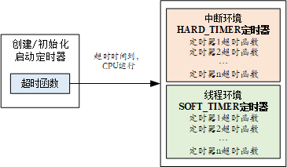
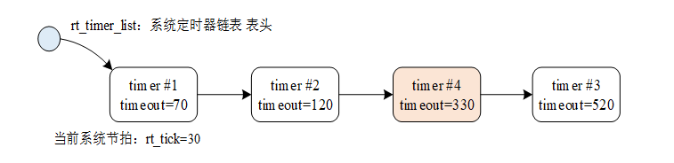
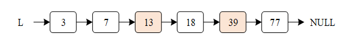

# 时钟管理

时间是非常重要的概念，和朋友出去游玩需要约定时间，完成任务也需要花费时间，生活离不开时间。操作系统也一样，需要通过时间来规范其任务的执行，操作系统中最小的时间单位是时钟节拍 (OS Tick)。本章主要介绍时钟节拍和基于时钟节拍的定时器，读完本章，我们将了解时钟节拍如何产生，并学会如何使用 RT-Thread 的定时器。

## 时钟节拍

任何操作系统都需要提供一个时钟节拍，以供系统处理所有和时间有关的事件，如线程的延时、线程的时间片轮转调度以及定时器超时等。时钟节拍是特定的周期性中断，这个中断可以看做是系统心跳，中断之间的时间间隔取决于不同的应用，一般是 1ms–100ms，时钟节拍率越快，系统的实时响应越快，但是系统的额外开销就越大，从系统启动开始计数的时钟节拍数称为系统时间。

RT-Thread 中，时钟节拍的长度可以根据 RT_TICK_PER_SECOND 的定义来调整，等于 1/RT_TICK_PER_SECOND 秒。

### 时钟节拍的实现方式

时钟节拍由配置为中断触发模式的硬件定时器产生，当中断到来时，将调用一次：void rt_tick_increase(void)，通知操作系统已经过去一个系统时钟；不同硬件定时器中断实现都不同，下面的中断函数以 STM32 定时器作为示例。

```c
void SysTick_Handler(void)
{
    /* 进入中断 */
    rt_interrupt_enter();
    ……
    rt_tick_increase();
    /* 退出中断 */
    rt_interrupt_leave();
}
```

在中断函数中调用 rt_tick_increase() 对全局变量 rt_tick 进行自加，代码如下所示：

```c
void rt_tick_increase(void)
{
    struct rt_thread *thread;

    /* 全局变量 rt_tick 自加 */
    ++ rt_tick;

    /* 检查时间片 */
    thread = rt_thread_self();

    -- thread->remaining_tick;
    if (thread->remaining_tick == 0)
    {
        /* 重新赋初值 */
        thread->remaining_tick = thread->init_tick;

        /* 线程挂起 */
        rt_thread_yield();
    }

    /* 检查定时器 */
    rt_timer_check();
}
```

可以看到全局变量 rt_tick 在每经过一个时钟节拍时，值就会加 1，rt_tick 的值表示了系统从启动开始总共经过的时钟节拍数，即系统时间。此外，每经过一个时钟节拍时，都会检查当前线程的时间片是否用完，以及是否有定时器超时。

> [!NOTE]
> 注：中断中的 rt_timer_check() 用于检查系统硬件定时器链表，如果有定时器超时，将调用相应的超时函数。且所有定时器在定时超时后都会从定时器链表中被移除，而周期性定时器会在它再次启动时被加入定时器链表。

### 获取时钟节拍

由于全局变量 rt_tick 在每经过一个时钟节拍时，值就会加 1，通过调用 rt_tick_get 会返回当前 rt_tick 的值，即可以获取到当前的时钟节拍值。此接口可用于记录系统的运行时间长短，或者测量某任务运行的时间。接口函数如下：

```c
rt_tick_t rt_tick_get(void);
```

下表描述了 rt_tick_get() 函数的返回值：

|**返回**|**描述**      |
|----------|----------------|
| rt_tick  | 当前时钟节拍值 |

## 定时器管理

定时器，是指从指定的时刻开始，经过一定的指定时间后触发一个事件，例如定个时间提醒第二天能够按时起床。定时器有硬件定时器和软件定时器之分：

1）**硬件定时器**是芯片本身提供的定时功能。一般是由外部晶振提供给芯片输入时钟，芯片向软件模块提供一组配置寄存器，接受控制输入，到达设定时间值后芯片中断控制器产生时钟中断。硬件定时器的精度一般很高，可以达到纳秒级别，并且是中断触发方式。

2）**软件定时器**是由操作系统提供的一类系统接口，它构建在硬件定时器基础之上，使系统能够提供不受数目限制的定时器服务。

RT-Thread 操作系统提供软件实现的定时器，以时钟节拍（OS Tick）的时间长度为单位，即定时数值必须是 OS Tick 的整数倍，例如一个 OS Tick 是 10ms，那么上层软件定时器只能是 10ms，20ms，100ms 等，而不能定时为 15ms。RT-Thread 的定时器也基于系统的节拍，提供了基于节拍整数倍的定时能力。

### RT-Thread 定时器介绍

RT-Thread 的定时器提供两类定时器机制：第一类是单次触发定时器，这类定时器在启动后只会触发一次定时器事件，然后定时器自动停止。第二类是周期触发定时器，这类定时器会周期性的触发定时器事件，直到用户手动的停止，否则将永远持续执行下去。

另外，根据超时函数执行时所处的上下文环境，RT-Thread 的定时器可以分为 HARD_TIMER 模式与 SOFT_TIMER 模式，如下图。



#### HARD_TIMER 模式

HARD_TIMER 模式的定时器超时函数在中断上下文环境中执行，可以在初始化 / 创建定时器时使用参数 RT_TIMER_FLAG_HARD_TIMER 来指定。

在中断上下文环境中执行时，对于超时函数的要求与中断服务例程的要求相同：执行时间应该尽量短，执行时不应导致当前上下文挂起、等待。例如在中断上下文中执行的超时函数它不应该试图去申请动态内存、释放动态内存等。

RT-Thread 定时器默认的方式是 HARD_TIMER 模式，即定时器超时后，超时函数是在系统时钟中断的上下文环境中运行的。在中断上下文中的执行方式决定了定时器的超时函数不应该调用任何会让当前上下文挂起的系统函数；也不能够执行非常长的时间，否则会导致其他中断的响应时间加长或抢占了其他线程执行的时间。

#### SOFT_TIMER 模式

SOFT_TIMER 模式可配置，通过宏定义 RT_USING_TIMER_SOFT 来决定是否启用该模式。该模式被启用后，系统会在初始化时创建一个 timer 线程，然后 SOFT_TIMER 模式的定时器超时函数在都会在 timer 线程的上下文环境中执行。可以在初始化 / 创建定时器时使用参数 RT_TIMER_FLAG_SOFT_TIMER 来指定设置 SOFT_TIMER 模式。

### 定时器工作机制

下面以一个例子来说明 RT-Thread 定时器的工作机制。在 RT-Thread 定时器模块中维护着两个重要的全局变量：

（1）当前系统经过的 tick 时间 rt_tick（当硬件定时器中断来临时，它将加 1）；

（2）定时器链表 rt_timer_list。系统新创建并激活的定时器都会按照以超时时间排序的方式插入到 rt_timer_list 链表中。

如下图所示，系统当前 tick 值为 20，在当前系统中已经创建并启动了三个定时器，分别是定时时间为 50 个 tick 的 Timer1、100 个 tick 的 Timer2 和 500 个 tick 的 Timer3，这三个定时器分别加上系统当前时间 rt_tick=20，从小到大排序链接在 rt_timer_list 链表中，形成如图所示的定时器链表结构。


而 rt_tick 随着硬件定时器的触发一直在增长（每一次硬件定时器中断来临，rt_tick 变量会加 1），50 个 tick 以后，rt_tick 从 20 增长到 70，与 Timer1 的 timeout 值相等，这时会触发与 Timer1 定时器相关联的超时函数，同时将 Timer1 从 rt_timer_list 链表上删除。同理，100 个 tick 和 500 个 tick 过去后，与 Timer2 和 Timer3 定时器相关联的超时函数会被触发，接着将 Timer2 和 Timer3 定时器从 rt_timer_list 链表中删除。

如果系统当前定时器状态在 10 个 tick 以后（rt_tick=30）有一个任务新创建了一个 tick 值为 300 的 Timer4 定时器，由于 Timer4 定时器的 timeout=rt_tick+300=330, 因此它将被插入到 Timer2 和 Timer3 定时器中间，形成如下图所示链表结构：



#### 定时器控制块

在 RT-Thread 操作系统中，定时器控制块由结构体 struct rt_timer 定义并形成定时器内核对象，再链接到内核对象容器中进行管理。它是操作系统用于管理定时器的一个数据结构，会存储定时器的一些信息，例如初始节拍数，超时时的节拍数，也包含定时器与定时器之间连接用的链表结构，超时回调函数等。

```c
struct rt_timer
{
    struct rt_object parent;
    rt_list_t row[RT_TIMER_SKIP_LIST_LEVEL];  /* 定时器链表节点 */

    void (*timeout_func)(void *parameter);    /* 定时器超时调用的函数 */
    void      *parameter;                         /* 超时函数的参数 */
    rt_tick_t init_tick;                         /* 定时器初始超时节拍数 */
    rt_tick_t timeout_tick;                     /* 定时器实际超时时的节拍数 */
};
typedef struct rt_timer *rt_timer_t;
```

定时器控制块由 struct rt_timer 结构体定义并形成定时器内核对象，再链接到内核对象容器中进行管理，list 成员则用于把一个激活的（已经启动的）定时器链接到 rt_timer_list 链表中。

#### 定时器跳表 (Skip List) 算法

在前面介绍定时器的工作方式的时候说过，系统新创建并激活的定时器都会按照以超时时间排序的方式插入到 rt_timer_list 链表中，也就是说 t_timer_list 链表是一个有序链表，RT-Thread 中使用了跳表算法来加快搜索链表元素的速度。

跳表是一种基于并联链表的数据结构，实现简单，插入、删除、查找的时间复杂度均为 O(log n)。跳表是链表的一种，但它在链表的基础上增加了 “跳跃” 功能，正是这个功能，使得在查找元素时，跳表能够提供 O(log n)的时间复杂度，举例如下：

一个有序的链表，如下图所示，从该有序链表中搜索元素 {13, 39}，需要比较的次数分别为 {3, 5}，总共比较的次数为 3 + 5 = 8 次。



使用跳表算法后可以采用类似二叉搜索树的方法，把一些节点提取出来作为索引，得到如下图所示的结构：


在这个结构里把 {3, 18,77} 提取出来作为一级索引，这样搜索的时候就可以减少比较次数了, 例如在搜索 39 时仅比较了 3 次（通过比较 3，18，39)。当然我们还可以再从一级索引提取一些元素出来，作为二级索引，这样更能加快元素搜索。


所以，定时器跳表可以通过上层的索引，在搜索的时候就减少比较次数，提升查找的效率，这是一种通过 “空间来换取时间” 的算法，在 RT-Thread 中通过宏定义 RT_TIMER_SKIP_LIST_LEVEL 来配置跳表的层数，默认为 1，表示采用一级有序链表图的有序链表算法，每增加一，表示在原链表基础上增加一级索引。

### 定时器的管理方式

前面介绍了 RT-Thread 定时器并对定时器的工作机制进行了概念上的讲解，本节将深入到定时器的各个接口，帮助读者在代码层次上理解 RT-Thread 定时器。

在系统启动时需要初始化定时器管理系统。可以通过下面的函数接口完成：

```c
void rt_system_timer_init(void);
```

如果需要使用 SOFT_TIMER，则系统初始化时，应该调用下面这个函数接口：

```c
void rt_system_timer_thread_init(void);
```

定时器控制块中含有定时器相关的重要参数，在定时器各种状态间起到纽带的作用。定时器的相关操作如下图所示，对定时器的操作包含：创建 / 初始化定时器、启动定时器、运行定时器、删除 / 脱离定时器，所有定时器在定时超时后都会从定时器链表中被移除，而周期性定时器会在它再次启动时被加入定时器链表，这与定时器参数设置相关。在每次的操作系统时钟中断发生时，都会对已经超时的定时器状态参数做改变。


#### 创建和删除定时器

当动态创建一个定时器时，可使用下面的函数接口：

```c
rt_timer_t rt_timer_create(const char* name,
                           void (*timeout)(void* parameter),
                           void* parameter,
                           rt_tick_t time,
                           rt_uint8_t flag);
```

调用该函数接口后，内核首先从动态内存堆中分配一个定时器控制块，然后对该控制块进行基本的初始化。其中的各参数和返回值说明详见下表：

  rt_timer_create() 的输入参数和返回值

|**参数**                       |**描述**                                                                                                |
|---------------------------------|--------------------------------------------------------------------------|
| name                            | 定时器的名称                                                                                             |
| void (timeout) (void parameter) | 定时器超时函数指针（当定时器超时时，系统会调用这个函数）                                                 |
| parameter                       | 定时器超时函数的入口参数（当定时器超时时，调用超时回调函数会把这个参数做为入口参数传递给超时函数）       |
| time                            | 定时器的超时时间，单位是时钟节拍                                                                         |
| flag                            | 定时器创建时的参数，支持的值包括单次定时、周期定时、硬件定时器、软件定时器等（可以用 “或” 关系取多个值） |
|**返回**                       | ——                                                                                                       |
| RT_NULL                         | 创建失败（通常会由于系统内存不够用而返回 RT_NULL）                                                       |
| 定时器的句柄                    | 定时器创建成功                                                                                           |

include/rtdef.h 中定义了一些定时器相关的宏，如下：

```c
#define RT_TIMER_FLAG_ONE_SHOT      0x0     /* 单次定时     */
#define RT_TIMER_FLAG_PERIODIC      0x2     /* 周期定时     */

#define RT_TIMER_FLAG_HARD_TIMER    0x0     /* 硬件定时器   */
#define RT_TIMER_FLAG_SOFT_TIMER    0x4     /* 软件定时器   */
```

上面 2 组值可以以 “或” 逻辑的方式赋给 flag。当指定的 flag 为 RT_TIMER_FLAG_HARD_TIMER 时，如果定时器超时，定时器的回调函数将在时钟中断的服务例程上下文中被调用；当指定的 flag 为 RT_TIMER_FLAG_SOFT_TIMER 时，如果定时器超时，定时器的回调函数将在系统时钟 timer 线程的上下文中被调用。

系统不再使用动态定时器时，可使用下面的函数接口：

```c
rt_err_t rt_timer_delete(rt_timer_t timer);
```

调用这个函数接口后，系统会把这个定时器从 rt_timer_list 链表中删除，然后释放相应的定时器控制块占有的内存，其中的各参数和返回值说明详见下表：

rt_timer_delete() 的输入参数和返回值

|**参数**|**描述**                                                               |
|----------|-------------------------------------------------------------------------|
| timer    | 定时器句柄，指向要删除的定时器                                          |
|**返回**| ——                                                                      |
| RT_EOK   | 删除成功（如果参数 timer 句柄是一个 RT_NULL，将会导致一个 ASSERT 断言） |

#### 初始化和脱离定时器

当选择静态创建定时器时，可利用 rt_timer_init 接口来初始化该定时器，函数接口如下：

```c
void rt_timer_init(rt_timer_t timer,
                   const char* name,
                   void (*timeout)(void* parameter),
                   void* parameter,
                   rt_tick_t time, rt_uint8_t flag);
```

使用该函数接口时会初始化相应的定时器控制块，初始化相应的定时器名称，定时器超时函数等等，其中的各参数和返回值说明详见下表：

rt_timer_init() 的输入参数和返回值

|**参数**                       |**描述**                                                                                                                  |
|---------------------------------|-------------------------------------------------------------------------------------|
| timer                           | 定时器句柄，指向要初始化的定时器控制块                                                                                     |
| name                            | 定时器的名称                                                                                                               |
| void (timeout) (void parameter) | 定时器超时函数指针（当定时器超时时，系统会调用这个函数）                                                                   |
| parameter                       | 定时器超时函数的入口参数（当定时器超时时，调用超时回调函数会把这个参数做为入口参数传递给超时函数）                         |
| time                            | 定时器的超时时间，单位是时钟节拍                                                                                           |
| flag                            | 定时器创建时的参数，支持的值包括单次定时、周期定时、硬件定时器、软件定时器（可以用 “或” 关系取多个值），详见创建定时器小节 |

当一个静态定时器不需要再使用时，可以使用下面的函数接口：

```c
rt_err_t rt_timer_detach(rt_timer_t timer);
```

脱离定时器时，系统会把定时器对象从内核对象容器中脱离，但是定时器对象所占有的内存不会被释放，其中的各参数和返回值说明详见表下表：

  rt_timer_detach() 的输入参数和返回值

|**参数**|**描述**                            |
|----------|--------------------------------------|
| timer    | 定时器句柄，指向要脱离的定时器控制块 |
|**返回**| ——                                   |
| RT_EOK   | 脱离成功                             |

#### 启动和停止定时器

当定时器被创建或者初始化以后，并不会被立即启动，必须在调用启动定时器函数接口后，才开始工作，启动定时器函数接口如下：

```c
rt_err_t rt_timer_start(rt_timer_t timer);
```

调用定时器启动函数接口后，定时器的状态将更改为激活状态（RT_TIMER_FLAG_ACTIVATED），并按照超时顺序插入到
rt_timer_list 队列链表中，其中的各参数和返回值说明详见下表：

 rt_timer_start() 的输入参数和返回值

|**参数**|**描述**                            |
|----------|--------------------------------------|
| timer    | 定时器句柄，指向要启动的定时器控制块 |
|**返回**| ——                                   |
| RT_EOK   | 启动成功                             |

启动定时器的例子请参考后面的示例代码。

启动定时器以后，若想使它停止，可以使用下面的函数接口：

```c
rt_err_t rt_timer_stop(rt_timer_t timer);
```

调用定时器停止函数接口后，定时器状态将更改为停止状态，并从 rt_timer_list 链表中脱离出来不参与定时器超时检查。当一个（周期性）定时器超时时，也可以调用这个函数接口停止这个（周期性）定时器本身，其中的各参数和返回值说明详见下表：

  rt_timer_stop() 的输入参数和返回值

|**参数**   |**描述**                            |
|-------------|--------------------------------------|
| timer       | 定时器句柄，指向要停止的定时器控制块 |
|**返回**   | ——                                   |
| RT_EOK      | 成功停止定时器                       |
| \- RT_ERROR | timer 已经处于停止状态               |

#### 控制定时器

除了上述提供的一些编程接口，RT-Thread 也额外提供了定时器控制函数接口，以获取或设置更多定时器的信息。控制定时器函数接口如下：

```c
rt_err_t rt_timer_control(rt_timer_t timer, rt_uint8_t cmd, void* arg);
```

控制定时器函数接口可根据命令类型参数，来查看或改变定时器的设置，其中的各参数和返回值说明详见下表：

  rt_timer_control() 的输入参数和返回值

|**参数**|**描述**                                                                                                |
|----------|----------------------------------------------------------------------------------------------------------|
| timer    | 定时器句柄，指向要控制的定时器控制块                                                                     |
| cmd      | 用于控制定时器的命令，当前支持四个命令，分别是设置定时时间，查看定时时间，设置单次触发，设置周期触发 |
| arg      | 与 cmd 相对应的控制命令参数 比如，cmd 为设定超时时间时，就可以将超时时间参数通过 arg 进行设定                |
|**返回**| ——                                                                                                       |
| RT_EOK   | 成功                                                                                                     |

函数参数 cmd 支持的命令：

```c
#define RT_TIMER_CTRL_SET_TIME      0x0     /* 设置定时器超时时间       */
#define RT_TIMER_CTRL_GET_TIME      0x1     /* 获得定时器超时时间       */
#define RT_TIMER_CTRL_SET_ONESHOT   0x2     /* 设置定时器为单次定时器   */
#define RT_TIMER_CTRL_SET_PERIODIC  0x3     /* 设置定时器为周期型定时器 */
```

使用定时器控制接口的代码请见动态定时器例程。

定时器应用示例
--------------

这是一个创建定时器的例子，这个例程会创建两个动态定时器，一个是单次定时，一个是周期性定时并让周期定时器运行一段时间后停止运行，如下所示：

```c
#include <rtthread.h>

/* 定时器的控制块 */
static rt_timer_t timer1;
static rt_timer_t timer2;
static int cnt = 0;

/* 定时器 1 超时函数 */
static void timeout1(void *parameter)
{
    rt_kprintf("periodic timer is timeout %d\n", cnt);

    /* 运行第 10 次，停止周期定时器 */
    if (cnt++>= 9)
    {
        rt_timer_stop(timer1);
        rt_kprintf("periodic timer was stopped! \n");
    }
}

/* 定时器 2 超时函数 */
static void timeout2(void *parameter)
{
    rt_kprintf("one shot timer is timeout\n");
}

int timer_sample(void)
{
    /* 创建定时器 1  周期定时器 */
    timer1 = rt_timer_create("timer1", timeout1,
                             RT_NULL, 10,
                             RT_TIMER_FLAG_PERIODIC);

    /* 启动定时器 1 */
    if (timer1 != RT_NULL) rt_timer_start(timer1);

    /* 创建定时器 2 单次定时器 */
    timer2 = rt_timer_create("timer2", timeout2,
                             RT_NULL,  30,
                             RT_TIMER_FLAG_ONE_SHOT);

    /* 启动定时器 2 */
    if (timer2 != RT_NULL) rt_timer_start(timer2);
    return 0;
}

/* 导出到 msh 命令列表中 */
MSH_CMD_EXPORT(timer_sample, timer sample);
```

仿真运行结果如下：

```
 \ | /
- RT -     Thread Operating System
 / | \     3.1.0 build Aug 24 2018
 2006 - 2018 Copyright by rt-thread team
msh >timer_sample
msh >periodic timer is timeout 0
periodic timer is timeout 1
one shot timer is timeout
periodic timer is timeout 2
periodic timer is timeout 3
periodic timer is timeout 4
periodic timer is timeout 5
periodic timer is timeout 6
periodic timer is timeout 7
periodic timer is timeout 8
periodic timer is timeout 9
periodic timer was stopped!
```

周期性定时器 1 的超时函数，每 10 个 OS Tick 运行 1 次，共运行 10 次（10 次后调用 rt_timer_stop 使定时器 1 停止运行）；单次定时器 2 的超时函数在第 30 个 OS Tick 时运行一次。

初始化定时器的例子与创建定时器的例子类似，这个程序会初始化 2 个静态定时器，一个是单次定时，一个是周期性的定时，如下代码所示：

  初始化静态定时器例程

```c
#include <rtthread.h>

/* 定时器的控制块 */
static struct rt_timer timer1;
static struct rt_timer timer2;
static int cnt = 0;

/* 定时器 1 超时函数 */
static void timeout1(void* parameter)
{
    rt_kprintf("periodic timer is timeout\n");
    /* 运行 10 次 */
    if (cnt++>= 9)
    {
        rt_timer_stop(&timer1);
    }
}

/* 定时器 2 超时函数 */
static void timeout2(void* parameter)
{
    rt_kprintf("one shot timer is timeout\n");
}

int timer_static_sample(void)
{
    /* 初始化定时器 */
    rt_timer_init(&timer1, "timer1",  /* 定时器名字是 timer1 */
                    timeout1, /* 超时时回调的处理函数 */
                    RT_NULL, /* 超时函数的入口参数 */
                    10, /* 定时长度，以 OS Tick 为单位，即 10 个 OS Tick */
                    RT_TIMER_FLAG_PERIODIC); /* 周期性定时器 */
    rt_timer_init(&timer2, "timer2",   /* 定时器名字是 timer2 */
                    timeout2, /* 超时时回调的处理函数 */
                      RT_NULL, /* 超时函数的入口参数 */
                      30, /* 定时长度为 30 个 OS Tick */
                    RT_TIMER_FLAG_ONE_SHOT); /* 单次定时器 */

    /* 启动定时器 */
    rt_timer_start(&timer1);
    rt_timer_start(&timer2);
    return 0;
}
/* 导出到 msh 命令列表中 */
MSH_CMD_EXPORT(timer_static_sample, timer_static sample);
```

仿真运行结果如下：

```
\ | /
- RT -     Thread Operating System
 / | \     3.1.0 build Aug 24 2018
 2006 - 2018 Copyright by rt-thread team
msh >timer_static_sample
msh >periodic timer is timeout
periodic timer is timeout
one shot timer is timeout
periodic timer is timeout
periodic timer is timeout
periodic timer is timeout
periodic timer is timeout
periodic timer is timeout
periodic timer is timeout
periodic timer is timeout
periodic timer is timeout
```

周期性定时器 1 的超时函数，每 10 个 OS Tick 运行 1 次，共运行 10 次（10 次后调用 rt_timer_stop 使定时器 1 停止运行）；单次定时器 2 的超时函数在第 30 个 OS Tick 时运行一次。

高精度延时
----------

RT-Thread 定时器的最小精度是由系统时钟节拍所决定的（1 OS Tick = 1/RT_TICK_PER_SECOND 秒，RT_TICK_PER_SECOND 值在 rtconfig.h 文件中定义），定时器设定的时间必须是 OS Tick 的整数倍。当需要实现更短时间长度的系统定时时，例如 OS Tick 是 10ms，而程序需要实现 1ms 的定时或延时，这种时候操作系统定时器将不能够满足要求，只能通过读取系统某个硬件定时器的计数器或直接使用硬件定时器的方式。

在 Cortex-M 系列中，SysTick 已经被 RT-Thread 用于作为 OS Tick 使用，它被配置成 1/RT_TICK_PER_SECOND 秒后触发一次中断的方式，中断处理函数使用 Cortex-M3 默认的 SysTick_Handler 名字。在 Cortex-M3 的 CMSIS（Cortex Microcontroller Software Interface Standard）规范中规定了 SystemCoreClock 代表芯片的主频，所以基于 SysTick 以及 SystemCoreClock，我们能够使用 SysTick 获得一个精确的延时函数，如下例所示，Cortex-M3 上的基于 SysTick 的精确延时（需要系统在使能 SysTick 后使用）：

高精度延时的例程如下所示：

```c
#include <board.h>
void rt_hw_us_delay(rt_uint32_t us)
{
    rt_uint32_t ticks;
    rt_uint32_t told, tnow, tcnt = 0;
    rt_uint32_t reload = SysTick->LOAD;

    /* 获得延时经过的 tick 数 */
    ticks = us * reload / (1000000 / RT_TICK_PER_SECOND);
    /* 获得当前时间 */
    told = SysTick->VAL;
    while (1)
    {
        /* 循环获得当前时间，直到达到指定的时间后退出循环 */
        tnow = SysTick->VAL;
        if (tnow != told)
        {
            if (tnow < told)
            {
                tcnt += told - tnow;
            }
            else
            {
                tcnt += reload - tnow + told;
            }
            told = tnow;
            if (tcnt >= ticks)
            {
                break;
            }
        }
    }
}
```

其中入口参数 us 指示出需要延时的微秒数目，这个函数只能支持低于 1 OS Tick 的延时。

> 注意： 此接口应该由 BSP 制作者根据具体的芯片特性实现，以上代码仅供参考！
