# 1. TLS 的背景

在 SSL/TLS 出现之前，很多应用层协议（http、ftp、smtp 等）都存在着网络安全问题，例如大家所熟知的 http 协议，在传输过程中使用的是明文信息，传输报文一旦被截获便会泄露传输内容；传输过程中报文如果被篡改，无法轻易发现；无法保证消息交换的对端身份的可靠性。为了解决此类问题，人们在应用层和传输层之间加入了 SSL/TLS 协议。
如下图所示，HTTP/1.1 协议默认是以明文方式传输数据的，这就带来三个风险：窃听风险、伪装风险、篡改风险。HTTP 协议自身没有加密机制，但可以通过和 TLS (Transport Layer Security) / SSL (Secure Socket Layer)  的组合使用，加密 HTTP 的通信内容，借助 TLS / SSL 提供的信息加密功能、完整性校验功能、身份验证功能保障网络通信的安全，与 TLS / SSL 组合使用的 HTTP 被称为 HTTPS（HTTPSecure），可以说 HTTPS 相当于身披 SSL / TLS 外壳的 HTTP。 

**HTTPS协议分层模型**

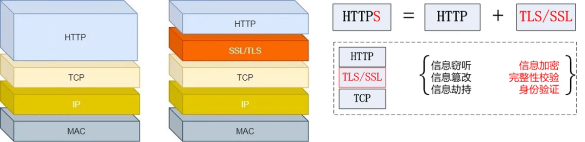

# 2. 什么是 TLS

TLS（Transport Layer Security，安全传输层)，TLS 是建立在传输层 TCP 协议之上的协议，服务于应用层，它的前身是 SSL（Secure Socket Layer，安全套接字层），它实现了将应用层的报文进行加密后再交由 TCP 进行传输的功能。

## 2.1 TLS 的作用

TLS 协议主要解决如下三个网络安全问题。

保密\(message privacy\)，保密通过加密 encryption 实现，所有信息都加密传输，第三方无法嗅探； 
完整性\(message integrity\)，通过MAC校验机制，一旦被篡改，通信双方会立刻发现； 
认证\(mutual authentication\)，双方认证,双方都可以配备证书，防止身份被冒充；

## 2.2 TLS的发展过程

1995: SSL 2.0, 由Netscape提出，这个版本由于设计缺陷，并不安全，很快被发现有严重漏洞，已经废弃
1996: SSL 3.0. 写成RFC，开始流行。目前\(2015年\)已经不安全，必须禁用
1999: TLS 1.0. 互联网标准化组织ISOC接替NetScape公司，发布了SSL的升级版TLS 1.0版 
2006: TLS 1.1. 作为 RFC 4346 发布。主要修复了CBC模式相关的如BEAST攻击等漏洞 
2008: TLS 1.2. 作为 RFC 5246 发布 。增进安全性，目前应该主要部署的版本 
2018: TLS 1.3 作为 RFC 8446 发布 ，大幅增进安全性

**SSL/TLS协议发布时间与网站支持率对比**

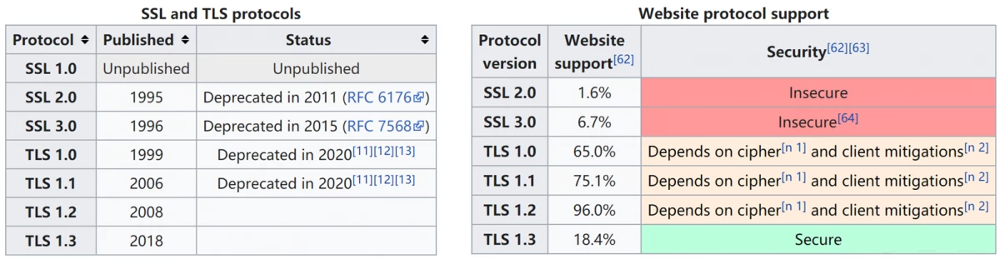 


## 2.3 TLS 报文结构

TLS \(Transport Layer Security\)协议是由TLS 记录协议（TLS Record Protocol）和TLS 握手协议（TLS Handshake Protocol）这两层协议叠加而成的，位于底层的TLS 记录协议负责进行信息传输和认证加密，位于上层的TLS 握手协议则负责除加密以外的其它各种操作，比如密钥协商交换等。上层的TLS 握手协议又可以分为4个子协议，TLS 协议的层次结构如下图所示：
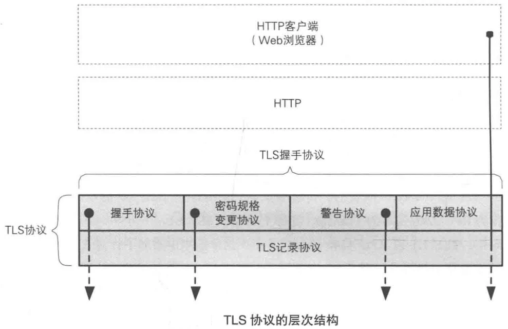 
前面已经介绍了 TLS 协议的认证加密算法，这里先介绍 TLS 记录协议的报文结构，每一条 TLS 记录以一个短标头起始，标头包含记录内容的类型（或子协议)、协议版本和长度，消息数据紧跟在标头之后，如下图所示：

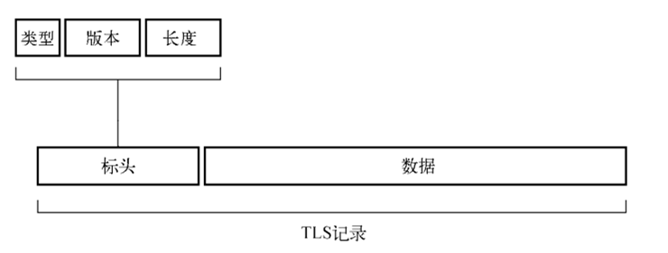
了解了 TLS 记录报文结构，前面也介绍了认证加密过程，下面以 AES-GCM 为例，看看密文（消息明文 AES-CNT 加密而来，当不需要对消息加密时，此处保持明文即可）和 MAC（将序列号、标头等附加信息与密文一起通过 Galois-MAC 计算而来)是如何添加进 TLS 记录报文的：

上图中的几个字段作用如下：

- 序列号：任一端都有自身的序列号并跟踪来自另一端 TLS 记录的数量，能确保消息不被重放攻击；
- 标头：将标头作为计算 GMAC 输入的一部分，能确保未进行加密的标头不会遭受篡改；
- nonce：在加密通信中仅使用一次的密钥，比如前面介绍过的 IV\(Initialization Vector\) 或 CTR 初始值。

# 3. RT-Thread使用TLS

目前常用的 TLS 方式：MbedTLS、OpenSSL、s2n 等，但是对于不同的加密方式，需要使用其指定的加密接口和流程进行加密，对于部分应用层协议的移植较为复杂。因此 SAL TLS 功能产生，主要作用是提供 Socket 层面的 TLS 加密传输特性，抽象多种 TLS 处理方式，提供统一的接口用于完成 TLS 数据交互。

## 3.1 RT-Thread SAL TLS 功能使用方式

使用流程如下：
配置开启任意网络协议栈支持（如 lwIP 协议栈）；

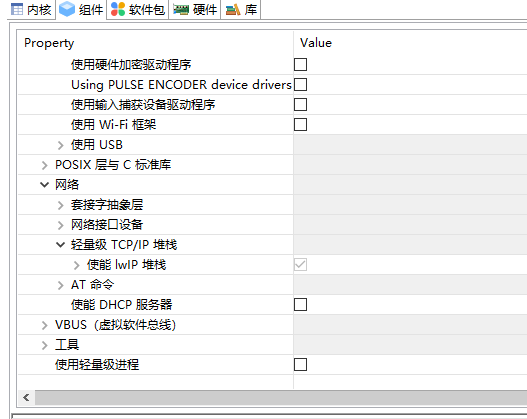
配置开启 MbedTLS 软件包（目前RT-Thread只支持 MbedTLS 类型加密方式）；
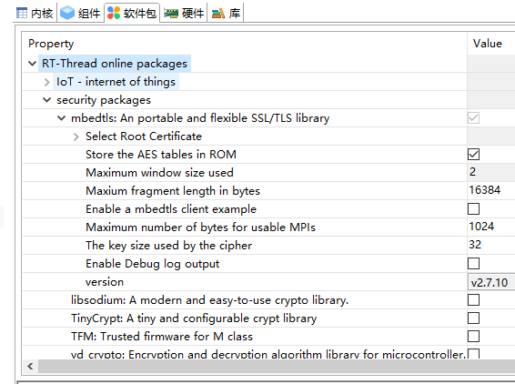
配置开启 SAL\_TLS 功能支持（如下配置选项章节所示）；
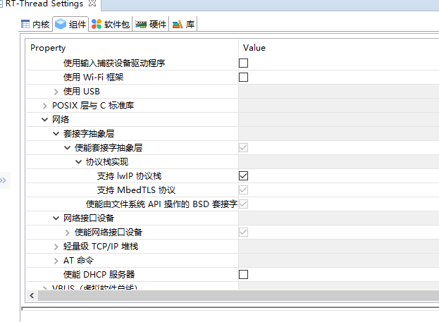
配置完成之后，只要在 socket 创建时传入的 protocol 类型使用 PROTOCOL\_TLS 或 **PROTOCOL\_DTLS** ，即可使用标准 BSD Socket API 接口，完成 TLS 连接的建立和数据的收发。示例代码如下所示：

```c
#include <stdio.h>
#include <string.h>

#include <rtthread.h>
#include <sys/socket.h>
#include <netdb.h>

/* RT-Thread 官网，支持 TLS 功能 */
#define SAL_TLS_HOST    "www.rt-thread.org"
#define SAL_TLS_PORT    443
#define SAL_TLS_BUFSZ   1024

static const char *send_data = "GET /download/rt-thread.txt HTTP/1.1\r\n"
    "Host: www.rt-thread.org\r\n"
    "User-Agent: rtthread/4.0.1 rtt\r\n\r\n";

void sal_tls_test(void)
{
    int ret, i;
    char *recv_data;
    struct hostent *host;
    int sock = -1, bytes_received;
    struct sockaddr_in server_addr;

    /* 通过函数入口参数url获得host地址（如果是域名，会做域名解析） */
    host = gethostbyname(SAL_TLS_HOST);

    recv_data = rt_calloc(1, SAL_TLS_BUFSZ);
    if (recv_data == RT_NULL)
    {
        rt_kprintf("No memory\n");
        return;
    }

    /* 创建一个socket，类型是SOCKET_STREAM，TCP 协议, TLS 类型 */
    if ((sock = socket(AF_INET, SOCK_STREAM, PROTOCOL_TLS)) < 0)
    {
        rt_kprintf("Socket error\n");
        goto __exit;
    }

    /* 初始化预连接的服务端地址 */
    server_addr.sin_family = AF_INET;
    server_addr.sin_port = htons(SAL_TLS_PORT);
    server_addr.sin_addr = *((struct in_addr *)host->h_addr);
    rt_memset(&(server_addr.sin_zero), 0, sizeof(server_addr.sin_zero));

    if (connect(sock, (struct sockaddr *)&server_addr, sizeof(struct sockaddr)) < 0)
    {
        rt_kprintf("Connect fail!\n");
        goto __exit;
    }

    /* 发送数据到 socket 连接 */
    ret = send(sock, send_data, strlen(send_data), 0);
    if (ret <= 0)
    {
        rt_kprintf("send error,close the socket.\n");
        goto __exit;
    }

    /* 接收并打印响应的数据，使用加密数据传输 */
    bytes_received = recv(sock, recv_data, SAL_TLS_BUFSZ  - 1, 0);
    if (bytes_received <= 0)
    {
        rt_kprintf("received error,close the socket.\n");
        goto __exit;
    }

    rt_kprintf("recv data:\n");
    for (i = 0; i < bytes_received; i++)
    {
        rt_kprintf("%c", recv_data[i]);
    }

__exit:
    if (recv_data)
        rt_free(recv_data);

    if (sock >= 0)
        closesocket(sock);
}

#ifdef FINSH_USING_MSH
#include <finsh.h>
MSH_CMD_EXPORT(sal_tls_test, SAL TLS function test);
#endif /* FINSH_USING_MSH */
```

# 4. RT-Thread 基于 SAL 接口的 TLS 实现

## 4.1 TLS 接口注册

TLS \(Transport Layer Security\) 安全传输层协议主要用于通信数据的加密，并不影响 SAL 向上提供的接口。RT-Thread 使用的 TLS 组件时 mbedtls（一个由 ARM 公司使用 C 语言实现和维护的 SSL/TLS 算法库），如果启用了 TLS 组件，SAL 层的实现函数中会自动调用 mbedtls 的接口函数，实现数据的加密传输。

RT-Thread 的 SAL 接口的 TLS 协议的数据结构描述与需要向其注册的接口函数集合如下：

```c
// .\rt-thread\components\net\sal_socket\include\sal_tls.h

struct sal_proto_tls
{
    char name[RT_NAME_MAX];                      /* TLS protocol name */
    const struct sal_proto_tls_ops *ops;         /* SAL TLS protocol options */
};

struct sal_proto_tls_ops
{
    int (*init)(void);
    void* (*socket)(int socket);
    int (*connect)(void *sock);
    int (*send)(void *sock, const void *data, size_t size);
    int (*recv)(void *sock, void *mem, size_t len);
    int (*closesocket)(void *sock);

    int (*set_cret_list)(void *sock, const void *cert, size_t size);              /* Set TLS credentials */
    int (*set_ciphersurite)(void *sock, const void* ciphersurite, size_t size);   /* Set select ciphersuites */
    int (*set_peer_verify)(void *sock, const void* peer_verify, size_t size);     /* Set peer verification */
    int (*set_dtls_role)(void *sock, const void *dtls_role, size_t size);         /* Set role for DTLS */
};
```

sal\_proto\_tls 对象的初始化和注册过程如下，（注册相关函数代码位于 rt-thread/components/ne/tsal\_socket/impl/proto\_mbedtls.c ）：

```c
// .\rt-thread\components\net\sal_socket\impl\proto_mbedtls.c

static const struct sal_proto_tls_ops mbedtls_proto_ops= 
{
    RT_NULL,
    mebdtls_socket,
    mbedtls_connect,
    (int (*)(void *sock, const void *data, size_t size)) mbedtls_client_write,
    (int (*)(void *sock, void *mem, size_t len)) mbedtls_client_read,
    mbedtls_closesocket,
};

static const struct sal_proto_tls mbedtls_proto =
{
    "mbedtls",
    &mbedtls_proto_ops,
};

int sal_mbedtls_proto_init(void)
{
    /* register MbedTLS protocol options to SAL */
    sal_proto_tls_register(&mbedtls_proto);

    return 0;
}
INIT_COMPONENT_EXPORT(sal_mbedtls_proto_init);

// .\rt-thread\components\net\sal_socket\src\sal_socket.c

#ifdef SAL_USING_TLS
/* The global TLS protocol options */
static struct sal_proto_tls *proto_tls;
#endif

#ifdef SAL_USING_TLS
int sal_proto_tls_register(const struct sal_proto_tls *pt)
{
    RT_ASSERT(pt);
    proto_tls = (struct sal_proto_tls *) pt;

    return 0;
}
#endif
```

变量 proto\_tls 在文件 sal\_socket.c 中属于全局变量（被 static 修饰，仅限于本文件内），该文件是 SAL 组件对外访问接口函数的实现文件。也就是说，我们启用 TLS 协议后，SAL 组件对外提供的访问接口函数实现代码中就会调用 TLS 接口，完成数据的加密传输，而且该组件的注册是被自动初始化的，比较省心。

## 4.2 SAL 对外提供的访问接口

SAL 组件初始化并注册成功后，我们就可以使用 SAL 提供的接口进行应用开发了，先看看 SAL 组件提供了哪些访问接口：

```c
// .\rt-thread\components\net\sal_socket\include\sal_socket.h

int sal_accept(int socket, struct sockaddr *addr, socklen_t *addrlen);
int sal_bind(int socket, const struct sockaddr *name, socklen_t namelen);
int sal_shutdown(int socket, int how);
int sal_getpeername (int socket, struct sockaddr *name, socklen_t *namelen);
int sal_getsockname (int socket, struct sockaddr *name, socklen_t *namelen);
int sal_getsockopt (int socket, int level, int optname, void *optval, socklen_t *optlen);
int sal_setsockopt (int socket, int level, int optname, const void *optval, socklen_t optlen);
int sal_connect(int socket, const struct sockaddr *name, socklen_t namelen);
int sal_listen(int socket, int backlog);
int sal_recvfrom(int socket, void *mem, size_t len, int flags,
      struct sockaddr *from, socklen_t *fromlen);
int sal_sendto(int socket, const void *dataptr, size_t size, int flags,
    const struct sockaddr *to, socklen_t tolen);
int sal_socket(int domain, int type, int protocol);
int sal_closesocket(int socket);
int sal_ioctlsocket(int socket, long cmd, void *arg);
```

```c
// .\rt-thread\components\net\sal_socket\include\sal_netdb.h

struct hostent *sal_gethostbyname(const char *name);

int sal_gethostbyname_r(const char *name, struct hostent *ret, char *buf,
                size_t buflen, struct hostent **result, int *h_errnop);
void sal_freeaddrinfo(struct addrinfo *ai);
int sal_getaddrinfo(const char *nodename,
       const char *servname,
       const struct addrinfo *hints,
       struct addrinfo **res);
```

如果不习惯使用 SAL 层提供的 sal\_xxx 形式的接口，SAL 还为我们进行了再次封装，将其封装为比较通用的 BSD Socket API，封装后的接口如下：

```c
// .\rt-thread\components\net\sal_socket\include\socket\sys_socket\sys\socket.h

#ifdef SAL_USING_POSIX
int accept(int s, struct sockaddr *addr, socklen_t *addrlen);
int bind(int s, const struct sockaddr *name, socklen_t namelen);
int shutdown(int s, int how);
int getpeername(int s, struct sockaddr *name, socklen_t *namelen);
int getsockname(int s, struct sockaddr *name, socklen_t *namelen);
int getsockopt(int s, int level, int optname, void *optval, socklen_t *optlen);
int setsockopt(int s, int level, int optname, const void *optval, socklen_t optlen);
int connect(int s, const struct sockaddr *name, socklen_t namelen);
int listen(int s, int backlog);
int recv(int s, void *mem, size_t len, int flags);
int recvfrom(int s, void *mem, size_t len, int flags,
      struct sockaddr *from, socklen_t *fromlen);
int send(int s, const void *dataptr, size_t size, int flags);
int sendto(int s, const void *dataptr, size_t size, int flags,
    const struct sockaddr *to, socklen_t tolen);
int socket(int domain, int type, int protocol);
int closesocket(int s);
int ioctlsocket(int s, long cmd, void *arg);
#else
#define accept(s, addr, addrlen)                           sal_accept(s, addr, addrlen)
#define bind(s, name, namelen)                             sal_bind(s, name, namelen)
#define shutdown(s, how)                                   sal_shutdown(s, how)
#define getpeername(s, name, namelen)                      sal_getpeername(s, name, namelen)
#define getsockname(s, name, namelen)                      sal_getsockname(s, name, namelen)
#define getsockopt(s, level, optname, optval, optlen)      sal_getsockopt(s, level, optname, optval, optlen)
#define setsockopt(s, level, optname, optval, optlen)      sal_setsockopt(s, level, optname, optval, optlen)
#define connect(s, name, namelen)                          sal_connect(s, name, namelen)
#define listen(s, backlog)                                 sal_listen(s, backlog)
#define recv(s, mem, len, flags)                           sal_recvfrom(s, mem, len, flags, NULL, NULL)
#define recvfrom(s, mem, len, flags, from, fromlen)        sal_recvfrom(s, mem, len, flags, from, fromlen)
#define send(s, dataptr, size, flags)                      sal_sendto(s, dataptr, size, flags, NULL, NULL)
#define sendto(s, dataptr, size, flags, to, tolen)         sal_sendto(s, dataptr, size, flags, to, tolen)
#define socket(domain, type, protocol)                     sal_socket(domain, type, protocol)
#define closesocket(s)                                     sal_closesocket(s)
#define ioctlsocket(s, cmd, arg)                           sal_ioctlsocket(s, cmd, arg)
#endif /* SAL_USING_POSIX */
```

```c
// .\rt-thread\components\net\sal_socket\include\socket\netdb.h

struct hostent *gethostbyname(const char *name);

int gethostbyname_r(const char *name, struct hostent *ret, char *buf,
                size_t buflen, struct hostent **result, int *h_errnop);
void freeaddrinfo(struct addrinfo *ai);
int getaddrinfo(const char *nodename,
       const char *servname,
       const struct addrinfo *hints,
       struct addrinfo **res);
```

BSD Socket API 也是我们进行网络应用开发时最常使用的接口，如果要使用这些接口，除了启用相应的宏定义，还需要包含这些接口所在的两个头文件。

# 5. RT-Thread TLS拓展

## 5.1 Wireshark 抓取 TLS 报文

### 5.1.1 配置抓包环境

1. SG105 Pro 网关交换机配置
   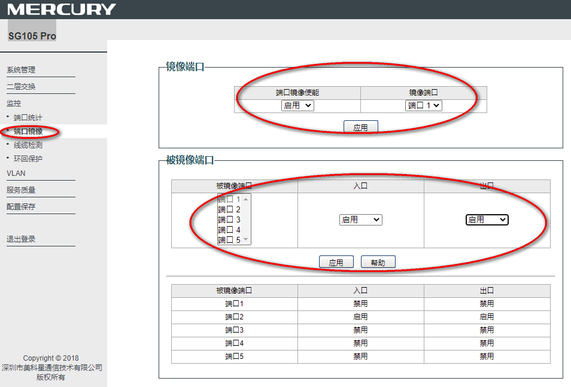
    按照图片所示配置配置网关交换机的端口镜像功能，这样端口 1 连接 PC，端口 2 连接开发板，开发板所有数据包都可以通过 PC 端的 wireshark 软件抓取。
2. PC 端 Wireshark 配置
   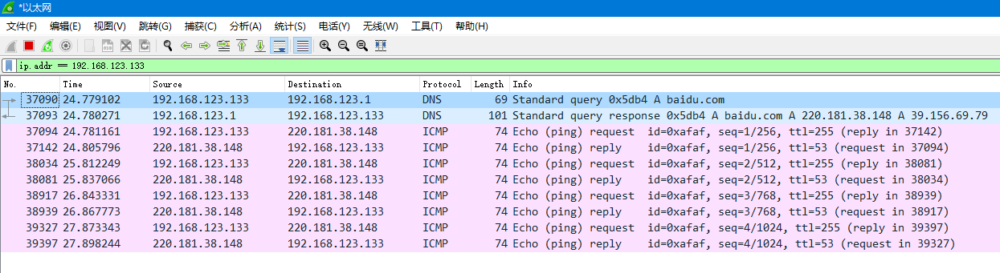
    设置 IP 地址过滤 ( ip.addr == xxx.xxx.xxx.xxx， 其中 ip 地址为开发板 ip 地址)
3. webclient 抓包 http 协议，所有数据都是明文，没有加密

```c
#include <rtthread.h>
#include <webclient.h>

#define GET_HEADER_BUFSZ               1024
#define GET_RESP_BUFSZ                 1024

#define GET_LOCAL_URI                  "http://www.rt-thread.com/service/rt-thread.txt"

/* send HTTP GET request by common request interface, it used to receive longer data */
static int webclient_get_comm(const char *uri)
```

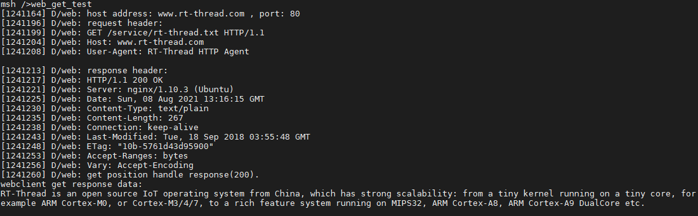
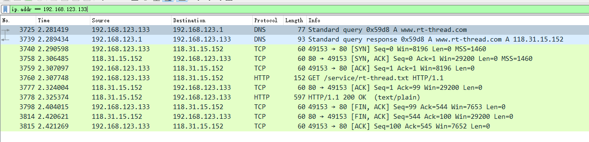
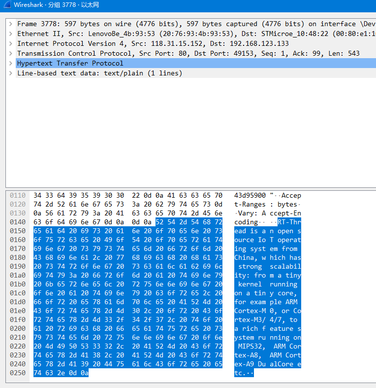  

4. webclient 抓包 https 协议，密文数据

```c
#include <rtthread.h>
#include <webclient.h>

#define GET_HEADER_BUFSZ               1024
#define GET_RESP_BUFSZ                 1024

#define GET_LOCAL_URI                  "https://www.rt-thread.com/service/rt-thread.txt"

/* send HTTP GET request by common request interface, it used to receive longer data */
static int webclient_get_comm(const char *uri)
```

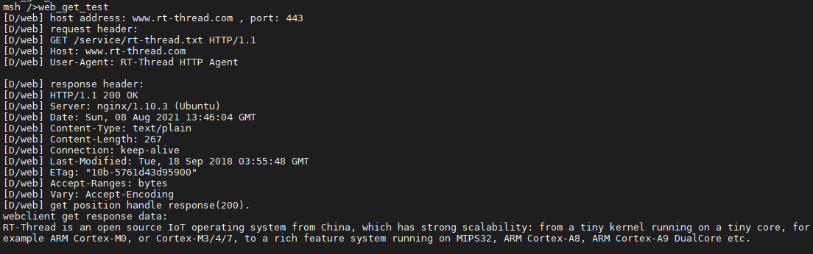
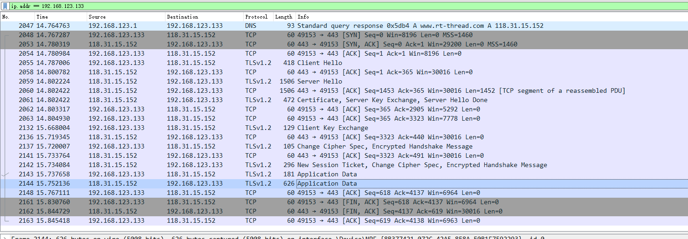
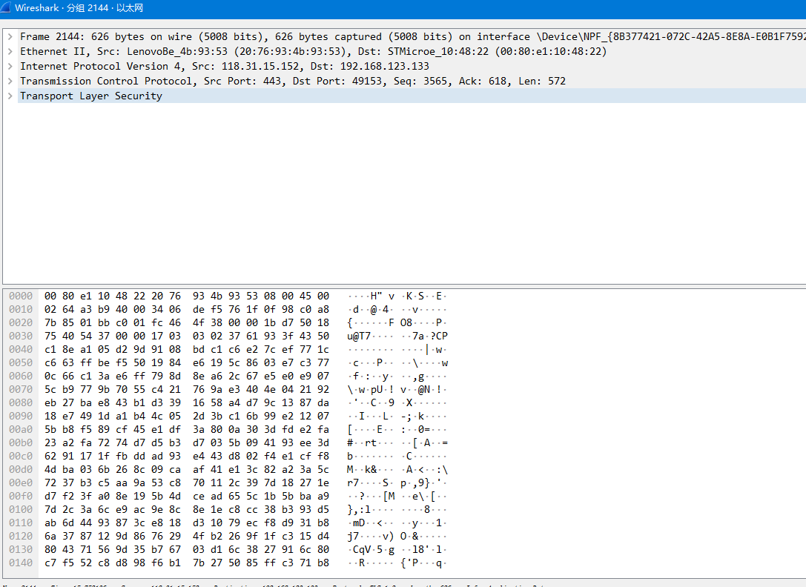