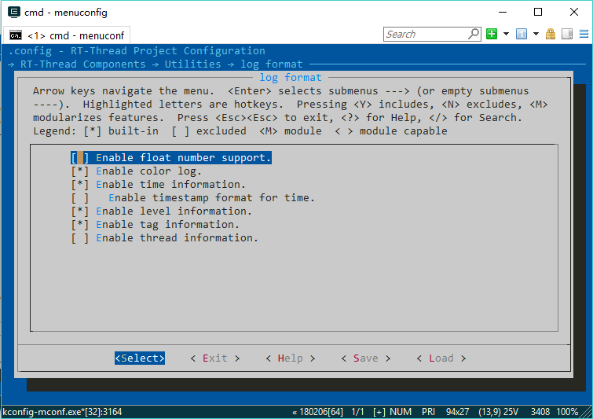
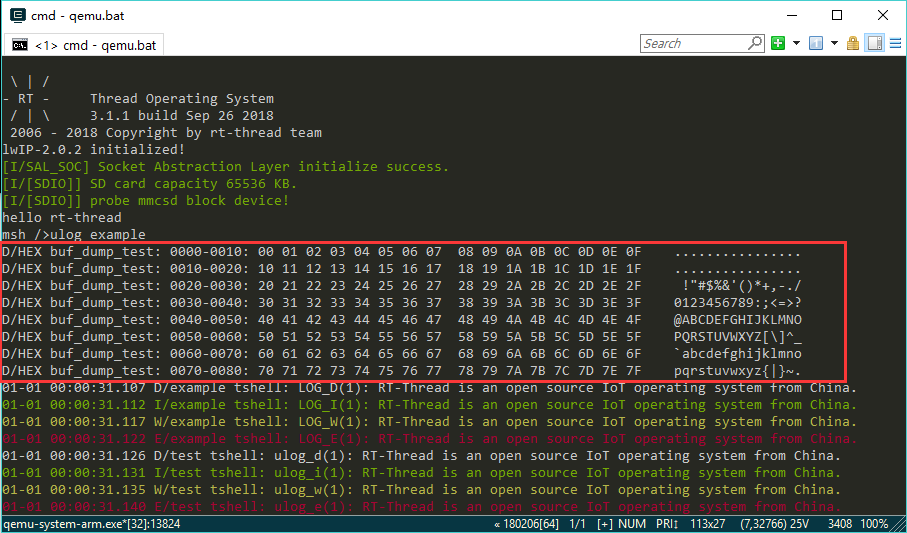

# ulog 日志

## ulog 简介

**日志的定义**：日志是将软件运行的状态、过程等信息，输出到不同的介质中（例如：文件、控制台、显示屏等），并进行显示和保存。为软件调试、维护过程中的问题追溯、性能分析、系统监控、故障预警等功能，提供参考依据。可以说，日志的使用，几乎占用的软件生命周期的至少 80% 的时间。

**日志的重要性**：对于操作系统而言，由于其软件的复杂度非常大，单步调试在一些场景下并不适合，所以日志组件在操作系统上几乎都是标配。完善的日志系统也能让操作系统的调试事半功倍。

**ulog 的起源**: RT-Thread 一直缺少小巧、实用的日志组件，而 ulog 的诞生补全了这块的短板。它将作为 RT-Thread 的基础组件被开源出来，让我们的开发者也能用上简洁易用的日志系统，提高开发效率。

ulog 是一个非常简洁、易用的 C/C++ 日志组件，第一个字母 u 代表 μ，即微型的意思。它能做到最低**ROM<1K, RAM<0.2K**的资源占用。ulog 不仅有小巧体积，同样也有非常全面的功能，其设计理念参考的是另外一款 C/C++ 开源日志库：EasyLogger（简称 elog），并在功能和性能等方面做了非常多的改进。主要特性如下：

* 日志输出的后端多样化，可支持例如：串口、网络，文件、闪存等后端形式。

* 日志输出被设计为线程安全的方式，并支持异步输出模式。

* 日志系统高可靠，在中断 ISR 、Hardfault 等复杂环境下依旧可用。

* 日志支持运行期 / 编译期设置输出级别。

* 日志内容支持按关键词及标签方式进行全局过滤。

* API 和日志格式可兼容 linux syslog。

* 支持以 hex 格式 dump 调试数据到日志中。

* 兼容 rtdbg （RTT 早期的日志头文件）及 EasyLogger 的日志输出 API。

### ulog 架构

下图为 ulog 日志组件架构图：


* **前端**：该层作为离应用最近的一层，给用户提供了 syslog 及 LOG_X 两类 API 接口，方便用户在不同的场景中使用。

* **核心**：中间核心层的主要工作是将上层传递过来的日志，按照不同的配置要求进行格式化与过滤然后生成日志帧，最终通过不同的输出模块，输出到最底层的后端设备上。

* **后端**：接收到核心层发来的日志帧后，将日志输出到已经注册的日志后端设备上，例如：文件、控制台、日志服务器等等。

### 配置选项 ###

ENV 工具中使用 menuconfig 配置 ulog 的路径如下所示：

```c
 RT-Thread Components → Utilities → Enable ulog
```

 ulog 配置选项说明如下所示，一般情况下使用默认配置即可：

```c
[*] Enable ulog                   /* 使能 ulog */
      The static output log level./* 选择静态的日志输出级别。选择完成后，比设定级别低的日志（这里特指使用 LOG_X API 的日志）将不会被编译到 ROM 中 */
[ ]   Enable ISR log.             /* 使能中断 ISR 日志，即在 ISR 中也可以使用日志输出 API */
[*]   Enable assert check.        /* 使能断言检查。关闭后，断言的日志将不会被编译到 ROM 中 */
(128) The log's max width.        /* 日志的最大长度。由于 ulog 的日志 API 按行作为单位，所以这个长度也代表一行日志的最大长度 */
[ ]   Enable async output mode.   /* 使能异步日志输出模式。开启这个模式后，日志不会立刻输出到后端，而是先缓存起来，然后交给日志输出线程（例如：idle 线程）去输出 */
      log format  --->            /* 配置日志的格式，例如：时间信息，颜色信息，线程信息，是否支持浮点等等 */
[*]   Enable console backend.     /* 使能控制台作为后端。使能后日志可以输出到控制台串口上。建议保持开启。 */
[ ]   Enable runtime log filter.  /* 使能运行时的日志过滤器，即动态过滤。使能后，日志将支持按标签、关键词等方式，在系统运行时进行动态过滤。 */
```

**配置日志的格式（log format）选项描述如下所示：**

```c
[ ] Enable float number support. It will using more thread stack.   /* 浮点型数字的支持（传统的 rtdbg/rt_kprintf 均不支持浮点数日志） */
    [*] Enable color log.                   /* 带颜色的日志 */
    [*] Enable time information.            /* 时间信息 */
    [ ]   Enable timestamp format for time. /* 包括时间戳 */
    [*] Enable level information.           /* 级别信息 */
    [*] Enable tag information.             /* 标签信息 */
    [ ] Enable thread information.          /* 线程信息 */
```

### 日志级别

日志级别代表了日志的重要性，在 ulog 中由高到低，有如下几个日志级别：

| **级别**        | **名称** | **描述**           |
| ------------ | ---- | ----------------------- |
| LOG_LVL_ASSERT  | 断言 | 发生无法处理、致命性的的错误，以至于系统无法继续运行的断言日志 |
| LOG_LVL_ERROR   | 错误 | 发生严重的、**不可修复**的错误时输出的日志属于错误级别日志  |
| LOG_LVL_WARNING | 警告 | 出现一些不太重要的、具有**可修复性**的错误时，会输出这些警告日志 |
| LOG_LVL_INFO    | 信息 | 给本模块上层使用人员查看的重要提示信息日志，例如：初始化成功，当前工作状态等。该级别日志一般在量产时依旧**保留**|
| LOG_LVL_DBG     | 调试 | 给本模块开发人员查看的调试日志，该级别日志一般在量产时**关闭**|

在 ulog 中日志级别还有如下分类：

* **静态级别与动态级别**：按照日志是否可以在运行阶段修改进行分类。可在运行阶段修改的称之为动态级别，只能在**编译阶段**修改的称之为静态级别。比静态级别低的日志（这里特指使用 LOG_X API 的日志）将不会被编译到 ROM 中，最终也不会输出、显示出来。而动态级别可以管控的是高于或等于静态级别的日志。在 ulog 运行时，比动态级别低的日志会被过滤掉。

* **全局级别与模块级别**：按照作用域进行的分类。在 ulog 中每个文件（模块）也可以设定独立的日志级别。全局级别作用域大于模块级别，也就是模块级别只能管控那些高于或等于全局级别的模块日志。

综合上面分类可以看出，在 ulog 可以通过以下 4 个方面来设定日志的输出级别：

* **全局静态**日志级别：在 menuconfig 中配置，对应 `ULOG_OUTPUT_LVL` 宏。

* **全局动态**日志级别：使用 `void ulog_global_filter_lvl_set(rt_uint32_t level)` 函数来设定。

* **模块静态**日志级别：在模块（文件）内定义 `LOG_LVL` 宏，与日志标签宏 `LOG_TAG` 定义方式类似。

* **模块动态**日志级别：使用 `int ulog_tag_lvl_filter_set(const char *tag, rt_uint32_t level)` 函数来设定。

它们的作用范围关系为：**全局静态**>**全局动态**>**模块静态**>**模块动态**。

### 日志标签

由于日志输出量的不断增大，为了避免日志被杂乱无章的输出出来，就需要使用标签（tag）给每条日志进行分类。标签的定义是按照**模块化**的方式，例如：Wi-Fi 组件包括设备驱动（wifi_driver）、设备管理（wifi_mgnt）等模块，则 Wi-Fi 组件内部模块可以使用 `wifi.driver`、`wifi.mgnt` 等作为标签，进行日志的分类输出。

每条日志的标签属性也可以被输出并显示出来，同时 ulog 还可以设置每个标签（模块）对应日志的输出级别，当前不重要模块的日志可以选择性关闭，不仅降低 ROM 资源，还能帮助开发者过滤无关日志。

参见 `rt-thread\examples\ulog_example.c` ulog 例程文件，在文件顶部有定义 `LOG_TAG` 宏：

```c
#define LOG_TAG     "example"     // 该模块对应的标签。不定义时，默认：NO_TAG
#define LOG_LVL     LOG_LVL_DBG   // 该模块对应的日志输出级别。不定义时，默认：调试级别
#include <ulog.h>                 // 必须在 LOG_TAG 与 LOG_LVL 下面
```

需要注意的，定义日志标签必须位于 `#include <ulog.h>` 的上方，否则会使用默认的 `NO_TAG`（不推荐定义在头文件中定义这些宏）。

日志标签的作用域是当前源码文件，项目源代码通常也会按照模块进行文件分类。所以在定义标签时，可以指定模块名、子模块名作为标签名称，这样不仅在日志输出显示时清晰直观，也能方便后续按标签方式动态调整级别或过滤。

## 日志初始化

### 初始化

```c
int ulog_init(void)
```

| **返回** | **描述**            |
| :-----   | :-----                        |
|>=0     | 成功                           |
|-5        | 失败，内存不足                  |

在使用 ulog 前必须调用该函数完成 ulog 初始化。如果开启了组件自动初始化，该函数也将被自动调用。

### 去初始化

```c
void ulog_deinit(void)
```

当 ulog 不再使用时，可以执行该 deinit 释放资源。

## 日志输出 API

ulog 主要有两种日志输出宏 API，源代码中定义如下所示：

```c
#define LOG_E(...)                           ulog_e(LOG_TAG, __VA_ARGS__)
#define LOG_W(...)                           ulog_w(LOG_TAG, __VA_ARGS__)
#define LOG_I(...)                           ulog_i(LOG_TAG, __VA_ARGS__)
#define LOG_D(...)                           ulog_d(LOG_TAG, __VA_ARGS__)
#define LOG_RAW(...)                         ulog_raw(__VA_ARGS__)
#define LOG_HEX(name, width, buf, size)      ulog_hex(name, width, buf, size)
```

* 宏 `LOG_X(...)`：`X` 对应的是不同级别的第一个字母大写。参数 `...` 为日志内容，格式与 printf 一致。这种方式是首选，一方面因为其 API 格式简单，入参只有一个即日志信息，再者还支持按模块静态日志级别过滤。

* 宏 `ulog_x(LOG_TAG, __VA_ARGS__)`：`x` 对应的是不同级别的简写。参数 `LOG_TAG` 为日志标签，参数 `...` 为日志内容，格式与 printf 一致。这个 API 适用于在一个文件中使用不同 tag 输出日志的情况。

|  **API**  |**描述**                                |
|-------------------------|--------------------------|
| LOG_E(...)| 错误级别日志                         |
| LOG_W(...) | 错误级别日志    |
| LOG_I(...) | 提示级别日志   |
| LOG_D(...)| 调试级别日志                |
| LOG_RAW(...) | 输出 raw 日志   |
| LOG_HEX(name, width, buf, size)| 输出 16 进制格式数据到日志    |

`LOG_X` 及 `ulog_x` 这类 API 输出都是带格式日志，有些时候需要输出不带任何格式的日志时，可以使用 `LOG_RAW`  或 `ulog_raw()` 。例如：

```c
LOG_RAW("\r");
ulog_raw("\033[2A");
```

以 16 进制 hex 格式 dump 数据到日志中可使用可以使用 `LOG_HEX()`  或 `ulog_hex` 。函数参数及描述如下所示：

| **参数**  | **描述**                        |
| ---- | -------------------------- |
| tag   | 日志标签                    |
| width | 一行 hex 内容的宽度（数量） |
| buf   | 待输出的数据内容            |
| size  | 数据大小                    |

hexdump 日志为 DEBUG 级别，支持运行期的级别过滤，hexdump 日志对应的 tag ，支持运行期的标签过滤。

ulog 也提供里断言 API ：`ASSERT(表达式)` ，当断言触发时，系统会停止运行，内部也会执行 `ulog_flush()` ，所有日志后端将执行 flush 。如果开启了异步模式，缓冲区中所有的日志也将被 flush 。断言的使用示例如下：

```
void show_string(const char *str)
{
    ASSERT(str);
    ...
}
```

## 日志使用示例

### 使用示例

下面将以 ulog 例程进行介绍，打开 `rt-thread\examples\ulog_example.c` 可以看到，顶部有定义该文件的标签及静态优先级。

```c
#define LOG_TAG              "example"
#define LOG_LVL              LOG_LVL_DBG
#include <ulog.h>
```

在 `void ulog_example(void)` 函数中有使用 `LOG_X` API ，大致如下：

```c
/* output different level log by LOG_X API */
LOG_D("LOG_D(%d): RT-Thread is an open source IoT operating system from China.", count);
LOG_I("LOG_I(%d): RT-Thread is an open source IoT operating system from China.", count);
LOG_W("LOG_W(%d): RT-Thread is an open source IoT operating system from China.", count);
LOG_E("LOG_E(%d): RT-Thread is an open source IoT operating system from China.", count);
```

这些日志输出 API 均支持 printf 格式，并且会在日志末尾自动换行。

下面将在 qemu 上展示下 ulog 例程的运行效果：

- 将 `rt-thread\examples\ulog_example.c` 拷贝至 `rt-thread\bsp\qemu-vexpress-a9\applications` 文件夹下
- 在 Env 中进入 `rt-thread\bsp\qemu-vexpress-a9` 目录
- 确定之前已执行过 ulog 的配置后，执行 `scons` 命令并等待编译完成
- 运行 `qemu.bat` 来打开 RT-Thread 的 qemu 模拟器
- 输入 `ulog_example` 命令，即可看到 ulog 例程运行结果，大致效果如下图


可以看到每条日志都是按行显示，不同级别日志也有着不同的颜色。在日志最前面有当前系统的 tick ，中间有显示日志级别及标签，最后面是具体的日志内容。在本文后面也会重点介绍这些日志格式及配置说明。

### 在中断 ISR 中使用

很多时候需要在中断 ISR 中输出日志，但是中断 ISR 可能会打断正在进行日志输出的线程。要保证中断日志与线程日志互不干涉，就得针对于中断情况进行特殊处理。

ulog 已集成中断日志的功能，但是默认没有开启，使用时打开 `Enable ISR log` 选项即可，日志的 API 与线程中使用的方式一致，例如：

```c
#define LOG_TAG              "driver.timer"
#define LOG_LVL              LOG_LVL_DBG
#include <ulog.h>

void Timer2_Handler(void)
{
    /* enter interrupt */
    rt_interrupt_enter();

    LOG_D("I'm in timer2 ISR");

    /* leave interrupt */
    rt_interrupt_leave();
}

```

这里说明下中断日志在 ulog 处于同步模式与异步模式下的不同策略：

-**同步模式下**：如果线程此时正在输出日志时来了中断，此时如果中断里也有日志要输出，会直接输出到控制台上，不支持输出到其他后端；
-**异步模式下**：如果发生上面的情况，中断里的日志会先放入缓冲区中，最终和线程日志一起交给日志输出线程来处理。

### 设置日志格式

ulog 支持的日志格式可以在 menuconfig 中配置，位于 `RT-Thread Components` → `Utilities` →  `ulog` →  `log format`，具体配置如下：



分别可以配置：浮点型数字的支持（传统的 rtdbg/rt_kprintf 均不支持浮点数日志）、带颜色的日志、时间信息（包括时间戳）、级别信息、标签信息、线程信息。下面我们将这些选项**全部选中**，保存后重新编译并在 qemu 中再次运行 ulog 例程，看下实际的效果：


可以看出，相比第一次运行例程，时间信息已经由系统的 tick 数值变为时间戳信息，并且线程信息也已被输出出来。

### hexdump 输出使用

hexdump 也是日志输出时较为常用的功能，通过 hexdump 可以将一段数据以 hex 格式输出出来，对应的 API 为：`void ulog_hexdump(const char *tag, rt_size_t width, rt_uint8_t *buf, rt_size_t size)` ，下面看下具体的使用方法及运行效果：

```c
/* 定义一个 128 个字节长度的数组 */
uint8_t i, buf[128];
/* 在数组内填充上数字 */
for (i = 0; i < sizeof(buf); i++)
{
    buf[i] = i;
}
/* 以 hex 格式 dump 数组内的数据，宽度为 16 */
ulog_hexdump("buf_dump_test", 16, buf, sizeof(buf));
```

可以将上面的代码拷贝到 ulog 例程中运行，然后再看下实际运行结果：



可以看出，中部为  buf 数据的 16 进制 hex 信息，最右侧为各个数据对应的字符信息。

## 日志高级功能

在了解了前面小节对日志的 介绍，ulog 的基本功能都可以掌握了。为了让大家更好的玩转 ulog ，这篇应用笔记会重点跟大家介绍 ulog 的高级功能及一些日志调试的经验和技巧。学会这些高级用法以后，开发者也能很大程度上提升日志调试的效率。

同时还会介绍 ulog 的高级模式： syslog 模式，这个模式能做到从前端 API 到日志格式对于 Linux syslog 的完全兼容，极大的方便从 Linux 上的迁移过来的软件。

### 日志后端


讲到后端，我们来回顾下 ulog 的框架图。通过上图可以看出， ulog 是采用前后端分离的设计，前后端无依赖。并且支持的后端多样化，无论什么样后端，只要实现出来，都可以注册上去。

目前 ulog 已集成控制台后端，即传统的输出 `rt_kprintf` 打印日志的设备。ulog 还支持 Flash 后端，与 EasyFlash 无缝结合，详见其软件包（[点击查看](https://github.com/armink-rtt-pkgs/ulog_easyflash_be)）。后期 ulog 还会增加文件后端、网络后端等后端的实现。当然，如果有特殊需求，用户也可以自己来实现后端。

#### 注册后端设备

```c
rt_err_t ulog_backend_register(ulog_backend_t backend, const char *name, rt_bool_t support_color)
```

| **参数**     | **描述**                           |
| :-----   | :-----                        |
|backend  | 要注册的后端设备句柄    |
|name| 后端设备名称 |
|support_color| 是否支持彩色日志 |
|**返回**|--                     |
|>=0     | 成功                           |

该函数用于将后端设备注册到 ulog 中，注册前确保后端设备结构体中的函数成员已设置。

#### 注销后端设备

```c
rt_err_t ulog_backend_unregister(ulog_backend_t backend);
```

| **参数**     | **描述**                           |
| :-----   | :-----                        |
|backend  | 要注销的后端设备句柄 |
|**返回**|--                      |
|>=0     | 成功                           |

该函数用于注销已经注册的后端设备。

#### 后端实现及注册示例

下面以控制台后端为例，简单介绍后端的实现方法及注册方法。

打开 `rt-thread/components/utilities/ulog/backend/console_be.c` 文件，可以看到大致有如下内容：

```c
#include <rthw.h>
#include <ulog.h>

/* 定义控制台后端设备 */
static struct ulog_backend console;
/* 控制台后端输出函数 */
void ulog_console_backend_output(struct ulog_backend *backend, rt_uint32_t level, const char *tag, rt_bool_t is_raw, const char *log, size_t len)
{
    ...
    /* 输出日志到控制台 */
    ...
}
/* 控制台后端初始化 */
int ulog_console_backend_init(void)
{
    /* 设定输出函数 */
    console.output = ulog_console_backend_output;
    /* 注册后端 */
    ulog_backend_register(&console, "console", RT_TRUE);

    return 0;
}
INIT_COMPONENT_EXPORT(ulog_console_backend_init);
```

通过上面的代码可以看出控制台后端的实现非常简单，这里实现了后端设备的 `output` 函数，并将该后端注册到 ulog 里，之后 ulog 的日志都会输出到控制台上。

如果要实现一个比较复杂的后端设备，此时就需要了解后端设备结构体，具体如下：

```c
struct ulog_backend
{
    char name[RT_NAME_MAX];
    rt_bool_t support_color;
    void (*init)  (struct ulog_backend *backend);
    void (*output)(struct ulog_backend *backend, rt_uint32_t level, const char *tag, rt_bool_t is_raw, const char *log, size_t len);
    void (*flush) (struct ulog_backend *backend);
    void (*deinit)(struct ulog_backend *backend);
    rt_slist_t list;
};
```

从这个结构体的角度可以看出，实现后端设备的要求如下：

* `name` 以及 `support_color` 属性可以通过 `ulog_backend_register` 函数在注册时传入。

* `output` 为后端具体的输出函数，所有后端都必须实现接口。

* `init`/`deinit` 可选择性实现，init 会在 register 时调用，deinit 会在 ulog_deinit 时调用。

* `flush` 也是可选择性实现，一些内部输出带缓存的后端需要必须实现该接口 。比如一些带RAM 缓存的文件系统。后端的 flush 一般会在断言、hardfault 等异常情况下由 `ulog_flush` 完成调用。

### 异步日志

在 ulog 中，默认的输出模式是同步模式，在很多场景下用户可能还需要异步模式。用户在调用日志输出 API 时，会将日志缓存到缓冲区中，会有专门负责日志输出的线程取出日志，然后输出到后端。

异步模式和同步模式针对用户而言，在日志 API 使用上是没有差异的，因为 ulog 在底层处理上会有区分。两者的工作原理区别大致如下图所示：


异步模式的优缺点如下：

**优点**：

* 首先日志输出时不会阻塞住当前线程，再加上有些后端输出速率低，所以使用同步输出模式可能影响当前线程的时序，异步模式不存在该问题。

* 其次，由于每个使用日志的线程省略了后端输出的动作，所以这些线程的堆栈开销可能也会减少，从这个角度也可以降低整个系统的资源占用。

* 同步模式下的中断日志只能输出到控制台后端，而异步模式下中断日志可以输出到所有后端去。

**缺点**：首先异步模式需要日志缓冲区。再者异步日志的输出还需要有专门线程来完成，比如：idle 线程或者用户自定义的线程，用法上略显复杂。整体感觉异步模式资源占用会比同步模式要高。

#### 配置选项

在 ENV 工具中使用 menuconfig 进入 ulog 配置选项：

```c
 RT-Thread Components → Utilities → Enable ulog
```

异步模式相关配置选项描述如下所示：

```c
[*]   Enable async output mode.                 /* 使能异步模式 */
(2048)  The async output buffer size.           /* 异步缓冲区大小，默认为 2048*/
[*]     Enable async output by thread.          /* 是否启用 ulog 里异步日志输出线程，该线程运行时将会等待日志通知，然后输出日志到所有的后端。该选项默认开启，如果想要修改为其他线程，例如：idle 线程，可关闭此选项。 */
(1024)    The async output thread stack size.   /* 异步输出线程的堆栈大小，默认为 1024 */
(30)      The async output thread stack priority./* 异步输出线程的优先级，默认为 30*/
```

使用 idle 线程输出时，实现虽然很简单，只需在应用层调用 `rt_thread_idle_sethook(ulog_async_output)` 即可，但也会存在一些限制。

* idle 线程堆栈大小需要根据实际的后端使用情况进行调整。

* 由于在 idle 线程内部不允许执行线程挂起操作，所以 Flash 、网络等后端可能无法基于 idle 线程使用。

#### 使用示例

保存异步输出选项配置，将 `rt-thread\examples\ulog_example.c` 拷贝至 `rt-thread\bsp\qemu-vexpress-a9\applications` 文件夹下。

执行 `scons` 命令并等待编译完成。运行 `qemu.bat` 来打开 RT-Thread 的 qemu 模拟器。
输入 `ulog_example` 命令，即可看到 ulog 例程运行结果，大致效果如下图：


大家如果细心观察可以发现，开启异步模式后，这一些在代码上离得非常近的日志的时间信息几乎是相同的。但在同步模式下，日志使用用户线程来输出，由于日志输出要花一定时间，所以每条日志的时间会有一定的间隔。这里也充分说明了异步日志的输出效率很高，几乎不占用调用者的时间。

### 日志动态过滤器

前面小节有介绍过一些日志的静态过滤功能，静态过滤有其优点比如：节省资源，但很多时候，用户需要在软件运行时动态调整日志的过滤方式，这就可以使用到 ulog 的动态过滤器功能。使用动态过滤器功能需在 menuconfig 中开启 `Enable runtime log filter.` 选项，该选项**默认关闭**。

ulog 支持的动态过滤方式有以下 4 种，并且都有对应的 API 函数及 Finsh/MSH 命令，下面将会逐一介绍。

#### 按模块的级别过滤

```c
int ulog_tag_lvl_filter_set(const char *tag, rt_uint32_t level)
```

| **参数**     | **描述**                            |
| ------- | ------------------------------ |
| tag      | 日志的标签                      |
| level    | 设定的日志级别  |
|**返回**|--                       |
| >=0    | 成功                            |
| -5     | 失败，没有足够的内存            |

* 命令格式： `ulog_tag_lvl <tag> <level>`

这里指的**模块**代表一类具有相同标签属性的日志代码。有些时候需要在运行时动态的修改某一个模块的日志输出级别。

参数 level 日志级别可取如下值：

|**级别**             |**名称**            |
| --------------------- | ---------------- |
| LOG_LVL_ASSERT        | 断言             |
| LOG_LVL_ERROR         | 错误             |
| LOG_LVL_WARNING       | 警告             |
| LOG_LVL_INFO          | 信息             |
| LOG_LVL_DBG           | 调试             |
| LOG_FILTER_LVL_SILENT | 静默（停止输出） |
| LOG_FILTER_LVL_ALL    | 全部             |

函数调用与命令示例如下所示：

| 功能        | 函数调用            | 执行命令              |
| ---------------- | ------------------------------ | ------------------ |
| 关闭 `wifi` 模块全部日志  | `ulog_tag_lvl_filter_set("wifi", LOG_FILTER_LVL_SILENT);` | `ulog_tag_lvl wifi 0` |
| 开启 `wifi` 模块全部日志       | `ulog_tag_lvl_filter_set("wifi", LOG_FILTER_LVL_ALL);`    | `ulog_tag_lvl wifi 7` |
| 设置 `wifi` 模块日志级别为警告 | `ulog_tag_lvl_filter_set("wifi", LOG_LVL_WARNING);`       | `ulog_tag_lvl wifi 4` |

#### 按标签全局过滤

```c
void ulog_global_filter_tag_set(const char *tag)
```

| **参数** | **描述**           |
| :--- | :------------- |
| tag  | 设定的过滤标签 |

* 命令格式： `ulog_tag [tag]` ，tag 为空时，则取消标签过滤。

该过滤方式可以对所有日志执行按标签过滤，只有**包含标签信息**的日志才允许输出。

例如：有 `wifi.driver` 、 `wifi.mgnt` 、`audio.driver` 3 种标签的日志，当设定过滤标签为 `wifi` 时，只有标签为 `wifi.driver` 及 `wifi.mgnt` 的日志会输出。同理，当设置过滤标签为  `driver` 时，只有标签为 `wifi.driver` 及 `audio.driver` 的日志会输出。常见功能对应的函数调用与命令示例如下：

| 功能        | 函数调用       | 执行命令          |
| -------------| -------------------- | ---------- |
| 设置过滤标签为 `wifi`    | `ulog_global_filter_tag_set("wifi");`   | `ulog_tag wifi`   |
| 设置过滤标签为  `driver` | `ulog_global_filter_tag_set("driver");` | `ulog_tag driver` |
| 取消标签过滤   | `ulog_global_filter_tag_set("");` | `ulog_tag`    |

#### 按级别全局过滤

```c
void ulog_global_filter_lvl_set(rt_uint32_t level)
```

| **参数**  | **描述**               |
| ---- | -------------------|
| level | 设定的日志级别 |

* 命令格式： `ulog_lvl <level>` ，level 取值参照下表：

| **取值** | **描述**     |
| :------------ | :--------------- |
| 0  | 断言 |
| 3  | 错误 |
| 4  | 警告 |
| 6  | 信息 |
| 7  | 调试 |

通过函数或者命令设定好全局的过滤级别以后，**低于设定级别**的日志都将停止输出。常见功能对应的函数调用与命令示例如下：

| 功能      | 函数调用            | 执行命令     |
| ----------| ------------------------------ | ------- |
| 关闭全部日志       | `ulog_global_filter_lvl_set(LOG_FILTER_LVL_SILENT);` | `ulog_lvl 0` |
| 开启全部日志       | `ulog_global_filter_lvl_set(LOG_FILTER_LVL_ALL);`    | `ulog_lvl 7` |
| 设置日志级别为警告 | `ulog_global_filter_lvl_set(LOG_LVL_WARNING);`       | `ulog_lvl 4` |

#### 按关键词全局过滤

```c
void ulog_global_filter_kw_set(const char *keyword)
```

| **参数**    | **描述**             |
| :------ | :--------------- |
| keyword | 设定的过滤关键词 |

* 命令格式： `ulog_kw [keyword]` ，keyword 为空时，则取消关键词过滤。

该过滤方式可以对所有日志执行按关键词过滤，**包含关键词信息**的日志才允许输出。常见功能对应的函数调用与命令示例如下：

| 功能     | 函数调用           | 执行命令       |
| -------------- | ------------------- | --------- |
| 设置过滤关键词为 `wifi` | `ulog_global_filter_kw_set("wifi");` | `ulog_kw wifi` |
| 清空过滤关键词          | `ulog_global_filter_kw_set("");`     | `ulog_kw`      |

#### 查看过滤器信息

在设定完过滤器参数后，如果想要查看当前过滤器信息，可以输入 `ulog_filter` 命令，大致效果如下：

```c
msh />ulog_filter
--------------------------------------
ulog global filter:
level   : Debug
tag     : NULL
keyword : NULL
--------------------------------------
ulog tag's level filter:
wifi                   : Warning
audio.driver           : Error
msh />
```

> 提示：过滤参数也支持保存在 Flash 中，也支持开机自动装载配置。如果需要该功能，请查看**ulog_easyflash**软件包的使用说明。（[点击查看](https://github.com/armink-rtt-pkgs/ulog_easyflash_be)）

#### 使用示例

依然是在 qemu BSP 中执行，首先在 menuconfig 开启动态过滤，然后保存配置并编译、运行例程，在日志输出约**20**次后，会执行 ulog_example.c 里对应的如下过滤代码：

```c
if (count == 20)
{
    /* Set the global filer level is INFO. All of DEBUG log will stop output */
    ulog_global_filter_lvl_set(LOG_LVL_INFO);
    /* Set the test tag's level filter's level is ERROR. The DEBUG, INFO, WARNING log will stop output. */
    ulog_tag_lvl_filter_set("test", LOG_LVL_ERROR);
}
...
```

此时全局的过滤级别由于被设定到了 INFO 级别，所以无法再看到比 INFO 级别低的日志。同时，又将 `test` 标签的日志输出级别设定为 ERROR ，此时 `test` 标签里比 ERROR 低的日志也都停止输出了。在每条日志里都有当前日志输出次数的计数值，对比的效果如下：


在日志输出约**30**次后，会执行 ulog_example.c 里对应的如下过滤代码：

```c
...
else if (count == 30)
{
    /* Set the example tag's level filter's level is LOG_FILTER_LVL_SILENT, the log enter silent mode. */
    ulog_tag_lvl_filter_set("example", LOG_FILTER_LVL_SILENT);
    /* Set the test tag's level filter's level is WARNING. The DEBUG, INFO log will stop output. */
    ulog_tag_lvl_filter_set("test", LOG_LVL_WARNING);
}
...
```

此时又新增了 `example` 模块的过滤器，并且是将这个模块的所有日志都停止输出，所以接下来将看不到该模块日志。同时，又将 `test` 标签的日志输出级别降低为 WARING ，此时就只能看到 `test` 标签的 WARING 与 ERROR 级别日志 。效果如下：


在日志输出约**40**次后，会执行 ulog_example.c 里对应的如下过滤代码：

```c
...
else if (count == 40)
{
    /* Set the test tag's level filter's level is LOG_FILTER_LVL_ALL. All level log will resume output. */
    ulog_tag_lvl_filter_set("test", LOG_FILTER_LVL_ALL);
    /* Set the global filer level is LOG_FILTER_LVL_ALL. All level log will resume output */
    ulog_global_filter_lvl_set(LOG_FILTER_LVL_ALL);
}
```

此时将 `test` 模块的日志输出级别调整为 `LOG_FILTER_LVL_ALL` ，即不再过滤该模块任何级别的日志。同时，又将全局过滤级别设定为 `LOG_FILTER_LVL_ALL` ，所以接下来 `test` 模块的全部日志将恢复输出。效果如下：


### 系统异常时的使用

由于 ulog 的异步模式具有缓存机制，注册进来的后端内部也可能具有缓存。如果系统出现了 hardfault 、断言等错误情况，但缓存中还有日志没有输出出来，这可能会导致日志丢失的问题，对于查找异常的原因会无从入手。

针对这种场景，ulog 提供了统一的日志 flush 函数： `void ulog_flush(void)` ，当出现异常时，输出异常信息日志时，同时再调用该函数，即可保证缓存中剩余的日志也能够输出到后端中去。

下面以 RT-Thread 的断言及 CmBacktrace 进行举例：

#### 断言

RT-Thread 的断言支持断言回调（hook），我们定义一个类似如下的断言 hook 函数，然后通过 `rt_assert_set_hook(rtt_user_assert_hook);` 函数将其设置到系统中即可。

```c
static void rtt_user_assert_hook(const char* ex, const char* func, rt_size_t line)
{
    rt_enter_critical();

    ulog_output(LOG_LVL_ASSERT, "rtt", RT_TRUE, "(%s) has assert failed at %s:%ld.", ex, func, line);
    /* flush all log */
    ulog_flush();
    while(1);
}
```

#### CmBacktrace

CmBacktrace 是一个 ARM Cortex-M 系列 MCU 的错误诊断库，它也有对应 RT-Thread 软件包，并且最新版的软件包已经做好了针对于 ulog 的适配。里面适配代码位于 `cmb_cfg.h` ：

```c
...
/* print line, must config by user */
#include <rtthread.h>
#ifndef RT_USING_ULOG
#define cmb_println(...)               rt_kprintf(__VA_ARGS__);rt_kprintf("\r\n")
#else
#include <ulog.h>
#define cmb_println(...)               ulog_e("cmb", __VA_ARGS__);ulog_flush()
#endif /* RT_USING_ULOG */
...
```

由此可以看出，当启用了 ulog 以后，CmBacktrace 的每一条日志输出时都会使用错误级别，并且会同时执行 `ulog_flush` ，用户无需再做任何修改。

### syslog 模式

在 Unix 类操作系统上，syslog 广泛应用于系统日志。syslog 常见的后端有文件和网络，syslog 日志可以记录在本地文件中，也可以通过网络发送到接收 syslog 的服务器 。

ulog 提供了 syslog 模式的支持，不仅仅前端 API 与 syslog API 完全一致，日志的格式也符合 RFC 标准。但需要注意的是，在开启 syslog 模式后，不管使用哪一种日志输出 API ，整个 ulog 的日志输出格式都会采用 syslog 格式。

使用 syslog 配置需要开启 `Enable syslog format log and API.` 选项。

#### 日志格式


如上图所示，ulog syslog 日志格式分为下面 4 个部分：

| 格式    | **描述**             |
| ---- | --------------------- |
| PRI | PRI 部分由尖括号包含的一个数字构成，这个数字包含了程序模块（Facility）、严重性（Severity）信息，是由 Facility 乘以 8，然后加上 Severity 得来。 Facility 和 Severity 由 syslog 函数的入参传入，具体数值详见 syslog.h |
| Header | Header 部分主要是时间戳，指示当前日志的时间； |
| TAG | 当前日志的标签，可以通过 openlog 函数入参传入，如果不指定将会使用 rtt  作为默认标签 |
| Content | 日志的具体内容 |

#### 使用方法

使用前需要在 menuconfig 中开启 syslog 选项，主要常用的 API 有：

* 打开 syslog：void openlog(const char *ident, int option, int facility)

* 输出 syslog 日志：void syslog(int priority, const char *format, ...)

> 提示：提示：调用 openlog 是可选择的。如果不调用 openlog ，则在第一次调用 syslog 时，自动调用 openlog

syslog() 函数的使用方法也非常简单，其入参格式与 printf 函数一致。在 ulog_example.c 中也有 syslog 的例程，在 qemu 中的运行效果大致如下：


### 从 rt_dbg.h 或 elog 迁移到 ulog

如果项目中以前使用的是这两类日志组件，当要使用 ulog 时，就会牵扯到如何让以前代码也支持 ulog ，下面将会重点介绍迁移过程。

#### 从 rt_dbg.h 迁移

当前 rtdbg 已完成**无缝对接** ulog ，开启 ulog 后，旧项目中使用 rtdbg 的代码无需做任何修改，即可使用 ulog 完成日志输出。

#### 从 elog（EasyLogger）迁移

如果无法确认某个源代码文件运行的目标平台上一定会使用 ulog ，那么还是建议在该文件中增加下面的改动：

```c
#ifdef RT_USING_ULOG
#include <ulog.h>
#else
#include <elog.h>
#endif /* RT_USING_ULOG */
```

如果明确只会使用 ulog 组件后，那么只需将头文件引用从 `elog.h` 更换为 `ulog .h`，其他任何代码都无需改动。

### 日志使用技巧

有了日志工具后，如果使用不当，也会造成日志被滥用、日志信息无法突出重点等问题。这里重点与大家分享下日志组件在使用时的一些技巧，让日志信息更加直观。主要关注点有：

#### 合理利用标签分类

合理利用标签功能，每个模块代码在使用日志前，先明确好模块、子模块名称。这样也能让日志在最开始阶段就做好分类，为后期日志过滤也做好了准备。

#### 合理利用日志级别

刚开始使用日志库时，大家会经常遇到 警告与错误 日志无法区分，信息与调试 日志无法区分，导致日志级别选择不合适。一些重要日志可能看不到，不重要的日志满天飞等问题。所以，在使用前务必仔细阅读日志级别小节，针对各个级别划分，里面有明确的标准。

#### 避免重复性冗余日志

在一些情况下会出现代码的重复调用或者循环执行，多次输出相同、相似的日志问题。这样的日志不仅会占用很大的系统资源，还会影响开发人员对于问题的定位。所以，在遇到这种情况时，建议增加对于重复性日志特殊处理，比如：让上层来输出一些业务有关的日志，底层只返回具体结果状态；同一个时间点下相同的日志，是否可以增加去重处理，在错误状态没有变化时，只输出一次等等。

#### 开启更多的日志格式

ulog 默认的日志格式中没有开启时间戳及线程信息。这两个日志信息，在 RTOS 上挺实用。它们能帮助开发者直观的了解各个日志的运行时间点、时间差，还能清晰的看到是在哪个线程执行当前代码。所以如果条件允许，还是建议开启。

#### 关闭不重要的日志

ulog 提供了多种维度的日志开关、过滤的功能，完全能够做到精细化控制，所以如果在调试某个功能模块时，可以适当关闭其他无关模块的日志输出，这样就可以聚焦在当前调试的模块上。

## 常见问题

### Q: 日志代码已执行，但是无输出。

 **A:** 参考日志级别小节，了解日志级别分类，并检查日志过滤参数。还有种可能是不小心将控制台后端给关闭了，重新开启 `Enable console backend` 即可。

### Q: 开启 ulog 后，系统运行崩溃，例如：线程堆栈溢出。

 **A:** ulog 比起以前用的 rtdbg 或者 `rt_kprintf` 打印输出函数会多占一部分线程堆栈空间，如果是开启了浮点数打印支持，由于其内部使用了 libc 里资源占用加大的 `vsnprintf`，所以堆栈建议多预留 250 字节。如果开启了时间戳功能，堆栈建议多预留 100 字节。

### Q: 日志内容的末尾缺失。

 **A:** 这是由于日志内容超出设定的日志的最大宽度。检查 `The log's max width` 选项，并增大其至合适的大小。

### Q: 开启时间戳以后，为什么看不到毫秒级时间。

 **A:** 这是因为 ulog 目前只支持在开启软件模拟 RTC 状态下，显示毫秒级时间戳。如需显示，只要开启 RT-Thread 软件模拟 RTC 功能即可。

### Q: 每次 include ulog 头文件前，都要定义 LOG_TAG 及 LOG_LVL ，可否简化。

**A:**  `LOG_TAG` 如果不定义，默认会使用 `NO_TAG` 标签，这样输出的日志会容易产生误解，所以标签的宏不建议省略。

 `LOG_LVL` 如果不定义，默认会使用调试级别，如果该模块处于开发阶段这个过程可以省略，但是模块代码如果已经稳定，建议定义该宏，并修改级别为信息级别。

### Q: 运行出现警告提示：Warning: There is no enough buffer for saving async log, please increase the ULOG_ASYNC_OUTPUT_BUF_SIZE option。

**A:** 当遇到该提示时，说明了在异步模式下的缓冲区出现了溢出的情况，这会导致一部分日志丢失，增大 ULOG_ASYNC_OUTPUT_BUF_SIZE 选项可以解决该问题。

### Q: 编译时提示：The idle thread stack size must more than 384 when using async output by idle (ULOG_ASYNC_OUTPUT_BY_IDLE)。

**A:** 在使用 idle 线程作为输出线程时，idle 线程的堆栈大小需要提高，这也取决于具体的后端设备，例如：控制台后端时，idle 线程至少得 384 字节。
