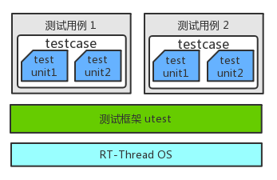
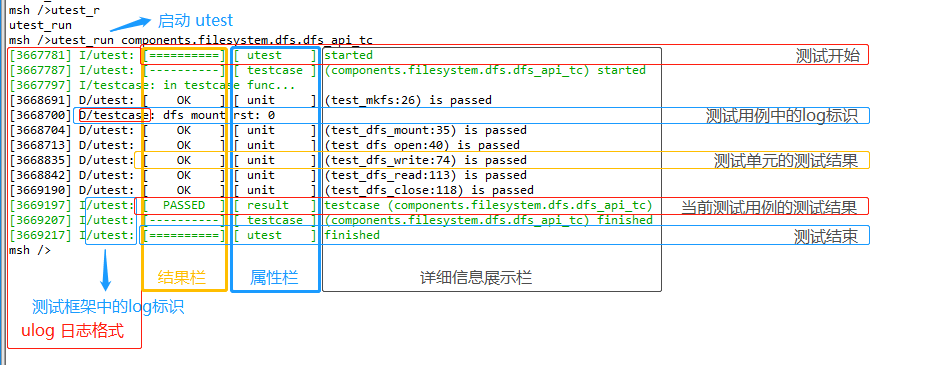

# utest 测试框架

## utest 简介

utest（unit test）是 RT-Thread 开发的单元测试框架。设计 utest 的初衷是方便 RT-Thread 开发者使用统一的框架接口编写测试程序，实现单元测试、覆盖测试以及集成测试的目的。

### 测试用例定义

测试用例（testcase，简称 tc）是为实现特定测试目标而执行的单个测试，是包括测试输入、执行条件、测试过程和预期结果的规范，是一个有明确的结束条件和明确的测试结果的有限循环。

utest（unit test）测试框架定义用户编写的测试程序为**测试用例**，一个*测试用例*仅包含一个 *testcase* 函数（类似 main 函数），可包含多个*测试单元*函数。

具体地通过 utest 测试框架提供的 API 完成的针对某一功能的测试代码就是一个测试用例。

### 测试单元定义

测试单元（test unit）是被测功能细分后的测试点，每个测试点可以任务是被测功能的最小可测单位。当然，不同的分类方式会细分出不同的测试单元。

### utest 应用框图



如上图所示，测试用例基于测试框架 utest 测试框架提供的服务接口进行程序设计，支持将多个测试用例编译到一起进行测试。另外从图中可以看到，一个测试用例对应唯一的 *testcase* 函数，在 *testcase* 中包含多个测试单元（test unit）。

## utest API

为了能够实现格式统一的测试用例代码，测试框架 utest 为测试用例编写提供了一套通用的 API 接口。

### assert 宏

```
注意：
这里的 assert 仅记录通过和失败的数量，不会产生断言并终止程序运行。其功能不等同于 RT_ASSERT。
```

| assert 宏 | 说明 |
| :------   | :------ |
| uassert_true(value)    | value 为 true 则测试通过，否则测试失败 |
| uassert_false(value)   | value 为 false 则测试通过，否则测试失败 |
| uassert_null(value)    | value 为 null 则测试通过，否则测试失败 |
| uassert_not_null(value)| value 为非 null 值则测试通过，否则测试失败 |
| uassert_int_equal(a, b)| a 和 b 值相等则测试通过，否则测试失败 |
| uassert_int_not_equal(a, b)| a 和 b 值不相等则测试通过，否则测试失败 |
| uassert_str_equal(a, b)    | 字符串 a 和字符串 b 相同则测试通过，否则测试失败 |
| uassert_str_not_equal(a, b)| 字符串 a 和字符串 b 不相同则测试通过，否则测试失败 |
| uassert_in_range(value, min, max)    | value 在 min 和 max 的范围内则测试通过，否则测试失败 |
| uassert_not_in_range(value, min, max)| value 不在 min 和 max 的范围内则测试通过，否则测试失败 |

### 测试单元运行宏

```c
UTEST_UNIT_RUN(test_unit_func)
```

测试用例中，使用 `UTEST_UNIT_RUN` 宏执行指定的测试单元函数 `test_unit_func`。测试单元（test unit）必须使用 `UTEST_UNIT_RUN` 宏执行。

### 测试用例导出宏

```c
UTEST_TC_EXPORT(testcase, name, init, cleanup, timeout)
```

| 参数     | 描述 |
| :-----   | :------ |
| testcase | 测试用例主承载函数（**规定**使用名为 static void testcase(void) 的函数 |
| name     | 测试用例名称（唯一性）。规定使用测试用例相对 `testcases 目录`的相对路径以 `.` 进行连接的命名格式 |
| init     | 测试用例启动前的初始化函数 |
| cleanup  | 测试用例结束后的清理函数 |
| timeout  | 测试用例预计需要的测试时间（单位是秒） |

**测试用例命名要求：**

测试用例需要按照规定的格式命名。规定使用当前测试用例相对 `testcases 目录`的相对路径以 `.` 进行连接的命名格式，名字中包含当前测试用例文件的文件名（除去后缀名的文件名）。

**测试用例命名示例：**

假设在测试用例 testcases 目录下，有 `testcases\components\filesystem\dfs\dfs_api_tc.c` 测试用例文件，那么该 dfs_api_tc.c 中的测试用例的名称命名为 `components.filesystem.dfs.dfs_api_tc`。

### 测试用例 LOG 输出接口

utest 测试框架依赖 *ulog 日志模块*进行日志输出，并且 utest 测试框架中已经日志输出级别。因此只要在测试用例里加入 `#include "utest.h"` 即可使用 ulog 日志模块的所有级别接口（LOG_D/LOG_I/LOG_E）。

另外，utest 测试框架增加了额外的日志控制接口，如下：

```c
#define UTEST_LOG_ALL    (1u)
#define UTEST_LOG_ASSERT (2u)

void utest_log_lv_set(rt_uint8_t lv);
```

用户可以在测试用例中使用 `utest_log_lv_set` 接口控制日志输出级别。`UTEST_LOG_ALL` 配置输出所有日志，`UTEST_LOG_ASSERT` 配置仅输出 uassert 失败后的日志。

## 配置使能

使用 utest 测试框架需要在 ENV 工具中使用 menuconfig 进行如下配置：

```c
RT-Thread Kernel  --->
    Kernel Device Object  --->
        (256) the buffer size for console log printf /* utest 日志需要的最小 buffer */
RT-Thread Components  --->
    Utilities  --->
        -*- Enable utest (RT-Thread test framework) /* 使能 utest 测试框架 */
        (4096) The utest thread stack size          /* 设置 utest 线程堆栈（-thread 模式需要） */
        (20)   The utest thread priority            /* 设置 utest 线程优先级（-thread 模式需要） */
```

## 应用范式

前面介绍了 utest 测试框架和相关 API，这里介绍基本的测试用例代码结构。

测试用例文件必须的代码块如下所示：

```c
/*
 * Copyright (c) 2006-2019, RT-Thread Development Team
 *
 * SPDX-License-Identifier: Apache-2.0
 *
 * Change Logs:
 * Date           Author       Notes
 * 2019-01-16     MurphyZhao   the first version
 */

#include <rtthread.h>
#include "utest.h"

static void test_xxx(void)
{
    uassert_true(1);
}

static rt_err_t utest_tc_init(void)
{
    return RT_EOK;
}

static rt_err_t utest_tc_cleanup(void)
{
    return RT_EOK;
}

static void testcase(void)
{
    UTEST_UNIT_RUN(test_xxx);
}
UTEST_TC_EXPORT(testcase, "components.utilities.utest.sample.sample_tc", utest_tc_init, utest_tc_cleanup, 10);
```

一个基本的测试用例必须包含以下内容：

- 文件注释头（Copyright）

    测试用例文件必须包含文件注释头，包含 `Copyright`、时间、作者、描述信息。

- utest_tc_init(void)

    测试运行前的初始化函数，一般用来初始化测试需要的环境。

- utest_tc_cleanup(void)

    测试结束后的清理函数，用来清理测试过程中申请的资源（如内存，线程，信号量等）。

- testcase(void)

    测试主体函数，一个测试用例实现仅能包含一个 testcase 函数（类似 main 函数）。通常该函数里只用来运行测试单元执行函数 `UTEST_UNIT_RUN` 。

    一个 testcase 中可以包含多个测试单元，每个测试单元由 `UTEST_UNIT_RUN` 执行。

- UTEST_UNIT_RUN

    测试单元执行函数。

- test_xxx(void)

    每个功能单元的测试实现。用户根据需求确定函数名和函数实现。

- uassert_true

    用于判断测试结果的断言宏（该断言宏并不会终止程序运行）。测试用例必须使用 `uassert_xxx` 宏来判断测试结果，否则测试框架不知道测试是否通过。

    所有的 `uassert_xxx` 宏都通过后，整个测试用例才算测试通过。

- UTEST_TC_EXPORT

    将测试用例 testcase 函数导出到测试框架。

## 测试用例运行要求

测试框架 utest 将所有的测试用例导出到了 `UtestTcTab` 代码段，在 IAR 和 MDK 编译器中不需要在链接脚本中定义 `UtestTcTab` 段，但是在 GCC 编译时，需要在链接脚本中显式地设置 `UtestTcTab` 段。

因此，测试用例要在 GCC 下能够编译运行，必须要先在 GCC 的*链接脚本*中定义 `UtestTcTab` 代码段。

在 GCC 链接脚本的 `.text` 中，增加 `UtestTcTab` 段的定义，格式如下所示：

```c
/* section information for utest */
. = ALIGN(4);
__rt_utest_tc_tab_start = .;
KEEP(*(UtestTcTab))
__rt_utest_tc_tab_end = .;
```

## 运行测试用例

测试框架提供了以下命令，便于用户在 RT-Thread MSH 命令行中运行测试用例，命令如下：

**utest_list 命令**

列出当前系统支持的测试用例，包括测试用例的名称和测试需要的时间。该命令无参数。

**utest_run 命令**

测试用例执行命令，该命令格式如下：

```c
utest_run [-thread or -help] [testcase name] [loop num]
```

| utest_run 命令参数| 描述 |
| :----   | :----- |
| -thread | 使用线程模式运行测试框架 |
| -help    | 打印帮助信息 |
| testcase name | 指定测试用例名称。支持使用通配符`*`，支持指定测试用例名称前部分字节 |
| loop num | 指定测试用例循环测试次数 |

**测试命令使用示例：**

```c
msh />utest_list
[14875] I/utest: Commands list :
[14879] I/utest: [testcase name]:components.filesystem.dfs.dfs_api_tc; [run timeout]:30
[14889] I/utest: [testcase name]:components.filesystem.posix.posix_api_tc; [run timeout]:30
[14899] I/utest: [testcase name]:packages.iot.netutils.iperf.iperf_tc; [run timeout]:30
msh />
msh />utest_run components.filesystem.dfs.dfs_api_tc
[83706] I/utest: [==========] [ utest    ] started
[83712] I/utest: [----------] [ testcase ] (components.filesystem.dfs.dfs_api_tc) started
[83721] I/testcase: in testcase func...
[84615] D/utest: [    OK    ] [ unit     ] (test_mkfs:26) is passed
[84624] D/testcase: dfs mount rst: 0
[84628] D/utest: [    OK    ] [ unit     ] (test_dfs_mount:35) is passed
[84639] D/utest: [    OK    ] [ unit     ] (test_dfs_open:40) is passed
[84762] D/utest: [    OK    ] [ unit     ] (test_dfs_write:74) is passed
[84770] D/utest: [    OK    ] [ unit     ] (test_dfs_read:113) is passed
[85116] D/utest: [    OK    ] [ unit     ] (test_dfs_close:118) is passed
[85123] I/utest: [  PASSED  ] [ result   ] testcase (components.filesystem.dfs.dfs_api_tc)
[85133] I/utest: [----------] [ testcase ] (components.filesystem.dfs.dfs_api_tc) finished
[85143] I/utest: [==========] [ utest    ] finished
msh />
```

### 测试结果分析



如上图所示，测试用例运行的日志从左到右被分成了四列，分别是 log 日志头信息、结果栏、属性栏、详细信息展示栏。日志中使用 `result` 属性标识该测试用例测试结果（PASSED or FAILED）。

## 测试用例运行流程


从上面的流程图中可以得到以下内容：

* utest 测试框架是顺序执行 *testcase* 函数中的所有**测试单元**
* 上一个 UTEST_UNIT_RUN 宏执出现了 assert，后面的所有 UTEST_UNIT_RUN 会跳过执行

## 注意事项

> [!NOTE]
> 注：- 使用 GCC 编译前，确定链接脚本是否增加了 `UtestTcTab` 段
    - 编译前确保 `RT-Thread Kernel -> Kernel Device Object -> (256) the buffer size for console log printf` 至少为 256 字节
    - 测试用例中创建的资源（线程、信号量、定时器、内存等）需要在测试结束前释放
    - 一个测试用例实现仅能使用 `UTEST_TC_EXPORT` 导出一个测试主体函数（testcase 函数）
    - 为编写的测试用例程序编写 README.md 文档，指导用户配置测试环境
