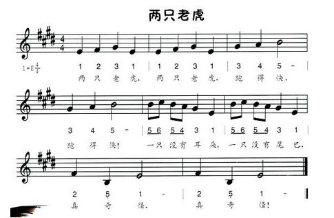
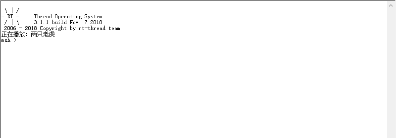

# 第 4 节：音乐数据的编码与解码

## 基础知识

一般说来，蜂鸣器演奏音乐只能是单音频率，它不包含相应幅度的谐波频率，也就是说不能象电子琴那样能奏出多种音色的声音。因此蜂鸣器奏乐只需弄清楚两个概念即可，也就是“音调”和“节拍”。音调表示一个音符唱多高的频率，节拍表示一个音符唱多长的时间。十二平均律就规定了每一个音符的标准频率。

十二平均律，是一种音乐定律方法，将一个纯[八度](https://baike.baidu.com/item/%E5%85%AB%E5%BA%A6)平均分成十二等份，每等分称为[半音](https://baike.baidu.com/item/%E5%8D%8A%E9%9F%B3)，是最主要的调音法。十二平均律中各音的频率： C: 262 Hz、#C: 277 Hz、D: 294 Hz、\#D: 311 Hz、E: 330 Hz、F: 349 Hz、#F: 370 Hz、G: 392 Hz、#G: 415 Hz、A: 440 Hz、#A: 466 Hz、B: 494 Hz


下面是两只老虎的简谱



其中1＝E 表示乐谱的曲调，就是说，“这歌曲唱E调”。那么 1(do) 的频率就为 330 HZ，同样 2 = F，3 = G依次类推。后面 4/4 是用来表示节拍的，它表示乐谱中以四分音符为节拍，每一小结有四拍。比如第二行的第二小节，其中5、6 为一拍，5、4为一拍，3为一拍，1为一拍共四拍。5、6的时值为四分音符的一半，即为八分音符长。

> 提示：简谱里音符下面加一道横线表示该音减少一半时值，即该音符为半拍；加两道横线表示该音在减少一半时值基础上再减一半时值，即该音符为四分之一拍。附点音符，时值是原音符的长加上这个音长的一半。

那么一拍到底该唱多长呢？一般说来，如果乐曲没有特殊说明，一拍的时长大约为400—500ms 。我们以一拍的时长为400ms为例，则当以四分音符为节拍时，四分音符的时长就为400ms，八分音符的时长就为200ms，十六分音符的时长就为100ms。

## 软件实现

### 编码的实现

有关编码解码的方式，在网上检索到了一个对简谱进行编码的软件  MusicEncode ，然后看了一下他的示例程序，感觉他的编码解码的方式还是可取的，编码的方式如下所示：

```c
 音高由三位数字组成：
        个位是表示 1~7 这七个音符
        十位是表示音符所在的音区:1-低音，2-中音，3-高音;
        百位表示这个音符是否要升半音: 0-不升，1-升半音。

 音长最多由三位数字组成：
        个位表示音符的时值，其对应关系是：
            |数值(n):  |0 |1 |2 |3 | 4 | 5 | 6
            |几分音符: |1 |2 |4 |8 |16 |32 |64      音符=2^n
        十位表示音符的演奏效果(0-2):  0-普通，1-连音，2-顿音
        百位是符点位: 0-无符点，1-有符点
```

将上面两只老虎的简谱编码成16进制的数据如下：

```c
        0x15, 0x02, 0x16, 0x02, 0x17, 0x02, 0x15, 0x02, 0x15, 0x02,
        // 1         2            3           1           1
        0x16, 0x02, 0x17, 0x02, 0x15, 0x02, 0x17, 0x02, 0x18, 0x02,
        // 2         3            1           3           4
        0x19, 0x01, 0x17, 0x02, 0x18, 0x02, 0x19, 0x01, 0x19, 0x03,
        // 5   -     3            4           5    -      5_
        0x1A, 0x03, 0x19, 0x03, 0x18, 0x03, 0x17, 0x02, 0x15, 0x16,
        // 6_        5_           4_          3           1
        0x19, 0x03, 0x1A, 0x03, 0x19, 0x03, 0x18, 0x03, 0x17, 0x02,
        // 5_        6_           5_          4_          3
        0x15, 0x16, 0x15, 0x02, 0x0F, 0x02, 0x15, 0x01, 0x15, 0x02,
        // 1         1            5.          1    -      1
        0x0F, 0x02, 0x15, 0x01, 0x00, 0x00
        // 5.        1     -
```

确定了编码的方式之后，还要考虑如何将歌曲名和它的编码之后的数据对应起来。可以定义一个 song 的结构体，里面包含 name 和 data 两个成员，这样就可以将歌曲名和对应的数据联系起来了。

我们新建一个 `decode.h` 文件在里面定义如下的结构体，当然还要在文件的头部添加宏的判断，以及包含 `rtthread.h` 头文件。

```c
struct beep_song
{
    const uint8_t name[SONG_NAME_LENGTH_MAX];
    const uint8_t data[SONG_DATA_LENGTH_MAX];
};
```

这里的 歌曲名字的长度和数据的大小 用两个宏来表示，定义如下：

```c
#define SONG_NAME_LENGTH_MAX  30
#define SONG_DATA_LENGTH_MAX  500
```

### 解码的实现

#### 获取歌曲长度

首先要实现一个解析歌曲长度的函数，供其他模块使用（我们用音符的个数表示为歌曲的长度）。新建一个  `decode.c` 文件，添加   `decode.h` 头文件，然后添加如下代码。并在 `decode.h` 头文件里放一个这个函数的函数声明，供其他文件调用。

```c
uint16_t beep_song_get_len(const struct beep_song *song)
{
    uint16_t cnt = 0;

    /* 歌曲以0x00 0x00结尾 检测结束标志*/
    while (song->data[cnt])
    {
        cnt += 2;
    }
    return cnt / 2;
}
```

#### 获取歌曲名

一个获取歌曲名的 API 也是必不可少的，实现如下函数，返回歌曲的名称。当然，同样需要将这个函数在.h文件里声明，供其他文件调用。

```
int beep_song_get_name(const struct beep_song *song, char *name)
{
    int i=0;
    while(song->name[i])
    {
        name[i] = song->name[i];
        i++;
    }
    name[i] = '\0';
    return 0;
}
```

#### 解码前的准备

解码就是将编码的数据提取出来，然后转变成频率和音长的过程。解码的思路是，先根据音符在频率表里确定它的频率，然后再根据是几分音符以及演奏效果计算出音符的时值。

**频率**

首先要定义出音高的频率表，定义如下：

```c
static const uint16_t freq_tab[12]  = {262, 277, 294, 311, 330, 349, 369, 392, 415, 440, 466, 494}; //频率表 CDEFGAB
```

在获取频率时会有一个问题，那就是音符的 1234567 对应的频率并不是连续的。他们之间有的只差一个半音，有的差一个全音，因此可以定义一个音符的表，里面标识各个音符在频率表中的位置，定义如下：

```c
static const uint8_t sign_tab[7]  = {0, 2, 4, 5, 7, 9, 11};     //1~7在频率表中的位置
```

这样就可以根据音符获取到对应的频率信息了，比如获取音符 3(mi) 的频率，就可以这么获取`freq_tab[sign_tab[3-1]]`，如果要升半 #3 就是 `freq_tab[sign_tab[3-1]+1]` 。

**时值**

还有就是时值的获取，可以先设定四分音符的时值为 400ms，则二分音符的时值时 800ms，全音符的时值 1600ms，可以依次计算出八分音符的时值 200ms,16分音符的时值 100ms。这样可以将全音符用宏来定义出来，然后其他音符的时值，再除以相应的倍数即可。定义全音符的长度为 `#define SEMIBREVE_LEN 1600` 则，四分音符为 `SEMIBREVE_LEN/4` 。

接着根据效果处理时值数据，如连音就演奏整个时值，顿音就只演奏原时值的 1/2，普通音符也不能演奏整个时值，需要乘以一个长度分率，这里是 `#define SOUND_SPACE 4/5 `。这样不同音符的时值就计算出来了。

**调号的调节**

演奏音乐还要能够根据需要调节乐谱的调号。因为蜂鸣器的音域较窄，而且只有在高音的区域播放的音乐才比较好听，所以需要对乐谱的播放进行调号的调节。可以通过调整音符对应的频率表来调整乐谱的调号，根据新的调号生成一个新的频率表，然后根据新的频率表来播放，就可以达到调节调号的要求了。以 1(do) 的频率为例： 升1个半音的话，就由 262HZ 变为了 277HZ；升一个八度，就变成了 262 * 2 = 524 HZ。新的频率表定义如下：

```c
static rt_uint16_t freq_tab_new[12];     //新的频率表
```

写成具体的函数如下所示：

```c
//signature|调号(0-11)       :  是指乐曲升多少个半音演奏;
//octachord|升降八度(-2到+2) :  < 0 降几个八度; > 0 升几个八度
static int beep_song_decode_new_freq(rt_uint8_t signature, rt_int8_t octachord)
{
    uint8_t i, j;
    for (i = 0; i < 12; i++)        // 根据调号及升降八度来生成新的频率表
    {
        j = i + signature;

        if (j > 11) //升完之后超出本组基本音级，就跳到下一组音级
        {
            j = j - 12;
            freq_tab_new[i] = freq_tab[j] * 2;
        }
        else
        {
            freq_tab_new[i] = freq_tab[j];
        }

        /* 升降八度 */
        if (octachord < 0)
        {
            freq_tab_new[i] >>= (- octachord);
        }
        else if (octachord > 0)
        {
            freq_tab_new[i] <<= octachord; //每升一个八度 频率就翻一倍
        }
    }
    return 0;
}
```

#### 解码函数

解码的过程也可以抽象成一个函数，传入的参数是编码后的数据（音高、音长数据），返回的结果是解码出来的音符对应的频率，以及音符的时值。为了方便蜂鸣器播放，我们把时值分成两个数据表示，`发声的时间`和`不发声的时间`。我们创建如下一个解码函数。

```c
int beep_song_decode(rt_uint16_t tone, rt_uint16_t length, rt_uint16_t *freq, rt_uint16_t *sound_len, rt_uint16_t *nosound_len); //解码音乐数据
```

具体的实现如下：

```c
int beep_song_decode(rt_uint16_t tone, rt_uint16_t length, rt_uint16_t *freq, rt_uint16_t *sound_len, rt_uint16_t *nosound_len)
{
    static const rt_uint16_t div0_len = SEMIBREVE_LEN;        // 全音符的长度(ms)
    rt_uint16_t note_len, note_sound_len, current_freq;
    rt_uint8_t note, sharp, range, note_div, effect, dotted;

    note = tone % 10;                             //计算出音符
    range = tone / 10 % 10;                       //计算出高低音
    sharp = tone / 100;                           //计算出是否升半
    current_freq = freq_tab_new[sign_tab[note - 1] + sharp]; //查出对应音符的频率

    if (note != 0)
    {
        if (range == 1) current_freq >>= 1;       //低音 降八度
        if (range == 3) current_freq <<= 1;       //高音 升八度
        *freq = current_freq;
    }
    else
    {
        *freq = 0;
    }
    note_div = length_tab[length % 10];           //算出是几分音符
    effect = length / 10 % 10;                    //算出音符类型(0普通1连音2顿音)
    dotted = length / 100;                        //算出是否附点
    note_len = div0_len / note_div;                //算出音符的时长

    if (dotted == 1)
        note_len = note_len + note_len / 2;

    if (effect != 1)
    {
        if (effect == 0)                          //算出普通音符的演奏长度
        {
            note_sound_len = note_len * SOUND_SPACE;
        }
        else                                      //算出顿音的演奏长度
        {
            note_sound_len = note_len / 2;
        }
    }
    else                                          //算出连音的演奏长度
    {
        note_sound_len = note_len;
    }
    if (note == 0)
    {
        note_sound_len = 0;
    }
    *sound_len = note_sound_len;
    *nosound_len = note_len - note_sound_len;     //算出不发音的长度

    return 0;
}
```

但是这样组织数据的方式太散了，这么多参数，也不方便其他函数调用。可以定义一个蜂鸣器能够直接用来播放的数据结构。如下，将频率以及发声的时长和不发声的时长封装了起来。

```
struct beep_song_data
{
    rt_uint16_t freq;
    rt_uint16_t sound_len;
    rt_uint16_t nosound_len;
};
```

同样，可以将这个解码函数再封装一层，屏蔽掉具体的解码细节。如下所示，传入歌曲的数据以及要获得的音符的序号，可直接返回供蜂鸣器播放的数据，方便了其他模块的使用。

```
uint16_t beep_song_get_data(const struct beep_song *song, uint16_t index, struct beep_song_data *data)
```

具体实现如下

```
uint16_t beep_song_get_data(const struct beep_song *song, uint16_t index, struct beep_song_data *data)
{
    beep_song_decode(song->data[index * 2],song->data[index * 2+1],&data->freq,&data->sound_len,&data->nosound_len);

    return 2;
}
```

#### 解码器初始化

在解码器的初始化函数里完成调节调号的过程。定义两个宏作为基础的调号 。

```c
#define SOUND_SIGNATURE       0    //调号：升0个半音
#define SOUND_OCTACHORD       1    //升降八度：升一个八度
```

然后才 `decode.c` 里实现下面的函数，并把函数声明放到 `.h` 文件里，供外部文件调用。

```c
int beep_song_decode_init(void)
{
    beep_song_decode_new_freq(SOUND_SIGNATURE, SOUND_OCTACHORD);
    return 0;
}
```

## 示例程序

我们可以在main.c里包含 `beep.h` 以及 `decode.h` 两个头文件，然后在循环函数里解码并播放一首歌曲。详细代码如下。

```c
#include <rtthread.h>
#include "beep.h"
#include "decode.h"

const struct beep_song song1 =
{
    .name = "两只老虎",
    .data = {
        0x15, 0x02, 0x16, 0x02, 0x17, 0x02, 0x15, 0x02, 0x15, 0x02,
        0x16, 0x02, 0x17, 0x02, 0x15, 0x02, 0x17, 0x02, 0x18, 0x02,
        0x19, 0x01, 0x17, 0x02, 0x18, 0x02, 0x19, 0x01, 0x19, 0x03,
        0x1A, 0x03, 0x19, 0x03, 0x18, 0x03, 0x17, 0x02, 0x15, 0x16,
        0x19, 0x03, 0x1A, 0x03, 0x19, 0x03, 0x18, 0x03, 0x17, 0x02,
        0x15, 0x16, 0x15, 0x02, 0x0F, 0x02, 0x15, 0x01, 0x15, 0x02,
        0x0F, 0x02, 0x15, 0x01, 0x00, 0x00
    }
};

int main(void)
{
    /* user app entry */
    struct beep_song_data data;
    int len, i=0;
    char name[20];

    beep_init();
    beep_song_decode_init();
    beep_song_get_name(&song1, name);
    rt_kprintf("正在播放：%s\n",name);
    len = beep_song_get_len(&song1);
    while (i < len)
    {
        /* 解码音乐数据 */
        beep_song_get_data(&song1, i, &data);
        beep_set(data.freq, 3);
        beep_on();

        rt_thread_mdelay(data.sound_len);

        beep_off();
        rt_thread_mdelay(data.nosound_len);
        i++;
    }

    return 0;
}
```

连接好蜂鸣器，下载并运行程序就可以听到通过蜂鸣器播放的两只老虎了！



## 程序源码

[decode.c/.h](https://github.com/Guozhanxin/RTT-BeepPlayer-pkg/tree/master/code/decode)

[示例程序](https://github.com/Guozhanxin/RTT-BeepPlayer-pkg/blob/master/samples/main_4.c)
