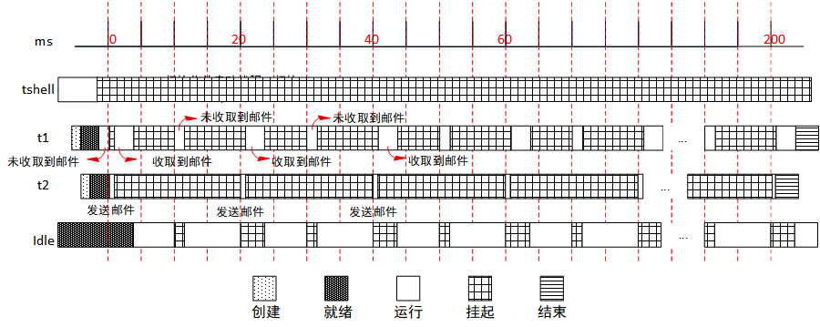
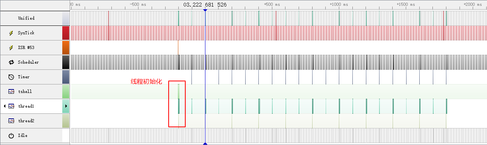
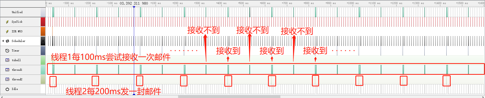
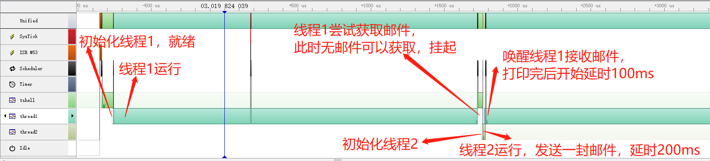

实验：邮箱的使用
================

实验目的
--------

-   理解邮箱的基本原理；

-   使用邮箱进行线程间通信；

-   在 RT-Thread 中熟练使用邮箱来完成需求。

实验原理及程序结构
------------------

邮箱是一种简单的线程间消息传递方式，特点是开销比较低，效率较高。在 RT-Thread 操作系统的实现中能够一次传递一个 4 字节大小的邮件，并且邮箱具备一定的存储功能，能够缓存一定数量的邮件数
(邮件数由创建、初始化邮箱时指定的容量决定)。邮箱中一封邮件的最大长度是 4 字节，所以邮箱能够用于不超过 4 字节的消息传递。

###  实验设计

本实验使用的例程为：[mailbox_sample.c](https://github.com/RT-Thread-packages/kernel-sample/blob/v0.2.0/mailbox_sample.c)

为了体现使用邮箱来达到线程间的通信，本实验设计了 thread1、thread2 两个线程，优先级同为 10，设计了一个邮箱 mbt。

线程 thread1 每 100ms 尝试接收一次邮件，如果接收到邮件就将邮件内容打印出来。在接收到结束邮件时，打印邮件信息，线程结束。

线程 thread2 每 200ms 发送一次邮件，发送 10 次之后，发送结束邮件（线程 2 共发送 11 封邮件），线程运行结束。

通过本实验，用户可以清晰地了解到，线程在使用邮箱时候的线程调度。

整个实验运行过程如下图所示，下面以 thread2 开始运行时为开始时间，过程描述如下：



（1）在 tshell 线程中初始化一个邮箱 mbt，采用 FIFO 方式进行线程等待；初始化并启动线程 thread1、thread2，优先级同为 10；

（2）在操作系统的调度下，thread1 首先被投入运行；

（3）thread1 开始运行，首先打印一段信息，然后尝试获取邮件，邮箱暂时没有邮件，thread1 挂起；

（4）随后操作系统调度 thread2 投入运行，发送一封邮件，随后进入 200ms 延时；

（5）此时线程 thread1 被唤醒，接收到邮件，继续打印一段信息，然后进入 100ms 延时；

（6）thread2 在发送 10 次邮件后，发送一封结束内容的邮件，线程结束。

（7）thread1 一直接收邮件，当接收到来自 thread2 的结束邮件后，脱离邮箱，线程结束。

###  源程序说明

#### RT-Thread 示例代码框架

RT-Thread 示例代码都通过 MSH_CMD_EXPORT 将示例初始函数导出到 msh 命令，可以在系统运行过程中，通过在控制台输入命令来启动。

#### 示例源码

以下定义了线程需要用到的优先级，栈空间，时间片的宏，邮箱控制块，存放邮件的内存池、3 份邮件内容。

```c
#include <rtthread.h>

#define THREAD_PRIORITY      10
#define THREAD_TIMESLICE     5

/* 邮箱控制块 */
static struct rt_mailbox mb;

/* 用于放邮件的内存池 */
static char mb_pool[128];

static char mb_str1[] = "I'm a mail!";
static char mb_str2[] = "this is another mail!";
static char mb_str3[] = "over";
```


线程 thread1 使用的栈空间、线程控制块，以及线程 thread1 的入口函数，每 100ms 收取一次邮件并打印邮件内容，当收取到结束邮件的时候，脱离邮箱，结束运行。

```c
ALIGN(RT_ALIGN_SIZE)
static char thread1_stack[1024];
static struct rt_thread thread1;

/* 线程 1 入口 */
static void thread1_entry(void *parameter)
{
    char *str;

    while (1)
    {
        rt_kprintf("thread1: try to recv a mail\n");

        /* 从邮箱中收取邮件 */
        if (rt_mb_recv(&mb, (rt_uint32_t *)&str, RT_WAITING_FOREVER) == RT_EOK)
        {
            rt_kprintf("thread1: get a mail from mailbox, the content:%s\n", str);
            if (str == mb_str3)
                break;

            /* 延时 100ms */
            rt_thread_mdelay(100);
        }
    }
    /* 执行邮箱对象脱离 */
    rt_mb_detach(&mb);
}
```

线程 thread2 使用的栈空间、线程控制块，以及线程 thread2 的入口函数，每 200ms 发送一封邮件，10 次后发送结束邮件，结束运行

```c
ALIGN(RT_ALIGN_SIZE)
static char thread2_stack[1024];
static struct rt_thread thread2;

/* 线程 2 入口 */
static void thread2_entry(void *parameter)
{
    rt_uint8_t count;

    count = 0;
    while (count < 10)
    {
        count ++;
        if (count & 0x1)
        {
            /* 发送 mb_str1 地址到邮箱中 */
            rt_mb_send(&mb, (rt_uint32_t)&mb_str1);
        }
        else
        {
            /* 发送 mb_str2 地址到邮箱中 */
            rt_mb_send(&mb, (rt_uint32_t)&mb_str2);
        }

        /* 延时 200ms */
        rt_thread_mdelay(200);
    }

    /* 发送邮件告诉线程 1，线程 2 已经运行结束 */
    rt_mb_send(&mb, (rt_uint32_t)&mb_str3);
}
```

邮箱的示例代码，初始化了邮箱，初始化并启动了线程 thread1 与 thread2。并将函数使用 MSH_CMD_EXPORT 导出命令

```c
int mailbox_sample(void)
{
    rt_err_t result;

    /* 初始化一个 mailbox */
    result = rt_mb_init(&mb,
                        "mbt",                      /* 名称是 mbt */
                        &mb_pool[0],                /* 邮箱用到的内存池是 mb_pool */
                        sizeof(mb_pool) / 4,        /* 邮箱中的邮件数目，因为一封邮件占 4 字节 */
                        RT_IPC_FLAG_PRIO);          /* 采用 PRIO 方式进行线程等待 */
    if (result != RT_EOK)
    {
        rt_kprintf("init mailbox failed.\n");
        return -1;
    }

    rt_thread_init(&thread1,
                   "thread1",
                   thread1_entry,
                   RT_NULL,
                   &thread1_stack[0],
                   sizeof(thread1_stack),
                   THREAD_PRIORITY, THREAD_TIMESLICE);
    rt_thread_startup(&thread1);

    rt_thread_init(&thread2,
                   "thread2",
                   thread2_entry,
                   RT_NULL,
                   &thread2_stack[0],
                   sizeof(thread2_stack),
                   THREAD_PRIORITY, THREAD_TIMESLICE);
    rt_thread_startup(&thread2);
    return 0;
}

/* 导出到 msh 命令列表中 */
MSH_CMD_EXPORT(mailbox_sample, mailbox sample);
```

编译、仿真运行和观察示例应用输出
--------------------------------

编译工程，然后开始仿真。使用控制台 UART\#1 做为 msh 终端，可以看到系统的启动日志，输入 mailbox_sample 命令启动示例应用，示例输出结果如下：

```c
\ | /
- RT - Thread Operating System
/ | \ 3.1.0 build Aug 27 2018
2006 - 2018 Copyright by rt-thread team
msh >mailbox_sample
thread1: try to recv a mail
thread1: get a mail from mailbox, the content:I'm a mail!
msh >thread1: try to recv a mail
thread1: get a mail from mailbox, the content:this is another mail!
…
thread1: try to recv a mail
thread1: get a mail from mailbox, the content:this is another mail!
thread1: try to recv a mail
thread1: get a mail from mailbox, the content:over
```

使用 SystemView 工具可以监测示例实际运行过程，示例开始之后现象与实验设计相同。整体流程如下两张图所示，“接收” 表示线程 t1 接收然后挂起，“收取” 表示线程 t1 接收到邮件恢复运行，“发送” 表示 t2 发送邮件。



起始阶段详细调度如下图所示：



放大线程初始化部分：



图中各名称对应描述如下表：

| 名称      | 描述            |
|-----------|-----------------|
| Unified   | CPU 当前运行状态 |
| UART ISR  | 串口中断        |
| SysTick   | 系统时钟        |
| Scheduler | 调度器          |
| Timer     | 定时器          |
| thread1   | 线程 thread1     |
| Thread2   | 线程 thread2     |
| tshell    | 线程 tshell      |
| Idle      | 空闲线程        |

附件
----

整个示例运行流程可以使用工具 SystemView 工具打开附件文件 [mailbox_sample.SVDat](https://www.rt-thread.org/document/site/tutorial/experimental-manual/mailbox_sample/mailbox_sample.SVDat) 查看具体细节。注意打开附件时，不要有中文路径。

