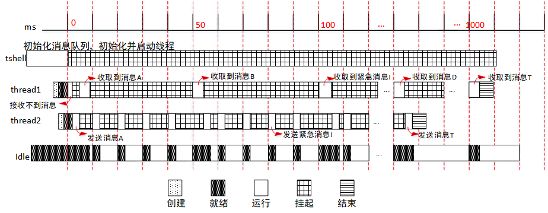
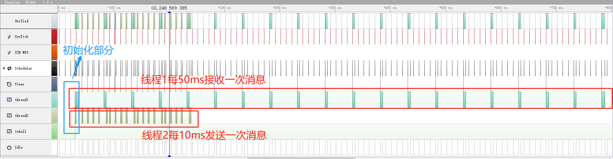
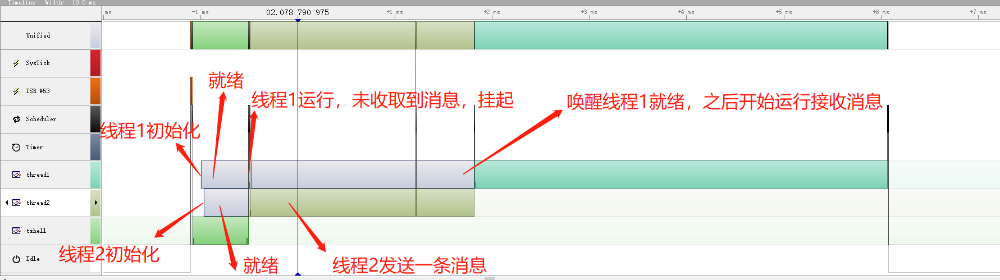

实验：消息队列的使用
====================

实验目的
--------

-   理解消息队列的基本原理

-   使用消息队列进行线程间通信

-   在 RT-Thread 中熟练使用消息队列来完成需求

实验原理及程序结构
------------------

消息队列能够接收来自线程或中断服务例程中不固定长度的消息，并把消息缓存在自己的内存空间中。其他线程也能够从消息队列中读取相应的消息，而当消息队列是空的时候，可以挂起读取线程。当有新的消息到达时，挂起的线程将被唤醒以接收并处理消息。消息队列是一种异步的通信方式。

###  实验设计

本实验使用的例程为：[msgq_sample.c](https://github.com/RT-Thread-packages/kernel-sample/blob/v0.2.0/msgq_sample.c)

为了体现使用消息队列来达到线程间的通信，本实验设计了 thread1、thread2 两个线程，优先级同为 25，设计了一个消息队列 mqt。

线程 thread1 每 50ms 从消息队列接收一次消息，并打印接收到的消息内容，在接收 20 次消息之后，将消息队列脱离、结束线程。

线程 thread2 每 10ms 向 mqt 消息队列依次发送 20 次消息，分别是消息 “A”-“T”，第 9 次发送的是一个紧急消息 “I”，发送 20 次后线程运行结束。（注，虽然设置的是 5ms，但是该工程设置的一个 OS
Tock 是 10ms，是最小精度）。

通过本实验，用户可以清晰地了解到，线程在使用消息队列时候的线程调度。

整个实验运行过程如下图所示，OS Tick 为系统滴答时钟，下面以实验开始后第一个到来的 OS Tick 为第 1 个 OS Tick，过程描述如下：



（1）在 tshell 线程中初始化一个消息队列 mqt，采用 FIFO 方式进行线程等待；初始化并启动线程 thread1、thread2，优先级同为 25；

（2）在操作系统的调度下，thread1 首先被投入运行，尝试从消息队列获取消息，消息队列暂时没有消息，线程挂起；

（3）随后操作系统调度 thread2 投入运行，thread2 发送一个消息 “A”，并打印发送消息内容，随后每 10ms 发送一条消息；

（4）此时线程 thread1 接收到消息，打印消息内容 “A”，然后每 50ms 接收一次消息；

（5）在第 100ms 时，thread1 本应接收消息 “C”，但由于队列中有紧急消息，所以 thread1 先接收紧急消息 “I”，之后再顺序接收其他消息。

（6）thread2 发送 20 条消息后，结束线程。

（7）thread1 接收 20 条消息后，结束线程。

### 源程序说明

#### 示例代码框架

RT-Thread 示例代码都通过 MSH_CMD_EXPORT 将示例初始函数导出到 msh 命令，可以在系统运行过程中，通过在控制台输入命令来启动。

#### 示例源码

以下定义了待创建线程需要用到的优先级、时间片的宏，消息队列控制块以及存放消息用到的内存池。

```c
#include <rtthread.h>

#define THREAD_PRIORITY      25
#define THREAD_TIMESLICE     5

/* 消息队列控制块 */
static struct rt_messagequeue mq;
/* 消息队列中用到的放置消息的内存池 */
static rt_uint8_t msg_pool[2048];
```

线程 thread1 使用的栈空间、线程控制块，以及线程 thread1 的入口函数，每 50ms 从消息队列中收取消息，并打印消息内容，20 次后结束。

```c
ALIGN(RT_ALIGN_SIZE)
static char thread1_stack[1024];
static struct rt_thread thread1;

/* 线程 1 入口函数 */
static void thread1_entry(void *parameter)
{
    char buf = 0;
    rt_uint8_t cnt = 0;

    while (1)
    {
        /* 从消息队列中接收消息 */
        if (rt_mq_recv(&mq, &buf, sizeof(buf), RT_WAITING_FOREVER) == RT_EOK)
        {
            rt_kprintf("thread1: recv msg from msg queue, the content:%c\n", buf);
            if (cnt == 19)
            {
                break;
            }
        }
        /* 延时 50ms */
        cnt++;
        rt_thread_mdelay(50);
    }
    rt_kprintf("thread1: detach mq \n");
    rt_mq_detach(&mq);
}
```

线程 thread2 使用的栈空间、线程控制块，以及线程 thread2 的入口函数，每 5ms 向消息队列中发送消息，并打印消息内容，20 次后结束

```c
ALIGN(RT_ALIGN_SIZE)
static char thread2_stack[1024];
static struct rt_thread thread2;

/* 线程 2 入口 */
static void thread2_entry(void *parameter)
{
    int result;
    char buf = 'A';
    rt_uint8_t cnt = 0;

    while (1)
    {
        if (cnt == 8)
        {
            /* 发送紧急消息到消息队列中 */
            result = rt_mq_urgent(&mq, &buf, 1);
            if (result != RT_EOK)
            {
                rt_kprintf("rt_mq_urgent ERR\n");
            }
            else
            {
                rt_kprintf("thread2: send urgent message - %c\n", buf);
            }
        }
        else if (cnt>= 20)/* 发送 20 次消息之后退出 */
        {
            rt_kprintf("message queue stop send, thread2 quit\n");
            break;
        }
        else
        {
            /* 发送消息到消息队列中 */
            result = rt_mq_send(&mq, &buf, 1);
            if (result != RT_EOK)
            {
                rt_kprintf("rt_mq_send ERR\n");
            }

            rt_kprintf("thread2: send message - %c\n", buf);
        }
        buf++;
        cnt++;
        /* 延时 5ms */
        rt_thread_mdelay(5);
    }
}
```

消息队列的示例代码，初始化了一个消息队列，初始化并启动了 thread1 与 thread2. 并将函数使用 MSH_CMD_EXPORT 导出命令。

```c
/* 消息队列示例的初始化 */
int msgq_sample(void)
{
    rt_err_t result;

    /* 初始化消息队列 */
    result = rt_mq_init(&mq,
                        "mqt",
                        &msg_pool[0],               /* 内存池指向 msg_pool */
                        1,                          /* 每个消息的大小是 1 字节 */
                        sizeof(msg_pool),           /* 内存池的大小是 msg_pool 的大小 */
                        RT_IPC_FLAG_PRIO);          /* 如果有多个线程等待，按照优先级大小的方法分配消息 */

    if (result != RT_EOK)
    {
        rt_kprintf("init message queue failed.\n");
        return -1;
    }

    rt_thread_init(&thread1,
                   "thread1",
                   thread1_entry,
                   RT_NULL,
                   &thread1_stack[0],
                   sizeof(thread1_stack),
                   THREAD_PRIORITY, THREAD_TIMESLICE);
    rt_thread_startup(&thread1);

    rt_thread_init(&thread2,
                   "thread2",
                   thread2_entry,
                   RT_NULL,
                   &thread2_stack[0],
                   sizeof(thread2_stack),
                   THREAD_PRIORITY, THREAD_TIMESLICE);
    rt_thread_startup(&thread2);

    return 0;
}

/* 导出到 msh 命令列表中 */
MSH_CMD_EXPORT(msgq_sample, msgq sample);
```

编译、仿真运行和观察示例应用输出
--------------------------------

编译工程，然后开始仿真。使用控制台 UART\#1 做为 msh 终端，可以看到系统的启动日志，输入 msgq_sample 命令启动示例应用，示例输出结果如下：

```c
\ | /
- RT - Thread Operating System
/ | \ 3.1.0 build Aug 24 2018
2006 - 2018 Copyright by rt-thread team
msh > msgq_sample
msh >thread2: send message - A
thread1: recv msg from msg queue, the content:A
thread2: send message - B
thread2: send message - C
thread2: send message - D
thread2: send message - E
thread1: recv msg from msg queue, the content:B
thread2: send message - F
thread2: send message - G
thread2: send message - H
thread2: send urgent message - I
thread2: send message - J
thread1: recv msg from msg queue, the content:I
thread2: send message - K
thread2: send message - L
thread2: send message - M
thread2: send message - N
thread2: send message - O
thread1: recv msg from msg queue, the content:C
thread2: send message - P
thread2: send message - Q
thread2: send message - R
thread2: send message - S
thread2: send message - T
thread1: recv msg from msg queue, the content:D
message queue stop send, thread2 quit
thread1: recv msg from msg queue, the content:E
thread1: recv msg from msg queue, the content:F
thread1: recv msg from msg queue, the content:G
…
thread1: recv msg from msg queue, the content:T
thread1: detach mq
```

使用 SystemView 工具可以监测示例实际运行过程，示例开始之后现象与实验设计相同。整体流程如下图所示，初始化部分细节见第二张图。



初始化部分细节：



图中各名称对应描述如下表：

| 名称      | 描述            |
|-----------|-----------------|
| Unified   | CPU 当前运行状态 |
| UART ISR  | 串口中断        |
| SysTick   | 系统时钟        |
| Scheduler | 调度器          |
| Timer     | 定时器          |
| thread1   | 线程 thread1     |
| thread2   | 线程 thread2     |
| tshell    | 线程 tshell      |
| Idle      | 空闲线程        |

附件
----

整个示例运行流程可以使用工具 SystemView 工具打开附件文件 [msgq_sample.SVDat](https://www.rt-thread.org/document/site/tutorial/experimental-manual/msgq_sample/msgq_sample.SVDat) 查看具体细节。注意打开附件时，不要有中文路径。
