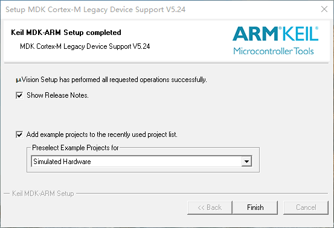

# RT-Thread 实验环境搭建

## 目的

- 本章的目的是让初学者了解 RT-Thread 运行环境，将以 MDK5 为例，搭建 RT-Thread 运行环境。

## MDK5 安装

已经安装 MDK5 的可以直接略过此步骤。

在运行 RT-Thread 操作系统前，我们需要安装 MDK-ARM 5.24（正式版或评估版，5.14 版本及以上版本均可），这个版本也是当前比较新的版本，它能够提供相对比较完善的调试功能。这里采用了 16K 编译代码限制的评估版 5.24 版本，如果要解除 16K 编译代码限制，请购买 MDK-ARM 正式版。先从  www.keil.com  官方网站下载 MDK-ARM 评估版：<http://www.keil.com/download/>。

在下载时，需要填一些个人基本信息，请填写相应的完整信息，然后开始下载。下载完成后，鼠标双击运行，会出现如下图所示的软件安装画面：


**步骤 1** 这是 MDK-ARM 的安装说明，点击 “Next>>” 进入下一画面，如下图所示：


**步骤 2** 在 “I agree to all the terms of the preceding License Agreement” 前的选择框中点击选择 “√”，并点击 “Next >>” 进入下一步安装，如下图所示：


**步骤 3** 点击 “Browse…” 选择 MDK-ARM 的安装目录或者直接在 “Destination Folder” 下的文本框中输入安装路径，这里我们默认 “C:/Keil” 即可，然后点击 “Next>>” 进入下一步安装，如下图所示：


**步骤 4** 在 “First Name” 后输入您的名字，“Last Name” 后输入您的姓，“Company Name” 后输入您的公司名称，“E-mail” 后输入您的邮箱地址，然后点击 “Next>>” 进行安装，等待一段时间后，安装结束，出现如下图所示画面：


**步骤 5** 图中的默认选择不需改动，直接点击 “Next” 进入如下图所示画面：



**步骤 6** 在这里可以点击 “Finish” 完成整个 MDK-ARM 软件的安装。

有了 MDK-ARM 利器，就可以轻松开始 RT-Thread 操作系统之旅，一起探索实时操作系统的奥秘。

注：MDK-ARM 正式版是收费的，如果您希望能够编译出更大体积的二进制文件，请购买 MDK-ARM 正式版。RT-Thread 操作系统也支持自由软件基金会的 GNU GCC 编译器，这是一款开源的编译器，想要了解如何使用 GNU 的相关工具请参考 RT-Thread 网站上的相关文档。

## 运行仿真

打开配合本实验的代码工程 [RT-Thread Simulator 例程](https://www.rt-thread.org/document/site/tutorial/quick-start/stm32f103-simulator/rtthread_simulator_v0.1.0.7z)，例程源码中包含：RT-Thread 内核、FinSH 控制台、串口驱动、GPIO 驱动这些内容，支持 STM32F10X 系列 MCU，源码的目录结构如下图所示：


在目录下，有一个 project.uvprojx 文件，它是本文内容所引述的例程中的一个 MDK5 工程文件，双击 “project.uvprojx” 图标，打开此工程文件，如下图所示：


现在我们点击一下窗口上方工具栏中的按钮，对该工程进行编译，如下图所示：


编译的结果显示在窗口下方的 “Build” 栏中，没什么意外的话，最后一行会显示 “0 Error(s), * Warning(s).”，即无任何错误和警告。

在编译完 RT-Thread/STM32 后，我们可以通过 MDK-ARM 的模拟器来仿真运行 RT-Thread：

- 点击下图中的按钮 1 或直接按 “Ctrl+F5” 进入仿真界面。
- 点击下图中的按钮 2 或直接按 “F5” 开始仿真。
- 点击下图中的按钮 3 或者选择菜单栏中的 “View → Serial Windows →UART\#1”，打开串口 1 窗口。


可以看到串口输出了 RT-Thread 的 LOGO，其模拟运行的结果如下图所示：


## FinSH 命令行中启动线程

RT-Thread 提供 FinSH 功能，用于调试或查看系统信息，msh 表示 FinSH 处于一种传统命令行模式，此模式下可以使用类似于 dos/bash 等传统的 shell 命令。

比如，我们可以通过输入 “help + 回车” 或者直接按下 Tab 键，输出当前系统所支持的所有命令，如下：

```c
msh >help
RT-Thread shell commands:
thread_sample       - thread sample
timer_sample        - timer sample
semaphore_sample    - semaphore sample
mutex_sample        - mutex sample
event_sample        - event sample
mailbox_sample      - mailbox sample
msgq_sample         - msgq sample
signal_sample       - signal sample
mempool_sample      - mempool sample
dynmem_sample       - dynmem sample
interrupt_sample    - interrupt sample
idle_hook_sample    - idle hook sample
producer_consumer   - producer_consumer sample
timeslice_sample    - timeslice sample
scheduler_hook      - scheduler_hook sample
pri_inversion       - prio_inversion sample
version             - show RT-Thread version information
list_thread         - list thread
list_sem            - list semaphore in system
list_event          - list event in system
list_mutex          - list mutex in system
list_mailbox        - list mail box in system
list_msgqueue       - list message queue in system
list_memheap        - list memory heap in system
list_mempool        - list memory pool in system
list_timer          - list timer in system
list_device         - list device in system
help                - RT-Thread shell help.
ps                  - List threads in the system.
time                - Execute command with time.
free                - Show the memory usage in the system.

msh >
```

此时可以输入列表中的命令，如输入 list_thread 命令显示系统当前正在运行的线程，结果显示为 tshell（shell 线程）线程与 tidle（空闲线程）线程：

```c
msh >list_thread
thread pri status sp stack size max used left tick error
------ --- ------- ---------- ---------- ------ ---------- ---
tshell 20 ready 0x00000080 0x00001000 07% 0x0000000a 000
tidle  31 ready 0x00000054 0x00000100 32% 0x00000016 000
msh >
```

FinSH 具有命令自动补全功能，输入命令的部分字符（前几个字母，注意区分大小写），按下 Tab 键，则系统会根据当前已输入的字符，从系统中查找已经注册好的相关命令，如果找到与输入相关的命令，则会将完整的命令显示在终端上。

如：要使用 version 命令，可以先输入 “v”，再按下 Tab 键，可以发现系统会在下方补全了有关 “v” 开头的命令：version，此时只需要回车，即可查看该命令的执行结果。

每一个实验都会导出一个命令，做某个实验时，键入该实验对应的命令并回车，就会对该实验开始仿真。复位程序可以点击 `"RST"` 按钮，退出仿真需要再次点击仿真按钮。

## SystemView 工具介绍

SystemView 是一个可以在线调试嵌入式系统的工具，它可以分析有哪些中断、任务执行了，以及这些中断、任务执行的先后关系。还可以查看一些内核对象持有和释放的时间点，比如信号量、互斥量、事件、消息队列等，这在开发和处理具有多个线程和事件的复杂系统时尤其有效，能帮助用户进行系统调试和分析、显著缩短开发和调试时间，提高开发效率。

本实验采用 SystemView 对系统执行的线程及其状态进行可视化监控分析，通过该工具将实验的运行状态与时间的关系保存下来，大家可以下载安装该工具，打开实验附带的附件，了解实验过程及细节。

下载 SystemView 分析工具：https://www.segger.com/products/development-tools/systemview/
