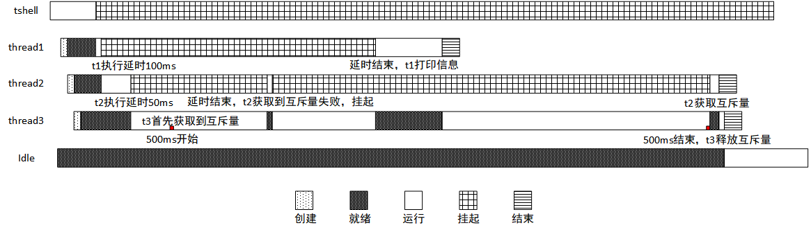
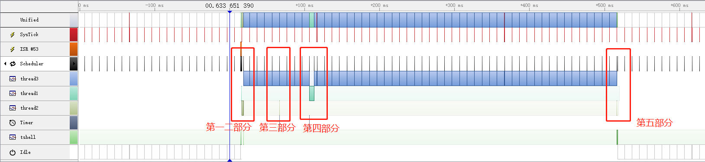
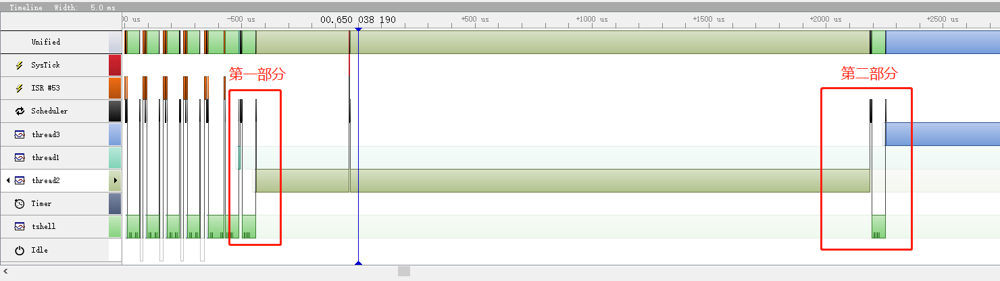
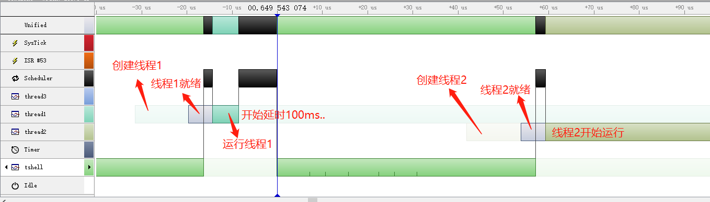
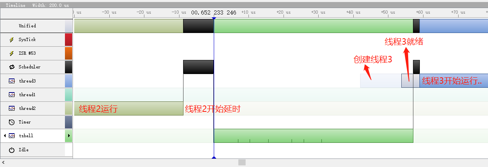
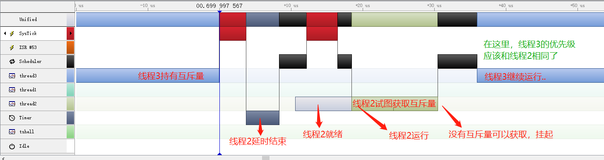
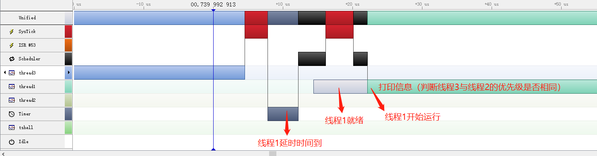
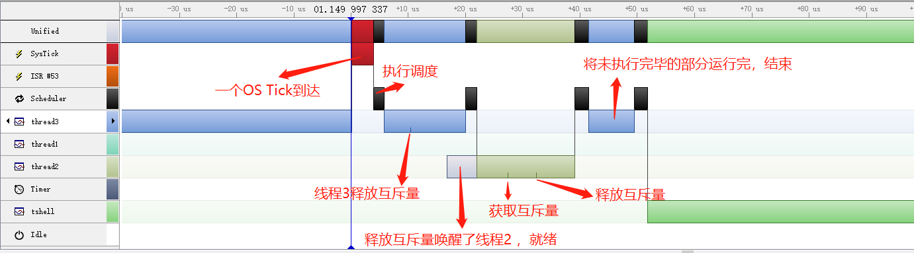

实验：互斥量——优先级继承
========================

实验目的
--------

-   理解互斥量的基本原理；

-   使用互斥量来达到线程间同步并探索其中的优先级继承问题；

-   在 RT-Thread 中熟练使用互斥量来完成需求。

实验原理及程序结构
------------------

互斥量是一种特殊的二值信号量。它和信号量不同的是：拥有互斥量的线程拥有互斥量的所有权，互斥量支持递归访问且能防止线程优先级翻转；并且互斥量只能由持有线程释放，而信号量则可以由任何线程释放。

互斥量的使用比较单一，因为它是信号量的一种，并且它是以锁的形式存在。在初始化的时候，互斥量永远都处于开锁的状态，而被线程持有的时候则立刻转为闭锁的状态。

注意：需要切记的是互斥量不能在中断服务例程中使用。

###  实验设计

本实验使用的例程为：[priority_inversion.c](https://github.com/RT-Thread-packages/kernel-sample/blob/v0.2.0/priority_inversion.c)

为了体现使用互斥量来达到线程间的同步，并体现优先级继承的现象，本实验设计了 thread1、thread2、thread3 三个线程，优先级分别为 9、10、11，设计了一个互斥量 mutex。

线程 thread1 优先级最高，先执行 100ms 延时，之后再打印线程 2 与线程 3 的优先级信息——用于检查线程
thread3 的优先级是否被提升为 thread2 的优先级。

线程 thread2 进入后先打印自己的优先级，然后进入 50ms 延时，延时结束后获取互斥量 mutex，获取到互斥量之后再释放互斥量 mutex。

线程 thread3 进入后先打印自己的优先级，然后获取互斥量 mutex，获取到互斥量之后进入 500ms 的循环，循环结束后将互斥量释放。

整体情况就是：线程 3 先持有互斥量，而后线程 2 试图持有互斥量，此时线程 3
的优先级应该被提升为和线程 2
的优先级相同，然后线程 1 打印线程 2 与线程 3 的优先级信息。

通过本实验，用户可以清晰地了解到，互斥量在线程间同步的作用、互斥量的优先级继承性以及互斥量连续获取不会造成死锁。

整个实验运行过程如下图所示，过程描述如下：



（1）在 tshell 线程中创建一个互斥量 mutex，初始化为先进先出型；并分别创建、启动线程 thread1、thread2、thread3，优先级分别为 9、10、11；

（2）thread1 开始执行，延时 100ms 将自己挂起；

（3）thread2 开始执行，打印自己的优先级信息，开始延时 50ms 将自己挂起；

（4）thread3 获取互斥量，然后使用循环 500ms 来模拟 thread3 运行 500ms，之后释放互斥量。

（5）在 thread2 延时 50ms 结束时，试图获取互斥量，由于互斥量被 thread3 持有，所以获取失败，自身挂起。（此时，thread3 的优先级应该是被提升为和 thread2 的优先级相同）。

（6）在 thread1 延时 100ms 结束时，打印 thread2 与 thread3 的优先级信息，检查两者优先级是否相同。如果相同，那么说明互斥量确实解决了优先级翻转的问题，进行了优先级继承。

### 源程序说明

####  RT-Thread 示例代码框架

RT-Thread 示例代码都通过 MSH_CMD_EXPORT 将示例初始函数导出到 msh 命令，可以在系统运行过程中，通过在控制台输入命令来启动。

#### 示例源码

定义了待创建线程需要用到的优先级，栈空间，时间片的宏，以及线程控制块句柄和互斥量控制块句柄

```c
#include <rtthread.h>

/* 指向线程控制块的指针 */
static rt_thread_t tid1 = RT_NULL;
static rt_thread_t tid2 = RT_NULL;
static rt_thread_t tid3 = RT_NULL;
static rt_mutex_t mutex = RT_NULL;

#define THREAD_PRIORITY       10
#define THREAD_STACK_SIZE     512
#define THREAD_TIMESLICE      5
```

线程 thread1 入口函数，首先让低优先级先运行，之后打印 thread2 与 thread3 的优先级，验证互斥量优先级继承。

```c
/* 线程 1 入口 */
static void thread1_entry(void *parameter)
{
    /* 先让低优先级线程运行 */
    rt_thread_mdelay(100);

    /* 此时 thread3 持有 mutex，并且 thread2 等待持有 mutex */

    /* 检查天 thread2 与 thread3 的优先级情况 */
    if (tid2->current_priority != tid3->current_priority)
    {
        /* 优先级不相同，测试失败 */
        rt_kprintf("the priority of thread2 is: %d\n", tid2->current_priority);
        rt_kprintf("the priority of thread3 is: %d\n", tid3->current_priority);
        rt_kprintf("test failed.\n");
        return;
    }
    else
    {
        rt_kprintf("the priority of thread2 is: %d\n", tid2->current_priority);
        rt_kprintf("the priority of thread3 is: %d\n", tid3->current_priority);
        rt_kprintf("test OK.\n");
    }
}
```

线程 thread2 的入口函数，打印优先级信息之后，先让低优先级的 thread3 先运行，然后尝试获取互斥量，获取到后释放互斥量。

```c
/* 线程 2 入口 */
static void thread2_entry(void *parameter)
{
    rt_err_t result;

    rt_kprintf("the priority of thread2 is: %d\n", tid2->current_priority);

    /* 先让低优先级线程运行 */
    rt_thread_mdelay(50);

    /*
     * 试图持有互斥锁，此时 thread3 持有，应把 thread3 的优先级提升
     * 到 thread2 相同的优先级
     */
    result = rt_mutex_take(mutex, RT_WAITING_FOREVER);

    if (result == RT_EOK)
    {
        /* 释放互斥锁 */
        rt_mutex_release(mutex);
    }
}
```

线程 thread3 的入口函数，先打印自身优先级信息，然后获取互斥量，获取到互斥量之后进行 500ms 的长时间循环，使 thread3 运行 500ms 左右，之后释放互斥量。

```c
/* 线程 3 入口 */
static void thread3_entry(void *parameter)
{
    rt_tick_t tick;
    rt_err_t result;

    rt_kprintf("the priority of thread3 is: %d\n", tid3->current_priority);

    result = rt_mutex_take(mutex, RT_WAITING_FOREVER);
    if (result != RT_EOK)
    {
        rt_kprintf("thread3 take a mutex, failed.\n");
    }

    /* 做一个长时间的循环，500ms */
    tick = rt_tick_get();
    while (rt_tick_get() - tick < (RT_TICK_PER_SECOND / 2)) ;

    rt_mutex_release(mutex);
}
```

互斥量优先级继承的例子，解决优先级翻转问题。示例函数首先创建互斥量，再创建、启动了线程 thread1、thread2、thread3。并将函数使用 MSH_CMD_EXPORT 导出命令。

```c
int pri_inversion(void)
{
    /* 创建互斥锁 */
    mutex = rt_mutex_create("mutex", RT_IPC_FLAG_PRIO);
    if (mutex == RT_NULL)
    {
        rt_kprintf("create dynamic mutex failed.\n");
        return -1;
    }

    /* 创建线程 1 */
    tid1 = rt_thread_create("thread1",
                            thread1_entry,
                            RT_NULL,
                            THREAD_STACK_SIZE,
                            THREAD_PRIORITY - 1, THREAD_TIMESLICE);
    if (tid1 != RT_NULL)
         rt_thread_startup(tid1);

    /* 创建线程 2 */
    tid2 = rt_thread_create("thread2",
                            thread2_entry,
                            RT_NULL,
                            THREAD_STACK_SIZE,
                            THREAD_PRIORITY, THREAD_TIMESLICE);
    if (tid2 != RT_NULL)
        rt_thread_startup(tid2);

    /* 创建线程 3 */
    tid3 = rt_thread_create("thread3",
                            thread3_entry,
                            RT_NULL,
                            THREAD_STACK_SIZE,
                            THREAD_PRIORITY + 1, THREAD_TIMESLICE);
    if (tid3 != RT_NULL)
        rt_thread_startup(tid3);

    return 0;
}

/* 导出到 msh 命令列表中 */
MSH_CMD_EXPORT(pri_inversion, pri_inversion sample);
```

编译、仿真运行和观察示例应用输出
--------------------------------

编译工程，然后开始仿真。使用控制台 UART#1 做为 msh 终端，可以看到系统的启动日志，输入 mutex_simple_init 命令启动示例应用，示例输出结果如下：

```c
\ | /
- RT - Thread Operating System
/ | \ 3.1.0 build Aug 27 2018
2006 - 2018 Copyright by rt-thread team
msh >pri_inversion
the priority of thread2 is: 10
the priority of thread3 is: 11
the priority of thread2 is: 10
the priority of thread3 is: 10
test OK.
```

例程演示了互斥量的使用方法。线程 3 先持有互斥量，而后线程 2 试图持有互斥量，此时线程 3 的优先级被提升为和线程 2 的优先级相同。

使用 SystemView 工具可以监测示例实际运行过程，示例开始之后现象与实验设计相同，如下几张图所示。

几个阶段详细调度信息如下：



第一、二部分放大图如下：



第一部分细节图如下：



第二部分细节图如下：



第三部分细节图如下，thread2 获取互斥量详细过程：



第四部分细节图如下：



第五部分细节图如下，结束阶段详细调度过程：



图中各名称对应描述如下表：

| 名称      | 描述            |
|-----------|-----------------|
| Unified   | CPU 当前运行状态 |
| UART ISR  | 串口中断        |
| SysTick   | 系统时钟        |
| Scheduler | 调度器          |
| Timer     | 定时器          |
| thread3   | 线程 thread3     |
| thread2   | 线程 thread2     |
| thread1   | 线程 thread1     |
| tshell    | 线程 tshell      |
| Idle      | 空闲线程        |

附件
----

整个示例运行流程可以使用工具 SystemView 工具打开附件文件 [pri_inversion.SVDat](https://www.rt-thread.org/document/site/tutorial/experimental-manual/pri_inversion/pri_inversion.SVDat) 查看具体细节。注意打开附件时，不要有中文路径。

