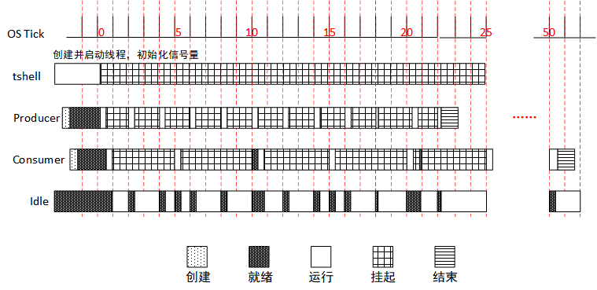
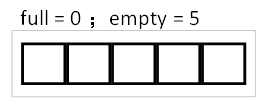
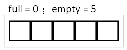
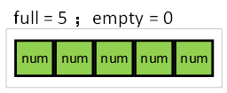
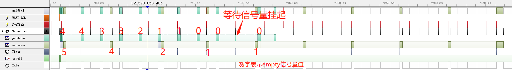

实验：信号量—生产者消费者问题
=============================

实验目的
--------

-   理解信号量的基本原理；

-   使用信号量来达到线程间同步；

-   理解资源计数适合于线程间工作处理速度不匹配的场合；

-   在 RT-Thread 中熟练使用信号量来完成需求。

实验原理及程序结构
------------------

信号量在大于 0 时才能获取，在中断、线程中均可释放信号量。

### 实验设计

本实验使用的例程为：[producer_consumer.c](https://github.com/RT-Thread-packages/kernel-sample/blob/v0.2.0/producer_consumer.c)

为了体现使用信号量来达到线程间的同步，本实验设计了 producer、consumer 两个线程，producer 优先级为 24，consumer 优先级为 26。线程 producer 每生产一个数据进入 20ms 延时，生产 10 个数据后结束。线程 consumer 每消费一个数据进入 5
0ms 延时，消费 10 个数据后结束。通过本实验，用户可以清晰地了解到，信号量在线程同步以及资源计数时起到的作用。

整个实验运行过程如下图所示，OS Tick 为系统滴答时钟，下面以实验开始后第一个到来的 OS Tick 为第 1 个 OS Tick，过程描述如下：



（1）在 tshell 线程中初始化 3 个信号量，lock 初始化为 1（用作保护临界区，保护数组），
empty 初始化为 5， full 初始化为 0；信号量情况：



（2）创建并启动线程 producer，优先级为 24；创建并启动线程和 consumer，优先级为 26；

（3）在操作系统的调度下，producer 优先级高，首先被投入运行；

（4）producer 获取一个 empty 信号量，产生一个数据放入数组，再释放一个 full 信号量，然后进入 2 OS Tick 延时；之后的信号量情况：


（5）随后 consumer 投入运行，获取一个 full 信号量，消费一个数据用于累加，再释放一个 empty 信号量，然后进入 5 OS Tick 延时；之后的信号量情况：



（6）由于生产速度 > 消费速度，所以在某一时刻会存在 full = 5 / empty = 0 的情况，如下：



比如第 18 个 OS Tick 时，producer 延时结束，操作系统调度 producer 投入运行，获取一个 empty 信号量，由于此时 empty 信号量为 0，producer 由于获取不到信号量挂起；等待有 empty 信号时，才可以继续生产。

（7）直到 producer 产生 10 个 num 后，producer 线程结束，被系统删除。

（8）直到 consumer 消费 10 个 num 后，consumer 线程结束，被系统删除。

### 源程序说明

#### RT-Thread 示例代码框架

RT-Thread 示例代码都通过 MSH_CMD_EXPORT 将示例初始函数导出到 msh 命令，可以在系统运行过程中，通过在控制台输入命令来启动。

#### 示例源码

定义了待创建线程需要用到的优先级，栈空间，时间片的宏，以及生产消费过程中用于存放产生数据的数字和相关变量、线程句柄、信号量控制块。

```
#include <rtthread.h>

#define THREAD_PRIORITY       6
#define THREAD_STACK_SIZE     512
#define THREAD_TIMESLICE      5

/* 定义最大 5 个元素能够被产生 */
#define MAXSEM 5

/* 用于放置生产的整数数组 */
rt_uint32_t array[MAXSEM];

/* 指向生产者、消费者在 array 数组中的读写位置 */
static rt_uint32_t set, get;

/* 指向线程控制块的指针 */
static rt_thread_t producer_tid = RT_NULL;
static rt_thread_t consumer_tid = RT_NULL;

struct rt_semaphore sem_lock;
struct rt_semaphore sem_empty, sem_full;
```

生产者 producer 线程的入口函数，每 20ms 就获取一个空位（获取不到时挂起），上锁 , 产生一个数字写入数组 , 解锁，释放一个满位，10 次后结束。

```c
/* 生产者线程入口 */
void producer_thread_entry(void *parameter)
{
    int cnt = 0;

    /* 运行 10 次 */
    while (cnt < 10)
    {
        /* 获取一个空位 */
        rt_sem_take(&sem_empty, RT_WAITING_FOREVER);

        /* 修改 array 内容，上锁 */
        rt_sem_take(&sem_lock, RT_WAITING_FOREVER);
        array[set % MAXSEM] = cnt + 1;
        rt_kprintf("the producer generates a number: %d\n", array[set % MAXSEM]);
        set++;
        rt_sem_release(&sem_lock);

        /* 发布一个满位 */
        rt_sem_release(&sem_full);
        cnt++;

        /* 暂停一段时间 */
        rt_thread_mdelay(20);
    }

    rt_kprintf("the producer exit!\n");
}
```

消费者 consumer 线程的入口函数，每 50ms 获取一个满位（获取不到时挂起），上锁, 将数组中的内容相加, 解锁，释放一个空位，10 次后结束。

```c
/* 消费者线程入口 */
void consumer_thread_entry(void *parameter)
{
    rt_uint32_t sum = 0;

    while (1)
    {
        /* 获取一个满位 */
        rt_sem_take(&sem_full, RT_WAITING_FOREVER);

        /* 临界区，上锁进行操作 */
        rt_sem_take(&sem_lock, RT_WAITING_FOREVER);
        sum += array[get % MAXSEM];
        rt_kprintf("the consumer[%d] get a number: %d\n", (get % MAXSEM), array[get % MAXSEM]);
        get++;
        rt_sem_release(&sem_lock);

        /* 释放一个空位 */
        rt_sem_release(&sem_empty);

        /* 生产者生产到 10 个数目，停止，消费者线程相应停止 */
        if (get == 10) break;

        /* 暂停一小会时间 */
        rt_thread_mdelay(50);
    }

    rt_kprintf("the consumer sum is: %d\n", sum);
    rt_kprintf("the consumer exit!\n");
}
```

生产者与消费者问题的示例函数，示例函数首先初始化了 3 个信号量，创建并启动生产者线程 producer，然后创建、启动消费者线程 consumer。并将函数使用 MSH_CMD_EXPORT 导出命令。

```c
int producer_consumer(void)
{
    set = 0;
    get = 0;

    /* 初始化 3 个信号量 */
    rt_sem_init(&sem_lock, "lock",     1,      RT_IPC_FLAG_PRIO);
    rt_sem_init(&sem_empty, "empty",   MAXSEM, RT_IPC_FLAG_PRIO);
    rt_sem_init(&sem_full, "full",     0,      RT_IPC_FLAG_PRIO);

    /* 创建生产者线程 */
    producer_tid = rt_thread_create("producer",
                                    producer_thread_entry, RT_NULL,
                                    THREAD_STACK_SIZE,
                                    THREAD_PRIORITY - 1, THREAD_TIMESLICE);
    if (producer_tid != RT_NULL)
        rt_thread_startup(producer_tid);

    /* 创建消费者线程 */
    consumer_tid = rt_thread_create("consumer",
                                    consumer_thread_entry, RT_NULL,
                                    THREAD_STACK_SIZE,
                                    THREAD_PRIORITY + 1, THREAD_TIMESLICE);
    if (consumer_tid != RT_NULL)
        rt_thread_startup(consumer_tid);

    return 0;
}

/* 导出到 msh 命令列表中 */
MSH_CMD_EXPORT(producer_consumer, producer_consumer sample);
```

编译、仿真运行和观察示例应用输出
--------------------------------

编译工程，然后开始仿真。使用控制台 UART#1 做为 msh 终端，可以看到系统的启动日志，输入 producer_consumer 命令启动示例应用，示例输出结果如下：

```c
\ | /
- RT - Thread Operating System
/ | \ 3.1.0 build Aug 27 2018
2006 - 2018 Copyright by rt-thread team
msh >producer_consumer
the producer generates a number: 1
the consumer[0] get a number: 1
msh >the producer generates a number: 2
the producer generates a number: 3
the consumer[1] get a number: 2
the producer generates a number: 4
the producer generates a number: 5
the producer generates a number: 6
the consumer[2] get a number: 3
the producer generates a number: 7
the producer generates a number: 8
the consumer[3] get a number: 4
the producer generates a number: 9
the consumer[4] get a number: 5
the producer generates a number: 10
the producer exit!
the consumer[0] get a number: 6
the consumer[1] get a number: 7
the consumer[2] get a number: 8
the consumer[3] get a number: 9
the consumer[4] get a number: 10
the consumer sum is: 55
the consumer exit!
```

使用 SystemView 工具可以监测示例实际运行过程，示例开始之后现象与实验设计相同，生产者每 20ms 生产一个数据，生产 10 个数据后结束，且最多存在 5 个未被消费的数据。消费者每 50ms 消费一个数据。如下图所示，图中红色数字表示当前线程执行之后 empty 信号量的值。



图中各名称对应描述如下表：

| 名称      | 描述            |
|-----------|-----------------|
| Unified   | CPU 当前运行状态 |
| UART ISR  | 串口中断        |
| SysTick   | 系统时钟        |
| Scheduler | 调度器          |
| producer  | 线程 producer    |
| consumer  | 线程 consumer    |
| Timer     | 定时器          |
| tshell    | 线程 tshell      |
| Idle      | 空闲线程        |

附件
----

整个示例运行流程可以使用工具 SystemView 工具打开附件文件 [producer_consumer.SVDat](https://www.rt-thread.org/document/site/tutorial/experimental-manual/producer_consumer/producer_consumer.SVDat) 查看具体细节。注意打开附件时，不要有中文路径。
