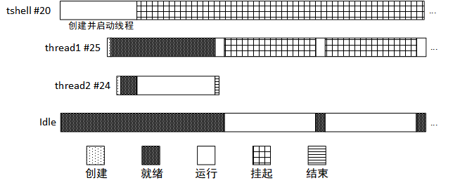
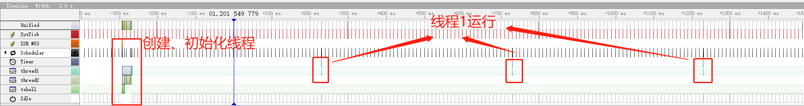
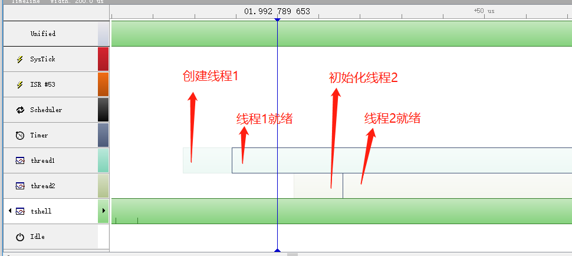
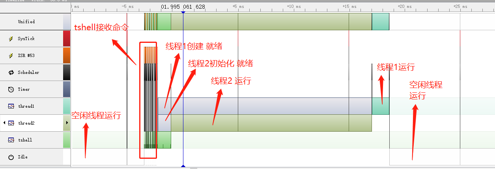

实验：线程的使用
================

实验目的
--------

-   理解线程创建、初始化与自动脱离的基本原理；

-   理解高优先级线程抢占低优先级线程运行；

-   掌握 RT-Thread 中线程的动态创建、静态初始化；

-   在 RT-Thread 中熟练使用线程来完成需求。

实验原理及程序结构
------------------

线程，即任务的载体。一般被设计成 while(1) 的循环模式，但在循环中一定要有让出 CPU 使用权的动作。如果是可以执行完毕的线程，则系统会自动将执行完毕的线程进行删除 / 脱离。

### 实验设计

本实验使用的例程为：[thread_sample.c](https://github.com/RT-Thread-packages/kernel-sample/blob/v0.2.0/thread_sample.c)

为了体现线程的创建、初始化与脱离，本实验设计了 thread1、thread2 两个线程。thread1 是创建的动态线程，优先级为 25；Thread2 初始化的静态线程，优先级为 24。

优先级较高的 Thread2 抢占低优先级的 thread1，执行完毕一段程序后自动被系统脱离。

优先级较低的 thread1 被设计成死循环，循环中有让出 CPU 使用权的动作 -- 使用了 delay 函数。该线程在 thread2 退出运行之后开始运行，每隔一段时间运行一次，并一直循环运行下去。

通过本实验，用户可以清晰地了解到线程在本实验中的状态变迁情况。

整个实验运行过程如下图所示，描述如下：



（1）在 tshell 线程 (优先级 20) 中创建线程 thread1 和初始化 thread2，thread1 优先级为 25，thread2 优先级为 24；

（2） 启动线程 thread1 和 thread2，使 thread1 和 thread2 处于就绪状态；

（3）随后 tshell 线程挂起，在操作系统的调度下，优先级较高的 thread2 首先被投入运行；

（4） thread2 是可执行完毕线程，运行完毕打印之后，系统自动删除 thread2；

（5） thread1 得以运行，打印信息之后执行延时将自己挂起；

（6） 系统中没有优先级更高的就绪队列，开始执行空闲线程；

（7） 延时时间到，执行 thread1；

（8） 循环（5）~（7）。

### 源程序说明

#### 示例代码框架

RT-Thread 示例代码都通过 MSH_CMD_EXPORT 将示例初始函数导出到 msh 命令，可以在系统运行过程中，通过在控制台输入命令来启动。

#### 示例源码

定义了待创建线程需要用到的优先级，栈空间，时间片的宏，定义线程 thread1 的线程句柄:

```c
# include <rtthread.h>
# define THREAD_PRIORITY 25
# define THREAD_STACK_SIZE 512
# define THREAD_TIMESLICE 5
static rt_thread_t tid1 = RT_NULL;
```

线程 thread1 入口函数，每 500ms 打印一次计数值

```c
/* 线程 1 的入口函数 */
static void thread1_entry(void *parameter)
{
    rt_uint32_t count = 0;

    while (1)
    {
        /* 线程 1 采用低优先级运行，一直打印计数值 */
        rt_kprintf("thread1 count: %d\n", count ++);
        rt_thread_mdelay(500);
    }
}
```

线程 thread2 线程栈、控制块以及线程 2 入口函数的定义，线程 2 打印计数，10 次后退出。

```c
ALIGN(RT_ALIGN_SIZE)
static char thread2_stack[1024];
static struct rt_thread thread2;

/* 线程 2 入口 */
static void thread2_entry(void *param)
{
    rt_uint32_t count = 0;

    /* 线程 2 拥有较高的优先级，以抢占线程 1 而获得执行 */
    for (count = 0; count < 10 ; count++)
    {
        /* 线程 2 打印计数值 */
        rt_kprintf("thread2 count: %d\n", count);
    }
    rt_kprintf("thread2 exit\n");

    /* 线程 2 运行结束后也将自动被系统脱离 */
}
```

例程代码，其中创建了线程 thread1，初始化了线程 thread2，并将函数使用 MSH_CMD_EXPORT 导出命令。

```c
/* 线程示例 */
int thread_sample(void)
{
    /* 创建线程 1，名称是 thread1，入口是 thread1_entry*/
    tid1 = rt_thread_create("thread1",
                            thread1_entry, RT_NULL,
                            THREAD_STACK_SIZE,
                            THREAD_PRIORITY, THREAD_TIMESLICE);

    /* 如果获得线程控制块，启动这个线程 */
    if (tid1 != RT_NULL)
        rt_thread_startup(tid1);

    /* 初始化线程 2，名称是 thread2，入口是 thread2_entry */
    rt_thread_init(&thread2,
                   "thread2",
                   thread2_entry,
                   RT_NULL,
                   &thread2_stack[0],
                   sizeof(thread2_stack),
                   THREAD_PRIORITY - 1, THREAD_TIMESLICE);
    rt_thread_startup(&thread2);

    return 0;
}

/* 导出到 msh 命令列表中 */
MSH_CMD_EXPORT(thread_sample, thread sample);
```

编译、仿真运行和观察示例应用输出
--------------------------------

编译工程，然后开始仿真。使用控制台 UART#1 做为 msh 终端，可以看到系统的启动日志，输入 thread_sample 命令启动示例应用，示例输出结果如下：

```c
 \ | /
 - RT -     Thread Operating System
 / | \     3.1.0 build Aug 24 2018
 2006 - 2018 Copyright by rt-thread team
msh >thread_sample
msh >thread2 count: 0
thread2 count: 1
thread2 count: 2
thread2 count: 3
thread2 count: 4
thread2 count: 5
thread2 count: 6
thread2 count: 7
thread2 count: 8
thread2 count: 9
thread2 exit
thread1 count: 0
thread1 count: 1
thread1 count: 2
thread1 count: 3
...
```

使用 SystemView 工具可以监测示例实际运行过程，如下三图所示，可以看到实验的实际运行流程与实验设计的流程一致，thread2 运行一段时间结束，thread1 每隔一段时间运行一次，并一直循环运行下去。



将创建、初始化的部分放大看，如下两张图：





图中各名称对应描述如下表：

| **名称**  | **描述 **        |
|-----------|-----------------|
| Unified   | CPU 当前运行状态 |
| UART ISR  | 串口中断        |
| SysTick   | 系统时钟        |
| Scheduler | 调度器          |
| thread1   | 线程 thread1     |
| thread2   | 线程 thread2     |
| Timer     | 定时器          |
| tshell    | 线程 tshell      |
| Idle      | 空闲线程        |

附件
----

整个示例运行流程可以使用工具 SystemView 工具打开附件文件 [thread_sample.SVDat](https://www.rt-thread.org/document/site/tutorial/experimental-manual/thread_sample/thread_sample.SVDat) 查看具体细节。注意打开附件时，不要有中文路径。
