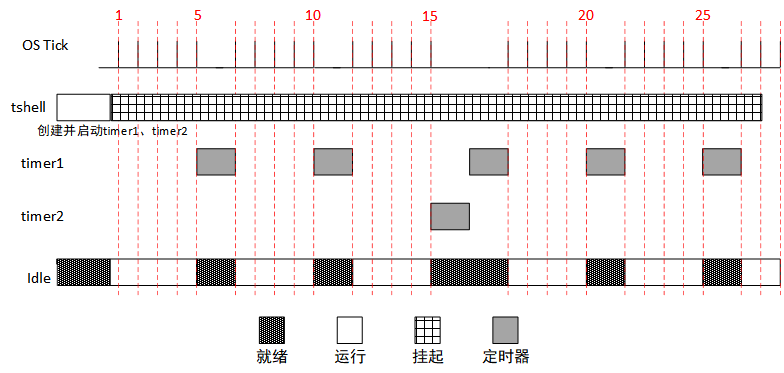
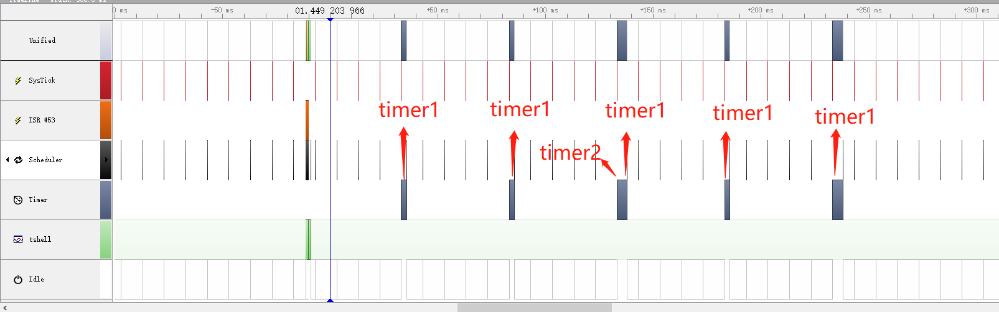

实验：定时器的使用
==================

实验目的
--------

-   理解动态定时器的基本原理；

-   掌握 RT-Thread 中动态定时器的创建与使用；

-   在 RT-Thread 中熟练使用动态定时器来完成需求。

实验原理及程序结构
------------------

RT-Thread 定时器由操作系统提供的一类系统接口（函数），它构建在芯片的硬件定时器基础之上，使系统能够提供不受数目限制的定时器服务。

RT-Thread 定时器分为 HARD_TIMER 与 SOFT_TIMER，可以设置为单次定时与周期定时，这些属性均可在创建 / 初始化定时器时设置；而如果没有设置 HARD_TIMER 或 SOFT_TIMER，则默认使用 HARD_TIMER。

###  实验设计

本实验使用的例程为：[timer_sample.c](https://github.com/RT-Thread-packages/kernel-sample/blob/v0.2.0/timer_sample.c)

为了体现动态定时器的单次定时与周期性定时，本实验设计了 timer1、timer2 两定时器。

周期性定时器 1 的超时函数，每 5 个 OS Tick 运行 1 次，共运行 5 次（5 次后调用 rt_timer_stop 使定时器 1 停止运行）；单次定时器 2 的超时函数在第 15 个 OS Tick 时运行一次。

通过本实验，用户可以清晰地了解到定时器的工作过程，以及使用定时器相关 API 动态更改定时器属性。

整个实验运行过程如下图所示，描述如下：

  

（1）在 tshell 线程中创建定时器 timer1 和 timer2，timer1 周期定时 5 OS Tick，timer2 单次定时 15 OS Tick；启动定时器 timer1、timer2；

（2）定时器的定时时间均为到，在操作系统的调度下，Idle 投入运行；

（3）每 5 个 OS Tick 到来时，定时器 timer1 定时时间到，调用超时函数打印一段信息，timer1 定时器重置;

（4）在第 15 个 OS Tick 到来时，timer1 第 3 次超时，调用超时函数打印一段信息；timer2 第一次超时，调用超时函数打印一段信息且超时函数运行完删除;

（5）在第 25 个 OS Tick 到来时，定时器 timer1 第 5 次超时，调用超时函数打印一段信息，并使用 rt_timer_stop() 接口将定时器停止，超时函数运行完后自行删除;

### 源程序说明

#### RT-Thread 示例代码框架

RT-Thread 示例代码都通过 MSH_CMD_EXPORT 将示例初始函数导出到 msh 命令，可以在系统运行过程中，通过在控制台输入命令来启动。

#### 示例源码

头文件以及定义了待创建定时器控制块以及实验需要用到的变量

```
#include <rtthread.h>

/* 定时器的控制块 */
static rt_timer_t timer1;
static rt_timer_t timer2;
static int cnt = 0;
```

周期定时器 timer1 的超时函数，timer1 定时时间到会执行次函数，10 次之后停止定时器 timer1。
```c
/* 定时器 1 超时函数 */
static void timeout1(void *parameter)
{
    rt_kprintf("periodic timer is timeout %d\n", cnt);

    /* 运行第 10 次，停止周期定时器 */
    if (cnt++>= 9)
    {
        rt_timer_stop(timer1);
        rt_kprintf("periodic timer was stopped! \n");
    }
}
```

单次定时器 timer2 的超时函数，timer2 定时时间到会执行次函数

```c
/* 定时器 2 超时函数 */
static void timeout2(void *parameter)
{
    rt_kprintf("one shot timer is timeout\n");
}
```

定时器的示例代码，示例函数首先创建并启动了线程 timer1，然后创建并启动了线程 timer2。并将函数使用 MSH_CMD_EXPORT 导出命令.

```c
int timer_sample(void)
{
    /* 创建定时器 1  周期定时器 */
    timer1 = rt_timer_create("timer1", timeout1,
                             RT_NULL, 10,
                             RT_TIMER_FLAG_PERIODIC);

    /* 启动定时器 1 */
    if (timer1 != RT_NULL)
        rt_timer_start(timer1);

    /* 创建定时器 2 单次定时器 */
    timer2 = rt_timer_create("timer2", timeout2,
                             RT_NULL,  30,
                             RT_TIMER_FLAG_ONE_SHOT);

    /* 启动定时器 2 */
    if (timer2 != RT_NULL)
        rt_timer_start(timer2);

    return 0;
}

/* 导出到 msh 命令列表中 */
MSH_CMD_EXPORT(timer_sample, timer sample);
```

以上为示例函数，可以看到将函数使用 MSH_CMD_EXPORT 导出命令，示例函数首先创建并启动了定时器 timer1，然后创建并启动了定时器 timer2。

编译、仿真运行和观察示例应用输出
--------------------------------

编译工程，然后开始仿真。使用控制台 UART#1 做为 msh 终端，可以看到系统的启动日志，输入 timer_sample 命令启动示例应用，示例输出结果如下：

```c
\ | /
- RT - Thread Operating System
/ | \ 3.1.0 build Aug 24 2018
2006 - 2018 Copyright by rt-thread team
msh >timer_sample
msh >periodic timer is timeout 0
periodic timer is timeout 1
one shot timer is timeout
periodic timer is timeout 2
periodic timer is timeout 3
periodic timer is timeout 4
periodic timer was stopped!
```

使用 SystemView 工具可以监测示例实际运行过程，如下图所示。Systemview 没有区分定时器名称，详细时间信息可以看到定时器标号。



图中各名称对应描述如下表：

| 名称      | 描述            |
|-----------|-----------------|
| Unified   | CPU 当前运行状态 |
| UART ISR  | 串口中断        |
| SysTick   | 系统时钟        |
| Scheduler | 调度器          |
| Timer     | 定时器          |
| tshell    | 线程 tshell      |
| Idle      | 空闲线程        |

附件
----

整个示例运行流程可以使用工具 SystemView 工具打开附件文件 [timer_sample.SVDat](https://www.rt-thread.org/document/site/tutorial/experimental-manual/timer_sample/timer_sample.SVDat) 查看具体细节。注意打开附件时，不要有中文路径。

