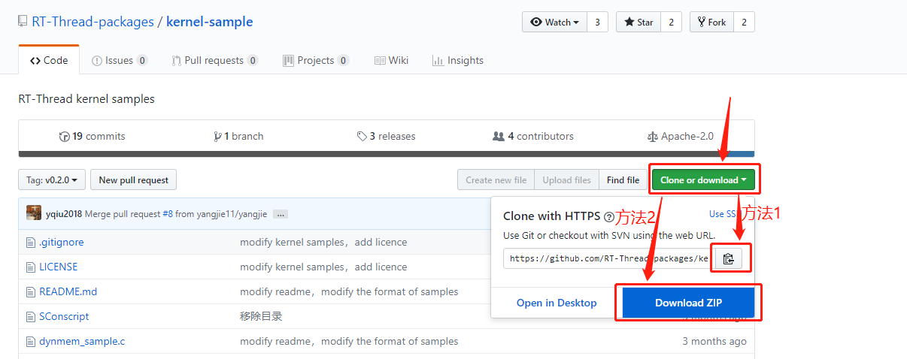

## 内核示例代码准备

使用开发板进行内核学习，需要添加内核例程到工程中。

> [!NOTE]
> 注：使用 keil MDK 模拟则无需此步骤，可以直接开始内核部分的学习。

### 下载内核示例代码

点击此处链接下载 [内核示例代码](https://github.com/RT-Thread-packages/kernel-sample.git)，下载方法1是使用git方式 clone 下载；下载方法2是直接下载zip包。将下载的示例代码放在使用的 BSP 工程目录下。

如下，当前使用的是stm32f407-atk-explorer，那就将下载的内核例程包（kernel-samples，当前版本是 0.2.0）放在当前文件夹中，如下图所示：

### 添加内核示例代码到工程

打开工程，新建`kernel_samples`分组，然后将下载下来的内核例程添加进这个分组（暂不添加signal_sample.c)，编译、下载。下载开发板之后，通过串口助手键入相关命令，进行内核部分的学习。

