# RA系列使用 FSP 配置外设驱动

## 1. 准备工作

###  1.1 在 MDK 中添加用于启动FSP的自定义命令

1. 打开 MDK，选择 “Tools -> Customize Tools Menu…”
2. 点击 “new” 图标，添加一条自定义命令: RA Smart Configurator
3. Command 输入工具的安装路径， 点击“**…**”找到安装路径下的“rasc.exe”文件并选中 (rasc 安装目录下)
4. Initial Folder 输入参数: $P
5. Arguments 输入参数: --device $D --compiler ARMv6 configuration.xml
6. 点击 OK 保存命令

 

7. 点击添加的命令 “Tools -> RA smart Configurator”，**打开配置工具**：RA Smart Config

 

PS：以上相关操作也可以在 FSP 的说明文档中找到。

FSP 文档：https://www2.renesas.cn/jp/zh/software-tool/flexible-software-package-fsp#document

###  1.2 注意事项

####  1.2.1 FSP 版本选择

RA系列已更新 **FSP 3.5.0** 版本的支持，请使用 **FSP 3.5.0** 版本进行配置修改，**旧版本可能存在兼容性问题**。

**使用 RASC 前请务必检查 FSP version 、Board、Device 配置项是否正确。**

 

#### 1.2.2 更新工程配置

使用 FSP 配置完成后如果有新的文件添加进工程中，不会马上添加进去。需要先编译一次，如果弹出如下提醒，选择 “是” 然后再次编译即可。

 

## 2. 使用 FSP 添加并配置外设

**PS：文档中的外设添加步骤均为单独配置的说明，排版顺序不代表外设添加顺序，如遇到引脚冲突请查阅开发板及芯片手册的相关章节。**

### UART

如何添加一个 UART 端口外设配置？

1. 选择 Stacks 配置页，点击 New Stack 找到 UART。
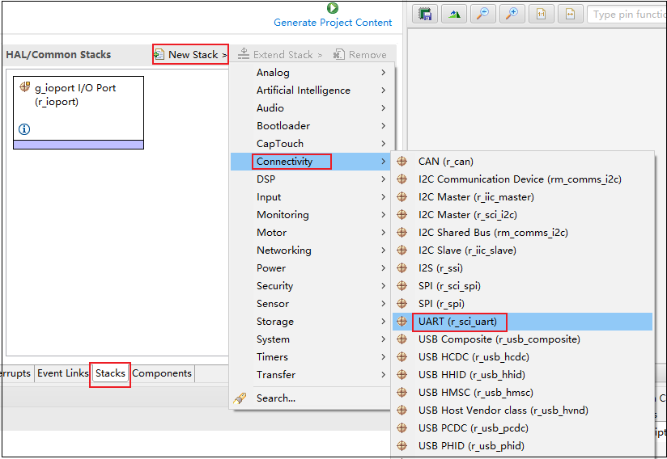 

2. 配置 UART 参数，因为需要适配 RT-Thread 驱动中使用的命名，所以需要修改命名，设置**name** 、**channel**  、**callback** 为一致的标号。
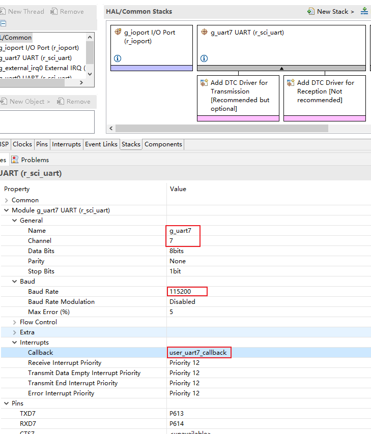

###  GPIO 中断

如何添加一个 IO 中断？

1. 选择引脚编号，进入配置，比如选择 P105 做为中断引脚。可先找到引脚查看可配置成的 IRQx 通道号。

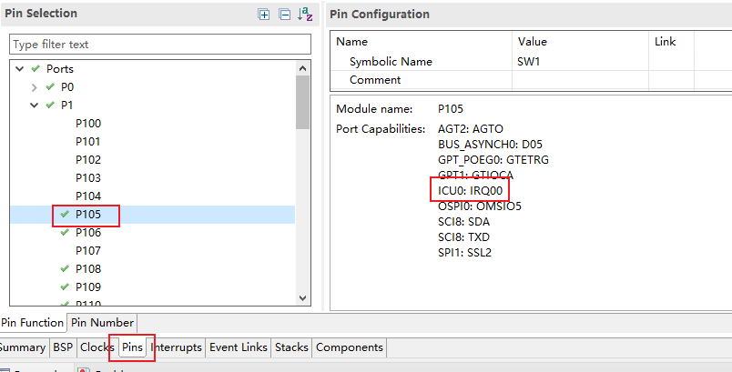 

2. 打开 ICU 中断通道 IRQ00

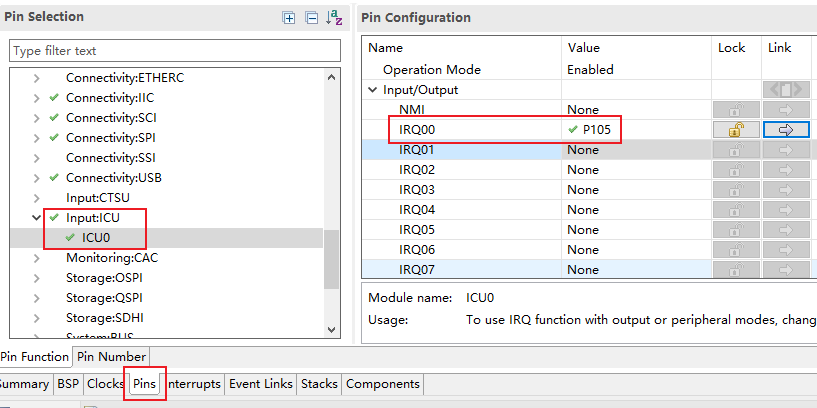 

3. 创建 stack 并进入配置。因为需要适配 RT-Thread 驱动中使用的命名，所以需要修改命名，设置 **name** 、**channel**  、**callback** 为一致的标号。选择你希望的触发方式，最后保存配置，生成配置代码。

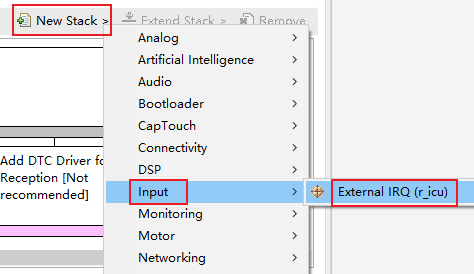 

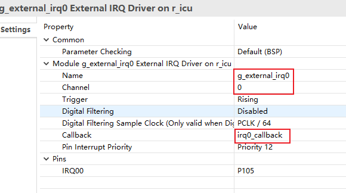 

4. 测试中断是否成功开启

   ```c
   #define IRQ_TEST_PIN	"p105"
   void irq_callback_test(void *args)
   {
       rt_kprintf("\n IRQ00 triggered \n");
   }
   
   void icu_sample(void)
   {
       /* init */
       rt_uint32_t pin = rt_pin_get(IRQ_TEST_PIN);
       rt_kprintf("\n pin number : 0x%04X \n", pin);
       rt_err_t err = rt_pin_attach_irq(pin, PIN_IRQ_MODE_RISING, irq_callback_test, RT_NULL);
       if(RT_EOK != err)
       {
           rt_kprintf("\n attach irq failed. \n");
       }
       err = rt_pin_irq_enable(pin, PIN_IRQ_ENABLE);
       if(RT_EOK != err)
       {
           rt_kprintf("\n enable irq failed. \n");
       }
   }
   MSH_CMD_EXPORT(icu_sample, icu sample);
   ```

### WDT

1. 创建 WDT

 

2. 配置 WDT，需要注意在 RT-Thread 中只使用了一个 WDT 设备，所以没有对其进行编号，如果是新创建的 WDT 设备需要注意 name 字段，在驱动中默认使用的是`g_wdt` 。

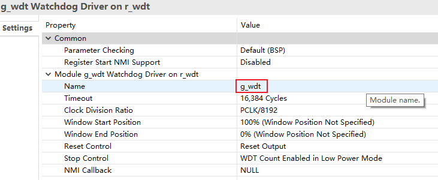 

3. 如何在 ENV 中打开 WDT 以及[WDT 接口使用说明](https://www.rt-thread.org/document/site/#/rt-thread-version/rt-thread-standard/programming-manual/device/watchdog/watchdog)

 

### RTC

1. 添加 RTC 设备

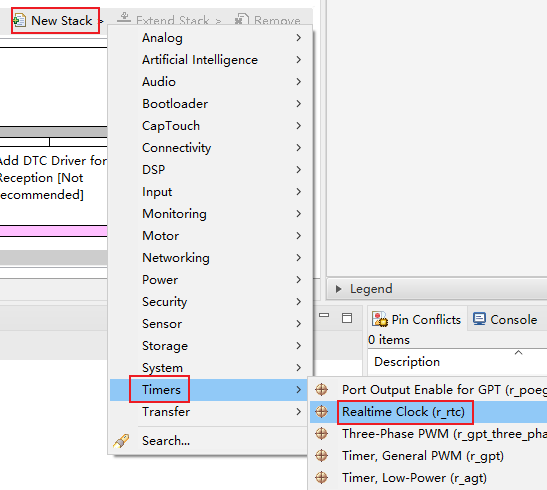 

2. 配置 RTC，需要注意在 RT-Thread 中只是用了一个 RTC 设备，所以没有对其进行编号，如果是新创建的 RTC 设备需要注意 name 字段，在驱动中默认使用的是`g_rtc` 。修改 Callback 为 rtc_callback

 

3. 如何在 ENV 中打开 RTC 以及[ RTC 接口使用说明](https://www.rt-thread.org/document/site/#/rt-thread-version/rt-thread-standard/programming-manual/device/rtc/rtc)

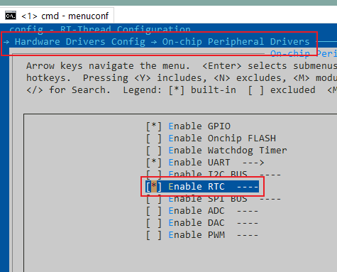 

### Flash

1. 创建 Flash

 

2. 配置 Flash，需要注意在 RT-Thread 中只使用了一个 flash 设备，所以没有对其进行编号，如果是新创建的 flash 设备需要注意 name 字段，在驱动中默认使用的是`g_flash` 。

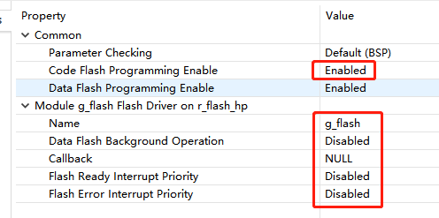 

3. 如何在 ENV 中打开 Flash

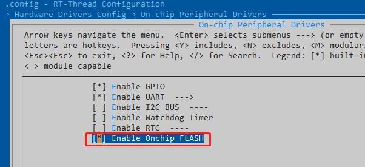 

### SPI

1. 添加一个 SPI 外设端口

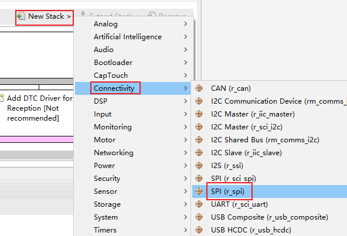 

2. 配置 channel、name、Clock Phase、Clock Polarity、Callback、 SPI Mode 等参数，波特率在代码中可通过 API 修改，这里可以设置一个默认值。

 

3. 在 Pins 中打开 SPI1 ，配置端口引脚。**注意：请勿在此处配置 SSLx 片选引脚，片选引脚的控制在驱动程序中由软件控制。**

 


4. 如何在 ENV 中打开 SPI 以及 [SPI 接口使用说明](https://www.rt-thread.org/document/site/#/rt-thread-version/rt-thread-standard/programming-manual/device/spi/spi)

 

### ADC/DAC

创建 ADC/DAC

 

- **ADC**

1. 配置 name、unit、mode，选择扫描的通道编号

 

2. 配置扫描通道对应的引脚

 

3. 在 menuconfig 中打开对应的通道

- **DAC**

1. 需要先关闭 P014 的默认 mode

 

2. 开启 DAC0 通道

 

3. 修改通道号为 0，与 DAC0 对应

 

4. 在 menuconfig 中打开对应的通道

### PWM（GPT）

GPT 定时器在该芯片中可作为通用定时器，也可以用于产生 PWM 信号。在将其用于产生 PWM 信号时，GPT 定时器提供了 gpt0 - gpt9 总共 10 个通道，每个通道可以设定两个输出端口。当前版本的 PWM 驱动将每个通道都看做一个单独的 PWM 设备，每个设备都只有一个通道。用户可以选择开启一个通道的任意一个输出端口，或将两个端口均开启，但在同时开启两个端口的情况下，它们输出的波形将完全一致。

1. 添加 GPT 设备

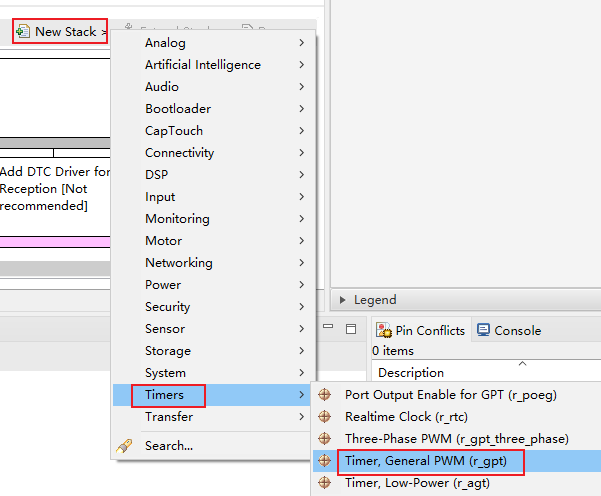 

2. 配置通道

 

   对 GPT 较为关键的配置如图所示，具体解释如下：

   1. 将``Common`` ->``Pin Output Support`` 设置为 Enable ，以开启 PWM 波形的输出。
   2. 指定 GPT 通道，并根据通道数指定 GPT 的名称，例如此处指定 GPT 通道 3 ，所以 GPT 的名称必须为``g_timer3``。并且将定时器模式设置为 PWM ，并指定每个 PWM 周期的计数值。
   3. 设定 PWM 通道默认输出的占空比，这里为 50% 。
   4. 设定 GPT 通道下两个输出端口的使能状态。
   5. 此处设置 GPT 通道下两个输出端口各自对应的引脚。
3. 配置输出引脚

 

   在完成上一步对 GPT 定时器的设置后，根据图示找到对应 GPT 通道输出引脚设置的界面（这里是 GPT3），将图中标号 **1** 处设置为 ``GTIOCA or GTIOCB`` ，并根据需要在图中标号 **2** 处设置 GPT 通道下两个输出端口各自对应的输出引脚。

   4. 在 menuconfig 中打开对应的通道，[RT-Thread 的 pwm 框架介绍](https://www.rt-thread.org/document/site/#/rt-thread-version/rt-thread-standard/programming-manual/device/pwm/pwm)

 

### CAN

1. 添加CAN

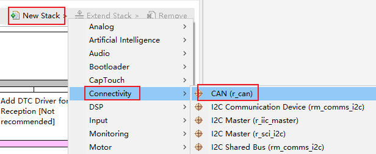 

2. 配置Callback为 `can0_callback` 或 `can1_callback`

 

3. 配置其他选项，并生成代码。

4. 使用ENV使能CAN。[CAN设备使用说明](https://www.rt-thread.org/document/site/#/rt-thread-version/rt-thread-standard/programming-manual/device/can/can)

 

### SDHI

1. 添加sdhi驱动

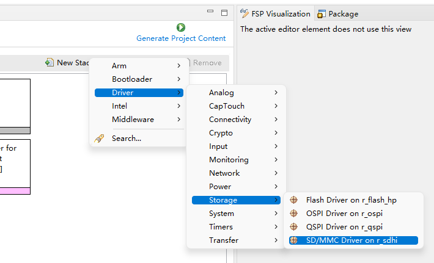 

1. 添加DMAC

 

2. 设置DMAC中断

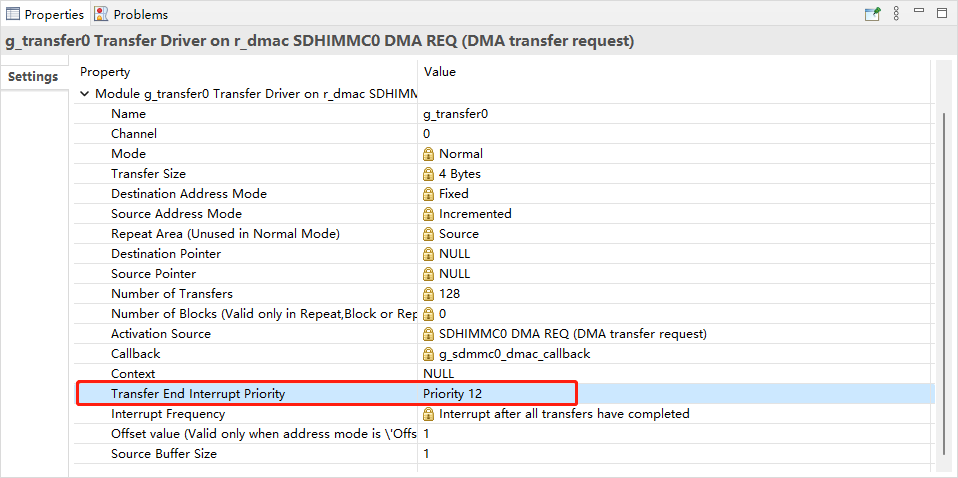 

3. 设置SDHI中断和引脚

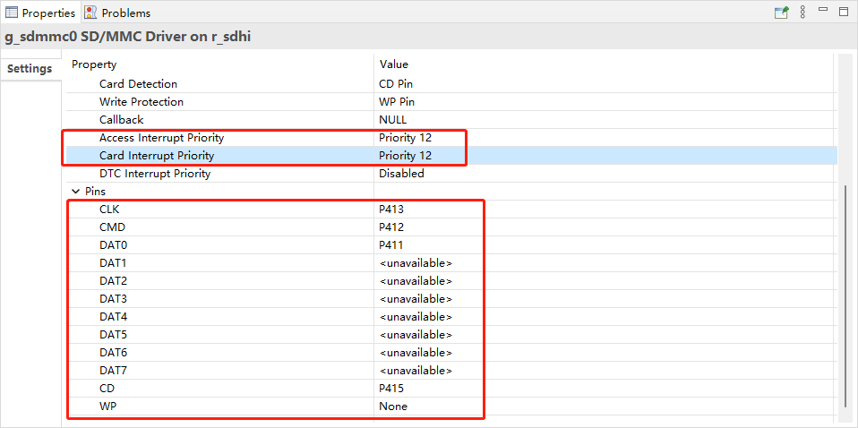 

4. 在ENV中打开SDHI

 

5. 在ENV中配置DFS，添加文件系统，如FatFS

 

6. 在命令行中，使用 `mkfs sd0 -t elm` 格式化sd卡

7. 在命令行中，使用 `mount sd0 / elm` 将sd0挂载到 `/`

8. 参考RT-Thread DFS使用手册[虚拟文件系统 (rt-thread.org)](https://www.rt-thread.org/document/site/#/rt-thread-version/rt-thread-standard/programming-manual/filesystem/filesystem)

### WiFi 模块: [RW007 ](https://github.com/RT-Thread-packages/rw007) 

1. 软件包配置中找到 RW007，并修改为下图配置。

 

2. menuconfig 中打开驱动的 RW007 配置，默认使用了 SPI1 端口。所以需要打开 SPI1 总线。

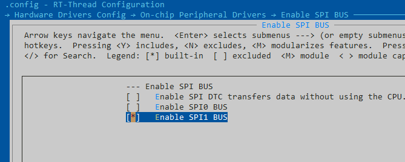 

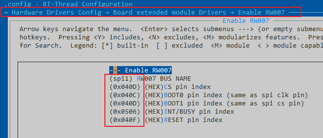 

3. 在设备驱动框架中打开 [WLAN 框架](https://www.rt-thread.org/document/site/#/rt-thread-version/rt-thread-standard/programming-manual/device/wlan/wlan)，

 

在网络配置中打开 NETDEV 组件：

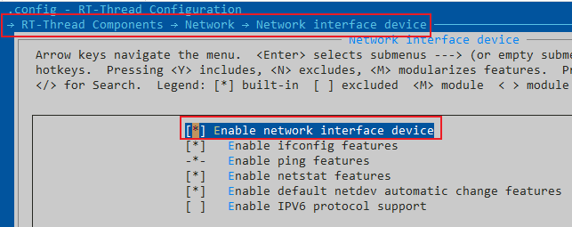 

在 kernel 中打开 mempool 配置：

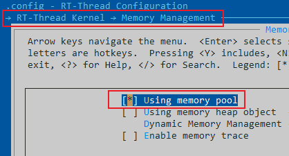 

4. FSP 中打开添加 SPI 外设端口，[如何添加SPI](#SPI)。下图以 SPI1 端口为例的配置如下：

 

5. RW007 有一个从机控制的 INT 引脚，需要占用一个 IRQ 通道，下图以 P506 为例的配置如下：

 

6. RW007 的 RESET 控制引脚修改默认配置，这里在 RASC 中 mode 设为关闭，交由 RW007 中进行控制。

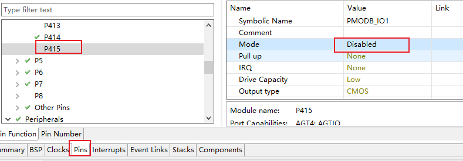 

7. 配置完成，检查 MDK 工程中是否加入了必要的文件

 

8. 编译下载，验证结果。

系统启动会自动获取 RW007 的信息，输入`wifi scan` 命令扫描环境中的 WiFi 信号。[更多 WiFi 命令](https://www.rt-thread.org/document/site/#/rt-thread-version/rt-thread-standard/programming-manual/device/wlan/wlan?id=finsh-%e5%91%bd%e4%bb%a4)

 

使用 `WiFi join` 命令连接 WiFi 热点 ：

 

使用 `ping rt-thread.com` 测试网络连接：

 