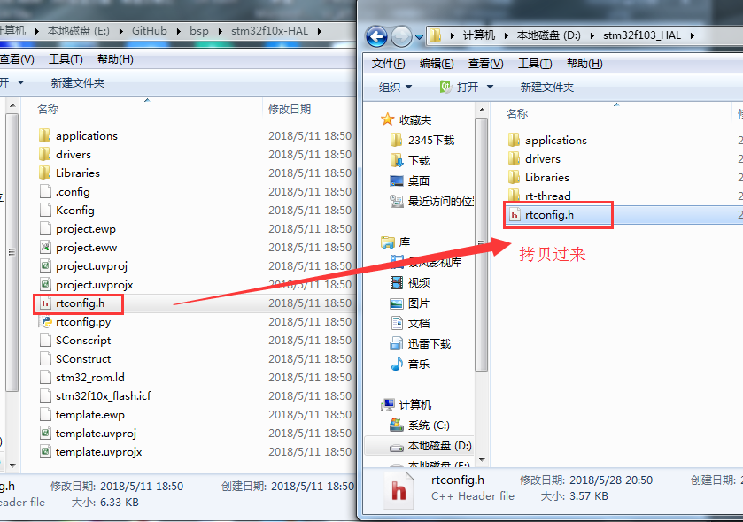
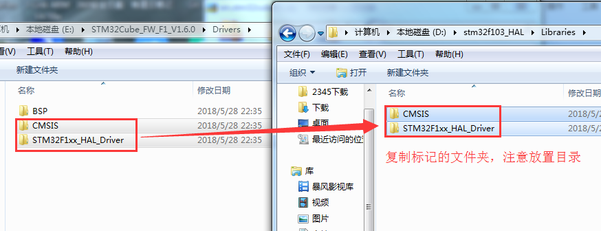

# Keil 下搭建 RT-Thread 最小系统工程

对于初次接触 RT-Thread 的朋友来说，要想自己建立一个 Keil 下的工程，可能会觉得不知所措，本文将一 STM32F103 为例介绍最小系统的建立过程。

本文所使用的方法是非常传统的 ，只适用于非常简单的工程建立，用于初学者了解 RT-Thread 最小系统工程的建立，不建议在实际开发中使用该方式。

实际开发中推荐使用 Env 和 scons` 辅助工具来裁剪功能和组织文件 `，这部分将不在本部分说明，建议读者在熟悉 RT-Thread 内核后再去学习 scons 使用。

## 准备工作

### 下载固件库

ST 的 STM32 系列芯片，官方网站上为开发者提供了非常方便的开发库。到目前为止，有标准外设库 (STD 库)、HAL 库、LL 库 三种。前两者都是常用的库，后面的 LL 库是 ST 最近才添加，随 HAL 源码包一起提供，目前支持的芯片也偏少。其中，STD 库和 HAL 库两者相互独立，互不兼容。LL 库和 HAL 库两者相互独立，只不过 LL 库更底层。而且，部分 HAL 库会调用 LL 库（例如：USB 驱动）。同样，LL 库也会调用 HAL 库 。
这里，笔者将使用 STM32F1xx 系列的 HAL 固件库建立最小工程。我们从官网下载 [STM32CubeF1](http://www.st.com/content/st_com/en/products/embedded-software/mcus-embedded-software/stm32-embedded-software/stm32cube-mcu-packages/stm32cubef1.html)，这个软件包里就包含了我们需要的 HAL 库。

### 下载 RT-Thread 最新版本的源码

RT-Thread 是完全开源、开放的物联网操作系统，可以从官网下载相关的源代码和辅助开发工具。RT-Thread 项目源代码都保存在 Git 仓库中; 您可以将源文件下载为 tar.gz 文件，或者使用 Git 克隆和检出命令：

- 国外 github:https://github.com/RT-Thread/rt-thread;
- 国内 gitee:https://gitee.com/rtthread/rt-thread ；

由于国外服务器 github 速度较慢，建议从 gitee 上下载，也可以选择从备份的网盘中下载 RT-Thread 发布的各个版本源代码：
- 百度网盘：https://pan.baidu.com/s/1mgIAyWo#list/path=%2F

> 提示：说明：RT-Thread 源代码下载包较大，因其包含有将近 90 个 BSP（实际你只需要提取自己的板卡对应的 BSP 即可），而 Git 仓库不提供单独下载某个文件，请下载源码时多一些耐心。
>

注：请下载最新版本的源码，否则可能导致搭建的工程不能仿真。

### 拷贝需要的文件

我们先建立 4 个文件夹并命名如下，将之前下载到的固件库和 RT-Thread 源码提取部分需要的文件，拷贝并按照下面的文件夹结构重新组织文件。


在动手之前，先对上面的文件夹结构做个简短的说明：

|   文件夹  |  说明   |
| --- | --- |
|  根目录   |  存放 MDK 的工程文件及 rtconfig.h 文件   |
|   applications  |   存放一些用户的应用代码文件  |
|   drivers  |  用于存放设备驱动的底层驱动实现   |
|   Libraries  |   用于存放我们从芯片官网下载的固件库  |
|   rt-thread  |   用于存放 RT-Thread 的源码包  |

具体的拷贝内容如下：
 - 根目录：从 RT-Thread 源码的目录里 rt-thread\bsp\stm32f10x-HAL\ 里复制 `rtconfig.h` 文件。`rtconfig.h`：RT-Thread 的配置文件，通过宏定义打开 / 关闭各功能组件。

 

 - drivers：从下载的 RT-Thread 源码的目录里 rt-thread\bsp\stm32f10x-HAL\drivers 里复制文件：
    1)  `drv_usart.c`，`drv_usart.h`：串口的底层实现，因为我们需要通过串口输入 finsh/msh 命令和打印系统信息；
    2)  `board.h`，`board.c`：开发板的初始化配置文件；
    3)  `stm32f1xx_it.h`, `stm32f1xx_it.c`: 中断配置文件；
    4)  `stm32f1xx_hal_conf.h`：官方固件库的配置文件，可以配置需要使用到的固件库。

 

 - Libraries：把下载的固件库里的 `CMSIS`、`STM32F1xx_HAL_Driver` 内容放到我们建立的 `Libraries` 文件夹下。

 

 - rt-thread：把下载的 RT-Thread 源码目录下的 `components`，`libcpu`，`include`，`src` 四个文件夹拷贝到这个目录下。`components` 里包含了协议驱动的上层实现，`libcpu` 包含了对各种厂家内核芯片的支持文件，`include` 和 `src` 包含了系统的各种内核组件的源码和头文件。

 

 - applications：从 rt-thread\bsp\stm32f10x-HAL\applications 文件中复制 `main.c` 文件到我们的建立的文件夹 applications 中。

 

## 搭建最小系统工程

### MDK 中新建工程

1) 从 MDK 中新建工程项目，并选择保存在我们建立的根目录下：


2) 选择所使用的具体芯片型号后点击 “OK” 确定选择：


3) Manage Run-Time Environment 配置页选择 cancel。


4) 修改工程属性，并建立分组：


### 工程中添加文件

在上一小节中新建的分组里添加文件，详见下表：

|      groups    |   需要添加的文件        |
| ---------------- | ---------------------------- |
| Applications | `applications`文件夹下的`main.c` |
|     Drivers     | `drivers`文件夹下的`board.c`、`drv_usart.c`、`stm32f1xx_it.c`文件。 |
| STM32_HAL | 官方固件库下的:`Libraries\STM32F1xx_HAL_Driver\src`文件夹中除了`stm32f1xx_hal_msp_template.c`、`stm32f1xx_hal_timebase_tim_template.c`、`stm32f1xx_hal_timebase_rtc_alarm_template.c`这三个文件外的所有.c文件；<br>`Libraries\CMSIS\Device\ST\STM32F1xx\Source\Templates`目录下的`system_stm32f1xx.c`文件；<br/>`Libraries\CMSIS\Device\ST\STM32F1xx\Source\Templates\arm`目录下的`startup_stm32f103xe.s`文件。 |
|  Kernel  |   `rt-thread\src` 目录下的所有.C文件  |
|  CORTEX-M3  | `rt-thread\libcpu\arm\cortex-m3`目录下的`context_rvds.S`和`cpuport.c`文件。 |
|  DeviceDrivers  |  `rt-thread\components\drivers`目录下`src`和`serial`两个文件夹中的所有.C文件  |
|  finsh  |   `rt-thread\components\finsh`目录下的所有.C文件。  |

工程如图：


### 添加包含文件路径

添加完文件，接下来在项目设置里的 `C/C++` 页里的 `Include Path` 添加这些源文件包含的头文件的路径。


### 工程中的其他设置

在下图所示区域设置器件类型和制定使用 stm32 固件库：`USE_HAL_DRIVER, STM32F103xE`。


设置好之后编译无错误。


如下图，选择软件仿真，将Dialog DLL设置为`DARMSTM.DLL`，Parameter设置为`-pSTM32F103C8`（由相应的芯片型号而定），之后点 `OK` 确定：


仿真运行，命令窗口有错误输出：


这个错误是由 `rtconfig.h` 里设置的芯片和刚开始我们建立工程时所选器件型号不一致，导致的存储器地址访问超范围。将定义改为:

```c
    #define STM32F103C8
```

再次编译运行无错误：


再次重申本文所使用的方法仅用于初学者了解 RT-Thread 最小系统工程的建立，不建议在实际开发中使用该方式。

实际开发中推荐使用 Env 和 scons` 辅助工具来裁剪功能和组织文件 `，这部分将不在本部分说明，建议读者在熟悉 RT-Thread 内核后再去学习 scons 使用。
