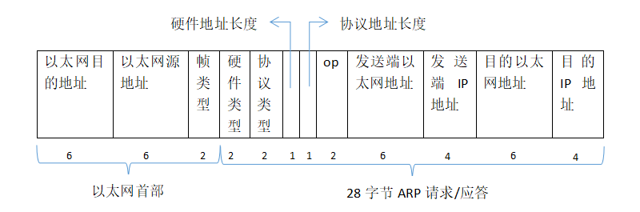

# ARP : 网络世界到物理世界的桥梁

## ARP 协议

ARP（Address Resolution Protocol）地址解析协议，是根据 IP 地址获取物理 MAC 地址的一个 TCP/IP 协议。

现在局域网中主机的 IP 一般都是动态分配的，这样做的好处是提高了 IP 的利用率；缺点是，当数据到来时只根据 IP 地址就不能确定到底哪一台主机了。因此需要弄一个缓存表，用来记录 IP 和 主机 MAC 地址的对应关系，这个缓存表就是 ARP 高速缓冲表 。

ARP协议的基本功能就是通过目标设备的 IP 地址，查询目标设备的 MAC 地址，同时，维护 ARP 高速缓冲表，以保证通信的顺利进行。

ARP 的分组格式如下图所示：

**以太网的源地址**和**目的地址**。目的地址为全1的特殊地址是广播地址。电缆上的所有以太网接口都要接收广播的数据帧。

以太网**帧类型**表示后面数据的类型。对于 ARP 请求或应答来说，该字段的值为 0x0806。

**硬件类型**字段表示硬件地址的类型。它的值为1即表示以太网地址。

**协议类型**字段表示要映射的协议地址类型。它的值为 0x0800 即表示 IPv4 协议。

**硬件地址长度**和**协议地址长度**分别指出硬件地址和协议地址的长度，以字节为单位。对于以太网上 IP 地址的 ARP 请求或应答来说，它们的值分别为 4 和 6。

**操作字段**指出四种操作类型，它们是 ARP 请求（值为1）、ARP 应答（值为2）、RARP 请求（值为3）和 RARP 应答（值为 4）。

**发送端的硬件地址**（在本例中是以太网地址）、**发送端的协议地址**（ IP 地址）、

**目的端的硬件地址**和**目的端的协议地址**。

**注意：**这里有一些重复信息：在以太网的数据帧报头中和 ARP 请求数据帧中都有发送端的硬件地址。

## ARP 过程分析

例如：

主机 A ：IP：192.168.0.2；MAC：00-00-C0-15-AD-18.

主机 B ：IP：192.168.0.4；MAC：08-00-2B-00-EE-AA.

当局域网的主机 A 接收到发给 IP：192.168.0.4 的数据，他就需要转发数据给主机 B，首先主机 A先查询自己的 ARP 缓存看是否有主机 B 对应的 MAC 地址，如果没有的话，主机 A 就会运行 ARP。

1. 主机 A 在本局域网广播一个 ARP 请求分组 。ARP请求分组的主要内容是表明：我的 IP 地址是 192.168.0.2，我的 MAC 地址是 00-00-C0-15-AD-18 .我想知道 IP 地址为 192.168.0.4 的主机的 MAC 地址。
2. 在本局域网上的所有主机都收到此 ARP 请求分组。
3. 主机 B 在 ARP 请求分组中见到自己的 IP 地址，就向主机 A 发送 ARP 响应分组，并写入自己的 MAC 地址。其余的所有主机都不理睬这个 ARP 请求分组。ARP 响应分组的主要内容是表明：“我的 IP 地址是192.168.0.4,我的硬件地址是 08-00-2B-00-EE-AA ”,请注意：虽然 ARP 请求分组是广播发送的，但 ARP 响应分组是普通的单播，即从一个源地址发送到一个目的地址。
4. 主机 A 收到主机 B 的 ARP 响应分组后，就在其 ARP 高速缓冲表中写入主机 B 的 IP 地址到 MAC 地址的映射。

然后，现在主机 A 就可以给主机 B 发送数据了。

整个 ARP 的过程如下图所示：

## 抓包分析

其实 QEMU 在刚开始运行的时候就会自动运行 ARP，只要在开始运行 QEMU 之前开启抓包就能抓到 ARP的包

1. 打开 wireshark 软件 开启抓包，设定过滤条件为 arp，只显示 ARP 协议的包。
2. 运行 QEMU

查看 wireshark ，发现已经抓到了 ARP 协议 的数据包

我们也可以点开封包详细信息然后和上面的 ARP 的分组格式做对比

当然还有回复 ARP 请求分组的数据包，如下图所示：

