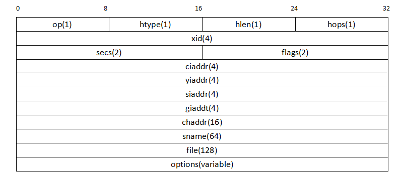
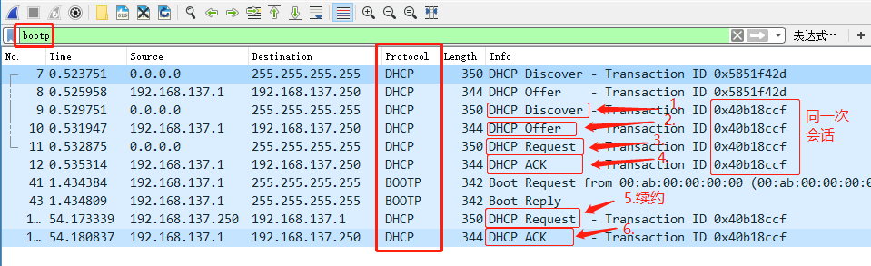
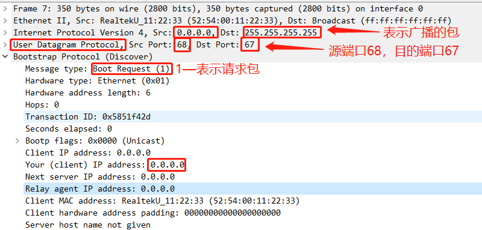
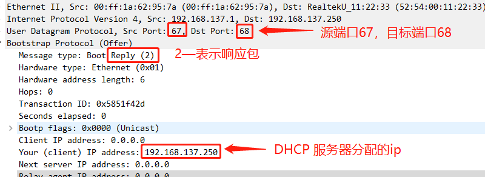

# DHCP : 网络世界身份的获取

## DHCP 协议

DHCP（Dynamic Host Configuration Protocol，动态主机配置协议）前身是 BOOTP 协议，是一个局域网的网络协议。它是一种 **服务器- 客户端** 的工作模式，使用 UDP 协议工作，常用的 2 个端口：67(DHCP server), 68(DHCP  client)。

DHCP 通常被用于局域网环境，主要作用是集中的管理、分配 IP 地址，使 client 动态的获得 IP 地址、Gateway 地址、DNS 服务器地址等信息，并能够提升地址的使用率。

## DHCP 报文种类

DHCP 一共有 8 种报文，分别为 DHCP Discover、DHCP Offer、DHCP Request、DHCP ACK、DHCP NAK、DHCP Release、DHCP Decline、DHCP Inform。各种类型报文的基本功能如下：

| DHCP报文类型  | 说明                                                         |
| ------------- | ------------------------------------------------------------ |
| DHCP Discover | DHCP 客户端在请求 IP 地址时并不知道 DHCP 服务器的位置，因此 DHCP 客户端会在本地网络内以广播方式发送 Discover 请求报文，以发现网络中的 DHCP 服务器。所有收到 Discover 报文的 DHCP 服务器都会发送应答报文，DHCP 客户端据此可以知道网络中存在的 DHCP 服务器的位置。 |
| DHCP Offer    | DHCP 服务器收到 Discover 报文后，就会在所配置的地址池中查找一个合适的IP地址，加上相应的租约期限和其他配置信息（如网关、DNS服务器等），构造一个 Offer 报文，发送给 DHCP 客户端，告知用户本服务器可以为其提供 IP 地址。但这个报文只是告诉 DHCP 客户端可以提供 IP 地址，最终还需要客户端通过 ARP 来检测该 IP 地址是否重复。 |
| DHCP Request  | DHCP 客户端可能会收到很多 Offer 请求报文，所以必须在这些应答中选择一个。通常是选择第一个 Offer 应答报文的服务器作为自己的目标服务器，并向该服务器发送一个广播的 Request 请求报文，通告选择的服务器，希望获得所分配的IP地址。另外，DHCP 客户端在成功获取 IP 地址后，在地址使用租期达到 50% 时，会向 DHCP 服务器发送单播 Request 请求报文请求续延租约，如果没有收到 ACK 报文，在租期达到 87.5% 时，会再次发送广播的 Request 请求报文以请求续延租约。 |
| DHCP ACK      | DHCP 服务器收到 Request 请求报文后，根据 Request 报文中携带的用户 MAC 来查找有没有相应的租约记录，如果有则发送 ACK 应答报文，通知用户可以使用分配的 IP 地址。 |
| DHCP NAK      | 如果 DHCP 服务器收到 Request 请求报文后，没有发现有相应的租约记录或者由于某些原因无法正常分配 IP 地址，则向 DHCP 客户端发送 NAK 应答报文，通知用户无法分配合适的 IP 地址。 |
| DHCP Release  | 当 DHCP 客户端不再需要使用分配 IP 地址时，就会主动向 DHCP 服务器发送 RELEASE 请求报文，告知服务器用户不再需要分配 IP 地址，请求 DHCP 服务器释放对应的 IP 地址。 |
| DHCP Decline  | 当客户端发现服务器分配的IP地址无法使用（如IP地址冲突时），则会向 DHCP 服务器发送 Decline 请求报文，通知服务器所分配的 IP 地址不可用，以期获得新的 IP 地址。 |
| DHCP Inform   | DHCP 客户端如果需要从 DHCP 服务器端获取更为详细的配置信息，则向 DHCP 服务器发送Inform 请求报文；目前基本上已经弃用了。 |

正常的工作流程如下：

## DHCP 报文格式

DHCP 服务的 8 种报文的格式是相同的，不同类型的报文只是报文中的某些字段取值不同。DHCP 报文格式基于 BOOTP 的报文格式，如下图所示：

下面是各字段的说明。

- **OP** : 报文的操作类型。若是 client 送给 server 的封包，设为 1 ，反向为 2。
- **htype** : 客户端的MAC地址类型 ，Ethernet 为 1。
- **hlen** : 客户端的 MAC 地址长度 ， Ethernet 为 6。
- **hops** : DHCP 报文经过的 DHCP 中继的数目，默认为 0。DHCP 请求报文每经过一个 DHCP 中继，该字段就会增加 1。没有经过 DHCP 中继时值为 0。
- **xid **: 随机生成的一段字符串，两个数据包拥有相同的 xid 说明他们属于同一次会话
- **secs** : DHCP 客户端从获取到 IP 地址或者续约过程开始到现在所消耗的时间，以秒为单位。
- **flags** : 标志位，只使用第 0 比特位，是广播应答标识位，用来标识 DHCP 服务器应答报文是采用单播还是广播发送，0 表示采用单播发送方式，1 表示采用广播发送方式。其余位尚未使用。
- **ciaddr **: 客户端的 IP 地址。仅在 DHCP 服务器发送的ACK报文中显示，在其他报文中均显示0
- **yiaddr **: DHCP 服务器分配给客户端的 IP 地址。仅在 DHCP 服务器发送的 Offer 和 ACK 报文中显示，其他报文中显示为 0。
- **siaddr** : 若 client 需要透过网络开机，从 server 送出之 DHCP OFFER、DHCPACK、DHCPNACK封包中，此栏填写开机程序代码所在 server 之地址。
- **giaddr **: 若需跨网域进行 DHCP 发放，此栏为 relay agent 的地址，否则为 0。
- **chaddr** : DHCP 客户端的 MAC 地址
- **sname** : DHCP 服务器的名称（DNS域名格式）。在 Offer 和 ACK 报文中显示发送报文的 DHCP 服务器名称，其他报文显示为0。
- **file** : 若 client 需要透过网络开机，此栏将指出开机程序名称，稍后以 TFTP 传送。
- **options** : 允许厂商定义选项（Vendor-Specific Area)，以提供更多的设定信息（如：Netmask、Gateway、DNS、等等）。长度可变，格式为"代码+长度+数据"。

列出 options 部分可选的选项：

| 代码 | 长度(字节)                        | 说明                                                         |
| ---- | --------------------------------- | ------------------------------------------------------------ |
| 1    | 4                                 | 子网掩码                                                     |
| 3    | 长度可变，必须是4个字节的倍数。   | 默认网关（可以是一个路由器IP地址列表）                       |
| 6    | 长度可变，必须是4个字节的整数倍。 | DNS服务器（可以是一个DNS服务器IP地址列表）                   |
| 15   | 长度可变                          | 域名称（主DNS服务器名称）                                    |
| 44   | 长度可变，必须是4个字节的整数倍。 | WINS服务器（可以是一个WINS服务器IP列表）                     |
| 51   | 4                                 | 有效租约期（以秒为单位）                                     |
| 53   | 1                                 | 报文类型1: DHCP Discover2: DHCP Offer3: DHCP Request4: DHCP Decline5: DHCP ACK6: DHCP NAK7: DHCP Release8: DHCP Inform |
| 58   | 4                                 | 续约时间                                                     |

## 抓包分析

QEMU 在刚开始运行的时候就会自动运行 DHCP，只要在开始运行 QEMU 之前开启抓包就能抓到 DHCP 的包

1. 打开 wireshark 软件 开启抓包，设定过滤条件为 bootp，只显示 DHCP 相关的包。
2. 运行 QEMU

查看 wireshark ，发现已经抓到了 DHCP 协议 的数据包

其中的 1-6 就对应着上面的工作流程的那 6 个过程。

我们也可以点开封包详细信息然后和上面的 DHCP 的报文格式做对比

点开 DHCP Discover 数据包， 从下图可以看出，DHCP 属于应用层协议，它在传输层使用 UDP 协议，目的端口是 67。

当然还有回复 DHCP 服务器响应请求的数据包，如下图所示：

其他的一些选项对照着上面的报文格式做对比，就可以很容易的了解 DHCP 协议的工作过程了。

