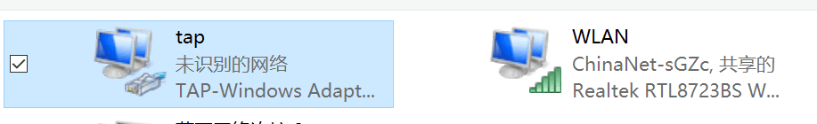

# 常见问题及解决方法

不太会使用 Env 工具的请先看一遍 [《Env 用户手册》](../../../programming-manual/env/env.md)（不长的，看完费不了几分钟）

> 提示：1. Env 工具和 源码 所处的目录都不能有中文或空格请先检查！！
    2. code 是一个命令 点 ‘.’ 是一个参数表示当前目录，中间有一个空格。
    3. romfs ramfs 文件系统中的文件名和c的变量的命名一样，只能由英文字母开头且仅包含数字和下划线。
    4. 修改 qemu.bat 里面的参数时，要注意那是一行参数中间没有空格（复制粘贴完要注意）。其中ifname=tap 的意思就是虚拟TAP网卡的名字重命名为了 tap，如下图所示

## 基础知识

### Q: 如何添加环境变量？

> [!NOTE]
> 注：首先请确认下面红框里的环境变量是否都有，修改完环境变量之后，要注销或重启电脑才能使环境变量生效

### Q: 终端为什么会显示乱码？

**A:** 图中的 `?[m?[` 是终端字体颜色的代码，显示出来是因为终端不支持颜色显示。

### Q: 为什么获取不到 IP 地址？

**A:** 获取不到 IP 地址的可能有很多，一般有如下几种情况：

1. 一般启动 qemu 之后需要等个几秒才能获取到 IP 地址。

2. 第一次开机可能获取不到 IP 地址，只要在 qemu 运行着的情况下，关闭网络共享，然后再开一次即可。

3. 获取到的 IP 地址时 `10.0.x.x` 说明没有添加启动参数，请参照上面基础知识第 4 条添加启动参数。

4. 如果运行 QEMU 时，tap 网卡的显示的不是`未识别的状态` ，那可能是启动参数填错了，请参照上面基础知识第 4 条修改为正确的启动参数。

5. 如果都设置对了，运行时 tap 网卡显示 `未识别的状态`，右键 tap 网卡点击 `状态`，如果是 `无 Internet 连接` ，请进行网络诊断试试。
6. 有 VMvare 网卡的可以先禁用 再试一次。

### Q: 为什么我的 menuconfig 和教程的不一样？

**A:** 应该是 Env 的软件包索引需要更新了，或者需要先按空格开启这一项功能，然后再按回车进入配置项。

**解决方法：** 在 Env 输入命令 `pkgs --upgrade` 更新 Env 的运行脚本和软件包索引。 具体方法参见：[《Env 用户手册》](../../../programming-manual/env/env.md)

## 环境搭建

### Q: 为什么我的 scons 编译结果不一样，很少？

**A:** 这不是问题，编译器只编译被改变过的文件，没有改变的不会重复编译，而且，显示已经编译完成了。另外，图中的 `?[m?[` 是终端字体颜色的代码，显示出来是因为终端不支持颜色显示。

### Q: 为什么 pkgs --update 更新失败？

**A:** 这可能是没有安装Git，也可能是没有添加环境变量

**解决方法：** 安装Git，添加环境变量，并需要注销或者重启系统添加环境变量方法

### Q: 为什么会创建网桥失败？

**A:** 共享和网桥只能使用一种方式，不要同时使用。

### Q: 为什么会网络共享失败？

**A:** 可能是杀毒软件将防火墙服务关了，需要手动开启防火墙功能

具体的解决办法，可以参考：<https://jingyan.baidu.com/article/d5c4b52bcb9f04da560dc59d.html>

### Q: 我的 Tap 网卡为什么显示未识别的网络？

**A:** 这是==正常==的状态，如果获取不到ip 只要在qemu运行的情况（即tap网卡显示未识别的网络）下关闭网络共享，再重新打开即可。

### Q: Scons 为什么不是可运行的程序？

**A:** 这是因为 RT-Thread 的代码需要更新了，更新源码到最新 或 按视频操作下载最新的源码。

### Q: 为什么运行时有红色 SDIO 错误？

**A：** 这个是因为模拟的 SD 卡不支持高速模式，不用管，没有影响。

### Q: 为什么提示找不到 ping 命令？

**A：** 只是由于虽然打开了 RT-Thread online packages  ---> 里面的某些功能，但是由于一些原因却没有成功更新到本地上造成的。有以下几种情况：

1. 没有在 online packages 里开启 ping 的功能
2. 没有更新软件包
3. 网络不好更新失败
4. 更新成功了却没有 scons 重新编译

**解决方法：**

更新软件包的方法：

- 手动更新软件包 输入命令 pkgs --update
- 开启自动更新软件包功能

网络不好更新失败的：
去官网下载最新版 env，然后在 Env 的配置 menuconfig -s 里面开启镜像源下载 pkgs download using mirror server

## Vscode 调试

### Q: 为什么输入 code 命令打不开 VS Code？

> [!NOTE]
> 注：code 是命令 ‘.’ 是参数，中间有空格

**A：** 添加 vscode 所在路径的环境变量，添加环境变量,并需要注销或者重启系统

### Q: 为什么调试时提示找不到 ‘qemu-system-arm’？

**A：** 直接打开 VS Code 调试工程会有这个错误，**每次调试请使用 Env 工具在 BSP 根目录使用`code .`命令打开 VS Code** 。

### Q: 为什么 VS Code 调试选项没有 Debug@windows 选项？

**A：** 请更新 RT-Thread 源代码到 v3.1.0 及以上版本。

### Q: 为什么提示找不到 qemu debug？

 **A：** 请看下图中的操作步骤

### Q: 为什么会出现 cppdbg 错误？

 **A：** 只是没有安装插件的原因，请按教程文档上描述安装上 c/c++ 插件

### Q: 为什么调试报错，出现一长串数字？

**A：** 这是因为没有在文件 qemu-dbg.bat 的参数前加 start 或者 没关闭之前运行的 qemu,要先关闭之前运行的 qemu，才能开始调试。

**解决方法：** 按教程中操作，在文件 qemu-dbg.bat 的参数前加 start 或着先关闭之前运行的 qemu，再按 F5。

### Q: 为什么按 F5 不能调试？

**A:** 笔记本电脑的 F5 一般和功能键复用了，如果按下 F5 是调节屏幕亮度或其他功能，可以尝试按 `Fn + F5`。

## 文件系统

### Q: 为什么 romfs 编译会报错？

**A：** romfs ramfs 文件系统中的**文件名**和c的变量的命名一样，只能由英文字母开头且仅包含数字和下划线，不能有中横线。

### Q: 为什么 ramfs 运行会出现断言错误？

**A：** 这是一个已经解决的 bug ，需要更新源码，拉取最新源码的方法见第一节环境搭建的视频。

### Q: 为什么中文名的文件会显示乱码？

**A:** 因为显示的编码不同，VScode 是 UTF8， Env 暂时还不支持 UTF-8。

### Q: 为什么 Env 中找不到示例代码的选项？

**A：** Env 工具需要更新了，输入命令 `pkgs --upgrade` 升级 env,然后请仔细看一遍 《Env 用户手册》（链接地址在本文档头部）。

### Q: 为什么输入 ls 命令提示 No such directory？

**A：** 这是文件系统初始化失败了，查看文件系统初始化的代码，检查问题。

## 网络抓包

检测不到网卡的话，请自行百度。

## socket 编程

注意：socket 不支持多线程操作
