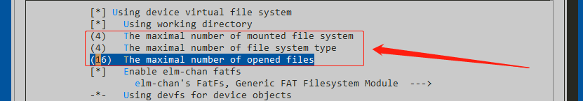

# 使用RT-Thread文件系统

<iframe frameborder="0" width="1005px" height="663px" src="https://v.qq.com/txp/iframe/player.html?vid=h0759dje9ir" allowFullScreen="true"></iframe>

> 提示：<a href="../filesystems.pdf" target="_blank">视频 PPT 下载</a>

## SD 卡挂载操作代码

挂载文件系统的源代码位于 `qemu-vexpress-a9\applications\mnt.c` 中。在实际代码中会将块设备 `sd0` 中的文件系统挂载到根目录 `/` 上。

```
#include <rtthread.h>

#ifdef RT_USING_DFS
#include <dfs_fs.h>

int mnt_init(void)
{
    rt_thread_delay(RT_TICK_PER_SECOND);

    if (dfs_mount("sd0", "/", "elm", 0, 0) == 0)
    {
        rt_kprintf("file system initialization done!\n");
    }

    return 0;
}
INIT_ENV_EXPORT(mnt_init);
#endif
```

## 常用命令展示

在挂载文件系统成功之后，就可以在 msh 中使用一些常用命令体验文件系统了。

### ls: 查看当前目录信息

```shell
msh />ls                          # 使用 ls 命令查看文件系统目录信息
Directory /:                      # 可以看到已经存在根目录 /
```

### mkdir: 创建文件夹

```shell
msh />mkdir rt-thread             # 创建 rt-thread 文件夹
msh />ls                          # 查看目录信息如下
Directory /:
rt-thread           <DIR>
```

### echo: 将输入的字符串输出到指定输出位置

```shell
msh />echo "hello rt-thread!!!"                    # 将字符串输出到标准输出
hello rt-thread!!!
msh />echo "hello rt-thread!!!" hello.txt          # 将字符串输出到 hello.txt 文件
msh />ls
Directory /:
rt-thread           <DIR>
hello.txt           18
msh />
```

### cat: 查看文件内容

```shell
msh />cat hello.txt                     # 查看 hello.txt 文件的内容并输出
hello rt-thread!!!
```

### rm: 删除文件夹或文件

```shell
msh />ls                                # 查看当前目录信息
Directory /:
rt-thread           <DIR>
hello.txt           18
msh />rm rt-thread                      # 删除 rt-thread 文件夹
msh />ls
Directory /:
hello.txt           18
msh />rm hello.txt                      # 删除 hello.txt 文件
msh />ls
Directory /:
msh />
```

## 运行文件系统示例程序

了解了文件系统的一些常用命令之后，下面带领大家通过运行文件系统的一些示例程序，来熟悉文件系统的基本操作。示例程序通过使用一些 DFS 的 API 接口来实现，并将示例导出到 msh 命令，通过运行示例程序并对照示例程序源码，有利于我们尽快上手操作文件系统。

### 获取示例代码

文件系统的示例代码包含在 RT-Thread samples 软件包中，可以通过 Env 配置将示例代码加入到项目中，路径如下所示。

```
 RT-Thread online packages  --->
     miscellaneous packages  --->
         samples: RT-Thread kernel and components samples  --->
             [*] a filesystem_samples package for rt-thread  --->
```

将示例代码全部选中，然后退出**保存**并**更新软件包**即可将示例代码加入到工程里。


### 运行示例代码

在运行示例代码之前需要先输入 `scons` 编译一遍工程。

然后输入 `.\qemu.bat` 运行工程

RT-Thread 启动完成之后，按 TAB 键查看 msh 命令，文件系统 samples 命令已经导出到 msh ：


然后就可以输入命令运行相应的示例代码了。

例如：执行命令 mkdir_sample 的运行结果是

```
msh />mkdir_sample
mkdir ok!
msh />ls
Directory /:
dir_test            <DIR>
```

然后我们就可以对照这几个示例代码的源码来详细的了解文件系统 API 的用法了。

## QEMU SD卡的读写

QEMU 运行起来之后会在 `bsp\qemu-vexpress-a9` 目录下创建一个 sd.bin 文件。这是一个虚拟的 SD 卡，RT-Thread 默认的文件系统就是搭建在这个里面的。


### 读取 QEMU SD 卡的内容

因 sd.bin 本质上就是一个 FAT 文件系统的镜像文件，所以我们利用支持提取 FAT 格式的解压软件 7-Zip 就可以将 sd.bin 里的文件读取出来。


### 制作 QEMU SD 卡

在 Env 工具的 `tools/fatdisk` 目录下有一个打包 FAT 格式文件的工具 fatdisk.exe，我们可以利用这个工具将我们要存储到QEMU SD卡里的文件打包成 sd.bin 文件。然后用新生成的 sd.bin 替换掉 `bsp\qemu-vexpress-a9` 目录下原来的 sd.bin 文件即可。

打开路径 `env/tools/fatdisk`  并在该目录下新建文件夹 sd


打开上一步我们创建好的文件夹，放入我们需要存储到QEMU SD卡里的文件或文件夹


修改 `env/tools/fatdisk` 目录下 fatdisk.xml 文件为下面的内容（视频中内容有误）

```xml
<?xml version="1.0" encoding="UTF-8"?>
<fatdisk>
   <disk_size>65536</disk_size>
   <sector_size>512</sector_size>
   <root_dir>sd</root_dir>
   <output>sd.bin</output>
   <strip>0</strip>
</fatdisk>
```

在 `env/tools/fatdisk` 目录下右键打开 Env 工具，输入命令 `fatdisk`  运行，就会在当前目录下生成 sd.bin 文件了。


然后用新生成的 sd.bin 替换掉 `bsp\qemu-vexpress-a9` 目录下原来的 sd.bin 文件

运行 qemu 输入 ls 可以看到我们存储到QEMU SD卡里的文件和文件夹了。


## 使用 RomFS

RomFS 是在嵌入式设备上常用的一种文件系统，具备体积小，可靠性高，读取速度快等优点，常用来作为系统初始文件系统。但也具有其局限性，RomFS 是一种只读文件系统。

不同的数据存储方式对文件系统占用空间，读写效率，查找速度等主要性能影响极大。RomFS 使用顺序存储方式，所有数据都是顺序存放的。因此 RomFS 中的数据一旦确定就无法修改，这是 RomFS 是一种只读文件系统的原因。也由于这种顺序存放策略，RomFS 中每个文件的数据都能连续存放，读取过程中只需要一次寻址操作，就可以读入整块数据，因此 RomFS 中读取数据效率很高。

### 配置使能 RomFS

开启 RT-Thread 对 RomFS 的支持，并调整最大支持的文件系统类型数目。

打开 menuconfig 菜单，保证 “RT-Thread Components” → “Device virtual file system” → “Enable ReadOnly file system on flash” 为开启状态：


打开子菜单  "RT-Thread Components" → "Device virtual file system" 调整最大支持文件系统系统类型数：



### 生成 romfs.c 文件

由于 RomFS 是只读文件系统，所以需要放入到 RomFS 的文件都需要在系统运行前加入。我们可以将要存入 RomFS 中的文件数据放在 romfs.c 文件中，RT-Thread提供了制作 romfs.c 的 Python 脚本文件 mkromfs.py，根据用户需要加入到 RomFS 的文件和目录生成对应的数据结构。

打开 mkromfs.py 脚本文件所在路径 `rt-thread\tools` 并在该目录下新建文件夹 romfs


打开上一步我们创建好的文件夹，放入我们需要在 RomFS 中放置的文件或文件夹。


回到上一级目录 `rt-thread\tools`，在该目录下打开 Env 工具，并运行命令：

```
python mkromfs.py romfs romfs.c
```

可以看到目录下成功生成 romfs.c 文件：


最后还需要生成的 romfs.c 文件拷贝在与 mnt.c 文件相同的路径 `qemu-vexpress-a9\applications` 内。

### 挂载 RomFS

在系统任务调度开始之后，通过 dfs_mount() 函数挂载 RomFS ，在添加挂载函数的文件中需添加头文件 `#include "dfs_romfs.h"`

我们将 `qemu-vexpress-a9\applications\mnt.c` 文件中的内容替换成下面的代码，即可将 RomFS 挂载到根目录。

```c
#include <rtthread.h>

#ifdef RT_USING_DFS
#include <dfs_fs.h>
#include "dfs_romfs.h"

int mnt_init(void)
{
    if (dfs_mount(RT_NULL, "/", "rom", 0, &(romfs_root)) == 0)
    {
        rt_kprintf("ROM file system initializated!\n");
    }
    else
    {
        rt_kprintf("ROM file system initializate failed!\n");
    }

    return 0;
}
INIT_ENV_EXPORT(mnt_init);
#endif
```

### 预期结果

编译并运行工程之后，可以看到 RomFS 文件系统挂载成功，使用 ls 命令可以看到 RomFS 文件系统里面的文件夹和文件：


## 使用 RamFS

RamFS 顾名思义是内存文件系统，它不能格式化，可以同时创建多个，在创建时可以指定其最大能使用的内存大小。其优点是读写速度很快，但存在掉电丢失的风险。如果一个进程的性能瓶颈是硬盘的读写，那么可以考虑在 RamFS 或 tmpfs 上进行大文件的读写操作。

RamFS 使用链式存储方式，并且数据存储在内存空间，因此 RamFS 具备了可读写文件系统的特征，同时也拥有较快的读写速度。

### 配置使能 RamFS

打开 menuconfig 菜单，保证 “RT-Thread Components” → “Device virtual file system” → “Enable RAM file system” 为开启状态：


### 挂载 RamFS

由于 RamFS 是在系统运行过程中动态创建的，所以在挂载之前我们应该先创建 RamFS ，RT-Thread 提供了创建 RamFS 的 API 接口:

```c
struct dfs_ramfs* dfs_ramfs_create(rt_uint8_t *pool, rt_size_t size)
```

| 参数     | 描述                         |
| -------- | ---------------------------- |
| pool     | 文件系统内存池地址           |
| size     | 文件系统大小                 |
| **返回** | **——**                       |
| > 0      | 文件系统根目录对应的数据结构 |
| < = 0    | 失败                         |

在系统任务调度开始之后，通过 dfs_mount() 函数挂载 RamFS

我们将 `qemu-vexpress-a9\applications\mnt.c` 文件中的内容替换成下面的代码，即可将 RamFS 挂载到根目录。

```c
#include <rtthread.h>

#ifdef RT_USING_DFS
#include <dfs_fs.h>

int mnt_init(void)
{
    if (dfs_mount(RT_NULL, "/", "ram", 0, dfs_ramfs_create(rt_malloc(1024),1024)) == 0)
    {
        rt_kprintf("RAM file system initializated!\n");
    }
    else
    {
        rt_kprintf("RAM file system initializate failed!\n");
    }

    return 0;
}
INIT_ENV_EXPORT(mnt_init);
#endif
```

### 预期结果

编译并运行工程之后, 可以看到 RamFS 文件系统挂载成功了。然后我们使用 echo 命令创建一个文件，可以看到创建成功了。


## 参考资料

* [文件系统 samples](https://github.com/RT-Thread-packages/filesystem-sample)
* [《Env 用户手册》](../../../programming-manual/env/env.md)

## 常见问题

* [常见问题及解决方法](../faq/faq.md)。
