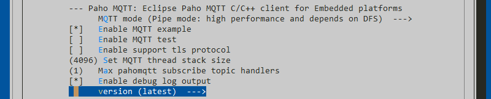
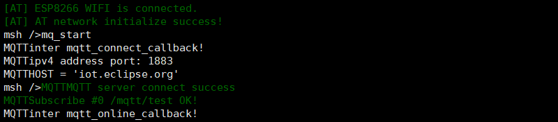
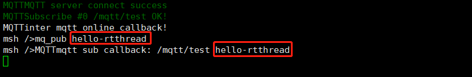

# 使用MQTT进行物联网即时通讯

<iframe frameborder="0" width="1005px" height="663px" src="https://v.qq.com/txp/iframe/player.html?vid=x07652l5chl" allowFullScreen="true"></iframe>

> 提示：<a href="../mqtt.pdf" target="_blank">视频 PPT 下载</a>

## 背景介绍

MQTT（Message Queuing Telemetry  Transport，消息队列遥测传输协议），是一种基于发布/订阅（publish/subscribe）模式的“轻量级”通讯协议，该协议构建于  TCP/IP 协议上，由 IBM 在 1999 年发布。

MQTT  最大优点在于，可以以极少的代码和有限的带宽，为连接远程设备提供实时可靠的消息服务。作为一种低开销、低带宽占用的即时通讯协议，使其在物联网、小型设备、移动应用等方面有较广泛的应用。

MQTT 是一个基于客户端-服务器的消息发布/订阅传输协议。MQTT  协议是轻量、简单、开放和易于实现的，这些特点使它适用范围非常广泛。在很多情况下，包括受限的环境中，如：机器与机器（M2M）通信和物联网（IoT）。其在，通过卫星链路通信传感器、偶尔拨号的医疗设备、智能家居、及一些小型化设备中已广泛使用。

本教程就是介绍如何利用 RT-Thread 开发的 [Paho MQTT](https://github.com/RT-Thread-packages/paho-mqtt) 软件包与 MQTT 服务器进行通信的。

## 准备工作

### 开启 Paho MQTT 软件包

打开 Env 工具输入 menuconfig 按照下面的路径开启 Paho MQTT 软件包

```
RT-Thread online packages
    IoT - internet of things  --->
        [*]  Paho MQTT: Eclipse Paho MQTT C/C++ client for Embedded platforms  --->
```

进入 Paho MQTT 软件包的配置菜单按下图所示配置



- Enable MQTT example：开启 MQTT 示例

- Enable MQTT test：开启测试例程

- Enable support tls protocol：开启 TLS 安全传输选项

- Set MQTT thread stack size：配置 MQTT 线程堆栈大小

- Max pahomqtt subscribe topic handlers：配置 MQTT 能订阅的最大 topic 主题数量

- Enable debug log output：开启调试日志

- latest_version：配置包版本选为最新版

### 示例代码文件

测试服务器使用 Eclipse 的测试服务器，地址 `iot.eclipse.org` ，端口 `1883`，MQTT 功能示例代码如下：

```c
#include <stdlib.h>
#include <string.h>
#include <stdint.h>

#include <rtthread.h>

#define DBG_ENABLE
#define DBG_SECTION_NAME    "MQTT"
#define DBG_LEVEL           DBG_LOG
#define DBG_COLOR
#include <rtdbg.h>

#include "paho_mqtt.h"

/**
 * MQTT URI farmat:
 * domain mode
 * tcp://iot.eclipse.org:1883
 *
 * ipv4 mode
 * tcp://192.168.10.1:1883
 * ssl://192.168.10.1:1884
 *
 * ipv6 mode
 * tcp://[fe80::20c:29ff:fe9a:a07e]:1883
 * ssl://[fe80::20c:29ff:fe9a:a07e]:1884
 */
#define MQTT_URI                "tcp://iot.eclipse.org:1883"// 配置测试服务器地址
#define MQTT_USERNAME           "admin"
#define MQTT_PASSWORD           "admin"
#define MQTT_SUBTOPIC           "/mqtt/test"                // 设置订阅主题
#define MQTT_PUBTOPIC           "/mqtt/test"                // 设置推送主题
#define MQTT_WILLMSG            "Goodbye!"                  // 设置遗言消息

/* 定义 MQTT 客户端环境结构体 */
static MQTTClient client;

static void mqtt_sub_callback(MQTTClient *c, MessageData *msg_data)
{
    *((char *)msg_data->message->payload + msg_data->message->payloadlen) = '\0';
    LOG_D("mqtt sub callback: %.*s %.*s",
               msg_data->topicName->lenstring.len,
               msg_data->topicName->lenstring.data,
               msg_data->message->payloadlen,
               (char *)msg_data->message->payload);

    return;
}
/* MQTT 订阅事件默认回调函数 */
static void mqtt_sub_default_callback(MQTTClient *c, MessageData *msg_data)
{
    *((char *)msg_data->message->payload + msg_data->message->payloadlen) = '\0';
    LOG_D("mqtt sub default callback: %.*s %.*s",
               msg_data->topicName->lenstring.len,
               msg_data->topicName->lenstring.data,
               msg_data->message->payloadlen,
               (char *)msg_data->message->payload);
    return;
}
/* MQTT 连接事件回调函数 */
static void mqtt_connect_callback(MQTTClient *c)
{
    LOG_D("inter mqtt_connect_callback!");
}
/* MQTT 上线事件回调函数 */
static void mqtt_online_callback(MQTTClient *c)
{
    LOG_D("inter mqtt_online_callback!");
}
/* MQTT 下线事件回调函数 */
static void mqtt_offline_callback(MQTTClient *c)
{
    LOG_D("inter mqtt_offline_callback!");
}

/**
 * 这个函数创建并配置 MQTT 客户端。
 *
 * @param void
 *
 * @return none
 */
static void mq_start(void)
{
    /* 使用 MQTTPacket_connectData_initializer 初始化 condata 参数 */
    MQTTPacket_connectData condata = MQTTPacket_connectData_initializer;
    static char cid[20] = { 0 };

    static int is_started = 0;
    if (is_started)
    {
        return;
    }
    /* 配置 MQTT 结构体内容参数 */
    {
        client.isconnected = 0;
        client.uri = MQTT_URI;

        /* 产生随机的客户端 ID */
        rt_snprintf(cid, sizeof(cid), "rtthread%d", rt_tick_get());
        /* 配置连接参数 */
        memcpy(&client.condata, &condata, sizeof(condata));
        client.condata.clientID.cstring = cid;
        client.condata.keepAliveInterval = 60;
        client.condata.cleansession = 1;
        client.condata.username.cstring = MQTT_USERNAME;
        client.condata.password.cstring = MQTT_PASSWORD;

        /* 配置 MQTT 遗言参数 */
        client.condata.willFlag = 1;
        client.condata.will.qos = 1;
        client.condata.will.retained = 0;
        client.condata.will.topicName.cstring = MQTT_PUBTOPIC;
        client.condata.will.message.cstring = MQTT_WILLMSG;

        /* 分配缓冲区 */
        client.buf_size = client.readbuf_size = 1024;
        client.buf = malloc(client.buf_size);
        client.readbuf = malloc(client.readbuf_size);
        if (!(client.buf && client.readbuf))
        {
            LOG_E("no memory for MQTT client buffer!");
            goto _exit;
        }

        /* 设置事件回调函数 */
        client.connect_callback = mqtt_connect_callback;
        client.online_callback = mqtt_online_callback;
        client.offline_callback = mqtt_offline_callback;

        /* 设置订阅表和事件回调函数*/
        client.messageHandlers[0].topicFilter = MQTT_SUBTOPIC;
        client.messageHandlers[0].callback = mqtt_sub_callback;
        client.messageHandlers[0].qos = QOS1;

        /* 设置默认的订阅主题*/
        client.defaultMessageHandler = mqtt_sub_default_callback;
    }

    /* 运行 MQTT 客户端 */
    paho_mqtt_start(&client);
    is_started = 1;

_exit:
    return;
}

/**
 * 这个函数推送消息给特定的 MQTT 主题。
 *
 * @param send_str publish message
 *
 * @return none
 */
static void mq_publish(const char *send_str)
{
    MQTTMessage message;
    const char *msg_str = send_str;
    const char *topic = MQTT_PUBTOPIC;
    message.qos = QOS1;     //消息等级
    message.retained = 0;
    message.payload = (void *)msg_str;
    message.payloadlen = strlen(message.payload);

    MQTTPublish(&client, topic, &message);

    return;
}

#ifdef RT_USING_FINSH
#include <finsh.h>
FINSH_FUNCTION_EXPORT(mq_start, startup mqtt client);
FINSH_FUNCTION_EXPORT(mq_publish, publish mqtt msg);
#ifdef FINSH_USING_MSH
MSH_CMD_EXPORT(mq_start, startup mqtt client);

int mq_pub(int argc, char **argv)
{
    if (argc != 2)
    {
        rt_kprintf("More than two input parameters err!!\n");
        return 0;
    }
    mq_publish(argv[1]);

    return 0;
}
MSH_CMD_EXPORT(mq_pub, publish mqtt msg);
#endif /* FINSH_USING_MSH */
#endif /* RT_USING_FINSH */
```

## 在 msh shell 中运行示例代码

系统运行起来后，在 msh 命令行下输入 mq_start 命令即可让示例代码运行。

```
msh> mq_start
```

## 预期结果



发布消息用命令 `mq_pub` ,用于向固定的 MQTT Topic 发送数据，同时 MQTT 服务器会立刻向该 Topic 发送同样数据，MQTT 示例测试完成，如下图所示：



> [!NOTE]
> 注：* 如用 QEMU 模拟器平台需要连接外网，如出现连接失败的情况，可以尝试关闭防火墙
    * 如果使用 MQTT TLS 加密连接，MQTT 线程栈至少需要 6144 字节。

## 参考资料

* 源码 [Paho MQTT](https://github.com/RT-Thread-packages/paho-mqtt)

* [《Env 用户手册》](../../../programming-manual/env/env.md)

## 常见问题

* [常见问题及解决方法](../faq/faq.md)。
