# 轻松连接中移OneNet云

<iframe frameborder="0" width="1005px" height="663px" src="https://v.qq.com/txp/iframe/player.html?vid=e0765ze6ehf" allowFullScreen="true"></iframe>

> 提示：<a href="../onenet.pdf" target="_blank">视频 PPT 下载</a>

## 背景介绍

[OneNET](https://open.iot.10086.cn/) 平台是中国移动基于物联网产业打造的生态平台，可以适配多种网络环境和协议类型，例如MQTT、HTTP、LWM2M等，方便用户数据的管理和设备控制。

我们的 [onenet](https://github.com/RT-Thread-packages/onenet) 组件包是 RT-Thread 系统针对 OneNET 平台连接的适配，通过这个组件包可以让设备在 RT-Thread 上使用 MQTT 协议连接 OneNet 平台，完成数据的接受和发送、以及设备的控制等功能，更多 OneNET 平台信息可查看 [OneNET 文档中心](https://open.iot.10086.cn/doc)。

## 准备工作

设备接入 OneNET 云之前，需要在平台注册用户账号，OneNET 云平台地址：<https://open.iot.10086.cn>

### 创建产品

账号注册登录成功后，点击**开发者中心**进入开发者中心界面；

点击 **创建产品**，输入产品基本参数，页面最下方设备接入协议选择 **MQTT** 协议，如下图所示：

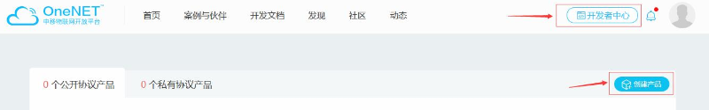

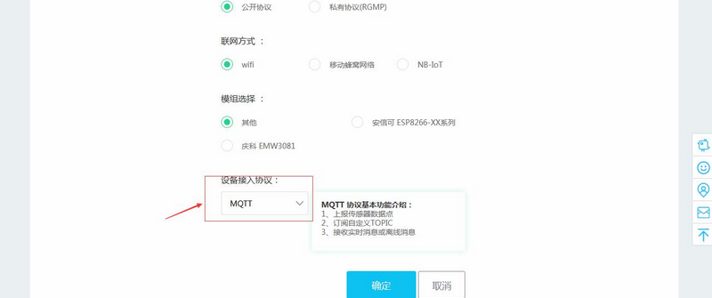

产品创建成功之后，可以在开发者中心左侧**产品概况**中查看产品基础信息（如产品ID，接入协议，创建时间，产品 APIkey 等，后面有用）。

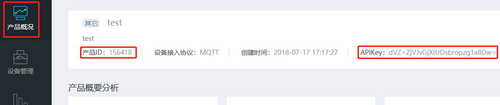

### 接入设备

在开发者中心左侧 **设备管理** 中点击 **添加设备** 按钮添加设备


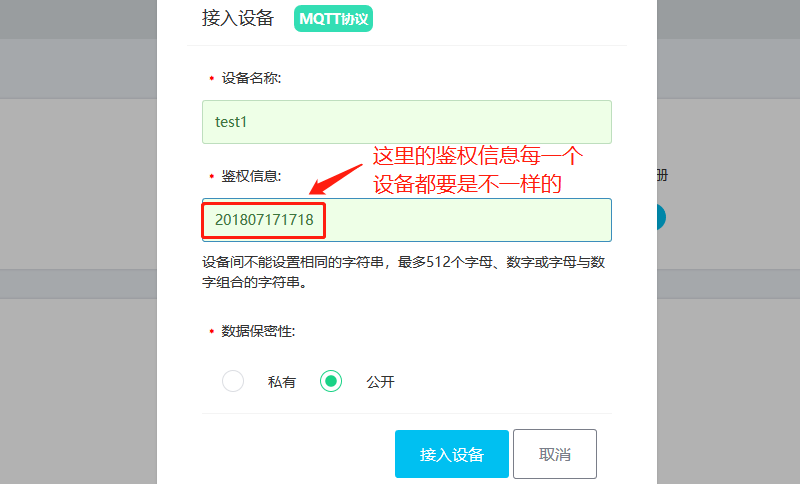

鉴权信息是为了区分每一个不同的设备，（这里仅为了测试就填写了当前时间作为鉴权信息）填完之后点击接入设备

### 添加 APIkey

接入设备之后，可以看到设备管理的界面多了一个设备，设备的右边有一些操作设备的按钮，点击查看详情按钮

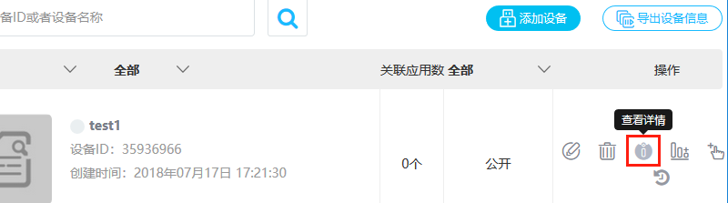

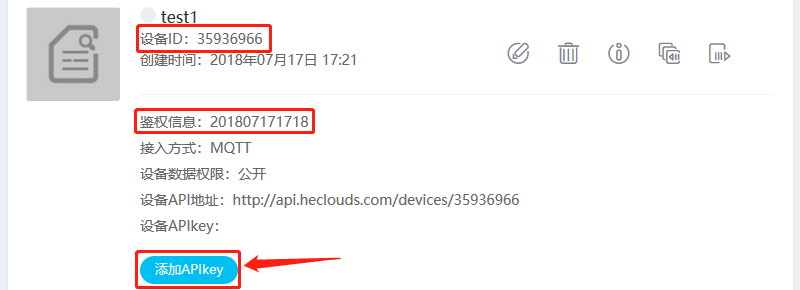

此设备的相关信息就都显示出来了，比如：设备 ID、鉴权信息、设备 APIkey，这些信息需要记下，在ENV配置时会用到。

点击按钮`添加APIkey`，APIKey 的名称一般和设备相关联，我们这里填入`test_APIKey`，关联设备写入我们刚刚创建的设备`test1`。

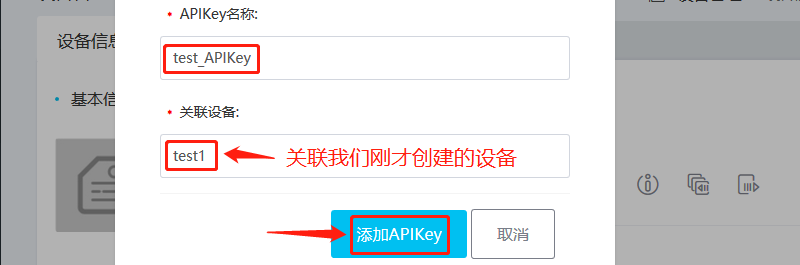

### 开启 onenet 软件包

打开 Env 工具输入 menuconfig 按照下面的路径开启 onenet 软件包

```
RT-Thread online packages
    IoT - internet of things  --->
        [*] OneNET: China Mobile OneNet cloud SDK for RT-Thread
```

进入 onenet 软件包的配置菜单按下图所示配置，里面的信息依据自己的产品和设备的**实际情况**填写

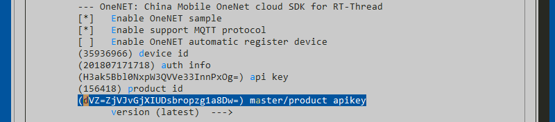

- **Enable OneNET sample**：开启 OneNET 示例代码

- **Enable support MQTT protocol**：开启 MQTT 协议连接 OneNET 支持

- **Enable OneNET automatic register device**：开启  OneNET 自动注册设备功能

- **device id**：配置云端创建设备时获取的 `设备ID`

- **auth info**：配置云端创建产品时 `用户自定义的鉴权信息` (每个产品的每个设备唯一)

- **api key**：配置云端创建设备时获取的 `APIkey`

- **product id**：配置云端创建产品时获取的 `产品ID`

- **master/product apikey**：配置云端创建产品时获取的 `产品APIKey`


### 示例文件介绍

利用 ENV 生成工程后，我们可以在工程的 onenet 目录下看到`onenet_sample.c`文件，该文件是 OneNET 软件包的示例展示，主要是向用户展示如何使用 OneNET 软件包**上传数据**和**接收命令**。

## 在 msh shell 中运行示例代码

系统运行起来后，首先在 msh 命令行下输入 `onenet_mqtt_init` 命令初始化 mqtt 客户端，然后输入`onenet_upload_cycle` 命令运行 OneNET 示例代码 。

```
msh> onenet_mqtt_init
[D/ONENET] (mqtt_connect_callback:85) Enter mqtt_connect_callback!
[D/MQTT] ipv4 address port: 6002
[D/MQTT] HOST = '183.230.40.39'
[I/ONENET] RT-Thread OneNET package(V0.2.0) initialize success.
[I/MQTT] MQTT server connect success
[D/ONENET] (mqtt_online_callback:90) Enter mqtt_online_callback!
msh> onenet_upload_cycle
msh />[D/ONENET] (onenet_upload_data:106) buffer : {"temperature":0}
[D/ONENET] (onenet_upload_data:106) buffer : {"temperature":56}
[D/ONENET] (onenet_upload_data:106) buffer : {"temperature":56}
```

## 预期结果

点击网页上 **设备管理** 里面设备的 **数据流管理** 操作

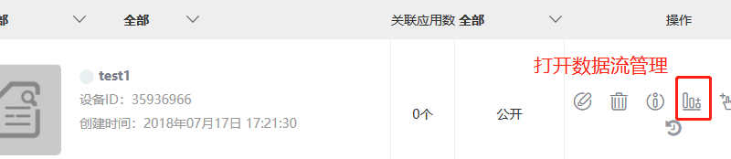


刷新网页，能看到云端能接收到开发板发来的数据。

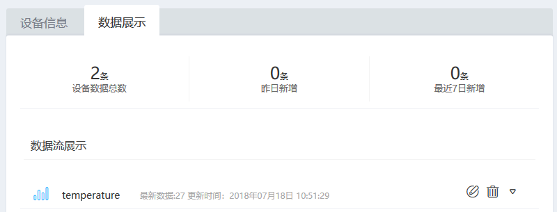

## 创建应用

点击左侧 **应用管理** 然后点击 **创建应用**

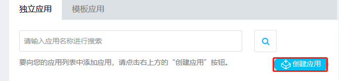

 然后输入应用名称并点击 **创建**


然后在点击 **编辑** 按钮编辑应用

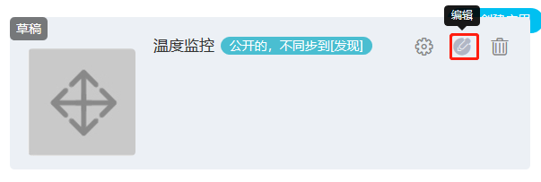

在弹出的窗口中编辑应用，可以拖动左侧元件库中的元件到中间的显示区域

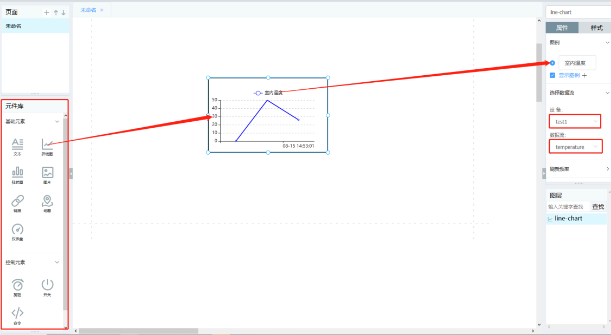

点击要设置的元件可以在右侧的 **属性和样式** 窗口改变元件的属性

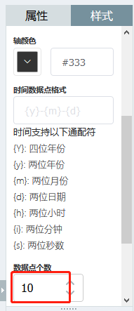

> [!NOTE]
> 注：* 如用 QEMU 模拟器平台需要连接外网，如出现连接失败的情况，可以尝试关闭防火墙
    * 文件系统最大打开文件个数不能太小，建议不小于16

## 参考资料

* 源码 [OneNET 软件包](https://github.com/RT-Thread-packages/onenet)
* [OneNET 软件包用户手册](https://github.com/RT-Thread-packages/onenet/tree/master/docs)
* [OneNET 官方文档](https://open.iot.10086.cn/doc/art398.html#97)
* [《Env 用户手册》](../../../programming-manual/env/env.md)

## 常见问题

* [常见问题及解决方法](../faq/faq.md)。
