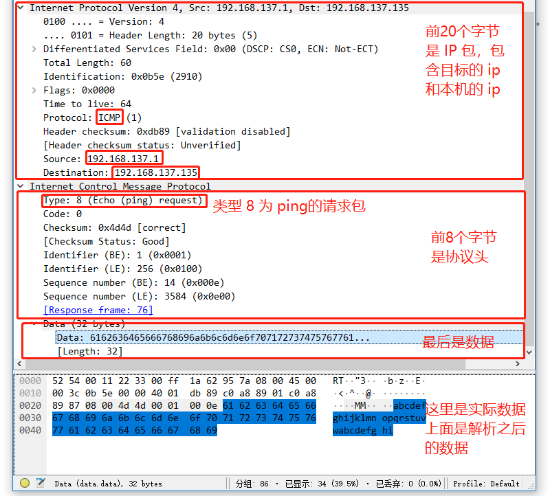

# 一次完整的网络Ping过程

<iframe frameborder="0" width="1005px" height="663px" src="https://v.qq.com/txp/iframe/player.html?vid=v0765xi2lio" allowFullScreen="true"></iframe>

> 提示：<a href="../ping_principle.pdf" target="_blank">视频 PPT 下载</a>

**Ping **程序是用来探测主机到主机之间是否可通信，如果不能 Ping 到某台主机，表明不能和这台主机建立连接。

当我们要检查网络状况的时候，就总喜欢 Ping 一下百度，检测网络到底通不通。但是这一个看似简单的命令 Ping，到底涉及了什么协议，数据又经历了什么样的路程，我们今天就来看一看。一次完整的 Ping 过程其实涉及很多协议，如 DNS，UDP，ARP，ICMP 以及路由协议等。

Ping 使用的是 ICMP 协议，它发送 ICMP 回送请求消息给目的主机。ICMP 协议规定：目的主机必须返回 ICMP 回送应答消息给源主机。如果源主机在一定时间内收到应答，则认为主机可达。

## DNS 协议

DNS（Domain Name System，域名系统），万维网上作为域名（网址）和 IP 地址相互映射的一个分布式数据库，能够使用户更方便的访问互联网，而不用去记那一串无意义的数字组成的 IP 地址。

通过域名得到该域名对应的 IP 地址的过程叫做域名解析（或主机名解析）。DNS 协议运行在 UDP 协议之上，使用端口号 53。

如果我们要 Ping www.baidu.com 首先就要先进行 DNS 域名解析获得 IP 地址。

## ARP 协议

ARP（Address Resolution Protocol）地址解析协议，是根据 IP 地址获取物理 MAC 地址的一个 TCP/IP 协议。

现在局域网中主机的 IP 一般都是动态分配的，这样做的好处是提高了 IP 的利用率；缺点是，当数据到来时只根据 IP 地址就不能确定到底哪一台主机了。因此需要弄一个缓存表，用来记录 IP 和 主机 MAC 地址的对应关系，这个缓存表就是 ARP 高速缓冲表 。

ARP协议的基本功能就是通过目标设备的 IP 地址，查询目标设备的 MAC 地址，同时，维护 ARP 高速缓冲表，以保证通信的顺利进行。

ARP 的分组格式如下图所示：

> 提示：<a href="../../arp_principle/arp_principle.pdf" target="_blank">ARP 协议参考 PPT 下载</a>

## ICMP 协议

ICMP 是 “Internet Control Message Protocol”（网络控制报文协议）的缩写。

它是 [TCP/IP协议](https://baike.baidu.com/item/TCP%2FIP%E5%8D%8F%E8%AE%AE) 族的一个子协议，用于在 IP 主机、路由器之间传递控制消息。控制消息是指网络通不通、主机是否可达、路由是否可用等网络本身的消息。这些控制消息虽然并不传输用户数据，但是对于用户数据的传递起着重要的作用。

ICMP 层区分不是很明显，一般划分在 IP 层中  通过 IP 包来封装ICMP数据 ，在实际传输中数据包的格式一般都是 IP 包 + ICMP包的格式，具体格式如下：

**IP 首部(20字节) + 8 位类型 + 8 位代码 + 16 位校验和 + ICMP 首部其他部分( 7 个字节) + 数据。**

如果用图表的形式展现出来就是下面的这张图了

## Ping 的过程

假设我们发起一个从开发板到百度 www.baidu.com 的 Ping 请求。（这里由路由1作为局域网的默认网关）

1. 首先开发板要解析百度的域名，获取到百度主机的 IP 地址，涉及到 DNS 协议，传输层用的是 UDP 协议
2. DNS 主机利用 UDP 协议，回复百度的 IP 地址给开发板（这里也涉及了 ARP 协议暂时不讲） 。
3. 现在开发板要发送 Ping 请求包给百度主机，但是发现百度主机 IP 地址与自己不在同一网段，因此要发送 Ping 请求包给默认网关。
4. 要发送给默认网关的时候，忽然发现并没有默认网关对应的 MAC 地址，因此发送一个 ARP 广播包，如果交换机存储了默认网关的 MAC 地址，就直接告诉开发板默认网关的 MAC 地址，否则就会向所有端口发送ARP广播，直到路由1收到了报文后，立即响应，单播自己的 MAC 地址给开发板。
5. 这样开发板就可以把 Ping 包发送给默认网关（路由1）了。
6. 然后路由1 经过路由协议，经过一个个路由的转发，最后发送到了百度的主机上。百度主机检测到 IP 是自己的 IP，接收并处理 Ping 请求，接着百度主机发送一个 Ping 回应报文给开发板。

我们可以在用 wireshark 抓包的时候，用电脑 Ping 一下开发板 ，通过抓到的包和上面的图对照着看就可以弄清 Ping 的过程了。

## 抓包分析

1. 打开 wireshark 软件 开启抓包，设定好过滤条件，只显示和开发板 IP 相关的包。
2. 当 QEMU 连接上网络后，输入 `ping www.baidu.com`

查看 wireshark ，发现已经抓到了 Ping 的数据包了。

因为默认 Ping 四次所以带着两个 DNS 的数据包，最少可以抓到 10 个包，我们只看前四个就够了。第一个是域名解析的 DNS 请求包，第二个是 DNS 服务器回复的响应数据包，第三条是开发板发送给百度主机的请求包( request )。第四条数据包是百度主机发送给开发板的一个回应( reply )的包。

我们也可以点开封包详细信息然后和上面的 ICMP 协议的报文格式做对比，对 Ping 的机制的理解会更加充分。

这样就知道了 Ping 的时候开发板和电脑到底都干了什么。
