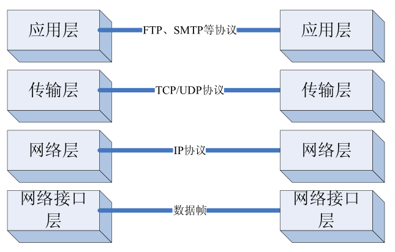
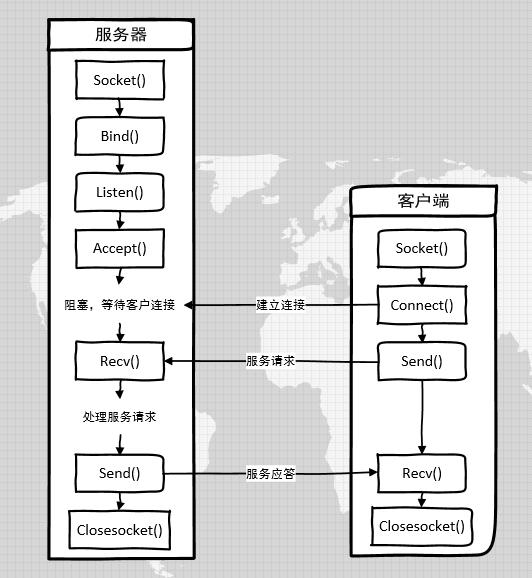
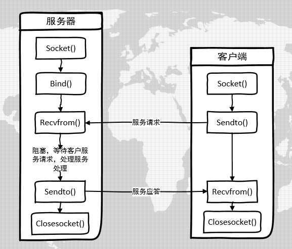

# 基础知识之 BSD Socket

Socket 通常也称作"套接字"，是支持 TCP/IP 协议的网络通信应用的基本操作单元，可以用来实现网间不同虚拟机或不同计算机之间的通信。使用TCP/IP协议的应用程序通过在客户端和服务器各自创建一个 Socket ，然后通过操作各自的 Socket 就可以完成客户端和服务器的连接以及数据传输的任务了。

Socket 的本质是编程接口( API )，是对 TCP/IP 的封装。使开发者不需要面对复杂的 TCP/IP 协议族，只需要调用几个较简单的 Socket API 就可以完成网络通信了。

RT-Thread 中的 **SAL 抽象层** 提供完整的 BSD Socket 相关 API。


##  BSD Socket 相关 API ##

| 名称          | 作用                       |
| ------------- | -------------------------- |
| socket        | 创建一个 socket 套接字  |
| bind        | 将端口号和 IP 地址绑定带指定套接字上 |
| listen   | 开始监听           |
| accept  | 接受连接请求         |
| connect | 建立连接           |
| send        | 面向连接的发送数据（tcp）  |
| recv    | 面向连接的接收数据（tcp） |
| sendto        | 无连接的发送数据（udp）      |
| recvfrom      | 无连接的接收数据（udp）      |
| closesocket   | 关闭 socket                |
| shutdown   | 按设置关闭套接字 |
| gethostbyname | 通过域名获取主机的 IP 地址等信息 |
| getsockname | 获取本地主机的信息 |
| getpeername | 获取连接的远程主机的信息 |
| ioctlsocket | 设置套接字控制模式 |


## TCP/UDP ##

要学用套接字编程，一定要了解 TCP/UDP 协议。TCP/UDP 协议工作在 TPC/IP 协议栈的传输层，如下图所示：



TCP（Transmission Control Protocol 传输控制协议）是一种面向连接的协议，使用该协议时，可以保证客户端和服务端的连接是可靠和安全的。使用 TCP 协议进行通信之前，通信双方必须先建立连接，然后再进行数据传输，通信结束后终止连接。

优点：能保证可靠性、稳定性。

适用场景：TCP适合用于端到端的通信，适用于对可靠性要求较高的服务。

基于 TCP 的 socket 编程流程如下图所示：



UDP（User Datagram Protocol 用户数据报协议）是一种非面向连接的协议，它不能保证网络连接的可靠性。 客户端发送数据之前并不会去服务器建立连接，而是直接将数据打包发送出去。当服务器接收数据时它也不向发送方提供确认信息，如果出现丢失包或重份包的情况，也不会向发送方发出差错报文。

优点：控制选项少，无须建立连接，从而使得数据传输过程中的延迟小、数据传输效率高。

适用场景：UDP适合对可靠性不高，或网络质量有保障，或对实时性要求较高的应用程序。

基于 UDP 的 socket 编程流程如下图所示：



##  API 详解

### socket ###

使用 socket 通信之前，通信双方都需要各自建立一个 socket。我们通过调用 socket 函数来创建一个 socket 套接字：

```c
int socket(int domain, int type, int protocol)
```

**函数参数**


| 参数     | 描述                                 |
| -------- | ------------------------------------ |
| domain   | 协议域                               |
| type     | 类型                                 |
| protocol | 传输协议                             |
| **返回** | **——**                               |
| > = 0    | 成功，返回一个代表套接字描述符的整数 |
| < 0      | 失败                                 |

domain 参数支持下列参数：

```c
AF_INET    Ipv4
AF_INET6   Ipv6
AF_UNIX    UNIX 域
AF_UNSPEC  未指定
```

type 参数支持下列参数：

```c
SOCK_DGRAM   长度固定的、无连接的不可靠的报文传递（UDP）
SOCK_RAM     IP 协议的数据报接口
SOCK_STREAM  有序、可靠、双向的面向连接字节流（TCP）
```

protocol 参数：

通常是 0 ，表示按给定的 domain 和 type 选择默认传输协议。在 AF_INET 通信域中套接字类型 SOCK_STREAM 的默认传输协议是 TCP。在 AF_INET 通信域中套接字类型 SOCK_DGRAM 的默认传输协议是 UDP。

当对同一 domian 和 type 支持多个协议时，可以使用 protocol 参数选择一个特定协议。

**函数返回**

返回一个 socket 描述符，它唯一标识一个 socket。这个 socket 描述符 跟文件描述符 一样，后续的操作都有用到它，比如，把它作为参数，通过它来进行一些读写操作等。

### bind ###

bind 函数用来将套接字与计算机上的一个端口号相绑定，进而在该端口监听服务请求，该函数的一般形式如下：

```c
int bind(int sockfd, const struct sockaddr *my_addr, socklen_t addrlen)
```

**函数参数**

| 参数    | 描述                                                         |
| ------- | ------------------------------------------------------------ |
| sockfd  | 要绑定的 socket描述符                                        |
| my_addr | 一个指向含有本机 IP 地址和端口号等信息的 sockaddr 结构的指针 |
| addrlen | sockaddr 结构的长度                                          |
| **返回** | **——**                               |
| 0      | 成功 |
| < 0 | 失败                                 |

sockaddr 结构体定义如下:

```c
struct sockaddr {
  u8_t sa_len;
  u8_t sa_family;
  char sa_data[14];
};
```

在 IPv4 因特网域（AF_INET）中，我们使用 sockaddr_in 结构体来代替 sockaddr 结构体：

```c
struct sockaddr_in {
  u8_t            sin_len;
  sa_family_t     sin_family;
  in_port_t       sin_port;
  struct in_addr  sin_addr;
  char            sin_zero[SIN_ZERO_LEN];
};
```

其中，

- sin_family 一般固定写 AF_INET；

- sin_port 为套接字的端口号；

- sin_addr 为套接字的 IP 地址，

- sin_zero 通常全为 0，主要功能是为了与 sockaddr 结构在长度上保持一致。这样指向 sockaddr_in 的指针和指向 sockaddr 的指针可以互相转换。


一般情况下，可以将 sin_port 设为 0，这样系统会随机选择一个未被占用的端口号。同样，sin_addr 设为 INADDR_ANY，系统会自动填入本机的 IP 地址。

> [!NOTE]
> 注：当调用 bind 函数时，不要将端口号设为小于 1024 的值，因为 1-1024 为系统的保留端口号，我们可以选择大于 1024 的任何一个未被占用的端口号。

### listen ###

listen 函数用来将套接字设为监听模式，并在套接字指定的端口上开始监听，以便对到达的服务请求进行处理。listen 函数的一般形式如下：

```c
int listen(int sockfd, int backlog)
```

**函数参数**

| 参数    | 描述                           |
| ------- | ------------------------------ |
| sockfd  | 绑定后的 socket描述符          |
| backlog | 连接请求队列可以容纳的最大数目 |
| **返回** | **——**                               |
| 0     | 成功 |
| < 0 | 失败                               |

### accept ###

accept 函数用来从完全建立的连接的队列中接受一个连接，它的一般形式如下：

```c
int accept(int sockfd, struct sockaddr *addr, socklen_t *addrlen)
```

**函数参数**

| 参数    | 描述                                                         |
| ------- | ------------------------------------------------------------ |
| sockfd  | 被监听的 socket 描述符                                       |
| addr    | 一个指向 scokaddr_in 结构的指针，存放提出连接请求的主机 IP 地址和端口号等信息 |
| addrlen | 一个指向 socklen_t 的指针，用来存放 sockaddr_in 结构的长度   |
| **返回** | **——**                               |
| > = 0 | 成功，返回新创建的套接字描述符|
| < 0 | 失败                               |

服务端接受连接后，accept 函数会返回一个新的 socket 描述符，线程可以使用这个新的描述符同客户端传输数据。


### connect ###

connect 函数用来与服务器建立一个 TCP 连接，它的一般形式如下：

```c
int connect(int sockfd, const struct sockaddr *serv_addr, socklen_t addrlen)
```

**函数参数**

| 参数    | 描述                                                         |
| ------- | ------------------------------------------------------------ |
| sockfd  | socket 描述符                                                |
| addr    | 指向 sockaddr 结构的指针，存放要连接的服务器的 IP 地址和端口号等信息 |
| addrlen | sockaddr 结构体的长度                                        |
| **返回** | **——**                               |
| > = 0     | 成功，返回新创建的套接字描述符|
| < 0 | 失败                               |


### send ###

send 函数用来在面向连接的数据流 socket 模式下发送数据，send 函数的一般形式如下：

```c
int send(int sockfd, const void *msg, size_t len, int flags)
```

**函数参数**

| 参数   | 描述                       |
| ------ | -------------------------- |
| sockfd | socket 描述符              |
| msg    | 指向所要发送的数据区的指针 |
| len    | 要发送的字节数             |
| flags  | 控制选项，通常为 0         |
| **返回** | **——**                               |
| >0    |成功，返回发送的数据的长度   |
| <=0  |失败  |


如果返回值小于 len 的话，你需要再次发送剩下的数据。

### recv ###

recv 函数用来在面向连接的数据流 socket 模式下接收数据，recv 函数的一般形式如下：

```c
int recv(int sockfd, void *buf, size_t len, int flags)
```

**函数参数**

| 参数   | 描述                           |
| ------ | ------------------------------ |
| sockfd | socket 描述符                  |
| msg    | 指向存储数据的内存缓存区的指针 |
| len    | 缓冲区的长度                   |
| flags  | 控制选项，通常为 0             |
| **返回** | **——**                               |
| > 0      | 成功，返回接收的数据的长度 |
| = 0 | 目标地址已传输完并关闭连接 |
| < 0    | 失败                                 |

### sendto ###

sendto 函数用来在无连接的数据报 socket 模式下发送数据，sendto 函数的一般形式如下：

```c
int sendto(int sockfd, const void *msg, size_t len, int flags, const struct sockaddr *to, socklen_t tolen)
```

**函数参数**

| 参数   | 描述                                                   |
| ------ | ------------------------------------------------------ |
| sockfd | socket 描述符                                          |
| msg    | 指向所要发送的数据区的指针                             |
| len    | 要发送的字节数                                         |
| flags  | 控制选项，通常为 0                                     |
| to     | 指向 sockaddr 结构体的指针，存放目的主机的 IP 和端口号 |
| tolen  | sockaddr 结构体的长度                                  |
| **返回** | **——**                               |
| > 0      | 成功，返回发送的数据的长度 |
| < = 0    | 失败                                 |

### recvfrom ###

recvfrom函数用来在无连接的数据报 socket 模式下接收数据，recvfrom 函数的一般形式如下：

```c
int recvfrom(int sockfd, void*buf, size_t len, int flags, struct sockaddr *from, socklen_t *fromlen)
```

**函数参数**

| 参数    | 描述                                                 |
| ------- | ---------------------------------------------------- |
| sockfd  | socket 描述符                                        |
| msg     | 指向存储数据的内存缓存区的指针                       |
| len     | 缓冲区的长度                                         |
| flags   | 控制选项，通常为 0                                   |
| from    | 指向 sockaddr 结构体的指针，存放源主机的 IP 和端口号 |
| fromlen | 指向 sockaddr 结构体的长度的指针                     |
| **返回** | **——**                               |
| > 0      | 成功，返回接收的数据的长度 |
| = 0 | 目标地址已传输完并关闭连接 |
| < 0    | 失败                                 |

### closesocket ###

closesocket 在传输完数据之后关闭 socket  并释放资源的函数，closesocket 函数的一般形式如下：

```c
int closesocket(int sockfd)
```

**函数参数**

| 参数   | 描述          |
| ------ | ------------- |
| sockfd | socket 描述符 |
| **返回** | **——**                               |
| 0      | 成功 |
| < 0   | 失败 |

### shutdown ###

shutdown 允许进行单向的关闭操作，或是全部禁止掉，shutdown 函数的一般形式如下：

```c
int shutdown(int sockfd, int how)
```

**函数参数**

| 参数   | 描述          |
| ------ | ------------- |
| sockfd | socket 描述符 |
| how    | 控制选项      |
| **返回** | **——**                               |
| 0      | 成功 |
| < 0   | 失败 |

how 参数支持下列参数：

```c
SHUT_RD     关闭接收信道
SHUT_WR     关闭发送信道
SHUT_RDWR   将发送和接收信道全部关闭
```

**函数返回**

返回 0 表示成功

### gethostbyname  ###

此函数可以通过域名来获取主机的 IP 地址等信息，它的一般形式如下：

```c
struct hostent* gethostbyname(const char*name)
```

**函数参数**

| 参数 | 描述     |
| ---- | -------- |
| name | 主机域名 |
| **返回** | **——**                               |
| > 0   | 成功，返回一个 hostent 结构体指针 |
| < 0   | 失败 |

name 可以是具体域名，如：“www.rt-thread.org”，也可以是 IP 地址，如：“192.168.2.56”

hostent 结构体定义如下：

```c
struct hostent {
    char  *h_name;      /* 主机正式域名 */
    char **h_aliases;   /* 主机的别名数组 */
    int    h_addrtype;  /* 协议类型，对于 TCP/IP 为 AF_INET  */
    int    h_length;    /* 协议的字节长度，对于 IPv4 为 4 个字节 */
    char **h_addr_list; /* 地址的列表*/
#define h_addr h_addr_list[0] /* 保持向后兼容 */
};
```

### getsockname  ###

此函数可以获取本地主机的信息，它的一般形式如下：

```c
int getsockname(int sockfd, struct sockaddr *name, socklen_t *namelen)
```

**函数参数**

| 参数    | 描述                                        |
| ------- | ------------------------------------------- |
| sockfd  | socket 描述符                               |
| name    | sockaddr 结构体指针，用来存储得到的主机信息 |
| namelen | 指向 sockaddr 结构体的长度的指针            |
| **返回** | **——**                               |
| 0      | 成功 |
| < 0   | 失败 |

### getpeername ###

此函数可以得到与本地主机连接的远程主机的信息，它的一般形式如下：

```c
int getpeername(int socket, struct sockaddr *name, socklen_t *namelen)
```

**函数参数**

| 参数    | 描述                                        |
| ------- | ------------------------------------------- |
| sockfd  | socket 描述符                               |
| name    | sockaddr 结构体指针，用来存储得到的主机信息 |
| namelen | 指向 sockaddr 结构体的长度的指针            |
| **返回** | **——**                               |
| 0      | 成功 |
| < 0   | 失败 |

### ioctlsocket

设置套接字控制模式，它的一般形式如下：

```c
int ioctlsocket(int sockfd, long cmd, void *arg)
```

**函数参数**

| 参数   | 描述             |
| ------ | ---------------- |
| sockfd | socket 描述符    |
| cmd    | 套接字操作命令   |
| arg    | 操作命令所带参数 |
| **返回** | **——**                               |
| 0      | 成功 |
| < 0   | 失败 |

cmd 参数支持下列参数：

```c
FIONBIO  开启或关闭套接字的非阻塞模式，arg 参数为 1 开启非阻塞，为 0 关闭非阻塞。
```

> [!NOTE]
> 注：在网络中都采用大端字节序，但是不同的嵌入式系统，其字节序不一定都是大端格式，相反小端字节序倒是很常见，比如 STM32。我们在设置 IP 和端口号时，要根据自己的平台特点进行必要的字节序转换。

下面给出套接字字节转换函数的列表：

```c
htons() —— "Host to Network Short"  主机字节顺序转换为网络字节顺序
htonl() —— "Host to Network Long"   主机字节顺序转换为网络字节顺序
ntohs() —— "Network to Host Short"  网络字节顺序转换为主机字节顺序
ntohl() —— "Network to Host Long"   网络字节顺序转换为主机字节顺序
```

对于一个“192.168.2.1”这种字符串形式的 IP 地址，我们如何将其正确的转换为网络字节序呢？

可以使用 inet_addr（“192.168.2.1”），结果直接就是网络字节序了；

我们也可以使用 inet_ntoa()（“ntoa”代表“Network to ASCII”）函数将一个长整形的 IP 地址转换为一个字符串。

## 参考资料

*  [网络开发应用笔记](https://www.rt-thread.org/document/site/application-note/components/network/an0011-rtthread-system-network-started/)
