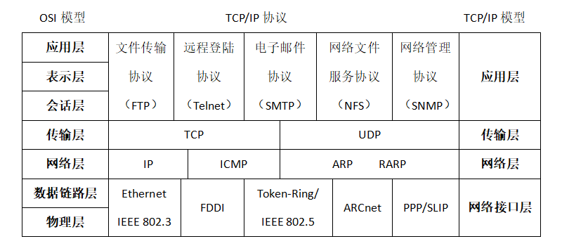

# 基础知识之 TCP/IP 协议栈

在这个互联网蓬勃发展的时代，网络正在迅速的改变着我们周围的一切。小到智能电灯、智能手表，大到航天飞机、宇宙空间站，这所有的一切都被互联网连接到了一起。他们之间能够相互识别，相互通信，这所有的一切都依赖于 TCP/IP 协议。TCP/IP 不是一个协议，而是一个协议族的统称。里面包括了 IP 协议，IMCP 协议，TCP 协议，以及我们更加熟悉的 http、ftp、pop3 协议等等。有了 TCP/IP 协议，这些设备就有了统一的语言，他们之间就能够自由的交流了。

## TCP/IP 参考模型

提到协议分层，我们很容易联想到 OSI 的七层协议经典架构，但是 TCP/IP 协议族的结构则稍有不同。如下图所示 ：

TCP/IP 协议族按照层次由上到下，层层包装。

最上面的一层是应用层，这里面有 http，ftp, 等等我们熟悉的协议。

第二层是传输层，著名的 TCP 和 UDP 协议就在这个层次。

第三层是网络层，IP 协议就在这里，它负责对数据加上 IP 地址和其他的数据以确定传输的目标。

第四层是网络接口层，对实际的网络媒体的管理，定义如何使用实际网络（如Ethernet、Serial Line等）来传送数据。

发送协议的主机从上自下将数据按照协议封装，而接收数据的主机则按照协议将得到的数据包解开，最后拿到需要的数据。这种结构非常有栈的味道，所以 tcp/ip 协议族也被称为 tcp/ip 协议栈。

## 基本概念

**IP 地址**

网络上每一个节点都必须有一个独立的 IP 地址，通常使用的 IP 地址是一个 32bit 的数字，被分成 4 组，例如，255.255.255.255 就是一个 IP 地址。IP 地址就是计算机网络组成的最小单位。

在 Linux 系统中，可以用 ifconfig -a 命令查看自己的 IP 地址，windows的 DOS 中可以用 ipconfig 查看，在 RT-Thread 系统中可以输入 ifconfig 命令查看自己 IP 地址。

 **域名**

一连串无意义的数字组成的 IP 对人类来说是极不友好的，人们很难记住某一个服务器的 IP。因此由点和字符组成的域名系统应运而生。域名系统其实就是一个分布的数据库，它提供将主机名（也就是网址）转换成 IP 地址的服务。 例如，我们都能记住 www.baidu.com 却没有一个人知道 111.13.100.91。

 **MAC 地址**

MAC（Media Access Control）地址，或称为物理地址、硬件地址，用来定义互联网中设备的位置。在 TCP/IP 层次模型中，网络层管理 IP 地址，链路层则负责 MAC 地址。因此每个网络位置会有一个专属于它的 IP 地址，而每个主机会有一个专属于它 MAC 地址。

## 应用层

不同类型的网络应用有不同的通信规则，因此应用层的协议是多种多样的，如简单电子邮件传输（SMTP）、文件传输协议（FTP）、网络远程访问协议（Telnet）、域名解析服务（DNS）、超文本传输协议（HTTP）等。动态主机配置协议 （DHCP）也工作在应用层。

## 传输层

在此层中，它提供了节点间的数据传送服务，如传输控制协议（TCP）、用户数据报协议（UDP）等，TCP 和 UDP 给数据包加入传输数据并把它传输到下一层中，这一层实现端到端的数据传输。 TCP 协议是面向连接的，这就意味着传输层能保持对分段的跟踪，并且重传那些失败的分段。

## 网络层

用来处理网络上流动的数据包（网络传输中最小的数据单元），规定了怎样的路径把数据包传输到目标计算机，并把数据包传送给对方。相关的有 IP 协议、ARP 协议、RARP 协议、ICMP 协议等

**IP 协议**：将多个包交换网络连接起来，它在源地址和目的地址之间传送一种称之为数据包的东西，它还提供对数据大小的重新组装功能，以适应不同网络对包大小的要求。

**ARP 协议**： 是根据 IP 地址获取 MAC 地址的一种协议。 用于将 32 位 IP 地址映射到网卡的 48 位MAC地址。

**RARP 协议**：与 ARP 协议的工作相反，主要用于将网卡的 48 位 MAC 地址转换为 32 位 IP 地址。

**ICMP 协议**：用于在 IP 主机、路由器之间传递控制消息——指网络通不通、主机是否可达、路由是否可用等网络本身的消息。

## 网络接口层

用来处理连接网络的硬件部分，包括控制操作系统、硬件的设备驱动和网络适配器，及光纤等物理可见的部分。硬件上的范畴均属于网络接口层的作用范围之内。

## 参考资料

*  [网络开发应用笔记](../../../application-note/components/network/an0011-network-started.md)
