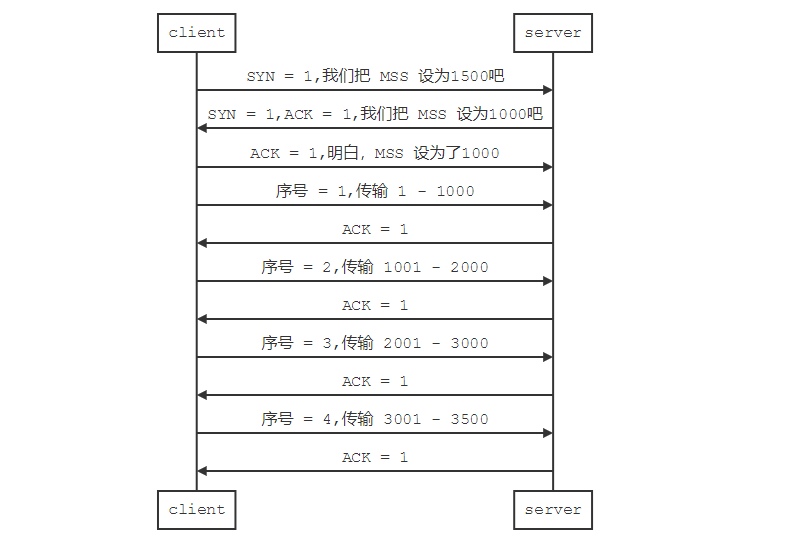

# 深入理解TCP/UDP通信原理

<iframe frameborder="0" width="1005px" height="663px" src="https://v.qq.com/txp/iframe/player.html?vid=u07658jwqgx" allowFullScreen="true"></iframe>

> 提示：<a href="../tcp_udp_principle.pdf" target="_blank">视频 PPT 下载</a>

## TCP 通信原理

TCP 把连接作为最基本的对象，每一条 TCP 连接都有两个端点，这种端点我们叫作套接字（socket），它的定义为端口号拼接到 IP 地址即构成了套接字，例如，若 IP 地址为 192.3.4.16 而端口号为 80，那么得到的套接字为`192.3.4.16:80`。IP 协议虽然能把数据报文送到目的主机，但是并没有交付给主机的具体应用进程。而端到端的通信才是应用进程之间的通信。

TCP 报文是 TCP 层传输的数据单元，也叫报文段。 TCP 报文的格式如下图所示

我们从 TCP 的报文格式中能看到 6 个**标志位**：URG  ACK  PSH  RST  SYN  FIN，每一个标志位表示一个控制功能。

- URG：紧急指针标志，为1时表示紧急指针有效，为0则忽略紧急指针。
- ACK：确认序号标志，为1时表示确认号有效，为0表示报文中不含确认信息，忽略确认号字段。
- PSH：push标志，为1表示是带有push标志的数据，指示接收方在接收到该报文段以后，应尽快将这个报文段交给应用程序，而不是在缓冲区排队。
- RST：重置连接标志，用于重置由于主机崩溃或其他原因而出现错误的连接。或者用于拒绝非法的报文段和拒绝连接请求。
- SYN：同步序号，用于建立连接过程，在连接请求中，SYN=1和ACK=0表示该数据段没有使用捎带的确认域，而连接应答捎带一个确认，即SYN=1和ACK=1。
- FIN：finish标志，用于释放连接，为1时表示发送方已经没有数据发送了，即关闭本方数据流。

TCP 的连接和断开的过程和这几个标志位有关。

### 建立连接

TCP 的三次握手，意思就是建立连接的时候客户端与服务器之间需要三次数据包的交流。

1. 客户端发送给服务器一个请求连接数据包，即发送了一个指向服务器目标端口的一个 SYN 位为 1 的TCP 报文。
2. 服务器接收到客户端的连接请求之后，会回应一个 SYN 位为 1 的TCP 报文，表示同意连接。并且，会把 ACK 位也置 1 表示确认收到上次消息。
3. 客户端接收到服务器的同意连接的数据包之后，还要回复一个 ACK 为 1 的 TCP 报文，表示确认收到。

如下图所示，这就是 TCP 的三次握手。

### 数据传输

**TCP 以段为单位发送数据**

在建立 TCP 连接的同时，也可以确定发送数据包的单位，我们也可以称其为“最大消息长度”（MSS：Maximum Segment Size）。最理想的情况是，最大消息长度正好是 IP 中不会被分片处理的最大数据长度。

TCP 在传输大量数据时，是以 MSS 的大小将数据进行分割发送的。进行重发时也是以 MSS 为单位。

MSS 是在三次握手的时候，在两端主机之间被计算得出。两端的主机在发出建立连接的请求时，会在 TCP 首部中写入 MSS 选项，告诉对方自己的接口能够适应的 MSS 的大小（为附加 MSS 选项，TCP首部将不再是20字节，而是 4 字节的整数倍）。然后会在两者之间选择一个较小的值投入使用（在建立连接时，如果某一方的 MSS 选项被省略，可以选为 IP 包的长度不超过 576 字节的值（IP 首部 20 字节，TCP 首部 20 字节，MSS  536 字节））。

例如客户端发送一段 3500 长度的数据到服务端，假设确定的 MSS 长度为1000，数据传输的过程如下所示：

### 断开连接

TCP 的四次挥手，意思就是释放连接的时候客户端与服务器之间需要四次数据包的交流。

1. 客户端发送给服务器一个请求释放连接的数据包，即发送了一个指向服务器目标端口的一个 FIN 位为 1 的TCP 报文，表示客户端没有数据要发送了，但是仍然可以接收数据；并且 ACK 位也为 1，表示对上次传输数据结果的确认。并且之后处去等待状态，等待服务器的两次回应。
2. 服务器接收到客户端的释放连接请求之后，会先回应一个  ACK 位为 1 的报文，表示确认收到。但是，这时服务器可能还有数据没有发送完成，继续发送数据。
3. 服务器发送完数据之后，发送一个 FIN 为 1 的 TCP 报文，表示我也没有要发送的数据了，你可以释放连接了。当然 ACK 位仍然为 1 。
4. 客户端接收到服务器的同意释放连接的数据包之后，回复一个 ACK 为 1 的 TCP 报文，表示确认收到。

如下图所示，这就是 TCP 的四次挥手。

### 抓包分析

利用 wireshark 工具抓包分析可以很清晰的看到这两个流程。

1. 打开 wireshark 软件 开启抓包，过滤规则设置为 tcp 。

2. 开发板连接上网络后，运行 samples 里面的 tcpclient 例程，

这样就可以很方便的看到 TCP 的三次握手与四次挥手的全过程，如下图所示：

数据传输的过程需要在以后用到 http client 传输较大数据的时候才能更好的看出来。

## UDP 通信原理

UDP 是 User Datagram Protocol 的简称， 中文名用户数据报协议，是[OSI](https://baike.baidu.com/item/OSI)（Open System Interconnection，开放式系统互联）参考模型中一种无连接的[传输层](https://baike.baidu.com/item/%E4%BC%A0%E8%BE%93%E5%B1%82)协议，提供面向事务的简单不可靠信息传送服务，UDP 在 IP 报文的协议号是 17。

与 TCP（传输控制协议）协议一样，UDP 协议直接位于 IP（网际协议）协议的顶层。根据 TCP/IP 参考模型，UDP 和TCP 都属于传输层协议。UDP 协议的主要作用是将数据压缩成数据包的形式。一个典型的数据包就是一个二进制数据的传输单位。每一个数据包的前 8 个字节用来包含报头信息，剩余字节则用来包含具体的传输数据。

UDP 报文的具体格式如下：

**源端口( 2 字节) + 目的端口( 2 字节) + 长度( 2 字节) + 检验和( 2 字节) + 数据**

用图表的形式展现出来如下图所示：

### UDP 通信过程

UDP 协议的通信较 TCP 简单了很多，减少了 TCP 的握手、确认、窗口、重传、拥塞控制等机制，UDP 是一个无状态的传输协议。

UDP 客户端在发送数据时并不判断主机是否可达，服务器是否开启等问题，同样它不能确定数据是否成功送达服务器。它只是将数据简单的封了一个包，之后就丢出去了。

我们可以在开发板上运行 samples 里面的 udp client 示例程序。

### 抓包分析

1. 打开 wireshark 软件 开启抓包，设定过滤条件为 udp，只显示和 udp 协议相关的包。
2. 开发板连接上网络后，在终端上输入 `udpclient 192.168.12.44 5000 5`

查看 wireshark ，发现已经抓到了 udpclient 发来的五个包了。

我们点开封包详细信息然后和上面的 UDP 协议的报文格式对照一下，就弄清楚 UDP 协议的工作机制了。

