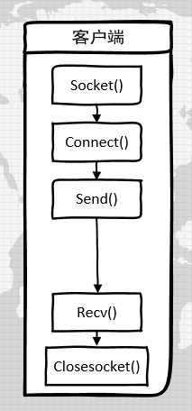
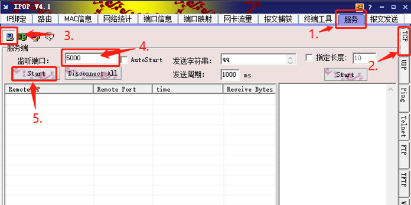
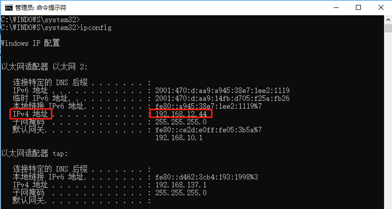
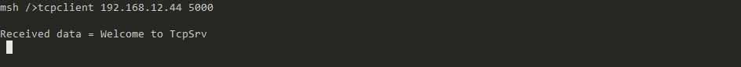
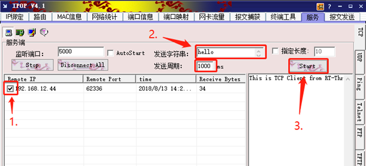
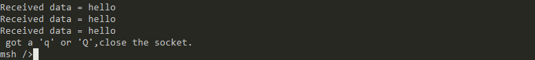

# 使用Socket实现TCP客户端

<iframe frameborder="0" width="1005px" height="663px" src="https://v.qq.com/txp/iframe/player.html?vid=c0765wu44ss" allowFullScreen="true"></iframe>

> 提示：<a href="../tcpclient.pdf" target="_blank">视频 PPT 下载</a>

## 背景介绍

socket 编程一般采用客户端-服务器模式，即由客户进程向服务器进程发出请求，服务器进程执行请求的任务并将执行结果返回给客户进程的模式。

本教程介绍了如何编写一个基于 socket 编程实现的 TCP 客户端。我们先将 socket 编程的流程列出来，然后给出具体的实例。

TCP 客户端的 socket 编程流程
1. 创建 socket
2. 建立连接
3. 通信
4. 关闭 socket

如下图所示：



## 准备工作

### 获取示例代码

RT-Thread samples 软件包中已有一份该示例代码 [tcpclient.c](https://github.com/RT-Thread-packages/network-sample/blob/master/tcpclient_sample.c)，可以通过 Env 配置将示例代码加入到项目中。

```
 RT-Thread online packages  --->
     miscellaneous packages  --->
         samples: RT-Thread kernel and components samples  --->
             [*] a network_samples package for rt-thread  --->
                 [*] [network] tcp client
```

### 示例代码文件

```c
/*
 * 程序清单：tcp 客户端
 *
 * 这是一个 tcp 客户端的例程
 * 导出 tcpclient 命令到控制终端
 * 命令调用格式：tcpclient URL PORT
 * URL：服务器地址 PORT:：端口号
 * 程序功能：接收并显示从服务端发送过来的信息，接收到开头是 'q' 或 'Q' 的信息退出程序
*/
#include <rtthread.h>
#include <sys/socket.h> /* 使用BSD socket，需要包含socket.h头文件 */
#include "netdb.h"

#define BUFSZ   1024

static const char send_data[] = "This is TCP Client from RT-Thread."; /* 发送用到的数据 */
void tcpclient(int argc, char **argv)
{
    int ret;
    char *recv_data;
    struct hostent *host;
    int sock, bytes_received;
    struct sockaddr_in server_addr;
    const char *url;
    int port;

    if (argc < 3)
    {
        rt_kprintf("Usage: tcpclient URL PORT\n");
        rt_kprintf("Like: tcpclient 192.168.12.44 5000\n");
        return ;
    }

    url = argv[1];
    port = strtoul(argv[2], 0, 10);

    /* 通过函数入口参数url获得host地址（如果是域名，会做域名解析） */
    host = gethostbyname(url);

    /* 分配用于存放接收数据的缓冲 */
    recv_data = rt_malloc(BUFSZ);
    if (recv_data == RT_NULL)
    {
        rt_kprintf("No memory\n");
        return;
    }

    /* 创建一个socket，类型是SOCKET_STREAM，TCP类型 */
    if ((sock = socket(AF_INET, SOCK_STREAM, 0)) == -1)
    {
        /* 创建socket失败 */
        rt_kprintf("Socket error\n");

        /* 释放接收缓冲 */
        rt_free(recv_data);
        return;
    }

    /* 初始化预连接的服务端地址 */
    server_addr.sin_family = AF_INET;
    server_addr.sin_port = htons(port);
    server_addr.sin_addr = *((struct in_addr *)host->h_addr);
    rt_memset(&(server_addr.sin_zero), 0, sizeof(server_addr.sin_zero));

    /* 连接到服务端 */
    if (connect(sock, (struct sockaddr *)&server_addr, sizeof(struct sockaddr)) == -1)
    {
        /* 连接失败 */
        rt_kprintf("Connect fail!\n");
        closesocket(sock);

        /*释放接收缓冲 */
        rt_free(recv_data);
        return;
    }

    while (1)
    {
        /* 从sock连接中接收最大BUFSZ - 1字节数据 */
        bytes_received = recv(sock, recv_data, BUFSZ - 1, 0);
        if (bytes_received < 0)
        {
            /* 接收失败，关闭这个连接 */
            closesocket(sock);
            rt_kprintf("\nreceived error,close the socket.\r\n");

            /* 释放接收缓冲 */
            rt_free(recv_data);
            break;
        }
        else if (bytes_received == 0)
        {
            /* 默认 recv 为阻塞模式，此时收到0认为连接出错，关闭这个连接 */
            closesocket(sock);
            rt_kprintf("\nreceived error,close the socket.\r\n");

            /* 释放接收缓冲 */
            rt_free(recv_data);
            break;
        }

        /* 有接收到数据，把末端清零 */
        recv_data[bytes_received] = '\0';

        if (strncmp(recv_data, "q", 1) == 0 || strncmp(recv_data, "Q", 1) == 0)
        {
            /* 如果是首字母是q或Q，关闭这个连接 */
            closesocket(sock);
            rt_kprintf("\n got a 'q' or 'Q',close the socket.\r\n");

            /* 释放接收缓冲 */
            rt_free(recv_data);
            break;
        }
        else
        {
            /* 在控制终端显示收到的数据 */
            rt_kprintf("\nReceived data = %s ", recv_data);
        }

        /* 发送数据到sock连接 */
        ret = send(sock, send_data, strlen(send_data), 0);
        if (ret < 0)
        {
            /* 接收失败，关闭这个连接 */
            closesocket(sock);
            rt_kprintf("\nsend error,close the socket.\r\n");

            rt_free(recv_data);
            break;
        }
        else if (ret == 0)
        {
            /* 打印send函数返回值为0的警告信息 */
            rt_kprintf("\n Send warning,send function return 0.\r\n");
        }
    }
    return;
}
MSH_CMD_EXPORT(tcpclient, a tcp client sample);
```

## 在 msh shell 中运行示例代码

在运行示例代码之前需要先在电脑上开启一个 TCP 服务器，这里以网络调试助手 IPOP 为例。



然后，查看本机 ip 地址

在 windows 系统中打开命令提示符，输入 ipconfig 即可查看本机 ip



然后，在系统运行起来后，在 msh 命令行下输入下面的命令即可让示例代码运行。

```c
msh> tcpclient 192.168.12.44 5000
```

tcpclient 有两个参数 URL PORT，其中：

* URL 是目标服务器的网址或 IP 地址
* PORT 是目标服务器的端口号

## 预期结果



可以看出客户端已经连接到服务器了。然后，从服务端向客户端发送数据



从客户端能接收到服务端发来的数据，发送字符 'q' 即可断开连接



> [!NOTE]
> 注：请关闭防火墙之后，再运行此例程。

## 参考资料

* 源码 [tcpclient.c](https://github.com/RT-Thread-packages/network-sample/blob/master/tcpclient_sample.c)
* [《Env 用户手册》](../../../programming-manual/env/env.md)

## 常见问题

* [常见问题及解决方法](../faq/faq.md)。
