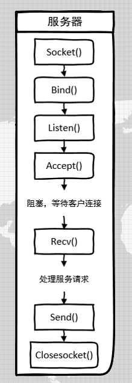
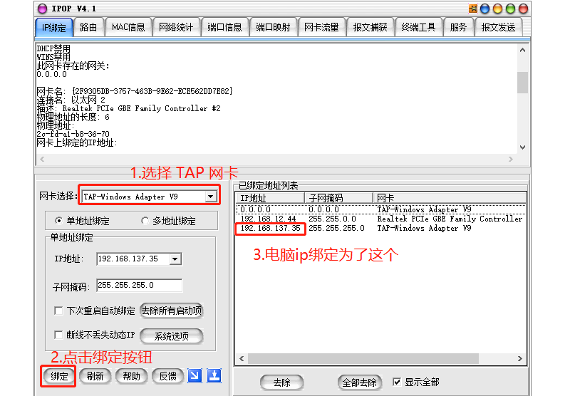
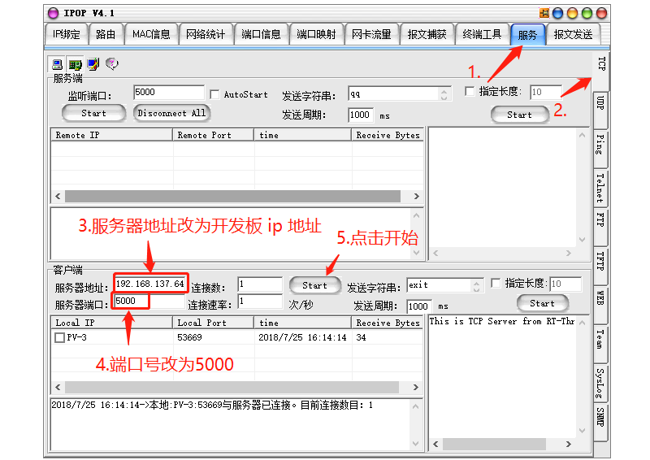
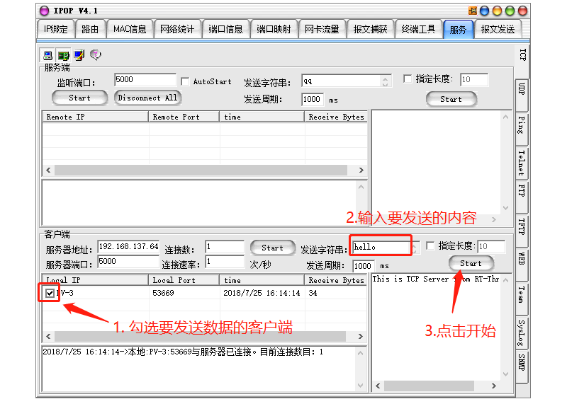
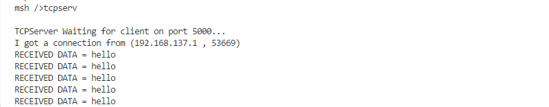

# 使用Socket实现TCP服务器

<iframe frameborder="0" width="1005px" height="663px" src="https://v.qq.com/txp/iframe/player.html?vid=g0765vhfnsn" allowFullScreen="true"></iframe>

> 提示：<a href="../tcpserver.pdf" target="_blank">视频 PPT 下载</a>

## 背景介绍

socket 编程一般采用客户端-服务器模式，即由客户进程向服务器进程发出请求，服务器进程执行请求的任务并将执行结果返回给客户进程的模式。

本教程介绍了如何编写一个基于 socket 编程实现的 TCP 服务器。我们先将 socket 编程的流程列出来，然后给出具体的实例。

TCP 服务器的 socket 编程流程
1. 创建 socket
2. 将创建的 socket 绑定到一个 IP 地址和端口号上
3. 设置 socket 为监听模式
4. 接收请求并返回 socket
5. 与客户端进行通信
6. 关闭 socket

如下图所示：



## 准备工作

### 获取示例代码

RT-Thread samples 软件包中已有一份该示例代码 [tcpserver.c](https://github.com/RT-Thread-packages/network-sample/blob/master/tcpserver_sample.c)，可以通过 Env 配置将示例代码加入到项目中。

```
 RT-Thread online packages  --->
     miscellaneous packages  --->
         samples: RT-Thread kernel and components samples  --->
             network sample options  --->
                 [*] [network] tcp server
```

### 示例代码文件

```c
/*
* 程序清单：tcp 服务端
 *
 * 这是一个 tcp 服务端的例程
 * 导出 tcpserv 命令到控制终端
 * 命令调用格式：tcpserv
 * 无参数
 * 程序功能：作为一个服务端，接收并显示客户端发来的数据 ，接收到 exit 退出程序
*/
#include <rtthread.h>
#include <sys/socket.h> /* 使用BSD socket，需要包含socket.h头文件 */
#include "netdb.h"

#define BUFSZ       (1024)

static const char send_data[] = "This is TCP Server from RT-Thread."; /* 发送用到的数据 */
static void tcpserv(int argc, char **argv)
{
    char *recv_data; /* 用于接收的指针，后面会做一次动态分配以请求可用内存 */
    socklen_t sin_size;
    int sock, connected, bytes_received;
    struct sockaddr_in server_addr, client_addr;
    rt_bool_t stop = RT_FALSE; /* 停止标志 */
    int ret;

    recv_data = rt_malloc(BUFSZ + 1); /* 分配接收用的数据缓冲 */
    if (recv_data == RT_NULL)
    {
        rt_kprintf("No memory\n");
        return;
    }

    /* 一个socket在使用前，需要预先创建出来，指定SOCK_STREAM为TCP的socket */
    if ((sock = socket(AF_INET, SOCK_STREAM, 0)) == -1)
    {
        /* 创建失败的错误处理 */
        rt_kprintf("Socket error\n");

        /* 释放已分配的接收缓冲 */
        rt_free(recv_data);
        return;
    }

    /* 初始化服务端地址 */
    server_addr.sin_family = AF_INET;
    server_addr.sin_port = htons(5000); /* 服务端工作的端口 */
    server_addr.sin_addr.s_addr = INADDR_ANY;
    rt_memset(&(server_addr.sin_zero), 0, sizeof(server_addr.sin_zero));

    /* 绑定socket到服务端地址 */
    if (bind(sock, (struct sockaddr *)&server_addr, sizeof(struct sockaddr)) == -1)
    {
        /* 绑定失败 */
        rt_kprintf("Unable to bind\n");

        /* 释放已分配的接收缓冲 */
        rt_free(recv_data);
        return;
    }

    /* 在socket上进行监听 */
    if (listen(sock, 5) == -1)
    {
        rt_kprintf("Listen error\n");

        /* release recv buffer */
        rt_free(recv_data);
        return;
    }

    rt_kprintf("\nTCPServer Waiting for client on port 5000...\n");
    while (stop != RT_TRUE)
    {
        sin_size = sizeof(struct sockaddr_in);

        /* 接受一个客户端连接socket的请求，这个函数调用是阻塞式的 */
        connected = accept(sock, (struct sockaddr *)&client_addr, &sin_size);
        /* 返回的是连接成功的socket */
        if (connected < 0)
        {
            rt_kprintf("accept connection failed! errno = %d\n", errno);
            continue;
        }

        /* 接受返回的client_addr指向了客户端的地址信息 */
        rt_kprintf("I got a connection from (%s , %d)\n",
                   inet_ntoa(client_addr.sin_addr), ntohs(client_addr.sin_port));

        /* 客户端连接的处理 */
        while (1)
        {
            /* 发送数据到connected socket */
            ret = send(connected, send_data, strlen(send_data), 0);
            if (ret < 0)
            {
                /* 发送失败，关闭这个连接 */
                closesocket(connected);
                rt_kprintf("\nsend error,close the socket.\r\n");
                break;
            }
            else if (ret == 0)
            {
                /* 打印send函数返回值为0的警告信息 */
                rt_kprintf("\n Send warning,send function return 0.\r\n");
            }

            /* 从connected socket中接收数据，接收buffer是1024大小，但并不一定能够收到1024大小的数据 */
            bytes_received = recv(connected, recv_data, BUFSZ, 0);
            if (bytes_received < 0)
            {
                /* 接收失败，关闭这个connected socket */
                closesocket(connected);
                break;
            }
            else if (bytes_received == 0)
            {
                /* 打印recv函数返回值为0的警告信息 */
                rt_kprintf("\nReceived warning,recv function return 0.\r\n");
                closesocket(connected);
                break;
            }

            /* 有接收到数据，把末端清零 */
            recv_data[bytes_received] = '\0';
            if (strcmp(recv_data, "q") == 0 || strcmp(recv_data, "Q") == 0)
            {
                /* 如果是首字母是q或Q，关闭这个连接 */
                closesocket(connected);
                break;
            }
            else if (strcmp(recv_data, "exit") == 0)
            {
                /* 如果接收的是exit，则关闭整个服务端 */
                closesocket(connected);
                stop = RT_TRUE;
                break;
            }
            else
            {
                /* 在控制终端显示收到的数据 */
                rt_kprintf("RECEIVED DATA = %s \n", recv_data);
            }
        }
    }

    /* 退出服务 */
    closesocket(sock);

    /* 释放接收缓冲 */
    rt_free(recv_data);

    return ;
}
MSH_CMD_EXPORT(tcpserv, a tcp server sample);
```

## 在 msh shell 中运行示例代码

在系统运行起来后，在 msh 命令行下输入命令 `tcpserv` 即可让示例代码运行。

```c
msh /> tcpserv
TCPServer Waiting for client on port 5000...
```

然后在电脑上开启一个 TCP 客户端，这里以网络调试助手为例。

 1. 如果 是 QEMU 平台的话要先绑定网卡和 IP 地址。

    

 2. 连接服务器

    

 3. 从客户端向服务器发送数据

    

## 预期结果

从服务器能接收到客户端发来的数据



发送 exit 到服务器，即可停止服务器的运行。

## 参考资料

* 源码 [tcpserver.c](https://github.com/RT-Thread-packages/network-sample/blob/master/tcpserver_sample.c)
* [《Env 用户手册》](../../../programming-manual/env/env.md)

## 常见问题

* [常见问题及解决方法](../faq/faq.md)。
